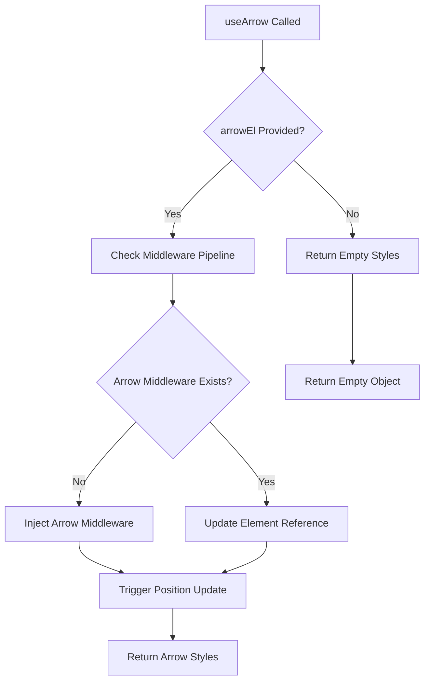

# Auto-Register Arrow Middleware Design

## Overview

This design outlines the refactoring of the `useArrow` composable to automatically register the arrow middleware with the floating context, eliminating the need for users to manually add the arrow middleware to the `middlewares` array in `useFloating`. This change will improve the developer experience by reducing boilerplate code and preventing common configuration mistakes.

## Current State Analysis

### Existing Implementation Pattern
Currently, users must perform two separate steps to use arrow functionality:

1. **Manual Middleware Registration**: Add `arrow({ element: arrowRef })` to the middlewares array
2. **Composable Usage**: Call `useArrow(context)` to get positioning styles

```typescript
// Current usage pattern
const context = useFloating(buttonRef, tooltipRef, {
  middlewares: [offset(8), flip(), shift(), arrow({ element: arrowRef })],
})

const { arrowStyles } = useArrow(context, { offset: "-4px" })
```

### Problems with Current Approach
- **Developer Experience**: Requires understanding of both middleware system and composable usage
- **Error Prone**: Easy to forget middleware registration or pass wrong element reference
- **Duplicated Configuration**: Arrow element reference must be provided in two places
- **Coupling Issues**: The arrow middleware and useArrow composable are tightly coupled but configured separately

## Architecture Design

### Core Concept: Context Mutation Strategy

The auto-registration will be implemented through a **context mutation pattern** where `useArrow` will dynamically modify the floating context's middleware pipeline when an arrow element is provided.



### Enhanced useArrow Signature

The composable will accept an optional arrow element reference and automatically handle middleware registration:

```typescript
export interface UseArrowOptions {
  /**
   * Reference to the arrow DOM element
   * When provided, automatically registers arrow middleware
   */
  element?: Ref<HTMLElement | null>
  
  /**
   * Arrow offset from floating element edge
   * @default '-4px'
   */
  offset?: string
  
  /**
   * Padding around arrow element
   */
  padding?: Padding
}

export function useArrow(
  context: FloatingContext, 
  options: UseArrowOptions = {}
): UseArrowReturn
```

## Implementation Strategy

### 1. Context Extension for Middleware Management

Extend `FloatingContext` to support dynamic middleware manipulation:

```typescript
interface FloatingContext {
  // ... existing properties
  
  /**
   * Internal middleware registry for dynamic management
   */
  _middlewareRegistry?: Map<string, Middleware>
  
  /**
   * Add or update middleware in the pipeline
   */
  _addMiddleware?: (middleware: Middleware) => void
  
  /**
   * Remove middleware from pipeline
   */
  _removeMiddleware?: (name: string) => void
}
```

### 2. Enhanced useFloating Implementation

Modify `useFloating` to support dynamic middleware management:

```typescript
export function useFloating(
  anchorEl: Ref<AnchorElement>,
  floatingEl: Ref<FloatingElement>,
  options: UseFloatingOptions = {}
): FloatingContext {
  // Existing implementation...
  
  // Dynamic middleware management
  const middlewareRegistry = new Map<string, Middleware>()
  const dynamicMiddlewares = ref<Middleware[]>([])
  
  // Initialize with static middlewares
  if (options.middlewares) {
    options.middlewares.forEach(middleware => {
      middlewareRegistry.set(middleware.name, middleware)
    })
    dynamicMiddlewares.value = [...options.middlewares]
  }
  
  const addMiddleware = (middleware: Middleware) => {
    middlewareRegistry.set(middleware.name, middleware)
    
    // Find insertion point (arrows should be last)
    const insertIndex = dynamicMiddlewares.value.findIndex(m => m.name === 'arrow')
    if (insertIndex !== -1) {
      dynamicMiddlewares.value[insertIndex] = middleware
    } else {
      dynamicMiddlewares.value.push(middleware)
    }
    
    // Trigger re-computation
    if (open.value) {
      nextTick(() => update())
    }
  }
  
  const removeMiddleware = (name: string) => {
    middlewareRegistry.delete(name)
    const index = dynamicMiddlewares.value.findIndex(m => m.name === name)
    if (index !== -1) {
      dynamicMiddlewares.value.splice(index, 1)
      if (open.value) {
        nextTick(() => update())
      }
    }
  }
  
  // Use dynamic middlewares in computePosition
  const computePositionCall = () => computePosition(anchorEl.value, floatingEl.value, {
    // ... other options
    middleware: dynamicMiddlewares.value,
  })
  
  // Return enhanced context
  return {
    // ... existing properties
    _middlewareRegistry: middlewareRegistry,
    _addMiddleware: addMiddleware,
    _removeMiddleware: removeMiddleware,
  }
}
```

### 3. Refactored useArrow Implementation

Transform `useArrow` to handle automatic middleware registration:

```typescript
export function useArrow(
  context: FloatingContext, 
  options: UseArrowOptions = {}
): UseArrowReturn {
  const { element, offset = "-4px", padding } = options
  const { middlewareData, placement } = context
  
  // Auto-register arrow middleware when element is provided
  watchEffect(() => {
    if (element && context._addMiddleware) {
      const arrowMiddleware = arrow({ element, padding })
      context._addMiddleware(arrowMiddleware)
    }
    
    // Cleanup when element becomes null or component unmounts
    onScopeDispose(() => {
      if (context._removeMiddleware) {
        context._removeMiddleware('arrow')
      }
    })
  })
  
  // Existing positioning logic
  const arrowX = computed(() => middlewareData.value.arrow?.x ?? 0)
  const arrowY = computed(() => middlewareData.value.arrow?.y ?? 0)
  
  const arrowStyles = computed(() => {
    // Only compute styles if element exists and middleware data is available
    if (!element?.value || !middlewareData.value.arrow) {
      return {}
    }
    
    // Existing style calculation logic...
    const side = toValue(placement).split("-")[0] as "top" | "bottom" | "left" | "right"
    const x = arrowX.value
    const y = arrowY.value
    
    // Position calculation based on placement...
  })
  
  return {
    arrowX,
    arrowY,
    arrowStyles,
  }
}
```

## Migration Strategy

### Backward Compatibility Approach

The implementation will maintain full backward compatibility:

1. **Existing Usage**: Users can continue using manual middleware registration
2. **New Usage**: Users can opt into auto-registration by providing element to `useArrow`
3. **Hybrid Support**: Both patterns can coexist in the same application

### Usage Pattern Evolution

```typescript
// Before: Manual registration (still supported)
const context = useFloating(buttonRef, tooltipRef, {
  middlewares: [offset(8), flip(), shift(), arrow({ element: arrowRef })],
})
const { arrowStyles } = useArrow(context)

// After: Auto-registration (new pattern)
const context = useFloating(buttonRef, tooltipRef, {
  middlewares: [offset(8), flip(), shift()],
})
const { arrowStyles } = useArrow(context, { element: arrowRef })

// Simplest: Full auto-registration
const context = useFloating(buttonRef, tooltipRef, {
  middlewares: [offset(8), flip(), shift()],
})
const { arrowStyles } = useArrow(context, { element: arrowRef })
```

## Edge Cases and Considerations

### 1. Multiple Arrow Elements
**Scenario**: Multiple `useArrow` calls with different elements
**Solution**: Last registration wins, with warning in development mode

### 2. Middleware Order Preservation  
**Scenario**: Arrow middleware must remain last in pipeline
**Solution**: Dynamic insertion logic ensures correct ordering

### 3. Performance Impact
**Scenario**: Frequent element ref changes causing re-registration
**Solution**: Debounced middleware updates and reference equality checks

### 4. SSR Compatibility
**Scenario**: Server-side rendering with null element refs
**Solution**: Graceful handling of null references with no middleware registration

## Testing Strategy

### Unit Testing Requirements

1. **Auto-Registration Tests**
   - Verify middleware injection when element provided
   - Confirm middleware removal on cleanup
   - Test backward compatibility with manual registration

2. **Edge Case Tests**  
   - Multiple useArrow instances
   - Rapid element reference changes
   - SSR scenarios with null elements

3. **Integration Tests**
   - End-to-end positioning accuracy
   - Performance benchmarks for dynamic middleware management
   - Cross-browser compatibility validation

### Test Implementation Approach

```typescript
describe('useArrow auto-registration', () => {
  test('should auto-register arrow middleware when element provided', () => {
    const context = useFloating(anchorRef, floatingRef)
    const arrowRef = ref<HTMLElement | null>(null)
    
    expect(context._middlewareRegistry?.has('arrow')).toBe(false)
    
    useArrow(context, { element: arrowRef })
    
    expect(context._middlewareRegistry?.has('arrow')).toBe(true)
  })
  
  test('should maintain backward compatibility', () => {
    const arrowRef = ref<HTMLElement | null>(null)
    const context = useFloating(anchorRef, floatingRef, {
      middlewares: [arrow({ element: arrowRef })]
    })
    
    const { arrowStyles } = useArrow(context)
    
    expect(arrowStyles.value).toBeDefined()
  })
})
```

## Implementation Timeline

### Phase 1: Core Infrastructure (Week 1)
- Extend FloatingContext with middleware management methods
- Implement dynamic middleware registration in useFloating
- Basic auto-registration in useArrow

### Phase 2: Edge Case Handling (Week 2)  
- Implement middleware order preservation
- Add performance optimizations
- Handle multiple arrow scenarios

### Phase 3: Testing & Documentation (Week 3)
- Comprehensive unit and integration tests
- Update API documentation and examples  
- Migration guide for existing users

## Benefits and Impact

### Developer Experience Improvements
- **Reduced Boilerplate**: Single composable call instead of dual configuration
- **Error Prevention**: Eliminates middleware/composable synchronization issues
- **Intuitive API**: Arrow element provided where arrow styles are needed

### Architectural Benefits
- **Loose Coupling**: Reduces dependency between middleware and composable layers
- **Flexible Usage**: Supports both manual and automatic patterns
- **Future-Proof**: Establishes pattern for other middleware auto-registration

### Performance Considerations
- **Minimal Overhead**: Dynamic registration only when element provided
- **Optimized Updates**: Batched middleware changes prevent unnecessary recalculations
- **Memory Efficient**: Automatic cleanup prevents middleware leaks
### Existing Implementation Pattern
Currently, users must perform two separate steps to use arrow functionality:

1. **Manual Middleware Registration**: Add `arrow({ element: arrowRef })` to the middlewares array
2. **Composable Usage**: Call `useArrow(context)` to get positioning styles

```typescript
// Current usage pattern
const context = useFloating(buttonRef, tooltipRef, {
  middlewares: [offset(8), flip(), shift(), arrow({ element: arrowRef })],
})

const { arrowStyles } = useArrow(context, { offset: "-4px" })
```

### Problems with Current Approach
- **Developer Experience**: Requires understanding of both middleware system and composable usage
- **Error Prone**: Easy to forget middleware registration or pass wrong element reference
- **Duplicated Configuration**: Arrow element reference must be provided in two places
- **Coupling Issues**: The arrow middleware and useArrow composable are tightly coupled but configured separately

## Architecture Design

### Core Concept: Context Mutation Strategy

The auto-registration will be implemented through a **context mutation pattern** where `useArrow` will dynamically modify the floating context's middleware pipeline when an arrow element is provided.


### Enhanced useArrow Signature

The composable will accept an optional arrow element reference and automatically handle middleware registration:

```typescript
export interface UseArrowOptions {
  /**
   * Reference to the arrow DOM element
   * When provided, automatically registers arrow middleware
   */
  element?: Ref<HTMLElement | null>
  
  /**
   * Arrow offset from floating element edge
   * @default '-4px'
   */
  offset?: string
  
  /**
   * Padding around arrow element
   */
  padding?: Padding
}

export function useArrow(
  context: FloatingContext, 
  options: UseArrowOptions = {}
): UseArrowReturn
```

## Implementation Strategy

### 1. Context Extension for Middleware Management

Extend `FloatingContext` to support dynamic middleware manipulation:

```typescript
interface FloatingContext {
  // ... existing properties
  
  /**
   * Internal middleware registry for dynamic management
   */
  _middlewareRegistry?: Map<string, Middleware>
  
  /**
   * Add or update middleware in the pipeline
   */
  _addMiddleware?: (middleware: Middleware) => void
  
  /**
   * Remove middleware from pipeline
   */
  _removeMiddleware?: (name: string) => void
}
```

### 2. Enhanced useFloating Implementation

Modify `useFloating` to support dynamic middleware management:

```typescript
export function useFloating(
  anchorEl: Ref<AnchorElement>,
  floatingEl: Ref<FloatingElement>,
  options: UseFloatingOptions = {}
): FloatingContext {
  // Existing implementation...
  
  // Dynamic middleware management
  const middlewareRegistry = new Map<string, Middleware>()
  const dynamicMiddlewares = ref<Middleware[]>([])
  
  // Initialize with static middlewares
  if (options.middlewares) {
    options.middlewares.forEach(middleware => {
      middlewareRegistry.set(middleware.name, middleware)
    })
    dynamicMiddlewares.value = [...options.middlewares]
  }
  
  const addMiddleware = (middleware: Middleware) => {
    middlewareRegistry.set(middleware.name, middleware)
    
    // Find insertion point (arrows should be last)
    const insertIndex = dynamicMiddlewares.value.findIndex(m => m.name === 'arrow')
    if (insertIndex !== -1) {
      dynamicMiddlewares.value[insertIndex] = middleware
    } else {
      dynamicMiddlewares.value.push(middleware)
    }
    
    // Trigger re-computation
    if (open.value) {
      nextTick(() => update())
    }
  }
  
  const removeMiddleware = (name: string) => {
    middlewareRegistry.delete(name)
    const index = dynamicMiddlewares.value.findIndex(m => m.name === name)
    if (index !== -1) {
      dynamicMiddlewares.value.splice(index, 1)
      if (open.value) {
        nextTick(() => update())
      }
    }
  }
  
  // Use dynamic middlewares in computePosition
  const computePositionCall = () => computePosition(anchorEl.value, floatingEl.value, {
    // ... other options
    middleware: dynamicMiddlewares.value,
  })
  
  // Return enhanced context
  return {
    // ... existing properties
    _middlewareRegistry: middlewareRegistry,
    _addMiddleware: addMiddleware,
    _removeMiddleware: removeMiddleware,
  }
}
```

### 3. Refactored useArrow Implementation

Transform `useArrow` to handle automatic middleware registration:

```typescript
export function useArrow(
  context: FloatingContext, 
  options: UseArrowOptions = {}
): UseArrowReturn {
  const { element, offset = "-4px", padding } = options
  const { middlewareData, placement } = context
  
  // Auto-register arrow middleware when element is provided
  watchEffect(() => {
    if (element && context._addMiddleware) {
      const arrowMiddleware = arrow({ element, padding })
      context._addMiddleware(arrowMiddleware)
    }
    
    // Cleanup when element becomes null or component unmounts
    onScopeDispose(() => {
      if (context._removeMiddleware) {
        context._removeMiddleware('arrow')
      }
    })
  })
  
  // Existing positioning logic
  const arrowX = computed(() => middlewareData.value.arrow?.x ?? 0)
  const arrowY = computed(() => middlewareData.value.arrow?.y ?? 0)
  
  const arrowStyles = computed(() => {
    // Only compute styles if element exists and middleware data is available
    if (!element?.value || !middlewareData.value.arrow) {
      return {}
    }
    
    // Existing style calculation logic...
    const side = toValue(placement).split("-")[0] as "top" | "bottom" | "left" | "right"
    const x = arrowX.value
    const y = arrowY.value
    
    // Position calculation based on placement...
  })
  
  return {
    arrowX,
    arrowY,
    arrowStyles,
  }
}
```

## Migration Strategy

### Backward Compatibility Approach

The implementation will maintain full backward compatibility:

1. **Existing Usage**: Users can continue using manual middleware registration
2. **New Usage**: Users can opt into auto-registration by providing element to `useArrow`
3. **Hybrid Support**: Both patterns can coexist in the same application

### Usage Pattern Evolution

```typescript
// Before: Manual registration (still supported)
const context = useFloating(buttonRef, tooltipRef, {
  middlewares: [offset(8), flip(), shift(), arrow({ element: arrowRef })],
})
const { arrowStyles } = useArrow(context)

// After: Auto-registration (new pattern)
const context = useFloating(buttonRef, tooltipRef, {
  middlewares: [offset(8), flip(), shift()],
})
const { arrowStyles } = useArrow(context, { element: arrowRef })

// Simplest: Full auto-registration
const context = useFloating(buttonRef, tooltipRef, {
  middlewares: [offset(8), flip(), shift()],
})
const { arrowStyles } = useArrow(context, { element: arrowRef })
```

## Edge Cases and Considerations

### 1. Multiple Arrow Elements
**Scenario**: Multiple `useArrow` calls with different elements
**Solution**: Last registration wins, with warning in development mode

### 2. Middleware Order Preservation  
**Scenario**: Arrow middleware must remain last in pipeline
**Solution**: Dynamic insertion logic ensures correct ordering

### 3. Performance Impact
**Scenario**: Frequent element ref changes causing re-registration
**Solution**: Debounced middleware updates and reference equality checks

### 4. SSR Compatibility
**Scenario**: Server-side rendering with null element refs
**Solution**: Graceful handling of null references with no middleware registration

## Testing Strategy

### Unit Testing Requirements

1. **Auto-Registration Tests**
   - Verify middleware injection when element provided
   - Confirm middleware removal on cleanup
   - Test backward compatibility with manual registration

2. **Edge Case Tests**  
   - Multiple useArrow instances
   - Rapid element reference changes
   - SSR scenarios with null elements

3. **Integration Tests**
   - End-to-end positioning accuracy
   - Performance benchmarks for dynamic middleware management
   - Cross-browser compatibility validation

### Test Implementation Approach

```typescript
describe('useArrow auto-registration', () => {
  test('should auto-register arrow middleware when element provided', () => {
    const context = useFloating(anchorRef, floatingRef)
    const arrowRef = ref<HTMLElement | null>(null)
    
    expect(context._middlewareRegistry?.has('arrow')).toBe(false)
    
    useArrow(context, { element: arrowRef })
    
    expect(context._middlewareRegistry?.has('arrow')).toBe(true)
  })
  
  test('should maintain backward compatibility', () => {
    const arrowRef = ref<HTMLElement | null>(null)
    const context = useFloating(anchorRef, floatingRef, {
      middlewares: [arrow({ element: arrowRef })]
    })
    
    const { arrowStyles } = useArrow(context)
    
    expect(arrowStyles.value).toBeDefined()
  })
})
```

## Implementation Timeline

### Phase 1: Core Infrastructure (Week 1)
- Extend FloatingContext with middleware management methods
- Implement dynamic middleware registration in useFloating
- Basic auto-registration in useArrow

### Phase 2: Edge Case Handling (Week 2)  
- Implement middleware order preservation
- Add performance optimizations
- Handle multiple arrow scenarios

### Phase 3: Testing & Documentation (Week 3)
- Comprehensive unit and integration tests
- Update API documentation and examples  
- Migration guide for existing users

## Benefits and Impact

### Developer Experience Improvements
- **Reduced Boilerplate**: Single composable call instead of dual configuration
- **Error Prevention**: Eliminates middleware/composable synchronization issues
- **Intuitive API**: Arrow element provided where arrow styles are needed

### Architectural Benefits
- **Loose Coupling**: Reduces dependency between middleware and composable layers
- **Flexible Usage**: Supports both manual and automatic patterns
- **Future-Proof**: Establishes pattern for other middleware auto-registration

### Performance Considerations
- **Minimal Overhead**: Dynamic registration only when element provided
- **Optimized Updates**: Batched middleware changes prevent unnecessary recalculations
- **Memory Efficient**: Automatic cleanup prevents middleware leaks


