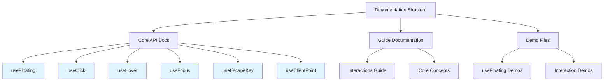
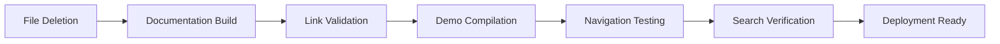

# useDismiss Documentation and Demo Cleanup

## Overview

This design outlines the cleanup process for removing all references to the `useDismiss` composable from the VFloat codebase documentation and demo files. The `useDismiss` composable has been removed from the codebase implementation but documentation and demo files still reference it, creating inconsistencies and broken examples.

## Repository Type

**Frontend Component Library** - VFloat is a Vue 3 library for positioning floating UI elements with composable-based architecture.

## Architecture

### Current State Analysis

The analysis reveals that while `useDismiss` has been removed from the actual implementation, it remains referenced in:

1. **Documentation Files**

   - `/docs/api/use-dismiss.md` - Complete API documentation page
   - `/docs/.vitepress/config.mts` - Sidebar navigation configuration
   - `/docs/guide/interactions.md` - Usage examples and guides

2. **Demo Files**

   - `/docs/demos/use-dismiss/` directory containing 4 demo files
   - Referenced in other demo files for interaction examples

3. **Cross-References**
   - Various markdown files mentioning useDismiss in examples
   - Import statements in demo components

### Target Architecture



## Cleanup Strategy

### Component Removal Plan

| Component                     | Action                   | Rationale                               |
| ----------------------------- | ------------------------ | --------------------------------------- |
| `use-dismiss.md`              | Delete entire file       | No longer exists in codebase            |
| `use-dismiss/` demo directory | Delete entire directory  | Demos reference non-existent composable |
| VitePress sidebar entry       | Remove navigation link   | Prevent 404 errors                      |
| Cross-references              | Update with alternatives | Maintain functionality guidance         |

### Alternative Patterns

The functionality previously provided by `useDismiss` is now handled through:

1. **useEscapeKey** - For escape key dismissal
2. **useClick with outsideClick option** - For outside click dismissal
3. **Manual event handling** - For custom dismissal logic

### Migration Examples

#### Before (useDismiss):

```typescript
import { useFloating, useDismiss } from "v-float"

const context = useFloating(anchorEl, floatingEl)
useDismiss(context, {
  escapeKey: true,
  outsidePress: true,
})
```

#### After (Replacement Pattern):

```typescript
import { useFloating, useClick, useEscapeKey } from "v-float"

const context = useFloating(anchorEl, floatingEl)
useClick(context, { outsideClick: true })
useEscapeKey(context, { onEscape: () => context.setOpen(false) })
```

## File Operations Matrix

### Files to Delete

| File Path                                          | Type           | Size  | Dependencies |
| -------------------------------------------------- | -------------- | ----- | ------------ |
| `/docs/api/use-dismiss.md`                         | Documentation  | 7.4KB | None         |
| `/docs/demos/use-dismiss/index.ts`                 | Demo Export    | 0.2KB | None         |
| `/docs/demos/use-dismiss/UseDismissBasicUsage.vue` | Demo Component | 0.8KB | v-float      |
| `/docs/demos/use-dismiss/UseDismissModal.vue`      | Demo Component | 4.1KB | v-float      |
| `/docs/demos/use-dismiss/UseDismissPopover.vue`    | Demo Component | 6.2KB | v-float      |

### Files to Modify

| File Path                                  | Modification Type         | Scope                      |
| ------------------------------------------ | ------------------------- | -------------------------- |
| `/docs/.vitepress/config.mts`              | Remove sidebar entry      | Line 69                    |
| `/docs/guide/interactions.md`              | Update examples           | Multiple sections          |
| `/docs/demos/use-floating/Interaction.vue` | Replace useDismiss import | Import statement and usage |

### Configuration Updates

#### VitePress Sidebar Configuration

**Current Navigation Structure:**

```typescript
{
  text: "Interactions",
  collapsed: true,
  items: [
    { text: "useClick", link: "/api/use-click" },
    { text: "useHover", link: "/api/use-hover" },
    { text: "useDismiss", link: "/api/use-dismiss" }, // Remove this
    { text: "useFocus", link: "/api/use-focus" },
    { text: "useClientPoint", link: "/api/use-client-point" },
    { text: "useEscapeKey", link: "/api/use-escape-key" },
  ],
}
```

**Updated Navigation Structure:**

```typescript
{
  text: "Interactions",
  collapsed: true,
  items: [
    { text: "useClick", link: "/api/use-click" },
    { text: "useHover", link: "/api/use-hover" },
    { text: "useFocus", link: "/api/use-focus" },
    { text: "useClientPoint", link: "/api/use-client-point" },
    { text: "useEscapeKey", link: "/api/use-escape-key" },
  ],
}
```

## Documentation Updates

### Interaction Guide Modifications

The `/docs/guide/interactions.md` file contains multiple references to `useDismiss` that need replacement:

1. **Replace useDismiss examples** with equivalent patterns using `useClick` + `useEscapeKey`
2. **Update import statements** to remove useDismiss references
3. **Modify explanatory text** to reflect current composable architecture

### Demo Replacement Strategy

Instead of simply deleting useDismiss demos, create equivalent examples using current composables:

| Original Demo | Replacement Pattern                                   |
| ------------- | ----------------------------------------------------- |
| BasicUsage    | useClick with outsideClick + useEscapeKey             |
| Modal         | Custom modal with useEscapeKey + manual outside click |
| Popover       | useClick + useEscapeKey combination                   |

## Testing Strategy

### Documentation Validation

1. **Link Checking**

   - Verify no broken internal links after removal
   - Ensure all navigation items resolve correctly
   - Test demo component imports

2. **Example Verification**

   - Validate all code examples compile without errors
   - Ensure replacement patterns provide equivalent functionality
   - Test interactive demos work as expected

3. **Search Validation**
   - Verify no remaining useDismiss references in documentation
   - Check for orphaned import statements
   - Validate consistent terminology usage

### Build Verification



## Implementation Priority

### Phase 1: Core Cleanup

1. Delete `/docs/api/use-dismiss.md`
2. Remove useDismiss from VitePress sidebar
3. Delete `/docs/demos/use-dismiss/` directory

### Phase 2: Reference Updates

1. Update `/docs/guide/interactions.md` examples
2. Modify remaining demo files with useDismiss imports
3. Replace with equivalent patterns

### Phase 3: Validation

1. Build documentation to check for errors
2. Validate all links and navigation
3. Test demo functionality

## Maintenance Considerations

### Prevention Strategy

To prevent similar documentation drift:

1. **Automated Link Checking** - Implement CI checks for broken links
2. **API Documentation Sync** - Ensure documentation updates accompany code changes
3. **Demo Dependency Validation** - Check demo imports against actual exports

### Documentation Standards

- **Consistency Requirement**: All examples must use currently available composables
- **Migration Notes**: When composables are deprecated, provide clear migration paths
- **Version Alignment**: Documentation should reflect the current codebase state
