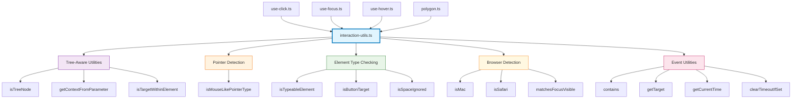
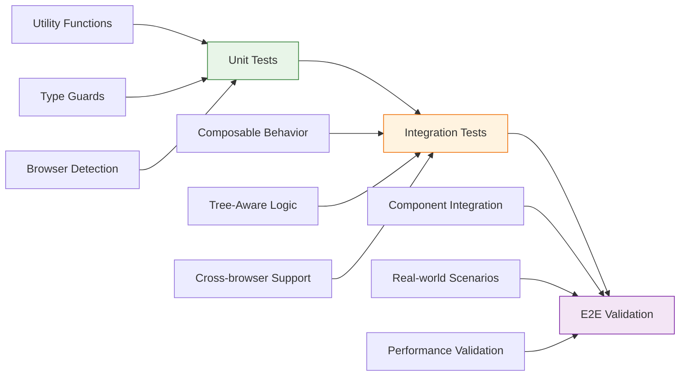

# Composable Utils Extraction Design

## Overview

This design addresses code duplication in the interaction composables by extracting shared helper functions into a centralized utility module. Currently, several utility functions are duplicated across `use-click.ts`, `use-focus.ts`, `use-hover.ts`, and `polygon.ts`, leading to maintenance overhead and potential inconsistencies.

## Current State Analysis

### Repository Type

**Frontend Component Library** - Vue 3 composable library for floating UI elements with TypeScript support.

### Identified Duplicate Functions

#### Tree-Aware Context Helpers (Exact Duplicates)

- `isTreeNode()` - Type guard for TreeNode detection
- `getContextFromParameter()` - Extracts FloatingContext from TreeNode or direct context
- `isTargetWithinElement()` - Checks element containment with VirtualElement support

**Locations**: `use-click.ts`, `use-focus.ts`, `use-hover.ts`

#### Pointer Type Detection (Minor Variations)

- `isMouseLikePointerType()` - Detects mouse/pen pointer types
  - `use-click.ts`: Supports strict mode parameter
  - `use-hover.ts`: Simple boolean return
  - `use-client-point.ts`: Supports strict mode parameter

#### Element Type Checking (Different Implementations)

- `isTypeableElement()` - Identifies input/textarea/contenteditable elements
  - `use-click.ts`: Includes contentEditable support
  - `use-focus.ts`: Limited to specific input types only

#### Browser Detection (Specific to use-focus.ts)

- `isMac()` - macOS detection for Safari focus-visible polyfill
- `isSafari()` - Safari browser detection

#### Polygon/Event Utilities (Specific to polygon.ts)

- `contains()` - Simple element containment wrapper
- `getTarget()` - Event target extraction
- `getCurrentTime()` - Performance-aware timestamp
- `clearTimeoutIfSet()` - Safe timeout cleanup

### Impact Assessment

**Code Duplication**: ~180 lines of duplicated utility code across 4 files
**Maintenance Risk**: High - Changes must be synchronized across multiple files
**Type Safety**: Inconsistent implementations may cause type conflicts
**Bundle Size**: Minimal impact (functions are small and tree-shakeable)

## Architecture



## Utility Categories & Design

### Core Tree-Aware Utilities

```typescript
// Tree context management
export function isTreeNode(
  context: FloatingContext | TreeNode<FloatingContext>
): context is TreeNode<FloatingContext>

export function getContextFromParameter(context: FloatingContext | TreeNode<FloatingContext>): {
  floatingContext: FloatingContext
  treeContext: TreeNode<FloatingContext> | null
}

// Element containment with VirtualElement support
export function isTargetWithinElement(target: Node, element: any): boolean
```

### Pointer & Input Detection

```typescript
// Unified pointer type detection with optional strict mode
export function isMouseLikePointerType(pointerType: string | undefined, strict?: boolean): boolean

// Comprehensive typeable element detection
export function isTypeableElement(element: Element | null): boolean

// Button element identification
export function isButtonTarget(event: KeyboardEvent): boolean

// Space key handling logic
export function isSpaceIgnored(element: Element | null): boolean
```

### Browser Environment Detection

```typescript
// macOS detection for Safari focus-visible polyfill
export function isMac(): boolean

// Safari browser detection
export function isSafari(): boolean

// Focus-visible matching utility
export function matchesFocusVisible(element: Element): boolean
```

### Event & Timing Utilities

```typescript
// Element containment wrapper
export function contains(el: HTMLElement, target: Element | null): boolean

// Event target extraction
export function getTarget(event: MouseEvent | TouchEvent): Element | null

// Performance-aware timing
export function getCurrentTime(): number

// Safe timeout management
export function clearTimeoutIfSet(timeoutId: number): void
```

## File Structure

```
src/
├── composables/
│   ├── interactions/
│   │   ├── utils/                    # New utilities directory
│   │   │   ├── index.ts             # Main exports
│   │   │   ├── tree-context.ts     # Tree-aware utilities
│   │   │   ├── element-detection.ts # Element & input type detection
│   │   │   ├── browser-detection.ts # Browser environment utilities
│   │   │   └── event-utils.ts       # Event handling & timing utilities
│   │   ├── use-click.ts
│   │   ├── use-focus.ts
│   │   ├── use-hover.ts
│   │   └── polygon.ts
│   └── index.ts
└── index.ts
```

### Module Organization

#### tree-context.ts

Core utilities for tree-aware composable pattern support.

#### element-detection.ts

Element type checking, input detection, and DOM utility functions.

#### browser-detection.ts

Browser and platform detection utilities for environment-specific polyfills.

#### event-utils.ts

Event handling, timing, and lifecycle management utilities.

## Implementation Strategy

### Phase 1: Create Utility Modules

1. **Create utils directory structure**

   - `src/composables/interactions/utils/`
   - Individual utility modules by category
   - Centralized index with re-exports

2. **Extract and consolidate functions**
   - Merge different implementations (e.g., `isMouseLikePointerType`)
   - Preserve backward compatibility
   - Add comprehensive JSDoc documentation

### Phase 2: Update Composables

1. **Replace duplicated functions with imports**

   - Remove function definitions from composable files
   - Add imports from utility modules
   - Verify functionality remains unchanged

2. **Update exports**
   - Export utilities through `interactions/index.ts`
   - Maintain composable-focused exports in main index

### Phase 3: Testing & Validation

1. **Unit test coverage**

   - Test each utility function in isolation
   - Verify behavior matches original implementations
   - Test edge cases and TypeScript types

2. **Integration testing**
   - Ensure composables work with extracted utilities
   - Validate tree-aware behavior
   - Test browser compatibility

## Migration Considerations

### Backward Compatibility

- All existing composable APIs remain unchanged
- Internal function extraction is transparent to consumers
- No breaking changes to public interfaces

### Performance Impact

- Minimal bundle size change (utilities are tree-shakeable)
- No runtime performance impact
- Potential build-time benefits from reduced duplication

### Type Safety

- Maintain strict TypeScript typing
- Ensure generic type parameters work correctly
- Preserve tree-aware type inference

### Testing Strategy



## Benefits

### Code Quality

- **DRY Principle**: Eliminates ~180 lines of duplicated code
- **Single Source of Truth**: Centralized utility implementations
- **Consistency**: Uniform behavior across all composables
- **Maintainability**: Changes in one location affect all usage

### Developer Experience

- **Discoverability**: Clear utility categorization and documentation
- **Reusability**: Utilities available for future composables
- **Type Safety**: Consistent TypeScript definitions
- **Testing**: Isolated unit tests for utility functions

### Library Architecture

- **Modularity**: Clean separation between composable logic and utilities
- **Extensibility**: Easy to add new utilities as needed
- **Tree-shaking**: Maintains optimal bundle size
- **Documentation**: Comprehensive utility API reference
