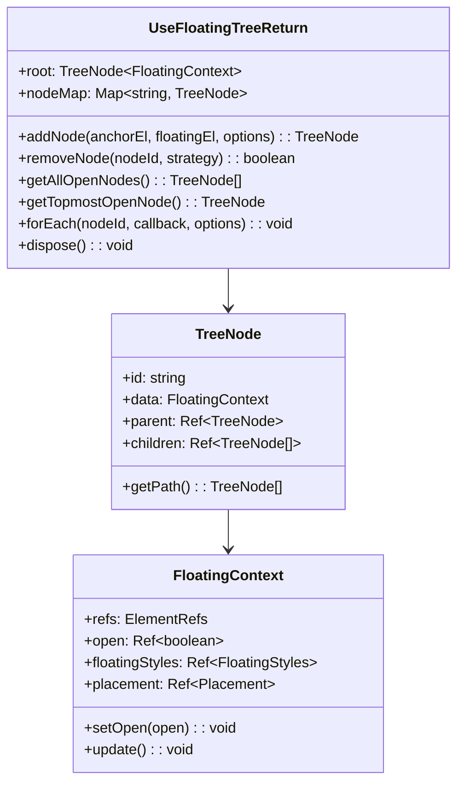
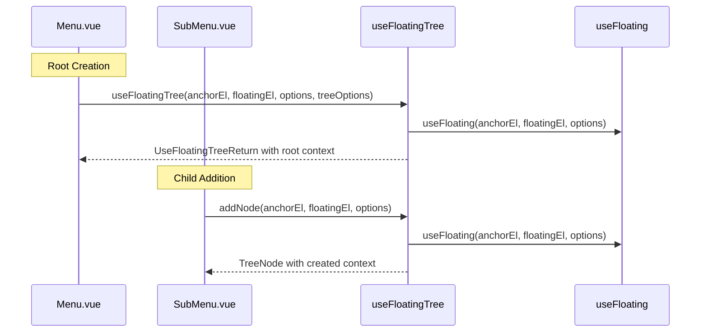
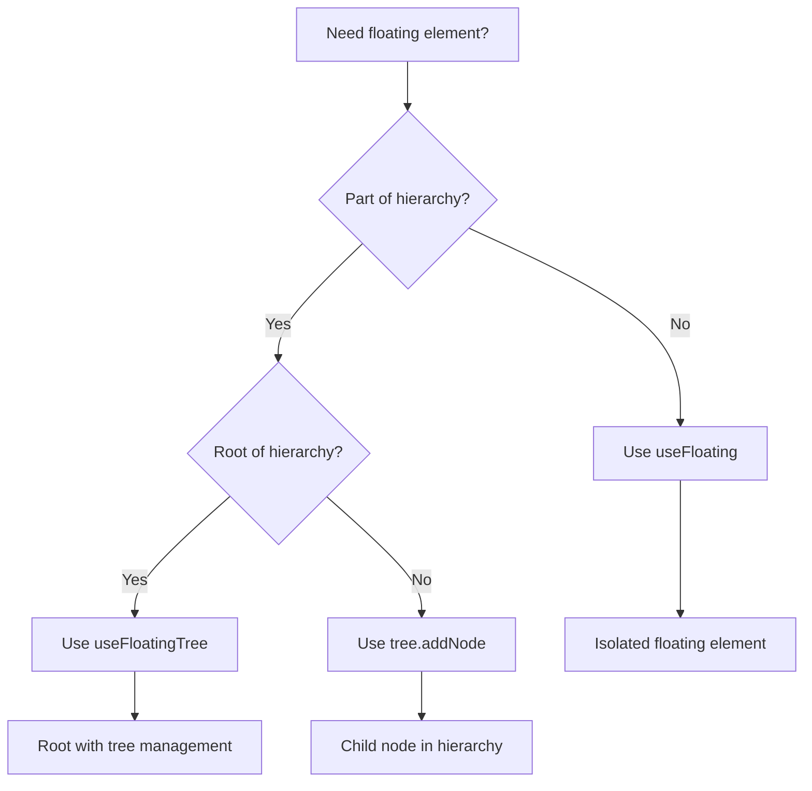

# Floating Tree API Refactor Design

## Overview

This design refactors the VFloat floating tree API to eliminate redundant `useFloating` calls when building hierarchical structures. The current implementation requires users to call `useFloating` to create a context and then separately call `tree.addNode(context, parentId)`, leading to repetitive code and unclear separation between isolated and hierarchical use cases.

## Technology Stack & Dependencies

- **Vue 3**: Composition API for reactivity
- **@floating-ui/dom**: Core positioning engine
- **TypeScript**: Type safety and developer experience
- **Existing Middleware**: arrow, offset, flip, shift

## Current API Problems

### Redundant Calls

```typescript
// Current: Redundant useFloating + addNode calls
const context = useFloating(anchorEl, floatingEl, options)
const node = tree.addNode(context, parentId)
```

### Unclear Separation

- No clear distinction between isolated floating elements and hierarchical structures
- Users must understand when to use `useFloating` vs tree methods
- Provide/inject pattern creates complex dependency chains

### Inconsistent Element Creation

- Root nodes use `useFloatingTree(context)` requiring pre-created context
- Child nodes require separate `useFloating` + `addNode` calls

## Proposed API Design

### New Signatures

#### Root Tree Creation

```typescript
function useFloatingTree(
  anchorEl: Ref<AnchorElement>,
  floatingEl: Ref<FloatingElement>,
  options: UseFloatingOptions = {},
  treeOptions: FloatingTreeOptions = {}
): UseFloatingTreeReturn
```

#### Enhanced Node Addition

```typescript
interface UseFloatingOptions {
  // ... existing options
  parentId?: string | null // New: parent node ID for tree hierarchy
}

interface UseFloatingTreeReturn {
  // Clean addNode signature with parentId in options
  addNode(
    anchorEl: Ref<AnchorElement>,
    floatingEl: Ref<FloatingElement>,
    options?: UseFloatingOptions
  ): TreeNode<FloatingContext>
}
```

## Architecture Changes

### Enhanced Tree Structure



### API Flow Diagram



## Implementation Details

### Enhanced useFloatingTree Function

```typescript
export function useFloatingTree(
  anchorEl: Ref<AnchorElement>,
  floatingEl: Ref<FloatingElement>,
  options: UseFloatingOptions = {},
  treeOptions: FloatingTreeOptions = {}
): UseFloatingTreeReturn {
  // Create root floating context internally
  const rootContext = useFloating(anchorEl, floatingEl, options)

  // Initialize tree with root context
  const tree = new Tree(rootContext, treeOptions)

  // Clean addNode implementation with parentId in options
  const addNode = (
    anchorEl: Ref<AnchorElement>,
    floatingEl: Ref<FloatingElement>,
    options: UseFloatingOptions = {}
  ): TreeNode<FloatingContext> => {
    // Extract parentId from options
    const { parentId, ...floatingOptions } = options

    // Create floating context internally
    const context = useFloating(anchorEl, floatingEl, floatingOptions)
    return tree.addNode(context, parentId)
  }

  return {
    ...tree,
    addNode,
    // Root context is accessible via tree.root.data
    get rootContext() {
      return rootContext
    },
  }
}
```

## Component Updates

### Menu.vue Refactor

#### Before (Current Implementation)

```typescript
const context = useFloating(anchorEl, floatingEl, {
  placement: "bottom-start",
  open: isOpen,
  middlewares: [offset(5), flip(), shift({ padding: 5 })],
})

const tree = useFloatingTree(context, { deleteStrategy: "recursive" })
provide<UseFloatingTreeReturn>("floatingTree", tree)
provide<string>("currentMenuId", tree.root.id)
```

#### After (New Implementation)

```typescript
// Direct tree creation and reference - no provide/inject
const tree = useFloatingTree(
  anchorEl,
  floatingEl,
  {
    placement: "bottom-start",
    open: isOpen,
    middlewares: [offset(5), flip(), shift({ padding: 5 })],
  },
  { deleteStrategy: "recursive" }
)

// Access root context via tree.rootContext if needed
const { floatingStyles } = tree.rootContext
```

### SubMenu.vue Refactor

#### Before (Current Implementation)

```typescript
const tree = inject<UseFloatingTreeReturn>("floatingTree")
const parentMenuId = inject<string>("currentMenuId")

const context = useFloating(anchorEl, floatingEl, {
  placement: "right-start",
  open: isOpen,
  middlewares: [offset(5), flip(), shift({ padding: 5 })],
})
const node = tree?.addNode(context, parentMenuId)!
```

#### After (New Implementation)

```typescript
// Remove provide/inject pattern - use direct tree reference
const node = tree.addNode(anchorEl, floatingEl, {
  placement: "right-start",
  open: isOpen,
  middlewares: [offset(5), flip(), shift({ padding: 5 })],
  parentId: parentId, // Parent ID in options
})

// Access floating context via node.data
const { floatingStyles } = node.data
```

## Clear Separation Guidelines

### Use Cases Matrix

| Scenario              | API to Use        | Rationale                         |
| --------------------- | ----------------- | --------------------------------- |
| Standalone tooltip    | `useFloating`     | Isolated element, no hierarchy    |
| Single modal/popover  | `useFloating`     | Independent floating element      |
| Root menu creation    | `useFloatingTree` | Starting a hierarchical structure |
| Submenu creation      | `tree.addNode`    | Adding to existing hierarchy      |
| Nested dropdown items | `tree.addNode`    | Part of hierarchical structure    |

### Decision Tree



## Migration Strategy

### Breaking Changes Implementation

- Replace `useFloatingTree(context)` with `useFloatingTree(anchorEl, floatingEl, options, treeOptions)`
- Replace `addNode(context, parentId)` with `addNode(anchorEl, floatingEl, options)` where `options.parentId` specifies parent
- Remove provide/inject pattern in favor of direct tree reference passing
- Update all components to use new element-based signatures

### Component Migration

- Update Menu.vue to use new `useFloatingTree` signature
- Update SubMenu.vue to use new `addNode` signature and direct tree reference
- Remove provide/inject dependencies
- Update all interaction composables to work with new API

## Testing Strategy

### Unit Tests

- Test new `useFloatingTree` signature creates proper tree structure
- Test `addNode` with element parameters creates contexts internally
- Test tree structure integrity with new API
- Test direct tree reference passing instead of provide/inject

### Integration Tests

- Test Menu.vue with refactored API
- Test SubMenu.vue with refactored API
- Test hierarchical structures work correctly
- Test direct tree reference patterns work properly

### Component Tests

- Test nested menu scenarios
- Test opening/closing behaviors
- Test cleanup and disposal
- Test edge cases (null refs, missing parents)

## Benefits

### Reduced Boilerplate

- Eliminates redundant `useFloating` calls for tree nodes
- Single function call creates floating context and adds to tree
- Clearer intent when building hierarchical structures

### Better API Design

- Clear separation: `useFloating` for isolated, tree methods for hierarchical
- Consistent element-based parameters across APIs
- Internal context creation reduces user cognitive load

### Improved Developer Experience

- Type-safe overloaded signatures
- Better autocomplete and IDE support
- Fewer imports needed for common hierarchical patterns

### Clean API Design

- No legacy code to maintain or deprecate
- Consistent element-based parameters across all APIs
- Simplified mental model with clear separation of concerns
