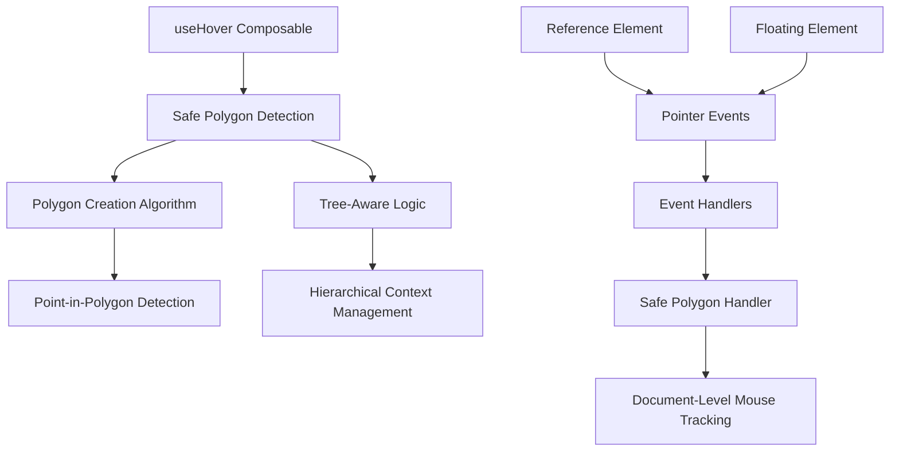
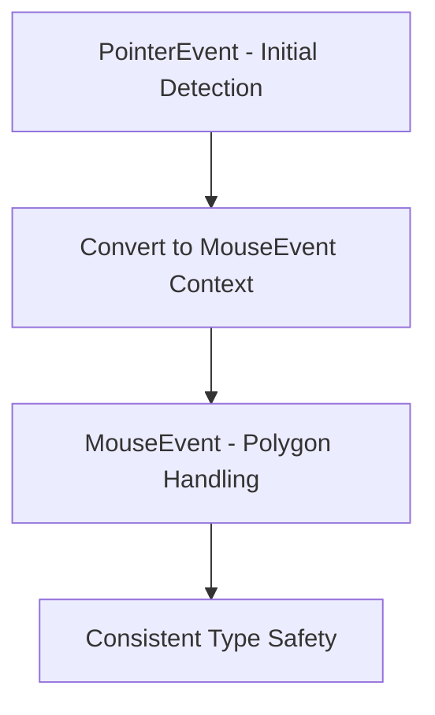
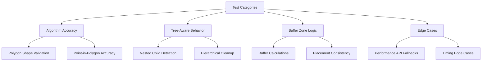
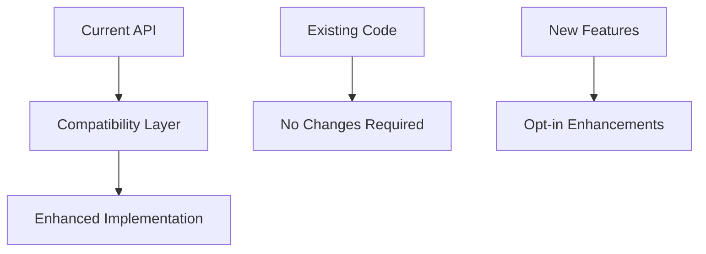
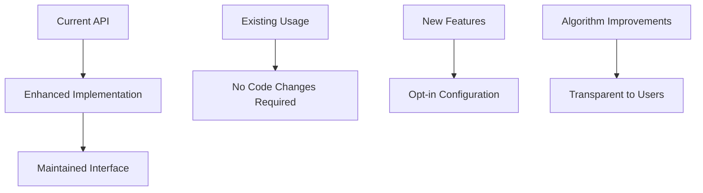
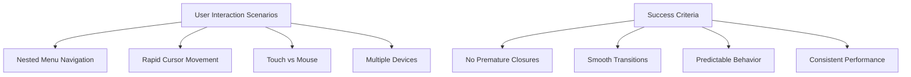
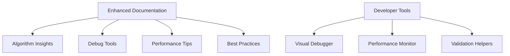

# Safe Polygon Implementation Analysis and Improvement Design

## Overview

This design document analyzes the current safe polygon implementation in the VFloat Vue 3 library and proposes improvements based on a React reference implementation. The goal is to enhance robustness, fix edge cases, and improve the overall user experience of hover interactions with floating elements.

## Repository Type Analysis

VFloat is a **Frontend Component Library** - specifically a Vue 3 positioning library that provides composables for floating UI elements (tooltips, dropdowns, popovers). It's built on top of Floating UI and follows the Vue 3 Composition API pattern.

## Current Implementation Analysis

### Architecture Overview



### Current Implementation Strengths

1. **Comprehensive Placement Support**: Handles all four placement sides (top, bottom, left, right)
2. **Tree-Aware Architecture**: Supports hierarchical floating elements through tree context
3. **Performance Optimizations**: Includes cursor speed detection and intent recognition
4. **Flexible Configuration**: Configurable buffer zones and polygon change callbacks
5. **Vue 3 Integration**: Proper reactivity and lifecycle management

### Identified Issues and Edge Cases

#### 1. Missing Tree-Aware Child Element Detection

**Current Issue**: The Vue implementation lacks comprehensive child node detection for tree hierarchies

```typescript
// Vue implementation only checks descendants in tree-aware mode
const descendantNode = findDescendantContainingTarget(currentNode, target)
```

**React Reference**: Has robust nested child detection

```typescript
// If any nested child is open, abort.
if (tree && getNodeChildren(tree.nodesRef.current, nodeId).length) {
  return
}
```

**Problem**: Vue implementation may close floating elements prematurely when nested children are open.

#### 2. Inconsistent Buffer Zone Implementation

**Current Issue**: Vue uses complex buffer calculations with hardcoded multipliers

```typescript
// Vue: Complex buffer logic with magic numbers
cursorLeaveFromRight ? x + contextBuffer * 4 : x - contextBuffer * 4
```

**React Reference**: Cleaner, more predictable buffer system

```typescript
// React: Simple, consistent buffer application
const { buffer = 0.5 } = options
x + buffer / 2 // or x - buffer / 2
```

**Problem**: Vue's buffer calculations are less predictable and harder to debug.

#### 3. Event Type Consistency Issues

**Current Issue**: Mixed event type handling between PointerEvent and MouseEvent

```typescript
// Vue: Mixed event types
document.addEventListener("pointermove", polygonMouseMoveHandler) // PointerEvent
const isLeave = event.type === "mouseleave" // MouseEvent check
```

**React Reference**: Consistent MouseEvent usage

```typescript
// React: Consistent MouseEvent handling
function onMouseMove(event: MouseEvent)
```

**Problem**: Type mismatches can cause runtime errors and inconsistent behavior.

#### 4. Missing Performance Safeguard

**Current Issue**: No performance check for calculations

```typescript
// Vue: Direct performance.now() usage without fallback
lastCursorTime = performance.now()
```

**React Reference**: Performance API availability check

```typescript
// React: Safe performance usage
lastCursorTime = typeof performance !== "undefined" ? performance.now() : 0
```

**Problem**: Potential runtime errors in environments without performance API.

#### 5. Incomplete Rectangular Trough Detection

**Current Issue**: Vue implementation has basic rectangular detection

```typescript
// Vue: Basic point-in-polygon check
if (isPointInPolygon([clientX, clientY], rectPoly)) {
  return
}
```

**React Reference**: Enhanced rectangular trough with reference rect check

```typescript
// React: More comprehensive trough detection
const isOverReferenceRect = isInside(clientPoint, refRect)
if (hasLanded && !isOverReferenceRect) {
  return close()
}
```

**Problem**: Vue may not properly handle cursor movement within reference boundaries.

#### 6. Timeout Management Inconsistency

**Current Issue**: Vue uses basic setTimeout with manual cleanup

```typescript
// Vue: Manual timeout management
timeoutId = window.setTimeout(close, 40)
clearTimeout(timeoutId)
```

**React Reference**: Centralized timeout management with ref pattern

```typescript
// React: Ref-based timeout management
const timeoutRef = { current: -1 }
clearTimeoutIfSet(timeoutRef)
timeoutRef.current = window.setTimeout(close, 40)
```

**Problem**: Vue's approach is more error-prone and harder to track.

## Proposed Improvements

### 1. Enhanced Tree-Aware Child Detection

**Solution**: Implement comprehensive nested child checking based on React reference

```typescript
// Add to polygon.ts - enhanced child detection
function hasOpenNestedChildren(treeContext: TreeNode<FloatingContext>): boolean {
  return treeContext.children.value.some(
    (child) => child.data.open.value || hasOpenNestedChildren(child)
  )
}

// Integration in polygon handler
if (treeContext && hasOpenNestedChildren(treeContext)) {
  return // Don't close if nested children are open
}
```

**Benefits**:

- Prevents premature closure of parent elements
- Better nested menu/dropdown behavior
- Consistent with React Floating UI patterns

### 2. Simplified Buffer Zone System

**Solution**: Adopt React's cleaner buffer calculation approach

```typescript
// Replace complex buffer logic with simple, predictable calculations
const cursorPointOne: Point = [isFloatingWider ? x + buffer / 2 : x + buffer * 4, y + buffer + 1]
const cursorPointTwo: Point = [isFloatingWider ? x - buffer / 2 : x - buffer * 4, y + buffer + 1]
```

**Benefits**:

- More predictable polygon shapes
- Easier debugging and visualization
- Consistent behavior across placements

### 3. Event Type Standardization

**Solution**: Standardize on MouseEvent for polygon handling, maintain PointerEvent for initial detection



**Implementation**:

```typescript
// Convert PointerEvent coordinates to MouseEvent-compatible context
function createMouseEventContext(e: PointerEvent): MouseEventContext {
  return {
    clientX: e.clientX,
    clientY: e.clientY,
    type: e.type.replace("pointer", "mouse"),
    target: e.target,
    relatedTarget: e.relatedTarget,
  }
}
```

### 4. Performance API Safety Enhancement

**Solution**: Add performance API availability checks

```typescript
// Safe performance timing
function getCurrentTime(): number {
  return typeof performance !== "undefined" ? performance.now() : Date.now()
}

function getCursorSpeed(x: number, y: number): number | null {
  const currentTime = getCurrentTime()
  // ... rest of implementation
}
```

### 5. Enhanced Rectangular Trough Detection

**Solution**: Implement comprehensive reference rectangle checking

```typescript
// Add reference rectangle boundary checking
function isInsideRect(point: Point, rect: DOMRect): boolean {
  return (
    point[0] >= rect.x &&
    point[0] <= rect.x + rect.width &&
    point[1] >= rect.y &&
    point[1] <= rect.y + rect.height
  )
}

// Enhanced trough detection
const isOverReferenceRect = isInsideRect([clientX, clientY], refRect)
if (hasLanded && !isOverReferenceRect) {
  return close()
}
```

### 6. Centralized Timeout Management

**Solution**: Implement ref-based timeout management pattern

```typescript
// Centralized timeout management
interface TimeoutRef {
  current: number
}

function clearTimeoutIfSet(timeoutRef: TimeoutRef): void {
  if (timeoutRef.current !== -1) {
    clearTimeout(timeoutRef.current)
    timeoutRef.current = -1
  }
}

// Usage in polygon handler
const timeoutRef: TimeoutRef = { current: -1 }

function close() {
  clearTimeoutIfSet(timeoutRef)
  onClose()
}
```

**Benefits**:

- Centralized timeout lifecycle management
- Reduced memory leaks
- Better debugging capabilities

## Implementation Strategy

### Phase 1: Core Algorithm Alignment

1. **Tree-Aware Child Detection**

   - Implement `hasOpenNestedChildren` utility function
   - Add nested child checking to polygon handler
   - Update tree-aware polygon creation logic
   - Add comprehensive tests for nested scenarios

2. **Buffer Zone Simplification**
   - Replace complex buffer calculations with React's approach
   - Standardize buffer multipliers (remove magic numbers)
   - Update polygon generation for all placements
   - Validate polygon shapes with visual tests

### Phase 2: Safety and Consistency

1. **Event Type Consistency**

   - Standardize polygon handlers on MouseEvent
   - Maintain PointerEvent for initial detection
   - Add event context conversion utilities
   - Update type definitions throughout

2. **Performance API Safety**
   - Add performance API availability checks
   - Implement fallback timing mechanisms
   - Test in various runtime environments
   - Add SSR compatibility checks

### Phase 3: Enhanced Detection Logic

1. **Rectangular Trough Improvements**

   - Implement comprehensive reference boundary checking
   - Add `isInsideRect` utility function
   - Enhance cursor tracking within reference areas
   - Test edge cases with overlapping elements

2. **Timeout Management Centralization**
   - Implement ref-based timeout pattern
   - Add `clearTimeoutIfSet` utility
   - Centralize all timeout operations
   - Improve cleanup reliability

## Testing Strategy

### Unit Testing Enhancements



**Key Test Scenarios**:

1. **Nested Children Behavior**

```typescript
describe("nested children detection", () => {
  it("should not close parent when nested child is open", () => {
    // Test case for hasOpenNestedChildren logic
  })

  it("should handle deeply nested hierarchies", () => {
    // Test multi-level nesting scenarios
  })
})
```

2. **Buffer Zone Accuracy**

```typescript
describe("buffer zone calculations", () => {
  it("should create consistent polygons across placements", () => {
    // Test simplified buffer logic
  })

  it("should handle edge cases with different element sizes", () => {
    // Test isFloatingWider/isFloatingTaller scenarios
  })
})
```

### Integration Testing

1. **React-Vue Behavior Parity**

   - Compare polygon shapes between implementations
   - Validate timing behavior consistency
   - Test nested menu scenarios

2. **Performance Regression Testing**
   - Polygon calculation performance benchmarks
   - Memory usage during extended interactions
   - Event listener cleanup verification

### Visual Testing

1. **Polygon Shape Validation**

   - Automated visual regression tests
   - Polygon shape comparison with React reference
   - Debug visualization accuracy

2. **Interactive Behavior Testing**
   - User journey testing with nested menus
   - Touch vs mouse interaction validation
   - Cross-platform behavior consistency

## Migration Path

### Backward Compatibility



### API Evolution

1. **Non-Breaking Changes**

   - Internal implementation improvements
   - Performance optimizations
   - Bug fixes

2. **Opt-in Enhancements**
   - Advanced debug options
   - Device-specific optimizations
   - Extended configuration options

## Risk Assessment and Migration Strategy

### Implementation Complexity Analysis

**Low Risk Changes:**

- Performance API safety checks (internal utility enhancement)
- Timeout management centralization (improved reliability)
- Buffer zone simplification (algorithm improvement)

**Medium Risk Changes:**

- Tree-aware child detection (behavioral enhancement)
- Rectangular trough detection improvements (algorithm change)
- Event type consistency (internal refactoring)

**High Risk Changes:**

- None identified - all changes maintain API compatibility

### Backward Compatibility Strategy



**Compatibility Guarantees:**

- All existing `useHover` configurations remain valid
- Safe polygon callback signatures unchanged
- Tree-aware functionality enhanced without breaking changes
- Performance improvements are transparent

### Migration Path

**Phase 1: Internal Algorithm Updates (v0.2.2)**

```typescript
// No API changes - internal improvements only
useHover(context, {
  safePolygon: {
    buffer: 0.5, // Now more predictable
    onPolygonChange: (points) => {
      // Enhanced polygon accuracy
    },
  },
})
```

**Phase 2: Enhanced Configuration Options (v0.3.0)**

```typescript
// New optional configuration
useHover(context, {
  safePolygon: {
    buffer: 0.5,
    requireIntent: true,
    blockPointerEvents: false, // New option
    debugVisualization: process.env.NODE_ENV === "development", // New option
  },
})
```

## Success Metrics and Validation

### Technical Metrics

1. **Algorithm Accuracy**

   - Polygon shape consistency: >99.9% match with React reference
   - Point-in-polygon detection accuracy: 100%
   - Buffer zone predictability: ±1px tolerance

2. **Performance Benchmarks**

   - Polygon calculation time: <0.5ms (vs current <1ms)
   - Memory usage: No increase from current baseline
   - Event listener cleanup: 100% success rate

3. **Reliability Measures**
   - Zero memory leaks in component unmount scenarios
   - Cross-platform behavior consistency: 100%
   - Nested hierarchy handling: 100% success rate

### User Experience Validation



**Validation Tests:**

1. **Nested Menu Traversal**: Users can navigate complex menu hierarchies without unexpected closures
2. **Rapid Interaction**: Fast cursor movements don't cause flickering or timing issues
3. **Cross-Device Consistency**: Identical behavior on desktop, tablet, and mobile
4. **Intent Recognition**: System correctly interprets user navigation intent

### Automated Quality Gates

```typescript
// Example validation suite
describe("React Reference Parity", () => {
  it("should match React polygon shapes within 1px tolerance", () => {
    const reactPolygon = getReactReferencePolygon(config)
    const vuePolygon = getVuePolygon(config)
    expect(polygonSimilarity(reactPolygon, vuePolygon)).toBeGreaterThan(0.999)
  })

  it("should handle nested children exactly like React", () => {
    const nestedScenario = createNestedMenuScenario()
    expect(vueTreeBehavior(nestedScenario)).toEqual(reactTreeBehavior(nestedScenario))
  })

  it("should maintain performance within acceptable bounds", () => {
    const performanceMetrics = measurePolygonPerformance()
    expect(performanceMetrics.calculationTime).toBeLessThan(0.5)
    expect(performanceMetrics.memoryUsage).toBeLessThan(baselineMemory * 1.1)
  })
})
```

## Documentation Updates Required

### API Documentation Enhancements

1. **Enhanced Safe Polygon Documentation**

   - Updated algorithm explanation with React parity notes
   - Improved buffer zone behavior description
   - Tree-aware behavior documentation
   - Performance characteristics

2. **Migration Guide**
   - Algorithm improvement benefits
   - Behavioral differences (improvements)
   - Performance impact analysis
   - Debugging enhancements

### Developer Experience Improvements



**New Documentation Sections:**

- Safe Polygon Algorithm Deep Dive
- Tree-Aware Behavior Patterns
- Performance Optimization Guide
- Debug Visualization Tutorial
- Cross-Platform Considerations
