# Tree-Aware useClick Composable Enhancement

## Overview

This design addresses the critical limitation in the current `useClick` composable when working with complex nested floating UI structures (such as menus with submenus) where child elements are teleported to different DOM locations using Vue's `<Teleport>` component. The enhancement enables intelligent tree-aware click detection with hierarchical behavior:

**Key Behaviors:**

- **Descendant Protection**: A floating node does NOT close when any of its descendants are clicked
- **Ancestral Authority**: A floating node DOES close when any of its ancestors/parents are clicked
- **Outside Closure**: A floating node closes when clicked outside the entire tree
- **Sibling Isolation**: A floating node closes when any sibling nodes are clicked

**Repository Classification**: Frontend Component Library

## Practical Behavior Examples

Consider a three-level menu hierarchy: **Root Menu** → **Submenu** → **Sub-submenu**

| Action             | Root Menu     | Submenu       | Sub-submenu   | Explanation                           |
| ------------------ | ------------- | ------------- | ------------- | ------------------------------------- |
| Click Sub-submenu  | Open          | Open          | Handles Click | Descendants don't affect ancestors    |
| Click Submenu      | Open          | Handles Click | **Closes**    | Parent click closes descendants       |
| Click Root Menu    | Handles Click | **Closes**    | **Closes**    | Ancestor click closes all descendants |
| Click Outside      | **Closes**    | **Closes**    | **Closes**    | Outside click closes entire tree      |
| Click Sibling Menu | **Closes**    | **Closes**    | **Closes**    | Sibling interaction closes tree       |

```mermaid
graph TB
    subgraph "Tree Hierarchy"
        A["🍔 Root Menu"]
        A --> B["📄 Submenu"]
        B --> C["⭐ Sub-submenu"]
        A --> D["📁 Sibling Menu"]
    end

    subgraph "Click Effects"
        E["Click on ⭐"] --> F["⭐ handles it<br/>📄 stays open<br/>🍔 stays open"]
        G["Click on 📄"] --> H["📄 handles it<br/>⭐ closes<br/>🍔 stays open"]
        I["Click on 🍔"] --> J["🍔 handles it<br/>📄 closes<br/>⭐ closes"]
        K["Click on 📁"] --> L["📁 handles it<br/>🍔 tree closes"]
    end

    style F fill:#e8f5e8
    style H fill:#fff3e0
    style J fill:#fff3e0
    style L fill:#ffebee
```



## Architecture

### Current Limitation

The existing `useClick` composable relies solely on DOM containment checks (`element.contains()`) to determine whether a click occurred "inside" or "outside" the floating element hierarchy. This approach fails with teleported elements:

```mermaid
graph TB
    A[Parent Menu Container] --> B[Parent Menu]
    A --> C[Parent FloatingEl]
    D[Document Body] --> E[Teleported Submenu]

    B -.->|DOM Hierarchy| C
    C -.->|Logical Hierarchy| E
    E -.->|❌ DOM contains() fails| C

    style E fill:#ffcccc,stroke:#ff0000
    style C fill:#ccffcc,stroke:#00ff00
```

### Enhanced Tree-Aware Architecture

The solution implements dual-mode operation with automatic tree detection:


## Component Architecture

### Enhanced Function Signature

```typescript
export function useClick(
  context: FloatingContext | TreeNode<FloatingContext>,
  options: UseClickOptions = {}
): void
```

### Type Guard Implementation

```typescript
function isTreeNode(
  context: FloatingContext | TreeNode<FloatingContext>
): context is TreeNode<FloatingContext> {
  return (
    context !== null &&
    typeof context === "object" &&
    "data" in context &&
    "id" in context &&
    "children" in context &&
    "parent" in context
  )
}
```

### Tree-Aware Click Logic

The enhanced logic handles three distinct scenarios:

1. **Click on Current Node**: Toggle behavior (if enabled)
2. **Click on Descendant Node**: No action (descendant handles its own state)
3. **Click on Parent/Ancestor Node**: Close current node
4. **Click Outside Tree**: Close current node


## API Reference

### Enhanced Context Parameter

| Parameter Type              | Usage Pattern               | Behavior                                               |
| --------------------------- | --------------------------- | ------------------------------------------------------ |
| `FloatingContext`           | Standalone floating element | Standard DOM containment checks                        |
| `TreeNode<FloatingContext>` | Part of floating tree       | Tree-aware containment checks across all tree elements |

### Tree Detection Flow

```typescript
// Tree context extraction
function getContextFromParameter(context: FloatingContext | TreeNode<FloatingContext>): {
  floatingContext: FloatingContext
  treeContext: TreeNode<FloatingContext> | null
} {
  if (isTreeNode(context)) {
    return {
      floatingContext: context.data,
      treeContext: context,
    }
  }
  return {
    floatingContext: context,
    treeContext: null,
  }
}
```

### Type Definitions

```typescript
interface ClickLocation {
  type: "current-node" | "descendant-node" | "ancestor-node" | "outside-tree" | "sibling-node"
  node: TreeNode<FloatingContext> | null
}
```

### Tree-Aware Click Implementation

```typescript
function createTreeAwareClickHandler(treeNode: TreeNode<FloatingContext>) {
  return function onTreeAwareClick(event: MouseEvent) {
    const target = event.target as Node | null
    if (!target) return

    // Determine the relationship of clicked element to current node
    const clickLocation = determineClickLocation(treeNode, target)

    switch (clickLocation.type) {
      case "current-node":
        // Handle as normal click (toggle/open)
        handleCurrentNodeClick(event, treeNode.data)
        break

      case "descendant-node":
        // Do nothing - let descendant handle its own state
        break

      case "parent-node":
      case "ancestor-node":
      case "outside-tree":
      case "sibling-node":
        // Close current node
        treeNode.data.setOpen(false)
        break
    }
  }
}

function determineClickLocation(
  currentNode: TreeNode<FloatingContext>,
  target: Node
): ClickLocation {
  // Check if click is within current node's elements
  if (
    isEventTargetWithin(target, currentNode.data.refs.anchorEl.value) ||
    isEventTargetWithin(target, currentNode.data.refs.floatingEl.value)
  ) {
    return { type: "current-node", node: currentNode }
  }

  // Check if click is within any descendant
  const descendantNode = findDescendantContainingTarget(currentNode, target)
  if (descendantNode) {
    return { type: "descendant-node", node: descendantNode }
  }

  // Check if click is within any ancestor/parent
  const ancestorNode = findAncestorContainingTarget(currentNode, target)
  if (ancestorNode) {
    return { type: "ancestor-node", node: ancestorNode }
  }

  // Check if click is within any sibling
  const siblingNode = findSiblingContainingTarget(currentNode, target)
  if (siblingNode) {
    return { type: "sibling-node", node: siblingNode }
  }

  // Must be outside the tree
  return { type: "outside-tree", node: null }
}
```

### Tree Relationship Detection


## Usage Examples

### Standalone Usage (Unchanged)

```vue
<script setup>
import { useFloating, useClick } from "v-float"

const context = useFloating(anchorEl, floatingEl)
useClick(context, { outsideClick: true })
</script>
```

### Tree-Aware Usage (New)

```vue
<script setup>
import { useFloatingTree, useClick } from "v-float"

// Root menu component
const tree = useFloatingTree(rootContext)
const rootNode = tree.root
useClick(rootNode, { outsideClick: true })

// Submenu component
const submenuNode = tree.addNode(submenuContext, parentId)
useClick(submenuNode, { outsideClick: true })
</script>
```

### Complex Nested Menu Example

```vue
<template>
  <!-- Root Menu -->
  <button ref="menuTrigger">Menu</button>
  <Teleport to="body">
    <div v-if="menuOpen" ref="menuEl">
      <div @click="openSubmenu">Item with Submenu</div>
    </div>
  </Teleport>

  <!-- Submenu (Teleported) -->
  <Teleport to="body">
    <div v-if="submenuOpen" ref="submenuEl">
      <div>Submenu Item 1</div>
      <div>Submenu Item 2</div>
    </div>
  </Teleport>

  <!-- Sub-submenu (Nested Teleported) -->
  <Teleport to="body">
    <div v-if="subSubmenuOpen" ref="subSubmenuEl">
      <div>Deep Item 1</div>
      <div>Deep Item 2</div>
    </div>
  </Teleport>
</template>

<script setup>
// Tree setup
const tree = useFloatingTree(menuContext)
const menuNode = tree.root
const submenuNode = tree.addNode(submenuContext, menuNode.id)
const subSubmenuNode = tree.addNode(subSubmenuContext, submenuNode.id)

// Tree-aware click handling with hierarchical behavior:
useClick(menuNode, { outsideClick: true }) // Closes when: outside, siblings clicked
useClick(submenuNode, { outsideClick: true }) // Closes when: outside, siblings, parent menu clicked
useClick(subSubmenuNode, { outsideClick: true }) // Closes when: outside, siblings, parent submenu, root menu clicked

// Behavior examples:
// 1. Click on menuTrigger -> Opens menu, submenu stays closed
// 2. Click on submenu item -> Submenu handles it, menu stays open
// 3. Click on menu item -> Closes submenu (parent clicked), menu handles click
// 4. Click on sub-submenu -> Sub-submenu handles it, submenu and menu stay open
// 5. Click outside -> Closes all open elements
</script>
```

## Performance Considerations

### Efficient Tree Traversal

```mermaid
graph LR
    A[Click Event] --> B{Tree Mode?}
    B -->|No| C[Fast DOM Check O(1)]
    B -->|Yes| D[Tree Traversal O(n)]
    D --> E[Only Check Open Nodes]
    E --> F[Early Return on Match]

    style C fill:#c8e6c9,stroke:#4caf50
    style E fill:#fff3e0,stroke:#ff9800
```

### Optimization Strategies

1. **Early Exit**: Return immediately when target is found within any tree element
2. **Open Node Filtering**: Only traverse nodes where `open.value === true`
3. **Root Node Caching**: Cache root node reference to avoid repeated traversal
4. **Minimal Overhead**: Standalone mode has zero performance impact

### Memory Management

```typescript
// Efficient root node traversal
function getRootNode(node: TreeNode<FloatingContext>): TreeNode<FloatingContext> {
  let current = node
  while (current.parent.value !== null) {
    current = current.parent.value
  }
  return current
}

// Helper functions for tree relationship detection
function findDescendantContainingTarget(
  node: TreeNode<FloatingContext>,
  target: Node
): TreeNode<FloatingContext> | null {
  for (const child of node.children.value) {
    if (child.data.open.value) {
      if (
        isEventTargetWithin(target, child.data.refs.anchorEl.value) ||
        isEventTargetWithin(target, child.data.refs.floatingEl.value)
      ) {
        return child
      }

      // Recursively check descendants
      const descendant = findDescendantContainingTarget(child, target)
      if (descendant) return descendant
    }
  }
  return null
}

function findAncestorContainingTarget(
  node: TreeNode<FloatingContext>,
  target: Node
): TreeNode<FloatingContext> | null {
  let currentParent = node.parent.value

  while (currentParent) {
    if (currentParent.data.open.value) {
      if (
        isEventTargetWithin(target, currentParent.data.refs.anchorEl.value) ||
        isEventTargetWithin(target, currentParent.data.refs.floatingEl.value)
      ) {
        return currentParent
      }
    }
    currentParent = currentParent.parent.value
  }

  return null
}

function findSiblingContainingTarget(
  node: TreeNode<FloatingContext>,
  target: Node
): TreeNode<FloatingContext> | null {
  const parent = node.parent.value
  if (!parent) return null

  for (const sibling of parent.children.value) {
    if (sibling.id !== node.id && sibling.data.open.value) {
      if (
        isEventTargetWithin(target, sibling.data.refs.anchorEl.value) ||
        isEventTargetWithin(target, sibling.data.refs.floatingEl.value)
      ) {
        return sibling
      }
    }
  }

  return null
}
```

## Implementation Details

### Core Algorithm Enhancement

The enhancement maintains full backward compatibility while adding tree-aware capabilities:


### Integration Points

1. **Type Detection**: Seamless runtime detection of context type
2. **Event Handler Selection**: Automatic handler selection based on context
3. **Tree Root Resolution**: Efficient traversal to find tree root
4. **Node Filtering**: Performance optimization through open node filtering

## Migration Guide

### For Existing Code

No changes required - existing `useClick(floatingContext, options)` calls continue to work exactly as before.

### For New Tree-Aware Usage

```typescript
// Before: Separate composables with potential conflicts
useClick(parentContext, { outsideClick: true })
useClick(childContext, { outsideClick: true }) // Could conflict

// After: Tree-aware unified handling
useClick(parentNode, { outsideClick: true })
useClick(childNode, { outsideClick: true }) // Coordinated behavior
```

### Progressive Enhancement

```typescript
// Can gradually migrate from standalone to tree-aware
const context = useFloating(anchorEl, floatingEl)

// Phase 1: Standalone (current)
useClick(context, { outsideClick: true })

// Phase 2: Tree-aware (enhanced)
const tree = useFloatingTree(context)
const node = tree.root
useClick(node, { outsideClick: true })
```

This enhancement provides a robust solution for managing complex floating UI hierarchies while maintaining the simplicity and performance of the existing API for standalone usage.
