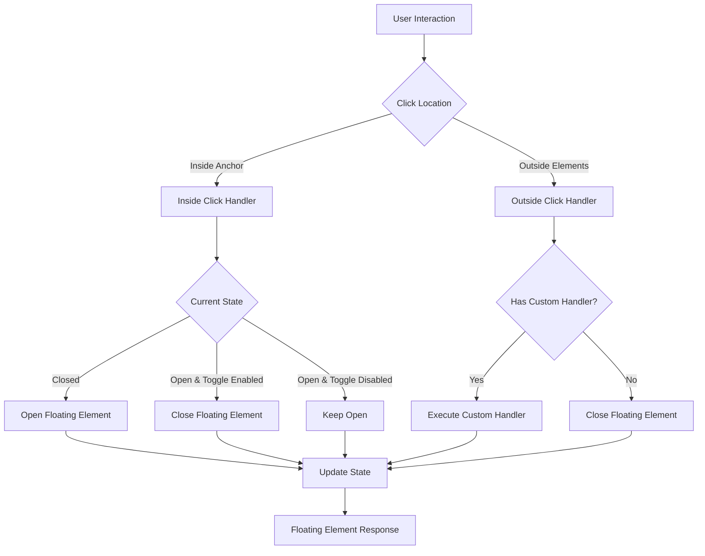
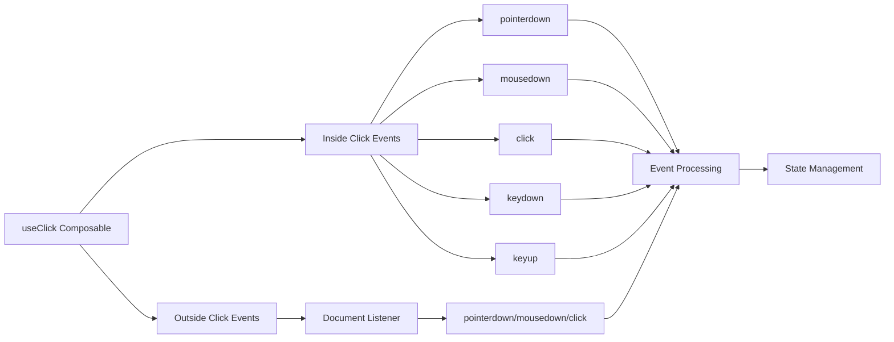
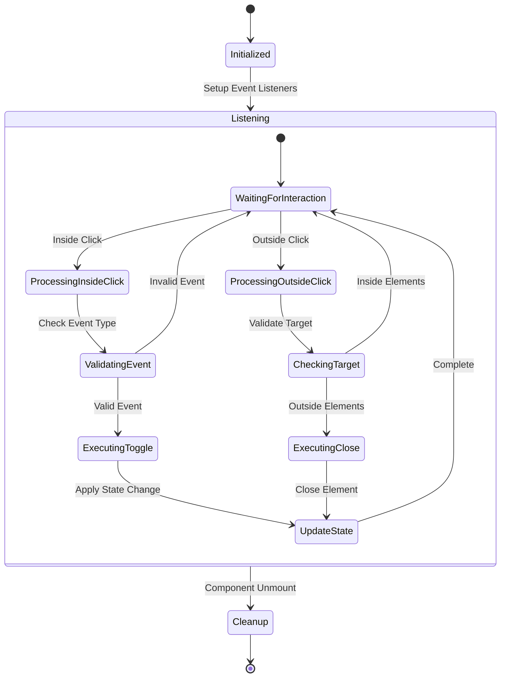

# useClick Composable Refactoring Design

## Overview

This design document outlines the refactoring of the `useClick` composable to combine the functionality of the current `useClick` implementation with `useOutsideClick`. The new unified composable will handle both inside clicks for opening/toggling floating elements and outside clicks for closing them, providing a more cohesive and simplified API for click-based interactions.

## Current State Analysis

### Existing useClick Features

- **Toggle Behavior**: Handles inside clicks to open/close floating elements
- **Event Support**: Supports `click` and `mousedown` events with pointer type discrimination
- **Keyboard Accessibility**: Handles Enter and Space key interactions
- **Input Device Filtering**: Can ignore mouse, touch, or keyboard inputs selectively
- **Button Detection**: Prevents conflicts with native button elements

### Existing useOutsideClick Features

- **Outside Click Detection**: Closes floating elements when clicking outside anchor/floating elements
- **Scrollbar Handling**: Ignores clicks on scrollbars
- **Event Options**: Supports `pointerdown`, `mousedown`, and `click` events
- **Custom Handlers**: Allows custom `onOutsideClick` callback functions
- **Drag Detection**: Handles edge cases with drag operations

## Architecture Design

### Component Interaction Flow



### Event Handler Architecture



## Interface Design

### Enhanced UseClickOptions

```typescript
interface UseClickOptions {
  // Existing inside click options
  enabled?: MaybeRefOrGetter<boolean>
  event?: MaybeRefOrGetter<"click" | "mousedown">
  toggle?: MaybeRefOrGetter<boolean>
  ignoreMouse?: MaybeRefOrGetter<boolean>
  ignoreKeyboard?: MaybeRefOrGetter<boolean>
  ignoreTouch?: MaybeRefOrGetter<boolean>

  // Enhanced outside click options
  outsideClick?: MaybeRefOrGetter<boolean>
  outsideEvent?: MaybeRefOrGetter<"pointerdown" | "mousedown" | "click">
  outsideCapture?: boolean
  onOutsideClick?: (event: MouseEvent, context: FloatingContext) => void

  // Advanced configuration
  preventScrollbarClick?: MaybeRefOrGetter<boolean>
  handleDragEvents?: MaybeRefOrGetter<boolean>
}
```

### Event Handler Structure

| Event Source   | Event Type                    | Handler Function | Purpose                                 |
| -------------- | ----------------------------- | ---------------- | --------------------------------------- |
| Anchor Element | `pointerdown`                 | `onPointerDown`  | Capture pointer type for discrimination |
| Anchor Element | `mousedown`                   | `onMouseDown`    | Handle mousedown-based interactions     |
| Anchor Element | `click`                       | `onClick`        | Handle click-based interactions         |
| Anchor Element | `keydown`                     | `onKeyDown`      | Handle Enter and Space key presses      |
| Anchor Element | `keyup`                       | `onKeyUp`        | Complete Space key interactions         |
| Document       | `pointerdown/mousedown/click` | `onOutsideClick` | Handle outside click detection          |

## Implementation Strategy

### Core Logic Flow



### Event Processing Algorithm

1. **Inside Click Processing**:

   - Capture pointer type for device discrimination
   - Validate button type (primary button only)
   - Check ignore flags (mouse, touch, keyboard)
   - Execute toggle logic based on current state
   - Handle keyboard accessibility (Enter/Space)

2. **Outside Click Processing**:

   - Listen on document for outside events
   - Check if target is within anchor or floating elements
   - Handle scrollbar click detection
   - Manage drag operation edge cases
   - Execute custom handler or default close behavior

3. **State Synchronization**:
   - Coordinate between inside and outside handlers
   - Prevent conflicting state changes
   - Ensure consistent behavior across interaction types

## Data Models

### Enhanced Context Integration

```typescript
interface FloatingClickContext extends FloatingContext {
  clickState: {
    pointerType?: PointerType
    didKeyDown: boolean
    endedOrStartedInside: boolean
    lastInteractionType: "inside" | "outside" | null
  }
}
```

### Event Handler Registry

```typescript
interface EventHandlerRegistry {
  insideHandlers: Map<string, (event: Event) => void>
  outsideHandlers: Map<string, (event: Event) => void>
  cleanup: () => void
}
```

## Testing Strategy

### Unit Test Categories

1. **Inside Click Behavior**

   - Toggle functionality with open/closed states
   - Event type discrimination (click vs mousedown)
   - Pointer type handling (mouse, touch, pen)
   - Keyboard accessibility (Enter, Space keys)
   - Input device filtering

2. **Outside Click Behavior**

   - Outside click detection and closing
   - Scrollbar click ignoring
   - Element boundary detection
   - Custom handler execution
   - Drag operation handling

3. **Integration Testing**

   - Combined inside/outside behavior
   - State consistency across interaction types
   - Event listener cleanup
   - Performance with multiple instances

4. **Edge Cases**
   - Rapid click sequences
   - Simultaneous inside/outside events
   - Element removal during interaction
   - Disabled state transitions

### Test Scenarios Matrix

| Scenario                        | Inside Click | Outside Click | Expected Result |
| ------------------------------- | ------------ | ------------- | --------------- |
| Closed → Click Inside           | ✓            | ✗             | Opens           |
| Open + Toggle → Click Inside    | ✓            | ✗             | Closes          |
| Open + No Toggle → Click Inside | ✓            | ✗             | Stays Open      |
| Open → Click Outside            | ✗            | ✓             | Closes          |
| Open → Click Scrollbar          | ✗            | ✓             | Stays Open      |
| Disabled → Any Click            | ✓/✗          | ✓/✗           | No Change       |

## Migration Strategy

### Backward Compatibility

1. **API Compatibility**: Existing `useClick` options remain unchanged
2. **Default Behavior**: Outside click functionality is disabled by default
3. **Opt-in Enhancement**: Enable outside clicks via `outsideClick: true`
4. **Deprecation Path**: Mark `useOutsideClick` as deprecated with migration guide

### Migration Steps

1. **Phase 1**: Implement unified composable with feature flags
2. **Phase 2**: Update documentation and examples
3. **Phase 3**: Provide migration utilities and warnings
4. **Phase 4**: Deprecate standalone `useOutsideClick`

### Example Migration

```typescript
// Before: Separate composables
const context = useFloating(anchorRef, floatingRef)
useClick(context, { toggle: true })
useOutsideClick(context, {
  onOutsideClick: (event) => console.log("Outside click"),
})

// After: Unified composable
const context = useFloating(anchorRef, floatingRef)
useClick(context, {
  toggle: true,
  outsideClick: true,
  onOutsideClick: (event) => console.log("Outside click"),
})
```

## Performance Considerations

### Event Listener Optimization

1. **Single Document Listener**: Use one document listener for all outside click detection
2. **Event Delegation**: Leverage event bubbling for efficient handling
3. **Conditional Attachment**: Only attach outside listeners when `outsideClick` is enabled
4. **Cleanup Management**: Proper listener removal on component unmount

### Memory Management

1. **WeakMap Usage**: Store instance-specific data to prevent memory leaks
2. **Reference Cleanup**: Clear element references when components unmount
3. **Handler Deduplication**: Reuse handler functions across instances where possible

### Performance Metrics

| Metric                   | Target             | Measurement Method       |
| ------------------------ | ------------------ | ------------------------ |
| Event Handler Attachment | < 5ms              | Performance.now() timing |
| Outside Click Detection  | < 1ms              | Event processing time    |
| Memory Usage             | < 1KB per instance | Memory profiling         |
| Bundle Size Impact       | < 2KB additional   | Bundle analysis          |

## Security Considerations

### Event Safety

1. **Input Validation**: Validate event targets and properties
2. **XSS Prevention**: Sanitize any user-provided handlers
3. **Event Isolation**: Prevent cross-component event interference
4. **Permission Checks**: Respect user agent security policies

### DOM Security

1. **Element Validation**: Verify element existence before interaction
2. **Cross-Frame Protection**: Handle iframe boundary cases
3. **Shadow DOM Support**: Ensure compatibility with shadow DOM elements
4. **Content Security**: Respect Content Security Policy restrictions

## Documentation Updates

### API Reference Updates

1. **Unified Options**: Document all available configuration options
2. **Migration Guide**: Provide clear migration path from separate composables
3. **Examples**: Show common usage patterns and advanced configurations
4. **Best Practices**: Include performance and accessibility recommendations

### Example Documentation

````typescript
/**
 * Enhanced useClick composable that handles both inside and outside clicks
 *
 * @example Basic usage with outside click
 * ```ts
 * const context = useFloating(anchorRef, floatingRef)
 * useClick(context, {
 *   toggle: true,
 *   outsideClick: true,
 *   outsideEvent: 'pointerdown'
 * })
 * ```
 *
 * @example Custom outside click handler
 * ```ts
 * useClick(context, {
 *   outsideClick: true,
 *   onOutsideClick: (event, context) => {
 *     // Custom logic before closing
 *     if (confirm('Close dialog?')) {
 *       context.setOpen(false)
 *     }
 *   }
 * })
 * ```
 */
````
