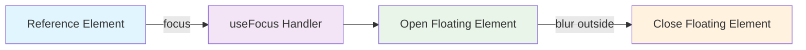
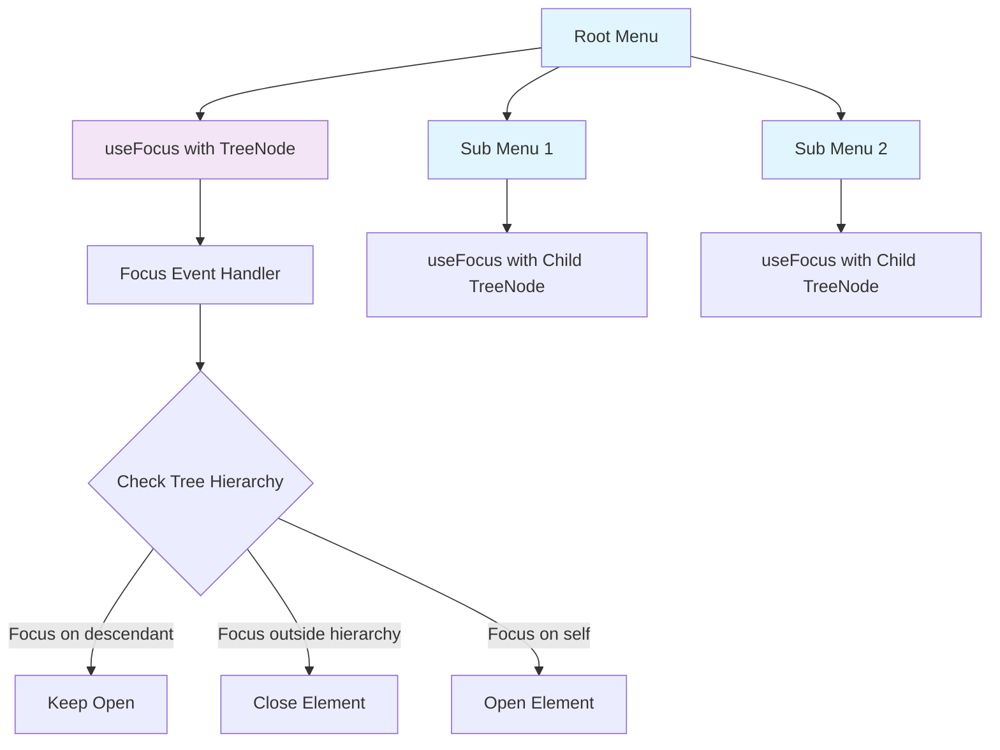
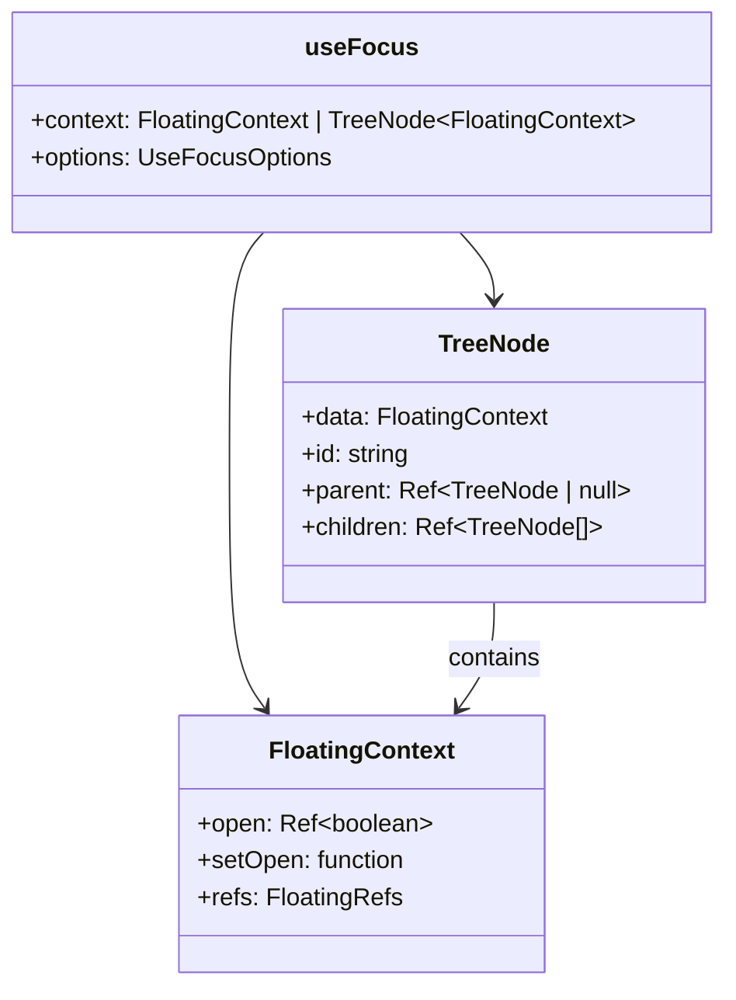
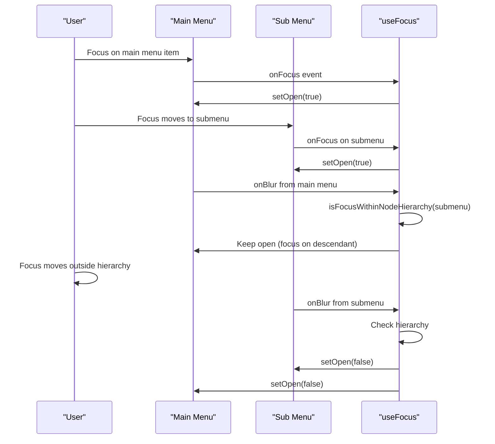
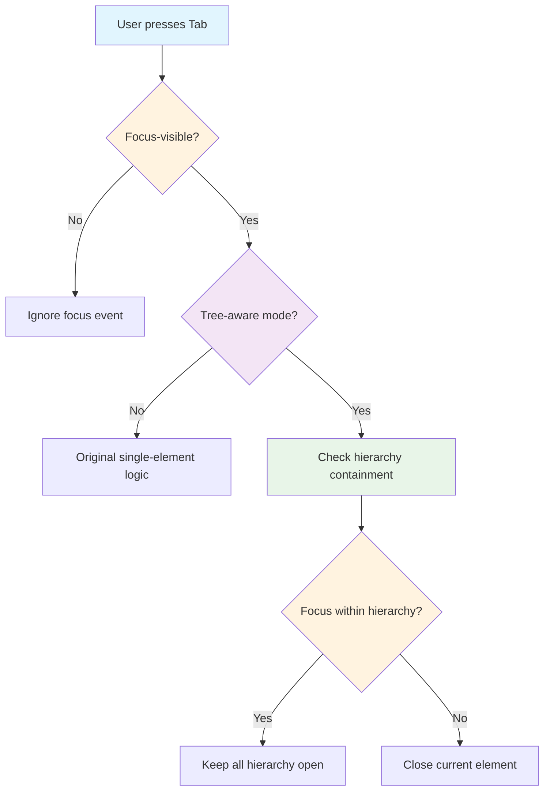

# Tree-Aware useFocus Composable Design

## Overview

This design outlines the enhancement of the `useFocus` composable to support tree-aware behavior, enabling it to work intelligently within nested floating element hierarchies like multi-level menus, nested dropdowns, and complex modal structures. The enhancement follows the established pattern from the `useClick` composable while maintaining focus-specific behaviors and accessibility requirements.

## Technology Stack & Dependencies

- **Vue 3**: Composition API for reactivity and lifecycle management
- **@vueuse/core**: Event listener utilities and type definitions
- **@floating-ui/dom**: Core floating UI positioning system
- **TypeScript**: Full type safety and IntelliSense support
- **Existing Dependencies**: Leverages existing tree infrastructure (`useTree`, `useFloatingTree`)

## Architecture

### Current State Analysis

The existing `useFocus` composable handles focus and blur events on a single floating element:



### Enhanced Tree-Aware Architecture

The enhanced composable will support hierarchical focus management:



### Parameter Type Enhancement

The composable will accept either `FloatingContext` or `TreeNode<FloatingContext>`:



## Component Architecture

### Core Enhancement Components

#### 1. Context Parameter Handling

**Function**: `getContextFromParameter`

- **Purpose**: Extract floating context and tree context from unified parameter
- **Input**: `FloatingContext | TreeNode<FloatingContext>`
- **Output**: `{ floatingContext, treeContext }`
- **Implementation**: Type guard pattern matching `useClick`

#### 2. Tree-Aware Focus Detection

**Function**: `isFocusWithinNodeHierarchy`

- **Purpose**: Determine if focus target is within current node's hierarchy
- **Logic**:
  - Check if focus is on current node (anchor/floating elements)
  - Check if focus is on descendant nodes
  - Return hierarchy containment status
- **Pattern**: Mirrors `isClickOutsideNodeHierarchy` but with focus semantics

#### 3. Descendant Focus Search

**Function**: `findDescendantContainingFocus`

- **Purpose**: Locate which descendant node contains the focused element
- **Traversal**: Recursive depth-first search through open descendants
- **Optimization**: Only search open descendants to reduce computation

### Enhanced Event Handlers

#### Focus Event Handler Enhancement

```typescript
function onFocus(event: FocusEvent): void {
  // Existing focus blocking logic
  if (isFocusBlocked) {
    isFocusBlocked = false
    return
  }

  // Existing focus-visible validation
  const target = event.target as Element | null
  if (toValue(requireFocusVisible) && target) {
    // Safari workaround and focus-visible checks
    if (isMac() && isSafari() && !event.relatedTarget) {
      if (!keyboardModality && !isTypeableElement(target)) {
        return
      }
    } else if (!matchesFocusVisible(target)) {
      return
    }
  }

  setOpen(true)
}
```

#### Blur Event Handler Enhancement

```typescript
function onBlur(event: FocusEvent): void {
  clearTimeout(timeoutId)

  timeoutId = window.setTimeout(() => {
    const ownerDocument = anchorEl.value?.ownerDocument ?? document
    const activeEl = ownerDocument.activeElement

    // Existing window focus edge case
    if (!event.relatedTarget && activeEl === anchorEl.value) {
      return
    }

    // Tree-aware focus checking
    if (treeContext) {
      if (activeEl && isFocusWithinNodeHierarchy(treeContext, activeEl)) {
        return // Focus is within hierarchy - keep open
      }
    } else {
      // Original single-element logic
      if (floatingEl.value && activeEl && floatingEl.value.contains(activeEl)) {
        return
      }
    }

    setOpen(false)
  }, 0)
}
```

## Tree-Aware Helper Functions

### Type Guards and Context Extraction

```typescript
function isTreeNode(
  context: FloatingContext | TreeNode<FloatingContext>
): context is TreeNode<FloatingContext> {
  return (
    context !== null &&
    typeof context === "object" &&
    "data" in context &&
    "id" in context &&
    "children" in context &&
    "parent" in context
  )
}

function getContextFromParameter(context: FloatingContext | TreeNode<FloatingContext>): {
  floatingContext: FloatingContext
  treeContext: TreeNode<FloatingContext> | null
} {
  if (isTreeNode(context)) {
    return {
      floatingContext: context.data,
      treeContext: context,
    }
  }
  return {
    floatingContext: context,
    treeContext: null,
  }
}
```

### Focus Hierarchy Detection

```typescript
function isFocusWithinNodeHierarchy(
  currentNode: TreeNode<FloatingContext>,
  target: Element
): boolean {
  // Check if focus is within current node's elements
  if (
    isTargetWithinElement(target, currentNode.data.refs.anchorEl.value) ||
    isTargetWithinElement(target, currentNode.data.refs.floatingEl.value)
  ) {
    return true // Focus on current node
  }

  // Check if focus is within any descendant
  const descendantNode = findDescendantContainingFocus(currentNode, target)
  return descendantNode !== null
}

function findDescendantContainingFocus(
  node: TreeNode<FloatingContext>,
  target: Element
): TreeNode<FloatingContext> | null {
  for (const child of node.children.value) {
    if (child.data.open.value) {
      if (
        isTargetWithinElement(target, child.data.refs.anchorEl.value) ||
        isTargetWithinElement(target, child.data.refs.floatingEl.value)
      ) {
        return child
      }

      // Recursively check descendants
      const descendant = findDescendantContainingFocus(child, target)
      if (descendant) return descendant
    }
  }
  return null
}
```

### Element Containment Utility

```typescript
function isTargetWithinElement(target: Element, element: any): boolean {
  if (!element) return false

  // Handle VirtualElement (has contextElement)
  if (typeof element === "object" && element !== null && "contextElement" in element) {
    const contextElement = element.contextElement
    if (contextElement instanceof Element) {
      return contextElement.contains(target)
    }
    return false
  }

  // Handle regular Element
  if (element instanceof Element) {
    return element.contains(target)
  }

  return false
}
```

## Integration Patterns

### Standalone Usage (Existing Behavior)

```typescript
const context = useFloating(...)
useFocus(context, {
  enabled: true,
  requireFocusVisible: true
})
```

### Tree-Aware Usage (New Behavior)

```typescript
// Parent menu
const tree = useFloatingTree(rootContext)
const parentNode = tree.root
useFocus(parentNode, { requireFocusVisible: true })

// Child submenu
const childNode = tree.addNode(childContext, parentNode.id)
useFocus(childNode, { requireFocusVisible: true })
```

### Advanced Multi-Level Example



## Accessibility Considerations

### Focus-Visible Behavior

- **Requirement**: Maintain existing `requireFocusVisible` functionality
- **Implementation**: Focus-visible checks applied before tree hierarchy evaluation
- **Compatibility**: Safari workarounds preserved for keyboard modality detection

### Keyboard Navigation Flow



### Screen Reader Compatibility

- **ARIA Support**: Tree structure maintains ARIA relationships
- **Focus Management**: Proper focus trapping within floating element hierarchies
- **Announcement**: Clear indication of hierarchy depth and navigation options

## Testing Strategy

### Unit Testing Requirements

#### Core Functionality Tests

1. **Parameter Type Handling**

   - Test with `FloatingContext` parameter (existing behavior)
   - Test with `TreeNode<FloatingContext>` parameter (new behavior)
   - Verify context extraction logic

2. **Focus Event Handling**

   - Focus-visible requirement compliance
   - Safari-specific keyboard modality detection
   - Focus blocking edge cases

3. **Tree Hierarchy Logic**
   - Focus within current node elements
   - Focus within descendant elements
   - Focus outside hierarchy
   - Multi-level nesting scenarios

#### Integration Tests

```typescript
describe("useFocus tree-aware behavior", () => {
  it("should keep parent open when focus moves to child", () => {
    // Setup parent and child nodes
    // Focus on parent
    // Move focus to child
    // Assert parent remains open
  })

  it("should close hierarchy when focus moves outside", () => {
    // Setup nested hierarchy
    // Focus within hierarchy
    // Move focus outside
    // Assert all elements close
  })

  it("should handle focus-visible requirements in tree mode", () => {
    // Setup tree with focus-visible enabled
    // Test keyboard vs mouse interactions
    // Verify appropriate responses
  })
})
```

### Browser Compatibility Testing

- **Modern Browsers**: Chrome, Firefox, Safari, Edge
- **Focus-Visible Support**: Native vs polyfill behavior
- **Keyboard Navigation**: Tab order and screen reader compatibility
- **Mobile Browsers**: Touch interaction edge cases

## Migration and Backward Compatibility

### Existing Code Compatibility

- **No Breaking Changes**: Existing `useFocus(context, options)` calls continue working
- **Gradual Adoption**: Teams can migrate to tree-aware usage incrementally
- **Type Safety**: TypeScript ensures correct parameter usage

### Migration Path

```typescript
// Before: Simple usage
useFocus(context)

// After: Tree-aware usage (when needed)
const tree = useFloatingTree(context)
useFocus(tree.root)
```

### Performance Considerations

- **Tree Traversal**: Optimized recursive search with early termination
- **Event Handler Efficiency**: Minimal overhead for non-tree usage
- **Memory Management**: Proper cleanup in tree disposal

## Best Practices

### When to Use Tree-Aware Focus

1. **Multi-Level Menus**: Navigation menus with submenus
2. **Nested Dialogs**: Modal dialogs with embedded dropdowns
3. **Complex Forms**: Form sections with floating input assistants
4. **Dashboard Widgets**: Nested floating panels and tooltips

### Implementation Guidelines

1. **Consistent Tree Usage**: Use same tree instance across related components
2. **Focus Management**: Ensure proper focus trapping within hierarchies
3. **Accessibility**: Test with screen readers and keyboard navigation
4. **Performance**: Monitor tree traversal in deep hierarchies

### Common Patterns

```typescript
// Menu system pattern
const menuTree = useFloatingTree(mainMenuContext)
const mainMenuNode = menuTree.root

// Add submenus
const submenuNode = menuTree.addNode(submenuContext, mainMenuNode.id)
const deepSubmenuNode = menuTree.addNode(deepSubmenuContext, submenuNode.id)

// Apply focus handling
useFocus(mainMenuNode, { requireFocusVisible: true })
useFocus(submenuNode, { requireFocusVisible: true })
useFocus(deepSubmenuNode, { requireFocusVisible: true })
```
