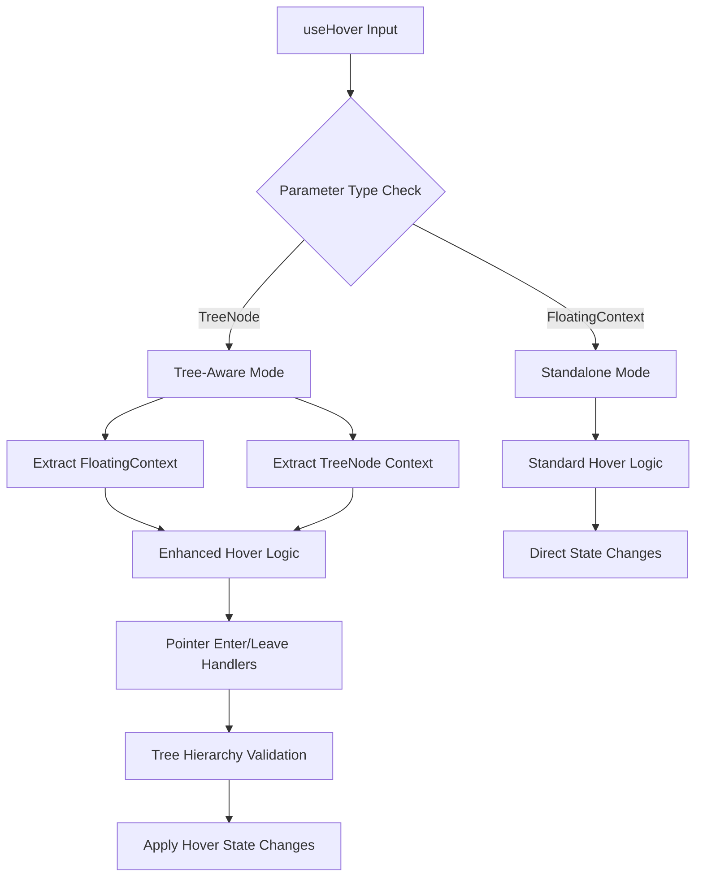
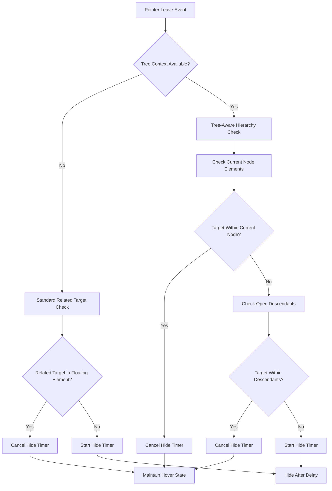

# useHover Tree-Aware Enhancement Design

## Overview

This design document outlines the enhancement of the `useHover` composable to support tree-aware behavior for nested floating elements, following the successful pattern established in the `useClick` composable improvements. The enhancement will enable hierarchical hover interactions where child elements don't interfere with parent element hover states, crucial for complex nested UI patterns like multi-level menus and nested tooltips.

## Architecture

### Current State Analysis

The existing `useHover` composable operates on a single `FloatingContext` and provides sophisticated hover behaviors including:

- Delayed open/close with configurable timing
- Rest detection for pointer movement thresholds
- Safe polygon algorithm for maintaining hover state during pointer traversal
- Mouse-only filtering for pointer type validation

However, it lacks awareness of floating element hierarchies, which can cause issues in nested scenarios where hover events bubble up incorrectly.

### Proposed Architecture

The enhanced `useHover` will mirror the tree-aware architecture of `useClick`:



### Type System Integration

The composable signature will be updated to accept both `FloatingContext` and `TreeNode<FloatingContext>`:

```typescript
export function useHover(
  context: FloatingContext | TreeNode<FloatingContext>,
  options: UseHoverOptions = {}
): void
```

## Component Architecture

### Core Components Enhancement

#### Parameter Processing Layer

- **Context Extraction**: Implement `getContextFromParameter()` function similar to useClick
- **Type Guard**: Add `isTreeNode()` type guard for runtime type checking
- **Dual Context Management**: Maintain references to both floating context and optional tree context

#### Tree-Aware Event Processing

- **Hierarchical Target Validation**: Check if hover targets belong to current node or descendants
- **Ancestor Relationship Handling**: Prevent child hover events from affecting parent hover states
- **Sibling Isolation**: Ensure sibling nodes don't interfere with each other's hover states

#### Enhanced Pointer Leave Logic

The most critical enhancement involves the pointer leave detection:



### Safe Polygon Integration

The existing safe polygon functionality must be enhanced for tree awareness:

#### Polygon Calculation Enhancement

- **Multi-Element Consideration**: Calculate safe polygon considering both current node and descendant elements
- **Hierarchical Buffer Management**: Apply appropriate buffer zones based on node depth and relationships
- **Descendant Element Inclusion**: Extend polygon coverage to include open descendant floating elements

#### Tree-Aware Polygon Validation

```typescript
function createTreeAwareSafePolygon(
  currentNode: TreeNode<FloatingContext>,
  exitPoint: Coords,
  options: SafePolygonOptions
): (event: MouseEvent) => void {
  // Enhanced polygon that considers descendant elements
  // Prevents premature closing when traversing to child elements
}
```

## Data Flow Architecture

### Event Propagation Patterns

#### Hover Enter Flow

1. **Event Capture**: Pointer enters reference or floating element
2. **Context Resolution**: Determine if standalone or tree-aware context
3. **Tree Validation**: If tree context, validate target against hierarchy
4. **State Management**: Apply hover state changes with appropriate timing
5. **Cleanup Management**: Clear conflicting timers and polygon handlers

#### Hover Leave Flow

1. **Event Analysis**: Analyze pointer leave event and related target
2. **Hierarchy Check**: Determine if leave is transitioning to descendant
3. **Polygon Activation**: Activate safe polygon if enabled and appropriate
4. **Timer Management**: Start hide timers only for legitimate exits

### State Coordination

#### Timer Management Enhancement

- **Hierarchical Timer Coordination**: Prevent child timers from conflicting with parent timers
- **Cascade Prevention**: Stop parent hide timers when child elements become active
- **Cleanup Synchronization**: Ensure proper cleanup when nodes are destroyed

## Testing Strategy

### Unit Testing Approach

#### Core Functionality Tests

- **Type Guard Validation**: Test `isTreeNode()` function with various input types
- **Context Extraction**: Validate `getContextFromParameter()` returns correct contexts
- **Tree Hierarchy Logic**: Test hover behavior with various tree structures

#### Interaction Testing

- **Nested Hover Scenarios**: Test hover behavior in multi-level nested structures
- **Timer Coordination**: Verify timer management across parent-child relationships
- **Safe Polygon Integration**: Test polygon behavior with tree-aware enhancements

#### Edge Cases

- **Rapid Hover Transitions**: Test quick movements between parent and child elements
- **Dynamic Node Addition/Removal**: Test behavior when tree structure changes during hover
- **Multiple Sibling Interactions**: Verify isolation between sibling hover states

### Integration Testing

#### Component Integration

- **Menu System Integration**: Test with existing Menu/SubMenu components
- **Tooltip Hierarchies**: Validate nested tooltip scenarios
- **Mixed Interaction Patterns**: Test combination with useClick tree-aware behavior

## Implementation Phases

### Phase 1: Core Tree-Aware Infrastructure

- Implement type guards and context extraction functions
- Add tree-aware parameter processing
- Update function signature and documentation

### Phase 2: Enhanced Pointer Event Logic

- Implement tree-aware pointer leave detection
- Add hierarchical target validation
- Update timer management for tree coordination

### Phase 3: Safe Polygon Enhancement

- Extend safe polygon algorithm for tree awareness
- Implement multi-element polygon calculation
- Add descendant element consideration

### Phase 4: Integration and Optimization

- Integrate with existing floating tree system
- Optimize performance for complex hierarchies
- Add comprehensive error handling

## Migration Considerations

### Backward Compatibility

- Maintain full compatibility with existing `FloatingContext` usage
- Preserve all existing option configurations
- Ensure no breaking changes to public API

### Performance Impact

- Minimize overhead for standalone usage (no tree context)
- Optimize tree traversal algorithms for large hierarchies
- Implement efficient caching for repeated hierarchy checks

### Documentation Requirements

- Update API documentation with tree-aware examples
- Add migration guide for existing implementations
- Provide best practices for nested hover interactions
