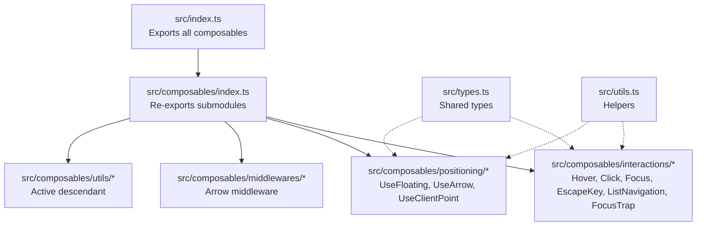
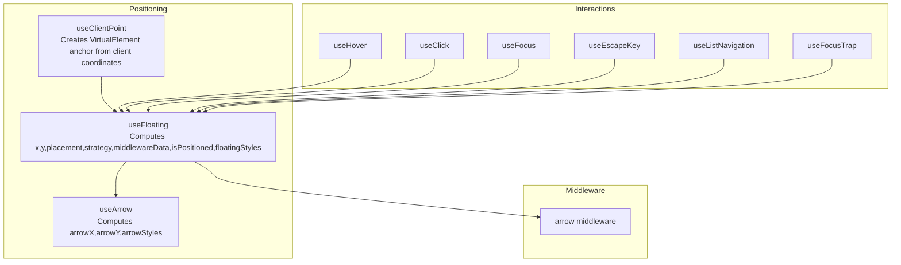
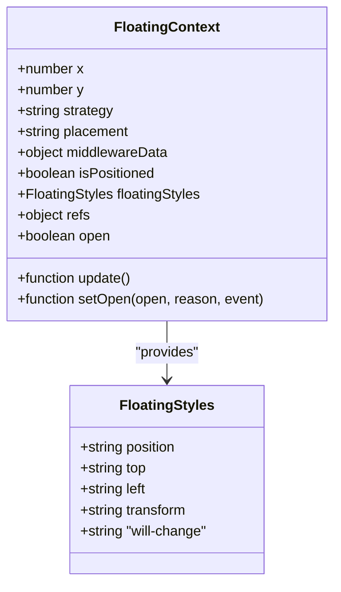
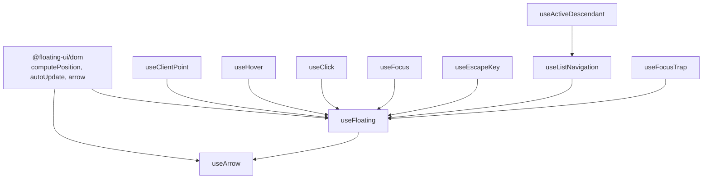

# API Reference

<cite>
**Referenced Files in This Document**
- [src/index.ts](file://src/index.ts)
- [src/composables/index.ts](file://src/composables/index.ts)
- [src/types.ts](file://src/types.ts)
- [src/composables/positioning/use-floating.ts](file://src/composables/positioning/use-floating.ts)
- [src/composables/positioning/use-arrow.ts](file://src/composables/positioning/use-arrow.ts)
- [src/composables/positioning/use-client-point.ts](file://src/composables/positioning/use-client-point.ts)
- [src/composables/interactions/use-hover.ts](file://src/composables/interactions/use-hover.ts)
- [src/composables/interactions/use-click.ts](file://src/composables/interactions/use-click.ts)
- [src/composables/interactions/use-focus.ts](file://src/composables/interactions/use-focus.ts)
- [src/composables/interactions/use-escape-key.ts](file://src/composables/interactions/use-escape-key.ts)
- [src/composables/interactions/use-list-navigation.ts](file://src/composables/interactions/use-list-navigation.ts)
- [src/composables/interactions/use-focus-trap.ts](file://src/composables/interactions/use-focus-trap.ts)
- [src/composables/middlewares/arrow.ts](file://src/composables/middlewares/arrow.ts)
- [src/composables/utils/use-active-descendant.ts](file://src/composables/utils/use-active-descendant.ts)
- [src/utils.ts](file://src/utils.ts)
- [package.json](file://package.json)
</cite>

## Table of Contents
1. [Introduction](#introduction)
2. [Project Structure](#project-structure)
3. [Core Components](#core-components)
4. [Architecture Overview](#architecture-overview)
5. [Detailed Component Analysis](#detailed-component-analysis)
6. [Dependency Analysis](#dependency-analysis)
7. [Performance Considerations](#performance-considerations)
8. [Troubleshooting Guide](#troubleshooting-guide)
9. [Conclusion](#conclusion)
10. [Appendices](#appendices)

## Introduction
This API reference documents the public interfaces of VFloat, a Vue 3 port of Floating UI. It covers all exported composables, utility functions, and type definitions. For each composable, you will find:
- Function signatures and parameters
- Return values and reactive properties
- Configuration option schemas, defaults, and validation rules
- FloatingContext structure, floatingStyles object, and middleware contracts
- Virtual element contracts and event callback signatures
- Practical usage patterns and examples

## Project Structure
VFloat exposes its public API via barrel exports. The main export re-exports composables from three categories:
- Interactions: hover, click, focus, escape key, list navigation, focus trap
- Positioning: floating, arrow, client point
- Middlewares: arrow middleware
- Utilities: active descendant and general helpers

**Diagram sources**
- [src/index.ts:1-2](file://src/index.ts#L1-L2)
- [src/composables/index.ts:1-4](file://src/composables/index.ts#L1-L4)
- [src/types.ts:1-29](file://src/types.ts#L1-L29)
- [src/utils.ts:1-222](file://src/utils.ts#L1-L222)

**Section sources**
- [src/index.ts:1-2](file://src/index.ts#L1-L2)
- [src/composables/index.ts:1-4](file://src/composables/index.ts#L1-L4)

## Core Components
This section summarizes the primary exported APIs grouped by category.

- Positioning
  - useFloating: Computes and reacts to floating element positioning and styles
  - useArrow: Computes arrow positioning styles for a floating element
  - useClientPoint: Positions a floating element relative to client coordinates with axis constraints and tracking modes

- Interactions
  - useHover: Opens/closes on hover with delay, rest detection, and safe polygon exit
  - useClick: Toggle or outside click behavior with pointer/keyboard event handling
  - useFocus: Focus/blur handling with :focus-visible checks and window-level focus-in
  - useEscapeKey: Handles Escape key with composition-awareness
  - useListNavigation: Keyboard navigation for lists/grids with strategies and virtual focus
  - useFocusTrap: Focus trapping with modal behavior and outside element inert/aria-hidden

- Middlewares
  - arrow: Arrow middleware for Floating UI

- Utilities
  - useActiveDescendant: Manages aria-activedescendant for virtual focus
  - General helpers: element/type guards, pointer detection, focus-visible, event utilities

**Section sources**
- [src/composables/positioning/use-floating.ts:196-362](file://src/composables/positioning/use-floating.ts#L196-L362)
- [src/composables/positioning/use-arrow.ts:68-129](file://src/composables/positioning/use-arrow.ts#L68-L129)
- [src/composables/positioning/use-client-point.ts:498-681](file://src/composables/positioning/use-client-point.ts#L498-L681)
- [src/composables/interactions/use-hover.ts:141-351](file://src/composables/interactions/use-hover.ts#L141-L351)
- [src/composables/interactions/use-click.ts:51-304](file://src/composables/interactions/use-click.ts#L51-L304)
- [src/composables/interactions/use-focus.ts:50-202](file://src/composables/interactions/use-focus.ts#L50-L202)
- [src/composables/interactions/use-escape-key.ts:62-86](file://src/composables/interactions/use-escape-key.ts#L62-L86)
- [src/composables/interactions/use-list-navigation.ts:451-800](file://src/composables/interactions/use-list-navigation.ts#L451-L800)
- [src/composables/interactions/use-focus-trap.ts:111-300](file://src/composables/interactions/use-focus-trap.ts#L111-L300)
- [src/composables/middlewares/arrow.ts:36-51](file://src/composables/middlewares/arrow.ts#L36-L51)
- [src/composables/utils/use-active-descendant.ts:28-87](file://src/composables/utils/use-active-descendant.ts#L28-L87)
- [src/utils.ts:1-222](file://src/utils.ts#L1-L222)

## Architecture Overview
The floating system centers on FloatingContext, which provides reactive positioning data and styles. Interactions attach to this context to control open state and trigger updates. Middlewares augment positioning computation and expose data (e.g., arrow coordinates).

**Diagram sources**
- [src/composables/positioning/use-floating.ts:196-362](file://src/composables/positioning/use-floating.ts#L196-L362)
- [src/composables/positioning/use-arrow.ts:68-129](file://src/composables/positioning/use-arrow.ts#L68-L129)
- [src/composables/positioning/use-client-point.ts:498-681](file://src/composables/positioning/use-client-point.ts#L498-L681)
- [src/composables/interactions/use-hover.ts:141-351](file://src/composables/interactions/use-hover.ts#L141-L351)
- [src/composables/interactions/use-click.ts:51-304](file://src/composables/interactions/use-click.ts#L51-L304)
- [src/composables/interactions/use-focus.ts:50-202](file://src/composables/interactions/use-focus.ts#L50-L202)
- [src/composables/interactions/use-escape-key.ts:62-86](file://src/composables/interactions/use-escape-key.ts#L62-L86)
- [src/composables/interactions/use-list-navigation.ts:451-800](file://src/composables/interactions/use-list-navigation.ts#L451-L800)
- [src/composables/interactions/use-focus-trap.ts:111-300](file://src/composables/interactions/use-focus-trap.ts#L111-L300)
- [src/composables/middlewares/arrow.ts:36-51](file://src/composables/middlewares/arrow.ts#L36-L51)

## Detailed Component Analysis

### FloatingContext and FloatingStyles
FloatingContext is the central reactive contract for positioning. It exposes:
- x, y: reactive coordinates
- strategy: absolute/fixed
- placement: computed placement
- middlewareData: middleware-provided data
- isPositioned: whether the element has been positioned
- floatingStyles: reactive styles applied to the floating element
- update(): manually recompute position
- refs: anchorEl, floatingEl, arrowEl
- open: reactive open state
- setOpen(open, reason?, event?): set open state and notify onOpenChange

FloatingStyles is a strongly typed object for applying position/transform styles. It includes:
- position, top, left, transform, will-change
- CSS variable support for custom properties

**Diagram sources**
- [src/composables/positioning/use-floating.ts:111-170](file://src/composables/positioning/use-floating.ts#L111-L170)
- [src/composables/positioning/use-floating.ts:31-60](file://src/composables/positioning/use-floating.ts#L31-L60)

**Section sources**
- [src/composables/positioning/use-floating.ts:111-170](file://src/composables/positioning/use-floating.ts#L111-L170)
- [src/composables/positioning/use-floating.ts:31-60](file://src/composables/positioning/use-floating.ts#L31-L60)

### useFloating
- Purpose: Compute and reactively update floating element position and styles.
- Parameters:
  - anchorEl: Ref<AnchorElement>
  - floatingEl: Ref<FloatingElement>
  - options: UseFloatingOptions
- Options:
  - placement, strategy, transform, middlewares, autoUpdate, open, onOpenChange
- Defaults:
  - placement: bottom, strategy: absolute, transform: true, autoUpdate: true
- Behavior:
  - Watches anchor/floating/open to auto-update
  - Computes x/y/placement/strategy/middlewareData
  - Produces floatingStyles based on strategy and transform
  - Exposes setOpen with reason/event for interaction integrations

Common usage patterns:
- Basic floating with default placement and absolute strategy
- Providing custom middlewares (e.g., arrow middleware)
- Controlling open state externally via refs.open

**Section sources**
- [src/composables/positioning/use-floating.ts:196-362](file://src/composables/positioning/use-floating.ts#L196-L362)
- [src/composables/positioning/use-floating.ts:65-106](file://src/composables/positioning/use-floating.ts#L65-L106)

### useArrow
- Purpose: Compute arrow position styles for a floating element.
- Parameters:
  - arrowEl: Ref<HTMLElement | null>
  - context: FloatingContext
  - options: UseArrowOptions
- Options:
  - offset: CSS length string (default: "-4px")
- Returns:
  - arrowX, arrowY, arrowStyles (computed)
- Behavior:
  - Watches arrowEl and updates context.refs.arrowEl
  - Reads middlewareData.arrow for x/y
  - Computes styles based on placement side and offset

Common usage patterns:
- Pair with useFloating and arrow middleware
- Adjust offset to prevent overlap with borders/shadows

**Section sources**
- [src/composables/positioning/use-arrow.ts:68-129](file://src/composables/positioning/use-arrow.ts#L68-L129)
- [src/composables/middlewares/arrow.ts:36-51](file://src/composables/middlewares/arrow.ts#L36-L51)

### useClientPoint
- Purpose: Position a floating element relative to client coordinates with axis constraints and tracking modes.
- Parameters:
  - pointerTarget: Ref<HTMLElement | null>
  - context: UseClientPointContext
  - options: UseClientPointOptions
- Options:
  - enabled, axis ("x" | "y" | "both"), x, y, trackingMode ("follow" | "static")
- Returns:
  - coordinates (readonly), updatePosition(x, y)
- Behavior:
  - Creates a VirtualElement anchor from constrained coordinates
  - Follow vs Static tracking strategies
  - Locks initial coordinates on open to avoid jumps when axis is constrained
  - Externally controlled coordinates take precedence

Common usage patterns:
- Tooltip that follows mouse
- Context menu positioned at click location
- Axis-constrained tooltips (e.g., horizontal only)

**Section sources**
- [src/composables/positioning/use-client-point.ts:498-681](file://src/composables/positioning/use-client-point.ts#L498-L681)
- [src/composables/positioning/use-client-point.ts:65-116](file://src/composables/positioning/use-client-point.ts#L65-L116)

### useHover
- Purpose: Open/close on hover with delay, rest detection, and safe polygon exit.
- Parameters:
  - context: FloatingContext
  - options: UseHoverOptions
- Options:
  - enabled, delay (number | { open, close }), restMs, mouseOnly, safePolygon
- Defaults:
  - enabled: true, delay: 0, restMs: 0, mouseOnly: false, safePolygon: false
- Behavior:
  - Pointer enter/leave handlers on anchor and floating elements
  - Delayed open/close timers
  - Rest detection threshold to keep tooltip open while pointer rests
  - Optional safe polygon to keep tooltip open while traversing triangle region

Common usage patterns:
- Tooltip with hover-triggered open/close
- Delayed open/close for smoother UX
- Safe polygon to prevent accidental closure

**Section sources**
- [src/composables/interactions/use-hover.ts:141-351](file://src/composables/interactions/use-hover.ts#L141-L351)
- [src/composables/interactions/polygon.ts](file://src/composables/interactions/polygon.ts)

### useClick
- Purpose: Toggle or close floating element on anchor click; optionally detect outside clicks.
- Parameters:
  - context: UseClickContext (subset of FloatingContext)
  - options: UseClickOptions
- Options:
  - enabled, event ("click" | "mousedown"), toggle, ignoreMouse, ignoreKeyboard, ignoreTouch
  - outsideClick, outsideEvent ("pointerdown" | "mousedown" | "click"), outsideCapture
  - onOutsideClick, preventScrollbarClick, handleDragEvents
- Defaults:
  - enabled: true, event: "click", toggle: true, ignoreMouse/ignoreKeyboard/ignoreTouch: false
  - outsideClick: false, outsideEvent: "pointerdown", outsideCapture: true
  - preventScrollbarClick: true, handleDragEvents: true
- Behavior:
  - Handles pointerdown/mousedown/click and keyboard Enter/Space
  - Ignores synthetic keyboard clicks when appropriate
  - Outside click detection with drag detection and scrollbar exclusion
  - Custom outside click handler override

Common usage patterns:
- Toggle dropdown on anchor click
- Dialog with outside click to close
- Mixed pointer/keyboard interactions

**Section sources**
- [src/composables/interactions/use-click.ts:51-304](file://src/composables/interactions/use-click.ts#L51-L304)

### useFocus
- Purpose: Open/close on focus/blur with :focus-visible checks and window-level focus handling.
- Parameters:
  - context: UseFocusContext (subset of FloatingContext)
  - options: UseFocusOptions
- Options:
  - enabled, requireFocusVisible
- Defaults:
  - enabled: true, requireFocusVisible: true
- Behavior:
  - Focus/blur on anchor element
  - :focus-visible detection with Safari/Mac special handling
  - Window blur/focus to block unexpected re-open
  - Document focusin to handle focus leaving anchor/floating safely
- Returns:
  - cleanup function to remove listeners and clear timeouts

Common usage patterns:
- Accessible dropdown menus
- Modal-like panels with focus management

**Section sources**
- [src/composables/interactions/use-focus.ts:50-202](file://src/composables/interactions/use-focus.ts#L50-L202)

### useEscapeKey
- Purpose: Close floating element on Escape key with composition-aware handling.
- Parameters:
  - context: UseEscapeKeyContext (subset of FloatingContext)
  - options: UseEscapeKeyOptions
- Options:
  - enabled, capture, onEscape
- Defaults:
  - enabled: true, capture: false
- Behavior:
  - Document keydown listener for Escape
  - Ignores composition events
  - Calls custom onEscape if provided; otherwise setOpen(false, "escape-key")

Common usage patterns:
- Dismiss dialogs/modals
- Override default behavior with custom handler

**Section sources**
- [src/composables/interactions/use-escape-key.ts:62-86](file://src/composables/interactions/use-escape-key.ts#L62-L86)

### useListNavigation
- Purpose: Keyboard navigation for lists/grids with strategies and virtual focus.
- Parameters:
  - context: FloatingContext
  - options: UseListNavigationOptions
- Options:
  - listRef, activeIndex, onNavigate, enabled, loop, orientation ("vertical"|"horizontal"|"both")
  - disabledIndices, focusItemOnHover, openOnArrowKeyDown, scrollItemIntoView
  - selectedIndex, focusItemOnOpen ("auto"|boolean), nested, parentOrientation
  - rtl, virtual, virtualItemRef, cols, allowEscape, gridLoopDirection ("row"|"next")
- Defaults:
  - enabled: true, loop: false, orientation: "vertical", focusItemOnHover: true
  - openOnArrowKeyDown: true, scrollItemIntoView: true, focusItemOnOpen: "auto"
  - rtl: false, virtual: false, cols: 1, allowEscape: false, gridLoopDirection: "row"
- Behavior:
  - Strategies: VerticalNavigationStrategy, HorizontalNavigationStrategy, GridNavigationStrategy
  - Keyboard handlers on anchor/floating elements
  - Hover-to-focus with ghost hover prevention
  - Virtual focus via aria-activedescendant and useActiveDescendant
  - Scroll into view for keyboard interactions

Common usage patterns:
- Select dropdowns with arrow keys
- Grid menus with row/column navigation
- Virtual focus for large lists

**Section sources**
- [src/composables/interactions/use-list-navigation.ts:451-800](file://src/composables/interactions/use-list-navigation.ts#L451-L800)
- [src/composables/utils/use-active-descendant.ts:28-87](file://src/composables/utils/use-active-descendant.ts#L28-L87)

### useFocusTrap
- Purpose: Focus trapping with modal behavior and outside element inert/aria-hidden.
- Parameters:
  - context: UseFocusTrapContext (subset of FloatingContext)
  - options: UseFocusTrapOptions
- Options:
  - enabled, modal, initialFocus, returnFocus, closeOnFocusOut, preventScroll
  - outsideElementsInert, onError
- Defaults:
  - enabled: true, modal: false, returnFocus: true, closeOnFocusOut: false
  - preventScroll: true, outsideElementsInert: false
- Behavior:
  - Creates focus-trap instance on open
  - Applies inert or aria-hidden to outside elements when modal
  - Deactivates on close or when not enabled/open
  - Supports onError callback for activation failures

Common usage patterns:
- Modals/dialogs
- Menus requiring focus containment

**Section sources**
- [src/composables/interactions/use-focus-trap.ts:111-300](file://src/composables/interactions/use-focus-trap.ts#L111-L300)

### Arrow Middleware
- Purpose: Provide arrow positioning middleware for Floating UI.
- Parameters:
  - options: ArrowMiddlewareOptions
- Options:
  - padding: number | { top, bottom, left, right,[] }
  - element: Ref<HTMLElement | null>
- Behavior:
  - Wraps Floating UI’s arrow middleware
  - Returns middleware with name "arrow"

Common usage patterns:
- Automatically included when arrowEl is set in useFloating
- Manual inclusion in middlewares array

**Section sources**
- [src/composables/middlewares/arrow.ts:36-51](file://src/composables/middlewares/arrow.ts#L36-L51)

### Virtual Elements and Contracts
- VirtualElement interface:
  - getBoundingClientRect(): DOMRect
  - contextElement?: Element (optional)
- Used by:
  - useFloating (anchorEl)
  - useClientPoint (factory produces VirtualElement)
- Validation:
  - isVirtualElement helper
  - isEventTargetWithin helper for composedPath-aware containment

Common usage patterns:
- Passing a virtual anchor for precise control
- Ensuring contextElement is set for layout resolution

**Section sources**
- [src/types.ts:8-14](file://src/types.ts#L8-L14)
- [src/composables/positioning/use-client-point.ts:125-314](file://src/composables/positioning/use-client-point.ts#L125-L314)
- [src/utils.ts:109-126](file://src/utils.ts#L109-L126)

### Event Callback Signatures and Reasons
- OpenChangeReason union:
  - "anchor-click", "keyboard-activate", "outside-pointer", "focus", "blur", "hover", "escape-key", "tree-ancestor-close", "programmatic"
- Event callbacks:
  - onOpenChange(open, reason, event?) in useFloating
  - onOutsideClick(MouseEvent) in useClick
  - onEscape(KeyEvent) in useEscapeKey
  - onNavigate(index) in useListNavigation

Common usage patterns:
- Logging or analytics on open state changes
- Conditional outside click handling
- Custom escape key behavior

**Section sources**
- [src/types.ts:19-29](file://src/types.ts#L19-L29)
- [src/composables/positioning/use-floating.ts:105](file://src/composables/positioning/use-floating.ts#L105)
- [src/composables/interactions/use-click.ts:221-226](file://src/composables/interactions/use-click.ts#L221-L226)
- [src/composables/interactions/use-escape-key.ts:75-82](file://src/composables/interactions/use-escape-key.ts#L75-L82)
- [src/composables/interactions/use-list-navigation.ts:347](file://src/composables/interactions/use-list-navigation.ts#L347)

## Dependency Analysis
VFloat integrates with Floating UI DOM for positioning and focus-trap for focus management. Internal dependencies:
- useFloating depends on Floating UI computePosition and autoUpdate
- useArrow depends on middlewareData from useFloating
- useClientPoint constructs VirtualElement anchors
- Interactions depend on FloatingContext and Vue reactivity
- useListNavigation integrates with useActiveDescendant for virtual focus

**Diagram sources**
- [src/composables/positioning/use-floating.ts:1-12](file://src/composables/positioning/use-floating.ts#L1-L12)
- [src/composables/positioning/use-arrow.ts:1-3](file://src/composables/positioning/use-arrow.ts#L1-L3)
- [src/composables/interactions/use-list-navigation.ts:14](file://src/composables/interactions/use-list-navigation.ts#L14)
- [src/composables/utils/use-active-descendant.ts:1-1](file://src/composables/utils/use-active-descendant.ts#L1-L1)

**Section sources**
- [src/composables/positioning/use-floating.ts:1-12](file://src/composables/positioning/use-floating.ts#L1-L12)
- [src/composables/positioning/use-arrow.ts:1-3](file://src/composables/positioning/use-arrow.ts#L1-L3)
- [src/composables/interactions/use-list-navigation.ts:14](file://src/composables/interactions/use-list-navigation.ts#L14)
- [src/composables/utils/use-active-descendant.ts:1-1](file://src/composables/utils/use-active-descendant.ts#L1-L1)

## Performance Considerations
- Prefer transform-based positioning when available to leverage GPU acceleration.
- Use autoUpdate with care; disable or tune AutoUpdateOptions for heavy layouts.
- Limit event listeners by using trackingMode "static" when continuous tracking is unnecessary.
- Avoid excessive recomputation by controlling coordinates externally when possible.
- Use virtual focus for large lists to minimize DOM focus operations.

## Troubleshooting Guide
- Floating element not updating:
  - Ensure anchorEl and floatingEl are set and open is true
  - Call update() manually if autoUpdate is disabled
- Arrow misaligned:
  - Verify arrowEl is set and middlewareData.arrow is present
  - Adjust offset to prevent overlap
- Hover tooltip closing unexpectedly:
  - Check delay and restMs settings
  - Consider enabling safePolygon with buffer
- Outside click not working:
  - Confirm outsideClick is true and event capture aligns with your app
  - Prevent scrollbar clicks if applicable
- Focus trap not activating:
  - Ensure floatingEl is available and open is true
  - Check for activation errors via onError
- Virtual focus not announced:
  - Ensure list items have stable IDs
  - Confirm virtual mode is enabled and open is true

**Section sources**
- [src/composables/positioning/use-floating.ts:244-265](file://src/composables/positioning/use-floating.ts#L244-L265)
- [src/composables/positioning/use-arrow.ts:76-89](file://src/composables/positioning/use-arrow.ts#L76-L89)
- [src/composables/interactions/use-hover.ts:281-319](file://src/composables/interactions/use-hover.ts#L281-L319)
- [src/composables/interactions/use-click.ts:184-226](file://src/composables/interactions/use-click.ts#L184-L226)
- [src/composables/interactions/use-focus-trap.ts:221-278](file://src/composables/interactions/use-focus-trap.ts#L221-L278)
- [src/composables/utils/use-active-descendant.ts:62-72](file://src/composables/utils/use-active-descendant.ts#L62-L72)

## Conclusion
VFloat provides a comprehensive, reactive API for floating element positioning and interactions in Vue 3. By composing useFloating with interactions and middlewares, you can build accessible, performant overlays with minimal boilerplate. Use the FloatingContext contract to coordinate state and styles, and leverage the provided utilities for robust behavior across devices and input methods.

## Appendices

### Type Definitions
- AnyFn<T extends unknown[] = unknown[], U = unknown>: Generic function type
- Fn: () => void
- VirtualElement: getBoundingClientRect() and optional contextElement
- OpenChangeReason: union of interaction-driven reasons

**Section sources**
- [src/types.ts:1-29](file://src/types.ts#L1-L29)

### Package Metadata
- Exports:
  - types, import, and require entries for distribution
- Dependencies:
  - @floating-ui/dom, @vueuse/core, focus-trap, tabbable, vue

**Section sources**
- [package.json:10-18](file://package.json#L10-L18)
- [package.json:39-46](file://package.json#L39-L46)