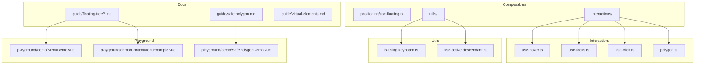
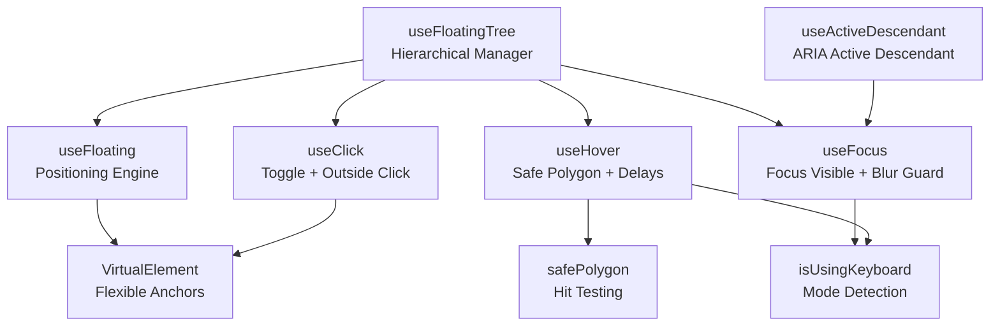
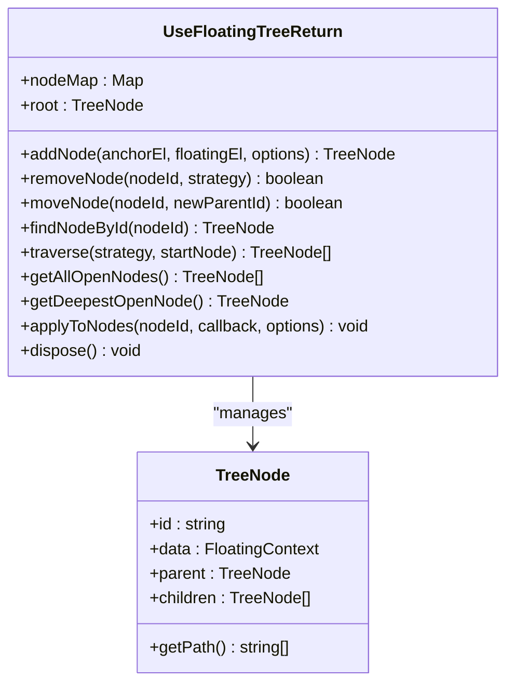
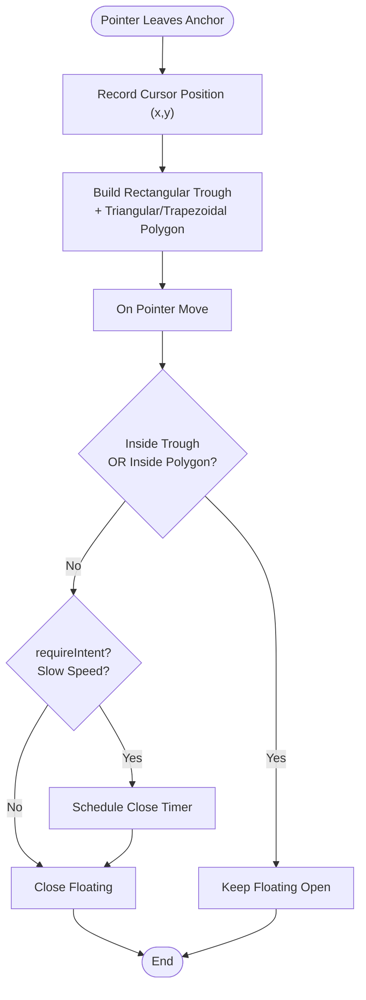
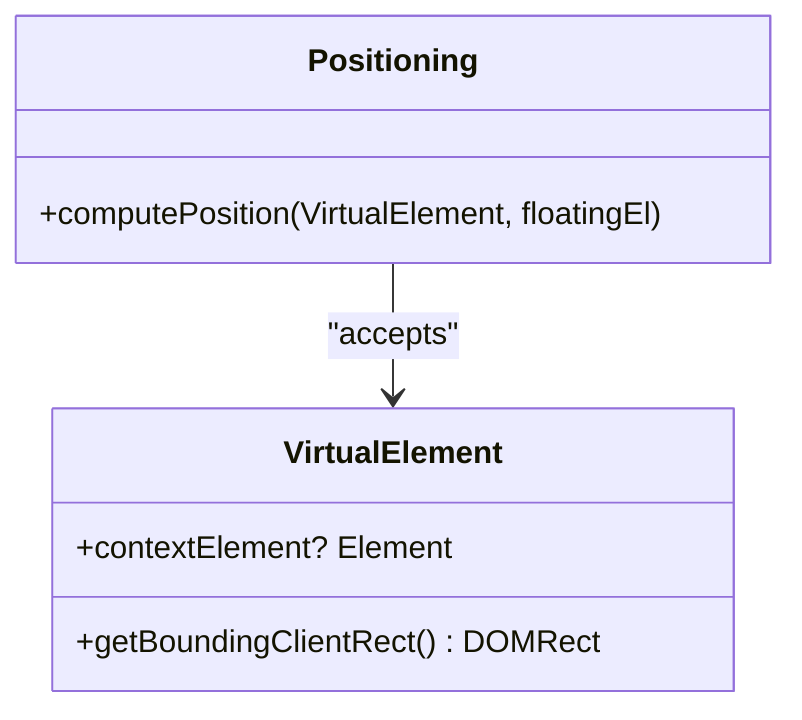
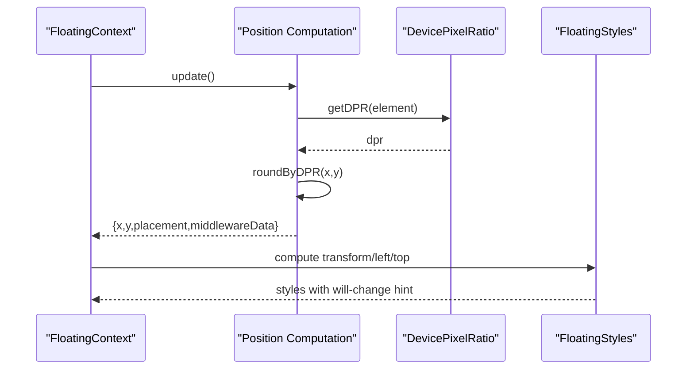
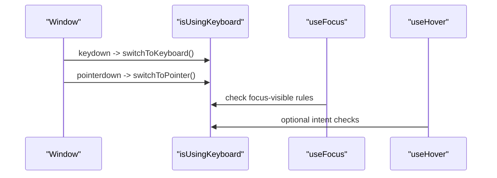
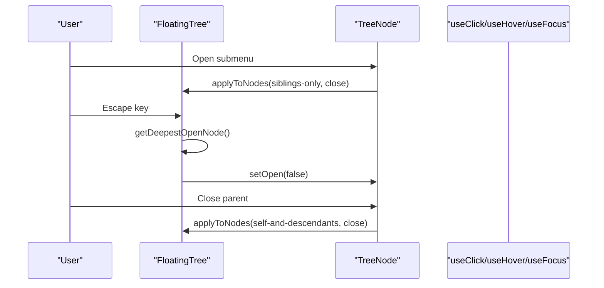
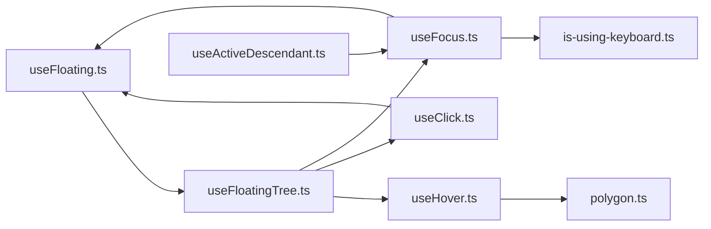

# Advanced Features

<cite>
**Referenced Files in This Document**
- [src/composables/index.ts](file://src/composables/index.ts)
- [src/types.ts](file://src/types.ts)
- [src/utils.ts](file://src/utils.ts)
- [src/composables/interactions/polygon.ts](file://src/composables/interactions/polygon.ts)
- [src/composables/interactions/use-hover.ts](file://src/composables/interactions/use-hover.ts)
- [src/composables/interactions/use-focus.ts](file://src/composables/interactions/use-focus.ts)
- [src/composables/interactions/use-click.ts](file://src/composables/interactions/use-click.ts)
- [src/composables/positioning/use-floating.ts](file://src/composables/positioning/use-floating.ts)
- [src/composables/utils/is-using-keyboard.ts](file://src/composables/utils/is-using-keyboard.ts)
- [src/composables/utils/use-active-descendant.ts](file://src/composables/utils/use-active-descendant.ts)
- [docs/api/use-floating-tree.md](file://docs/api/use-floating-tree.md)
- [docs/guide/floating-tree/introduction.md](file://docs/guide/floating-tree/introduction.md)
- [docs/guide/floating-tree/getting-started.md](file://docs/guide/floating-tree/getting-started.md)
- [docs/guide/floating-tree/cookbook.md](file://docs/guide/floating-tree/cookbook.md)
- [docs/guide/floating-tree/api-reference.md](file://docs/guide/floating-tree/api-reference.md)
- [docs/guide/safe-polygon.md](file://docs/guide/safe-polygon.md)
- [docs/guide/virtual-elements.md](file://docs/guide/virtual-elements.md)
- [playground/demo/SafePolygonDemo.vue](file://playground/demo/SafePolygonDemo.vue)
- [playground/components/Menu.vue](file://playground/components/Menu.vue)
- [playground/components/SubMenu.vue](file://playground/components/SubMenu.vue)
- [playground/components/MenuItem.vue](file://playground/components/MenuItem.vue)
- [playground/components/MenuTrigger.vue](file://playground/components/MenuTrigger.vue)
- [playground/demo/MenuDemo.vue](file://playground/demo/MenuDemo.vue)
- [playground/demo/ContextMenuExample.vue](file://playground/demo/ContextMenuExample.vue)
</cite>

## Table of Contents
1. [Introduction](#introduction)
2. [Project Structure](#project-structure)
3. [Core Components](#core-components)
4. [Architecture Overview](#architecture-overview)
5. [Detailed Component Analysis](#detailed-component-analysis)
6. [Dependency Analysis](#dependency-analysis)
7. [Performance Considerations](#performance-considerations)
8. [Troubleshooting Guide](#troubleshooting-guide)
9. [Conclusion](#conclusion)
10. [Appendices](#appendices)

## Introduction
This document covers advanced VFloat features for sophisticated floating UI positioning and interaction. It explains the floating tree system for hierarchical floating element management, including node coordination, mutually exclusive submenus, and parent-child relationships. It documents the virtual elements concept and implementation for flexible positioning logic beyond traditional anchor/floating element pairs. It details the safe polygon algorithm for smooth pointer navigation and hover interactions, device pixel ratio awareness for visual quality, and keyboard interaction utilities including isUsingKeyboard detection and active descendant management. Finally, it provides advanced integration patterns, performance optimization techniques, and complex use case implementations for nested menus, context menus, and sophisticated UI patterns.

## Project Structure
VFloat is organized into composables for positioning, interactions, and utilities, with comprehensive documentation and playground examples. The composables export module aggregates the major subsystems.

**Diagram sources**
- [src/composables/index.ts:1-4](file://src/composables/index.ts#L1-L4)
- [src/composables/positioning/use-floating.ts:1-384](file://src/composables/positioning/use-floating.ts#L1-L384)
- [src/composables/interactions/use-hover.ts:1-351](file://src/composables/interactions/use-hover.ts#L1-L351)
- [src/composables/interactions/use-focus.ts:1-235](file://src/composables/interactions/use-focus.ts#L1-L235)
- [src/composables/interactions/use-click.ts:1-392](file://src/composables/interactions/use-click.ts#L1-L392)
- [src/composables/interactions/polygon.ts:1-517](file://src/composables/interactions/polygon.ts#L1-L517)
- [src/composables/utils/is-using-keyboard.ts:1-26](file://src/composables/utils/is-using-keyboard.ts#L1-L26)
- [src/composables/utils/use-active-descendant.ts:1-87](file://src/composables/utils/use-active-descendant.ts#L1-L87)
- [docs/guide/floating-tree/introduction.md:1-42](file://docs/guide/floating-tree/introduction.md#L1-L42)
- [docs/guide/safe-polygon.md:1-200](file://docs/guide/safe-polygon.md#L1-L200)
- [docs/guide/virtual-elements.md:1-200](file://docs/guide/virtual-elements.md#L1-L200)
- [playground/demo/MenuDemo.vue:1-200](file://playground/demo/MenuDemo.vue#L1-L200)
- [playground/demo/ContextMenuExample.vue:1-200](file://playground/demo/ContextMenuExample.vue#L1-L200)
- [playground/demo/SafePolygonDemo.vue:1-200](file://playground/demo/SafePolygonDemo.vue#L1-L200)

**Section sources**
- [src/composables/index.ts:1-4](file://src/composables/index.ts#L1-L4)

## Core Components
- Floating positioning with device pixel ratio awareness and transform-based rendering for crisp visuals.
- Safe polygon hover algorithm for smooth pointer navigation between anchors and floating elements.
- Floating tree for hierarchical management of nested menus, dialogs, and complex UI patterns.
- Virtual elements for flexible positioning beyond traditional anchor/floating pairs.
- Keyboard utilities for isUsingKeyboard detection and active descendant management for accessible lists.

**Section sources**
- [src/composables/positioning/use-floating.ts:323-383](file://src/composables/positioning/use-floating.ts#L323-L383)
- [src/composables/interactions/polygon.ts:116-254](file://src/composables/interactions/polygon.ts#L116-L254)
- [docs/api/use-floating-tree.md:1-430](file://docs/api/use-floating-tree.md#L1-L430)
- [src/types.ts:8-14](file://src/types.ts#L8-L14)
- [src/composables/utils/is-using-keyboard.ts:1-26](file://src/composables/utils/is-using-keyboard.ts#L1-L26)
- [src/composables/utils/use-active-descendant.ts:28-87](file://src/composables/utils/use-active-descendant.ts#L28-L87)

## Architecture Overview
The advanced architecture integrates positioning, interactions, and tree management to support complex UI patterns. The floating tree orchestrates parent-child relationships and state propagation, while interactions coordinate hover, focus, click, and keyboard behaviors. Virtual elements and safe polygon enhance positioning flexibility and user experience.

**Diagram sources**
- [docs/api/use-floating-tree.md:1-430](file://docs/api/use-floating-tree.md#L1-L430)
- [src/composables/positioning/use-floating.ts:196-362](file://src/composables/positioning/use-floating.ts#L196-L362)
- [src/composables/interactions/use-hover.ts:141-351](file://src/composables/interactions/use-hover.ts#L141-L351)
- [src/composables/interactions/use-click.ts:51-392](file://src/composables/interactions/use-click.ts#L51-L392)
- [src/composables/interactions/use-focus.ts:50-235](file://src/composables/interactions/use-focus.ts#L50-L235)
- [src/composables/interactions/polygon.ts:116-254](file://src/composables/interactions/polygon.ts#L116-L254)
- [src/types.ts:8-14](file://src/types.ts#L8-L14)
- [src/composables/utils/is-using-keyboard.ts:1-26](file://src/composables/utils/is-using-keyboard.ts#L1-L26)
- [src/composables/utils/use-active-descendant.ts:28-87](file://src/composables/utils/use-active-descendant.ts#L28-L87)

## Detailed Component Analysis

### Floating Tree System
The floating tree provides a hierarchical structure for managing multiple floating elements. It supports adding nodes, moving nodes, removing nodes, traversals, and bulk operations via relationships. It enforces mutually exclusive submenus and cascading close semantics.

**Diagram sources**
- [docs/api/use-floating-tree.md:84-204](file://docs/api/use-floating-tree.md#L84-L204)
- [docs/api/use-floating-tree.md:231-262](file://docs/api/use-floating-tree.md#L231-L262)
- [docs/api/use-floating-tree.md:313-365](file://docs/api/use-floating-tree.md#L313-L365)
- [docs/api/use-floating-tree.md:367-391](file://docs/api/use-floating-tree.md#L367-L391)

Key capabilities:
- Mutually exclusive submenus via applying operations to siblings-only.
- Intelligent escape key dismissal by targeting the deepest open node.
- Closing entire branches using self-and-descendants relationships.
- Modal-like behavior by inert-ing all elements except the active branch.

**Section sources**
- [docs/guide/floating-tree/cookbook.md:5-74](file://docs/guide/floating-tree/cookbook.md#L5-L74)
- [docs/guide/floating-tree/cookbook.md:142-247](file://docs/guide/floating-tree/cookbook.md#L142-L247)
- [docs/guide/floating-tree/cookbook.md:249-394](file://docs/guide/floating-tree/cookbook.md#L249-L394)
- [docs/guide/floating-tree/getting-started.md:82-121](file://docs/guide/floating-tree/getting-started.md#L82-L121)

### Safe Polygon Algorithm
The safe polygon algorithm improves hover interactions by computing protective zones between the anchor and floating elements, preventing accidental closures when traversing between elements.

**Diagram sources**
- [src/composables/interactions/polygon.ts:116-254](file://src/composables/interactions/polygon.ts#L116-L254)
- [src/composables/interactions/polygon.ts:363-405](file://src/composables/interactions/polygon.ts#L363-L405)
- [src/composables/interactions/polygon.ts:415-516](file://src/composables/interactions/polygon.ts#L415-L516)

Behavior highlights:
- Rectangular trough spans the gap between reference and floating elements.
- Triangular/trapezoidal polygon fans outward from the leave position.
- Optional intent detection to avoid accidental closures on slow entry.
- Debug visualization via onPolygonChange callback.

**Section sources**
- [src/composables/interactions/polygon.ts:5-27](file://src/composables/interactions/polygon.ts#L5-L27)
- [src/composables/interactions/polygon.ts:31-52](file://src/composables/interactions/polygon.ts#L31-L52)
- [src/composables/interactions/use-hover.ts:275-319](file://src/composables/interactions/use-hover.ts#L275-L319)

### Virtual Elements
Virtual elements enable flexible positioning without requiring a physical anchor element. They provide a minimal interface compatible with Floating UI expectations.

**Diagram sources**
- [src/types.ts:8-14](file://src/types.ts#L8-L14)
- [src/composables/positioning/use-floating.ts:196-362](file://src/composables/positioning/use-floating.ts#L196-L362)

Implementation notes:
- VirtualElement supports both HTMLElement and VirtualElement anchors.
- Context element resolves layout metrics for positioning calculations.
- Used extensively in interactions and tree nodes.

**Section sources**
- [src/types.ts:8-14](file://src/types.ts#L8-L14)
- [src/composables/interactions/use-focus.ts:64-67](file://src/composables/interactions/use-focus.ts#L64-L67)
- [src/composables/interactions/use-hover.ts:157-161](file://src/composables/interactions/use-hover.ts#L157-L161)

### Device Pixel Ratio Awareness and Visual Quality
The positioning engine rounds positions based on device pixel ratio and applies transform-based rendering for crisp visuals, especially beneficial on high-DPI displays.

**Diagram sources**
- [src/composables/positioning/use-floating.ts:244-265](file://src/composables/positioning/use-floating.ts#L244-L265)
- [src/composables/positioning/use-floating.ts:323-343](file://src/composables/positioning/use-floating.ts#L323-L343)
- [src/composables/positioning/use-floating.ts:371-383](file://src/composables/positioning/use-floating.ts#L371-L383)

Optimization details:
- roundByDPR ensures pixel alignment to avoid blurry rendering.
- Transform-based positioning leverages GPU acceleration.
- will-change hint applied when DPR >= 1.5 for smoother animations.

**Section sources**
- [src/composables/positioning/use-floating.ts:323-383](file://src/composables/positioning/use-floating.ts#L323-L383)

### Keyboard Interaction Utilities
VFloat provides utilities to detect keyboard vs pointer interaction and manage active descendant for accessible lists.

**Diagram sources**
- [src/composables/utils/is-using-keyboard.ts:1-26](file://src/composables/utils/is-using-keyboard.ts#L1-L26)
- [src/composables/interactions/use-focus.ts:99-106](file://src/composables/interactions/use-focus.ts#L99-L106)
- [src/composables/interactions/use-hover.ts:267-273](file://src/composables/interactions/use-hover.ts#L267-L273)

Active descendant management:
- useActiveDescendant sets aria-activedescendant on the anchor element.
- Requires stable IDs on list items to avoid hydration mismatches.
- Watches virtual, open, activeIndex, and listRef to keep state synchronized.

**Section sources**
- [src/composables/utils/is-using-keyboard.ts:1-26](file://src/composables/utils/is-using-keyboard.ts#L1-L26)
- [src/composables/utils/use-active-descendant.ts:28-87](file://src/composables/utils/use-active-descendant.ts#L28-L87)

### Advanced Integration Patterns
- Nested menus with mutually exclusive submenus using applyToNodes with siblings-only.
- Intelligent escape key handling by targeting the deepest open node.
- Cascading close semantics via self-and-descendants relationships.
- Modal-like behavior by inert-ing all elements except the active branch.

**Diagram sources**
- [docs/guide/floating-tree/cookbook.md:56-66](file://docs/guide/floating-tree/cookbook.md#L56-L66)
- [docs/guide/floating-tree/cookbook.md:113-120](file://docs/guide/floating-tree/cookbook.md#L113-L120)
- [docs/guide/floating-tree/cookbook.md:195-202](file://docs/guide/floating-tree/cookbook.md#L195-L202)

**Section sources**
- [docs/guide/floating-tree/cookbook.md:5-74](file://docs/guide/floating-tree/cookbook.md#L5-L74)
- [docs/guide/floating-tree/cookbook.md:142-247](file://docs/guide/floating-tree/cookbook.md#L142-L247)
- [docs/guide/floating-tree/cookbook.md:249-394](file://docs/guide/floating-tree/cookbook.md#L249-L394)

## Dependency Analysis
The advanced features rely on cohesive interactions among positioning, interactions, and tree management. The floating tree depends on useFloating for node contexts, while interactions depend on the tree for coordinated state changes.

**Diagram sources**
- [src/composables/positioning/use-floating.ts:196-362](file://src/composables/positioning/use-floating.ts#L196-L362)
- [src/composables/interactions/use-hover.ts:141-351](file://src/composables/interactions/use-hover.ts#L141-L351)
- [src/composables/interactions/polygon.ts:116-254](file://src/composables/interactions/polygon.ts#L116-L254)
- [src/composables/interactions/use-click.ts:51-392](file://src/composables/interactions/use-click.ts#L51-L392)
- [src/composables/interactions/use-focus.ts:50-235](file://src/composables/interactions/use-focus.ts#L50-L235)
- [src/composables/utils/is-using-keyboard.ts:1-26](file://src/composables/utils/is-using-keyboard.ts#L1-L26)
- [src/composables/utils/use-active-descendant.ts:28-87](file://src/composables/utils/use-active-descendant.ts#L28-L87)
- [docs/api/use-floating-tree.md:84-204](file://docs/api/use-floating-tree.md#L84-L204)

**Section sources**
- [src/composables/index.ts:1-4](file://src/composables/index.ts#L1-L4)

## Performance Considerations
- Prefer transform-based positioning for hardware-accelerated updates.
- Round positions by device pixel ratio to avoid blurry rendering on high-DPI displays.
- Use auto-update with appropriate options to balance responsiveness and performance.
- Minimize DOM reads/writes by batching updates and leveraging reactive watchers.
- Use safe polygon with moderate buffer sizes to reduce unnecessary computations.
- Avoid excessive deep traversals; cache node references when performing frequent operations.

## Troubleshooting Guide
Common issues and resolutions:
- Floating element closes unexpectedly on hover: adjust safe polygon buffer or disable requireIntent to improve traversal reliability.
- Clicks on scrollbars trigger outside click: enable preventScrollbarClick to ignore scrollbar clicks.
- Focus-visible behavior differs on Safari/Mac: leverage isUsingKeyboard detection and matchesFocusVisible for consistent behavior.
- Active descendant not updating: ensure list items have stable IDs and virtual flag is set correctly.
- Memory leaks with floating tree: always dispose the tree instance on component unmount.

**Section sources**
- [src/composables/interactions/polygon.ts:222-242](file://src/composables/interactions/polygon.ts#L222-L242)
- [src/composables/interactions/use-click.ts:204-211](file://src/composables/interactions/use-click.ts#L204-L211)
- [src/composables/interactions/use-focus.ts:99-106](file://src/composables/interactions/use-focus.ts#L99-L106)
- [src/composables/utils/use-active-descendant.ts:62-72](file://src/composables/utils/use-active-descendant.ts#L62-L72)
- [docs/api/use-floating-tree.md:367-391](file://docs/api/use-floating-tree.md#L367-L391)

## Conclusion
VFloat’s advanced features provide a robust foundation for sophisticated floating UI patterns. The floating tree system simplifies hierarchical state management, while the safe polygon algorithm enhances hover interactions. Virtual elements and device pixel ratio awareness improve flexibility and visual fidelity. Keyboard utilities and active descendant management ensure accessibility. Combined, these features enable complex use cases like nested menus, context menus, and modal-like experiences with clean, maintainable code.

## Appendices
- Playground examples demonstrate practical implementations of menus, context menus, and safe polygon interactions.
- Documentation guides provide step-by-step recipes for advanced patterns.

**Section sources**
- [playground/demo/MenuDemo.vue:1-200](file://playground/demo/MenuDemo.vue#L1-L200)
- [playground/demo/ContextMenuExample.vue:1-200](file://playground/demo/ContextMenuExample.vue#L1-L200)
- [playground/demo/SafePolygonDemo.vue:1-200](file://playground/demo/SafePolygonDemo.vue#L1-L200)
- [docs/guide/floating-tree/introduction.md:1-42](file://docs/guide/floating-tree/introduction.md#L1-L42)
- [docs/guide/floating-tree/getting-started.md:1-230](file://docs/guide/floating-tree/getting-started.md#L1-L230)
- [docs/guide/safe-polygon.md:1-200](file://docs/guide/safe-polygon.md#L1-L200)
- [docs/guide/virtual-elements.md:1-200](file://docs/guide/virtual-elements.md#L1-L200)