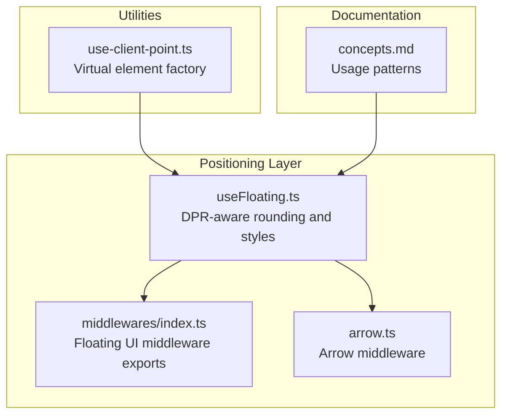
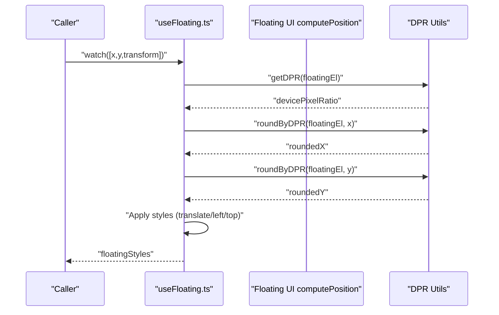
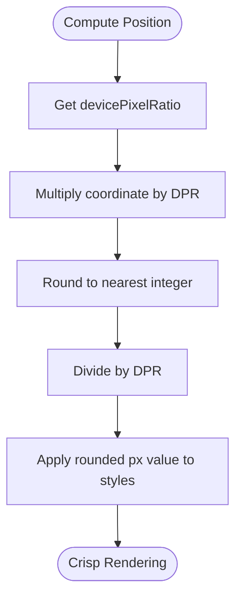
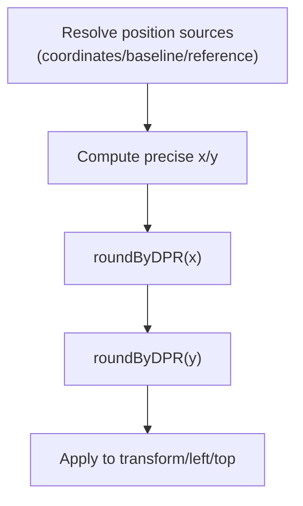
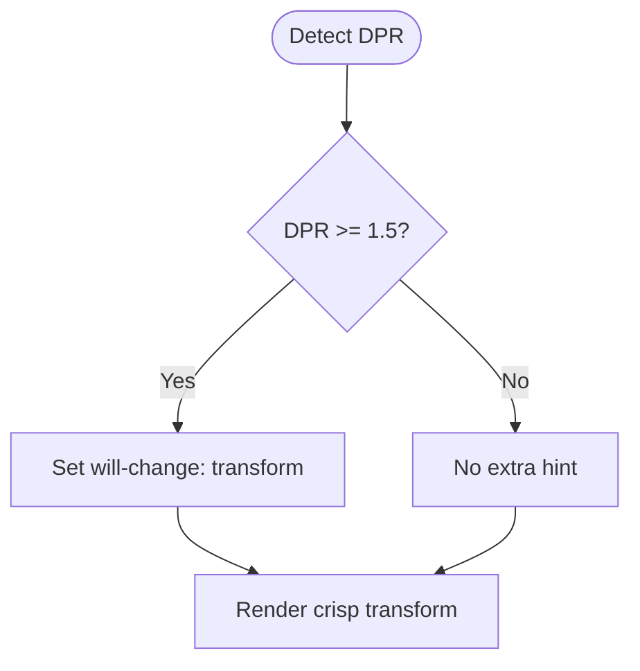
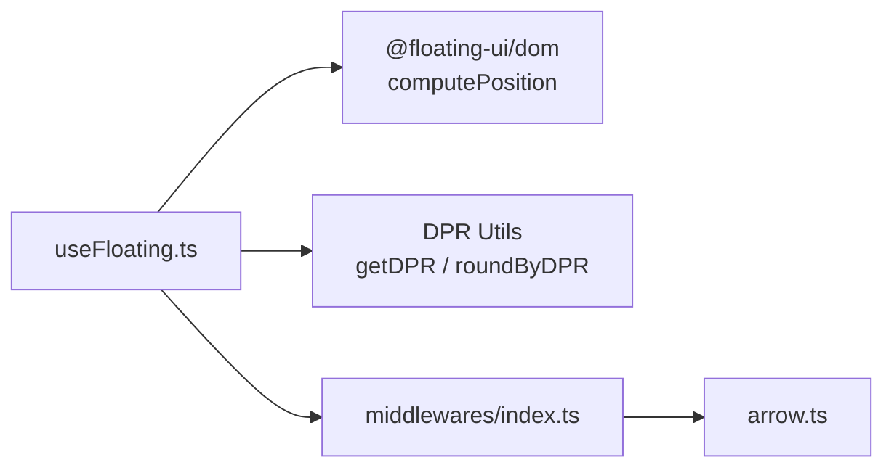

# Device Pixel Ratio Awareness

<cite>
**Referenced Files in This Document**
- [use-floating.ts](file://src/composables/positioning/use-floating.ts)
- [index.ts](file://src/composables/positioning/index.ts)
- [index.ts](file://src/composables/middlewares/index.ts)
- [arrow.ts](file://src/composables/middlewares/arrow.ts)
- [concepts.md](file://docs/guide/concepts.md)
- [index.ts](file://src/composables/positioning/use-client-point.ts)
- [use-client-point.test.ts](file://src/composables/__tests__/use-client-point.test.ts)
</cite>

## Table of Contents
1. [Introduction](#introduction)
2. [Project Structure](#project-structure)
3. [Core Components](#core-components)
4. [Architecture Overview](#architecture-overview)
5. [Detailed Component Analysis](#detailed-component-analysis)
6. [Dependency Analysis](#dependency-analysis)
7. [Performance Considerations](#performance-considerations)
8. [Troubleshooting Guide](#troubleshooting-guide)
9. [Conclusion](#conclusion)

## Introduction
This document explains how VFloat accounts for device pixel ratio (DPR) to maintain crisp positioning on high-DPI displays. It covers the calculation methodology, rounding strategies, and performance implications, and demonstrates how DPR affects coordinate calculations and element positioning. It also documents configuration options, trade-offs, and best practices for visual quality across different display densities.

## Project Structure
VFloat integrates DPR-awareness primarily within the positioning composable (`useFloating`) and supporting utilities. The positioning pipeline relies on Floating UI’s `computePosition`, while VFloat adds DPR-aware rounding and conditional optimizations for high-DPI devices.

**Diagram sources**
- [use-floating.ts:196-383](file://src/composables/positioning/use-floating.ts#L196-L383)
- [index.ts:1-4](file://src/composables/positioning/index.ts#L1-L4)
- [index.ts:1-4](file://src/composables/middlewares/index.ts#L1-L4)
- [arrow.ts:1-51](file://src/composables/middlewares/arrow.ts#L1-L51)
- [index.ts:139-339](file://src/composables/positioning/use-client-point.ts#L139-L339)
- [concepts.md:1-192](file://docs/guide/concepts.md#L1-L192)

**Section sources**
- [use-floating.ts:196-383](file://src/composables/positioning/use-floating.ts#L196-L383)
- [index.ts:1-4](file://src/composables/positioning/index.ts#L1-L4)
- [index.ts:1-4](file://src/composables/middlewares/index.ts#L1-L4)
- [arrow.ts:1-51](file://src/composables/middlewares/arrow.ts#L1-L51)
- [index.ts:139-339](file://src/composables/positioning/use-client-point.ts#L139-L339)
- [concepts.md:1-192](file://docs/guide/concepts.md#L1-L192)

## Core Components
- Device pixel ratio retrieval and rounding:
  - `getDPR(el)` reads the window’s devicePixelRatio for an element’s document.
  - `roundByDPR(el, value)` scales, rounds to the nearest tick, then scales back to ensure pixel-aligned rendering on high-DPI screens.
- Positioning styles:
  - The composable applies DPR-aware rounding to computed x/y coordinates and conditionally sets `will-change: transform` for high-DPI devices to improve compositing performance.

These utilities are used inside the `useFloating` composable to ensure crisp, pixel-aligned positioning.

**Section sources**
- [use-floating.ts:368-383](file://src/composables/positioning/use-floating.ts#L368-L383)

## Architecture Overview
The positioning pipeline computes coordinates with Floating UI and then applies DPR-aware rounding before applying styles to the floating element.

**Diagram sources**
- [use-floating.ts:311-343](file://src/composables/positioning/use-floating.ts#L311-L343)
- [use-floating.ts:368-383](file://src/composables/positioning/use-floating.ts#L368-L383)

## Detailed Component Analysis

### Device Pixel Ratio Calculation and Rounding
- Purpose: Ensure rendered positions align to physical pixels on high-DPI displays to avoid blur or fractional pixel rendering.
- Methodology:
  - Retrieve DPR from the element’s window.
  - Scale the computed coordinate by DPR, round to the nearest integer, then divide by DPR to map back to CSS pixels.
- Impact:
  - Prevents blurry text and borders on Retina-class displays.
  - Maintains sharp edges for tooltips, popovers, and dropdowns.

**Diagram sources**
- [use-floating.ts:368-383](file://src/composables/positioning/use-floating.ts#L368-L383)

**Section sources**
- [use-floating.ts:368-383](file://src/composables/positioning/use-floating.ts#L368-L383)

### Positioning Precision and Coordinate Calculations
- Precision model:
  - Floating UI computes precise x/y values in CSS pixels.
  - VFloat rounds these values using the device’s DPR to snap to device pixels.
- Coordinate precedence:
  - The virtual element factory resolves final coordinates from explicit coordinates, baseline coordinates, or reference element fallbacks. These are then rounded using the DPR-aware method.
- Practical effect:
  - On 2x displays, a computed x=10.7 becomes 10.5 after rounding, preventing subpixel blurriness.
  - On 1x displays, rounding is a no-op, preserving existing behavior.

**Diagram sources**
- [index.ts:139-339](file://src/composables/positioning/use-client-point.ts#L139-L339)
- [use-floating.ts:368-383](file://src/composables/positioning/use-floating.ts#L368-L383)

**Section sources**
- [index.ts:139-339](file://src/composables/positioning/use-client-point.ts#L139-L339)
- [use-floating.ts:368-383](file://src/composables/positioning/use-floating.ts#L368-L383)

### Performance Implications
- Conditional optimizations:
  - For high-DPI devices (DPR ≥ 1.5), VFloat sets `will-change: transform` to hint the browser to optimize compositing during transforms.
- Cost vs benefit:
  - DPR rounding is O(1) per frame and negligible.
  - `will-change` can reduce jank on heavy transforms but should be used sparingly to avoid over-optimization.

**Diagram sources**
- [use-floating.ts:326-340](file://src/composables/positioning/use-floating.ts#L326-L340)

**Section sources**
- [use-floating.ts:326-340](file://src/composables/positioning/use-floating.ts#L326-L340)

### Configuration Options and Trade-offs
- Transform vs top/left:
  - The `transform` option toggles between CSS transforms and top/left positioning. Both paths apply the same DPR-aware rounding.
- Middleware compatibility:
  - VFloat’s DPR logic runs after Floating UI computes positions and is middleware-agnostic.
- Behavior guarantees:
  - On 1x displays: no rounding overhead, identical to standard positioning.
  - On high-DPI displays: consistently crisp edges with minimal performance cost.

**Section sources**
- [use-floating.ts:65-106](file://src/composables/positioning/use-floating.ts#L65-L106)
- [use-floating.ts:305-343](file://src/composables/positioning/use-floating.ts#L305-L343)

### Examples: Improvements on High-DPI Displays
- Retina-style displays (e.g., 2x):
  - Without DPR rounding, a computed x=10.7 may render as 10.7px, causing blur.
  - With `roundByDPR`, it becomes 10.5px, aligning to a whole device pixel for sharp rendering.
- Other high-DPI devices:
  - Similar benefits on 2.5x or 3x displays, ensuring arrow tips, borders, and text remain crisp.

[No sources needed since this section provides conceptual examples]

### Relationship Between DPR and Visual Quality
- Higher DPR improves perceived sharpness because more physical pixels represent each CSS pixel.
- VFloat’s rounding ensures that computed positions map cleanly onto device pixels, minimizing interpolation artifacts.

[No sources needed since this section provides conceptual explanations]

## Dependency Analysis
- Internal dependencies:
  - `useFloating` depends on Floating UI for coordinate computation and on internal DPR utilities for pixel alignment.
  - Arrow middleware is integrated into the middleware chain when an arrow element is configured.
- External dependency:
  - Uses the browser’s `devicePixelRatio` via the `window` object.

**Diagram sources**
- [use-floating.ts:196-383](file://src/composables/positioning/use-floating.ts#L196-L383)
- [index.ts:1-4](file://src/composables/middlewares/index.ts#L1-L4)
- [arrow.ts:1-51](file://src/composables/middlewares/arrow.ts#L1-L51)

**Section sources**
- [use-floating.ts:196-383](file://src/composables/positioning/use-floating.ts#L196-L383)
- [index.ts:1-4](file://src/composables/middlewares/index.ts#L1-L4)
- [arrow.ts:1-51](file://src/composables/middlewares/arrow.ts#L1-L51)

## Performance Considerations
- Cost of DPR rounding:
  - Minimal overhead; performed per watched x/y update.
- Conditional hints:
  - `will-change: transform` is applied only for DPR ≥ 1.5 to avoid unnecessary hints on low-DPI devices.
- Best practices:
  - Prefer transform-based positioning for smoother animations on high-DPI devices.
  - Keep middleware chains concise to minimize recomputation frequency.

[No sources needed since this section provides general guidance]

## Troubleshooting Guide
- Symptoms:
  - Blurry edges or text on high-DPI displays.
  - Jitter or slight misalignment when moving tooltips/popovers.
- Likely causes:
  - Using top/left without transform on high-DPI devices.
  - Disabling the transform option unintentionally.
- Fixes:
  - Ensure transform-based positioning is enabled so VFloat can apply DPR rounding and `will-change` hints.
  - Verify that the floating element is attached to the DOM when `getDPR` is called (DPR retrieval requires a live window).
  - Confirm that coordinates are not overridden elsewhere in the app’s CSS or layout pipeline.

**Section sources**
- [use-floating.ts:326-340](file://src/composables/positioning/use-floating.ts#L326-L340)
- [use-floating.ts:368-383](file://src/composables/positioning/use-floating.ts#L368-L383)

## Conclusion
VFloat’s DPR-aware positioning ensures crisp visuals on high-DPI displays by rounding computed coordinates to device pixels and applying targeted performance hints. The approach is efficient, transparent, and maintains backward compatibility on standard displays. By leveraging transform-based positioning and the built-in DPR utilities, developers can achieve consistently sharp UI elements across diverse device densities.