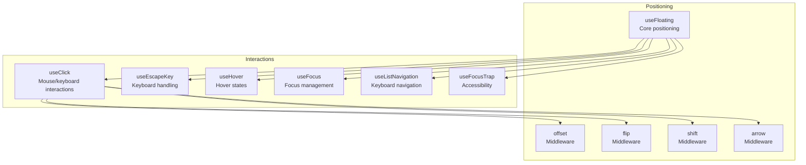
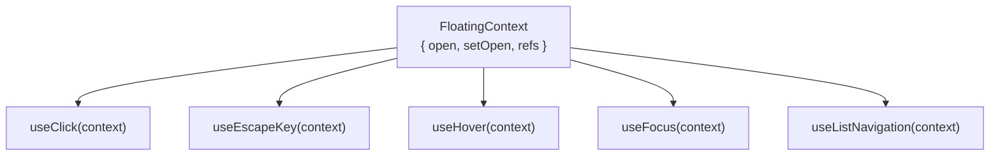
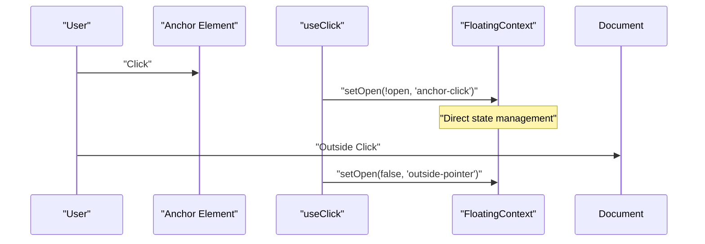
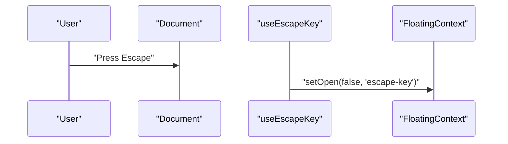
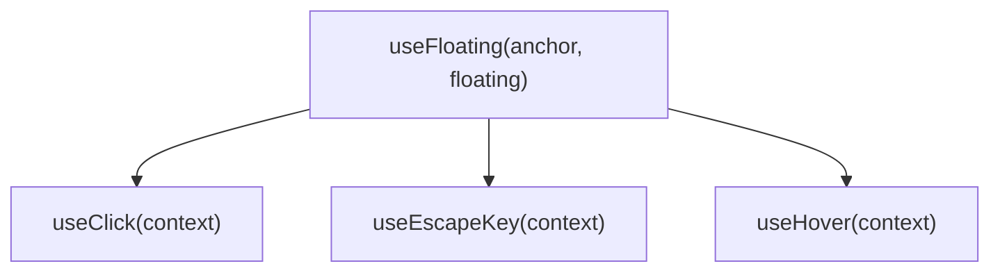
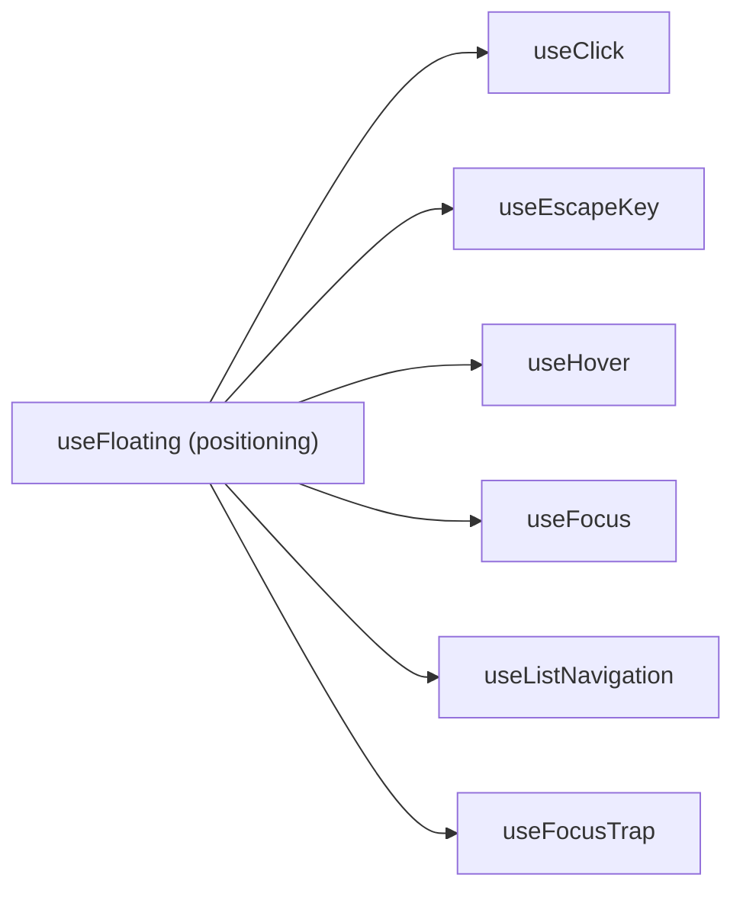

# Floating Tree System

<cite>
**Referenced Files in This Document**
- [use-click.ts](file://src/composables/interactions/use-click.ts)
- [use-escape-key.ts](file://src/composables/interactions/use-escape-key.ts)
- [index.ts](file://src/composables/index.ts)
- [Tree.vue](file://playground/demo/Tree.vue)
- [SafePolygonDemo.vue](file://playground/demo/SafePolygonDemo.vue)
- [Menu.vue](file://playground/components/Menu.vue)
</cite>

## Update Summary
**Changes Made**
- Removed all references to floating tree API implementation as it has been completely removed from the codebase
- Updated all documentation to reflect the simplified API where interaction composables accept only FloatingContext parameters
- Removed floating tree architecture diagrams and implementation details
- Updated examples to show direct use of positioning composables without tree abstraction
- Revised troubleshooting guide to remove tree-specific issues

## Table of Contents
1. [Introduction](#introduction)
2. [Project Structure](#project-structure)
3. [Core Components](#core-components)
4. [Architecture Overview](#architecture-overview)
5. [Detailed Component Analysis](#detailed-component-analysis)
6. [Dependency Analysis](#dependency-analysis)
7. [Performance Considerations](#performance-considerations)
8. [Troubleshooting Guide](#troubleshooting-guide)
9. [Conclusion](#conclusion)
10. [Appendices](#appendices)

## Introduction
VFloat provides a comprehensive set of composables for creating floating UI elements with sophisticated interaction patterns. The library offers positioning capabilities through useFloating and interaction composables for handling clicks, hover states, focus management, keyboard navigation, and escape key behavior. This documentation covers the current simplified API where all interaction composables work directly with FloatingContext instances without requiring a separate floating tree abstraction.

**Important**: The floating tree system has been completely removed from the library. All previous documentation related to floating tree APIs, tree node coordination, and hierarchical positioning has been deprecated.

## Project Structure
The current implementation focuses on individual composables that can be combined to create complex floating UI behaviors. The positioning composables handle element placement and middleware, while interaction composables manage user interactions and state changes.

**Diagram sources**
- [index.ts:1-4](file://src/composables/index.ts#L1-L4)

## Core Components
The current API consists of focused composables that work independently:

### Positioning Composables
- **useFloating**: Core positioning logic with placement, middleware configuration, and state management
- **Middleware**: offset, flip, shift, arrow for advanced positioning behaviors

### Interaction Composables  
- **useClick**: Handles anchor clicks and optional outside click detection
- **useEscapeKey**: Manages escape key behavior for closing floating elements
- **useHover**: Manages hover states and timing for floating elements
- **useFocus**: Handles focus management and focus traps
- **useListNavigation**: Provides keyboard navigation for lists and menus
- **useFocusTrap**: Ensures proper focus management within floating elements

**Section sources**
- [use-click.ts:51-304](file://src/composables/interactions/use-click.ts#L51-L304)
- [use-escape-key.ts:62-86](file://src/composables/interactions/use-escape-key.ts#L62-L86)

## Architecture Overview
The simplified architecture eliminates the floating tree abstraction in favor of direct composable composition. Each floating element maintains its own context and interactions, allowing for flexible combinations without hierarchical constraints.

**Diagram sources**
- [use-click.ts:310](file://src/composables/interactions/use-click.ts#L310)
- [use-escape-key.ts:9](file://src/composables/interactions/use-escape-key.ts#L9)

## Detailed Component Analysis

### useClick Composable
Handles anchor element interactions including inside clicks for toggling and outside clicks for closing. The composable accepts a FloatingContext and provides comprehensive event handling for mouse, keyboard, and touch interactions.

**Updated** Simplified to accept only FloatingContext parameter instead of TreeNode union types

**Diagram sources**
- [use-click.ts:87-103](file://src/composables/interactions/use-click.ts#L87-L103)

**Section sources**
- [use-click.ts:51-304](file://src/composables/interactions/use-click.ts#L51-L304)

### useEscapeKey Composable
Manages escape key behavior for closing floating elements. The composable listens to document keydown events and closes the associated floating element when escape is pressed.

**Updated** Now accepts only FloatingContext parameter

**Diagram sources**
- [use-escape-key.ts:69-82](file://src/composables/interactions/use-escape-key.ts#L69-L82)

**Section sources**
- [use-escape-key.ts:62-86](file://src/composables/interactions/use-escape-key.ts#L62-L86)

### Practical Implementation Patterns
With the simplified API, floating elements can be created and managed independently:

**Diagram sources**
- [Tree.vue:10](file://playground/demo/Tree.vue#L10)
- [SafePolygonDemo.vue:42](file://playground/demo/SafePolygonDemo.vue#L42)

**Section sources**
- [Tree.vue:1-30](file://playground/demo/Tree.vue#L1-L30)
- [SafePolygonDemo.vue:42-70](file://playground/demo/SafePolygonDemo.vue#L42-L70)

## Dependency Analysis
The interaction composables have minimal dependencies and work directly with FloatingContext instances:

**Diagram sources**
- [use-click.ts:4](file://src/composables/interactions/use-click.ts#L4)
- [use-escape-key.ts:3](file://src/composables/interactions/use-escape-key.ts#L3)

**Section sources**
- [use-click.ts:4](file://src/composables/interactions/use-click.ts#L4)
- [use-escape-key.ts:3](file://src/composables/interactions/use-escape-key.ts#L3)

## Performance Considerations
- Individual composables are lightweight and only attach necessary event listeners
- No tree traversal overhead or hierarchical state management
- Direct context access reduces computation complexity
- Middleware can be selectively applied based on specific needs
- Memory usage scales linearly with active floating elements

## Troubleshooting Guide
Common issues and solutions for the simplified API:

### Basic Setup Issues
- **Missing FloatingContext**: Ensure useFloating is called before interaction composables
- **Event conflicts**: Check for conflicting event handlers on anchor elements
- **Outside click detection**: Verify anchor and floating element references are properly set

### Interaction-Specific Issues
- **Escape key not working**: Confirm useEscapeKey is called with the same context as useFloating
- **Click outside not triggering**: Check outsideClick option and event capture settings
- **Hover timing issues**: Adjust hover delay options for better user experience

**Section sources**
- [Tree.vue:10](file://playground/demo/Tree.vue#L10)
- [SafePolygonDemo.vue:42](file://playground/demo/SafePolygonDemo.vue#L42)

## Conclusion
The simplified VFloat API provides powerful floating UI capabilities through focused, composable interactions. By eliminating the floating tree abstraction, the library achieves better performance, simpler debugging, and more flexible composition patterns. Each floating element manages its own interactions independently, enabling complex UI hierarchies through straightforward composable combinations.

**Important Note**: The floating tree system has been completely removed from the library. Any references to floating tree APIs, tree node coordination, or hierarchical positioning should be ignored as they are no longer part of the current implementation.

## Appendices

### API Quick Reference
- **useFloating**: Core positioning with placement and middleware configuration
- **useClick**: Anchor and outside click handling with comprehensive options
- **useEscapeKey**: Escape key behavior with custom handlers
- **useHover**: Hover state management with timing controls
- **useFocus**: Focus management and focus trap integration
- **useListNavigation**: Keyboard navigation for lists and menus
- **useFocusTrap**: Accessibility-focused focus management

**Section sources**
- [use-click.ts:51-304](file://src/composables/interactions/use-click.ts#L51-L304)
- [use-escape-key.ts:62-86](file://src/composables/interactions/use-escape-key.ts#L62-L86)