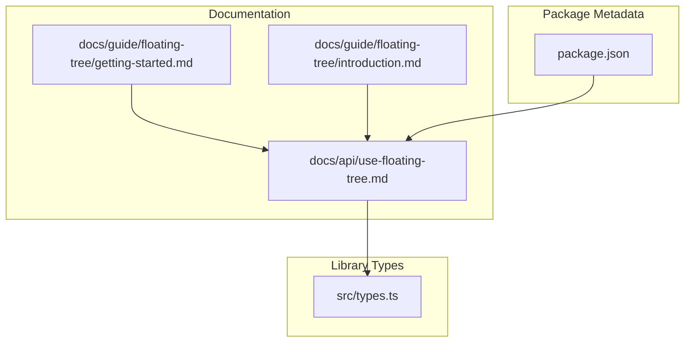
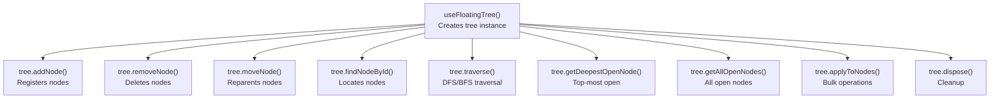
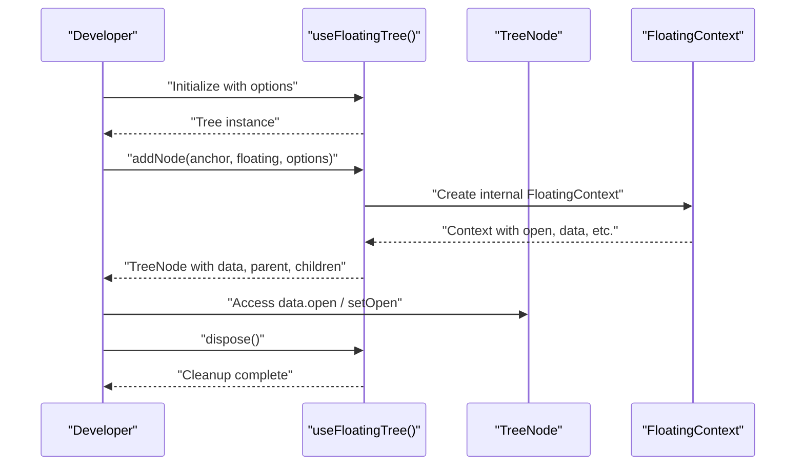
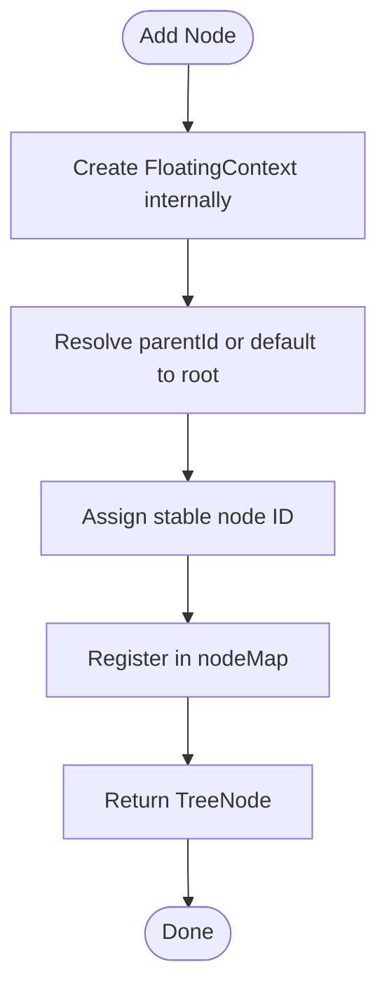
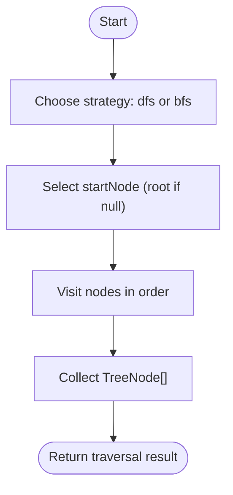
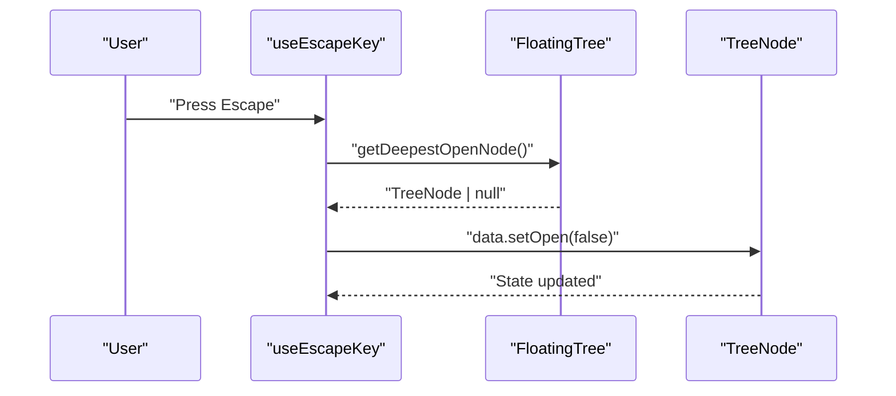
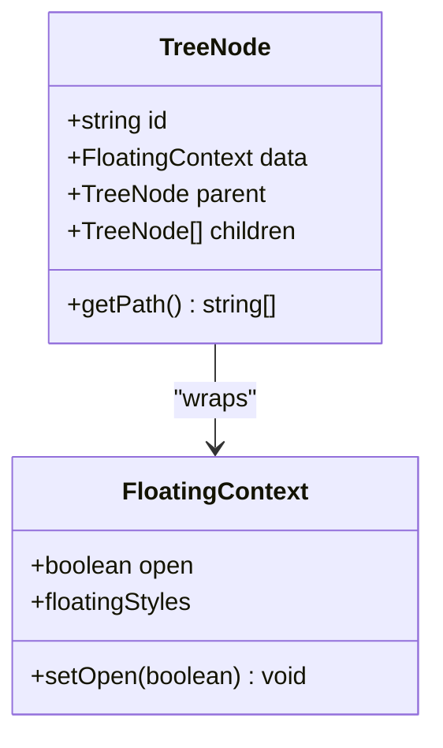
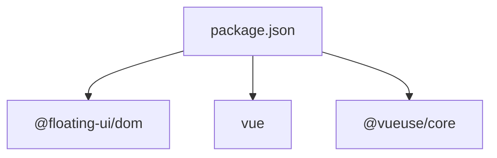

# API Reference and Technical Details

<cite>
**Referenced Files in This Document**
- [use-floating-tree.md](file://docs/api/use-floating-tree.md)
- [getting-started.md](file://docs/guide/floating-tree/getting-started.md)
- [introduction.md](file://docs/guide/floating-tree/introduction.md)
- [types.ts](file://src/types.ts)
- [package.json](file://package.json)
</cite>

## Table of Contents
1. [Introduction](#introduction)
2. [Project Structure](#project-structure)
3. [Core Components](#core-components)
4. [Architecture Overview](#architecture-overview)
5. [Detailed Component Analysis](#detailed-component-analysis)
6. [Dependency Analysis](#dependency-analysis)
7. [Performance Considerations](#performance-considerations)
8. [Troubleshooting Guide](#troubleshooting-guide)
9. [Conclusion](#conclusion)
10. [Appendices](#appendices)

## Introduction
This document provides a comprehensive API reference and technical deep dive for the floating tree system centered around the useFloatingTree composable. It covers the complete interface, parameters, return values, configuration options, tree context APIs, node registration and traversal methods, event handling mechanisms, advanced operations, error handling, edge cases, debugging techniques, performance characteristics, optimization guidelines, best practices, and migration information for different VFloat versions.

## Project Structure
The floating tree system is part of the VFloat library, which offers a Vue 3 port of Floating UI. The relevant API surface for the floating tree is documented in the documentation site under the API and Guides sections for floating tree. The core types used by the system are defined in the shared types module.

**Diagram sources**
- [use-floating-tree.md:1-430](file://docs/api/use-floating-tree.md#L1-L430)
- [getting-started.md:1-230](file://docs/guide/floating-tree/getting-started.md#L1-L230)
- [introduction.md:1-42](file://docs/guide/floating-tree/introduction.md#L1-L42)
- [types.ts:1-29](file://src/types.ts#L1-L29)
- [package.json:1-77](file://package.json#L1-L77)

**Section sources**
- [use-floating-tree.md:1-430](file://docs/api/use-floating-tree.md#L1-L430)
- [getting-started.md:1-230](file://docs/guide/floating-tree/getting-started.md#L1-L230)
- [introduction.md:1-42](file://docs/guide/floating-tree/introduction.md#L1-L42)
- [types.ts:1-29](file://src/types.ts#L1-L29)
- [package.json:1-77](file://package.json#L1-L77)

## Core Components
This section documents the primary useFloatingTree composable and its associated APIs, including node management, traversal, querying, and lifecycle operations.

- useFloatingTree(treeOptions?)
  - Purpose: Creates and manages a hierarchical tree of floating elements.
  - Parameters:
    - treeOptions: Optional configuration for the tree instance.
  - Returns: An object exposing the tree API and state.
  - Behavior: Initializes an empty tree ready to accept nodes via addNode.

- tree.nodeMap
  - Type: readonly nodeMap: Readonly<Map<string, TreeNode<FloatingContext>>>
  - Description: Reactive map of all nodes keyed by ID. Useful for debugging and direct access.

- tree.root
  - Type: readonly root: TreeNode<FloatingContext> | null
  - Description: Reference to the root node or null if none exists.

- tree.addNode(anchorEl, floatingEl, options?)
  - Purpose: Adds a new floating element to the tree by creating its context internally.
  - Parameters:
    - anchorEl: Ref<AnchorElement>
    - floatingEl: Ref<FloatingElement>
    - options?: AddNodeOptions
  - Returns: TreeNode<FloatingContext> | null
  - Behavior: Assigns a stable ID, supports parentId for parent-child relationships, and triggers automatic closure of descendants when a parent closes.

- TreeNode structure
  - Properties and methods include data (floating context), parent, children, and utility methods like getPath().

- tree.removeNode(nodeId, deleteStrategy?)
  - Purpose: Removes a node by ID.
  - Parameters:
    - nodeId: string
    - deleteStrategy?: "orphan" | "recursive"
  - Returns: boolean

- tree.moveNode(nodeId, newParentId)
  - Purpose: Moves an existing node to a new parent.
  - Parameters:
    - nodeId: string
    - newParentId: string | null
  - Returns: boolean

- tree.findNodeById(nodeId)
  - Purpose: Locates a node by ID.
  - Parameters:
    - nodeId: string
  - Returns: TreeNode<FloatingContext> | null

- tree.traverse(strategy?, startNode?)
  - Purpose: Traverses the tree using DFS or BFS.
  - Parameters:
    - strategy?: "dfs" | "bfs"
    - startNode?: TreeNode<FloatingContext> | null
  - Returns: TreeNode<FloatingContext>[]

- tree.getDeepestOpenNode()
  - Purpose: Returns the deepest open node.
  - Returns: TreeNode<FloatingContext> | null

- tree.getAllOpenNodes()
  - Purpose: Retrieves all currently open nodes.
  - Returns: TreeNode<FloatingContext>[]

- tree.applyToNodes(nodeId, callback, options?)
  - Purpose: Executes a callback on nodes related to a target node based on a relationship selector.
  - Parameters:
    - nodeId: string
    - callback: (node: TreeNode<FloatingContext>) => void
    - options?: { relationship?: NodeRelationship; applyToMatching?: boolean }
  - Returns: void

- tree.dispose()
  - Purpose: Cleans up the tree instance to prevent memory leaks.
  - Returns: void

- NodeRelationship
  - Type: Union of relationship selectors for applyToNodes targeting ancestors, siblings, descendants, children, self plus relatives, full branches, and complements.

**Section sources**
- [use-floating-tree.md:1-430](file://docs/api/use-floating-tree.md#L1-L430)

## Architecture Overview
The floating tree architecture centers on a hierarchical composition of nodes, each wrapping a FloatingContext. The tree manages state transitions, ancestor-descendant relationships, and event-driven closures. The following diagram maps the primary APIs and their relationships.

**Diagram sources**
- [use-floating-tree.md:1-430](file://docs/api/use-floating-tree.md#L1-L430)

## Detailed Component Analysis

### useFloatingTree Composable
- Purpose: Centralized management of floating UI hierarchy.
- Key behaviors:
  - Initializes an empty tree.
  - Provides node lifecycle management (add, remove, move).
  - Offers traversal and querying utilities.
  - Supports bulk operations via applyToNodes.
  - Ensures cleanup via dispose.

**Diagram sources**
- [use-floating-tree.md:1-430](file://docs/api/use-floating-tree.md#L1-L430)

**Section sources**
- [use-floating-tree.md:1-430](file://docs/api/use-floating-tree.md#L1-L430)

### Node Registration and Lifecycle
- addNode:
  - Creates a FloatingContext internally from anchor and floating refs.
  - Supports parentId to establish parent-child relationships.
  - Automatically closes descendants when a parent closes with reason "tree-ancestor-close".
- removeNode:
  - Deletion strategies: "orphan" detaches children; "recursive" removes the subtree.
- moveNode:
  - Repositions a node under a new parent while preserving children and data.

**Diagram sources**
- [use-floating-tree.md:84-126](file://docs/api/use-floating-tree.md#L84-L126)

**Section sources**
- [use-floating-tree.md:84-126](file://docs/api/use-floating-tree.md#L84-L126)

### Tree Traversal and Querying
- traverse:
  - Supports DFS and BFS strategies.
  - Always starts with the provided startNode (or root if omitted).
- getDeepestOpenNode:
  - Returns the most nested open node; useful for Escape key handling.
- getAllOpenNodes:
  - Enumerates all open nodes for analytics or bulk operations.

**Diagram sources**
- [use-floating-tree.md:231-262](file://docs/api/use-floating-tree.md#L231-L262)

**Section sources**
- [use-floating-tree.md:231-262](file://docs/api/use-floating-tree.md#L231-L262)

### Programmatic Control and Event Handling
- Programmatic toggling:
  - Access node.data.open to set or observe open state.
- Event handling integration:
  - Works with interaction composables (e.g., useClick, useEscapeKey).
  - Example: Use getDeepestOpenNode to close the topmost element on Escape.

**Diagram sources**
- [use-floating-tree.md:264-286](file://docs/api/use-floating-tree.md#L264-L286)
- [getting-started.md:82-103](file://docs/guide/floating-tree/getting-started.md#L82-L103)

**Section sources**
- [use-floating-tree.md:264-286](file://docs/api/use-floating-tree.md#L264-L286)
- [getting-started.md:82-103](file://docs/guide/floating-tree/getting-started.md#L82-L103)

### Advanced Features and Utilities
- applyToNodes:
  - Bulk operations using NodeRelationship selectors.
  - Options include relationship and applyToMatching for fine-grained control.
- Relationship selectors:
  - ancestors-only, siblings-only, descendants-only, children-only
  - self-and-ancestors, self-and-children, self-and-descendants, self-and-siblings
  - self-ancestors-and-children, full-branch, all-except-branch

**Diagram sources**
- [use-floating-tree.md:128-150](file://docs/api/use-floating-tree.md#L128-L150)

**Section sources**
- [use-floating-tree.md:313-365](file://docs/api/use-floating-tree.md#L313-L365)
- [use-floating-tree.md:393-429](file://docs/api/use-floating-tree.md#L393-L429)

## Dependency Analysis
- Internal dependencies:
  - The floating tree relies on shared types for VirtualElement and OpenChangeReason.
- External dependencies:
  - The package metadata indicates core dependencies including @floating-ui/dom, Vue 3, and related utilities.

**Diagram sources**
- [package.json:39-46](file://package.json#L39-L46)

**Section sources**
- [package.json:39-46](file://package.json#L39-L46)

## Performance Considerations
- Prefer using tree.traverse with appropriate strategies to avoid scanning the entire tree unnecessarily.
- Use getDeepestOpenNode for Escape key handling to minimize state mutations to a single target.
- Leverage applyToNodes with precise NodeRelationship selectors to reduce repeated lookups and updates.
- Keep nodeMap access minimal; rely on provided methods for most operations to benefit from internal optimizations.
- Dispose of the tree instance on component unmount to prevent memory leaks and stale references.

[No sources needed since this section provides general guidance]

## Troubleshooting Guide
- Symptom: Node does not close when parent closes.
  - Cause: Missing parentId linkage or incorrect parent node reference.
  - Resolution: Ensure parentId is set during addNode and that the parent node exists.
- Symptom: Unexpected open state after navigation.
  - Cause: Multiple nodes open at the same depth.
  - Resolution: Use getDeepestOpenNode to target the topmost element for dismissal.
- Symptom: Memory leak after component unmount.
  - Cause: Tree not disposed.
  - Resolution: Call tree.dispose() in onUnmounted.
- Symptom: applyToNodes not affecting expected nodes.
  - Cause: Incorrect NodeRelationship selector.
  - Resolution: Verify the relationship selector and consider using self-and-descendants for cascading effects.

**Section sources**
- [use-floating-tree.md:100-102](file://docs/api/use-floating-tree.md#L100-L102)
- [use-floating-tree.md:264-286](file://docs/api/use-floating-tree.md#L264-L286)
- [use-floating-tree.md:367-391](file://docs/api/use-floating-tree.md#L367-L391)
- [use-floating-tree.md:393-429](file://docs/api/use-floating-tree.md#L393-L429)

## Conclusion
The floating tree system provides a robust, hierarchical approach to managing complex floating UI interactions in Vue applications. Its streamlined API reduces boilerplate, centralizes state management, and simplifies event handling across nested elements. By leveraging the documented APIs, relationships, and best practices, developers can build scalable and maintainable floating UI experiences.

[No sources needed since this section summarizes without analyzing specific files]

## Appendices

### Type Definitions
- VirtualElement
  - getBoundingClientRect(): DOMRect
  - contextElement?: Element
- OpenChangeReason
  - Enumerated values: "anchor-click", "keyboard-activate", "outside-pointer", "focus", "blur", "hover", "escape-key", "tree-ancestor-close", "programmatic"

**Section sources**
- [types.ts:8-28](file://src/types.ts#L8-L28)

### Migration and Compatibility Notes
- Version context:
  - The package version is 0.10.0, indicating a stable release baseline.
- Migration highlights:
  - New streamlined API eliminates redundant useFloating calls; nodes are registered directly via addNode.
  - Old API required separate useFloating calls per node and manual tree attachment; new API creates contexts internally.

**Section sources**
- [package.json:3-3](file://package.json#L3-L3)
- [package.json:2-3](file://package.json#L2-L3)
- [getting-started.md:205-225](file://docs/guide/floating-tree/getting-started.md#L205-L225)