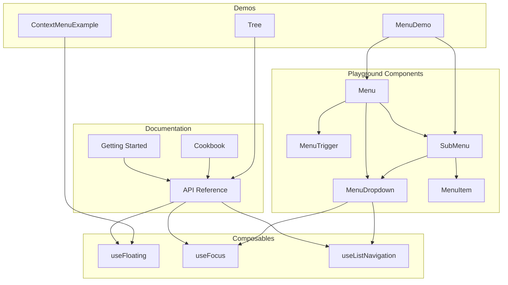
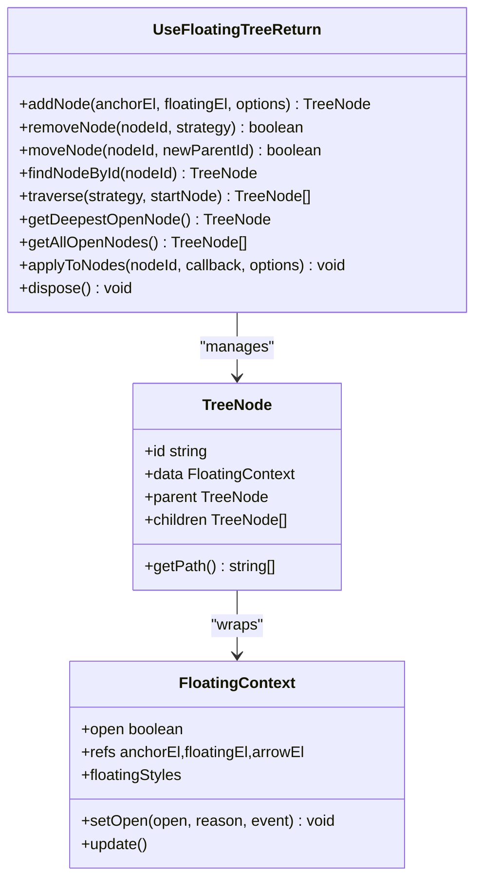
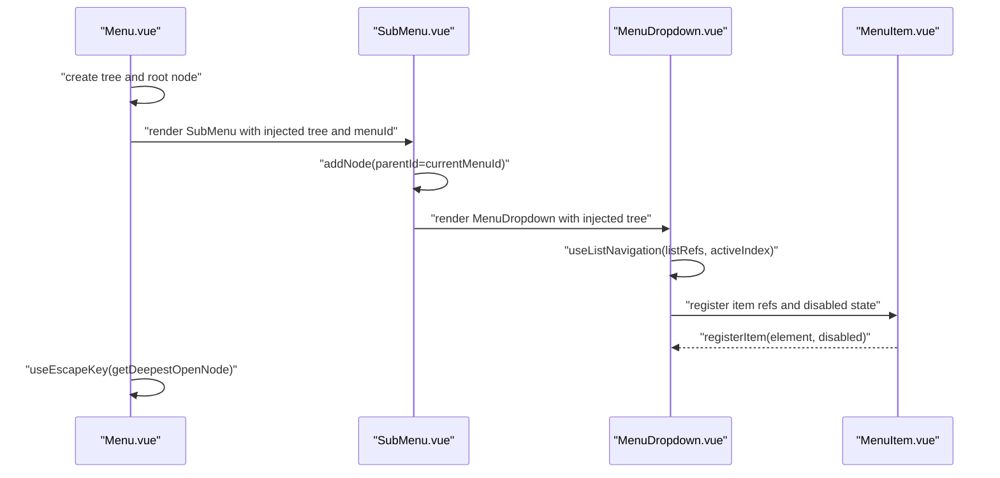
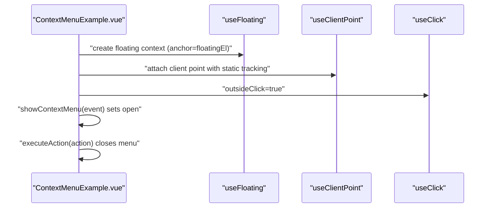
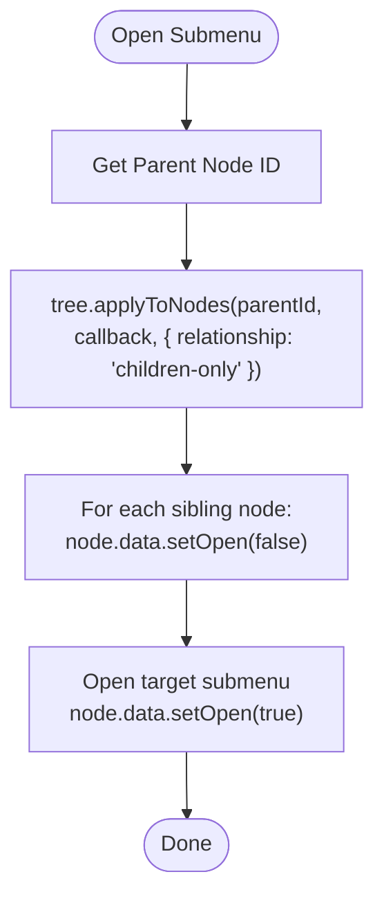
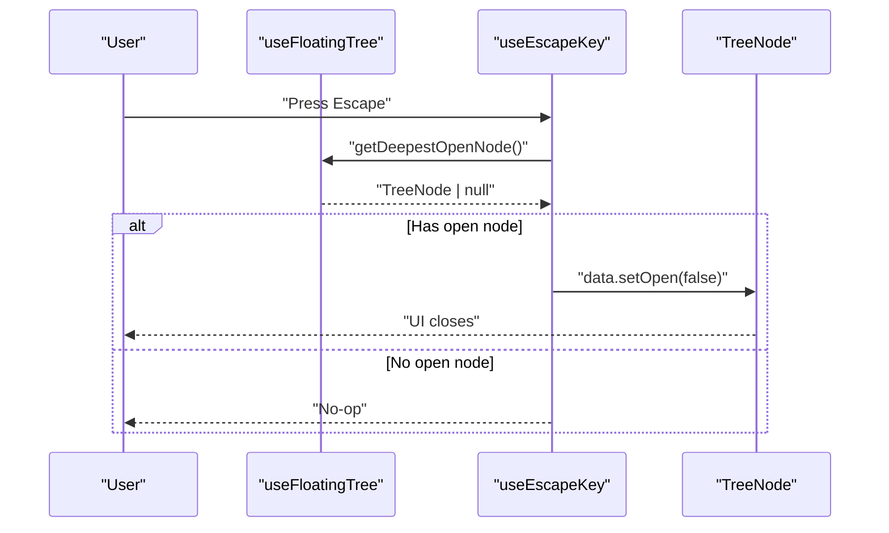
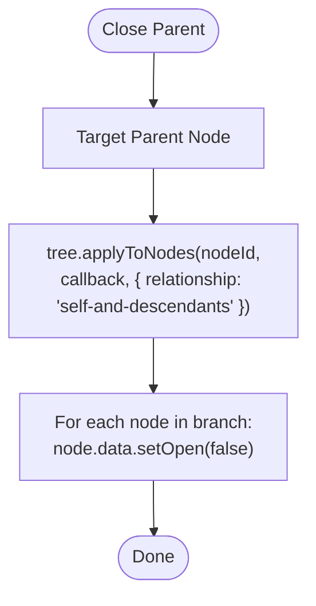
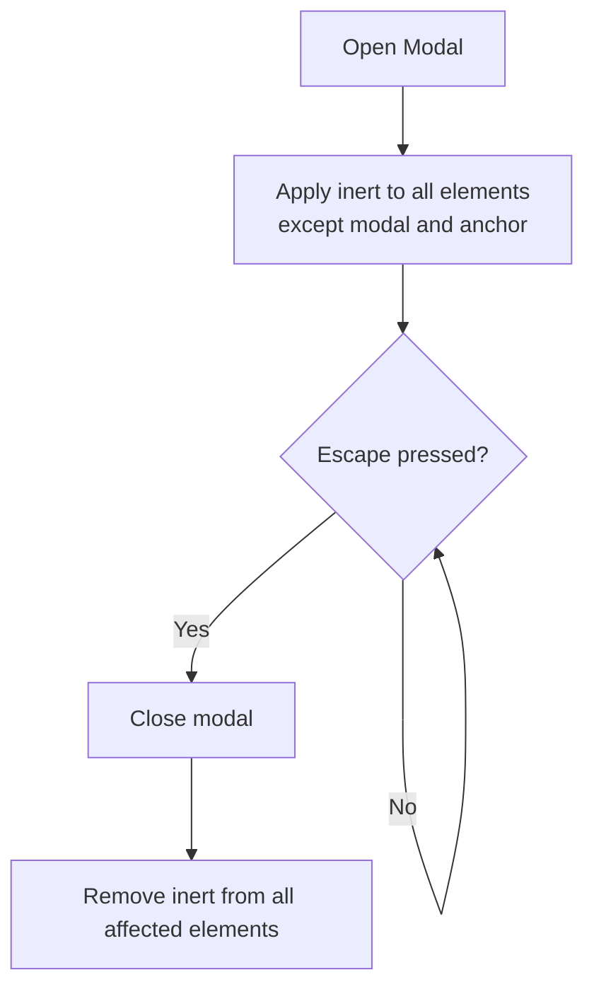
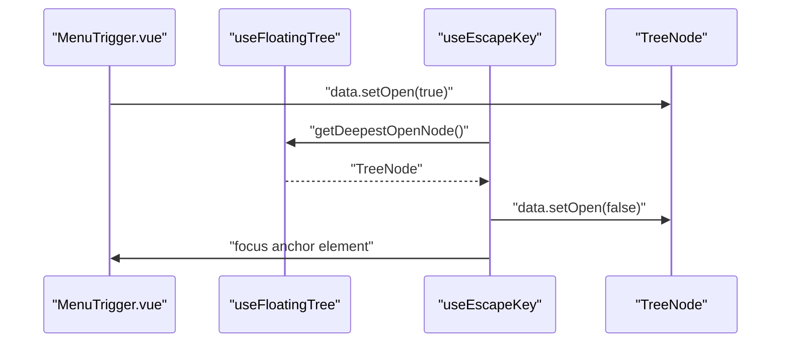
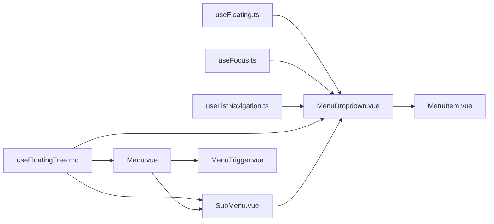

# Cookbook and Practical Examples

<cite>
**Referenced Files in This Document**
- [cookbook.md](file://docs/guide/floating-tree/cookbook.md)
- [getting-started.md](file://docs/guide/floating-tree/getting-started.md)
- [use-floating-tree.md](file://docs/api/use-floating-tree.md)
- [use-floating.ts](file://src/composables/positioning/use-floating.ts)
- [use-focus.ts](file://src/composables/interactions/use-focus.ts)
- [use-list-navigation.ts](file://src/composables/interactions/use-list-navigation.ts)
- [Menu.vue](file://playground/components/Menu.vue)
- [MenuDropdown.vue](file://playground/components/MenuDropdown.vue)
- [MenuTrigger.vue](file://playground/components/MenuTrigger.vue)
- [MenuItem.vue](file://playground/components/MenuItem.vue)
- [SubMenu.vue](file://playground/components/SubMenu.vue)
- [MenuDemo.vue](file://playground/demo/MenuDemo.vue)
- [ContextMenuExample.vue](file://playground/demo/ContextMenuExample.vue)
- [Tree.vue](file://playground/demo/Tree.vue)
</cite>

## Table of Contents
1. [Introduction](#introduction)
2. [Project Structure](#project-structure)
3. [Core Components](#core-components)
4. [Architecture Overview](#architecture-overview)
5. [Detailed Component Analysis](#detailed-component-analysis)
6. [Dependency Analysis](#dependency-analysis)
7. [Performance Considerations](#performance-considerations)
8. [Troubleshooting Guide](#troubleshooting-guide)
9. [Conclusion](#conclusion)
10. [Appendices](#appendices)

## Introduction
This cookbook demonstrates practical floating tree implementations using VFloat. It focuses on building complex hierarchical UIs such as nested menus, context menus with submenus, and interactive dashboards. You will learn advanced patterns for mutually exclusive submenus, focus management across tree nodes, intelligent escape key dismissal, modal-like behavior with inert, and event propagation. Real-world scenarios include file explorers, navigation systems, and interactive dashboards. The guide also covers performance optimization for large trees, memory management, and cleanup procedures, along with integration patterns for complex applications.

## Project Structure
The repository organizes floating tree concepts across documentation, composables, and playground examples:
- Documentation: Getting started, cookbook, and API reference for floating tree
- Composables: Positioning (useFloating), interactions (useFocus, useListNavigation), and middleware utilities
- Playground: Reusable components (Menu, MenuDropdown, MenuTrigger, MenuItem, SubMenu) and demos (MenuDemo, ContextMenuExample, Tree)

**Diagram sources**
- [getting-started.md:1-230](file://docs/guide/floating-tree/getting-started.md#L1-L230)
- [cookbook.md:1-394](file://docs/guide/floating-tree/cookbook.md#L1-L394)
- [use-floating-tree.md:1-430](file://docs/api/use-floating-tree.md#L1-L430)
- [use-floating.ts:1-384](file://src/composables/positioning/use-floating.ts#L1-L384)
- [use-focus.ts:1-235](file://src/composables/interactions/use-focus.ts#L1-L235)
- [use-list-navigation.ts:1-822](file://src/composables/interactions/use-list-navigation.ts#L1-L822)
- [Menu.vue:1-53](file://playground/components/Menu.vue#L1-L53)
- [MenuDropdown.vue:1-92](file://playground/components/MenuDropdown.vue#L1-L92)
- [MenuTrigger.vue:1-55](file://playground/components/MenuTrigger.vue#L1-L55)
- [MenuItem.vue:1-42](file://playground/components/MenuItem.vue#L1-L42)
- [SubMenu.vue:1-56](file://playground/components/SubMenu.vue#L1-L56)
- [MenuDemo.vue:1-321](file://playground/demo/MenuDemo.vue#L1-L321)
- [ContextMenuExample.vue:1-177](file://playground/demo/ContextMenuExample.vue#L1-L177)
- [Tree.vue:1-31](file://playground/demo/Tree.vue#L1-L31)

**Section sources**
- [getting-started.md:1-230](file://docs/guide/floating-tree/getting-started.md#L1-L230)
- [cookbook.md:1-394](file://docs/guide/floating-tree/cookbook.md#L1-L394)
- [use-floating-tree.md:1-430](file://docs/api/use-floating-tree.md#L1-L430)

## Core Components
- Floating Tree API: Centralized management of hierarchical floating UIs with node creation, traversal, and bulk operations
- Positioning: useFloating provides reactive styles and auto-update behavior
- Interactions: useFocus and useListNavigation enable keyboard-driven focus management and list navigation
- Playground Components: Reusable building blocks for menus, dropdowns, triggers, items, and submenus

Key capabilities:
- Create root and child nodes with addNode
- Traverse and query open nodes
- Apply bulk operations with applyToNodes using relationship selectors
- Manage focus and keyboard navigation with useFocus and useListNavigation
- Integrate with inert and focus trap for modal-like behavior

**Section sources**
- [use-floating-tree.md:84-126](file://docs/api/use-floating-tree.md#L84-L126)
- [use-floating.ts:196-362](file://src/composables/positioning/use-floating.ts#L196-L362)
- [use-focus.ts:50-202](file://src/composables/interactions/use-focus.ts#L50-L202)
- [use-list-navigation.ts:451-800](file://src/composables/interactions/use-list-navigation.ts#L451-L800)

## Architecture Overview
The floating tree architecture centers around a tree manager that orchestrates multiple floating contexts. Each node encapsulates a FloatingContext with open state, refs, and positioning styles. Components provide interaction hooks that operate on nodes, enabling complex hierarchical behaviors.

**Diagram sources**
- [use-floating-tree.md:84-126](file://docs/api/use-floating-tree.md#L84-L126)
- [use-floating-tree.md:264-311](file://docs/api/use-floating-tree.md#L264-L311)
- [use-floating-tree.md:313-365](file://docs/api/use-floating-tree.md#L313-L365)
- [use-floating.ts:111-170](file://src/composables/positioning/use-floating.ts#L111-L170)

## Detailed Component Analysis

### Multi-Level Nested Menus
Build nested menus with a root menu and multiple submenus. The root component provides the tree and current menu ID to children. Submenus create child nodes and propagate context down the hierarchy.

**Diagram sources**
- [Menu.vue:16-47](file://playground/components/Menu.vue#L16-L47)
- [SubMenu.vue:28-50](file://playground/components/SubMenu.vue#L28-L50)
- [MenuDropdown.vue:50-77](file://playground/components/MenuDropdown.vue#L50-L77)
- [MenuItem.vue:20-26](file://playground/components/MenuItem.vue#L20-L26)
- [MenuTrigger.vue:30-39](file://playground/components/MenuTrigger.vue#L30-L39)

Implementation highlights:
- Root provides tree and currentMenuId via provide/inject
- SubMenu resolves parentMenuId and adds child node with parentId
- MenuDropdown registers list items and applies useListNavigation and useFocusTrap
- MenuTrigger opens child nodes on ArrowRight when inside a submenu

**Section sources**
- [Menu.vue:16-47](file://playground/components/Menu.vue#L16-L47)
- [SubMenu.vue:28-50](file://playground/components/SubMenu.vue#L28-L50)
- [MenuDropdown.vue:50-77](file://playground/components/MenuDropdown.vue#L50-L77)
- [MenuTrigger.vue:30-39](file://playground/components/MenuTrigger.vue#L30-L39)
- [MenuItem.vue:20-26](file://playground/components/MenuItem.vue#L20-L26)

### Context Menus with Submenus
Create context menus with static positioning and optional submenus. The context menu uses useClientPoint with static tracking to remain at the click location.

**Diagram sources**
- [ContextMenuExample.vue:46-73](file://playground/demo/ContextMenuExample.vue#L46-L73)

**Section sources**
- [ContextMenuExample.vue:46-73](file://playground/demo/ContextMenuExample.vue#L46-L73)

### Mutually Exclusive Submenus
When opening a submenu, close its sibling submenus to maintain a clean UI. Use applyToNodes with relationship "children-only" to iterate over siblings and close them.

**Diagram sources**
- [cookbook.md:56-69](file://docs/guide/floating-tree/cookbook.md#L56-L69)

**Section sources**
- [cookbook.md:56-69](file://docs/guide/floating-tree/cookbook.md#L56-L69)

### Intelligent Escape Key Dismissal
Only the topmost (deepest) open node should close on Escape. Use getDeepestOpenNode to identify the highest-level open node and close it.

**Diagram sources**
- [cookbook.md:113-133](file://docs/guide/floating-tree/cookbook.md#L113-L133)

**Section sources**
- [cookbook.md:113-133](file://docs/guide/floating-tree/cookbook.md#L113-L133)

### Closing an Entire UI Branch
When a parent floating element closes, close all its descendants. Use applyToNodes with relationship "self-and-descendants".

**Diagram sources**
- [cookbook.md:193-202](file://docs/guide/floating-tree/cookbook.md#L193-L202)

**Section sources**
- [cookbook.md:193-202](file://docs/guide/floating-tree/cookbook.md#L193-L202)

### Modal-like Behavior (Focus Trapping & Inert)
Apply inert to all elements except the active floating branch to create a modal experience. Use applyToNodes with relationship "all-except-branch" to target elements outside the modal.

**Diagram sources**
- [cookbook.md:292-316](file://docs/guide/floating-tree/cookbook.md#L292-L316)

**Section sources**
- [cookbook.md:292-316](file://docs/guide/floating-tree/cookbook.md#L292-L316)

### Focus Management Across Tree Nodes
Manage focus across nodes using useFocus and useListNavigation. Ensure focus returns to the trigger when closing via Escape.

**Diagram sources**
- [Menu.vue:28-41](file://playground/components/Menu.vue#L28-L41)
- [MenuTrigger.vue:30-39](file://playground/components/MenuTrigger.vue#L30-L39)

**Section sources**
- [Menu.vue:28-41](file://playground/components/Menu.vue#L28-L41)
- [MenuTrigger.vue:30-39](file://playground/components/MenuTrigger.vue#L30-L39)

### Event Propagation Patterns
Control event propagation to avoid conflicts between parent and child menus. StopPropagation on ArrowRight in submenu triggers to open child menus without bubbling to parent.

**Section sources**
- [MenuTrigger.vue:30-39](file://playground/components/MenuTrigger.vue#L30-L39)

### Real-World Scenarios
- File explorers: Use nested menus to represent folder hierarchies with context menus for actions
- Navigation systems: Build breadcrumb-like navigation with nested dropdowns
- Interactive dashboards: Combine focus traps, inert, and escape handling for modal dialogs and panels

**Section sources**
- [MenuDemo.vue:22-198](file://playground/demo/MenuDemo.vue#L22-L198)
- [ContextMenuExample.vue:61-73](file://playground/demo/ContextMenuExample.vue#L61-L73)

## Dependency Analysis
Floating tree relies on composables for positioning and interactions. Components depend on the tree for node management and on interaction hooks for behavior.

**Diagram sources**
- [use-floating.ts:196-362](file://src/composables/positioning/use-floating.ts#L196-L362)
- [use-focus.ts:50-202](file://src/composables/interactions/use-focus.ts#L50-L202)
- [use-list-navigation.ts:451-800](file://src/composables/interactions/use-list-navigation.ts#L451-L800)
- [use-floating-tree.md:84-126](file://docs/api/use-floating-tree.md#L84-L126)
- [Menu.vue:16-47](file://playground/components/Menu.vue#L16-L47)
- [SubMenu.vue:28-50](file://playground/components/SubMenu.vue#L28-L50)
- [MenuDropdown.vue:50-77](file://playground/components/MenuDropdown.vue#L50-L77)
- [MenuItem.vue:20-26](file://playground/components/MenuItem.vue#L20-L26)
- [MenuTrigger.vue:30-39](file://playground/components/MenuTrigger.vue#L30-L39)

**Section sources**
- [use-floating.ts:196-362](file://src/composables/positioning/use-floating.ts#L196-L362)
- [use-focus.ts:50-202](file://src/composables/interactions/use-focus.ts#L50-L202)
- [use-list-navigation.ts:451-800](file://src/composables/interactions/use-list-navigation.ts#L451-L800)
- [use-floating-tree.md:84-126](file://docs/api/use-floating-tree.md#L84-L126)

## Performance Considerations
- Prefer shallow refs and reactive maps for node storage to minimize deep reactivity overhead
- Use autoUpdate with appropriate AutoUpdateOptions to balance accuracy and performance
- Limit middleware to essential ones; combine offset, flip, and shift judiciously
- Avoid unnecessary watchers; leverage computed refs for derived values
- Dispose of trees on component unmount to prevent memory leaks
- For large trees, consider lazy initialization of nodes and selective rendering

## Troubleshooting Guide
Common issues and resolutions:
- Nodes not closing on parent close: Ensure parentId is set correctly when adding child nodes
- Sibling submenus not closing: Use applyToNodes with relationship "children-only"
- Escape not closing the right node: Use getDeepestOpenNode to target the topmost open node
- Focus lost after closing: Return focus to the trigger element in escape handlers
- Memory leaks: Call tree.dispose() on component unmount

**Section sources**
- [cookbook.md:56-69](file://docs/guide/floating-tree/cookbook.md#L56-L69)
- [cookbook.md:113-133](file://docs/guide/floating-tree/cookbook.md#L113-L133)
- [Menu.vue:45-47](file://playground/components/Menu.vue#L45-L47)

## Conclusion
The floating tree API enables robust, scalable hierarchical UIs. By combining useFloatingTree with useFloating, useFocus, and useListNavigation, you can build complex menus, context menus, and interactive dashboards. Apply the patterns shown here for mutually exclusive submenus, intelligent escape handling, modal-like behavior, and focus management. Follow performance and cleanup best practices to ensure smooth operation at scale.

## Appendices
- Getting started with floating tree: [Getting Started:1-230](file://docs/guide/floating-tree/getting-started.md#L1-L230)
- API reference for floating tree: [API Reference:1-430](file://docs/api/use-floating-tree.md#L1-L430)
- Playground demos and components: [MenuDemo:1-321](file://playground/demo/MenuDemo.vue#L1-L321), [ContextMenuExample:1-177](file://playground/demo/ContextMenuExample.vue#L1-L177), [Tree:1-31](file://playground/demo/Tree.vue#L1-L31)