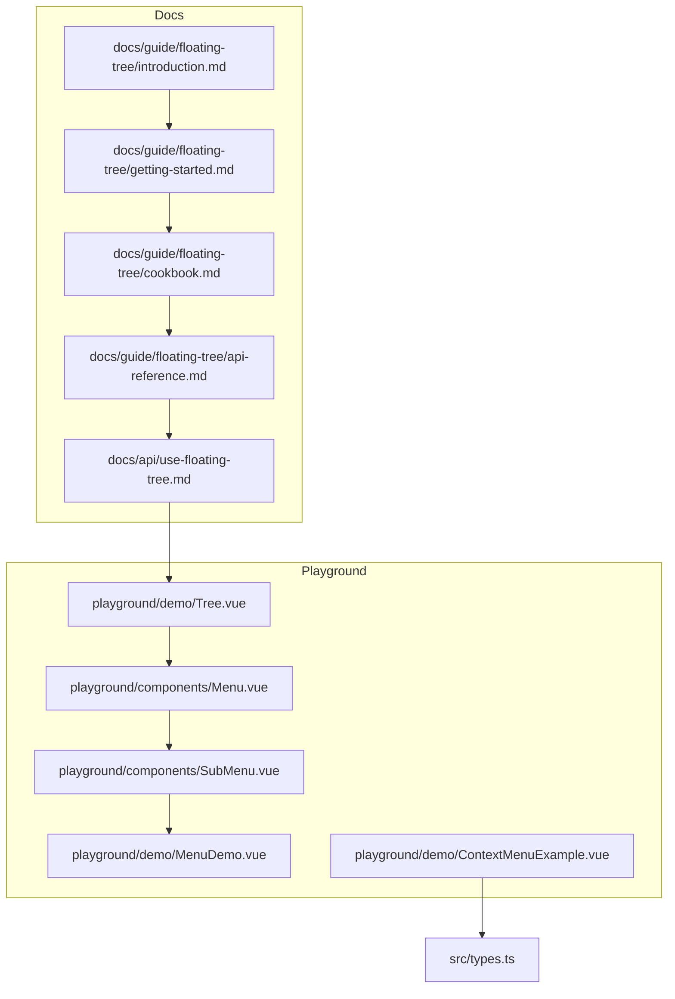
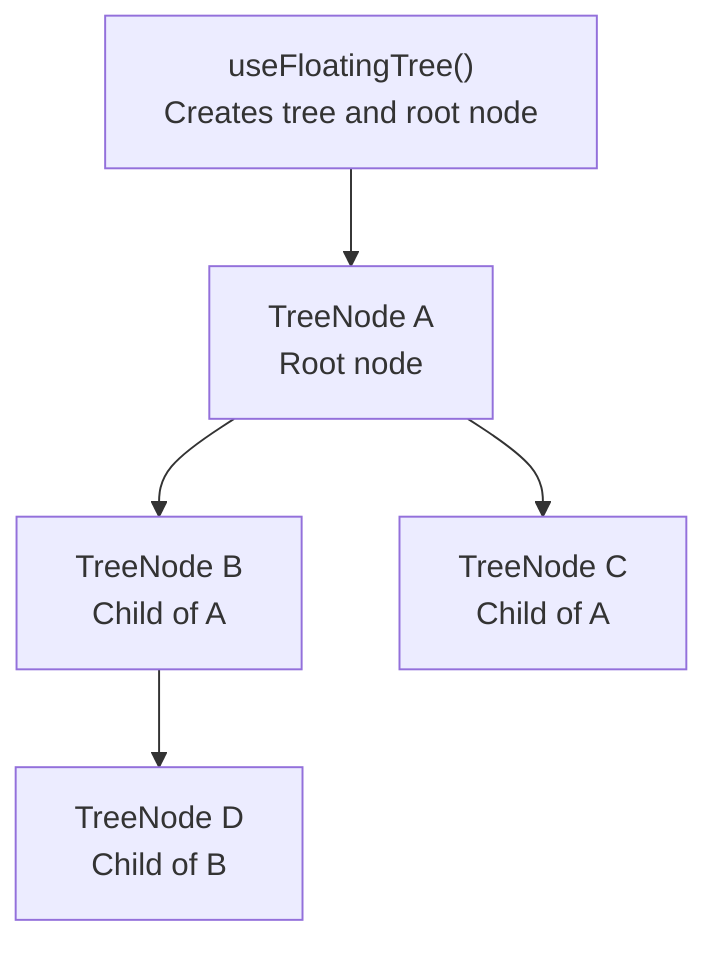
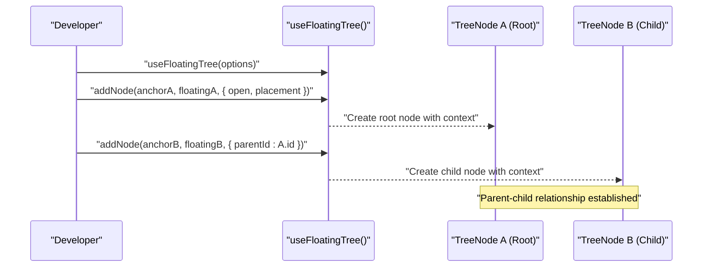
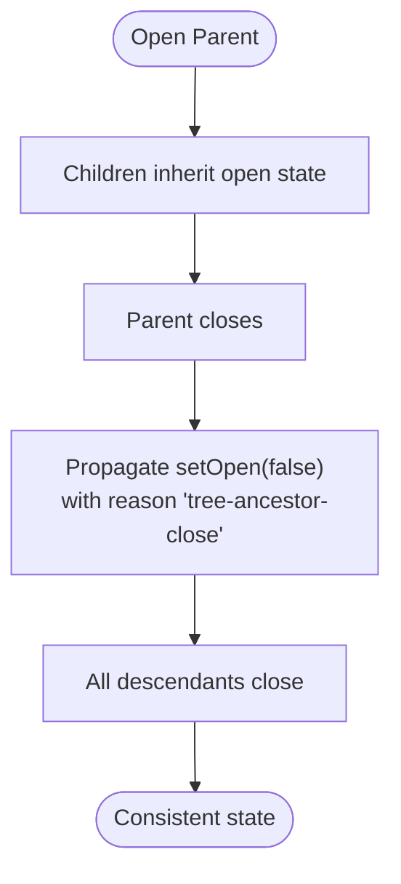
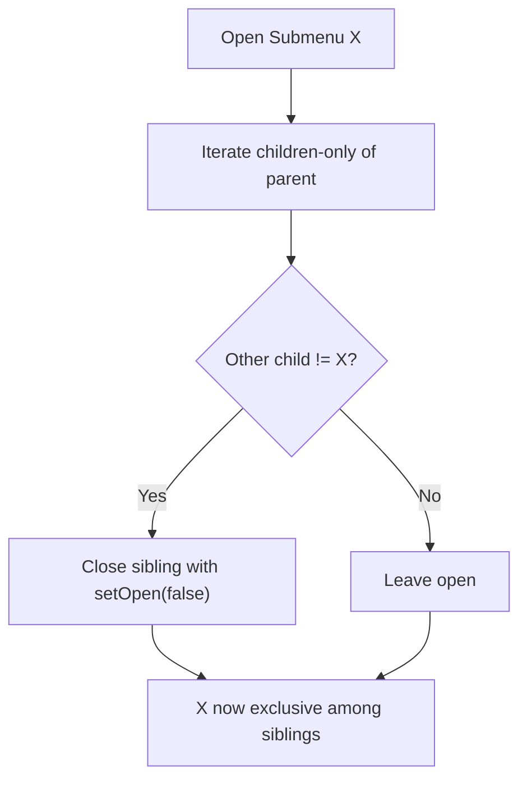
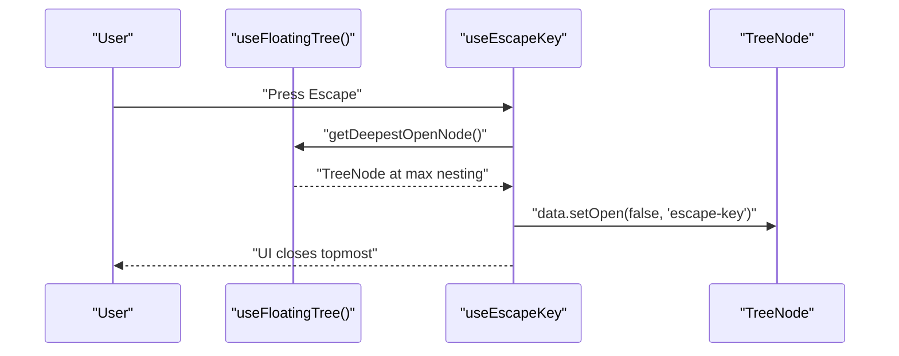
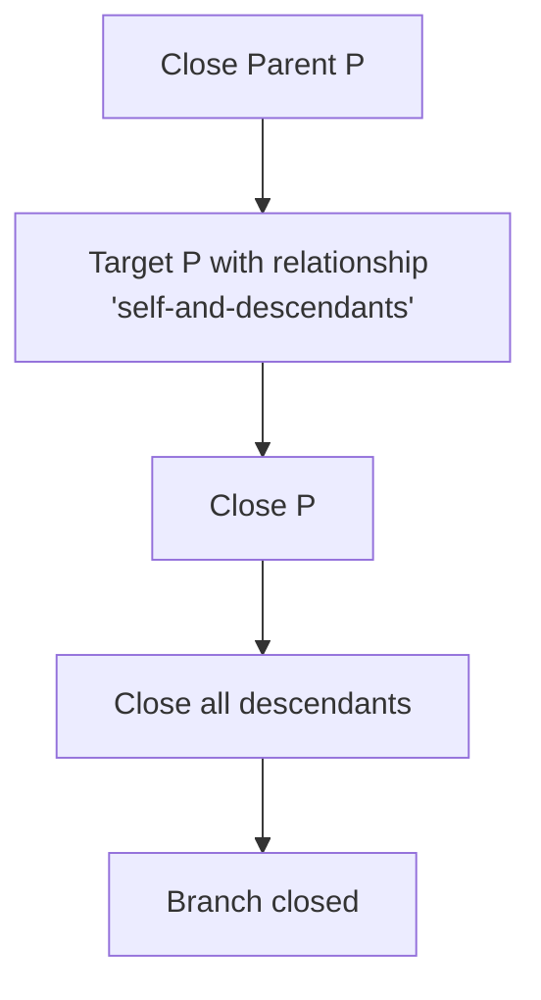
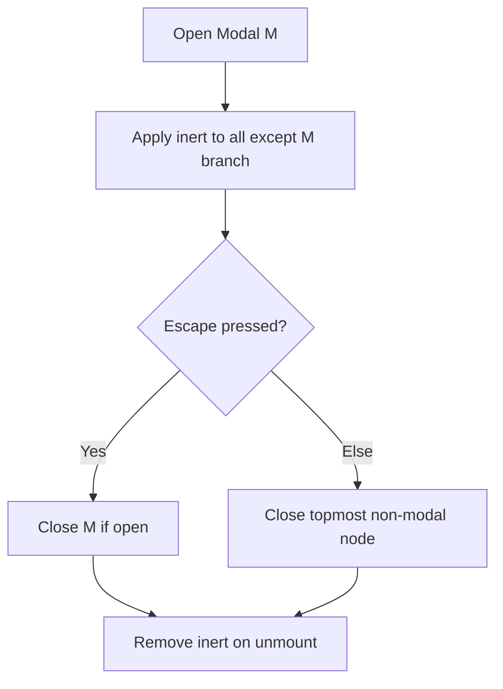
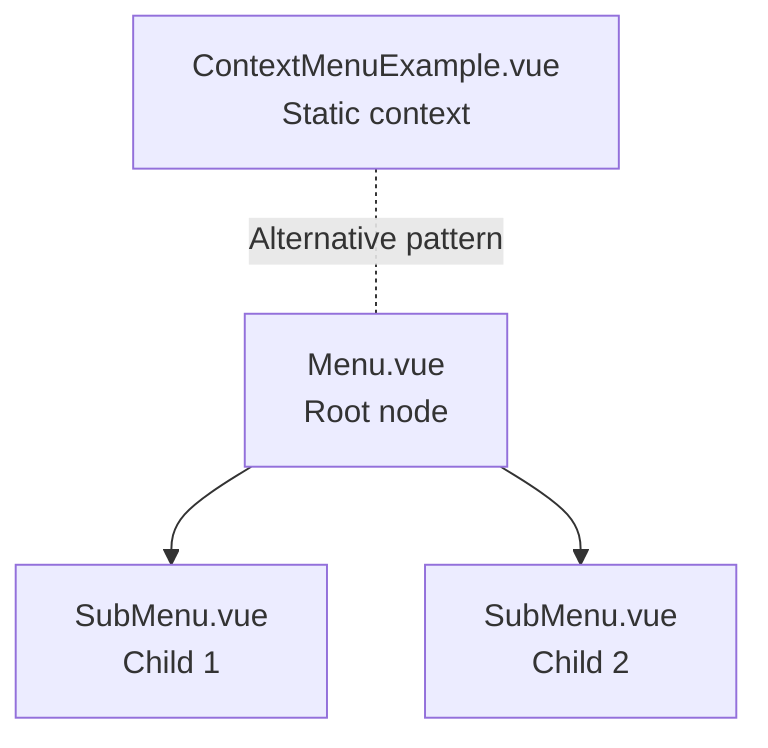
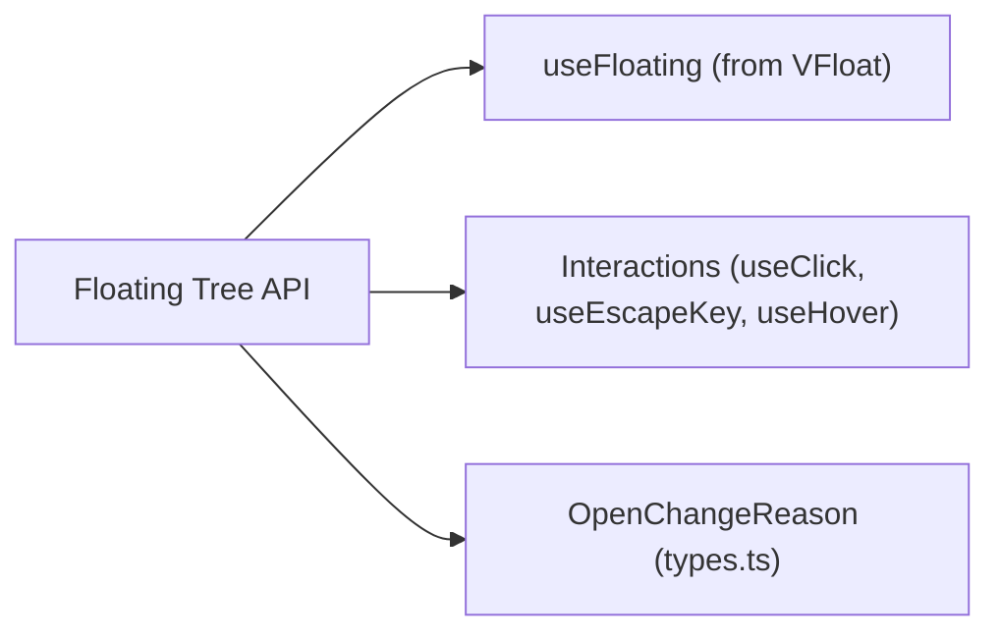

# Floating Tree System

<cite>
**Referenced Files in This Document**
- [use-floating-tree.md](file://docs/api/use-floating-tree.md)
- [introduction.md](file://docs/guide/floating-tree/introduction.md)
- [getting-started.md](file://docs/guide/floating-tree/getting-started.md)
- [cookbook.md](file://docs/guide/floating-tree/cookbook.md)
- [api-reference.md](file://docs/guide/floating-tree/api-reference.md)
- [use-floating-tree.md](file://docs/api/use-floating-tree.md)
- [Tree.vue](file://playground/demo/Tree.vue)
- [Menu.vue](file://playground/components/Menu.vue)
- [SubMenu.vue](file://playground/components/SubMenu.vue)
- [MenuDemo.vue](file://playground/demo/MenuDemo.vue)
- [ContextMenuExample.vue](file://playground/demo/ContextMenuExample.vue)
- [types.ts](file://src/types.ts)
</cite>

## Table of Contents
1. [Introduction](#introduction)
2. [Project Structure](#project-structure)
3. [Core Components](#core-components)
4. [Architecture Overview](#architecture-overview)
5. [Detailed Component Analysis](#detailed-component-analysis)
6. [Dependency Analysis](#dependency-analysis)
7. [Performance Considerations](#performance-considerations)
8. [Troubleshooting Guide](#troubleshooting-guide)
9. [Conclusion](#conclusion)
10. [Appendices](#appendices)

## Introduction
Floating Tree is VFloat’s hierarchical orchestration layer for complex floating UI structures. It replaces scattered state management with a single source of truth: a tree that tracks nodes, their parent-child relationships, and coordinated behaviors like mutually exclusive submenus, intelligent escape handling, and batch operations across branches. The system simplifies building nested menus, context menus, and layered modals while keeping interactions predictable and accessible.

## Project Structure
This documentation focuses on the Floating Tree API surface and practical usage patterns. The repository organizes documentation under docs/guide/floating-tree and docs/api, with runnable examples in playground/demo and playground/components.

**Diagram sources**
- [introduction.md:1-42](file://docs/guide/floating-tree/introduction.md#L1-L42)
- [getting-started.md:1-230](file://docs/guide/floating-tree/getting-started.md#L1-L230)
- [cookbook.md:1-394](file://docs/guide/floating-tree/cookbook.md#L1-L394)
- [api-reference.md:1-425](file://docs/guide/floating-tree/api-reference.md#L1-L425)
- [use-floating-tree.md:1-430](file://docs/api/use-floating-tree.md#L1-L430)
- [Tree.vue:1-31](file://playground/demo/Tree.vue#L1-L31)
- [Menu.vue:1-53](file://playground/components/Menu.vue#L1-L53)
- [SubMenu.vue:1-56](file://playground/components/SubMenu.vue#L1-L56)
- [MenuDemo.vue:1-321](file://playground/demo/MenuDemo.vue#L1-L321)
- [ContextMenuExample.vue:1-177](file://playground/demo/ContextMenuExample.vue#L1-L177)
- [types.ts:1-29](file://src/types.ts#L1-L29)

**Section sources**
- [introduction.md:1-42](file://docs/guide/floating-tree/introduction.md#L1-L42)
- [getting-started.md:1-230](file://docs/guide/floating-tree/getting-started.md#L1-L230)
- [cookbook.md:1-394](file://docs/guide/floating-tree/cookbook.md#L1-L394)
- [api-reference.md:1-425](file://docs/guide/floating-tree/api-reference.md#L1-L425)
- [use-floating-tree.md:1-430](file://docs/api/use-floating-tree.md#L1-L430)
- [Tree.vue:1-31](file://playground/demo/Tree.vue#L1-L31)
- [Menu.vue:1-53](file://playground/components/Menu.vue#L1-L53)
- [SubMenu.vue:1-56](file://playground/components/SubMenu.vue#L1-L56)
- [MenuDemo.vue:1-321](file://playground/demo/MenuDemo.vue#L1-L321)
- [ContextMenuExample.vue:1-177](file://playground/demo/ContextMenuExample.vue#L1-L177)
- [types.ts:1-29](file://src/types.ts#L1-L29)

## Core Components
- useFloatingTree(): Central orchestrator that creates a tree and registers nodes. It supports a streamlined API where nodes create their own floating contexts internally.
- TreeNode: A reactive wrapper around a node with data, parent, and children. Each node exposes a floating context and lifecycle hooks.
- Tree operations: addNode, removeNode, moveNode, findNodeById, traverse, getAllOpenNodes, getDeepestOpenNode, applyToNodes, dispose.
- Relationship targeting: applyToNodes supports flexible node sets (ancestors-only, siblings-only, descendants-only, self-and-children, etc.) for bulk operations.

Practical highlights:
- Parent-child linkage via parentId in addNode options.
- Automatic propagation of “tree ancestor close” reason when a parent closes.
- Built-in helpers for mutually exclusive submenus and intelligent escape dismissal.

**Section sources**
- [use-floating-tree.md:1-430](file://docs/api/use-floating-tree.md#L1-L430)
- [api-reference.md:107-148](file://docs/guide/floating-tree/api-reference.md#L107-L148)
- [cookbook.md:5-74](file://docs/guide/floating-tree/cookbook.md#L5-L74)
- [getting-started.md:106-120](file://docs/guide/floating-tree/getting-started.md#L106-L120)

## Architecture Overview
Floating Tree coordinates multiple floating elements as a hierarchy. Each node encapsulates its own floating context and participates in global behaviors like escape handling and click-outside dismissal. The tree exposes methods to query and mutate the hierarchy, ensuring consistent UX across complex nested UI.

**Diagram sources**
- [Tree.vue:1-31](file://playground/demo/Tree.vue#L1-L31)
- [Menu.vue:16-26](file://playground/components/Menu.vue#L16-L26)
- [SubMenu.vue:19-41](file://playground/components/SubMenu.vue#L19-L41)

## Detailed Component Analysis

### useFloatingTree() and Node Registration
- Purpose: Create a tree and register nodes without manual useFloating calls per node.
- Registration: addNode(anchorRef, floatingRef, options) creates a node with an internal floating context. parentId links to a parent node; missing parentId implies root-level.
- Lifecycle: Nodes carry open state, refs, and methods. Closing a parent propagates a specific reason to descendants.

**Diagram sources**
- [getting-started.md:13-80](file://docs/guide/floating-tree/getting-started.md#L13-L80)
- [Tree.vue:9-25](file://playground/demo/Tree.vue#L9-L25)

**Section sources**
- [use-floating-tree.md:1-32](file://docs/api/use-floating-tree.md#L1-L32)
- [Tree.vue:9-25](file://playground/demo/Tree.vue#L9-L25)
- [Menu.vue:16-26](file://playground/components/Menu.vue#L16-L26)
- [SubMenu.vue:28-41](file://playground/components/SubMenu.vue#L28-L41)

### Tree Context Management and Event Propagation
- Context exposure: Each node’s data provides floatingStyles, refs, and setOpen. The tree also exposes root context for the root node.
- Event propagation: Closing a parent triggers setOpen(false) on descendants with a dedicated reason. The tree provides helpers to target the topmost open node for escape key handling.

**Diagram sources**
- [use-floating-tree.md:102-103](file://docs/api/use-floating-tree.md#L102-L103)
- [cookbook.md:112-140](file://docs/guide/floating-tree/cookbook.md#L112-L140)

**Section sources**
- [use-floating-tree.md:35-82](file://docs/api/use-floating-tree.md#L35-L82)
- [cookbook.md:76-140](file://docs/guide/floating-tree/cookbook.md#L76-L140)

### Mutually Exclusive Submenus
- Problem: Opening one submenu should close its siblings.
- Solution: Use applyToNodes with relationship "children-only" on the parent to iterate siblings and close them, then open the selected submenu.

**Diagram sources**
- [cookbook.md:5-74](file://docs/guide/floating-tree/cookbook.md#L5-L74)

**Section sources**
- [cookbook.md:5-74](file://docs/guide/floating-tree/cookbook.md#L5-L74)

### Intelligent Escape Key Dismissal
- Problem: Only the topmost (deepest) open node should close on Escape.
- Solution: Use getDeepestOpenNode() to identify the highest-level open node and close it. The tree also exposes getAllOpenNodes() for diagnostics.

**Diagram sources**
- [cookbook.md:76-140](file://docs/guide/floating-tree/cookbook.md#L76-L140)

**Section sources**
- [cookbook.md:76-140](file://docs/guide/floating-tree/cookbook.md#L76-L140)

### Closing an Entire UI Branch
- Problem: Closing a parent should close all descendants.
- Solution: Use applyToNodes with relationship "self-and-descendants" to close the target node and all its children recursively.

**Diagram sources**
- [cookbook.md:142-247](file://docs/guide/floating-tree/cookbook.md#L142-L247)

**Section sources**
- [cookbook.md:142-247](file://docs/guide/floating-tree/cookbook.md#L142-L247)

### Building Modal-like Behavior (Focus Trapping & Inert)
- Problem: When a modal is open, background elements should be inert to keyboard/screen reader.
- Solution: Use applyToNodes with relationship "all-except-branch" to toggle inert on background elements. Combine with escape key prioritization for modal vs. other floating elements.

**Diagram sources**
- [cookbook.md:249-394](file://docs/guide/floating-tree/cookbook.md#L249-L394)

**Section sources**
- [cookbook.md:249-394](file://docs/guide/floating-tree/cookbook.md#L249-L394)

### Practical Implementation Patterns
- Nested Menus: Use Menu.vue to create a root node and SubMenu.vue to add child nodes with parentId. Provide the tree via dependency injection to children.
- Context Menus: Use standalone floating contexts for static-positioned menus (see ContextMenuExample.vue) alongside tree-managed nodes when needed.
- Complex Hierarchies: Compose multiple trees or mix tree-managed nodes with direct useFloating contexts for specialized needs.

**Diagram sources**
- [Menu.vue:16-47](file://playground/components/Menu.vue#L16-L47)
- [SubMenu.vue:19-51](file://playground/components/SubMenu.vue#L19-L51)
- [MenuDemo.vue:22-199](file://playground/demo/MenuDemo.vue#L22-L199)
- [ContextMenuExample.vue:46-68](file://playground/demo/ContextMenuExample.vue#L46-L68)

**Section sources**
- [Menu.vue:1-53](file://playground/components/Menu.vue#L1-L53)
- [SubMenu.vue:1-56](file://playground/components/SubMenu.vue#L1-L56)
- [MenuDemo.vue:1-321](file://playground/demo/MenuDemo.vue#L1-L321)
- [ContextMenuExample.vue:1-177](file://playground/demo/ContextMenuExample.vue#L1-L177)

## Dependency Analysis
Floating Tree integrates with VFloat’s positioning and interaction composables. The tree itself does not depend on external libraries; it coordinates floating contexts created by useFloating and managed by interaction composables.

**Diagram sources**
- [types.ts:19-29](file://src/types.ts#L19-L29)
- [Menu.vue:2-4](file://playground/components/Menu.vue#L2-L4)
- [SubMenu.vue:2-6](file://playground/components/SubMenu.vue#L2-L6)

**Section sources**
- [types.ts:19-29](file://src/types.ts#L19-L29)
- [Menu.vue:2-4](file://playground/components/Menu.vue#L2-L4)
- [SubMenu.vue:2-6](file://playground/components/SubMenu.vue#L2-L6)

## Performance Considerations
- Prefer DFS/BFS traversals only when necessary; cache results if repeatedly accessed.
- Use targeted applyToNodes with precise relationships to minimize DOM writes.
- Dispose trees on component unmount to prevent memory leaks.
- Avoid excessive reactivity churn by batching updates (e.g., close siblings before opening a new one).
- For large trees, consider lazy node creation and removal to keep nodeMap small.

[No sources needed since this section provides general guidance]

## Troubleshooting Guide
Common pitfalls and remedies:
- Forgetting to dispose the tree: Always call dispose() on unmount to clear internal state.
- Incorrect parentId: If parentId does not exist, addNode returns null; verify parent IDs and initialization order.
- Conflicting interactions: Ensure useEscapeKey targets the tree’s topmost node to avoid closing unrelated elements.
- Inert cleanup: When using inert for modal behavior, remove inert attributes on unmount to avoid accessibility regressions.

**Section sources**
- [getting-started.md:106-120](file://docs/guide/floating-tree/getting-started.md#L106-L120)
- [cookbook.md:318-341](file://docs/guide/floating-tree/cookbook.md#L318-L341)
- [use-floating-tree.md:367-391](file://docs/api/use-floating-tree.md#L367-L391)

## Conclusion
Floating Tree centralizes the complexity of nested floating UIs. With intuitive node registration, robust parent-child coordination, and powerful bulk operations, it enables consistent, accessible, and maintainable UI hierarchies. Combine it with VFloat’s positioning and interaction composables to build sophisticated menus, context menus, and layered modals with minimal boilerplate.

[No sources needed since this section summarizes without analyzing specific files]

## Appendices

### API Quick Reference
- useFloatingTree(): Create a tree and optionally pass tree options.
- addNode(anchorRef, floatingRef, options?): Register a node; specify parentId to establish parent-child relationships.
- removeNode(nodeId, deleteStrategy?): Remove a node with orphan or recursive strategy.
- moveNode(nodeId, newParentId): Re-parent a node without losing children.
- findNodeById(nodeId): Locate a node by ID.
- traverse(strategy, startNode?): DFS or BFS traversal.
- getAllOpenNodes(): Retrieve all open nodes.
- getDeepestOpenNode(): Retrieve the deepest open node.
- applyToNodes(nodeId, callback, options?): Bulk operate on related nodes with flexible relationships.
- dispose(): Clean up the tree instance.

**Section sources**
- [api-reference.md:107-425](file://docs/guide/floating-tree/api-reference.md#L107-L425)
- [use-floating-tree.md:84-430](file://docs/api/use-floating-tree.md#L84-L430)