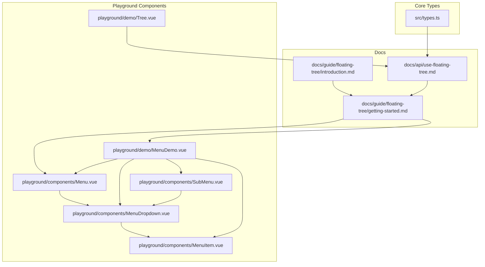
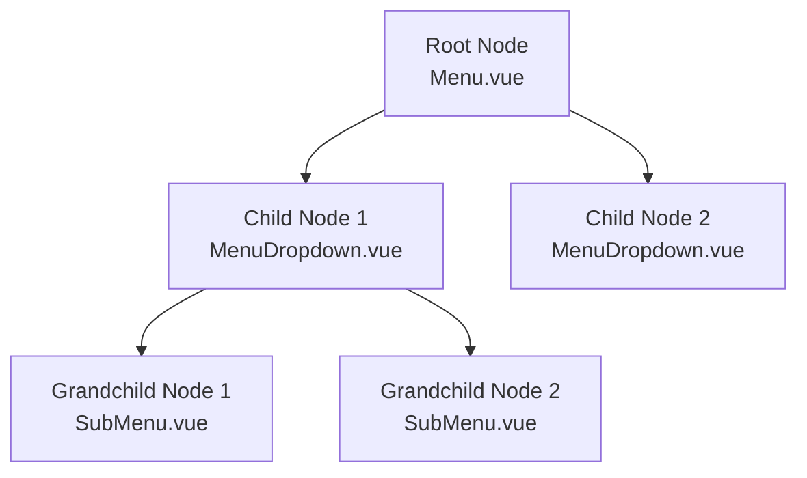
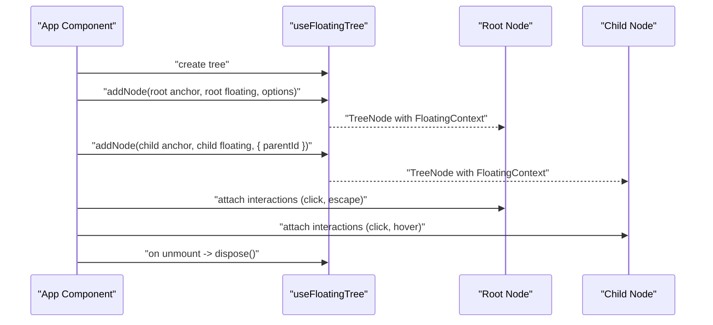
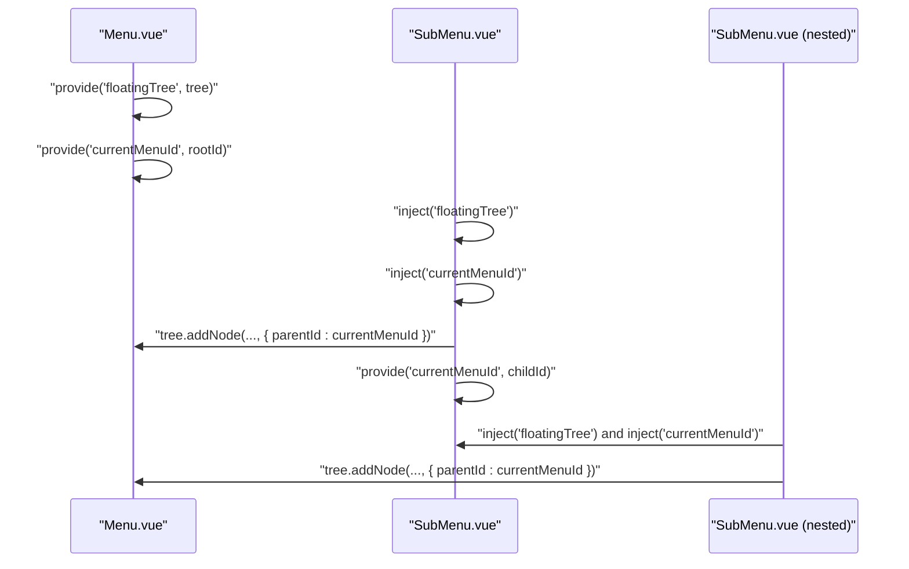
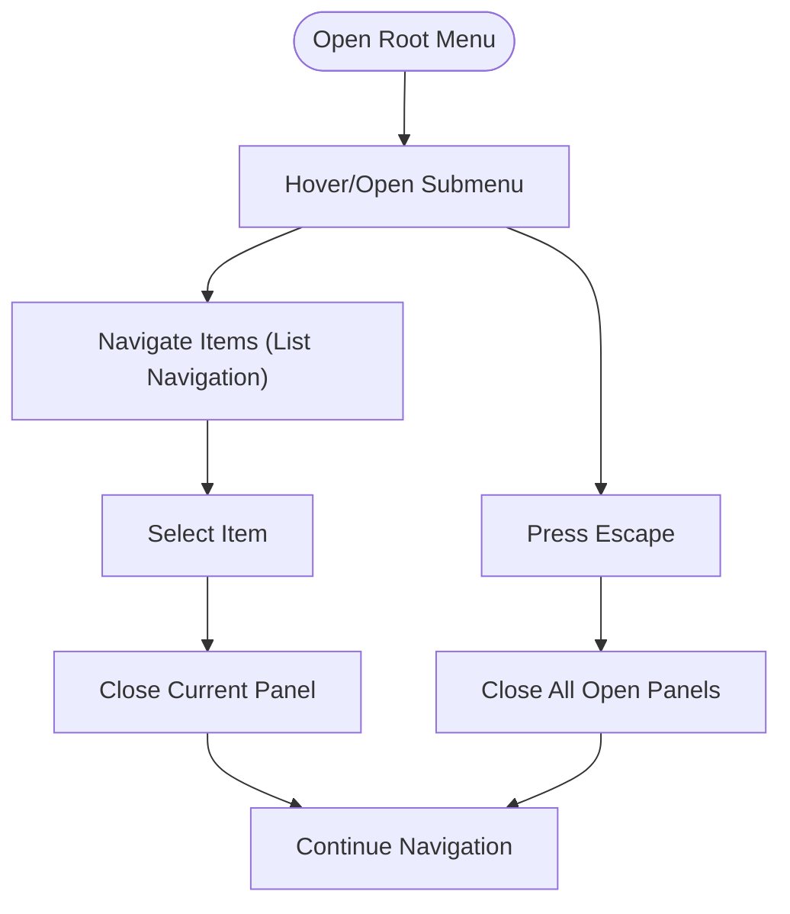
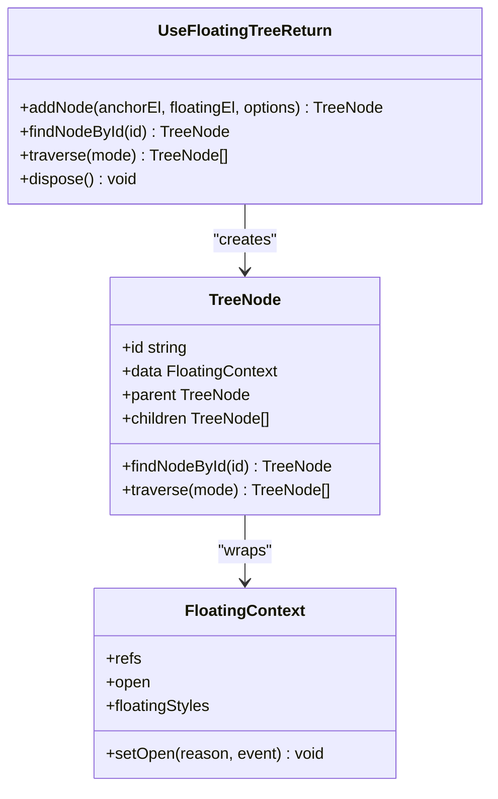
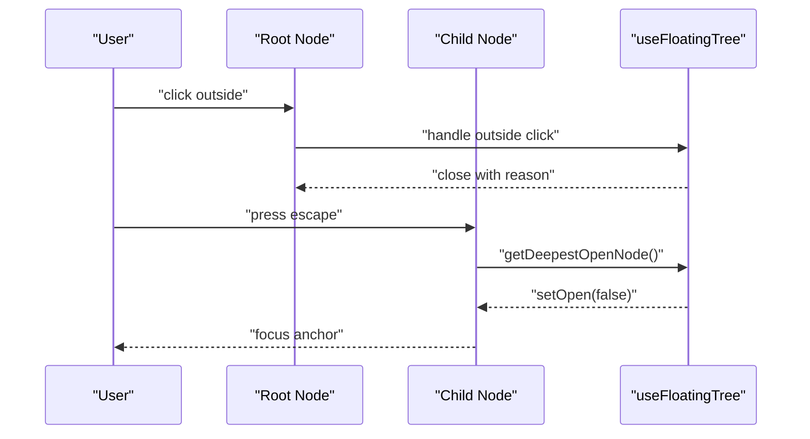
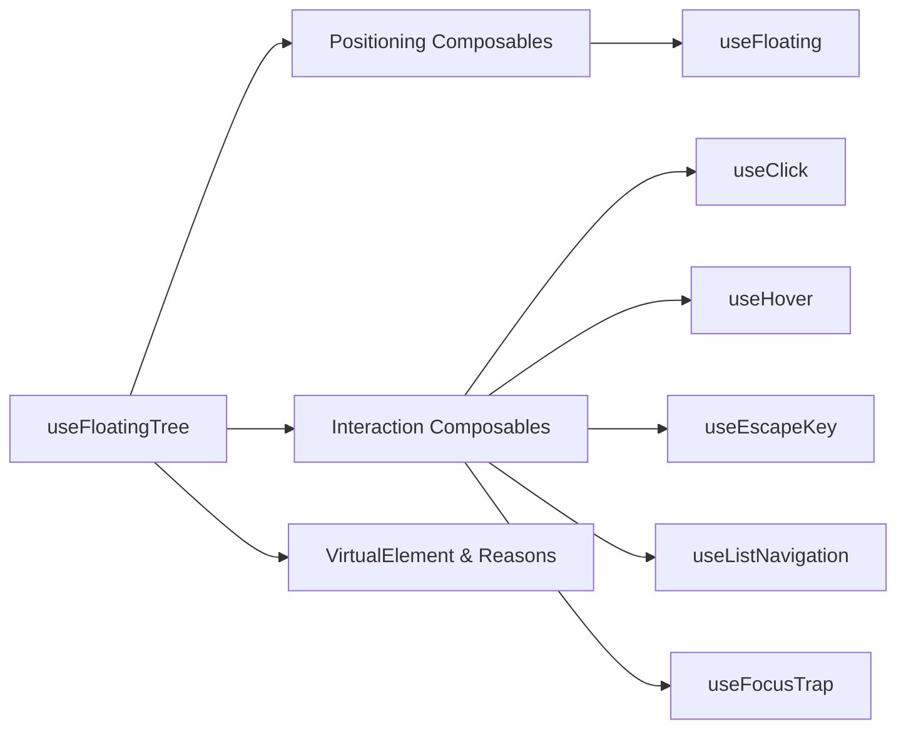

# Getting Started Guide

<cite>
**Referenced Files in This Document**
- [getting-started.md](file://docs/guide/floating-tree/getting-started.md)
- [introduction.md](file://docs/guide/floating-tree/introduction.md)
- [use-floating-tree.md](file://docs/api/use-floating-tree.md)
- [Menu.vue](file://playground/components/Menu.vue)
- [MenuDropdown.vue](file://playground/components/MenuDropdown.vue)
- [SubMenu.vue](file://playground/components/SubMenu.vue)
- [MenuItem.vue](file://playground/components/MenuItem.vue)
- [MenuDemo.vue](file://playground/demo/MenuDemo.vue)
- [Tree.vue](file://playground/demo/Tree.vue)
- [types.ts](file://src/types.ts)
</cite>

## Table of Contents
1. [Introduction](#introduction)
2. [Project Structure](#project-structure)
3. [Core Components](#core-components)
4. [Architecture Overview](#architecture-overview)
5. [Detailed Component Analysis](#detailed-component-analysis)
6. [Dependency Analysis](#dependency-analysis)
7. [Performance Considerations](#performance-considerations)
8. [Troubleshooting Guide](#troubleshooting-guide)
9. [Conclusion](#conclusion)
10. [Appendices](#appendices)

## Introduction
This guide helps you build your first floating tree with a parent-child menu structure using the streamlined API. You will learn how to initialize a tree, register nodes, establish parent-child relationships, integrate interactions, and clean up resources. Practical examples show how to create nested menus and basic floating tree structures, along with the tree context provider pattern and integration with existing VFloat composables.

## Project Structure
The floating tree system lives in the composables layer and is demonstrated across reusable components and a full menu example. The getting started guide and API reference documents provide step-by-step instructions and technical details.

**Diagram sources**
- [getting-started.md:1-230](file://docs/guide/floating-tree/getting-started.md#L1-L230)
- [introduction.md:1-42](file://docs/guide/floating-tree/introduction.md#L1-L42)
- [use-floating-tree.md:1-133](file://docs/api/use-floating-tree.md#L1-L133)
- [Menu.vue:1-53](file://playground/components/Menu.vue#L1-L53)
- [MenuDropdown.vue:1-92](file://playground/components/MenuDropdown.vue#L1-L92)
- [SubMenu.vue:1-56](file://playground/components/SubMenu.vue#L1-L56)
- [MenuItem.vue:1-42](file://playground/components/MenuItem.vue#L1-L42)
- [MenuDemo.vue:1-321](file://playground/demo/MenuDemo.vue#L1-L321)
- [Tree.vue:1-31](file://playground/demo/Tree.vue#L1-L31)
- [types.ts:1-29](file://src/types.ts#L1-L29)

**Section sources**
- [getting-started.md:1-230](file://docs/guide/floating-tree/getting-started.md#L1-L230)
- [introduction.md:1-42](file://docs/guide/floating-tree/introduction.md#L1-L42)
- [use-floating-tree.md:1-133](file://docs/api/use-floating-tree.md#L1-L133)

## Core Components
- Floating tree manager: Creates and orchestrates a hierarchical collection of floating elements.
- Node registration: Adds nodes to the tree with automatic floating context creation.
- Parent-child relationships: Establishes hierarchy using a parent node identifier.
- Interactions: Integrates with VFloat interaction composables for clicks, hover, escape key, focus navigation, and focus trap.
- Cleanup: Disposes of the tree on component unmount.

Key capabilities:
- Initialize a tree and add root and child nodes.
- Access floating styles and state from each node’s data.
- Close descendant nodes when a parent closes.
- Traverse nodes for debugging or advanced logic.

**Section sources**
- [use-floating-tree.md:1-133](file://docs/api/use-floating-tree.md#L1-L133)
- [getting-started.md:9-120](file://docs/guide/floating-tree/getting-started.md#L9-L120)

## Architecture Overview
The floating tree follows a hierarchical pattern where each floating element is a node. The tree manages state, coordinates interactions, and ensures consistent behavior across nested elements.

**Diagram sources**
- [Menu.vue:16-26](file://playground/components/Menu.vue#L16-L26)
- [MenuDropdown.vue:17-26](file://playground/components/MenuDropdown.vue#L17-L26)
- [SubMenu.vue:28-34](file://playground/components/SubMenu.vue#L28-L34)
- [MenuDemo.vue:85-139](file://playground/demo/MenuDemo.vue#L85-L139)

## Detailed Component Analysis

### Step-by-Step Setup with useFloatingTree
Follow these steps to implement a basic parent-child menu using the floating tree:

1) Create the root tree and node
- Initialize the tree and add a root node with anchor and floating element refs.
- Configure placement, open state, and middlewares.
- Access floating styles from the node’s data.

2) Add child nodes
- Register a submenu node with a parent identifier.
- Reuse the same pattern for deeper nesting.

3) Add interactions
- Attach click and escape key handlers.
- Optionally add hover and focus navigation.

4) Cleanup
- Dispose of the tree on component unmount.

**Diagram sources**
- [getting-started.md:13-120](file://docs/guide/floating-tree/getting-started.md#L13-L120)
- [use-floating-tree.md:84-126](file://docs/api/use-floating-tree.md#L84-L126)

**Section sources**
- [getting-started.md:9-120](file://docs/guide/floating-tree/getting-started.md#L9-L120)
- [use-floating-tree.md:84-126](file://docs/api/use-floating-tree.md#L84-L126)

### Tree Context Provider Pattern
The tree context provider pattern avoids passing the tree down manually through props. Instead, provide the tree and current menu ID via Vue’s provide/inject mechanism.

- Root component provides the tree and root menu ID.
- Descendants inject the tree and current menu ID to register child nodes.
- Submenus re-provide their own node ID to enable further nesting.

**Diagram sources**
- [Menu.vue:24-26](file://playground/components/Menu.vue#L24-L26)
- [SubMenu.vue:19-26](file://playground/components/SubMenu.vue#L19-L26)
- [MenuDropdown.vue:10-15](file://playground/components/MenuDropdown.vue#L10-L15)

**Section sources**
- [Menu.vue:24-26](file://playground/components/Menu.vue#L24-L26)
- [SubMenu.vue:19-26](file://playground/components/SubMenu.vue#L19-L26)
- [MenuDropdown.vue:10-15](file://playground/components/MenuDropdown.vue#L10-L15)

### Practical Examples: Nested Menus and Basic Structures
- Full working example: A parent menu with two submenu branches, each containing multiple items.
- Playground demo: A complete account settings menu showcasing triggers, dropdowns, and nested submenus.

**Diagram sources**
- [MenuDemo.vue:1-321](file://playground/demo/MenuDemo.vue#L1-L321)
- [Menu.vue:28-41](file://playground/components/Menu.vue#L28-L41)
- [MenuDropdown.vue:50-72](file://playground/components/MenuDropdown.vue#L50-L72)
- [SubMenu.vue:43-48](file://playground/components/SubMenu.vue#L43-L48)

**Section sources**
- [MenuDemo.vue:1-321](file://playground/demo/MenuDemo.vue#L1-L321)
- [Menu.vue:28-41](file://playground/components/Menu.vue#L28-L41)
- [MenuDropdown.vue:50-72](file://playground/components/MenuDropdown.vue#L50-L72)
- [SubMenu.vue:43-48](file://playground/components/SubMenu.vue#L43-L48)

### Essential Configuration Options and Node Properties
- Tree options: deletion strategy for subtree cleanup.
- Node options: anchor and floating element refs, placement, open state, middlewares, and parent identifier.
- Node data: floating styles, refs, open state, and setters for programmatic control.
- Traversal and lookup: find nodes by ID, traverse in DFS/BFS order.

**Diagram sources**
- [use-floating-tree.md:84-126](file://docs/api/use-floating-tree.md#L84-L126)
- [Menu.vue:16-22](file://playground/components/Menu.vue#L16-L22)
- [MenuDropdown.vue:17-18](file://playground/components/MenuDropdown.vue#L17-L18)

**Section sources**
- [use-floating-tree.md:84-126](file://docs/api/use-floating-tree.md#L84-L126)
- [Menu.vue:16-22](file://playground/components/Menu.vue#L16-L22)
- [MenuDropdown.vue:17-18](file://playground/components/MenuDropdown.vue#L17-L18)

### Basic Event Handling
- Outside click: Close panels when clicking outside.
- Escape key: Close the deepest open panel and return focus to the trigger.
- Hover: Delayed open/close with safe polygon support for complex menus.
- Focus navigation: Keyboard-driven list navigation with looping and disabled item handling.
- Focus trap: Manage focus within top-level vs nested panels.

**Diagram sources**
- [Menu.vue:28-41](file://playground/components/Menu.vue#L28-L41)
- [SubMenu.vue:43-48](file://playground/components/SubMenu.vue#L43-L48)
- [MenuDropdown.vue:50-72](file://playground/components/MenuDropdown.vue#L50-L72)
- [getting-started.md:96-101](file://docs/guide/floating-tree/getting-started.md#L96-L101)

**Section sources**
- [Menu.vue:28-41](file://playground/components/Menu.vue#L28-L41)
- [SubMenu.vue:43-48](file://playground/components/SubMenu.vue#L43-L48)
- [MenuDropdown.vue:50-72](file://playground/components/MenuDropdown.vue#L50-L72)
- [getting-started.md:96-101](file://docs/guide/floating-tree/getting-started.md#L96-L101)

## Dependency Analysis
The floating tree integrates with VFloat’s positioning and interaction composables. It relies on a minimal virtual element interface and a standardized set of open-change reasons.

**Diagram sources**
- [use-floating-tree.md:1-133](file://docs/api/use-floating-tree.md#L1-L133)
- [types.ts:8-29](file://src/types.ts#L8-L29)

**Section sources**
- [use-floating-tree.md:1-133](file://docs/api/use-floating-tree.md#L1-L133)
- [types.ts:8-29](file://src/types.ts#L8-L29)

## Performance Considerations
- Prefer the new streamlined API: Create nodes directly with element refs and options; avoid manual floating context creation.
- Use appropriate middlewares (offset, flip, shift) to minimize reflows and improve placement stability.
- Limit unnecessary re-renders by using shallow refs for element refs and reactive open states.
- Dispose of the tree on unmount to free memory and cancel observers.

## Troubleshooting Guide
Common setup issues and resolutions:
- Missing tree provider: Ensure the root component provides the tree and current menu ID; child components must inject them.
  - Verify provide/inject keys match across components.
  - Confirm the root node ID is provided and used as parentId for children.
- Parent node not found: When adding a child node, ensure the parent ID exists; otherwise, node creation returns null.
- Escape key not closing the right panel: Use the tree helper to target the deepest open node and close it programmatically.
- Focus not returning to trigger: After closing, focus the anchor element or context element from the node’s refs.
- Outside click not working: Enable outside click handling for each node’s interaction composable.
- Cleanup not called: Always dispose the tree on component unmount to prevent leaks.

**Section sources**
- [Menu.vue:24-26](file://playground/components/Menu.vue#L24-L26)
- [SubMenu.vue:19-26](file://playground/components/SubMenu.vue#L19-L26)
- [MenuDropdown.vue:10-15](file://playground/components/MenuDropdown.vue#L10-L15)
- [getting-started.md:106-120](file://docs/guide/floating-tree/getting-started.md#L106-L120)

## Conclusion
With the floating tree, you can build complex nested UIs with consistent state management, predictable interactions, and clean separation of concerns. Start with a root node, add child nodes with parent IDs, wire up interactions, and clean up on unmount. Explore the cookbook for advanced patterns and real-world solutions.

## Appendices

### Quick Reference: API Highlights
- Create a tree and add nodes with automatic floating context creation.
- Access floating styles and state from each node’s data.
- Use parentId to establish parent-child relationships.
- Integrate with VFloat interactions for clicks, hover, escape key, focus navigation, and focus trap.
- Dispose the tree on component unmount.

**Section sources**
- [use-floating-tree.md:1-133](file://docs/api/use-floating-tree.md#L1-L133)
- [getting-started.md:9-120](file://docs/guide/floating-tree/getting-started.md#L9-L120)