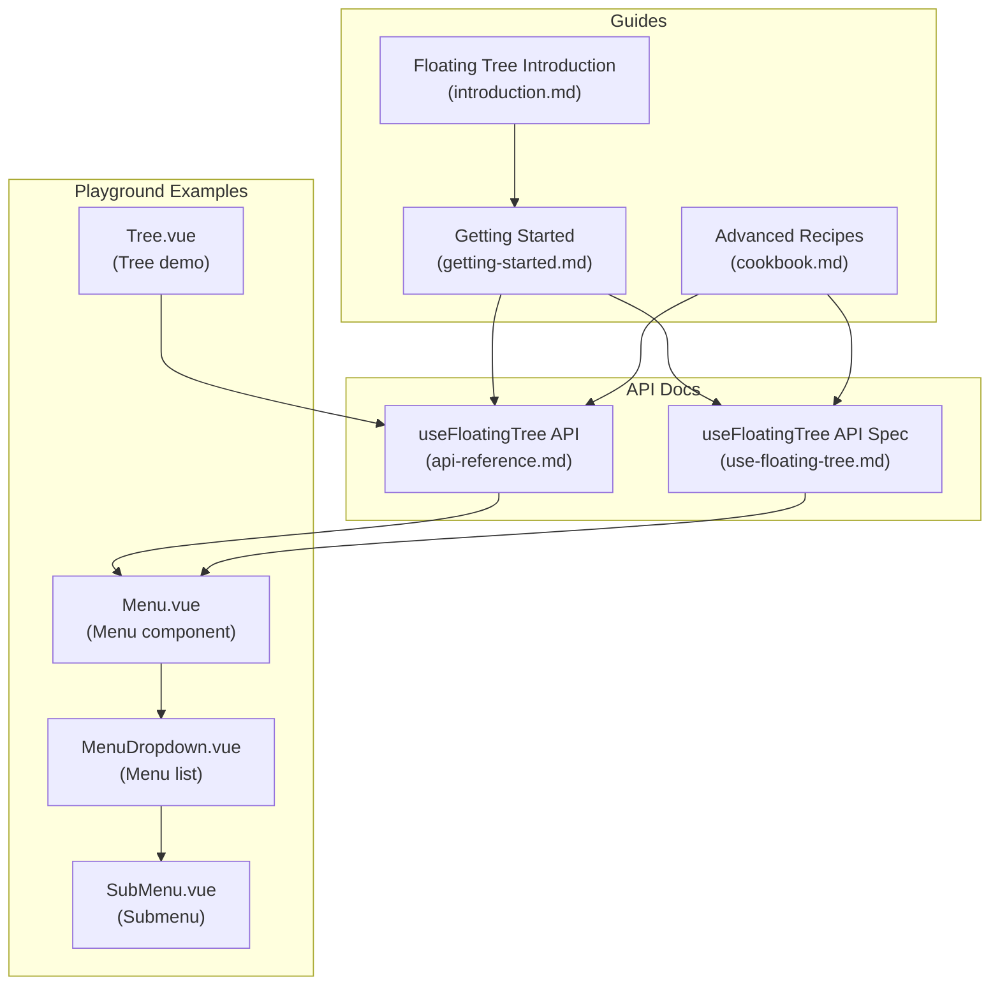
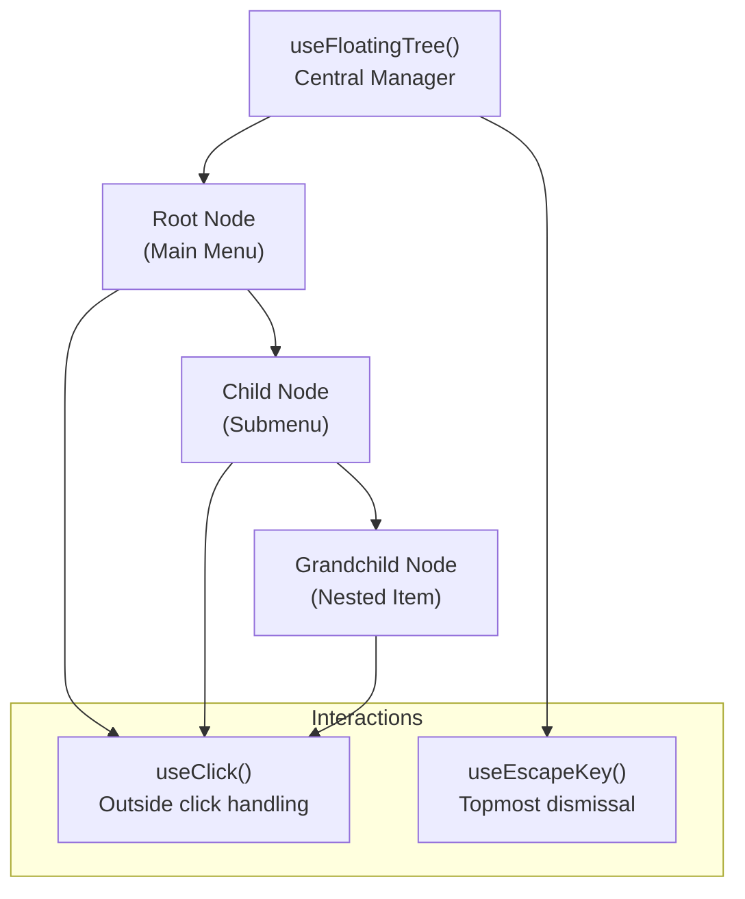
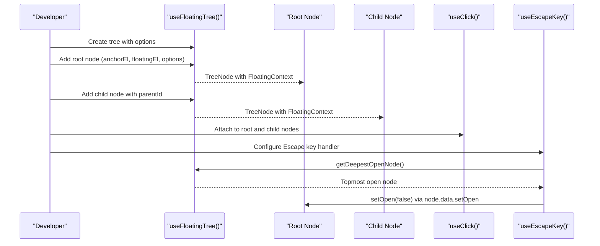
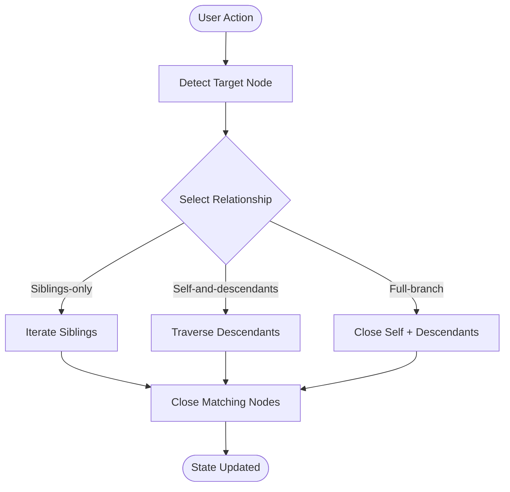
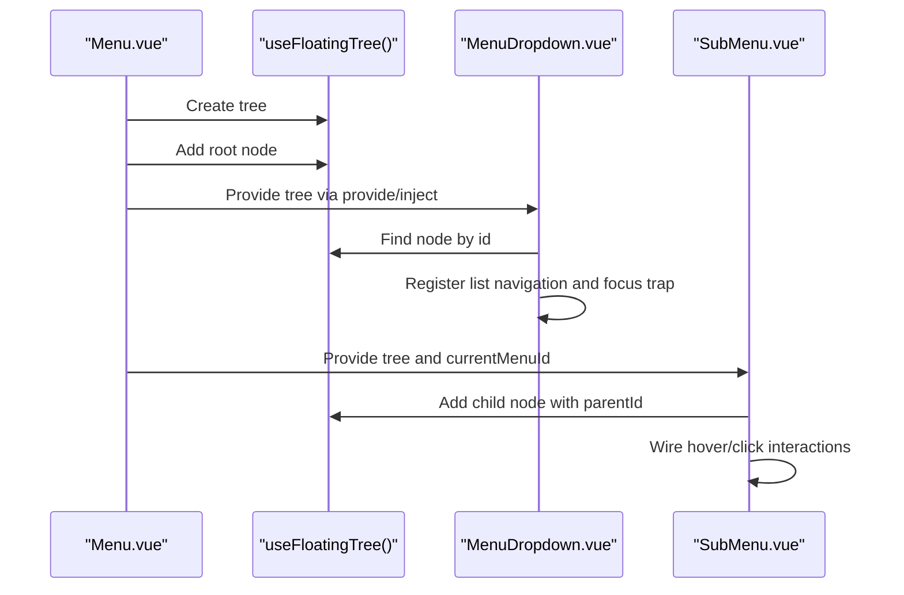
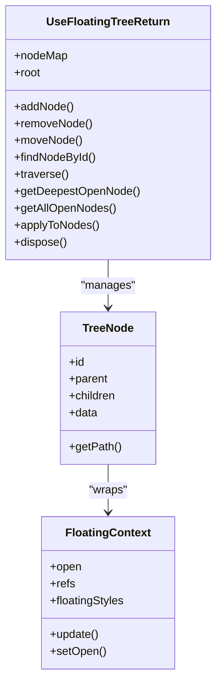
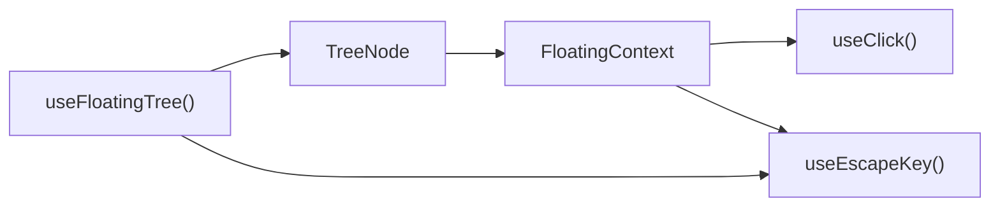

# Introduction and Core Concepts

<cite>
**Referenced Files in This Document**
- [docs/guide/floating-tree/introduction.md](file://docs/guide/floating-tree/introduction.md)
- [docs/guide/floating-tree/getting-started.md](file://docs/guide/floating-tree/getting-started.md)
- [docs/guide/floating-tree/cookbook.md](file://docs/guide/floating-tree/cookbook.md)
- [docs/api/use-floating-tree.md](file://docs/api/use-floating-tree.md)
- [docs/guide/floating-tree/api-reference.md](file://docs/guide/floating-tree/api-reference.md)
- [playground/components/Menu.vue](file://playground/components/Menu.vue)
- [playground/components/MenuDropdown.vue](file://playground/components/MenuDropdown.vue)
- [playground/components/SubMenu.vue](file://playground/components/SubMenu.vue)
- [playground/demo/Tree.vue](file://playground/demo/Tree.vue)
- [src/composables/interactions/use-click.ts](file://src/composables/interactions/use-click.ts)
- [src/composables/interactions/use-escape-key.ts](file://src/composables/interactions/use-escape-key.ts)
</cite>

## Table of Contents
1. [Introduction](#introduction)
2. [Project Structure](#project-structure)
3. [Core Components](#core-components)
4. [Architecture Overview](#architecture-overview)
5. [Detailed Component Analysis](#detailed-component-analysis)
6. [Dependency Analysis](#dependency-analysis)
7. [Performance Considerations](#performance-considerations)
8. [Troubleshooting Guide](#troubleshooting-guide)
9. [Conclusion](#conclusion)

## Introduction
Floating trees solve a fundamental challenge in complex floating UI: state management chaos. Without a centralized, hierarchical approach, nested menus, popovers that open dialogs, and tooltips that spawn new floating elements create brittle state machines with tangled open/close logic, unreliable “click outside” behavior, and inconsistent focus/Escape key handling. The floating tree introduces three core concepts—Tree (central manager), Node (individual floating element), and Hierarchy (parent-child relationships)—to organize UI interactions in a declarative, predictable way. This enables elegant solutions for nested menus, modal-like dialogs, and complex UI flows while keeping code maintainable and user experience consistent.

## Project Structure
This documentation focuses on the floating tree concept and its practical implementation across the repository’s guides, API docs, and playground components. The key areas are:
- Conceptual guides introducing the floating tree and its benefits
- API references detailing the tree, node, and traversal methods
- Practical examples showing how to build nested menus and dialogs using the new streamlined API
- Playground components demonstrating provider/inject patterns and interaction composables

**Diagram sources**
- [docs/guide/floating-tree/introduction.md:1-42](file://docs/guide/floating-tree/introduction.md#L1-L42)
- [docs/guide/floating-tree/getting-started.md:1-230](file://docs/guide/floating-tree/getting-started.md#L1-L230)
- [docs/guide/floating-tree/cookbook.md:1-394](file://docs/guide/floating-tree/cookbook.md#L1-L394)
- [docs/guide/floating-tree/api-reference.md:1-425](file://docs/guide/floating-tree/api-reference.md#L1-L425)
- [docs/api/use-floating-tree.md:1-430](file://docs/api/use-floating-tree.md#L1-L430)
- [playground/components/Menu.vue:1-53](file://playground/components/Menu.vue#L1-L53)
- [playground/components/MenuDropdown.vue:1-92](file://playground/components/MenuDropdown.vue#L1-L92)
- [playground/components/SubMenu.vue:1-56](file://playground/components/SubMenu.vue#L1-L56)
- [playground/demo/Tree.vue:1-31](file://playground/demo/Tree.vue#L1-L31)

**Section sources**
- [docs/guide/floating-tree/introduction.md:1-42](file://docs/guide/floating-tree/introduction.md#L1-L42)
- [docs/guide/floating-tree/getting-started.md:1-230](file://docs/guide/floating-tree/getting-started.md#L1-L230)
- [docs/guide/floating-tree/cookbook.md:1-394](file://docs/guide/floating-tree/cookbook.md#L1-L394)
- [docs/guide/floating-tree/api-reference.md:1-425](file://docs/guide/floating-tree/api-reference.md#L1-L425)
- [docs/api/use-floating-tree.md:1-430](file://docs/api/use-floating-tree.md#L1-L430)
- [playground/components/Menu.vue:1-53](file://playground/components/Menu.vue#L1-L53)
- [playground/components/MenuDropdown.vue:1-92](file://playground/components/MenuDropdown.vue#L1-L92)
- [playground/components/SubMenu.vue:1-56](file://playground/components/SubMenu.vue#L1-L56)
- [playground/demo/Tree.vue:1-31](file://playground/demo/Tree.vue#L1-L31)

## Core Components
The floating tree is built around three core concepts that work together to manage complex floating UI:

- Tree (central manager): The orchestrator that maintains the hierarchy, tracks open nodes, and exposes traversal and bulk operation APIs. It simplifies initialization and lifecycle management.
- Node (individual floating element): Each floating element is a node with its own state and context. Nodes are added via the tree and can be parented to form a hierarchy.
- Hierarchy (parent-child relationships): Nodes are linked into a tree structure, enabling operations like mutually exclusive submenus, intelligent Escape dismissal, and closing entire branches.

Practical outcomes:
- Predictable open/close behavior across nested elements
- Reliable “click outside” handling per node
- Consistent focus management and Escape key semantics
- Declarative traversal and bulk operations (e.g., close siblings, close descendants)

**Section sources**
- [docs/guide/floating-tree/introduction.md:15-33](file://docs/guide/floating-tree/introduction.md#L15-L33)
- [docs/guide/floating-tree/getting-started.md:9-80](file://docs/guide/floating-tree/getting-started.md#L9-L80)
- [docs/api/use-floating-tree.md:84-126](file://docs/api/use-floating-tree.md#L84-L126)
- [docs/guide/floating-tree/api-reference.md:107-147](file://docs/guide/floating-tree/api-reference.md#L107-L147)

## Architecture Overview
The floating tree architecture centers on a single tree instance that manages multiple nodes. Each node encapsulates a floating context and participates in the hierarchy. Interaction composables (e.g., click, Escape key) integrate with the tree to coordinate behavior across the hierarchy.

**Diagram sources**
- [docs/guide/floating-tree/getting-started.md:13-120](file://docs/guide/floating-tree/getting-started.md#L13-L120)
- [docs/guide/floating-tree/cookbook.md:76-140](file://docs/guide/floating-tree/cookbook.md#L76-L140)
- [src/composables/interactions/use-click.ts:51-304](file://src/composables/interactions/use-click.ts#L51-L304)
- [src/composables/interactions/use-escape-key.ts:62-86](file://src/composables/interactions/use-escape-key.ts#L62-L86)

## Detailed Component Analysis

### Floating Tree Introduction
This guide explains the core problem of state management chaos in complex floating UI and how a hierarchical approach solves it. It outlines the three core concepts and highlights scenarios where floating trees excel (nested menus, popovers opening dialogs, tooltips triggering other elements).

Key takeaways:
- State management chaos: open/closed states, focus, and Escape key behavior become unwieldy without a central manager.
- Hierarchical approach: mirrors visual/logical relationships, enabling declarative orchestration.
- Core concepts: Tree (manager), Node (element), Hierarchy (relationships).

**Section sources**
- [docs/guide/floating-tree/introduction.md:5-33](file://docs/guide/floating-tree/introduction.md#L5-L33)

### Getting Started with the Streamlined API
This guide walks through creating a root tree, adding child nodes, wiring interactions, and cleaning up. It contrasts the old API (separate useFloating calls) with the new streamlined API (tree + addNode with internal context creation).

Highlights:
- New API: Create tree, add nodes directly with element refs and options; parent-child linkage via parentId.
- Interactions: useClick with outsideClick and useEscapeKey for intelligent dismissal.
- Lifecycle: dispose on unmount to prevent memory leaks.

**Diagram sources**
- [docs/guide/floating-tree/getting-started.md:13-120](file://docs/guide/floating-tree/getting-started.md#L13-L120)
- [docs/api/use-floating-tree.md:264-286](file://docs/api/use-floating-tree.md#L264-L286)
- [src/composables/interactions/use-click.ts:51-304](file://src/composables/interactions/use-click.ts#L51-L304)
- [src/composables/interactions/use-escape-key.ts:62-86](file://src/composables/interactions/use-escape-key.ts#L62-L86)

**Section sources**
- [docs/guide/floating-tree/getting-started.md:9-120](file://docs/guide/floating-tree/getting-started.md#L9-L120)
- [docs/guide/floating-tree/getting-started.md:205-230](file://docs/guide/floating-tree/getting-started.md#L205-L230)

### Advanced Recipes and Real-World Patterns
The cookbook demonstrates advanced patterns that showcase the power of the floating tree:

- Mutually exclusive submenus: Use tree.applyToNodes with “siblings-only” to close other open sibling submenus when a new one opens.
- Intelligent Escape key dismissal: Use tree.getDeepestOpenNode() to close only the topmost open node.
- Closing an entire UI branch: Use tree.applyToNodes with “self-and-descendants” to close a parent and all its children.
- Modal-like behavior: Apply inert to all elements except the modal branch for true modal UX.

**Diagram sources**
- [docs/guide/floating-tree/cookbook.md:5-74](file://docs/guide/floating-tree/cookbook.md#L5-L74)
- [docs/guide/floating-tree/cookbook.md:142-214](file://docs/guide/floating-tree/cookbook.md#L142-L214)
- [docs/guide/floating-tree/cookbook.md:249-394](file://docs/guide/floating-tree/cookbook.md#L249-L394)
- [docs/api/use-floating-tree.md:313-365](file://docs/api/use-floating-tree.md#L313-L365)

**Section sources**
- [docs/guide/floating-tree/cookbook.md:5-74](file://docs/guide/floating-tree/cookbook.md#L5-L74)
- [docs/guide/floating-tree/cookbook.md:76-140](file://docs/guide/floating-tree/cookbook.md#L76-L140)
- [docs/guide/floating-tree/cookbook.md:142-214](file://docs/guide/floating-tree/cookbook.md#L142-L214)
- [docs/guide/floating-tree/cookbook.md:249-394](file://docs/guide/floating-tree/cookbook.md#L249-L394)

### Practical Implementation in Playground Components
The playground components demonstrate how to wire the floating tree into real UI patterns:

- Menu.vue: Creates the tree, adds the root node, wires Escape key and click interactions, and provides the tree context to children.
- MenuDropdown.vue: Uses the injected tree to register list navigation and focus trap, with modal behavior for top-level menus.
- SubMenu.vue: Adds child nodes under the parent menu using parentId, wires hover/click interactions, and cleans up on unmount.

**Diagram sources**
- [playground/components/Menu.vue:16-47](file://playground/components/Menu.vue#L16-L47)
- [playground/components/MenuDropdown.vue:10-72](file://playground/components/MenuDropdown.vue#L10-L72)
- [playground/components/SubMenu.vue:19-50](file://playground/components/SubMenu.vue#L19-L50)

**Section sources**
- [playground/components/Menu.vue:16-47](file://playground/components/Menu.vue#L16-L47)
- [playground/components/MenuDropdown.vue:10-72](file://playground/components/MenuDropdown.vue#L10-L72)
- [playground/components/SubMenu.vue:19-50](file://playground/components/SubMenu.vue#L19-L50)

### API Surface for Tree, Node, and Operations
The API docs define the core methods and relationships:

- useFloatingTree(): Creates and manages the tree; exposes nodeMap, root, addNode(), removeNode(), moveNode(), findNodeById(), traverse(), getDeepestOpenNode(), getAllOpenNodes(), applyToNodes(), and dispose().
- Node relationships: NodeRelationship types enable targeted bulk operations (ancestors-only, siblings-only, descendants-only, self-and-children, self-and-descendants, full-branch, all-except-branch).
- Provider/inject patterns: Components can share the tree instance and current node IDs to coordinate interactions.

**Diagram sources**
- [docs/api/use-floating-tree.md:36-82](file://docs/api/use-floating-tree.md#L36-L82)
- [docs/api/use-floating-tree.md:84-126](file://docs/api/use-floating-tree.md#L84-L126)
- [docs/api/use-floating-tree.md:152-204](file://docs/api/use-floating-tree.md#L152-L204)
- [docs/api/use-floating-tree.md:206-230](file://docs/api/use-floating-tree.md#L206-L230)
- [docs/api/use-floating-tree.md:231-262](file://docs/api/use-floating-tree.md#L231-L262)
- [docs/api/use-floating-tree.md:264-286](file://docs/api/use-floating-tree.md#L264-L286)
- [docs/api/use-floating-tree.md:288-311](file://docs/api/use-floating-tree.md#L288-L311)
- [docs/api/use-floating-tree.md:313-365](file://docs/api/use-floating-tree.md#L313-L365)
- [docs/api/use-floating-tree.md:367-391](file://docs/api/use-floating-tree.md#L367-L391)

**Section sources**
- [docs/api/use-floating-tree.md:1-430](file://docs/api/use-floating-tree.md#L1-L430)
- [docs/guide/floating-tree/api-reference.md:1-425](file://docs/guide/floating-tree/api-reference.md#L1-L425)

## Dependency Analysis
The floating tree relies on interaction composables to coordinate behavior across nodes. The key dependencies are:

- useClick: Handles inside/outside click interactions per node, preventing immediate closure when toggling within the same tick.
- useEscapeKey: Provides a hook to close the topmost open node, integrating with tree.getDeepestOpenNode() for intelligent dismissal.

**Diagram sources**
- [src/composables/interactions/use-click.ts:51-304](file://src/composables/interactions/use-click.ts#L51-L304)
- [src/composables/interactions/use-escape-key.ts:62-86](file://src/composables/interactions/use-escape-key.ts#L62-L86)
- [docs/api/use-floating-tree.md:264-286](file://docs/api/use-floating-tree.md#L264-L286)

**Section sources**
- [src/composables/interactions/use-click.ts:51-304](file://src/composables/interactions/use-click.ts#L51-L304)
- [src/composables/interactions/use-escape-key.ts:62-86](file://src/composables/interactions/use-escape-key.ts#L62-L86)
- [docs/api/use-floating-tree.md:264-286](file://docs/api/use-floating-tree.md#L264-L286)

## Performance Considerations
- Prefer the new streamlined API: Eliminate redundant useFloating calls by letting the tree create contexts internally when adding nodes.
- Use targeted operations: applyToNodes with precise NodeRelationship types avoids scanning the entire tree unnecessarily.
- Traverse strategically: Use traverse("bfs"|"dfs") with a start node to limit processing to relevant branches.
- Dispose properly: Call tree.dispose() on component unmount to prevent memory leaks and keep the tree lean.

## Troubleshooting Guide
Common pitfalls and remedies when building complex floating UI without proper state management:

- Symptom: Multiple elements open simultaneously and closing one affects others unexpectedly.
  - Cause: No central manager coordinating open/close state.
  - Fix: Use a floating tree to enforce parent-child relationships and leverage applyToNodes for targeted closures.

- Symptom: Escape key closes all elements instead of the topmost one.
  - Cause: Global Escape handling without awareness of hierarchy.
  - Fix: Use tree.getDeepestOpenNode() and close only that node.

- Symptom: “Click outside” misfires for nested elements.
  - Cause: Event propagation and overlapping boundaries across multiple contexts.
  - Fix: Enable outsideClick per node with useClick and ensure drag detection is handled to avoid premature closures.

- Symptom: Focus jumps incorrectly when closing nested elements.
  - Cause: No coordination of focus restoration.
  - Fix: Restore focus to the triggering anchor element when closing the deepest open node.

**Section sources**
- [docs/guide/floating-tree/introduction.md:5-13](file://docs/guide/floating-tree/introduction.md#L5-L13)
- [docs/guide/floating-tree/cookbook.md:76-140](file://docs/guide/floating-tree/cookbook.md#L76-L140)
- [src/composables/interactions/use-click.ts:184-226](file://src/composables/interactions/use-click.ts#L184-L226)
- [src/composables/interactions/use-escape-key.ts:69-82](file://src/composables/interactions/use-escape-key.ts#L69-L82)

## Conclusion
Floating trees transform complex floating UI from a tangled state machine into a structured, hierarchical system. By adopting the Tree (central manager), Node (individual element), and Hierarchy (parent-child relationships), developers can build nested menus, popovers opening dialogs, and sophisticated UI interactions with clarity and confidence. The streamlined API reduces boilerplate, while the tree’s traversal and bulk operation methods provide powerful primitives for real-world patterns like mutually exclusive submenus, intelligent Escape dismissal, and modal-like behavior. Combined with robust interaction composables, the floating tree delivers maintainable, accessible, and user-friendly floating UI at scale.