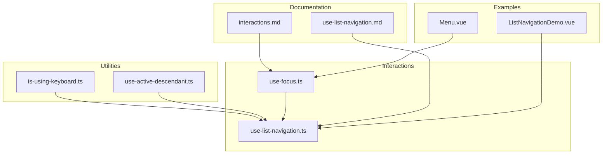
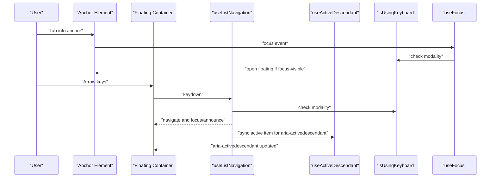
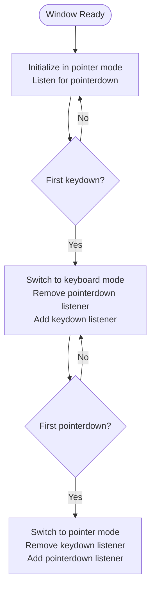
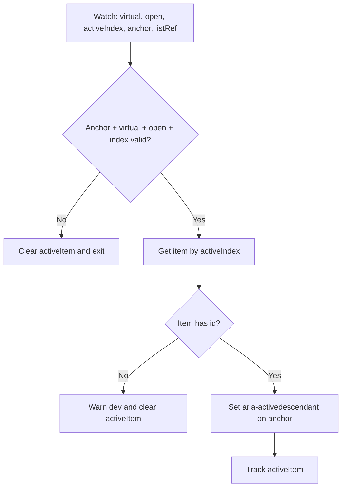
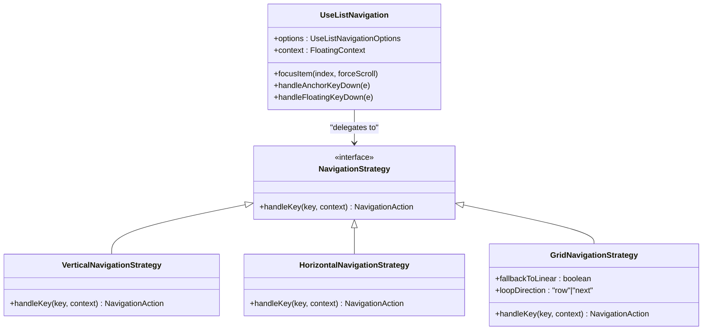
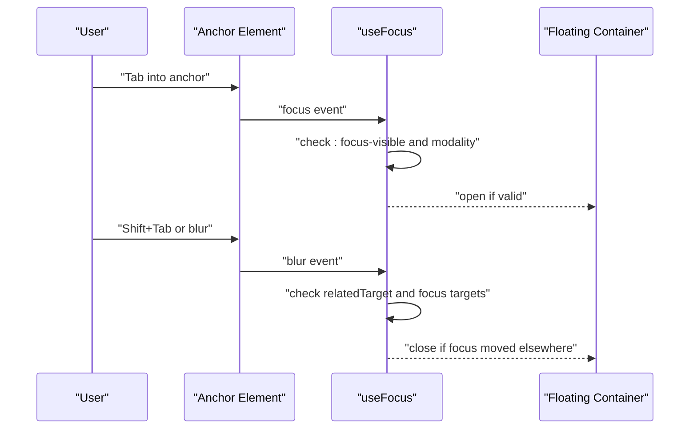
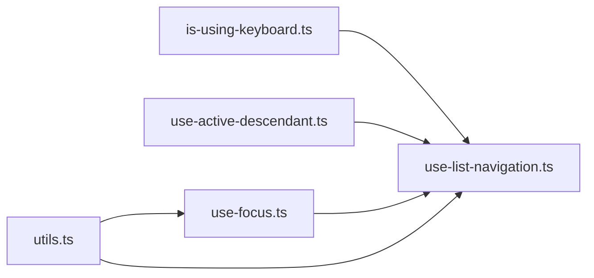

# Keyboard Interaction Utilities

<cite>
**Referenced Files in This Document**
- [is-using-keyboard.ts](file://src/composables/utils/is-using-keyboard.ts)
- [use-active-descendant.ts](file://src/composables/utils/use-active-descendant.ts)
- [use-list-navigation.ts](file://src/composables/interactions/use-list-navigation.ts)
- [use-focus.ts](file://src/composables/interactions/use-focus.ts)
- [utils.ts](file://src/utils.ts)
- [use-list-navigation.md](file://docs/api/use-list-navigation.md)
- [interactions.md](file://docs/guide/interactions.md)
- [ListNavigationDemo.vue](file://playground/demo/ListNavigationDemo.vue)
- [Menu.vue](file://playground/components/Menu.vue)
- [use-list-navigation.test.ts](file://src/composables/__tests__/use-list-navigation.test.ts)
</cite>

## Table of Contents
1. [Introduction](#introduction)
2. [Project Structure](#project-structure)
3. [Core Components](#core-components)
4. [Architecture Overview](#architecture-overview)
5. [Detailed Component Analysis](#detailed-component-analysis)
6. [Dependency Analysis](#dependency-analysis)
7. [Performance Considerations](#performance-considerations)
8. [Troubleshooting Guide](#troubleshooting-guide)
9. [Conclusion](#conclusion)
10. [Appendices](#appendices)

## Introduction
This document explains VFloat’s keyboard interaction utilities with a focus on accessibility and user experience. It covers:
- Detecting keyboard versus mouse interaction to adapt UI behavior appropriately
- Managing ARIA active descendant patterns for complex UI components
- Integrating keyboard navigation with focus management, list navigation, and keyboard-driven interactions
- Implementing accessibility compliance aligned with WCAG guidelines
- Practical examples for keyboard-friendly dropdowns, autocomplete components, and navigation systems
- Best practices for handling keyboard-only users, screen reader compatibility, and cross-platform keyboard behavior consistency
- Common accessibility challenges and solutions for keyboard-driven interfaces

## Project Structure
The keyboard utilities live in the composables layer:
- Utilities: keyboard modality detection and ARIA active descendant management
- Interactions: list navigation, focus management, and integration patterns
- Documentation: API references and interactive demos
- Tests: Accessibility and behavior validation

**Diagram sources**
- [is-using-keyboard.ts:1-26](file://src/composables/utils/is-using-keyboard.ts#L1-L26)
- [use-active-descendant.ts:1-87](file://src/composables/utils/use-active-descendant.ts#L1-L87)
- [use-list-navigation.ts:1-822](file://src/composables/interactions/use-list-navigation.ts#L1-L822)
- [use-focus.ts:1-235](file://src/composables/interactions/use-focus.ts#L1-L235)
- [use-list-navigation.md:1-181](file://docs/api/use-list-navigation.md#L1-L181)
- [interactions.md:1-291](file://docs/guide/interactions.md#L1-L291)
- [ListNavigationDemo.vue:1-300](file://playground/demo/ListNavigationDemo.vue#L1-L300)
- [Menu.vue:1-53](file://playground/components/Menu.vue#L1-L53)

**Section sources**
- [is-using-keyboard.ts:1-26](file://src/composables/utils/is-using-keyboard.ts#L1-L26)
- [use-active-descendant.ts:1-87](file://src/composables/utils/use-active-descendant.ts#L1-L87)
- [use-list-navigation.ts:1-822](file://src/composables/interactions/use-list-navigation.ts#L1-L822)
- [use-focus.ts:1-235](file://src/composables/interactions/use-focus.ts#L1-L235)
- [use-list-navigation.md:1-181](file://docs/api/use-list-navigation.md#L1-L181)
- [interactions.md:1-291](file://docs/guide/interactions.md#L1-L291)
- [ListNavigationDemo.vue:1-300](file://playground/demo/ListNavigationDemo.vue#L1-L300)
- [Menu.vue:1-53](file://playground/components/Menu.vue#L1-L53)

## Core Components
- isUsingKeyboard: Reactive signal indicating whether keyboard or pointer modality is active, enabling UI behavior adaptation (e.g., scroll behavior).
- useActiveDescendant: Manages aria-activedescendant for virtual focus, keeping DOM focus on the anchor while announcing the active item.
- useListNavigation: Comprehensive keyboard navigation for lists and grids, integrating with focus management and virtual focus.
- useFocus: Focus-based open/close behavior with :focus-visible heuristics and cross-browser compatibility.

**Section sources**
- [is-using-keyboard.ts:1-26](file://src/composables/utils/is-using-keyboard.ts#L1-L26)
- [use-active-descendant.ts:1-87](file://src/composables/utils/use-active-descendant.ts#L1-L87)
- [use-list-navigation.ts:1-822](file://src/composables/interactions/use-list-navigation.ts#L1-L822)
- [use-focus.ts:1-235](file://src/composables/interactions/use-focus.ts#L1-L235)

## Architecture Overview
The keyboard utilities integrate through a shared FloatingContext and reactive signals. The flow below shows how keyboard modality detection influences list navigation and focus management.

**Diagram sources**
- [use-list-navigation.ts:557-573](file://src/composables/interactions/use-list-navigation.ts#L557-L573)
- [use-list-navigation.ts:779-784](file://src/composables/interactions/use-list-navigation.ts#L779-L784)
- [use-focus.ts:89-113](file://src/composables/interactions/use-focus.ts#L89-L113)
- [is-using-keyboard.ts:1-26](file://src/composables/utils/is-using-keyboard.ts#L1-L26)

## Detailed Component Analysis

### isUsingKeyboard Utility
Purpose:
- Detects whether the user is interacting via keyboard or pointer to adapt behavior (e.g., scroll behavior).
- Switches between keyboard and pointer modes using capture-phase event listeners on window.

Key behaviors:
- Starts in pointer mode and listens for the first keyboard interaction to switch to keyboard mode.
- Switches back to pointer mode on the first pointer interaction after keyboard mode.
- Exposes a readonly reactive signal for downstream composables to consume.

Implementation highlights:
- Uses capture-phase event listeners to intercept early and reliably detect modality.
- Maintains a mutable ref internally and exposes it as readonly to prevent external mutation.

**Diagram sources**
- [is-using-keyboard.ts:5-23](file://src/composables/utils/is-using-keyboard.ts#L5-L23)

**Section sources**
- [is-using-keyboard.ts:1-26](file://src/composables/utils/is-using-keyboard.ts#L1-L26)

### useActiveDescendant Composable
Purpose:
- Manages virtual focus via aria-activedescendant, keeping DOM focus on the anchor while announcing the active item to assistive technologies.

Key behaviors:
- Watches for changes in virtual mode, open state, active index, anchor, and list items.
- Requires each list item to have a stable id attribute; warns in development if missing.
- Sets aria-activedescendant on the anchor and tracks the active item reference.
- Cleans up aria-activedescendant on unmount or when conditions change.

Integration:
- Used by useListNavigation to sync the active item for virtual focus scenarios.

**Diagram sources**
- [use-active-descendant.ts:36-83](file://src/composables/utils/use-active-descendant.ts#L36-L83)

**Section sources**
- [use-active-descendant.ts:1-87](file://src/composables/utils/use-active-descendant.ts#L1-L87)

### useListNavigation Composable
Purpose:
- Provides comprehensive keyboard navigation for lists and grids within floating containers, with optional virtual focus and cross-platform behavior.

Core capabilities:
- Navigation strategies: vertical, horizontal, and grid with configurable wrapping.
- Modality-aware focus management: uses isUsingKeyboard to conditionally scroll into view.
- Virtual focus: delegates DOM focus to the anchor and manages aria-activedescendant via useActiveDescendant.
- Hover-to-focus: optional mouse hover updates active index with ghost hover prevention.
- Cross-axis close behavior for nested menus.
- RTL support and disabled item skipping.

Integration points:
- Uses FloatingContext for open state and element refs.
- Integrates with isUsingKeyboard for scroll behavior and focus-on-open heuristics.
- Delegates to useActiveDescendant for virtual focus management.

**Diagram sources**
- [use-list-navigation.ts:21-40](file://src/composables/interactions/use-list-navigation.ts#L21-L40)
- [use-list-navigation.ts:74-103](file://src/composables/interactions/use-list-navigation.ts#L74-L103)
- [use-list-navigation.ts:105-285](file://src/composables/interactions/use-list-navigation.ts#L105-L285)

**Section sources**
- [use-list-navigation.ts:1-822](file://src/composables/interactions/use-list-navigation.ts#L1-L822)

### useFocus Composable
Purpose:
- Opens and closes floating elements on focus and blur, with :focus-visible heuristics and cross-browser compatibility.

Key behaviors:
- Uses isUsingKeyboard to avoid opening on pointer interactions for non-typeable elements.
- Handles edge cases like window blur/focus and document-level focus changes.
- Supports requireFocusVisible to align with :focus-visible semantics.

**Diagram sources**
- [use-focus.ts:89-145](file://src/composables/interactions/use-focus.ts#L89-L145)
- [utils.ts:57-60](file://src/utils.ts#L57-L60)

**Section sources**
- [use-focus.ts:1-235](file://src/composables/interactions/use-focus.ts#L1-L235)
- [utils.ts:57-60](file://src/utils.ts#L57-L60)

## Dependency Analysis
The keyboard utilities depend on:
- FloatingContext for shared state and element refs
- isUsingKeyboard for modality detection
- useActiveDescendant for virtual focus management
- Platform utilities for focus-visible checks and element detection

**Diagram sources**
- [is-using-keyboard.ts:1-26](file://src/composables/utils/is-using-keyboard.ts#L1-L26)
- [use-active-descendant.ts:1-87](file://src/composables/utils/use-active-descendant.ts#L1-L87)
- [use-list-navigation.ts:1-16](file://src/composables/interactions/use-list-navigation.ts#L1-L16)
- [use-focus.ts:1-18](file://src/composables/interactions/use-focus.ts#L1-L18)
- [utils.ts:1-222](file://src/utils.ts#L1-L222)

**Section sources**
- [use-list-navigation.ts:1-16](file://src/composables/interactions/use-list-navigation.ts#L1-L16)
- [use-focus.ts:1-18](file://src/composables/interactions/use-focus.ts#L1-L18)
- [utils.ts:1-222](file://src/utils.ts#L1-L222)

## Performance Considerations
- Event listener capture: isUsingKeyboard uses capture-phase listeners to minimize propagation overhead and ensure early detection.
- Conditional scrolling: useListNavigation only scrolls into view when keyboard modality is detected, reducing unnecessary layout work.
- Ghost hover prevention: useListNavigation’s hover-to-focus uses movement deltas to avoid frequent re-renders.
- Cleanup: All composables register cleanup functions to remove listeners and clear timeouts, preventing memory leaks.

[No sources needed since this section provides general guidance]

## Troubleshooting Guide
Common issues and resolutions:
- Virtual focus not working:
  - Ensure each list item has a stable id attribute; otherwise, warnings are logged and aria-activedescendant is not set.
  - Verify virtual mode is enabled and open state is true.
- Unexpected scroll behavior:
  - Confirm isUsingKeyboard is true when you expect scrolling; otherwise, scrolling is suppressed.
- Focus not moving on open:
  - Check focusItemOnOpen configuration and lastKey detection logic.
- Disabled items not skipped:
  - Provide disabledIndices as an array or predicate; ensure items are not null.
- Cross-axis close behavior:
  - Enable nested mode and configure parent orientation for cross-navigation semantics.

**Section sources**
- [use-active-descendant.ts:62-72](file://src/composables/utils/use-active-descendant.ts#L62-L72)
- [use-list-navigation.ts:557-573](file://src/composables/interactions/use-list-navigation.ts#L557-L573)
- [use-list-navigation.ts:738-764](file://src/composables/interactions/use-list-navigation.ts#L738-L764)
- [use-list-navigation.ts:517-520](file://src/composables/interactions/use-list-navigation.ts#L517-L520)

## Conclusion
VFloat’s keyboard interaction utilities provide a robust foundation for accessible, cross-platform keyboard-driven interfaces. By combining modality detection, virtual focus management, and comprehensive navigation strategies, developers can build inclusive experiences that meet WCAG guidelines and deliver consistent behavior across platforms.

[No sources needed since this section summarizes without analyzing specific files]

## Appendices

### Accessibility Compliance and WCAG Guidelines
- Keyboard operability: Full arrow key navigation, Home/End support, Enter/Space activation.
- Screen reader compatibility: ARIA activedescendant for virtual focus, explicit roles and states.
- Focus management: :focus-visible alignment, focus trapping considerations, and programmatic focus transitions.
- Cross-platform consistency: Modality detection and platform-specific focus-visible checks.

[No sources needed since this section provides general guidance]

### Practical Implementation Patterns

#### Keyboard-Friendly Dropdown
- Compose useListNavigation with useClick and useEscapeKey for robust interaction.
- Use virtual mode for combobox-like behavior to keep focus on the input while announcing options.

**Section sources**
- [interactions.md:77-136](file://docs/guide/interactions.md#L77-L136)
- [use-list-navigation.md:83-116](file://docs/api/use-list-navigation.md#L83-L116)

#### Autocomplete Component
- Use virtual mode with aria-activedescendant to announce suggestions without moving focus off the input.
- Implement disabledIndices for non-selectable items and loop behavior for long suggestion lists.

**Section sources**
- [use-list-navigation.md:118-151](file://docs/api/use-list-navigation.md#L118-L151)
- [use-list-navigation.test.ts:202-237](file://src/composables/__tests__/use-list-navigation.test.ts#L202-L237)

#### Navigation Systems
- Use grid navigation for uniform grids with configurable loop directions.
- Combine nested navigation with cross-axis close behavior for hierarchical menus.

**Section sources**
- [use-list-navigation.md:161-172](file://docs/api/use-list-navigation.md#L161-L172)
- [Menu.vue:1-53](file://playground/components/Menu.vue#L1-L53)

### Example Demos
- ListNavigationDemo showcases vertical, grid, virtual, and disabled item patterns.
- Menu component demonstrates tree-aware focus management and escape key handling.

**Section sources**
- [ListNavigationDemo.vue:1-300](file://playground/demo/ListNavigationDemo.vue#L1-L300)
- [Menu.vue:1-53](file://playground/components/Menu.vue#L1-L53)