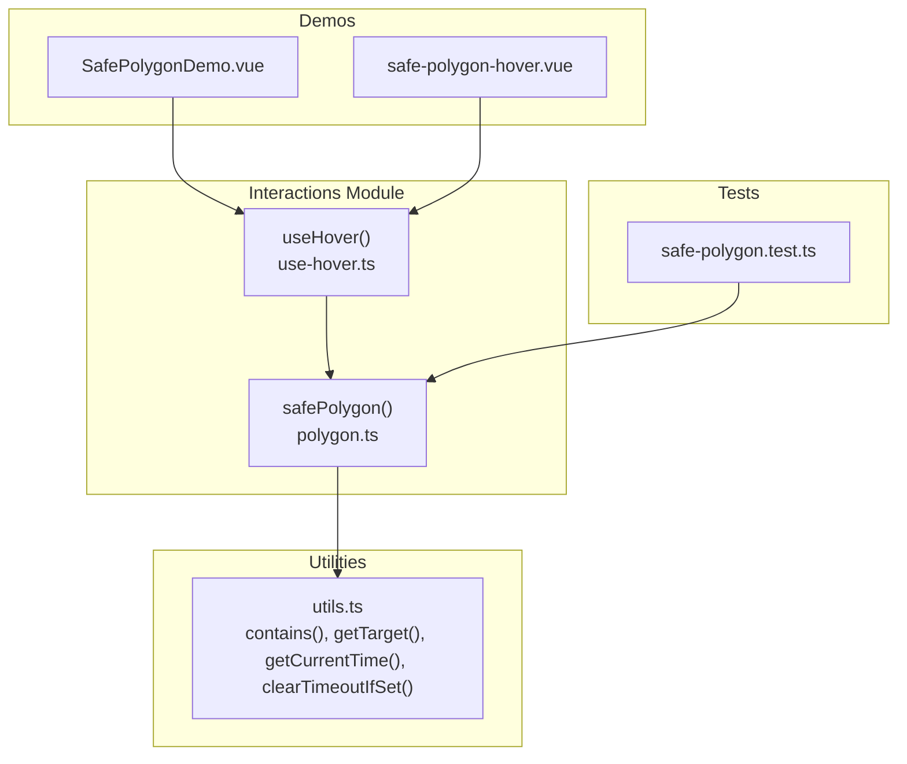
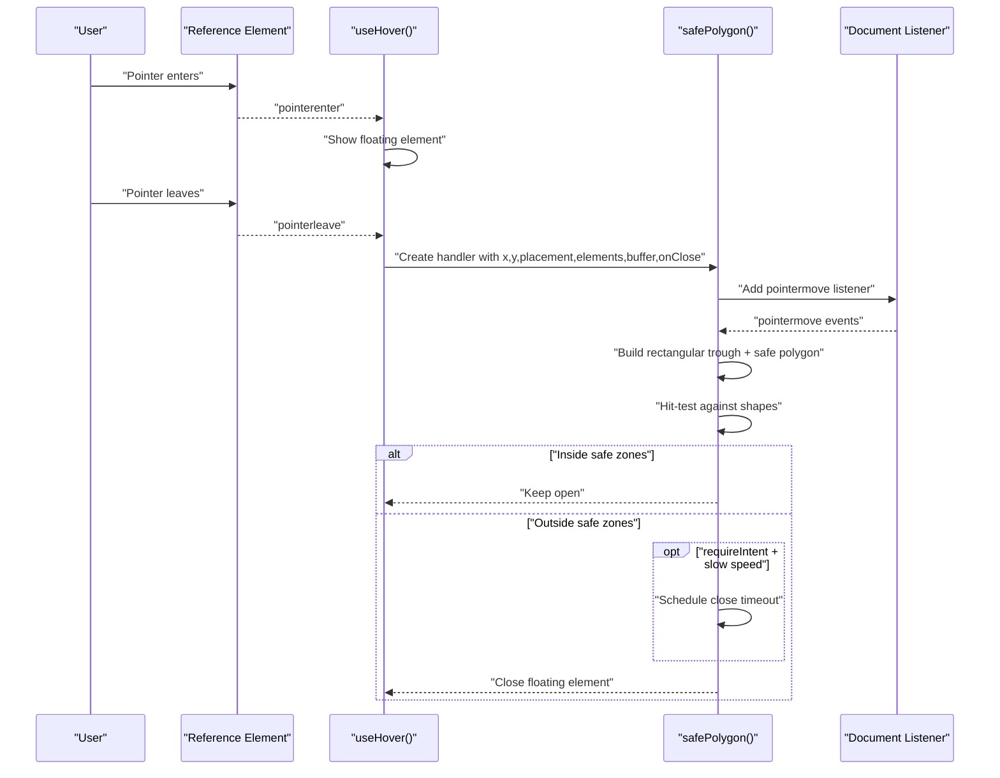
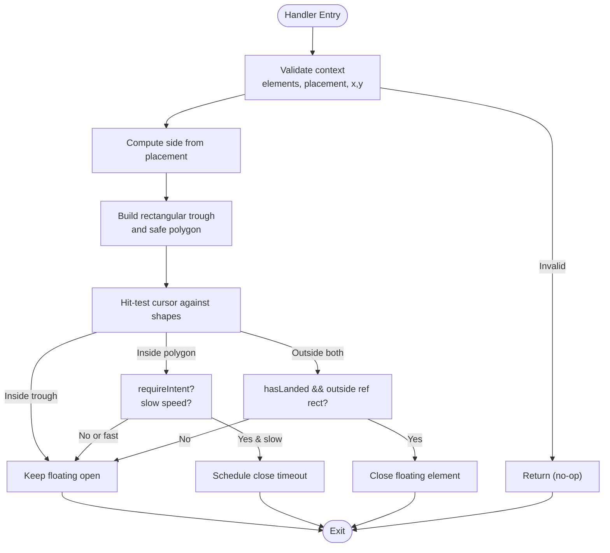
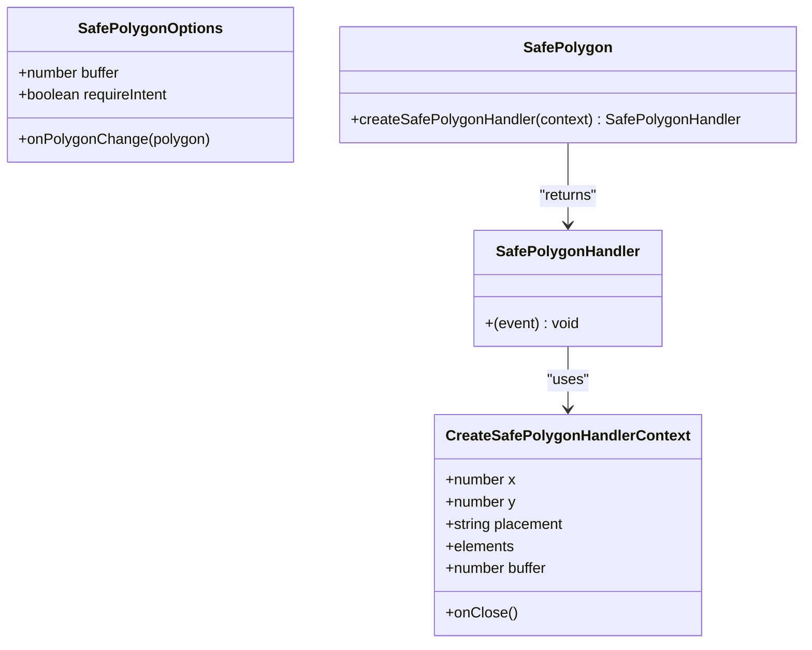
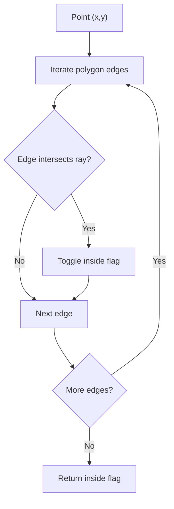
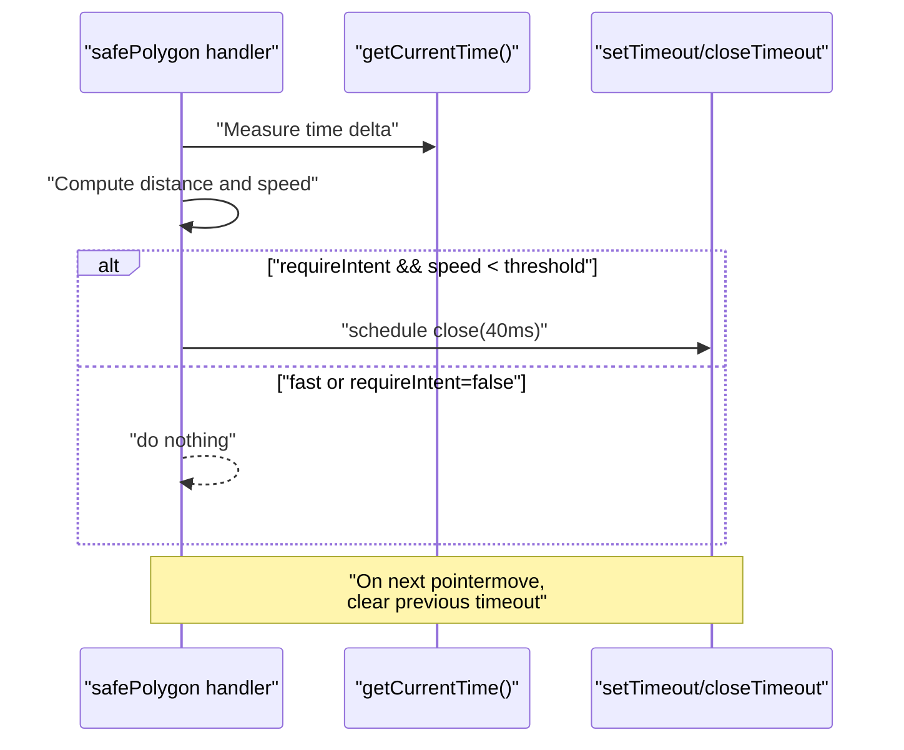
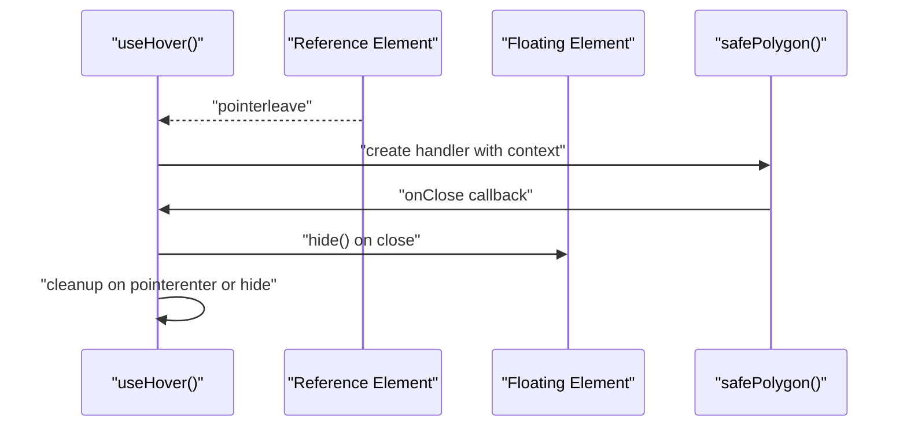
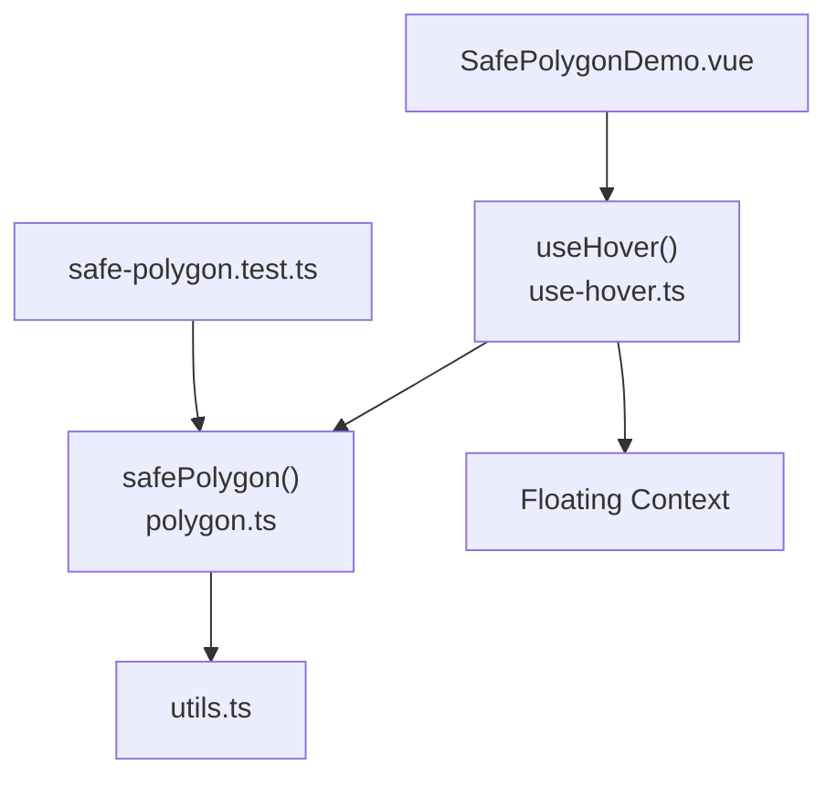

# Safe Polygon Algorithm

<cite>
**Referenced Files in This Document**
- [polygon.ts](file://src/composables/interactions/polygon.ts)
- [use-hover.ts](file://src/composables/interactions/use-hover.ts)
- [safe-polygon.test.ts](file://src/composables/__tests__/safe-polygon.test.ts)
- [safe-polygon.md](file://docs/guide/safe-polygon.md)
- [SafePolygonDemo.vue](file://playground/demo/SafePolygonDemo.vue)
- [safe-polygon-hover.vue](file://playground/safe-polygon-hover.vue)
- [utils.ts](file://src/utils.ts)
</cite>

## Table of Contents
1. [Introduction](#introduction)
2. [Project Structure](#project-structure)
3. [Core Components](#core-components)
4. [Architecture Overview](#architecture-overview)
5. [Detailed Component Analysis](#detailed-component-analysis)
6. [Dependency Analysis](#dependency-analysis)
7. [Performance Considerations](#performance-considerations)
8. [Troubleshooting Guide](#troubleshooting-guide)
9. [Conclusion](#conclusion)
10. [Appendices](#appendices)

## Introduction
This document explains the safe polygon algorithm used by VFloat’s hover interactions to enable smooth pointer navigation between related floating elements. The algorithm prevents accidental triggering of hover states when moving between a reference element (e.g., a trigger button) and a floating element (e.g., a dropdown menu or tooltip). It achieves this by constructing protective geometric regions—specifically a rectangular gap and a triangular/trapezoidal polygon—between the reference and floating elements. As long as the pointer remains within these regions, the floating element stays open, allowing users to navigate confidently without premature closures.

## Project Structure
The safe polygon feature is implemented as a composable interaction that integrates with VFloat’s floating positioning system. The core implementation resides in the interactions module, with supporting utilities and tests.

**Diagram sources**
- [polygon.ts:116-254](file://src/composables/interactions/polygon.ts#L116-L254)
- [use-hover.ts:141-350](file://src/composables/interactions/use-hover.ts#L141-L350)
- [utils.ts:166-191](file://src/utils.ts#L166-L191)
- [safe-polygon.test.ts:1-492](file://src/composables/__tests__/safe-polygon.test.ts#L1-L492)
- [SafePolygonDemo.vue:1-562](file://playground/demo/SafePolygonDemo.vue#L1-L562)
- [safe-polygon-hover.vue:1-114](file://playground/safe-polygon-hover.vue#L1-L114)

**Section sources**
- [polygon.ts:1-517](file://src/composables/interactions/polygon.ts#L1-L517)
- [use-hover.ts:1-351](file://src/composables/interactions/use-hover.ts#L1-L351)
- [utils.ts:1-222](file://src/utils.ts#L1-L222)

## Core Components
- SafePolygon factory: Creates a curried handler that tracks pointer movement and applies hit-testing against protective shapes.
- SafePolygon handler: Performs continuous hit-testing during pointermove events and manages intent detection and timeouts.
- UseHover integration: Wires safePolygon into the hover lifecycle, attaching listeners on pointerleave and cleaning up on pointerenter or hide.

Key responsibilities:
- Build protective shapes (rectangular trough and triangular/trapezoidal polygon).
- Perform point-in-polygon hit testing using ray casting.
- Detect pointer intent via cursor speed to avoid accidental closures.
- Manage timers and state transitions to prevent open-close loops.

**Section sources**
- [polygon.ts:116-254](file://src/composables/interactions/polygon.ts#L116-L254)
- [use-hover.ts:275-319](file://src/composables/interactions/use-hover.ts#L275-L319)

## Architecture Overview
The safe polygon algorithm operates as part of the hover interaction pipeline. When the pointer leaves the reference element, the system records the cursor position and constructs protective shapes. A pointermove listener evaluates whether the cursor is inside either shape. If not, it may schedule a close based on intent detection. The useHover composable coordinates event attachment and cleanup.

**Diagram sources**
- [use-hover.ts:275-319](file://src/composables/interactions/use-hover.ts#L275-L319)
- [polygon.ts:144-250](file://src/composables/interactions/polygon.ts#L144-L250)

## Detailed Component Analysis

### SafePolygon Factory and Handler
The factory accepts options and returns a handler bound to a specific floating context. The handler:
- Validates presence of required DOM elements and placement.
- Tracks pointer position and determines containment within reference/floating elements.
- Builds protective shapes and performs hit testing.
- Applies intent detection and manages timeouts.

**Diagram sources**
- [polygon.ts:144-250](file://src/composables/interactions/polygon.ts#L144-L250)

**Section sources**
- [polygon.ts:116-254](file://src/composables/interactions/polygon.ts#L116-L254)

### Polygon Calculation and Vertex Definition
The algorithm constructs two protective shapes:
- Rectangular Trough: Anchored to the narrower of the reference or floating element, spanning the gap between them along the placement direction.
- Safe Polygon: A trapezoidal fan originating from the cursor position near the leave point and extending toward the edges of the floating element. The orientation depends on cursor quadrant relative to the floating element.

**Diagram sources**
- [polygon.ts:31-90](file://src/composables/interactions/polygon.ts#L31-L90)
- [polygon.ts:116-124](file://src/composables/interactions/polygon.ts#L116-L124)

**Section sources**
- [polygon.ts:363-405](file://src/composables/interactions/polygon.ts#L363-L405)
- [polygon.ts:415-516](file://src/composables/interactions/polygon.ts#L415-L516)

### Collision Detection Mechanisms
- Rectangular Trough: Axis-aligned rectangle spanning the gap between reference and floating elements. Movement within this region is always safe.
- Safe Polygon: Trapezoidal region fanning outward from the cursor leave position toward the floating element edges. Uses ray-casting point-in-polygon test to determine containment.

**Diagram sources**
- [polygon.ts:295-308](file://src/composables/interactions/polygon.ts#L295-L308)

**Section sources**
- [polygon.ts:295-308](file://src/composables/interactions/polygon.ts#L295-L308)

### Intent Detection and Timeout Management
- Cursor Speed: Computed as distance divided by elapsed time between pointermove events. A threshold determines whether movement is considered accidental.
- requireIntent: When enabled, slow movement inside the safe polygon schedules a close after a short timeout. Once the pointer lands on the floating element, intent checks are skipped for subsequent traversals.
- Timer Management: Previous timeouts are cleared on each pointermove to avoid double-calls.

**Diagram sources**
- [polygon.ts:222-241](file://src/composables/interactions/polygon.ts#L222-L241)
- [utils.ts:180-191](file://src/utils.ts#L180-L191)

**Section sources**
- [polygon.ts:314-344](file://src/composables/interactions/polygon.ts#L314-L344)
- [polygon.ts:138-142](file://src/composables/interactions/polygon.ts#L138-L142)

### Integration with useHover
The useHover composable:
- Attaches pointerenter/leave listeners to reference and floating elements.
- On pointerleave, records cursor position and attaches the safe polygon pointermove listener.
- Manages delays, rest detection, and cleanup of listeners and polygon visualization callbacks.
- Supports tree-aware floating nodes and multiple concurrent safe polygons.

**Diagram sources**
- [use-hover.ts:275-319](file://src/composables/interactions/use-hover.ts#L275-L319)
- [use-hover.ts:255-265](file://src/composables/interactions/use-hover.ts#L255-L265)

**Section sources**
- [use-hover.ts:141-350](file://src/composables/interactions/use-hover.ts#L141-L350)

## Dependency Analysis
The safe polygon algorithm relies on:
- DOM utilities for containment checks, event target extraction, and timing.
- Floating context for placement and element references.
- Pointer event model for enter/leave and move tracking.

**Diagram sources**
- [polygon.ts:1-5](file://src/composables/interactions/polygon.ts#L1-L5)
- [utils.ts:166-191](file://src/utils.ts#L166-L191)
- [use-hover.ts:1-11](file://src/composables/interactions/use-hover.ts#L1-L11)
- [SafePolygonDemo.vue:1-562](file://playground/demo/SafePolygonDemo.vue#L1-L562)
- [safe-polygon.test.ts:1-492](file://src/composables/__tests__/safe-polygon.test.ts#L1-L492)

**Section sources**
- [polygon.ts:1-5](file://src/composables/interactions/polygon.ts#L1-L5)
- [utils.ts:166-191](file://src/utils.ts#L166-L191)
- [use-hover.ts:1-11](file://src/composables/interactions/use-hover.ts#L1-L11)

## Performance Considerations
- Event Listener Scope: The pointermove listener is attached only during pointerleave and removed on pointerenter or hide, minimizing overhead.
- Hit Testing Cost: Ray-casting is O(n) with n edges; typical polygons have 4–6 vertices, keeping cost negligible.
- Timer Management: Timers are cleared on each pointermove to prevent accumulation and redundant closures.
- Intent Detection: Speed computation uses performance.now() when available; falls back to Date.now() otherwise.

[No sources needed since this section provides general guidance]

## Troubleshooting Guide
Common issues and resolutions:
- Polygon not appearing: Ensure safePolygon is enabled in useHover and that pointerleave occurs from the reference element.
- Accidental closure on slow movement: Increase buffer or disable requireIntent to reduce sensitivity.
- Overlapping floating elements: The algorithm includes guards to prevent open-close loops when leaving to a floating element that contains the relatedTarget.
- Opposite-side traversal: If the pointer leaves from the side opposite to the floating element’s placement, the algorithm closes immediately to avoid meaningless traversal.

Validation and behavior are covered by comprehensive tests:
- Guard clauses for missing elements/placement.
- Hit testing correctness across placements and alignments.
- Intent detection behavior and timer clearing.
- Rectangular trough coverage and hasLanded semantics.

**Section sources**
- [safe-polygon.test.ts:101-141](file://src/composables/__tests__/safe-polygon.test.ts#L101-L141)
- [safe-polygon.test.ts:189-202](file://src/composables/__tests__/safe-polygon.test.ts#L189-L202)
- [safe-polygon.test.ts:206-240](file://src/composables/__tests__/safe-polygon.test.ts#L206-L240)
- [safe-polygon.test.ts:244-273](file://src/composables/__tests__/safe-polygon.test.ts#L244-L273)
- [safe-polygon.test.ts:309-365](file://src/composables/__tests__/safe-polygon.test.ts#L309-L365)
- [safe-polygon.test.ts:369-388](file://src/composables/__tests__/safe-polygon.test.ts#L369-L388)
- [safe-polygon.test.ts:463-473](file://src/composables/__tests__/safe-polygon.test.ts#L463-L473)
- [safe-polygon.test.ts:477-490](file://src/composables/__tests__/safe-polygon.test.ts#L477-L490)

## Conclusion
The safe polygon algorithm provides a robust solution for smooth pointer navigation between related floating elements. By combining a rectangular gap and a triangular/trapezoidal polygon, it creates a forgiving safe zone that adapts to placement and geometry. With configurable buffer sizing, intent detection, and careful timer management, it balances responsiveness with reliability. The implementation is integrated cleanly into VFloat’s hover system and validated by extensive tests.

[No sources needed since this section summarizes without analyzing specific files]

## Appendices

### Configuration Options
- buffer: Extra padding (pixels) added around the safe polygon to make traversal more forgiving. Defaults to 1.
- requireIntent: When true, enables cursor-speed based intent detection. Slow movement on initial entry may schedule a close. Defaults to true.
- onPolygonChange: Optional callback invoked whenever the safe polygon vertices change, useful for rendering a debug visualization overlay.

**Section sources**
- [polygon.ts:31-52](file://src/composables/interactions/polygon.ts#L31-L52)

### Implementation Guidance for Custom Hover Interactions
- Enable safePolygon in useHover with desired options.
- Use onPolygonChange to render an SVG overlay for debugging and UX feedback.
- Adjust buffer and requireIntent based on layout complexity and user behavior.
- For tree-aware navigation, ensure each node has its own safe polygon context.

**Section sources**
- [use-hover.ts:141-350](file://src/composables/interactions/use-hover.ts#L141-L350)
- [SafePolygonDemo.vue:82-156](file://playground/demo/SafePolygonDemo.vue#L82-L156)

### Touch Device Considerations
- The hover interaction is designed primarily for mouse-like pointers. For touch devices, consider disabling requireIntent or increasing buffer to accommodate imprecise movement.
- The mouseOnly option in useHover restricts events to mouse/pen when enabled.

**Section sources**
- [use-hover.ts:232-239](file://src/composables/interactions/use-hover.ts#L232-L239)

### Accessibility Compliance
- Ensure keyboard focus management remains intact when using safePolygon.
- Provide sufficient contrast and size for floating elements to aid navigation.
- Consider aria-live regions or announcements for dynamic content changes triggered by hover.

[No sources needed since this section provides general guidance]

### Visual Examples and Diagrams
- The playground demos illustrate polygon shapes and hover behavior across basic, menu, tooltip, and tree-aware scenarios.
- The demos render SVG overlays showing the safe polygon vertices during traversal.

**Section sources**
- [SafePolygonDemo.vue:467-502](file://playground/demo/SafePolygonDemo.vue#L467-L502)
- [safe-polygon-hover.vue:50-52](file://playground/safe-polygon-hover.vue#L50-L52)