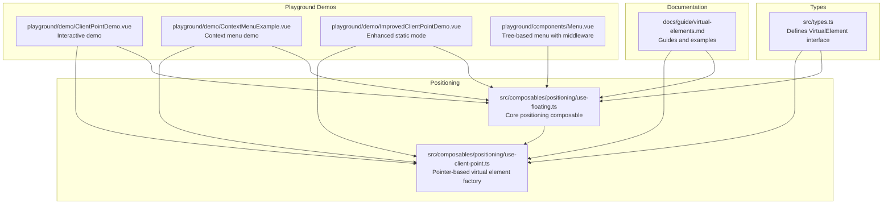
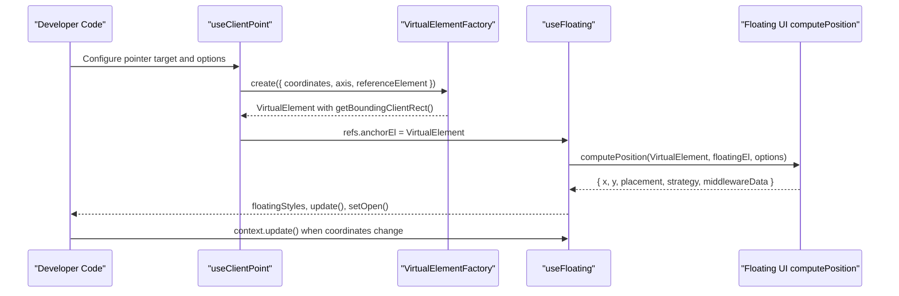
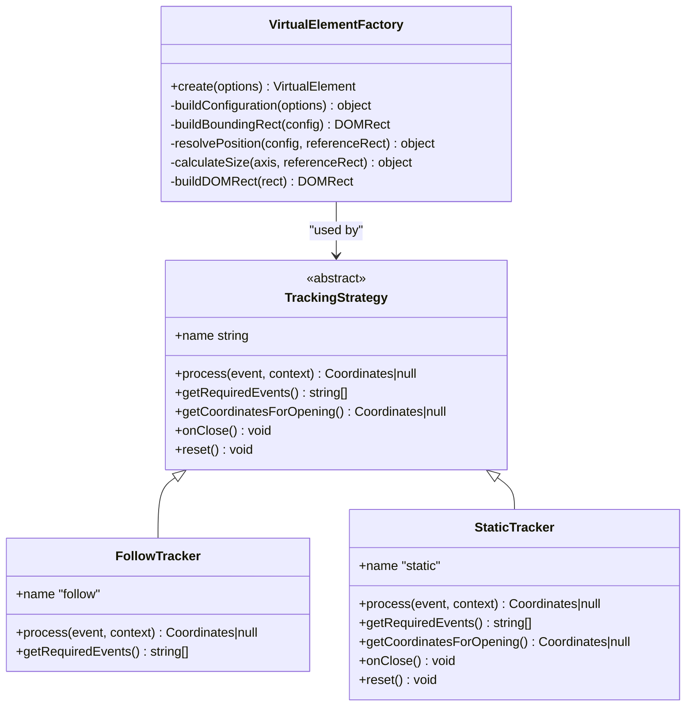
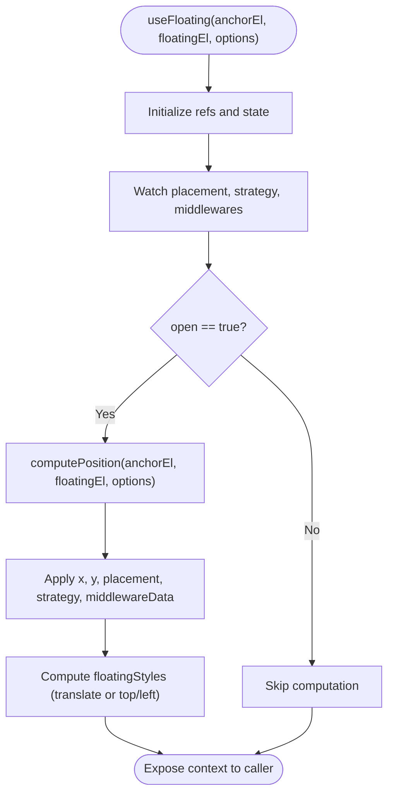
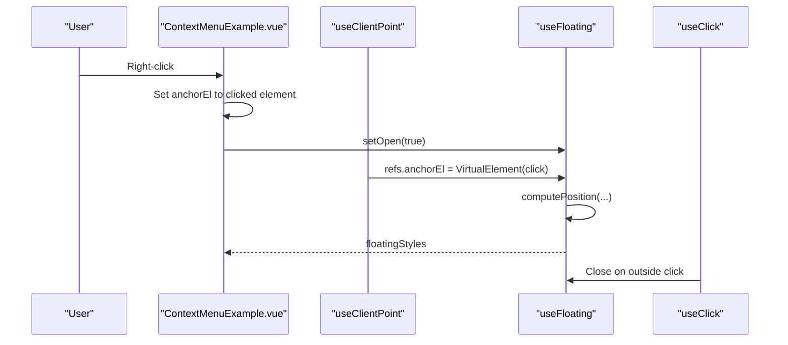
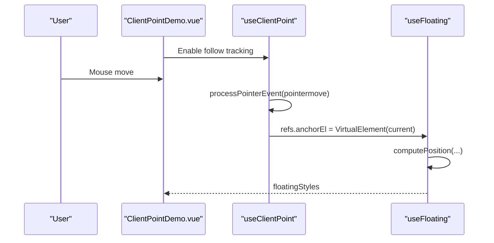
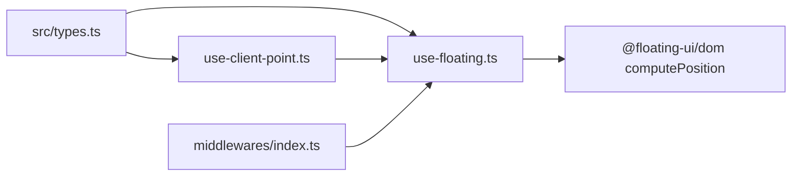

# Virtual Elements

<cite>
**Referenced Files in This Document**
- [types.ts](file://src/types.ts)
- [use-floating.ts](file://src/composables/positioning/use-floating.ts)
- [use-client-point.ts](file://src/composables/positioning/use-client-point.ts)
- [virtual-elements.md](file://docs/guide/virtual-elements.md)
- [ClientPointDemo.vue](file://playground/demo/ClientPointDemo.vue)
- [ContextMenuExample.vue](file://playground/demo/ContextMenuExample.vue)
- [ImprovedClientPointDemo.vue](file://playground/demo/ImprovedClientPointDemo.vue)
- [Menu.vue](file://playground/components/Menu.vue)
- [index.ts](file://src/composables/index.ts)
- [index.ts](file://src/composables/middlewares/index.ts)
</cite>

## Table of Contents
1. [Introduction](#introduction)
2. [Project Structure](#project-structure)
3. [Core Components](#core-components)
4. [Architecture Overview](#architecture-overview)
5. [Detailed Component Analysis](#detailed-component-analysis)
6. [Dependency Analysis](#dependency-analysis)
7. [Performance Considerations](#performance-considerations)
8. [Troubleshooting Guide](#troubleshooting-guide)
9. [Conclusion](#conclusion)

## Introduction
Virtual elements enable flexible positioning logic beyond traditional anchor/floating element pairs. Instead of anchoring a floating element to a DOM element, you can anchor it to an arbitrary point or dynamic coordinate set. This unlocks advanced use cases like context menus, cursor-following tooltips, and responsive positioning systems.

V-Float’s VirtualElement interface integrates seamlessly with the positioning pipeline, allowing you to:
- Position relative to mouse coordinates
- Create dynamic, pointer-following experiences
- Build static context menus that appear at click locations
- Implement custom reference points for grids, maps, or selections

## Project Structure
This section highlights the files that implement virtual elements and related positioning utilities.

**Diagram sources**
- [types.ts:8-14](file://src/types.ts#L8-L14)
- [use-floating.ts:196-362](file://src/composables/positioning/use-floating.ts#L196-L362)
- [use-client-point.ts:498-681](file://src/composables/positioning/use-client-point.ts#L498-L681)
- [virtual-elements.md:1-618](file://docs/guide/virtual-elements.md#L1-L618)
- [ClientPointDemo.vue:1-506](file://playground/demo/ClientPointDemo.vue#L1-L506)
- [ContextMenuExample.vue:1-177](file://playground/demo/ContextMenuExample.vue#L1-L177)
- [ImprovedClientPointDemo.vue:1-89](file://playground/demo/ImprovedClientPointDemo.vue#L1-L89)
- [Menu.vue:1-53](file://playground/components/Menu.vue#L1-L53)

**Section sources**
- [types.ts:8-14](file://src/types.ts#L8-L14)
- [use-floating.ts:196-362](file://src/composables/positioning/use-floating.ts#L196-L362)
- [use-client-point.ts:498-681](file://src/composables/positioning/use-client-point.ts#L498-L681)
- [virtual-elements.md:1-618](file://docs/guide/virtual-elements.md#L1-L618)

## Core Components
- VirtualElement interface: A minimal contract that mirrors DOMRect-based geometry so Floating UI can compute positions relative to arbitrary points.
- useFloating: The core positioning composable that accepts an AnchorElement (which can be a VirtualElement) and computes floating styles.
- useClientPoint: A specialized composable that builds and updates a VirtualElement anchored to pointer coordinates, with support for axis constraints and tracking modes.

Key capabilities:
- Zero-dimension virtual elements for point-like anchors
- Dynamic updates via context.update() when coordinates change
- contextElement for proper scrolling and boundary handling
- Integration with middleware (offset, flip, shift) for robust positioning

**Section sources**
- [types.ts:8-14](file://src/types.ts#L8-L14)
- [use-floating.ts:196-362](file://src/composables/positioning/use-floating.ts#L196-L362)
- [use-client-point.ts:498-681](file://src/composables/positioning/use-client-point.ts#L498-L681)

## Architecture Overview
Virtual elements plug into the existing positioning pipeline by providing a VirtualElement as the anchor. The pipeline computes positions using Floating UI and applies styles reactively.

**Diagram sources**
- [use-client-point.ts:498-681](file://src/composables/positioning/use-client-point.ts#L498-L681)
- [use-floating.ts:244-265](file://src/composables/positioning/use-floating.ts#L244-L265)

## Detailed Component Analysis

### VirtualElement Interface
- Purpose: Defines the minimal contract for a virtual anchor.
- Required members:
  - getBoundingClientRect(): returns a DOMRect-like object with x, y, top, left, right, bottom, width, height.
  - contextElement?: optional element used by Floating UI to resolve layout metrics and listen to scroll events.

Implementation notes:
- For point-like anchors, set width and height to zero.
- For axis-constrained anchors, sizes reflect the constrained dimension.

**Section sources**
- [types.ts:8-14](file://src/types.ts#L8-L14)

### useClientPoint: Virtual Element Factory and Tracking Strategies
- Responsibilities:
  - Builds a VirtualElement from pointer coordinates.
  - Applies axis constraints and sizing rules.
  - Manages tracking strategies:
    - FollowTracker: continuous cursor tracking.
    - StaticTracker: captures initial coordinates and keeps them stable.
  - Integrates with useFloating by updating refs.anchorEl with a new VirtualElement.

Key behaviors:
- Coordinates precedence: external coordinates override internal ones.
- Event registration optimized by strategy (only required pointer events).
- On open/close lifecycle hooks for strategy state management.

**Diagram sources**
- [use-client-point.ts:125-314](file://src/composables/positioning/use-client-point.ts#L125-L314)
- [use-client-point.ts:323-473](file://src/composables/positioning/use-client-point.ts#L323-L473)

**Section sources**
- [use-client-point.ts:498-681](file://src/composables/positioning/use-client-point.ts#L498-L681)

### useFloating: Positioning Pipeline
- Accepts an AnchorElement that can be a VirtualElement.
- Computes positions via Floating UI computePosition.
- Exposes reactive floatingStyles, update(), setOpen(), refs, and middlewareData.
- Automatically updates when anchorEl, floatingEl, or options change (watchers and autoUpdate).

Lifecycle:
- Watches open state to manage isPositioned flag.
- Uses autoUpdate to keep positions fresh during DOM changes and scrolling.
- Applies device-pixel-ratio-aware rounding for crisp rendering.

**Diagram sources**
- [use-floating.ts:244-343](file://src/composables/positioning/use-floating.ts#L244-L343)

**Section sources**
- [use-floating.ts:196-362](file://src/composables/positioning/use-floating.ts#L196-L362)

### Practical Use Cases

#### Context Menus (Static Positioning)
- Use static tracking mode so the menu appears at the click location and remains stable.
- Combine with outside-click handling to close the menu.

**Diagram sources**
- [ContextMenuExample.vue:46-73](file://playground/demo/ContextMenuExample.vue#L46-L73)
- [use-client-point.ts:418-473](file://src/composables/positioning/use-client-point.ts#L418-L473)
- [use-floating.ts:244-265](file://src/composables/positioning/use-floating.ts#L244-L265)

**Section sources**
- [virtual-elements.md:497-601](file://docs/guide/virtual-elements.md#L497-L601)
- [ContextMenuExample.vue:1-177](file://playground/demo/ContextMenuExample.vue#L1-L177)

#### Cursor-Following Tooltips (Follow Mode)
- Use follow tracking mode to continuously update the tooltip position as the cursor moves.
- Optionally constrain to a single axis for axis indicators or heatmaps.

**Diagram sources**
- [ClientPointDemo.vue:42-61](file://playground/demo/ClientPointDemo.vue#L42-L61)
- [use-client-point.ts:371-412](file://src/composables/positioning/use-client-point.ts#L371-L412)
- [use-floating.ts:244-265](file://src/composables/positioning/use-floating.ts#L244-L265)

**Section sources**
- [virtual-elements.md:119-189](file://docs/guide/virtual-elements.md#L119-L189)
- [ClientPointDemo.vue:1-506](file://playground/demo/ClientPointDemo.vue#L1-L506)

#### Responsive Positioning Systems
- Combine VirtualElement with middleware (offset, flip, shift) to adapt to viewport boundaries and alignment preferences.
- Use contextElement to ensure proper scrolling behavior within containers.

**Section sources**
- [virtual-elements.md:476-611](file://docs/guide/virtual-elements.md#L476-L611)
- [Menu.vue:18-26](file://playground/components/Menu.vue#L18-L26)

## Dependency Analysis
- VirtualElement is defined in types and consumed by useFloating and useClientPoint.
- useClientPoint constructs VirtualElements and updates refs.anchorEl in useFloating.
- useFloating delegates to Floating UI computePosition and exposes reactive styles.
- Middleware exports are re-exported from the middlewares index for convenient imports.

**Diagram sources**
- [types.ts:8-14](file://src/types.ts#L8-L14)
- [use-floating.ts:196-362](file://src/composables/positioning/use-floating.ts#L196-L362)
- [use-client-point.ts:498-681](file://src/composables/positioning/use-client-point.ts#L498-L681)
- [index.ts:1-4](file://src/composables/middlewares/index.ts#L1-L4)

**Section sources**
- [index.ts:1-4](file://src/composables/index.ts#L1-L4)
- [index.ts:1-4](file://src/composables/middlewares/index.ts#L1-L4)

## Performance Considerations
- Prefer transform-based positioning when possible for GPU acceleration.
- Use follow vs static tracking judiciously; static reduces pointer event overhead.
- Constrain axes to minimize unnecessary recomputations.
- Leverage autoUpdate options to tune performance for frequent DOM changes.
- Round positions by device pixel ratio to avoid blurry rendering.

[No sources needed since this section provides general guidance]

## Troubleshooting Guide
Common issues and resolutions:
- Tooltip flickers or blurs: Ensure transform is enabled and positions are rounded by device pixel ratio.
- Menu jumps when opening: Use static tracking mode to lock the initial click coordinates.
- Scroll container misalignment: Set contextElement on the VirtualElement to the scrollable container.
- Frequent pointer updates causing lag: Limit tracking to hover or use controlled coordinates via external x/y.
- Outside click not closing: Verify outside-click handling is configured and events are cleaned up.

**Section sources**
- [use-floating.ts:305-343](file://src/composables/positioning/use-floating.ts#L305-L343)
- [use-client-point.ts:629-675](file://src/composables/positioning/use-client-point.ts#L629-L675)
- [virtual-elements.md:603-611](file://docs/guide/virtual-elements.md#L603-L611)

## Conclusion
Virtual elements in V-Float provide a powerful abstraction for positioning floating elements relative to arbitrary points, enabling flexible and dynamic UI patterns. By combining VirtualElement with useClientPoint and useFloating, you can build robust, performant experiences such as context menus, cursor-following tooltips, and responsive positioning systems. Use middleware and contextElement to refine behavior and integrate with scrollable containers. Follow best practices for updates, sizing, and cleanup to ensure reliable performance and UX.