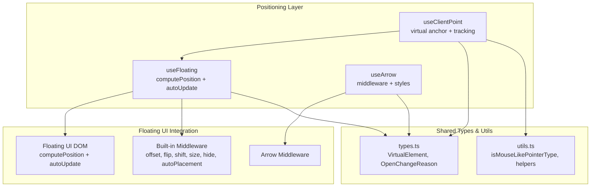
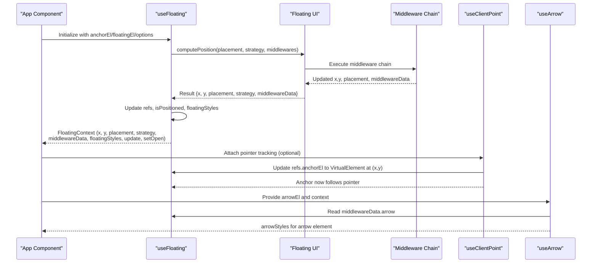
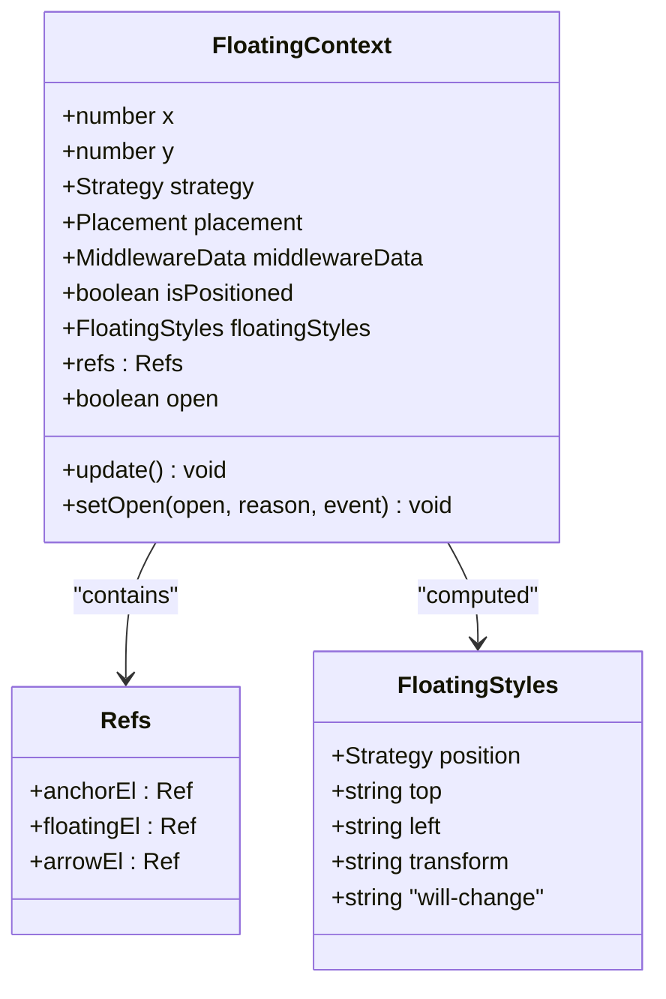
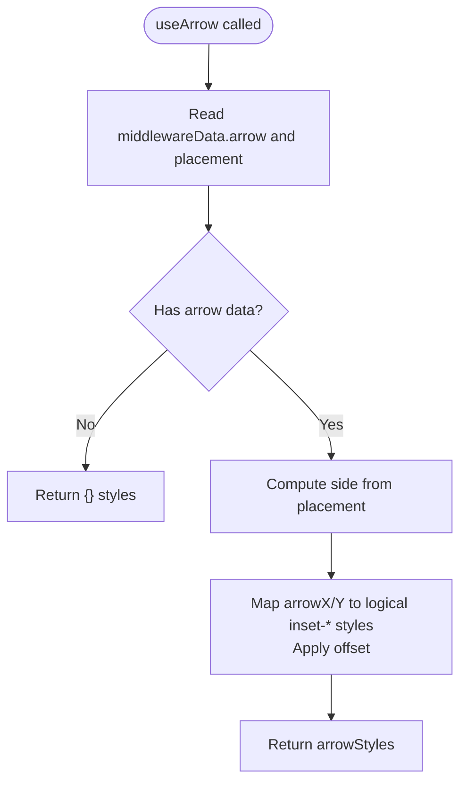
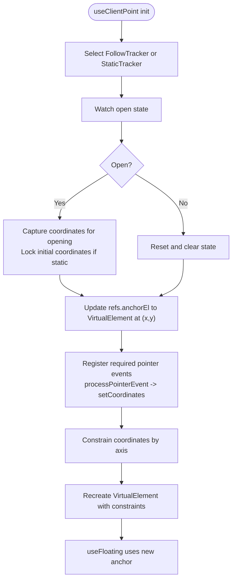
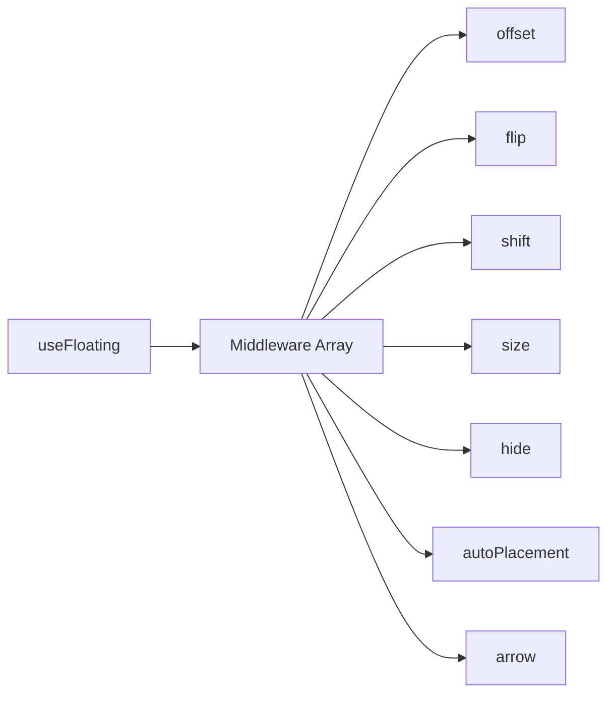
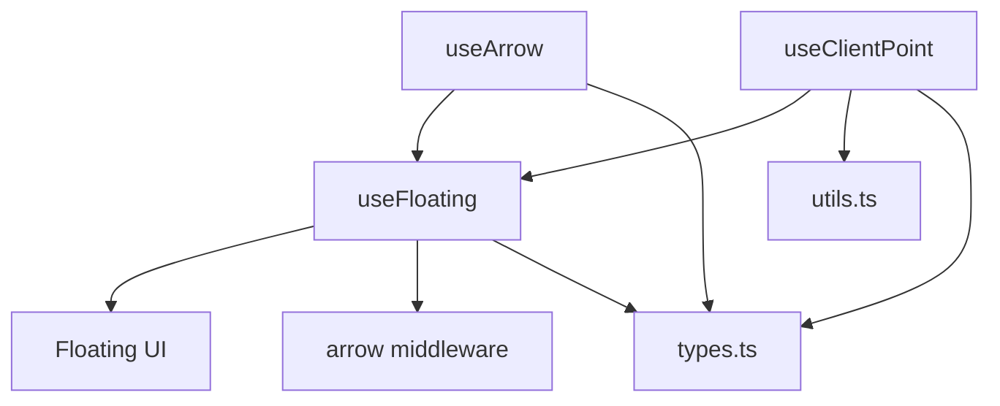

# Core Positioning System

<cite>
**Referenced Files in This Document**
- [use-floating.ts](file://src/composables/positioning/use-floating.ts)
- [use-arrow.ts](file://src/composables/positioning/use-arrow.ts)
- [use-client-point.ts](file://src/composables/positioning/use-client-point.ts)
- [arrow.ts](file://src/composables/middlewares/arrow.ts)
- [index.ts](file://src/composables/middlewares/index.ts)
- [types.ts](file://src/types.ts)
- [utils.ts](file://src/utils.ts)
- [use-floating.md](file://docs/api/use-floating.md)
- [use-arrow.md](file://docs/api/use-arrow.md)
- [use-client-point.md](file://docs/api/use-client-point.md)
- [middleware.md](file://docs/guide/middleware.md)
- [concepts.md](file://docs/guide/concepts.md)
- [ClientPointDemo.vue](file://playground/demo/ClientPointDemo.vue)
- [ImprovedClientPointDemo.vue](file://playground/demo/ImprovedClientPointDemo.vue)
- [ClientPointAxisDemo.vue](file://playground/demo/ClientPointAxisDemo.vue)
</cite>

## Table of Contents
1. [Introduction](#introduction)
2. [Project Structure](#project-structure)
3. [Core Components](#core-components)
4. [Architecture Overview](#architecture-overview)
5. [Detailed Component Analysis](#detailed-component-analysis)
6. [Dependency Analysis](#dependency-analysis)
7. [Performance Considerations](#performance-considerations)
8. [Troubleshooting Guide](#troubleshooting-guide)
9. [Conclusion](#conclusion)
10. [Appendices](#appendices)

## Introduction
This document explains the core positioning system of VFloat, focusing on the useFloating composable as the central orchestrator for floating element positioning. It covers how VFloat integrates with Floating UI to compute positions, how middleware modifies coordinates and provides data, and how viewport boundaries and collisions are handled. It also documents useArrow for arrow positioning with offset and padding, useClientPoint for cursor/touch coordinate-based positioning with axis-specific options, and the FloatingContext object structure including floatingStyles and device pixel ratio awareness. Practical examples demonstrate different positioning strategies and middleware combinations.

## Project Structure
The core positioning system is implemented in the composables/positioning directory and supported by middleware utilities and shared types. The main composable (useFloating) integrates with Floating UI’s computePosition and autoUpdate, while useArrow and useClientPoint provide specialized behaviors.

**Diagram sources**
- [use-floating.ts:1-384](file://src/composables/positioning/use-floating.ts#L1-L384)
- [use-arrow.ts:1-130](file://src/composables/positioning/use-arrow.ts#L1-L130)
- [use-client-point.ts:1-682](file://src/composables/positioning/use-client-point.ts#L1-L682)
- [arrow.ts:1-51](file://src/composables/middlewares/arrow.ts#L1-L51)
- [index.ts:1-4](file://src/composables/middlewares/index.ts#L1-L4)
- [types.ts:1-29](file://src/types.ts#L1-L29)
- [utils.ts:1-222](file://src/utils.ts#L1-L222)

**Section sources**
- [use-floating.ts:1-384](file://src/composables/positioning/use-floating.ts#L1-L384)
- [use-arrow.ts:1-130](file://src/composables/positioning/use-arrow.ts#L1-L130)
- [use-client-point.ts:1-682](file://src/composables/positioning/use-client-point.ts#L1-L682)
- [arrow.ts:1-51](file://src/composables/middlewares/arrow.ts#L1-L51)
- [index.ts:1-4](file://src/composables/middlewares/index.ts#L1-L4)
- [types.ts:1-29](file://src/types.ts#L1-L29)
- [utils.ts:1-222](file://src/utils.ts#L1-L222)

## Core Components
- useFloating: Central orchestrator that computes and updates floating element position using Floating UI, manages reactive state, and exposes FloatingContext with floatingStyles and update hooks.
- useArrow: Computes arrow element positioning and styles based on middleware data and placement, supporting offset configuration.
- useClientPoint: Tracks pointer/touch coordinates and updates the floating anchor to a virtual element, enabling cursor-based positioning with axis constraints and tracking modes.
- Middleware: Built-in middleware (offset, flip, shift, size, hide, autoPlacement) and the arrow middleware integrate with useFloating to refine placement and provide auxiliary data.

Key responsibilities:
- Position computation and updates via Floating UI
- Device pixel ratio rounding for crisp rendering
- Reactive middleware arrays and automatic updates on scroll/resize
- Virtual element creation for pointer-based anchors
- Arrow positioning with logical CSS properties

**Section sources**
- [use-floating.ts:176-362](file://src/composables/positioning/use-floating.ts#L176-L362)
- [use-arrow.ts:51-129](file://src/composables/positioning/use-arrow.ts#L51-L129)
- [use-client-point.ts:498-681](file://src/composables/positioning/use-client-point.ts#L498-L681)
- [index.ts:1-4](file://src/composables/middlewares/index.ts#L1-L4)

## Architecture Overview
The positioning pipeline starts with useFloating, which delegates to Floating UI for position calculation and auto-updates. Middleware can adjust coordinates and supply data (e.g., arrow positioning). useClientPoint optionally replaces the anchor with a virtual element at pointer coordinates. useArrow consumes middleware data to produce arrow styles.

**Diagram sources**
- [use-floating.ts:244-265](file://src/composables/positioning/use-floating.ts#L244-L265)
- [use-client-point.ts:594-605](file://src/composables/positioning/use-client-point.ts#L594-L605)
- [use-arrow.ts:80-122](file://src/composables/positioning/use-arrow.ts#L80-L122)

## Detailed Component Analysis

### useFloating: Central Positioning Orchestrator
useFloating integrates Floating UI’s computePosition and autoUpdate to manage floating element placement reactively. It:
- Accepts anchorEl and floatingEl refs and options (placement, strategy, transform, middlewares, autoUpdate, open, onOpenChange)
- Computes position when placement, strategy, or middlewares change and when open is true
- Automatically subscribes to scroll/resize updates via autoUpdate
- Produces floatingStyles using either transform translate or top/left depending on transform option
- Rounds coordinates by device pixel ratio for crisp rendering
- Exposes FloatingContext with x, y, strategy, placement, middlewareData, isPositioned, floatingStyles, update, refs, open, setOpen

**Diagram sources**
- [use-floating.ts:111-170](file://src/composables/positioning/use-floating.ts#L111-L170)
- [use-floating.ts:31-60](file://src/composables/positioning/use-floating.ts#L31-L60)

Key behaviors:
- Device pixel ratio awareness: coordinates are rounded per element DPR before applying styles.
- Transform vs top/left: when transform is enabled, styles use translate; otherwise, left/top are set.
- Middleware integration: reactiveMiddlewares augments provided middlewares with arrow middleware when arrowEl is present.

Practical examples:
- Basic usage with placement and middleware
- Reactive placement updates
- Open state control with callbacks

**Section sources**
- [use-floating.ts:176-362](file://src/composables/positioning/use-floating.ts#L176-L362)
- [use-floating.ts:368-383](file://src/composables/positioning/use-floating.ts#L368-L383)
- [use-floating.md:136-227](file://docs/api/use-floating.md#L136-L227)

### useArrow: Arrow Positioning with Offset and Padding
useArrow computes arrow element positioning and styles based on middleware data and placement:
- Reads arrowX/arrowY from middlewareData.arrow
- Determines arrow side from placement (top/bottom/left/right)
- Applies CSS logical properties inset-inline-start/inset-inline-end/inset-block-start/inset-block-end
- Supports offset configuration to control arrow distance from the floating element edge
- Watches arrowEl to synchronize with useFloating’s refs.arrowEl

**Diagram sources**
- [use-arrow.ts:80-122](file://src/composables/positioning/use-arrow.ts#L80-L122)

Practical examples:
- Basic arrow with default offset
- Custom offset and padding via underlying arrow middleware

**Section sources**
- [use-arrow.ts:51-129](file://src/composables/positioning/use-arrow.ts#L51-L129)
- [arrow.ts:36-50](file://src/composables/middlewares/arrow.ts#L36-L50)
- [use-arrow.md:51-101](file://docs/api/use-arrow.md#L51-L101)

### useClientPoint: Cursor/Touch Coordinate-Based Positioning
useClientPoint enables floating elements to follow the pointer by updating the floating anchor to a virtual element at pointer coordinates:
- Tracks pointerenter/pointermove/pointerdown events on a pointerTarget element
- Uses a VirtualElementFactory to create a VirtualElement with coordinates and axis constraints
- Supports axis constraints ("x", "y", "both") and tracking modes ("follow", "static")
- Provides controlled mode via external x/y refs
- Updates the floating anchor ref so useFloating positions relative to the pointer

**Diagram sources**
- [use-client-point.ts:550-551](file://src/composables/positioning/use-client-point.ts#L550-L551)
- [use-client-point.ts:608-627](file://src/composables/positioning/use-client-point.ts#L608-L627)
- [use-client-point.ts:643-675](file://src/composables/positioning/use-client-point.ts#L643-L675)
- [use-client-point.ts:594-605](file://src/composables/positioning/use-client-point.ts#L594-L605)

Practical examples:
- Tooltip following cursor with axis constraints
- Context menu appearing at click location (static mode)
- Controlled coordinates for programmatic positioning

**Section sources**
- [use-client-point.ts:498-681](file://src/composables/positioning/use-client-point.ts#L498-L681)
- [ClientPointDemo.vue:1-506](file://playground/demo/ClientPointDemo.vue#L1-L506)
- [ImprovedClientPointDemo.vue:1-204](file://playground/demo/ImprovedClientPointDemo.vue#L1-L204)
- [ClientPointAxisDemo.vue:1-190](file://playground/demo/ClientPointAxisDemo.vue#L1-L190)
- [use-client-point.md:57-92](file://docs/api/use-client-point.md#L57-L92)

### Middleware Support and Collision Handling
V-Float leverages Floating UI middleware to refine positioning:
- offset: Adds spacing along main/cross axes
- flip: Changes placement when overflow occurs
- shift: Adjusts position to fit within viewport with padding/boundary
- size: Resizes floating element to available space
- hide: Provides data to hide when reference becomes hidden
- autoPlacement: Chooses best placement based on available space
- arrow: Supplies arrow positioning data

These are exported from the middlewares index and integrated into useFloating’s reactive middlewares array.

**Diagram sources**
- [index.ts:1-4](file://src/composables/middlewares/index.ts#L1-L4)
- [use-floating.ts:232-242](file://src/composables/positioning/use-floating.ts#L232-L242)

**Section sources**
- [middleware.md:1-230](file://docs/guide/middleware.md#L1-L230)
- [index.ts:1-4](file://src/composables/middlewares/index.ts#L1-L4)

## Dependency Analysis
- useFloating depends on Floating UI computePosition and autoUpdate, and on the arrow middleware when an arrow element is present.
- useArrow depends on FloatingContext middlewareData and placement to compute arrow styles.
- useClientPoint depends on pointer event utilities and constructs VirtualElements to replace the anchor.
- Shared types define VirtualElement and OpenChangeReason; shared utils provide pointer-type detection.

**Diagram sources**
- [use-floating.ts:12-12](file://src/composables/positioning/use-floating.ts#L12-L12)
- [use-arrow.ts:3-3](file://src/composables/positioning/use-arrow.ts#L3-L3)
- [use-client-point.ts:19-21](file://src/composables/positioning/use-client-point.ts#L19-L21)
- [types.ts:8-14](file://src/types.ts#L8-L14)
- [utils.ts:69-73](file://src/utils.ts#L69-L73)

**Section sources**
- [use-floating.ts:1-12](file://src/composables/positioning/use-floating.ts#L1-L12)
- [use-arrow.ts:1-3](file://src/composables/positioning/use-arrow.ts#L1-L3)
- [use-client-point.ts:1-22](file://src/composables/positioning/use-client-point.ts#L1-L22)
- [types.ts:1-29](file://src/types.ts#L1-L29)
- [utils.ts:1-222](file://src/utils.ts#L1-L222)

## Performance Considerations
- Device pixel ratio rounding: useFloating rounds computed x/y by DPR before applying styles to avoid blurry rendering on high-DPR displays.
- Transform-based positioning: When transform is enabled, useFloating applies translate, which is generally more performant than mutating top/left for frequent updates.
- Conditional autoUpdate: autoUpdate is only subscribed when open is true and anchor/floating elements are available, minimizing unnecessary recalculations.
- Event listener optimization: useClientPoint registers only the pointer events required by the selected tracking strategy (e.g., static mode registers fewer listeners than follow mode).
- Middleware ordering: Place heavy middleware later to minimize recomputation cost; leverage reactive middleware arrays to avoid rebuilding middleware lists unnecessarily.

[No sources needed since this section provides general guidance]

## Troubleshooting Guide
Common issues and resolutions:
- Floating element not updating: Ensure open is true and anchorEl/floatingEl refs are non-null; call update() manually if needed.
- Arrow misaligned: Verify arrow middleware is included (it is auto-added when arrowEl is set); confirm arrow offset aligns with arrow size and border/shadow.
- Pointer tracking not working: Confirm pointerTarget is attached and enabled; check trackingMode and axis constraints; ensure pointer events are not blocked by overlays.
- Blurry text on high-DPI screens: useFloating automatically rounds coordinates by DPR; ensure transform is enabled for crispness.
- Unexpected collisions or clipping: Adjust middleware (flip padding, shift padding, size constraints) and placement to improve fit within viewport.

**Section sources**
- [use-floating.ts:244-265](file://src/composables/positioning/use-floating.ts#L244-L265)
- [use-arrow.ts:76-78](file://src/composables/positioning/use-arrow.ts#L76-L78)
- [use-client-point.ts:643-675](file://src/composables/positioning/use-client-point.ts#L643-L675)

## Conclusion
VFloat’s core positioning system centers on useFloating, which orchestrates Floating UI’s computePosition and autoUpdate, exposes a rich FloatingContext, and integrates middleware for advanced behaviors. useArrow and useClientPoint extend this system to support arrow positioning and pointer-based anchors with axis constraints and tracking modes. Together, these composables enable robust, performant, and flexible floating UI components suitable for tooltips, menus, and modals.

[No sources needed since this section summarizes without analyzing specific files]

## Appendices

### FloatingContext Properties and Methods
- x, y: Reactive numeric coordinates
- strategy: Reactive strategy ("absolute" | "fixed")
- placement: Reactive computed placement
- middlewareData: Reactive middleware data (e.g., arrow positioning)
- isPositioned: Boolean indicating whether the element has been positioned
- floatingStyles: Reactive CSS styles to apply to the floating element
- update(): Manual update trigger
- refs: anchorEl, floatingEl, arrowEl refs
- open: Reactive open state
- setOpen(open, reason?, event?): Set open state with optional reason and event

**Section sources**
- [use-floating.ts:111-170](file://src/composables/positioning/use-floating.ts#L111-L170)

### Middleware Configuration Options
- offset: mainAxis, crossAxis, alignmentAxis
- flip: fallbackPlacements, fallbackStrategy, padding
- shift: padding, boundary, limiter
- size: padding, apply hook
- hide: strategy, padding
- autoPlacement: allowedPlacements, padding
- arrow: element ref, padding

**Section sources**
- [middleware.md:19-142](file://docs/guide/middleware.md#L19-L142)

### Practical Examples Index
- Basic useFloating with placement and middleware
- Reactive placement updates
- Arrow positioning with offset
- Client point with axis constraints and static mode
- Context menu and tooltip demos

**Section sources**
- [use-floating.md:136-227](file://docs/api/use-floating.md#L136-L227)
- [use-arrow.md:51-101](file://docs/api/use-arrow.md#L51-L101)
- [use-client-point.md:57-92](file://docs/api/use-client-point.md#L57-L92)
- [ClientPointDemo.vue:1-506](file://playground/demo/ClientPointDemo.vue#L1-L506)
- [ImprovedClientPointDemo.vue:1-204](file://playground/demo/ImprovedClientPointDemo.vue#L1-L204)
- [ClientPointAxisDemo.vue:1-190](file://playground/demo/ClientPointAxisDemo.vue#L1-L190)