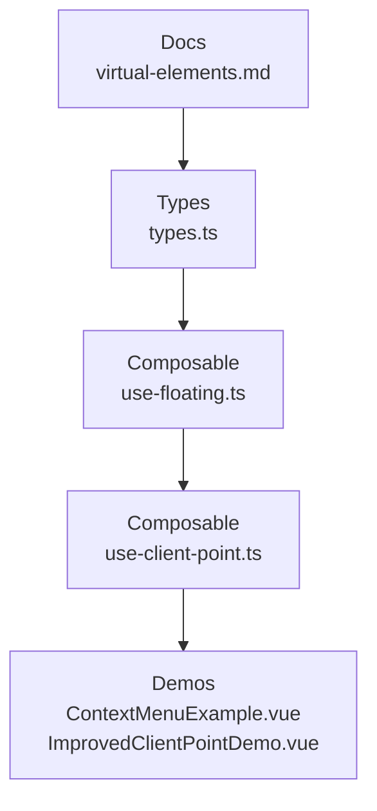
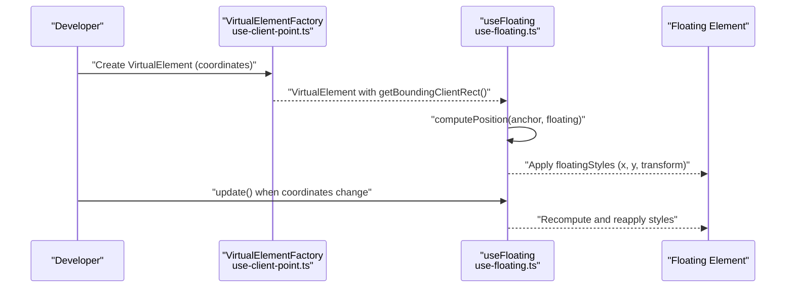
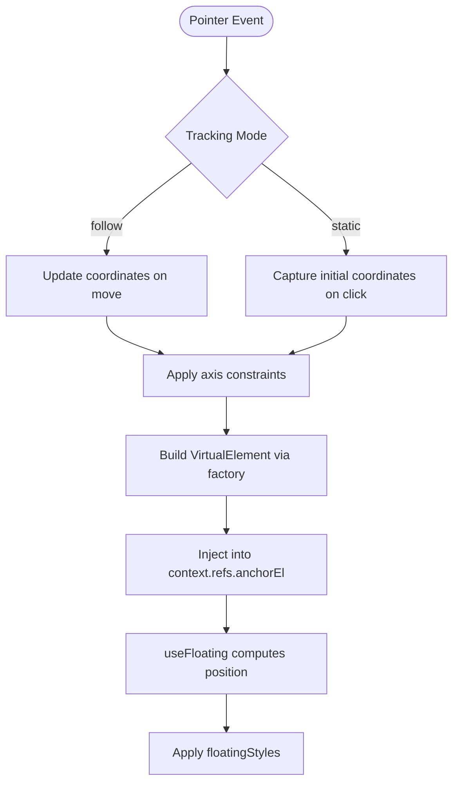
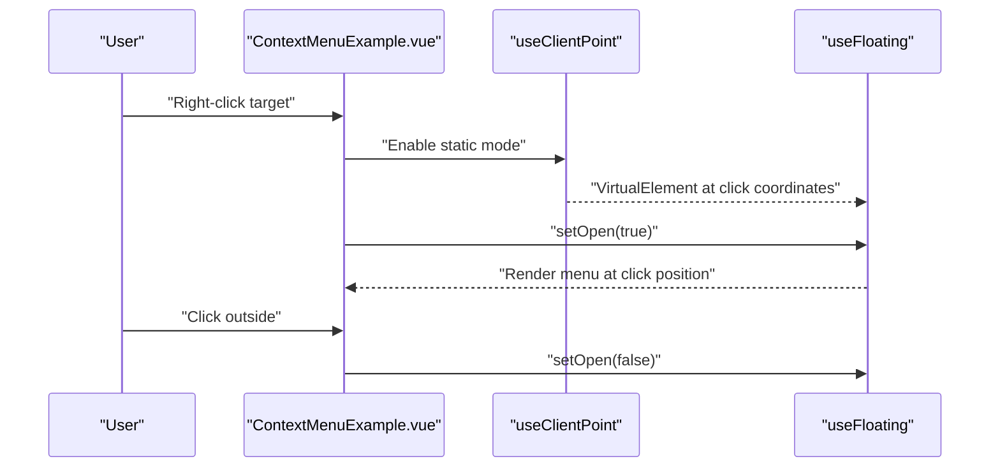
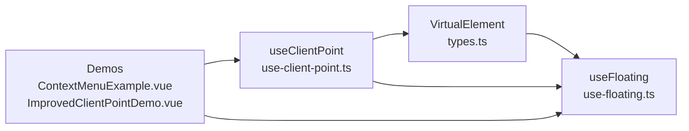

# Virtual Elements

<cite>
**Referenced Files in This Document**
- [virtual-elements.md](file://docs/guide/virtual-elements.md)
- [types.ts](file://src/types.ts)
- [use-floating.ts](file://src/composables/positioning/use-floating.ts)
- [use-client-point.ts](file://src/composables/positioning/use-client-point.ts)
- [ContextMenuExample.vue](file://playground/demo/ContextMenuExample.vue)
- [ImprovedClientPointDemo.vue](file://playground/demo/ImprovedClientPointDemo.vue)
- [index.ts](file://src/index.ts)
- [index.ts](file://src/composables/middlewares/index.ts)
</cite>

## Table of Contents
1. [Introduction](#introduction)
2. [Project Structure](#project-structure)
3. [Core Components](#core-components)
4. [Architecture Overview](#architecture-overview)
5. [Detailed Component Analysis](#detailed-component-analysis)
6. [Dependency Analysis](#dependency-analysis)
7. [Performance Considerations](#performance-considerations)
8. [Troubleshooting Guide](#troubleshooting-guide)
9. [Conclusion](#conclusion)

## Introduction
Virtual elements in VFloat enable flexible, pointer-free positioning logic without requiring actual DOM elements. They are lightweight objects that implement a minimal interface compatible with Floating UI’s expectations, allowing you to position floating elements relative to arbitrary coordinates. This unlocks advanced use cases such as context menus, pointer-following tooltips, custom reference points, grid selection, and map markers.

## Project Structure
VFloat organizes virtual element support across documentation, types, positioning composables, and interactive demos. The key areas are:
- Documentation: conceptual overview, use cases, and examples
- Types: the VirtualElement interface definition
- Positioning: useFloating and useClientPoint integrations
- Demos: real-world examples of context menus and pointer-based positioning



**Diagram sources**
- [virtual-elements.md:1-618](file://docs/guide/virtual-elements.md#L1-L618)
- [types.ts:8-14](file://src/types.ts#L8-L14)
- [use-floating.ts:196-362](file://src/composables/positioning/use-floating.ts#L196-L362)
- [use-client-point.ts:498-681](file://src/composables/positioning/use-client-point.ts#L498-L681)
- [ContextMenuExample.vue:1-177](file://playground/demo/ContextMenuExample.vue#L1-L177)
- [ImprovedClientPointDemo.vue:1-204](file://playground/demo/ImprovedClientPointDemo.vue#L1-L204)

**Section sources**
- [virtual-elements.md:1-618](file://docs/guide/virtual-elements.md#L1-L618)
- [types.ts:8-14](file://src/types.ts#L8-L14)

## Core Components
- VirtualElement interface: minimal contract with getBoundingClientRect returning a DOMRect-like shape and an optional contextElement for layout resolution.
- useFloating: computes and applies floating element styles using the anchor (DOM element or VirtualElement).
- useClientPoint: builds a VirtualElement anchored at pointer coordinates, with tracking modes and axis constraints.

Key integration points:
- useFloating accepts AnchorElement, which includes VirtualElement, enabling seamless switching between DOM and virtual anchors.
- useClientPoint constructs a VirtualElement and injects it into the floating context’s anchor reference.

**Section sources**
- [types.ts:8-14](file://src/types.ts#L8-L14)
- [use-floating.ts:19-26](file://src/composables/positioning/use-floating.ts#L19-L26)
- [use-floating.ts:196-362](file://src/composables/positioning/use-floating.ts#L196-L362)
- [use-client-point.ts:110-143](file://src/composables/positioning/use-client-point.ts#L110-L143)

## Architecture Overview
Virtual elements integrate with Floating UI through a thin wrapper that satisfies the expected interface. The flow is:
- Create a VirtualElement (manually or via useClientPoint)
- Pass it as the anchor to useFloating
- Floating UI computes position using the VirtualElement’s getBoundingClientRect
- Styles are applied reactively to the floating element



**Diagram sources**
- [use-client-point.ts:125-143](file://src/composables/positioning/use-client-point.ts#L125-L143)
- [use-floating.ts:244-265](file://src/composables/positioning/use-floating.ts#L244-L265)

## Detailed Component Analysis

### VirtualElement Interface
- Purpose: Provide Floating UI with a minimal, DOM-like interface for positioning.
- Required members:
  - getBoundingClientRect(): returns a DOMRect-like object with x, y, top, left, right, bottom, width, height
  - contextElement?: optional Element used by Floating UI to resolve layout metrics and scroll-awareness
- Behavior: Floating UI treats VirtualElement identically to a DOM element for positioning calculations.

Best practices:
- For point-like anchors, set width and height to 0.
- If the virtual element resides inside a scrollable container, set contextElement to ensure correct scroll-aware positioning.

**Section sources**
- [virtual-elements.md:35-49](file://docs/guide/virtual-elements.md#L35-L49)
- [virtual-elements.md:476-495](file://docs/guide/virtual-elements.md#L476-L495)
- [types.ts:8-14](file://src/types.ts#L8-L14)

### useFloating Integration
- Accepts AnchorElement, which includes VirtualElement, enabling virtual anchors.
- Computes position and exposes reactive styles (floatingStyles), coordinates (x, y), placement, strategy, middlewareData, and update() to recompute.
- Supports autoUpdate, middlewares, and open state management.

```mermaid
classDiagram
class VirtualElement {
+getBoundingClientRect() DOMRect
+contextElement? Element
}
class AnchorElement {
<<union>>
+HTMLElement
+VirtualElement
+null
}
class FloatingContext {
+x : number
+y : number
+strategy : Strategy
+placement : Placement
+middlewareData : MiddlewareData
+isPositioned : boolean
+floatingStyles : Styles
+update() : void
+refs : { anchorEl, floatingEl, arrowEl }
+open : boolean
+setOpen(open, reason?, event?) : void
}
VirtualElement <.. AnchorElement : "included"
FloatingContext <-- AnchorElement : "used as anchor"
```

**Diagram sources**
- [types.ts:8-14](file://src/types.ts#L8-L14)
- [use-floating.ts:19-26](file://src/composables/positioning/use-floating.ts#L19-L26)
- [use-floating.ts:111-170](file://src/composables/positioning/use-floating.ts#L111-L170)

**Section sources**
- [use-floating.ts:196-362](file://src/composables/positioning/use-floating.ts#L196-L362)

### useClientPoint: Pointer-Based Virtual Anchors
- Builds a VirtualElement that follows pointer coordinates with configurable tracking modes and axis constraints.
- Two tracking modes:
  - follow: continuous cursor tracking
  - static: position at initial interaction, then remain fixed
- Axis constraints:
  - both: track both X and Y
  - x: track only horizontal movement
  - y: track only vertical movement
- Controlled mode:
  - Externally supply x and y to drive positioning programmatically



**Diagram sources**
- [use-client-point.ts:498-681](file://src/composables/positioning/use-client-point.ts#L498-L681)
- [use-client-point.ts:125-143](file://src/composables/positioning/use-client-point.ts#L125-L143)

**Section sources**
- [virtual-elements.md:191-430](file://docs/guide/virtual-elements.md#L191-L430)
- [use-client-point.ts:498-681](file://src/composables/positioning/use-client-point.ts#L498-L681)

### Practical Examples

#### Context Menu with Static Positioning
- Use static tracking mode so the menu appears at the click position and remains fixed.
- Combine with useClick for outside-click-to-close behavior.



**Diagram sources**
- [ContextMenuExample.vue:46-68](file://playground/demo/ContextMenuExample.vue#L46-L68)
- [use-client-point.ts:418-473](file://src/composables/positioning/use-client-point.ts#L418-L473)
- [use-floating.ts:209-214](file://src/composables/positioning/use-floating.ts#L209-L214)

**Section sources**
- [ContextMenuExample.vue:1-177](file://playground/demo/ContextMenuExample.vue#L1-L177)
- [virtual-elements.md:497-601](file://docs/guide/virtual-elements.md#L497-L601)

#### Tooltip Following Cursor (Follow Mode)
- Use follow tracking mode to continuously update the tooltip position as the pointer moves.
- Combine with hover or click interactions to control visibility.

**Section sources**
- [virtual-elements.md:191-242](file://docs/guide/virtual-elements.md#L191-L242)
- [ImprovedClientPointDemo.vue:62-124](file://playground/demo/ImprovedClientPointDemo.vue#L62-L124)

#### Programmatic Positioning (Controlled Mode)
- Supply external x and y coordinates to drive positioning programmatically.
- Useful for custom anchor logic or animations.

**Section sources**
- [virtual-elements.md:337-366](file://docs/guide/virtual-elements.md#L337-L366)
- [use-client-point.ts:516-532](file://src/composables/positioning/use-client-point.ts#L516-L532)

### Advanced Scenarios
- Dynamic positioning: update VirtualElement coordinates and call context.update() to recompute.
- Conditional anchoring: switch between DOM elements and VirtualElements based on conditions.
- Custom anchor logic: implement getBoundingClientRect() to derive coordinates from application state (e.g., grid cell indices, map coordinates).

Integration tips:
- Use middleware like offset, flip, and shift to refine placement near pointer or virtual anchors.
- For scroll-awareness, set contextElement on the VirtualElement to the scrollable container.

**Section sources**
- [virtual-elements.md:603-611](file://docs/guide/virtual-elements.md#L603-L611)
- [use-floating.ts:232-242](file://src/composables/positioning/use-floating.ts#L232-L242)
- [index.ts:1-4](file://src/composables/middlewares/index.ts#L1-L4)

## Dependency Analysis
- VirtualElement is consumed by useFloating, which delegates to Floating UI’s computePosition.
- useClientPoint constructs VirtualElements and injects them into the floating context’s anchor reference.
- Demos demonstrate integration patterns with interactions and middleware.



**Diagram sources**
- [types.ts:8-14](file://src/types.ts#L8-L14)
- [use-floating.ts:196-362](file://src/composables/positioning/use-floating.ts#L196-L362)
- [use-client-point.ts:498-681](file://src/composables/positioning/use-client-point.ts#L498-L681)
- [ContextMenuExample.vue:1-177](file://playground/demo/ContextMenuExample.vue#L1-L177)
- [ImprovedClientPointDemo.vue:1-204](file://playground/demo/ImprovedClientPointDemo.vue#L1-L204)

**Section sources**
- [index.ts:1-2](file://src/index.ts#L1-L2)
- [index.ts:1-4](file://src/composables/middlewares/index.ts#L1-L4)

## Performance Considerations
- Prefer transform-based positioning when possible for GPU-accelerated updates.
- Minimize recomputations by batching pointer updates and calling update() only when coordinates change.
- Use axis constraints to reduce unnecessary recalculations in constrained scenarios.
- Avoid excessive DOM reads by caching reference element rectangles when feasible.

## Troubleshooting Guide
Common issues and resolutions:
- Floating element does not update after changing coordinates:
  - Ensure you call context.update() after updating the VirtualElement’s coordinates.
- Incorrect placement near edges:
  - Add middleware like offset, flip, and shift to improve placement robustness.
- Scroll-awareness problems:
  - Set contextElement on the VirtualElement to the scrollable container so Floating UI listens to its scroll events.
- Pointer-following feels laggy:
  - Use follow tracking mode with efficient event handling and consider throttling pointer updates.

**Section sources**
- [virtual-elements.md:603-611](file://docs/guide/virtual-elements.md#L603-L611)
- [virtual-elements.md:476-495](file://docs/guide/virtual-elements.md#L476-L495)
- [use-floating.ts:244-265](file://src/composables/positioning/use-floating.ts#L244-L265)

## Conclusion
Virtual elements in VFloat provide a powerful abstraction for positioning floating elements relative to arbitrary coordinates, enabling flexible, pointer-free layouts and advanced interactions. By combining VirtualElement with useFloating and useClientPoint—and leveraging middleware—you can build responsive, robust UI components such as context menus, tooltips, and custom overlays. Use contextElement for scroll-awareness, update coordinates reactively, and apply middleware to fine-tune placement behavior.