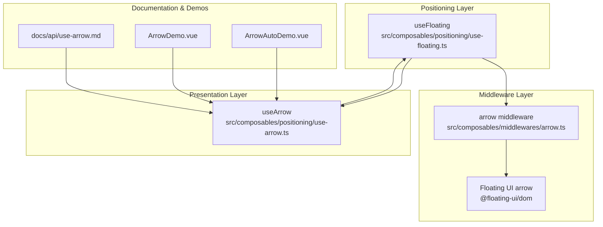
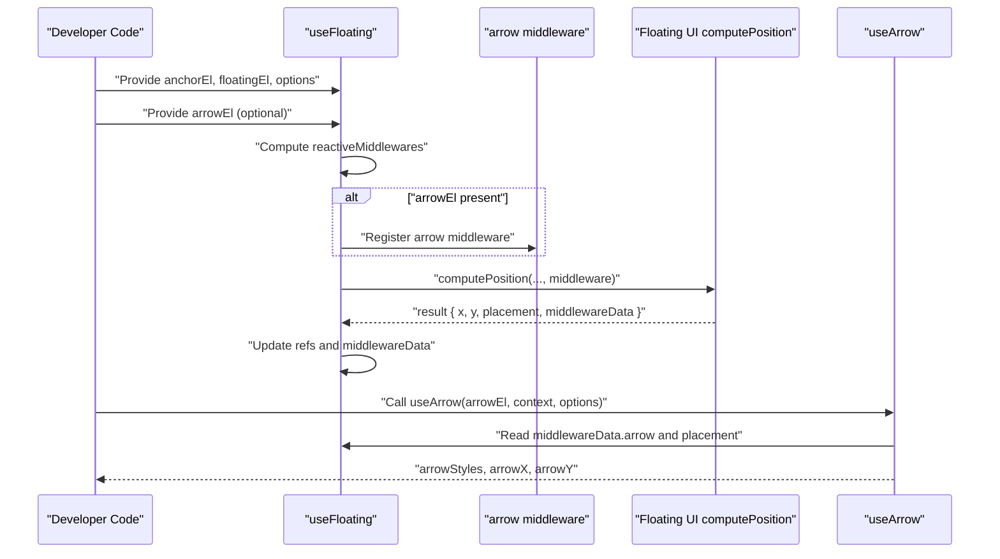
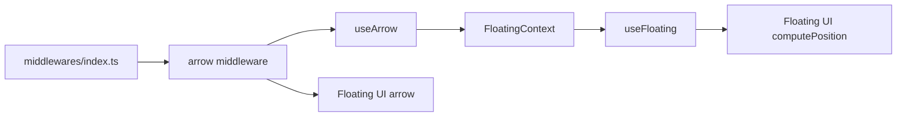

# useArrow Composable

<cite>
**Referenced Files in This Document**
- [use-arrow.ts](file://src/composables/positioning/use-arrow.ts)
- [arrow.ts](file://src/composables/middlewares/arrow.ts)
- [use-floating.ts](file://src/composables/positioning/use-floating.ts)
- [index.ts](file://src/composables/middlewares/index.ts)
- [use-arrow.md](file://docs/api/use-arrow.md)
- [ArrowDemo.vue](file://playground/demo/ArrowDemo.vue)
- [ArrowAutoDemo.vue](file://playground/demo/ArrowAutoDemo.vue)
</cite>

## Table of Contents
1. [Introduction](#introduction)
2. [Project Structure](#project-structure)
3. [Core Components](#core-components)
4. [Architecture Overview](#architecture-overview)
5. [Detailed Component Analysis](#detailed-component-analysis)
6. [Dependency Analysis](#dependency-analysis)
7. [Performance Considerations](#performance-considerations)
8. [Troubleshooting Guide](#troubleshooting-guide)
9. [Conclusion](#conclusion)
10. [Appendices](#appendices)

## Introduction
This document explains the useArrow composable and its associated middleware system for creating tooltips and popovers with directional arrows. It covers how arrow positioning integrates with useFloating, how the arrow middleware computes arrow coordinates, and how the composable translates those coordinates into CSS styles. It also documents the arrow middleware configuration, element requirements, styling considerations, and performance characteristics.

## Project Structure
The arrow-related functionality spans three main areas:
- Middleware: a thin wrapper around Floating UI’s arrow middleware that injects an element reference and optional padding.
- Positioning composable: useFloating orchestrates positioning and automatically registers the arrow middleware when an arrow element is provided.
- Arrow composable: useArrow consumes the floating context and computes arrow styles and positions for rendering.

**Diagram sources**
- [use-floating.ts:196-362](file://src/composables/positioning/use-floating.ts#L196-L362)
- [arrow.ts:36-50](file://src/composables/middlewares/arrow.ts#L36-L50)
- [use-arrow.ts:68-129](file://src/composables/positioning/use-arrow.ts#L68-L129)
- [use-arrow.md:1-107](file://docs/api/use-arrow.md#L1-L107)
- [ArrowDemo.vue:19-27](file://playground/demo/ArrowDemo.vue#L19-L27)
- [ArrowAutoDemo.vue:16-25](file://playground/demo/ArrowAutoDemo.vue#L16-L25)

**Section sources**
- [use-floating.ts:196-362](file://src/composables/positioning/use-floating.ts#L196-L362)
- [arrow.ts:36-50](file://src/composables/middlewares/arrow.ts#L36-L50)
- [use-arrow.ts:68-129](file://src/composables/positioning/use-arrow.ts#L68-L129)
- [use-arrow.md:1-107](file://docs/api/use-arrow.md#L1-L107)
- [ArrowDemo.vue:19-27](file://playground/demo/ArrowDemo.vue#L19-L27)
- [ArrowAutoDemo.vue:16-25](file://playground/demo/ArrowAutoDemo.vue#L16-L25)

## Core Components
- useArrow: Computes arrow X/Y coordinates and CSS styles for an arrow element based on the floating context and placement. It watches the arrow element ref and reads middleware data to position the arrow consistently with the floating element.
- arrow middleware: A small wrapper around Floating UI’s arrow middleware that accepts an element ref and optional padding. It returns a middleware function suitable for useFloating’s middleware pipeline.
- useFloating: The core positioning composable that manages placement, strategy, styles, and middleware registration. It automatically adds the arrow middleware when an arrow element is provided.

Key responsibilities:
- useArrow: transforms middleware data into arrow styles and exposes arrowX/arrowY for advanced use cases.
- arrow middleware: delegates to Floating UI’s arrow computation with the provided element and padding.
- useFloating: maintains middlewareData and placement, and conditionally registers the arrow middleware when an arrow element is present.

**Section sources**
- [use-arrow.ts:68-129](file://src/composables/positioning/use-arrow.ts#L68-L129)
- [arrow.ts:36-50](file://src/composables/middlewares/arrow.ts#L36-L50)
- [use-floating.ts:228-242](file://src/composables/positioning/use-floating.ts#L228-L242)

## Architecture Overview
The arrow system integrates tightly with useFloating’s middleware pipeline. When an arrow element is provided, useFloating automatically registers the arrow middleware so that Floating UI computes arrow coordinates. useArrow then reads those coordinates and placement to produce CSS styles that align the arrow with the floating element.

**Diagram sources**
- [use-floating.ts:228-242](file://src/composables/positioning/use-floating.ts#L228-L242)
- [use-floating.ts:244-265](file://src/composables/positioning/use-floating.ts#L244-L265)
- [arrow.ts:36-50](file://src/composables/middlewares/arrow.ts#L36-L50)
- [use-arrow.ts:80-122](file://src/composables/positioning/use-arrow.ts#L80-L122)

## Detailed Component Analysis

### useArrow Composable
Purpose:
- Compute arrow position styles and expose arrowX/arrowY for precise control.
- Automatically watch the arrow element ref and read middleware data to keep styles in sync.

Inputs:
- arrowEl: Ref to the arrow DOM element.
- context: FloatingContext from useFloating.
- options.offset: Optional CSS length controlling arrow distance from the floating element edge.

Behavior:
- Watches the arrow element ref and updates the shared refs.arrowEl in the floating context.
- Reads middlewareData.arrow.x/y to compute arrowX/arrowY.
- Derives the arrow side from placement and applies logical CSS properties to position the arrow with the configured offset.
- Returns arrowStyles as a record of CSS declarations suitable for inline style binding.

Styling considerations:
- Uses logical CSS properties for cross-browser and writing-mode compatibility.
- The arrow element itself must be absolutely positioned and sized appropriately; rotation transforms can be applied externally to achieve a diamond shape.

Performance:
- Computed properties minimize recomputation; styles are only generated when the arrow element and middleware data are available.

**Section sources**
- [use-arrow.ts:68-129](file://src/composables/positioning/use-arrow.ts#L68-L129)
- [use-arrow.ts:80-122](file://src/composables/positioning/use-arrow.ts#L80-L122)

### Arrow Middleware
Purpose:
- Provide a Vue-friendly wrapper around Floating UI’s arrow middleware.
- Accept an element ref and optional padding to influence arrow placement near boundaries.

Behavior:
- Validates the presence of the arrow element.
- Delegates to Floating UI’s arrow middleware with the provided element and padding.
- Returns a middleware object compatible with useFloating’s middleware pipeline.

Padding semantics:
- Controls how close the arrow can get to the edges of the floating element.
- Supports numeric padding or per-side padding values.

Integration:
- The middleware is registered automatically by useFloating when an arrow element is provided.

**Section sources**
- [arrow.ts:36-50](file://src/composables/middlewares/arrow.ts#L36-L50)
- [index.ts:2-3](file://src/composables/middlewares/index.ts#L2-L3)

### useFloating Integration
Automatic registration:
- useFloating maintains an internal arrowEl ref and a reactive middleware list.
- When arrowEl is truthy, it checks whether an arrow middleware is already present and appends one if missing.

Middleware data flow:
- computePosition returns middlewareData, which useFloating stores in a shallow reactive ref.
- useArrow reads middlewareData.arrow and placement to compute styles.

Open state and updates:
- Updates occur when open is true and when anchor/floating/transform/placement/middlewares change.
- autoUpdate is used when enabled to keep the floating element positioned as the anchor or viewport changes.

**Section sources**
- [use-floating.ts:228-242](file://src/composables/positioning/use-floating.ts#L228-L242)
- [use-floating.ts:244-265](file://src/composables/positioning/use-floating.ts#L244-L265)
- [use-floating.ts:267-271](file://src/composables/positioning/use-floating.ts#L267-L271)

### Practical Examples and Usage Patterns
- Basic tooltip with arrow: Demonstrates providing an arrow element and applying arrowStyles. The arrow middleware is auto-registered when useArrow is called.
- Auto-registration pattern: Shows that arrow middleware is added automatically when an arrow element is provided to useArrow.
- Custom offset: Illustrates adjusting the arrow distance from the floating element edge.

These examples show:
- How to wire up useFloating with middlewares and interactions.
- How to bind arrowStyles to the arrow element.
- How to combine useArrow with other middlewares like offset, flip, and shift.

**Section sources**
- [ArrowDemo.vue:19-27](file://playground/demo/ArrowDemo.vue#L19-L27)
- [ArrowAutoDemo.vue:16-25](file://playground/demo/ArrowAutoDemo.vue#L16-L25)
- [use-arrow.md:51-101](file://docs/api/use-arrow.md#L51-L101)

## Dependency Analysis
Relationships:
- useArrow depends on FloatingContext (middlewareData, placement, refs).
- useFloating depends on Floating UI’s computePosition and autoUpdate.
- arrow middleware depends on Floating UI’s arrow middleware and Vue’s toValue for refs.
- The middleware export re-exports Floating UI’s arrow to make it available via the library’s public API.

**Diagram sources**
- [use-arrow.ts:74-78](file://src/composables/positioning/use-arrow.ts#L74-L78)
- [use-floating.ts:244-265](file://src/composables/positioning/use-floating.ts#L244-L265)
- [arrow.ts:36-50](file://src/composables/middlewares/arrow.ts#L36-L50)
- [index.ts:2-3](file://src/composables/middlewares/index.ts#L2-L3)

**Section sources**
- [use-arrow.ts:74-78](file://src/composables/positioning/use-arrow.ts#L74-L78)
- [use-floating.ts:244-265](file://src/composables/positioning/use-floating.ts#L244-L265)
- [arrow.ts:36-50](file://src/composables/middlewares/arrow.ts#L36-L50)
- [index.ts:2-3](file://src/composables/middlewares/index.ts#L2-L3)

## Performance Considerations
- Computed styles: useArrow uses computed refs to avoid unnecessary style recomputation.
- Conditional rendering: Styles are only produced when the arrow element and middleware data are available.
- Device pixel ratio rounding: useFloating rounds positions based on DPR to reduce blurriness on high-DPI displays.
- Transform vs. top/left: useFloating prefers transform for smoother animations and better performance on modern browsers.
- Auto-update: Enabling autoUpdate keeps the floating element positioned reactively as anchors move, but consider disabling it in static scenarios to save resources.

[No sources needed since this section provides general guidance]

## Troubleshooting Guide
Common issues and resolutions:
- Arrow not visible:
  - Ensure the arrow element is rendered and bound to arrowStyles.
  - Verify that the arrow element is absolutely positioned and sized appropriately.
  - Confirm that the arrow element is provided to useArrow and that useFloating has registered the arrow middleware.
- Arrow misaligned:
  - Check that the arrow element’s CSS transform (e.g., rotate) matches the side it is intended to face.
  - Adjust the offset option to fine-tune the arrow’s distance from the floating element edge.
- Arrow overlaps border/shadow:
  - Increase the offset to create a gap between the arrow and the floating element edge.
  - Use padding in the arrow middleware to prevent the arrow from touching the boundary.
- Placement conflicts:
  - Combine arrow middleware with flip and shift to improve arrow visibility across placements.
  - Review the placement and strategy settings in useFloating.

**Section sources**
- [use-arrow.ts:83-122](file://src/composables/positioning/use-arrow.ts#L83-L122)
- [use-floating.ts:228-242](file://src/composables/positioning/use-floating.ts#L228-L242)
- [ArrowDemo.vue:46-50](file://playground/demo/ArrowDemo.vue#L46-L50)

## Conclusion
The useArrow composable and arrow middleware provide a cohesive system for creating tooltips and popovers with directional arrows. By leveraging Floating UI’s robust arrow computation and integrating seamlessly with useFloating, developers can easily position arrows that adapt to placement changes and work across different strategies and interactions. The composable’s computed styles and automatic middleware registration simplify common use cases while still allowing customization through offset and padding options.

[No sources needed since this section summarizes without analyzing specific files]

## Appendices

### API Reference Summary
- useArrow
  - Inputs: arrowEl, context, options
  - Outputs: arrowX, arrowY, arrowStyles
  - Options: offset (CSS length)
- arrow middleware
  - Inputs: options.element (ref), options.padding
  - Output: Middleware compatible with useFloating
- useFloating
  - Automatic arrow middleware registration when arrowEl is provided
  - Exposes middlewareData and placement for downstream consumers

**Section sources**
- [use-arrow.ts:68-129](file://src/composables/positioning/use-arrow.ts#L68-L129)
- [arrow.ts:36-50](file://src/composables/middlewares/arrow.ts#L36-L50)
- [use-floating.ts:228-242](file://src/composables/positioning/use-floating.ts#L228-L242)
- [use-arrow.md:51-101](file://docs/api/use-arrow.md#L51-L101)