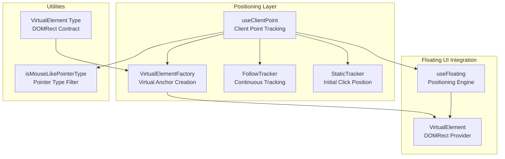
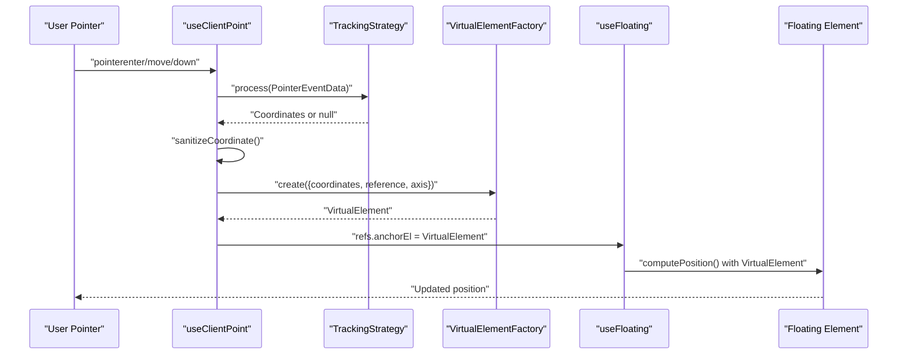
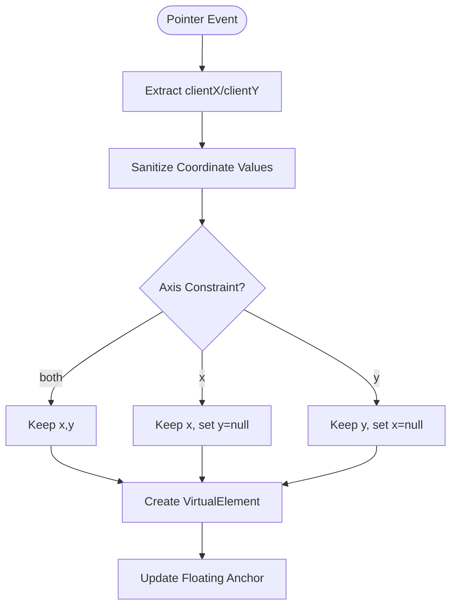
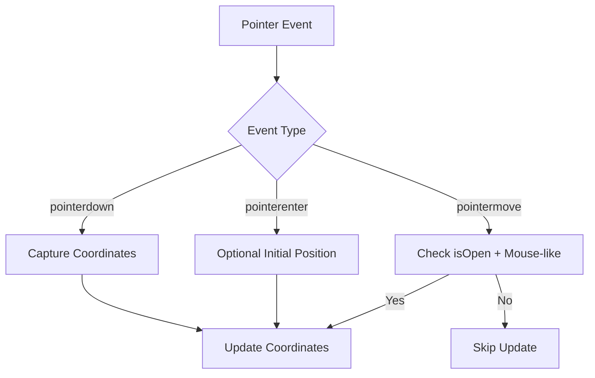
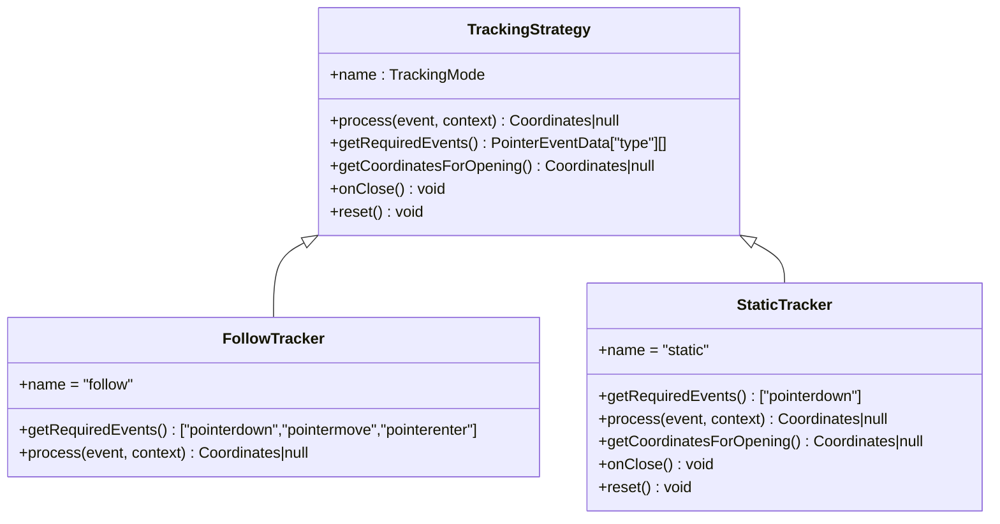
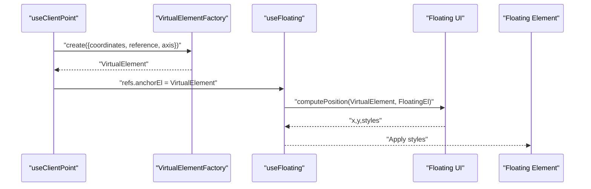
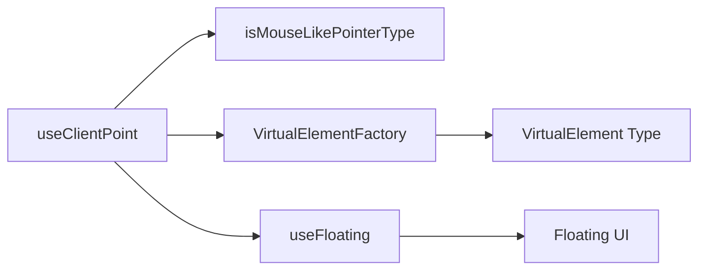

# useClientPoint Composable

<cite>
**Referenced Files in This Document**
- [use-client-point.ts](file://src/composables/positioning/use-client-point.ts)
- [use-floating.ts](file://src/composables/positioning/use-floating.ts)
- [utils.ts](file://src/utils.ts)
- [types.ts](file://src/types.ts)
- [use-client-point.md](file://docs/api/use-client-point.md)
- [ClientPointDemo.vue](file://playground/demo/ClientPointDemo.vue)
- [ImprovedClientPointDemo.vue](file://playground/demo/ImprovedClientPointDemo.vue)
- [ClientPointAxisDemo.vue](file://playground/demo/ClientPointAxisDemo.vue)
- [ContextMenuExample.vue](file://playground/demo/ContextMenuExample.vue)
- [use-client-point.test.ts](file://src/composables/__tests__/use-client-point.test.ts)
</cite>

## Table of Contents
1. [Introduction](#introduction)
2. [Project Structure](#project-structure)
3. [Core Components](#core-components)
4. [Architecture Overview](#architecture-overview)
5. [Detailed Component Analysis](#detailed-component-analysis)
6. [Dependency Analysis](#dependency-analysis)
7. [Performance Considerations](#performance-considerations)
8. [Troubleshooting Guide](#troubleshooting-guide)
9. [Conclusion](#conclusion)
10. [Appendices](#appendices)

## Introduction
The useClientPoint composable enables floating elements to be positioned relative to the user’s pointer (mouse or touch) by tracking client coordinates and updating the floating context’s anchor to a virtual element at those coordinates. It supports axis-constrained tracking (X, Y, or both), two tracking modes (follow and static), and integrates seamlessly with useFloating for dynamic positioning updates. This document explains the coordinate system, pointer event handling, axis-specific positioning, and practical use cases such as context menus, custom tooltips, and interactive positioning elements.

## Project Structure
The useClientPoint composable resides in the positioning composables module and integrates with the broader floating UI ecosystem. It relies on:
- VirtualElementFactory to create a lightweight virtual anchor element based on coordinates
- TrackingStrategy implementations (FollowTracker, StaticTracker) to decide when and how to update coordinates
- Pointer event filtering utilities to distinguish mouse-like pointers from touch/pen
- Integration with useFloating to consume the virtual anchor and compute final positioning



**Diagram sources**
- [use-client-point.ts:125-314](file://src/composables/positioning/use-client-point.ts#L125-L314)
- [use-client-point.ts:323-473](file://src/composables/positioning/use-client-point.ts#L323-L473)
- [use-floating.ts:196-384](file://src/composables/positioning/use-floating.ts#L196-L384)
- [utils.ts:69-73](file://src/utils.ts#L69-L73)
- [types.ts:8-14](file://src/types.ts#L8-L14)

**Section sources**
- [use-client-point.ts:1-682](file://src/composables/positioning/use-client-point.ts#L1-L682)
- [use-floating.ts:1-200](file://src/composables/positioning/use-floating.ts#L1-L200)
- [utils.ts:69-73](file://src/utils.ts#L69-L73)
- [types.ts:8-14](file://src/types.ts#L8-L14)

## Core Components
- Coordinates: Reactive x/y pair with null sentinel values for unset states
- AxisConstraint: "x", "y", or "both" to limit movement to specific axes
- TrackingMode: "follow" for continuous cursor tracking, "static" for initial click position
- UseClientPointOptions: enable/disable, axis, controlled x/y, tracking mode
- UseClientPointReturn: coordinates ref and updatePosition function
- UseClientPointContext: floating context with open state and anchorEl ref

Key behaviors:
- External controlled mode: when x and y are provided, pointer events are ignored
- Axis constraints: only the allowed axes receive coordinate updates
- Virtual anchor creation: VirtualElementFactory builds a DOMRect from coordinates and reference element
- Pointer filtering: FollowTracker only tracks mouse-like pointers during movement when open

**Section sources**
- [use-client-point.ts:27-108](file://src/composables/positioning/use-client-point.ts#L27-L108)
- [use-client-point.ts:514-520](file://src/composables/positioning/use-client-point.ts#L514-L520)
- [use-client-point.ts:535-547](file://src/composables/positioning/use-client-point.ts#L535-L547)

## Architecture Overview
The composable orchestrates pointer tracking, coordinate processing, and virtual anchor updates. It registers only the minimal pointer events required by the selected strategy, filters pointer types, and updates the floating context anchor to a virtual element representing the pointer position.



**Diagram sources**
- [use-client-point.ts:577-605](file://src/composables/positioning/use-client-point.ts#L577-L605)
- [use-client-point.ts:323-473](file://src/composables/positioning/use-client-point.ts#L323-L473)
- [use-floating.ts:196-384](file://src/composables/positioning/use-floating.ts#L196-L384)

## Detailed Component Analysis

### Coordinate System and Client Point Calculation
- Client coordinates: clientX/clientY from PointerEvent
- Sanitization: invalid values (NaN, Infinity) become null
- Constrained coordinates: axis option masks out non-allowed axes
- Virtual element size: zero-sized for "both", preserves reference width/height for "x"/"y"



**Diagram sources**
- [use-client-point.ts:61-63](file://src/composables/positioning/use-client-point.ts#L61-L63)
- [use-client-point.ts:535-547](file://src/composables/positioning/use-client-point.ts#L535-L547)
- [use-client-point.ts:125-314](file://src/composables/positioning/use-client-point.ts#L125-L314)

**Section sources**
- [use-client-point.ts:61-63](file://src/composables/positioning/use-client-point.ts#L61-L63)
- [use-client-point.ts:535-547](file://src/composables/positioning/use-client-point.ts#L535-L547)
- [use-client-point.ts:125-314](file://src/composables/positioning/use-client-point.ts#L125-L314)

### Pointer Event Handling and Pointer Type Filtering
- Pointer events: pointerenter, pointermove, pointerdown
- Movement tracking: FollowTracker only updates on pointermove when floating is open and pointer type is mouse-like
- Mouse-like detection: isMouseLikePointerType considers "mouse" and "pen" as mouse-like
- Static mode: captures click coordinates as trigger positions



**Diagram sources**
- [use-client-point.ts:385-412](file://src/composables/positioning/use-client-point.ts#L385-L412)
- [utils.ts:69-73](file://src/utils.ts#L69-L73)

**Section sources**
- [use-client-point.ts:385-412](file://src/composables/positioning/use-client-point.ts#L385-L412)
- [utils.ts:69-73](file://src/utils.ts#L69-L73)

### Tracking Strategies
- FollowTracker: continuous tracking with mouse-like pointer filtering; responds to pointerdown immediately
- StaticTracker: captures trigger coordinates on pointerdown; remembers hover coordinates as fallback; retains trigger across open/close cycles



**Diagram sources**
- [use-client-point.ts:323-473](file://src/composables/positioning/use-client-point.ts#L323-L473)

**Section sources**
- [use-client-point.ts:323-473](file://src/composables/positioning/use-client-point.ts#L323-L473)

### VirtualElementFactory and Virtual Anchor Creation
- Builds a VirtualElement with getBoundingClientRect returning a DOMRect at pointer coordinates
- Uses reference element bounds as fallback sizing when coordinates are missing
- Resolves position considering axis constraints and baseline coordinates

```mermaid
classDiagram
class VirtualElementFactory {
+create(options) VirtualElement
-buildConfiguration(options) Config
-buildBoundingRect(config) DOMRect
-getReferenceRect(element) DOMRect
-resolvePosition(config, referenceRect) {x,y}
-calculateSize(axis, referenceRect) {width,height}
-buildDOMRect(rect) DOMRect
}
class VirtualElement {
+getBoundingClientRect() DOMRect
+contextElement? Element
}
VirtualElementFactory --> VirtualElement : "creates"
```

**Diagram sources**
- [use-client-point.ts:125-314](file://src/composables/positioning/use-client-point.ts#L125-L314)
- [types.ts:8-14](file://src/types.ts#L8-L14)

**Section sources**
- [use-client-point.ts:125-314](file://src/composables/positioning/use-client-point.ts#L125-L314)
- [types.ts:8-14](file://src/types.ts#L8-L14)

### Integration with useFloating for Dynamic Positioning Updates
- useClientPoint updates refs.anchorEl with a VirtualElement representing pointer coordinates
- useFloating computes final position using Floating UI’s computePosition with the virtual anchor
- VirtualElement contract: getBoundingClientRect must return a DOMRect; optional contextElement helps Floating UI resolve layout metrics



**Diagram sources**
- [use-client-point.ts:594-605](file://src/composables/positioning/use-client-point.ts#L594-L605)
- [use-floating.ts:196-384](file://src/composables/positioning/use-floating.ts#L196-L384)
- [types.ts:8-14](file://src/types.ts#L8-L14)

**Section sources**
- [use-client-point.ts:594-605](file://src/composables/positioning/use-client-point.ts#L594-L605)
- [use-floating.ts:196-384](file://src/composables/positioning/use-floating.ts#L196-L384)
- [types.ts:8-14](file://src/types.ts#L8-L14)

### Practical Use Cases and Examples
- Cursor-following tooltips: follow mode with "both" axis; combine with useHover for open/close triggers
- Axis-constrained indicators: "x" or "y" axis for linear guides; paired with shift and flip middleware
- Context menus: static mode captures click position; opens at trigger coordinates regardless of subsequent movement
- Controlled positioning: external x/y coordinates override pointer tracking; useful for programmatic control

Examples in the repository:
- Combined demo with axis controls, placement selection, visualization toggles, and context menu
- Axis constraint demonstration with live guides and badges
- Context menu example using static positioning and outside click handling

**Section sources**
- [ClientPointDemo.vue:1-506](file://playground/demo/ClientPointDemo.vue#L1-L506)
- [ClientPointAxisDemo.vue:1-190](file://playground/demo/ClientPointAxisDemo.vue#L1-L190)
- [ContextMenuExample.vue:1-177](file://playground/demo/ContextMenuExample.vue#L1-L177)
- [ImprovedClientPointDemo.vue:1-204](file://playground/demo/ImprovedClientPointDemo.vue#L1-L204)

## Dependency Analysis
- Pointer type filtering: isMouseLikePointerType determines whether to track pointermove events
- VirtualElement contract: Floating UI expects getBoundingClientRect returning a DOMRect
- useFloating integration: consumes VirtualElement anchor and computes final styles
- Event registration: watchEffect registers only required pointer events based on strategy



**Diagram sources**
- [use-client-point.ts:498-681](file://src/composables/positioning/use-client-point.ts#L498-L681)
- [utils.ts:69-73](file://src/utils.ts#L69-L73)
- [types.ts:8-14](file://src/types.ts#L8-L14)
- [use-floating.ts:196-384](file://src/composables/positioning/use-floating.ts#L196-L384)

**Section sources**
- [use-client-point.ts:498-681](file://src/composables/positioning/use-client-point.ts#L498-L681)
- [utils.ts:69-73](file://src/utils.ts#L69-L73)
- [types.ts:8-14](file://src/types.ts#L8-L14)
- [use-floating.ts:196-384](file://src/composables/positioning/use-floating.ts#L196-L384)

## Performance Considerations
- Minimal event registration: watchEffect registers only the pointer events required by the current strategy, reducing overhead
- Conditional updates: coordinates are only updated when floating is open (for movement) or when explicitly requested (for static mode)
- Sanitized coordinates: invalid values are ignored to prevent unnecessary re-computation
- Virtual anchor reuse: VirtualElementFactory constructs a lightweight DOMRect; reference element fallback avoids repeated expensive measurements

[No sources needed since this section provides general guidance]

## Troubleshooting Guide
Common issues and resolutions:
- Coordinates not updating: ensure pointerTarget is non-null and enabled is true; verify trackingMode and axis settings
- Static mode shows wrong position: confirm that pointerdown occurs before opening; static mode prioritizes trigger coordinates over hover
- Axis constraints not working: verify axis option is reactive if changed dynamically; ensure virtual element size reflects axis ("x" preserves width, "y" preserves height)
- Pointer type filtering: FollowTracker ignores non-mouse-like pointers during movement; use "pen" or "mouse" pointer types for tracking
- External coordinates override pointer tracking: when x/y are provided, pointer events are ignored; remove external coordinates to restore pointer tracking

**Section sources**
- [use-client-point.ts:514-520](file://src/composables/positioning/use-client-point.ts#L514-L520)
- [use-client-point.ts:385-412](file://src/composables/positioning/use-client-point.ts#L385-L412)
- [use-client-point.ts:535-547](file://src/composables/positioning/use-client-point.ts#L535-L547)
- [use-client-point.test.ts:186-194](file://src/composables/__tests__/use-client-point.test.ts#L186-L194)
- [use-client-point.test.ts:346-394](file://src/composables/__tests__/use-client-point.test.ts#L346-L394)

## Conclusion
useClientPoint provides a flexible, efficient way to position floating elements relative to the user’s pointer. Its axis constraints, dual tracking modes, and tight integration with useFloating make it suitable for a wide range of interactive UI patterns, from tooltips and indicators to context menus and custom overlays. By leveraging pointer type filtering and virtual anchors, it maintains responsiveness and correctness across different input devices and scenarios.

[No sources needed since this section summarizes without analyzing specific files]

## Appendices

### API Reference
- useClientPoint(pointerTarget, context, options?): returns coordinates and updatePosition
- Options: enabled, axis, trackingMode, x, y
- Context: open state and refs.anchorEl for useFloating integration

**Section sources**
- [use-client-point.md:1-104](file://docs/api/use-client-point.md#L1-L104)
- [use-client-point.ts:498-681](file://src/composables/positioning/use-client-point.ts#L498-L681)

### Example Patterns
- Cursor-following tooltip: follow mode with "both" axis and hover triggers
- Axis-constrained indicator: "x" or "y" axis with guides and badges
- Context menu: static mode with outside click handling and right-click triggers

**Section sources**
- [ClientPointDemo.vue:55-66](file://playground/demo/ClientPointDemo.vue#L55-L66)
- [ClientPointAxisDemo.vue:19-21](file://playground/demo/ClientPointAxisDemo.vue#L19-L21)
- [ContextMenuExample.vue:51-54](file://playground/demo/ContextMenuExample.vue#L51-L54)