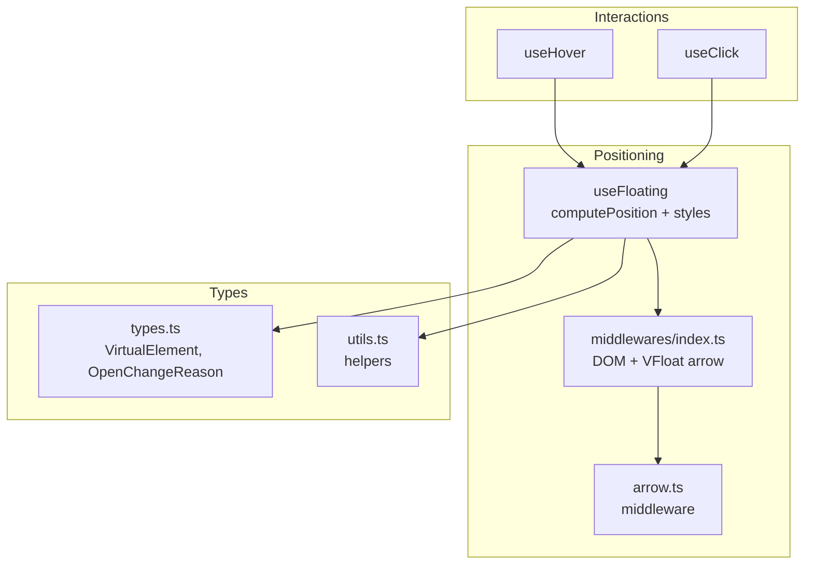
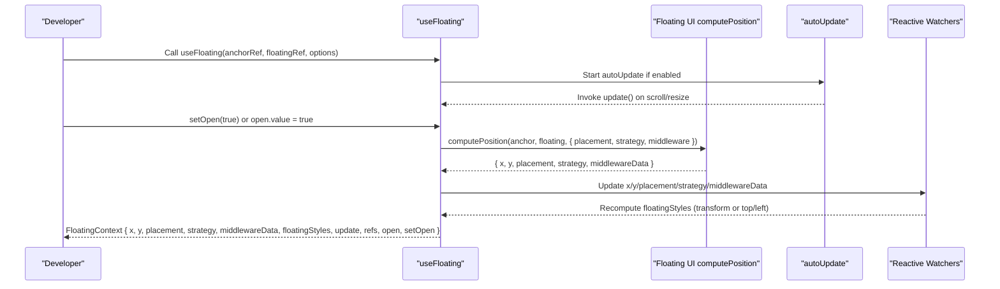
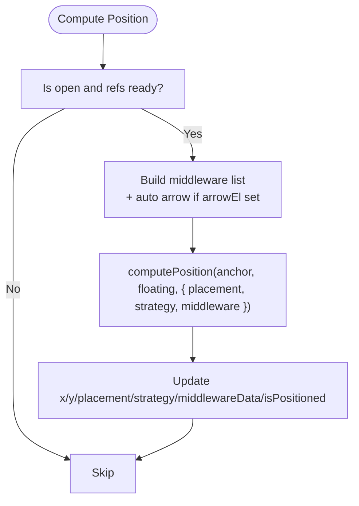
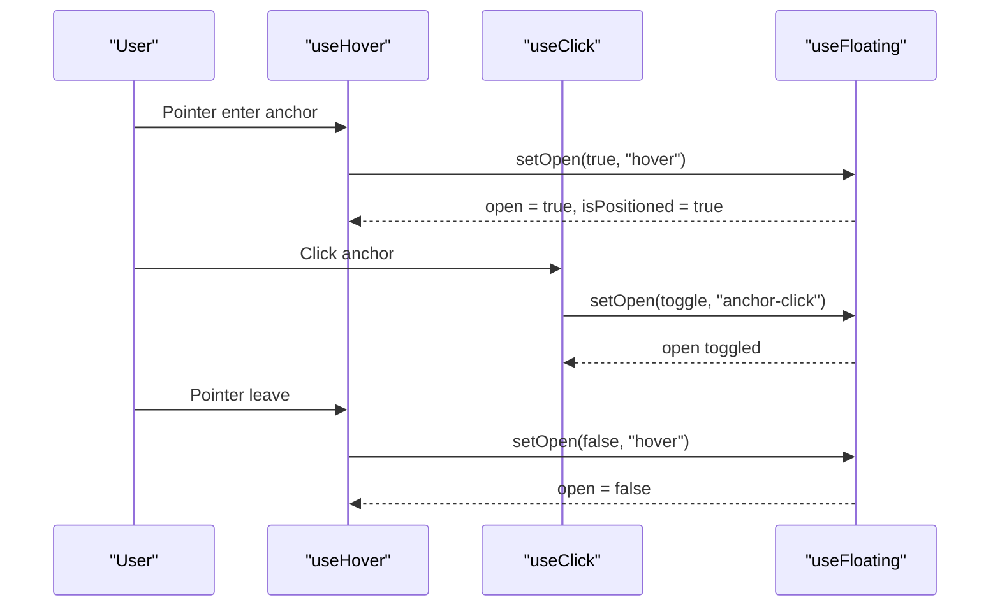
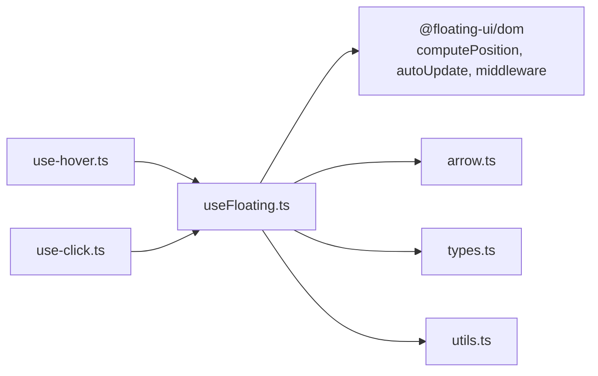

# useFloating Composable

<cite>
**Referenced Files in This Document**
- [use-floating.ts](file://src/composables/positioning/use-floating.ts)
- [index.ts](file://src/composables/positioning/index.ts)
- [middlewares/index.ts](file://src/composables/middlewares/index.ts)
- [arrow.ts](file://src/composables/middlewares/arrow.ts)
- [types.ts](file://src/types.ts)
- [use-hover.ts](file://src/composables/interactions/use-hover.ts)
- [use-click.ts](file://src/composables/interactions/use-click.ts)
- [utils.ts](file://src/utils.ts)
- [use-floating.md](file://docs/api/use-floating.md)
- [concepts.md](file://docs/guide/concepts.md)
- [interactions.md](file://docs/guide/interactions.md)
- [UseFloatingBasicUsage.vue](file://docs/demos/use-floating/UseFloatingBasicUsage.vue)
- [WithMiddleware.vue](file://docs/demos/use-floating/WithMiddleware.vue)
- [PlacementDemo.vue](file://docs/demos/use-floating/PlacementDemo.vue)
</cite>

## Table of Contents
1. [Introduction](#introduction)
2. [Project Structure](#project-structure)
3. [Core Components](#core-components)
4. [Architecture Overview](#architecture-overview)
5. [Detailed Component Analysis](#detailed-component-analysis)
6. [Dependency Analysis](#dependency-analysis)
7. [Performance Considerations](#performance-considerations)
8. [Troubleshooting Guide](#troubleshooting-guide)
9. [Conclusion](#conclusion)
10. [Appendices](#appendices)

## Introduction
The useFloating composable is the central orchestrator for positioning floating elements relative to anchor elements in VFloat. It integrates with Floating UI’s computePosition to calculate optimal placements, applies middleware transformations, and exposes a reactive FloatingContext that includes coordinates, styles, refs, open state, and update controls. It supports both transform-based and top/left positioning modes, device pixel ratio awareness, and automatic updates on scroll/resize. This document explains the API, internal mechanics, and integration patterns with interaction composables.

## Project Structure
The useFloating composable resides in the positioning layer and integrates with middleware and interaction composables. The middleware barrel re-exports Floating UI’s DOM primitives and VFloat’s arrow middleware. Interaction composables consume the FloatingContext to coordinate visibility and behavior.

**Diagram sources**
- [use-floating.ts:1-384](file://src/composables/positioning/use-floating.ts#L1-L384)
- [middlewares/index.ts:1-4](file://src/composables/middlewares/index.ts#L1-L4)
- [arrow.ts:1-51](file://src/composables/middlewares/arrow.ts#L1-L51)
- [use-hover.ts:1-351](file://src/composables/interactions/use-hover.ts#L1-L351)
- [use-click.ts:1-392](file://src/composables/interactions/use-click.ts#L1-L392)
- [types.ts:1-29](file://src/types.ts#L1-L29)
- [utils.ts:1-222](file://src/utils.ts#L1-L222)

**Section sources**
- [index.ts:1-4](file://src/composables/positioning/index.ts#L1-L4)
- [middlewares/index.ts:1-4](file://src/composables/middlewares/index.ts#L1-L4)

## Core Components
- useFloating: Computes position, manages reactive styles, open state, refs, and update lifecycle.
- FloatingContext: Exposes x/y, placement, strategy, middlewareData, isPositioned, floatingStyles, update, refs, open, and setOpen.
- Middleware integration: Base middleware array plus automatic arrow middleware injection when an arrow element is provided.
- Device pixel ratio awareness: Uses DPR-aware rounding and will-change hints for crisp rendering.

**Section sources**
- [use-floating.ts:196-362](file://src/composables/positioning/use-floating.ts#L196-L362)
- [use-floating.md:1-235](file://docs/api/use-floating.md#L1-L235)

## Architecture Overview
The composable coordinates three subsystems:
- Position computation: computePosition from Floating UI produces x/y, final placement, and middlewareData.
- Style emission: Watches x/y and transform flag to produce reactive FloatingStyles (top/left or transform translate).
- Lifecycle: autoUpdate tracks scroll/resize; open state gates updates; setOpen triggers callbacks.

**Diagram sources**
- [use-floating.ts:244-297](file://src/composables/positioning/use-floating.ts#L244-L297)
- [use-floating.ts:311-343](file://src/composables/positioning/use-floating.ts#L311-L343)

## Detailed Component Analysis

### useFloating API and Options
- Parameters
  - anchorEl: Ref to anchor element or VirtualElement
  - floatingEl: Ref to floating element
  - options: UseFloatingOptions
- Options
  - placement: MaybeRefOrGetter<Placement> (default bottom)
  - strategy: MaybeRefOrGetter<Strategy> (default absolute)
  - transform: MaybeRefOrGetter<boolean> (default true)
  - middlewares: MaybeRefOrGetter<Middleware[]>
  - autoUpdate: boolean | AutoUpdateOptions (default true)
  - open: Ref<boolean> (default false)
  - onOpenChange: callback with open, reason, event
- Return: FloatingContext

**Section sources**
- [use-floating.ts:65-106](file://src/composables/positioning/use-floating.ts#L65-L106)
- [use-floating.ts:196-200](file://src/composables/positioning/use-floating.ts#L196-L200)
- [use-floating.md:5-86](file://docs/api/use-floating.md#L5-L86)

### FloatingContext Object
- x, y: Readonly refs for computed coordinates
- placement, strategy: Readonly refs for final placement and strategy
- middlewareData: Readonly shallow ref for middleware-provided data
- isPositioned: Boolean indicating whether the element has been positioned
- floatingStyles: Reactive styles (position, top, left, transform, will-change)
- update: Manual recomputation trigger
- refs: anchorEl, floatingEl, arrowEl
- open: Reactive open state
- setOpen: Setter with reason and optional event

**Section sources**
- [use-floating.ts:111-170](file://src/composables/positioning/use-floating.ts#L111-L170)
- [use-floating.md:49-86](file://docs/api/use-floating.md#L49-L86)

### Positioning Algorithms and Middleware
- computePosition drives the core algorithm, selecting the best placement respecting boundaries and applying middleware transformations.
- Middleware pipeline:
  - Base middlewares from options
  - Automatic arrow middleware injection when arrowEl is set (deduplicated by name)
- Supported middleware via barrel export: offset, flip, shift, size, hide, autoPlacement, plus VFloat’s arrow.

**Diagram sources**
- [use-floating.ts:232-242](file://src/composables/positioning/use-floating.ts#L232-L242)
- [use-floating.ts:244-265](file://src/composables/positioning/use-floating.ts#L244-L265)

**Section sources**
- [use-floating.ts:232-242](file://src/composables/positioning/use-floating.ts#L232-L242)
- [middlewares/index.ts:1-4](file://src/composables/middlewares/index.ts#L1-L4)

### Collision Detection and Viewport Boundary Handling
- Floating UI’s built-in middleware (e.g., flip, shift) handle collision detection and viewport boundary adjustments.
- Example middleware combinations:
  - offset: Adds spacing
  - flip: Attempts alternative placements
  - shift: Slides along axes to stay in view
- The composable forwards these middlewares to computePosition and exposes middlewareData for consumers.

**Section sources**
- [use-floating.md:171-186](file://docs/api/use-floating.md#L171-L186)
- [WithMiddleware.vue:9-24](file://docs/demos/use-floating/WithMiddleware.vue#L9-L24)

### Automatic Update Mechanisms
- When open is true and refs are attached, autoUpdate starts a Floating UI observer to call update on scroll/resize.
- Cleanup occurs on watcher disposal and scope teardown.
- Programmatic update is available via the update method.

**Section sources**
- [use-floating.ts:275-297](file://src/composables/positioning/use-floating.ts#L275-L297)

### Transform vs Top/Left Positioning Modes
- transform=true (default): Uses CSS transform: translate(x,y) with DPR-aware rounding and will-change hints for crisp rendering on high-DPR displays.
- transform=false: Uses top/left properties with DPR-aware rounding.
- The composable watches the transform flag and recomputes styles accordingly.

**Section sources**
- [use-floating.ts:323-340](file://src/composables/positioning/use-floating.ts#L323-L340)
- [use-floating.ts:371-383](file://src/composables/positioning/use-floating.ts#L371-L383)

### Device Pixel Ratio Awareness
- Coordinates are rounded using a DPR-aware rounding function.
- will-change: transform is conditionally applied when DPR >= 1.5 to optimize compositing.

**Section sources**
- [use-floating.ts:323-333](file://src/composables/positioning/use-floating.ts#L323-L333)
- [use-floating.ts:371-383](file://src/composables/positioning/use-floating.ts#L371-L383)

### FloatingStyles Structure
- position: strategy value
- top, left: "0" initially; updated based on mode
- transform: present when transform mode is enabled
- will-change: transform when DPR threshold met
- Custom properties: --name values supported for advanced styling

**Section sources**
- [use-floating.ts:31-60](file://src/composables/positioning/use-floating.ts#L31-L60)
- [use-floating.md:101-112](file://docs/api/use-floating.md#L101-L112)

### Integration with Interaction Composables
- useHover: Opens on pointer enter with optional delay and rest detection; can use safe polygon to keep the floating element open while traversing the triangle region between anchor and floating.
- useClick: Toggles open state on anchor click; supports outside click detection and drag event handling.
- Both composables accept FloatingContext and coordinate via setOpen and open state.

**Diagram sources**
- [use-hover.ts:141-350](file://src/composables/interactions/use-hover.ts#L141-L350)
- [use-click.ts:51-304](file://src/composables/interactions/use-click.ts#L51-L304)
- [use-floating.ts:209-214](file://src/composables/positioning/use-floating.ts#L209-L214)

**Section sources**
- [interactions.md:35-66](file://docs/guide/interactions.md#L35-L66)
- [use-hover.ts:141-350](file://src/composables/interactions/use-hover.ts#L141-L350)
- [use-click.ts:51-304](file://src/composables/interactions/use-click.ts#L51-L304)

### Practical Examples and Patterns
- Basic usage: Apply floatingStyles to the floating element and provide anchor/floating refs.
- With placement: Use reactive placement and call update when changing it.
- With middleware: Combine offset, flip, and shift; arrow middleware is injected automatically when arrowEl is set.
- Interaction patterns: Compose useHover, useClick, useFocus, and useEscapeKey with a shared FloatingContext.

**Section sources**
- [UseFloatingBasicUsage.vue:1-39](file://docs/demos/use-floating/UseFloatingBasicUsage.vue#L1-L39)
- [PlacementDemo.vue:1-170](file://docs/demos/use-floating/PlacementDemo.vue#L1-L170)
- [WithMiddleware.vue:1-55](file://docs/demos/use-floating/WithMiddleware.vue#L1-L55)
- [use-floating.md:136-227](file://docs/api/use-floating.md#L136-L227)

## Dependency Analysis
- Internal dependencies
  - Floating UI DOM: computePosition, autoUpdate, middleware types
  - VFloat arrow middleware: injected automatically when arrowEl is present
  - Vue reactivity: refs, computed, watch, shallowRef
- External dependencies
  - @floating-ui/dom: core positioning and middleware
  - Vue: reactivity primitives

**Diagram sources**
- [use-floating.ts:1-12](file://src/composables/positioning/use-floating.ts#L1-L12)
- [arrow.ts:1-3](file://src/composables/middlewares/arrow.ts#L1-L3)
- [types.ts:1-29](file://src/types.ts#L1-L29)
- [utils.ts:1-222](file://src/utils.ts#L1-L222)
- [use-hover.ts:1-11](file://src/composables/interactions/use-hover.ts#L1-L11)
- [use-click.ts:1-13](file://src/composables/interactions/use-click.ts#L1-L13)

**Section sources**
- [use-floating.ts:1-12](file://src/composables/positioning/use-floating.ts#L1-L12)
- [middlewares/index.ts:1-4](file://src/composables/middlewares/index.ts#L1-L4)

## Performance Considerations
- Prefer transform-based positioning (default) for smoother animations and better GPU acceleration.
- Use autoUpdate judiciously; disable for static layouts to reduce observers.
- Limit middleware count to what is necessary; each middleware adds computation overhead.
- Use DPR-aware rounding to avoid blurry text on high-DPR screens.
- Avoid unnecessary watchers by passing refs instead of raw values where possible.

## Troubleshooting Guide
- Floating element not visible
  - Ensure open is true and refs are attached before computing position.
  - Verify autoUpdate is enabled if you expect updates on scroll/resize.
- Styles not applied
  - Confirm floatingStyles is bound to the floating element’s style attribute.
  - Check transform flag and ensure the element supports transforms.
- Arrow not positioned
  - Provide arrowEl and ensure it is attached; arrow middleware is injected automatically when missing.
- Unexpected collisions or clipping
  - Add or tune middleware like flip and shift; adjust offset padding.
- Stutter or blur on high-DPR displays
  - Keep transform mode enabled; ensure DPR-aware rounding is active.

**Section sources**
- [use-floating.ts:244-265](file://src/composables/positioning/use-floating.ts#L244-L265)
- [use-floating.ts:323-340](file://src/composables/positioning/use-floating.ts#L323-L340)
- [arrow.ts:36-50](file://src/composables/middlewares/arrow.ts#L36-L50)

## Conclusion
useFloating is the backbone of VFloat’s positioning system. It encapsulates Floating UI’s computePosition, manages reactive styles and state, and integrates seamlessly with interaction composables. By understanding its API, middleware pipeline, and integration patterns, you can build responsive, accessible, and performant floating UI components.

## Appendices

### API Reference Summary
- useFloating(anchorEl, floatingEl, options?): FloatingContext
- Options: placement, strategy, transform, middlewares, autoUpdate, open, onOpenChange
- FloatingContext: x, y, placement, strategy, middlewareData, isPositioned, floatingStyles, update, refs, open, setOpen

**Section sources**
- [use-floating.md:5-86](file://docs/api/use-floating.md#L5-L86)
- [use-floating.ts:65-170](file://src/composables/positioning/use-floating.ts#L65-L170)