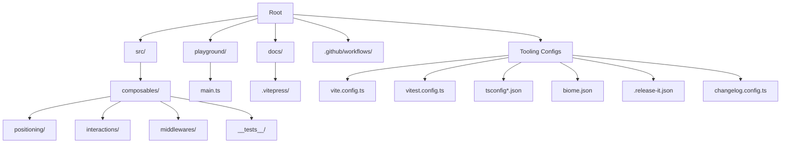
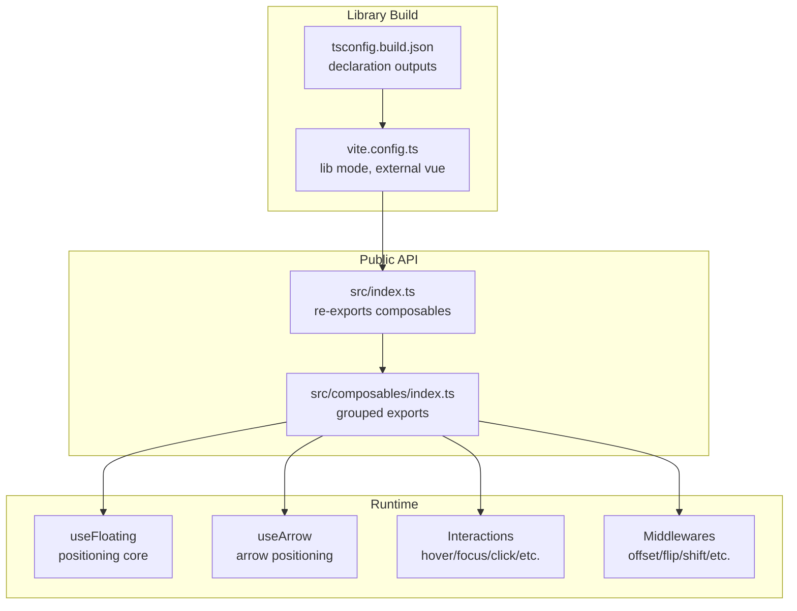
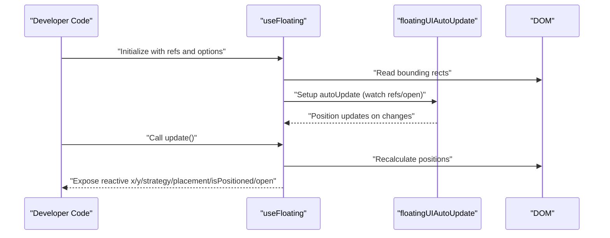
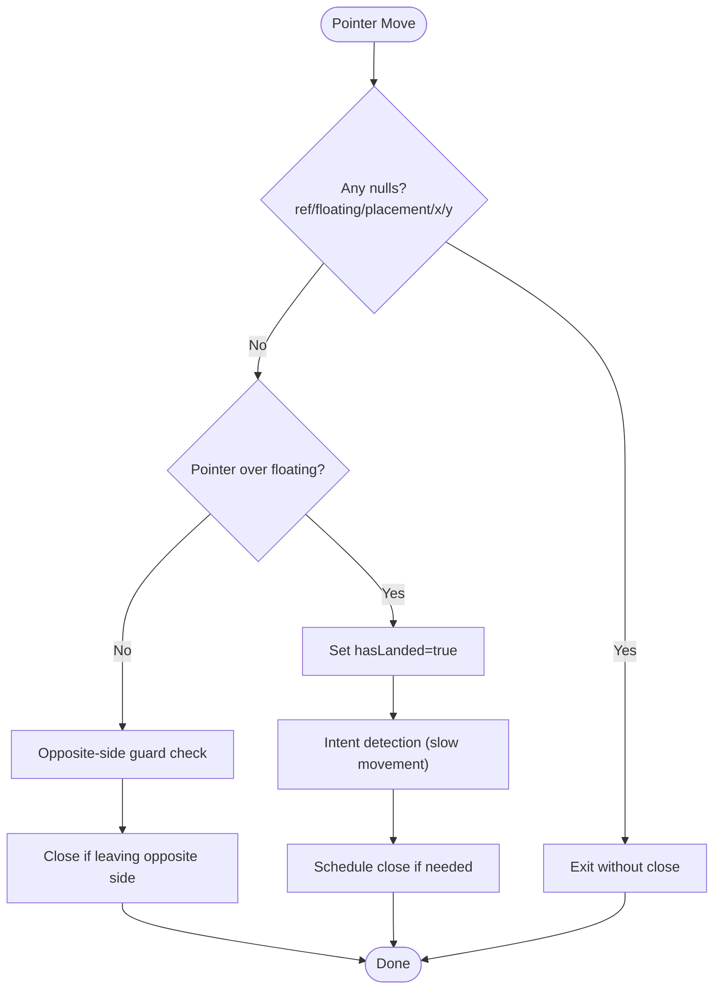
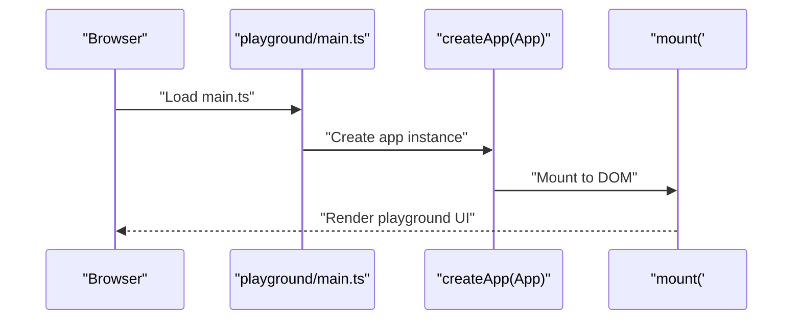
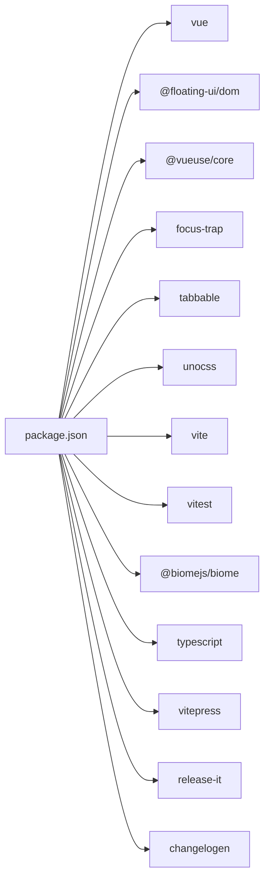
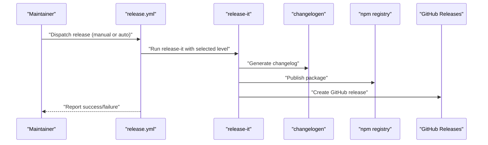
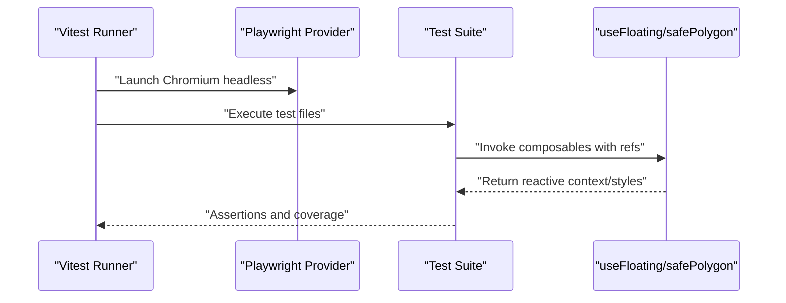

# Development Guide

<cite>
**Referenced Files in This Document**
- [package.json](file://package.json)
- [README.md](file://README.md)
- [biome.json](file://biome.json)
- [vite.config.ts](file://vite.config.ts)
- [vitest.config.ts](file://vitest.config.ts)
- [tsconfig.json](file://tsconfig.json)
- [tsconfig.app.json](file://tsconfig.app.json)
- [tsconfig.vitest.json](file://tsconfig.vitest.json)
- [.github/workflows/release.yml](file://.github/workflows/release.yml)
- [.release-it.json](file://.release-it.json)
- [changelog.config.ts](file://changelog.config.ts)
- [openspec/project.md](file://openspec/project.md)
- [openspec/AGENTS.md](file://openspec/AGENTS.md)
- [src/index.ts](file://src/index.ts)
- [src/composables/index.ts](file://src/composables/index.ts)
- [src/composables/positioning/use-floating.ts](file://src/composables/positioning/use-floating.ts)
- [src/composables/interactions/polygon.ts](file://src/composables/interactions/polygon.ts)
- [src/composables/__tests__/use-floating.test.ts](file://src/composables/__tests__/use-floating.test.ts)
- [src/composables/__tests__/safe-polygon.test.ts](file://src/composables/__tests__/safe-polygon.test.ts)
- [src/composables/__tests__/use-client-point.test.ts](file://src/composables/__tests__/use-client-point.test.ts)
- [src/composables/__tests__/use-hover.test.ts](file://src/composables/__tests__/use-hover.test.ts)
- [src/composables/__tests__/use-focus.test.ts](file://src/composables/__tests__/use-focus.test.ts)
- [src/composables/__tests__/use-click.test.ts](file://src/composables/__tests__/use-click.test.ts)
- [src/utils.ts](file://src/utils.ts)
- [playground/main.ts](file://playground/main.ts)
- [env.d.ts](file://env.d.ts)
</cite>

## Update Summary
**Changes Made**
- Enhanced testing infrastructure documentation to reflect Set-based cleanup mechanisms
- Added documentation for centralized element tracking with trackElement helper function
- Updated timer handling documentation with explicit timer management patterns
- Improved standardized import patterns documentation for better resource management
- Added comprehensive testing utilities documentation including cleanup strategies

## Table of Contents
1. [Introduction](#introduction)
2. [Project Structure](#project-structure)
3. [Core Components](#core-components)
4. [Architecture Overview](#architecture-overview)
5. [Detailed Component Analysis](#detailed-component-analysis)
6. [Dependency Analysis](#dependency-analysis)
7. [Performance Considerations](#performance-considerations)
8. [Troubleshooting Guide](#troubleshooting-guide)
9. [Contribution Guidelines](#contribution-guidelines)
10. [Release Process and Version Management](#release-process-and-version-management)
11. [Continuous Integration Workflows](#continuous-integration-workflows)
12. [Development Environment Setup](#development-environment-setup)
13. [Testing Strategy](#testing-strategy)
14. [Coding Standards and TypeScript Configuration](#coding-standards-and-typescript-configuration)
15. [Debugging and Profiling](#debugging-and-profiling)
16. [Conclusion](#conclusion)

## Introduction
This development guide provides a comprehensive overview of the V-Float project's contribution guidelines, development setup, testing strategy, release process, and maintenance procedures. It explains how to configure the development environment, adhere to coding standards enforced by Biome, leverage TypeScript configurations, run and extend tests with Vitest and browser testing, and participate in the project's governance and CI/CD workflows.

## Project Structure
The repository follows a modular structure centered around a Vue 3 library that exposes composables for floating UI positioning and interactions. Key areas:
- Library source code under src/, organized by composables (positioning, interactions, middlewares).
- Tests under src/composables/__tests__/ with enhanced cleanup infrastructure.
- Playground for interactive demos under playground/.
- Documentation site powered by VitePress under docs/.
- Tooling configurations for building, linting, testing, and releasing.

**Diagram sources**
- [src/index.ts](file://src/index.ts)
- [src/composables/index.ts](file://src/composables/index.ts)
- [playground/main.ts](file://playground/main.ts)
- [vite.config.ts](file://vite.config.ts)
- [vitest.config.ts](file://vitest.config.ts)
- [tsconfig.json](file://tsconfig.json)
- [biome.json](file://biome.json)
- [.release-it.json](file://.release-it.json)
- [changelog.config.ts](file://changelog.config.ts)

**Section sources**
- [src/index.ts](file://src/index.ts)
- [src/composables/index.ts](file://src/composables/index.ts)
- [openspec/project.md](file://openspec/project.md)

## Core Components
- Library entry points export composables grouped by domain:
  - Positioning composables (e.g., useFloating, useArrow, use-client-point).
  - Interaction composables (e.g., useHover, useFocus, useClick, useEscapeKey, useListNavigation).
  - Middleware helpers (e.g., offset, flip, shift, hide, autoPlacement, size).
- Public API is re-exported via barrel exports for easy consumption.

**Section sources**
- [src/index.ts](file://src/index.ts)
- [src/composables/index.ts](file://src/composables/index.ts)
- [README.md](file://README.md)

## Architecture Overview
The library integrates Vue 3 Composition API with @floating-ui/dom for precise positioning and collision-aware behavior. Interactions are encapsulated in composable functions that manage reactive state, element references, middleware application, and lifecycle cleanup. The build system produces both ESM and UMD bundles with TypeScript declaration files.

**Diagram sources**
- [vite.config.ts](file://vite.config.ts)
- [tsconfig.json](file://tsconfig.json)
- [src/index.ts](file://src/index.ts)
- [src/composables/index.ts](file://src/composables/index.ts)

**Section sources**
- [vite.config.ts](file://vite.config.ts)
- [tsconfig.json](file://tsconfig.json)
- [src/index.ts](file://src/index.ts)
- [src/composables/index.ts](file://src/composables/index.ts)

## Detailed Component Analysis

### Positioning Core: useFloating
The core positioning composable orchestrates:
- Reactive references to anchor and floating elements.
- Placement, strategy, and middleware pipeline.
- Auto-update lifecycle and manual update triggers.
- Floating styles generation and transform handling.
- Open state management and cleanup.

**Diagram sources**
- [src/composables/positioning/use-floating.ts](file://src/composables/positioning/use-floating.ts)

**Section sources**
- [src/composables/positioning/use-floating.ts](file://src/composables/positioning/use-floating.ts)
- [src/composables/__tests__/use-floating.test.ts](file://src/composables/__tests__/use-floating.test.ts)

### Safe Polygon Interaction: safePolygon
The safe polygon interaction computes a polygonal "safe zone" around a floating element to prevent accidental closes when the pointer leaves the reference area. It supports:
- Guard clauses for null elements/placement.
- Opposite-side guard logic based on placement.
- Intent detection with configurable timing thresholds.
- Buffer adjustments and polygon callbacks.

**Diagram sources**
- [src/composables/interactions/polygon.ts](file://src/composables/interactions/polygon.ts)

**Section sources**
- [src/composables/interactions/polygon.ts](file://src/composables/interactions/polygon.ts)
- [src/composables/__tests__/safe-polygon.test.ts](file://src/composables/__tests__/safe-polygon.test.ts)

### Playground Application
The playground mounts a Vue app and demonstrates various floating UI patterns. It uses UnoCSS for styling and Vue Devtools integration for inspection.

**Diagram sources**
- [playground/main.ts](file://playground/main.ts)

**Section sources**
- [playground/main.ts](file://playground/main.ts)

## Dependency Analysis
External runtime dependencies include Vue 3, @floating-ui/dom, @vueuse/core, focus-trap, tabbable, and UnoCSS. Development dependencies cover Vite, Vitest with browser runner, TypeScript tooling, Biome, release-it, and changelog generation.

**Diagram sources**
- [package.json](file://package.json)

**Section sources**
- [package.json](file://package.json)

## Performance Considerations
- Prefer ESM builds for tree-shaking and smaller bundles.
- Use transform option judiciously; enabling transforms introduces layout recalculations.
- Avoid unnecessary reactive updates by passing stable refs and minimizing middleware churn.
- Keep middleware lists concise; each middleware adds computational overhead.
- Leverage autoUpdate only when needed; disable for static layouts.

## Troubleshooting Guide
Common issues and remedies:
- Tests fail due to missing DOM mocks: ensure jsdom and JSDOM types are installed and configured in Vitest tsconfig.
- Browser tests not launching: verify Playwright installation and provider configuration in vitest.config.ts.
- Type errors after changes: run type-check and fix TS errors; ensure path aliases match tsconfig paths.
- Coverage thresholds failing: improve targeted tests for uncovered files and increase coverage gradually.
- CI release failures: inspect workflow logs for lint/build/test steps; ensure credentials and tags are correct.

**Section sources**
- [vitest.config.ts](file://vitest.config.ts)
- [tsconfig.vitest.json](file://tsconfig.vitest.json)
- [.github/workflows/release.yml](file://.github/workflows/release.yml)

## Contribution Guidelines
- Use conventional commits and keep a clean, linear history.
- Create focused feature branches and open Pull Requests for review.
- Follow project conventions:
  - ESM-only module format.
  - Path alias @ for src/.
  - Barrel exports via index.ts files.
  - Component filenames in kebab-case.
- Write unit tests alongside implementation under src/composables/__tests__/.

**Section sources**
- [openspec/project.md](file://openspec/project.md)
- [README.md](file://README.md)

## Release Process and Version Management
- Versioning follows Semantic Versioning; the project is currently WIP and may include breaking changes without deprecation.
- Release-it automates tagging, changelog generation, npm publishing, and GitHub releases.
- Changelogen generates CHANGELOG.md entries based on commit messages and templates.
- Manual release triggers are supported via GitHub Actions workflow inputs; automatic detection occurs on main branch pushes.

**Diagram sources**
- [.github/workflows/release.yml](file://.github/workflows/release.yml)
- [.release-it.json](file://.release-it.json)
- [changelog.config.ts](file://changelog.config.ts)

**Section sources**
- [.release-it.json](file://.release-it.json)
- [changelog.config.ts](file://changelog.config.ts)
- [.github/workflows/release.yml](file://.github/workflows/release.yml)

## Continuous Integration Workflows
- The release workflow runs on pushes to main and manual dispatches.
- It installs dependencies, runs type checks, builds the package, and executes release-it with optional dry-run.
- On failure, it creates an issue labeled bug and ci/cd for quick triage.

**Section sources**
- [.github/workflows/release.yml](file://.github/workflows/release.yml)

## Development Environment Setup
- Node.js version is pinned to 22 in CI; use the same LTS version locally for consistency.
- Preferred package manager is npm (as declared in package.json); pnpm/yarn are also supported by the ecosystem.
- Install dependencies with npm ci to ensure deterministic installs.
- Start the dev server with npm run dev; preview with npm run preview.
- Build the library with npm run build; type-check with npm run type-check.
- Lint and format with npm run lint using Biome.
- Run tests with npm run test; browser tests are enabled via Playwright.

**Section sources**
- [.github/workflows/release.yml](file://.github/workflows/release.yml)
- [package.json](file://package.json)

## Testing Strategy

### Enhanced Testing Infrastructure
The project has implemented comprehensive testing infrastructure improvements focusing on resource management and test reliability:

**Set-based Cleanup Mechanisms**
- Centralized tracking using Set collections for active test contexts
- Automatic cleanup registration at context creation time
- Reliable cleanup verification with Set.clear() operations
- Prevents memory leaks and ensures test isolation

**Centralized Element Tracking**
- Standardized trackElement helper function for DOM element cleanup
- Consistent element tracking across all test suites
- Automated cleanup through elementsToCleanUp arrays
- Improved resource management with proper DOM detachment

**Explicit Timer Handling**
- vi.useFakeTimers() integration for deterministic timing control
- vi.advanceTimersByTime() for precise timeout simulation
- vi.runAllTimers() for complete timeout execution
- vi.clearAllMocks() for comprehensive cleanup
- Proper timer cleanup in afterEach hooks

**Standardized Import Patterns**
- Consistent import statements using @ alias for src/
- Centralized utility imports for shared test helpers
- Standardized mock setup patterns across test files
- Improved code organization and maintainability

### Test Organization and Patterns
- Unit tests are colocated with implementation under src/composables/__tests__/.
- Vitest is configured with:
  - Browser runner using Playwright (Chromium headless).
  - Coverage via v8 with thresholds and exclusions.
  - Aliases aligned with src/ for imports.
- Component testing patterns:
  - Use refs for anchor and floating elements.
  - Mock getBoundingClientRect for deterministic tests.
  - Assert reactive state transitions and middleware effects.
  - Exercise guard clauses, intent detection, and timer scheduling.

**Diagram sources**
- [vitest.config.ts](file://vitest.config.ts)
- [src/composables/__tests__/use-floating.test.ts](file://src/composables/__tests__/use-floating.test.ts)
- [src/composables/__tests__/safe-polygon.test.ts](file://src/composables/__tests__/safe-polygon.test.ts)

**Section sources**
- [vitest.config.ts](file://vitest.config.ts)
- [src/composables/__tests__/use-floating.test.ts](file://src/composables/__tests__/use-floating.test.ts)
- [src/composables/__tests__/safe-polygon.test.ts](file://src/composables/__tests__/safe-polygon.test.ts)
- [src/composables/__tests__/use-client-point.test.ts](file://src/composables/__tests__/use-client-point.test.ts)
- [src/composables/__tests__/use-hover.test.ts](file://src/composables/__tests__/use-hover.test.ts)
- [src/composables/__tests__/use-focus.test.ts](file://src/composables/__tests__/use-focus.test.ts)
- [src/composables/__tests__/use-click.test.ts](file://src/composables/__tests__/use-click.test.ts)

## Coding Standards and TypeScript Configuration
- Biome enforces:
  - Recommended ruleset with correctness and suspicious categories.
  - Formatter settings for indentation, line width, and quote style.
  - Overrides for Vue files to align with template constraints.
- TypeScript configuration:
  - Root tsconfig.json references multiple tsconfig.*.json files.
  - tsconfig.app.json extends Vue's DOM tsconfig and includes src, playground, and docs.
  - tsconfig.vitest.json enables jsdom and node types for test environments.
  - Path aliases @/* mapped to src/ in both app and test configs.

**Section sources**
- [biome.json](file://biome.json)
- [tsconfig.json](file://tsconfig.json)
- [tsconfig.app.json](file://tsconfig.app.json)
- [tsconfig.vitest.json](file://tsconfig.vitest.json)
- [env.d.ts](file://env.d.ts)

## Debugging and Profiling
- Use Vue Devtools integration (vite-plugin-vue-devtools) for component inspection and reactive state tracing.
- Enable silent logging for passed tests in Vitest to reduce noise; adjust verbosity as needed.
- For browser tests, run in headless mode by default; switch to headed mode locally if needed for visual debugging.
- Leverage Vitest's coverage reports to identify untested code paths and optimize tests.

**Section sources**
- [vite.config.ts](file://vite.config.ts)
- [vitest.config.ts](file://vitest.config.ts)

## Conclusion
This guide consolidates the essential practices for developing, testing, releasing, and maintaining V-Float. By following the setup instructions, adhering to Biome and TypeScript standards, writing comprehensive unit and browser tests with enhanced cleanup infrastructure, and participating in the documented governance and CI/CD processes, contributors can efficiently collaborate and deliver high-quality updates to the library.

The enhanced testing infrastructure improvements ensure better resource management, improved test stability, and more reliable test execution through:
- Set-based cleanup mechanisms for automatic resource management
- Centralized element tracking with consistent cleanup patterns
- Explicit timer handling for deterministic timing control
- Standardized import patterns for better code organization
- Comprehensive cleanup strategies in afterEach hooks

These improvements collectively contribute to a more robust and maintainable testing framework that supports the project's development goals.