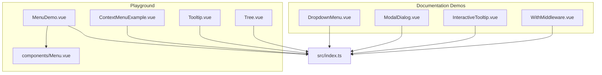
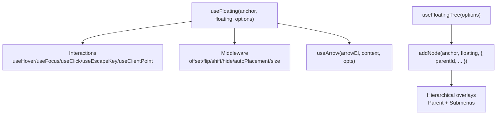
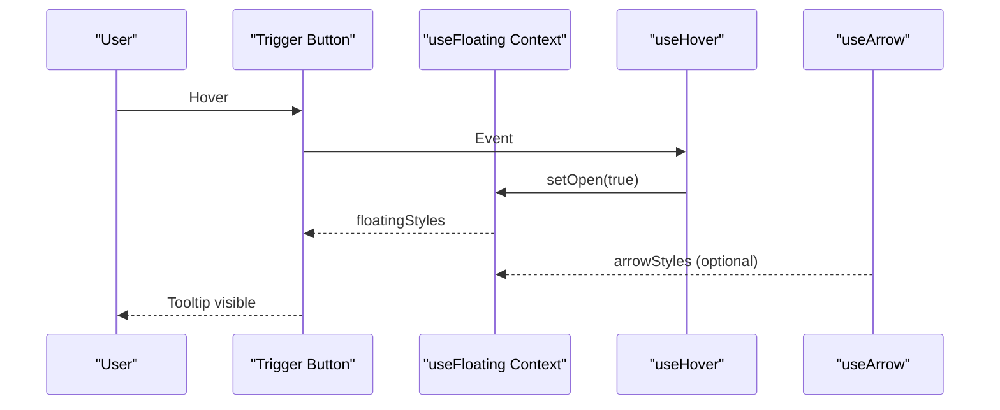
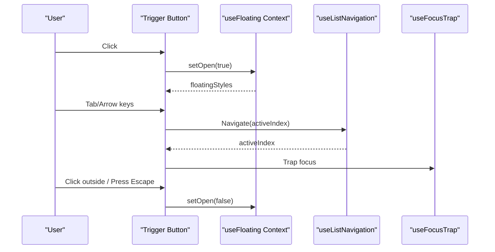
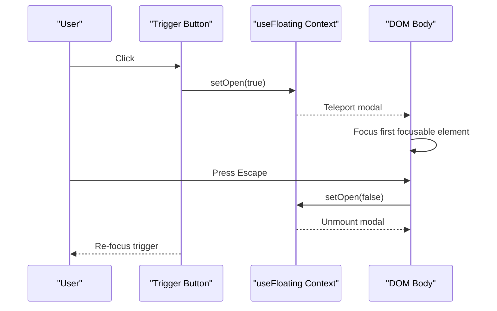
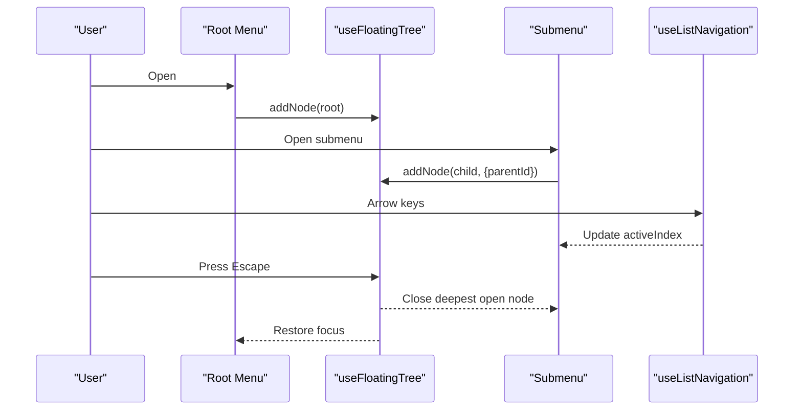
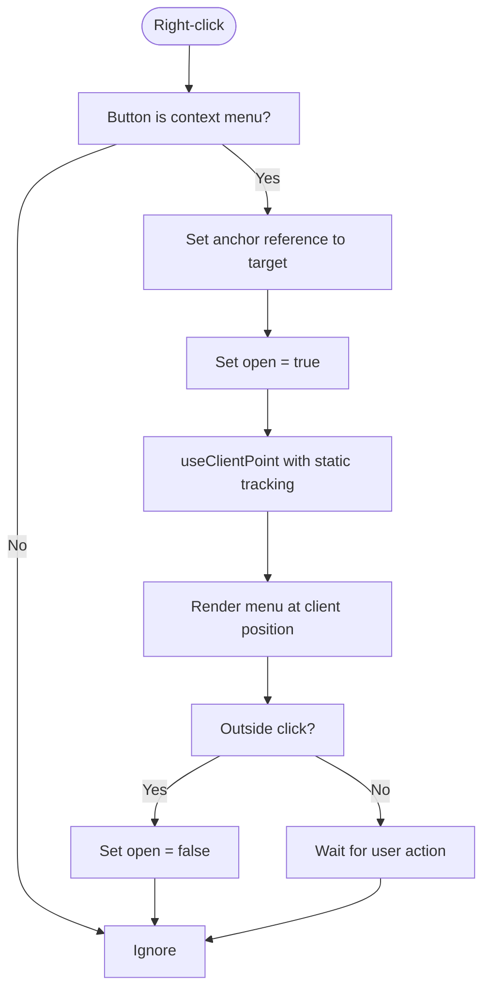
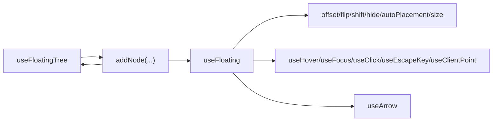

# Examples & Showcase

<cite>
**Referenced Files in This Document**
- [README.md](file://README.md)
- [src/index.ts](file://src/index.ts)
- [docs/demos/use-floating/index.ts](file://docs/demos/use-floating/index.ts)
- [docs/demos/use-floating/DropdownMenu.vue](file://docs/demos/use-floating/DropdownMenu.vue)
- [docs/demos/use-floating/ModalDialog.vue](file://docs/demos/use-floating/ModalDialog.vue)
- [docs/demos/use-floating/InteractiveTooltip.vue](file://docs/demos/use-floating/InteractiveTooltip.vue)
- [docs/demos/use-floating/WithMiddleware.vue](file://docs/demos/use-floating/WithMiddleware.vue)
- [playground/App.vue](file://playground/App.vue)
- [playground/main.ts](file://playground/main.ts)
- [playground/demo/MenuDemo.vue](file://playground/demo/MenuDemo.vue)
- [playground/components/Menu.vue](file://playground/components/Menu.vue)
- [playground/demo/ContextMenuExample.vue](file://playground/demo/ContextMenuExample.vue)
- [playground/demo/Tooltip.vue](file://playground/demo/Tooltip.vue)
- [playground/demo/Tree.vue](file://playground/demo/Tree.vue)
</cite>

## Table of Contents
1. [Introduction](#introduction)
2. [Project Structure](#project-structure)
3. [Core Components](#core-components)
4. [Architecture Overview](#architecture-overview)
5. [Detailed Component Analysis](#detailed-component-analysis)
6. [Dependency Analysis](#dependency-analysis)
7. [Performance Considerations](#performance-considerations)
8. [Troubleshooting Guide](#troubleshooting-guide)
9. [Conclusion](#conclusion)
10. [Appendices](#appendices)

## Introduction
This document presents practical examples and showcases for building floating UI components with VFloat. It covers basic component patterns (tooltips, dropdowns, modals, popovers), advanced scenarios (complex menus, custom positioning, middleware combinations), and interactive playground demonstrations. Real-world use cases such as context menus, notifications, and form controls are explained with guidance on styling, accessibility, and performance.

## Project Structure
The repository is organized into:
- Core composables and utilities under src/composables
- Documentation demos under docs/demos
- Playground examples under playground

**Diagram sources**
- [docs/demos/use-floating/DropdownMenu.vue:1-194](file://docs/demos/use-floating/DropdownMenu.vue#L1-L194)
- [docs/demos/use-floating/ModalDialog.vue:1-252](file://docs/demos/use-floating/ModalDialog.vue#L1-L252)
- [docs/demos/use-floating/InteractiveTooltip.vue:1-97](file://docs/demos/use-floating/InteractiveTooltip.vue#L1-L97)
- [docs/demos/use-floating/WithMiddleware.vue:1-55](file://docs/demos/use-floating/WithMiddleware.vue#L1-L55)
- [playground/demo/MenuDemo.vue:1-321](file://playground/demo/MenuDemo.vue#L1-L321)
- [playground/components/Menu.vue:1-53](file://playground/components/Menu.vue#L1-L53)
- [playground/demo/ContextMenuExample.vue:1-177](file://playground/demo/ContextMenuExample.vue#L1-L177)
- [playground/demo/Tooltip.vue:1-30](file://playground/demo/Tooltip.vue#L1-L30)
- [playground/demo/Tree.vue:1-31](file://playground/demo/Tree.vue#L1-L31)
- [src/index.ts:1-2](file://src/index.ts#L1-L2)

**Section sources**
- [src/index.ts:1-2](file://src/index.ts#L1-L2)
- [docs/demos/use-floating/index.ts:1-9](file://docs/demos/use-floating/index.ts#L1-L9)
- [playground/App.vue:1-20](file://playground/App.vue#L1-L20)
- [playground/main.ts:1-8](file://playground/main.ts#L1-L8)

## Core Components
VFloat exposes a cohesive set of composables for positioning and interactions:
- Positioning: useFloating, useArrow, useFloatingTree
- Interactions: useHover, useFocus, useClick, useEscapeKey, useClientPoint
- Middleware: offset, flip, shift, hide, autoPlacement, size

These are exported from the package entry and used across demos and playground examples.

**Section sources**
- [README.md:154-181](file://README.md#L154-L181)
- [src/index.ts:1-2](file://src/index.ts#L1-L2)

## Architecture Overview
The examples demonstrate two primary patterns:
- Isolated floating elements: useFloating with optional interactions and middleware
- Hierarchical floating trees: useFloatingTree to manage parent-child menus and nested overlays

**Diagram sources**
- [README.md:154-181](file://README.md#L154-L181)
- [README.md:191-316](file://README.md#L191-L316)

## Detailed Component Analysis

### Basic Tooltip
A simple tooltip anchored to a trigger element, using hover interactions and optional arrow positioning.

Implementation highlights:
- useFloating with placement and middlewares
- useHover for open/close behavior
- Optional useArrow for directional arrow

**Diagram sources**
- [docs/demos/use-floating/InteractiveTooltip.vue:1-97](file://docs/demos/use-floating/InteractiveTooltip.vue#L1-L97)
- [README.md:36-61](file://README.md#L36-L61)

**Section sources**
- [docs/demos/use-floating/InteractiveTooltip.vue:1-97](file://docs/demos/use-floating/InteractiveTooltip.vue#L1-L97)
- [README.md:36-61](file://README.md#L36-L61)

### Dropdown Menu
A keyboard-accessible dropdown with list navigation, focus trap, and outside click handling.

Key behaviors:
- useFloating with flip and shift for collision handling
- useListNavigation for arrow-key navigation
- useFocusTrap to constrain focus inside the menu
- Outside click and Escape handling

**Diagram sources**
- [docs/demos/use-floating/DropdownMenu.vue:1-194](file://docs/demos/use-floating/DropdownMenu.vue#L1-L194)

**Section sources**
- [docs/demos/use-floating/DropdownMenu.vue:1-194](file://docs/demos/use-floating/DropdownMenu.vue#L1-L194)

### Modal Dialog
A modal dialog using fixed strategy and focus management with Teleport to body.

Highlights:
- useFloating with strategy fixed and transform disabled
- Focus management via watcher and focus traps
- Backdrop click and Escape handling

**Diagram sources**
- [docs/demos/use-floating/ModalDialog.vue:1-252](file://docs/demos/use-floating/ModalDialog.vue#L1-L252)

**Section sources**
- [docs/demos/use-floating/ModalDialog.vue:1-252](file://docs/demos/use-floating/ModalDialog.vue#L1-L252)

### Popover (Simple)
A popover anchored to a trigger, controlled by hover/focus interactions.

Implementation pattern:
- useFloating with placement and middlewares
- useHover and useFocus for open/close
- Conditional rendering based on open state

**Section sources**
- [docs/demos/use-floating/InteractiveTooltip.vue:1-97](file://docs/demos/use-floating/InteractiveTooltip.vue#L1-L97)
- [README.md:36-61](file://README.md#L36-L61)

### Advanced: Complex Menu Systems with Floating Tree
Hierarchical menus using useFloatingTree to manage parent and submenu nodes.

Highlights:
- useFloatingTree creates root node and manages children
- addNode associates triggers and floating elements with parent/child relationships
- useEscapeKey closes the deepest open node and restores focus
- useClick handles outside clicks

**Diagram sources**
- [README.md:191-316](file://README.md#L191-L316)
- [playground/components/Menu.vue:1-53](file://playground/components/Menu.vue#L1-L53)
- [playground/demo/MenuDemo.vue:1-321](file://playground/demo/MenuDemo.vue#L1-L321)

**Section sources**
- [README.md:191-316](file://README.md#L191-L316)
- [playground/components/Menu.vue:1-53](file://playground/components/Menu.vue#L1-L53)
- [playground/demo/MenuDemo.vue:1-321](file://playground/demo/MenuDemo.vue#L1-L321)

### Custom Positioning Logic: Client Point
Positioning floating elements at cursor/touch coordinates with static tracking mode.

Key points:
- useClientPoint with trackingMode "static" pins the overlay to the initial click position
- useClick with outsideClick enables dismissal
- flip and shift for viewport boundary handling

**Diagram sources**
- [playground/demo/ContextMenuExample.vue:1-177](file://playground/demo/ContextMenuExample.vue#L1-L177)

**Section sources**
- [playground/demo/ContextMenuExample.vue:1-177](file://playground/demo/ContextMenuExample.vue#L1-L177)

### Middleware Combinations
Combining offset, flip, and shift to achieve robust positioning.

Patterns:
- offset adds spacing
- flip chooses alternative placements when space is insufficient
- shift keeps the element in view by sliding along axes
- useArrow integrates arrow alignment with middleware chain

**Section sources**
- [docs/demos/use-floating/WithMiddleware.vue:1-55](file://docs/demos/use-floating/WithMiddleware.vue#L1-L55)
- [README.md:170-181](file://README.md#L170-L181)

### Interactive Playground Components
The playground showcases reusable components and focused demos:
- MenuDemo: A full-featured account menu with nested submenus
- Menu: A wrapper that sets up useFloatingTree and provides context to children
- ContextMenuExample: Right-click context menu with static positioning
- Tooltip: Minimal tooltip component using useFloating and useHover
- Tree: Demonstrates the new useFloatingTree addNode API

**Section sources**
- [playground/demo/MenuDemo.vue:1-321](file://playground/demo/MenuDemo.vue#L1-L321)
- [playground/components/Menu.vue:1-53](file://playground/components/Menu.vue#L1-L53)
- [playground/demo/ContextMenuExample.vue:1-177](file://playground/demo/ContextMenuExample.vue#L1-L177)
- [playground/demo/Tooltip.vue:1-30](file://playground/demo/Tooltip.vue#L1-L30)
- [playground/demo/Tree.vue:1-31](file://playground/demo/Tree.vue#L1-L31)

## Dependency Analysis
The examples illustrate how composables depend on each other and on middleware:

**Diagram sources**
- [README.md:154-181](file://README.md#L154-L181)
- [README.md:191-316](file://README.md#L191-L316)

**Section sources**
- [README.md:154-181](file://README.md#L154-L181)
- [README.md:191-316](file://README.md#L191-L316)

## Performance Considerations
- Prefer middleware combinations that minimize re-layouts (e.g., avoid excessive flip/shift toggling).
- Use Teleport for modals and context menus to reduce DOM nesting overhead.
- Defer updates until after mount/nextTick when programmatically opening overlays.
- Limit heavy computations inside watchers; cache derived styles when possible.
- Use fixed strategy for modals to avoid scroll-induced recalculations.

## Troubleshooting Guide
Common issues and resolutions:
- Overlay clipped by viewport: Enable flip and shift middleware; adjust padding.
- Focus escapes modal: Ensure focus trap is active and first focusable element is managed.
- Submenu not closing on Escape: Use useEscapeKey on the deepest open node and restore focus to the anchor.
- Context menu follows cursor: Switch from dynamic to static client point tracking.
- Arrow misaligned: Ensure useArrow is configured with the same context and middleware pipeline.

**Section sources**
- [docs/demos/use-floating/DropdownMenu.vue:1-194](file://docs/demos/use-floating/DropdownMenu.vue#L1-L194)
- [docs/demos/use-floating/ModalDialog.vue:1-252](file://docs/demos/use-floating/ModalDialog.vue#L1-L252)
- [playground/components/Menu.vue:1-53](file://playground/components/Menu.vue#L1-L53)
- [playground/demo/ContextMenuExample.vue:1-177](file://playground/demo/ContextMenuExample.vue#L1-L177)

## Conclusion
VFloat provides a flexible, composable foundation for building floating UI components. By combining useFloating with interactions and middleware, you can implement tooltips, dropdowns, modals, and complex hierarchical menus. The playground and demos offer practical patterns for styling, accessibility, and performance.

## Appendices

### Best Practices Checklist
- Accessibility
  - Provide ARIA attributes (role, aria-haspopup, aria-expanded, aria-modal).
  - Manage focus with focus traps and restoring focus after close.
  - Support keyboard navigation (Escape, Tab, Arrow keys).
- Styling
  - Use consistent z-index stacking for layered overlays.
  - Apply transitions and animations sparingly to avoid jank.
  - Ensure readable contrast and sufficient touch targets.
- Performance
  - Avoid unnecessary reactive updates; batch DOM writes.
  - Use Teleport for off-DOM overlays.
  - Keep middleware chains concise and ordered appropriately.

### Comparison: Approaches to Similar Problems
- Dropdown vs. Context Menu
  - Dropdown: Anchored to a trigger; often keyboard navigable with list navigation.
  - Context Menu: Appears at click location; static tracking mode prevents drift.
- Tooltip vs. Popover
  - Tooltip: Typically small, informational; hover/focus-driven.
  - Popover: Can host richer content; may require explicit open/close controls.
- Simple vs. Complex Menu
  - Simple: Single-level menu with click/toggle.
  - Complex: Hierarchical menus using floating trees for parent-child relationships and shared focus management.