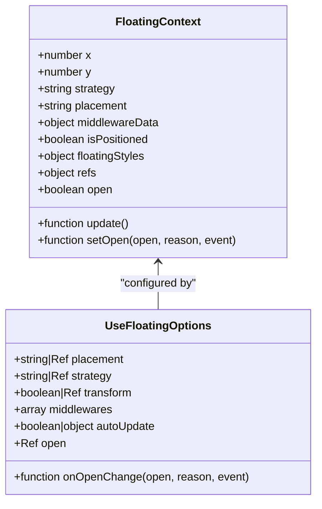
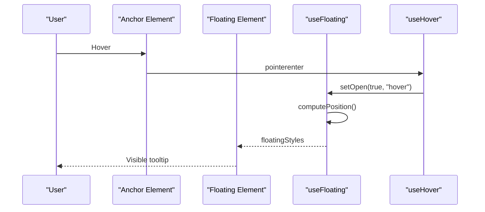
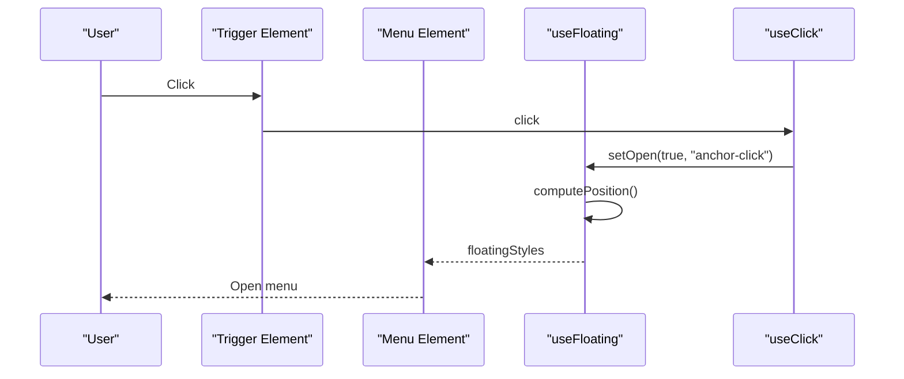
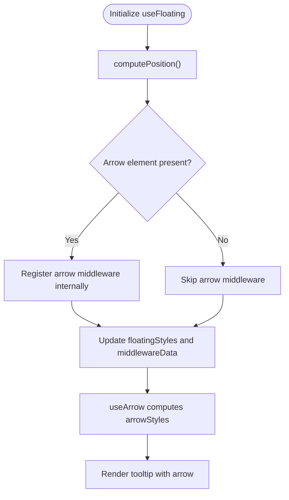
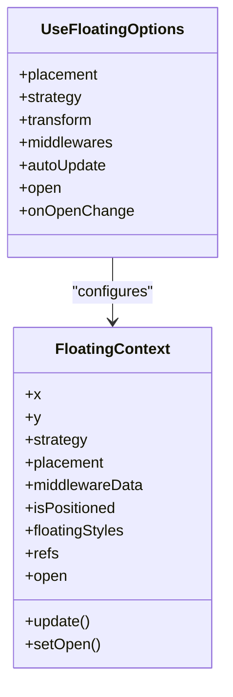
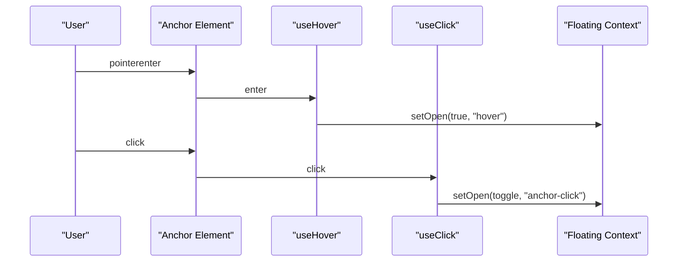
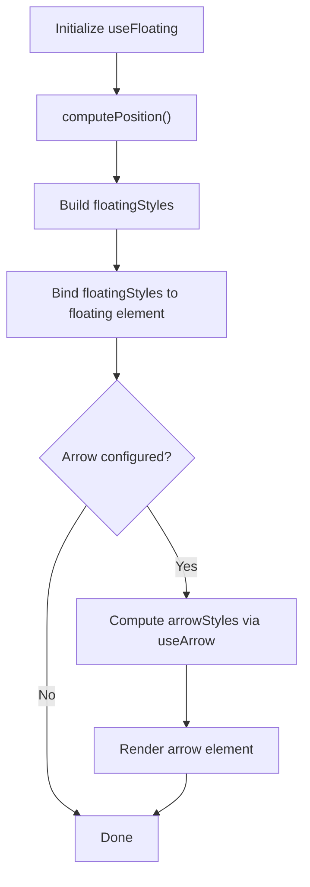

# Getting Started

<cite>
**Referenced Files in This Document**
- [README.md](file://README.md)
- [package.json](file://package.json)
- [src/composables/index.ts](file://src/composables/index.ts)
- [src/composables/positioning/use-floating.ts](file://src/composables/positioning/use-floating.ts)
- [src/composables/positioning/use-arrow.ts](file://src/composables/positioning/use-arrow.ts)
- [src/composables/middlewares/arrow.ts](file://src/composables/middlewares/arrow.ts)
- [src/composables/middlewares/index.ts](file://src/composables/middlewares/index.ts)
- [src/composables/interactions/use-hover.ts](file://src/composables/interactions/use-hover.ts)
- [src/composables/interactions/use-click.ts](file://src/composables/interactions/use-click.ts)
- [docs/demos/use-floating/UseFloatingBasicUsage.vue](file://docs/demos/use-floating/UseFloatingBasicUsage.vue)
- [docs/demos/use-floating/DropdownMenu.vue](file://docs/demos/use-floating/DropdownMenu.vue)
- [docs/demos/use-floating/InteractiveTooltip.vue](file://docs/demos/use-floating/InteractiveTooltip.vue)
- [playground/demo/Tooltip.vue](file://playground/demo/Tooltip.vue)
</cite>

## Table of Contents
1. [Introduction](#introduction)
2. [Installation](#installation)
3. [Project Setup](#project-setup)
4. [Core Concepts](#core-concepts)
5. [Three Fundamental Examples](#three-fundamental-examples)
6. [Using useFloating](#using-usefloating)
7. [Combining with Interaction Composables](#combining-with-interaction-composables)
8. [Styling and floatingStyles](#styling-and-floatingstyles)
9. [Common Beginner Mistakes](#common-beginner-mistakes)
10. [Troubleshooting Guide](#troubleshooting-guide)
11. [Next Steps](#next-steps)

## Introduction
V-Float is a Vue 3 library for positioning floating UI elements such as tooltips, popovers, dropdowns, and modals. It builds on top of Floating UI and provides Vue 3 Composition API primitives for precise, reactive positioning and interaction behaviors.

## Installation
Install V-Float using your preferred package manager:
- pnpm: pnpm add v-float
- npm: npm install v-float
- yarn: yarn add v-float

Package metadata indicates the module exports and dependencies, including Vue 3 and Floating UI.

**Section sources**
- [README.md:21-32](file://README.md#L21-L32)
- [package.json:13-19](file://package.json#L13-L19)

## Project Setup
- Install V-Float as described above.
- Import composables from v-float in your Vue 3 components.
- Ensure your project has Vue 3 and supports the Composition API.

**Section sources**
- [README.md:21-32](file://README.md#L21-L32)
- [package.json:45-46](file://package.json#L45-L46)

## Core Concepts
- Anchor element: The element that a floating element relates to (e.g., a button that triggers a tooltip).
- Floating element: The UI overlay that is positioned near the anchor (e.g., a tooltip or menu).
- Context object: The return value of useFloating, which exposes reactive state and helpers like floatingStyles, open, setOpen, refs, and update.

**Diagram sources**
- [src/composables/positioning/use-floating.ts:111-170](file://src/composables/positioning/use-floating.ts#L111-L170)
- [src/composables/positioning/use-floating.ts:65-106](file://src/composables/positioning/use-floating.ts#L65-L106)

**Section sources**
- [src/composables/positioning/use-floating.ts:18-27](file://src/composables/positioning/use-floating.ts#L18-L27)
- [src/composables/positioning/use-floating.ts:111-170](file://src/composables/positioning/use-floating.ts#L111-L170)

## Three Fundamental Examples
Below are step-by-step setups for the three examples from the README. Replace template references with your own refs and adjust styles as needed.

### Basic Tooltip
- Create refs for the anchor and floating elements.
- Call useFloating with a placement and optional middlewares (e.g., offset).
- Attach useHover to show/hide the tooltip on hover.
- Bind floatingStyles to the floating element’s style attribute.

**Diagram sources**
- [README.md:36-61](file://README.md#L36-L61)
- [src/composables/interactions/use-hover.ts:141-171](file://src/composables/interactions/use-hover.ts#L141-L171)
- [src/composables/positioning/use-floating.ts:196-362](file://src/composables/positioning/use-floating.ts#L196-L362)

**Section sources**
- [README.md:36-61](file://README.md#L36-L61)
- [docs/demos/use-floating/UseFloatingBasicUsage.vue:1-39](file://docs/demos/use-floating/UseFloatingBasicUsage.vue#L1-L39)

### Dropdown Menu
- Create refs for the trigger and menu.
- Configure useFloating with placement and middlewares (e.g., offset, flip, shift).
- Use useClick to toggle visibility and optionally close on outside clicks.
- Optionally integrate useEscapeKey to close on Escape.

**Diagram sources**
- [README.md:63-93](file://README.md#L63-L93)
- [src/composables/interactions/use-click.ts:51-304](file://src/composables/interactions/use-click.ts#L51-L304)
- [src/composables/positioning/use-floating.ts:196-362](file://src/composables/positioning/use-floating.ts#L196-L362)

**Section sources**
- [README.md:63-93](file://README.md#L63-L93)
- [docs/demos/use-floating/DropdownMenu.vue:1-194](file://docs/demos/use-floating/DropdownMenu.vue#L1-L194)

### Tooltip with Arrow
- Set up anchor, tooltip, and arrow refs.
- Initialize useFloating with desired placement and middlewares (e.g., offset, flip).
- Attach useHover for interaction.
- Use useArrow to compute arrow position and bind arrowStyles to the arrow element.

**Diagram sources**
- [README.md:95-152](file://README.md#L95-L152)
- [src/composables/positioning/use-floating.ts:232-242](file://src/composables/positioning/use-floating.ts#L232-L242)
- [src/composables/positioning/use-arrow.ts:68-129](file://src/composables/positioning/use-arrow.ts#L68-L129)
- [src/composables/middlewares/arrow.ts:36-50](file://src/composables/middlewares/arrow.ts#L36-L50)

**Section sources**
- [README.md:95-152](file://README.md#L95-L152)
- [docs/demos/use-floating/InteractiveTooltip.vue:1-97](file://docs/demos/use-floating/InteractiveTooltip.vue#L1-L97)

## Using useFloating
- Purpose: Central positioning logic with middleware support and reactive styles.
- Key options:
  - placement: Desired placement (e.g., top, bottom-start).
  - strategy: Positioning strategy (absolute or fixed).
  - transform: Whether to use CSS transform for positioning.
  - middlewares: Array of middleware functions (e.g., offset, flip, shift).
  - autoUpdate: Automatic repositioning on anchor/floating changes.
  - open and onOpenChange: Control and observe open state changes.
- Returned context includes:
  - x, y, strategy, placement, middlewareData, isPositioned
  - floatingStyles: Reactive styles to apply to the floating element
  - refs: anchorEl, floatingEl, arrowEl
  - open, setOpen, update

**Diagram sources**
- [src/composables/positioning/use-floating.ts:65-106](file://src/composables/positioning/use-floating.ts#L65-L106)
- [src/composables/positioning/use-floating.ts:111-170](file://src/composables/positioning/use-floating.ts#L111-L170)

**Section sources**
- [src/composables/positioning/use-floating.ts:65-106](file://src/composables/positioning/use-floating.ts#L65-L106)
- [src/composables/positioning/use-floating.ts:111-170](file://src/composables/positioning/use-floating.ts#L111-L170)
- [src/composables/positioning/use-floating.ts:196-362](file://src/composables/positioning/use-floating.ts#L196-L362)

## Combining with Interaction Composables
- useHover: Adds hover-based show/hide with optional delays, rest detection, and safe polygon traversal.
- useClick: Handles anchor click toggling and optional outside click dismissal with fine-grained pointer/keyboard controls.

**Diagram sources**
- [src/composables/interactions/use-hover.ts:141-351](file://src/composables/interactions/use-hover.ts#L141-L351)
- [src/composables/interactions/use-click.ts:51-304](file://src/composables/interactions/use-click.ts#L51-L304)

**Section sources**
- [src/composables/interactions/use-hover.ts:141-351](file://src/composables/interactions/use-hover.ts#L141-L351)
- [src/composables/interactions/use-click.ts:51-304](file://src/composables/interactions/use-click.ts#L51-L304)

## Styling and floatingStyles
- floatingStyles is a reactive object that provides the correct CSS position, top/left, transform, and will-change for crisp rendering.
- Apply floatingStyles to the floating element’s style attribute.
- For arrow positioning, use useArrow to compute arrowStyles and apply them to the arrow element.

**Diagram sources**
- [src/composables/positioning/use-floating.ts:305-343](file://src/composables/positioning/use-floating.ts#L305-L343)
- [src/composables/positioning/use-arrow.ts:68-129](file://src/composables/positioning/use-arrow.ts#L68-L129)

**Section sources**
- [src/composables/positioning/use-floating.ts:305-343](file://src/composables/positioning/use-floating.ts#L305-L343)
- [src/composables/positioning/use-arrow.ts:68-129](file://src/composables/positioning/use-arrow.ts#L68-L129)

## Common Beginner Mistakes
- Forgetting to bind floatingStyles to the floating element’s style attribute.
- Not providing refs for anchorEl and floatingEl to useFloating.
- Expecting arrow positioning without setting an arrow element or relying on automatic middleware registration.
- Misplacing middlewares or forgetting to include offset/flip/shift when needed.
- Not handling open state updates properly when toggling visibility externally.

**Section sources**
- [src/composables/positioning/use-floating.ts:196-362](file://src/composables/positioning/use-floating.ts#L196-L362)
- [src/composables/positioning/use-arrow.ts:68-129](file://src/composables/positioning/use-arrow.ts#L68-L129)

## Troubleshooting Guide
- Tooltip does not appear:
  - Ensure refs are assigned and the floating element is rendered conditionally based on open.
  - Verify useHover/useClick is attached and open is being toggled.
- Tooltip overlaps or clips:
  - Add flip and shift middlewares to keep the element in view.
  - Adjust offset to create spacing between anchor and tooltip.
- Arrow misaligned:
  - Confirm arrow element is passed to useArrow and arrowStyles are applied.
  - Check that the arrow element is a child of the floating element and positioned absolutely.
- Stylus or touch pointer issues:
  - Use useHover with mouseOnly or pointer-type filtering if needed.
- Outside click not closing:
  - Ensure useClick is configured with outsideClick and the correct event capture mode.

**Section sources**
- [src/composables/interactions/use-hover.ts:17-55](file://src/composables/interactions/use-hover.ts#L17-L55)
- [src/composables/interactions/use-click.ts:315-391](file://src/composables/interactions/use-click.ts#L315-L391)
- [src/composables/middlewares/index.ts:1-3](file://src/composables/middlewares/index.ts#L1-L3)

## Next Steps
- Explore advanced features like useFloatingTree for hierarchical menus.
- Review middleware options (offset, flip, shift, hide, autoPlacement, size) and combine them for robust layouts.
- Integrate accessibility helpers and keyboard navigation patterns as demonstrated in the demos.

**Section sources**
- [README.md:189-317](file://README.md#L189-L317)
- [docs/demos/use-floating/DropdownMenu.vue:1-194](file://docs/demos/use-floating/DropdownMenu.vue#L1-L194)
- [playground/demo/Tooltip.vue:1-30](file://playground/demo/Tooltip.vue#L1-L30)