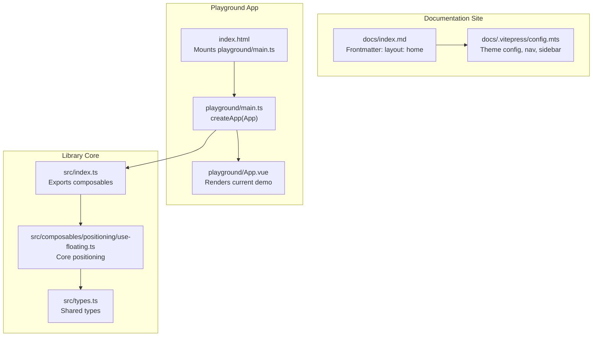
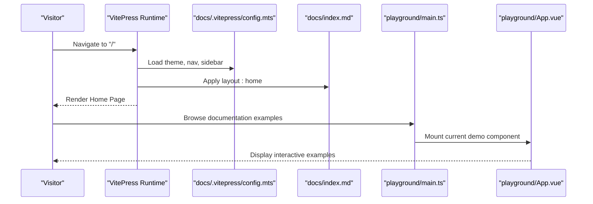
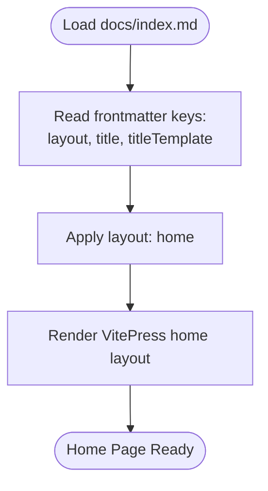
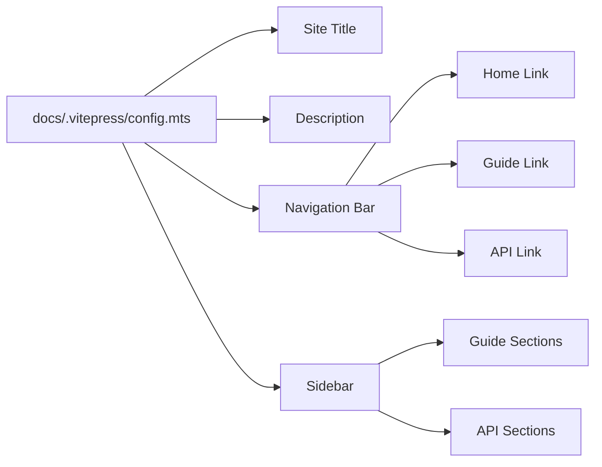
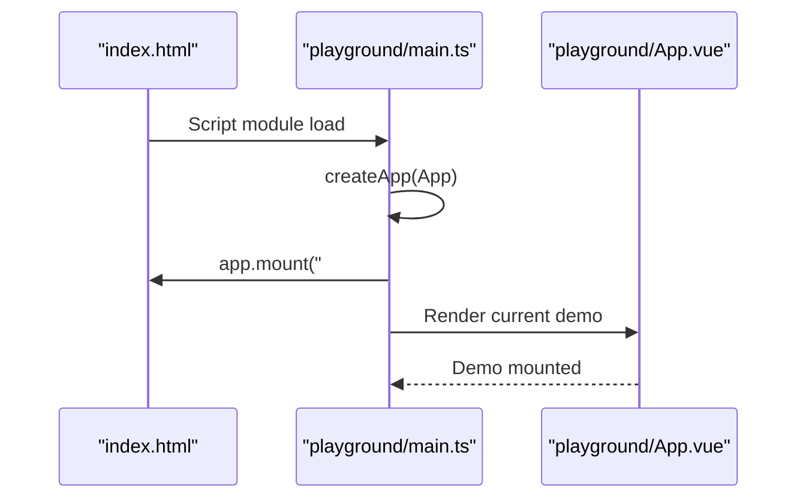
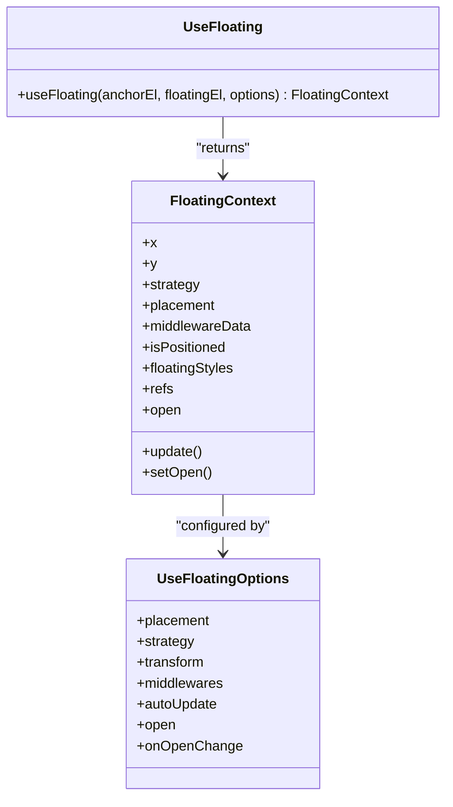
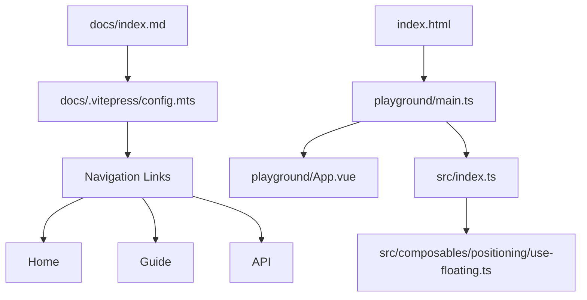

# Home Page

<cite>
**Referenced Files in This Document**
- [README.md](file://README.md)
- [index.html](file://index.html)
- [playground/App.vue](file://playground/App.vue)
- [playground/main.ts](file://playground/main.ts)
- [docs/index.md](file://docs/index.md)
- [docs/.vitepress/config.mts](file://docs/.vitepress/config.mts)
- [src/composables/positioning/use-floating.ts](file://src/composables/positioning/use-floating.ts)
- [src/types.ts](file://src/types.ts)
- [package.json](file://package.json)
- [vite.config.ts](file://vite.config.ts)
</cite>

## Table of Contents
1. [Introduction](#introduction)
2. [Project Structure](#project-structure)
3. [Core Components](#core-components)
4. [Architecture Overview](#architecture-overview)
5. [Detailed Component Analysis](#detailed-component-analysis)
6. [Dependency Analysis](#dependency-analysis)
7. [Performance Considerations](#performance-considerations)
8. [Troubleshooting Guide](#troubleshooting-guide)
9. [Conclusion](#conclusion)

## Introduction
This document explains the Home Page functionality of the V-Float project. The Home Page serves as the primary landing experience for users visiting the documentation site. It is configured through VitePress frontmatter metadata and integrates with the broader documentation ecosystem. The page showcases the library's core positioning capabilities and links to comprehensive guides and API references.

## Project Structure
The Home Page is part of the documentation site built with VitePress. The documentation configuration defines navigation, sidebar structure, and theme settings. The playground application demonstrates runtime usage of the library, while the main library exports provide the underlying composables used across demos and documentation examples.

**Diagram sources**
- [docs/index.md:1-6](file://docs/index.md#L1-L6)
- [docs/.vitepress/config.mts:1-106](file://docs/.vitepress/config.mts#L1-L106)
- [index.html:1-13](file://index.html#L1-L13)
- [playground/main.ts:1-8](file://playground/main.ts#L1-L8)
- [playground/App.vue:1-20](file://playground/App.vue#L1-L20)
- [src/index.ts:1-2](file://src/index.ts#L1-L2)
- [src/composables/positioning/use-floating.ts:1-384](file://src/composables/positioning/use-floating.ts#L1-L384)
- [src/types.ts:1-29](file://src/types.ts#L1-L29)

**Section sources**
- [docs/index.md:1-6](file://docs/index.md#L1-L6)
- [docs/.vitepress/config.mts:1-106](file://docs/.vitepress/config.mts#L1-L106)
- [index.html:1-13](file://index.html#L1-L13)
- [playground/main.ts:1-8](file://playground/main.ts#L1-L8)
- [playground/App.vue:1-20](file://playground/App.vue#L1-L20)
- [src/index.ts:1-2](file://src/index.ts#L1-L2)
- [src/composables/positioning/use-floating.ts:1-384](file://src/composables/positioning/use-floating.ts#L1-L384)
- [src/types.ts:1-29](file://src/types.ts#L1-L29)

## Core Components
- Home Page configuration: Defined via frontmatter in the documentation index file to set the layout to "home".
- VitePress configuration: Controls navigation, sidebar, search, and theme settings for the documentation site.
- Playground bootstrap: Initializes the Vue application and mounts the current demo component.
- Library exports: Aggregates composables for public consumption and documentation examples.

**Section sources**
- [docs/index.md:1-6](file://docs/index.md#L1-L6)
- [docs/.vitepress/config.mts:27-31](file://docs/.vitepress/config.mts#L27-L31)
- [docs/.vitepress/config.mts:33-52](file://docs/.vitepress/config.mts#L33-L52)
- [index.html:10](file://index.html#L10)
- [playground/main.ts:1-8](file://playground/main.ts#L1-L8)
- [src/index.ts:1-4](file://src/index.ts#L1-L4)

## Architecture Overview
The Home Page architecture centers on VitePress frontmatter configuration and integrates with the library's composables. The playground application demonstrates runtime usage, while the documentation site provides contextual examples and guides.

**Diagram sources**
- [docs/.vitepress/config.mts:21-102](file://docs/.vitepress/config.mts#L21-L102)
- [docs/index.md:1-6](file://docs/index.md#L1-L6)
- [playground/main.ts:1-8](file://playground/main.ts#L1-L8)
- [playground/App.vue:17-20](file://playground/App.vue#L17-L20)

## Detailed Component Analysis

### Home Page Configuration
The Home Page is configured through frontmatter in the documentation index file. This sets the layout to "home" and provides metadata for the page title and template.

**Diagram sources**
- [docs/index.md:1-6](file://docs/index.md#L1-L6)

**Section sources**
- [docs/index.md:1-6](file://docs/index.md#L1-L6)

### VitePress Theme and Navigation
The VitePress configuration defines the site title, description, navigation bar, and sidebar structure. These elements collectively form the Home Page experience by guiding users to relevant sections such as the guide and API references.

**Diagram sources**
- [docs/.vitepress/config.mts:21-102](file://docs/.vitepress/config.mts#L21-L102)

**Section sources**
- [docs/.vitepress/config.mts:21-102](file://docs/.vitepress/config.mts#L21-L102)

### Playground Bootstrap and Demo Rendering
The playground application initializes the Vue app and mounts the current demo component. This setup allows developers to experiment with the library's composables in a live environment.

**Diagram sources**
- [index.html:10](file://index.html#L10)
- [playground/main.ts:1-8](file://playground/main.ts#L1-L8)
- [playground/App.vue:17-20](file://playground/App.vue#L17-L20)

**Section sources**
- [index.html:10](file://index.html#L10)
- [playground/main.ts:1-8](file://playground/main.ts#L1-L8)
- [playground/App.vue:17-20](file://playground/App.vue#L17-L20)

### Library Exports and Core Positioning
The library exports aggregators expose the core composables, including positioning logic. The positioning composable encapsulates Floating UI integration and provides reactive positioning data and styles.

**Diagram sources**
- [src/composables/positioning/use-floating.ts:65-170](file://src/composables/positioning/use-floating.ts#L65-L170)
- [src/composables/positioning/use-floating.ts:196-362](file://src/composables/positioning/use-floating.ts#L196-L362)

**Section sources**
- [src/index.ts:1-4](file://src/index.ts#L1-L4)
- [src/composables/positioning/use-floating.ts:1-384](file://src/composables/positioning/use-floating.ts#L1-L384)
- [src/types.ts:1-29](file://src/types.ts#L1-L29)

## Dependency Analysis
The Home Page relies on VitePress for rendering and navigation, while the playground application depends on the library's composables. The documentation site configuration ensures consistent branding and navigation across pages.

**Diagram sources**
- [docs/index.md:1-6](file://docs/index.md#L1-L6)
- [docs/.vitepress/config.mts:27-31](file://docs/.vitepress/config.mts#L27-L31)
- [index.html:10](file://index.html#L10)
- [playground/main.ts:1-8](file://playground/main.ts#L1-L8)
- [playground/App.vue:17-20](file://playground/App.vue#L17-L20)
- [src/index.ts:1-4](file://src/index.ts#L1-L4)
- [src/composables/positioning/use-floating.ts:1-384](file://src/composables/positioning/use-floating.ts#L1-L384)

**Section sources**
- [docs/index.md:1-6](file://docs/index.md#L1-L6)
- [docs/.vitepress/config.mts:27-31](file://docs/.vitepress/config.mts#L27-L31)
- [index.html:10](file://index.html#L10)
- [playground/main.ts:1-8](file://playground/main.ts#L1-L8)
- [playground/App.vue:17-20](file://playground/App.vue#L17-L20)
- [src/index.ts:1-4](file://src/index.ts#L1-L4)
- [src/composables/positioning/use-floating.ts:1-384](file://src/composables/positioning/use-floating.ts#L1-L384)

## Performance Considerations
- Use transform-based positioning: The positioning composable defaults to CSS transform for smoother animations and better performance on high-DPR displays.
- Minimize re-renders: Keep the floating element conditionally rendered and leverage reactive refs to avoid unnecessary updates.
- Optimize middleware: Select only necessary middleware to reduce computation overhead during positioning calculations.

## Troubleshooting Guide
- Home Page not rendering: Verify the frontmatter layout is set to "home" and that the documentation site is built with VitePress.
- Navigation issues: Confirm the navigation and sidebar configurations in the VitePress config match the intended structure.
- Playground mounting errors: Ensure the HTML entry point includes the script tag to mount the playground application and that the app component is properly exported.

**Section sources**
- [docs/index.md:1-6](file://docs/index.md#L1-L6)
- [docs/.vitepress/config.mts:27-31](file://docs/.vitepress/config.mts#L27-L31)
- [docs/.vitepress/config.mts:33-52](file://docs/.vitepress/config.mts#L33-L52)
- [index.html:10](file://index.html#L10)
- [playground/main.ts:1-8](file://playground/main.ts#L1-L8)
- [playground/App.vue:17-20](file://playground/App.vue#L17-L20)

## Conclusion
The Home Page of the V-Float project is a streamlined entry point powered by VitePress frontmatter configuration and supported by the library's composables. It integrates navigation, documentation structure, and a live playground to provide an engaging introduction to floating UI positioning in Vue 3.