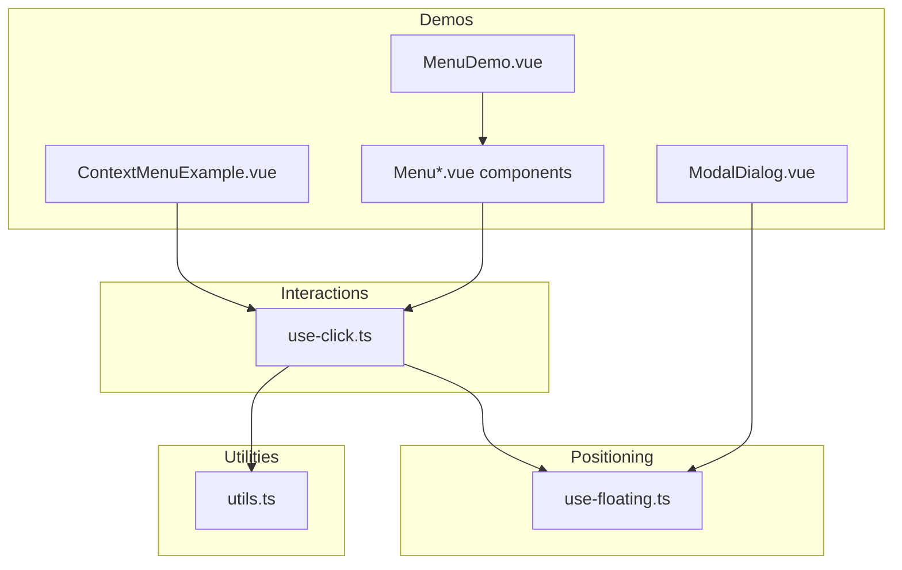
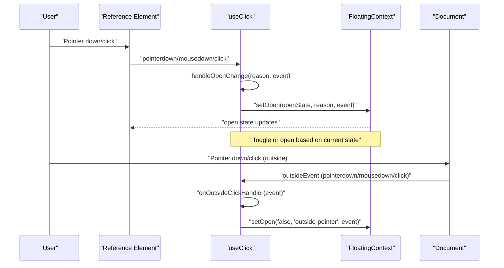
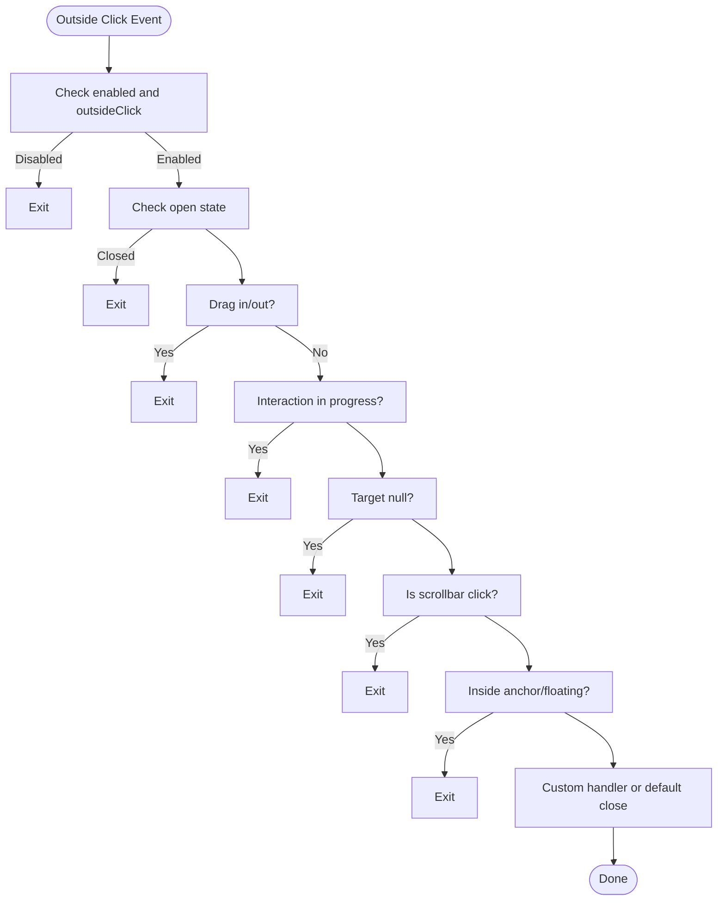
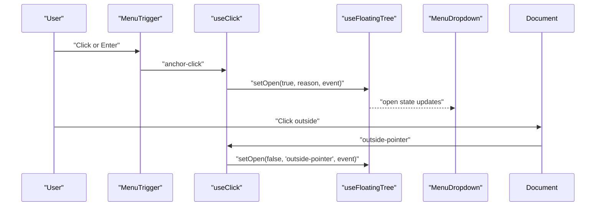
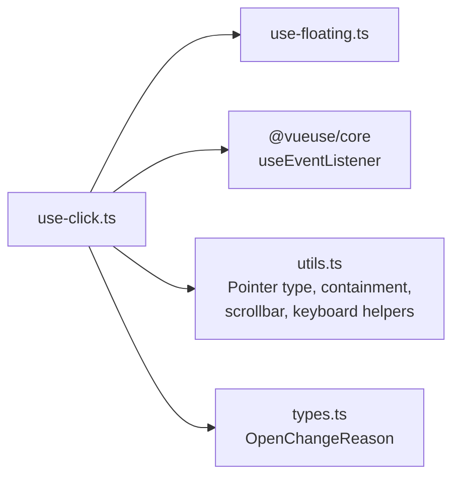

# Click Interactions

<cite>
**Referenced Files in This Document**
- [use-click.ts](file://src/composables/interactions/use-click.ts)
- [use-click.md](file://docs/api/use-click.md)
- [utils.ts](file://src/utils.ts)
- [ContextMenuExample.vue](file://playground/demo/ContextMenuExample.vue)
- [Menu.vue](file://playground/components/Menu.vue)
- [MenuDropdown.vue](file://playground/components/MenuDropdown.vue)
- [MenuTrigger.vue](file://playground/components/MenuTrigger.vue)
- [MenuItem.vue](file://playground/components/MenuItem.vue)
- [MenuDemo.vue](file://playground/demo/MenuDemo.vue)
- [ModalDialog.vue](file://docs/demos/use-floating/ModalDialog.vue)
- [index.ts](file://src/composables/interactions/index.ts)
- [types.ts](file://src/types.ts)
</cite>

## Table of Contents
1. [Introduction](#introduction)
2. [Project Structure](#project-structure)
3. [Core Components](#core-components)
4. [Architecture Overview](#architecture-overview)
5. [Detailed Component Analysis](#detailed-component-analysis)
6. [Dependency Analysis](#dependency-analysis)
7. [Performance Considerations](#performance-considerations)
8. [Troubleshooting Guide](#troubleshooting-guide)
9. [Conclusion](#conclusion)
10. [Appendices](#appendices)

## Introduction
This document explains the click interaction composable that powers toggle behavior for showing/hiding floating elements, outside click detection for automatic closing, pointer type filtering, and drag event handling prevention. It covers the useClick API, event delegation patterns, integration with the positioning system, and practical examples for dropdown menus, context menus, and modal toggling. Accessibility considerations, performance optimization, and common integration patterns with forms and interactive elements are addressed.

## Project Structure
The click interaction is implemented as a composable and integrated with the positioning system and tree-aware utilities. The relevant files include:
- Composable implementation: src/composables/interactions/use-click.ts
- API documentation: docs/api/use-click.md
- Utility helpers: src/utils.ts
- Playground demos and components: playground/demo/* and playground/components/*
- Integration examples: docs/demos/use-floating/ModalDialog.vue
- Public exports: src/composables/interactions/index.ts

**Diagram sources**
- [use-click.ts:51-304](file://src/composables/interactions/use-click.ts#L51-L304)
- [utils.ts:66-157](file://src/utils.ts#L66-L157)
- [ContextMenuExample.vue:46-59](file://playground/demo/ContextMenuExample.vue#L46-L59)
- [Menu.vue:16-43](file://playground/components/Menu.vue#L16-L43)
- [MenuDropdown.vue:50-72](file://playground/components/MenuDropdown.vue#L50-L72)
- [MenuTrigger.vue:18-39](file://playground/components/MenuTrigger.vue#L18-L39)
- [MenuItem.vue:16-26](file://playground/components/MenuItem.vue#L16-L26)
- [ModalDialog.vue:10-48](file://docs/demos/use-floating/ModalDialog.vue#L10-L48)

**Section sources**
- [use-click.ts:51-304](file://src/composables/interactions/use-click.ts#L51-L304)
- [use-click.md:1-120](file://docs/api/use-click.md#L1-L120)
- [utils.ts:66-157](file://src/utils.ts#L66-L157)
- [index.ts:1-7](file://src/composables/interactions/index.ts#L1-L7)

## Core Components
- useClick: Attaches event listeners to the reference element to toggle the floating element and optionally detect outside clicks to close it. Supports pointer type filtering, keyboard activation, and drag event handling prevention.
- FloatingContext integration: Works with useFloating to control open state and styles.
- Tree-aware behavior: Can operate on TreeNode<FloatingContext> for hierarchical menus and nested floating UI structures.
- Utility helpers: Pointer type detection, event target containment, scrollbar click detection, and keyboard input handling.

Key capabilities:
- Toggle behavior for anchor clicks
- Outside click detection with configurable event and capture phase
- Pointer type filtering (ignore mouse, touch, or keyboard-derived synthetic clicks)
- Drag prevention to avoid premature closure when dragging from inside to outside
- Keyboard activation (Enter/Space) with proper focus and ARIA attributes
- Integration with positioning system for dynamic placement and middleware

**Section sources**
- [use-click.ts:51-304](file://src/composables/interactions/use-click.ts#L51-L304)
- [use-click.md:1-120](file://docs/api/use-click.md#L1-L120)
- [utils.ts:66-157](file://src/utils.ts#L66-L157)
- [types.ts:19-29](file://src/types.ts#L19-L29)

## Architecture Overview
The click interaction composable integrates with the floating positioning system and utility helpers to provide robust, accessible, and performant behavior across input devices.

**Diagram sources**
- [use-click.ts:87-103](file://src/composables/interactions/use-click.ts#L87-L103)
- [use-click.ts:184-226](file://src/composables/interactions/use-click.ts#L184-L226)
- [use-click.ts:277-282](file://src/composables/interactions/use-click.ts#L277-L282)

## Detailed Component Analysis

### useClick API and Options
- Purpose: Enable anchor click toggling and optional outside click dismissal for floating elements.
- Context: Accepts FloatingContext or TreeNode<FloatingContext>.
- Options:
  - enabled: Enable/disable the interaction
  - event: "click" or "mousedown" for inside click trigger
  - toggle: Toggle open state on anchor click
  - ignoreMouse/ignoreKeyboard/ignoreTouch: Filter pointer types and keyboard activation
  - outsideClick/outsideEvent/outsideCapture: Configure outside click detection
  - onOutsideClick: Custom handler for outside clicks
  - preventScrollbarClick: Ignore scrollbar clicks
  - handleDragEvents: Handle drag-in/out sequences to prevent closure

Behavior highlights:
- Inside click logic respects pointer type filtering and keyboard activation
- Outside click detection uses document listeners with configurable capture phase
- Drag prevention avoids closing when a drag starts inside and ends outside
- Synthetic keyboard clicks are filtered when keyboard interactions are disabled

**Section sources**
- [use-click.ts:51-67](file://src/composables/interactions/use-click.ts#L51-L67)
- [use-click.ts:315-391](file://src/composables/interactions/use-click.ts#L315-L391)
- [use-click.md:21-54](file://docs/api/use-click.md#L21-L54)

### Event Delegation and Listener Management
- Reference element listeners:
  - pointerdown: Capture pointer type
  - mousedown/click: Handle inside clicks with event option and pointer type filtering
  - keydown/keyup: Handle keyboard activation (Enter/Space) with focus management
- Document listeners:
  - outsideEvent: pointerdown/mousedown/click with capture phase
  - Cleanup on watcher cleanup to prevent memory leaks
- Floating element listeners:
  - mousedown/mouseup: Track drag state for drag prevention

State management:
- interactionInProgress: Prevents outside click from firing immediately after opening in the same tick
- dragStartedInside: Tracks drag state to avoid premature closure
- pointerType/didKeyDown: Used for pointer type filtering and keyboard activation

**Section sources**
- [use-click.ts:85-103](file://src/composables/interactions/use-click.ts#L85-L103)
- [use-click.ts:111-180](file://src/composables/interactions/use-click.ts#L111-L180)
- [use-click.ts:182-237](file://src/composables/interactions/use-click.ts#L182-L237)
- [use-click.ts:253-272](file://src/composables/interactions/use-click.ts#L253-L272)
- [use-click.ts:277-303](file://src/composables/interactions/use-click.ts#L277-L303)

### Outside Click Detection Algorithm
The algorithm determines whether an outside click should close the floating element:
1. Skip if disabled, outside click disabled, or closed
2. If dragStartedInside and outsideEvent is "click", ignore to prevent closure during drag
3. Skip if interactionInProgress to avoid race conditions
4. Ignore if target is null
5. If preventScrollbarClick is enabled and click is on scrollbar, ignore
6. If target is within anchor or floating element, ignore
7. Invoke onOutsideClick if provided; otherwise close via setOpen(false, "outside-pointer", event)

Edge cases:
- Synthetic keyboard clicks (detail === 0) are ignored when keyboard interactions are disabled
- Pointer type filtering ignores mouse-like pointer types, touch, or keyboard-derived events
- Drag prevention ensures closure does not occur when a drag begins inside and ends outside

**Diagram sources**
- [use-click.ts:184-226](file://src/composables/interactions/use-click.ts#L184-L226)
- [utils.ts:129-157](file://src/utils.ts#L129-L157)

**Section sources**
- [use-click.ts:184-226](file://src/composables/interactions/use-click.ts#L184-L226)
- [utils.ts:129-157](file://src/utils.ts#L129-L157)

### Pointer Type Filtering and Keyboard Activation
- Pointer type filtering:
  - isMouseLikePointerType: Ignores mouse-like pointer types when ignoreMouse is true
  - Touch events are ignored when ignoreTouch is true
  - Keyboard synthetic clicks (detail === 0) are ignored when ignoreKeyboard is true
- Keyboard activation:
  - Enter: Opens the floating element
  - Space: Prevents default to avoid page scroll, then opens on keyup if appropriate
  - Button-like targets and typeable elements are handled to avoid conflicts

Accessibility:
- Proper ARIA attributes (aria-expanded, aria-controls, aria-haspopup) should be bound on the reference element
- Focus management and keyboard navigation are supported by combining useClick with other composables

**Section sources**
- [use-click.ts:241-249](file://src/composables/interactions/use-click.ts#L241-L249)
- [use-click.ts:147-180](file://src/composables/interactions/use-click.ts#L147-L180)
- [utils.ts:66-105](file://src/utils.ts#L66-L105)

### Integration with Positioning System
- useClick works with FloatingContext from useFloating to control open state and styles
- Middleware and placement are configured via useFloating; useClick focuses on interaction behavior
- Teleporting floating elements (e.g., to body) is supported and handled by the positioning system

Examples:
- Context menus use useClientPoint for static positioning and outside click detection
- Dropdown menus integrate with useFloatingTree for hierarchical behavior
- Modals demonstrate backdrop click handling and focus management alongside floating positioning

**Section sources**
- [ContextMenuExample.vue:46-59](file://playground/demo/ContextMenuExample.vue#L46-L59)
- [Menu.vue:16-43](file://playground/components/Menu.vue#L16-L43)
- [MenuDropdown.vue:50-72](file://playground/components/MenuDropdown.vue#L50-L72)
- [ModalDialog.vue:10-48](file://docs/demos/use-floating/ModalDialog.vue#L10-L48)

### Practical Examples

#### Dropdown Menus
- Root menu and submenus use useFloatingTree to establish a hierarchical structure
- useClick enables outside click dismissal for each node
- MenuTrigger binds ARIA attributes and keyboard navigation
- MenuDropdown provides list navigation and focus trap integration

**Diagram sources**
- [Menu.vue:16-43](file://playground/components/Menu.vue#L16-L43)
- [MenuTrigger.vue:18-39](file://playground/components/MenuTrigger.vue#L18-L39)
- [MenuDropdown.vue:50-72](file://playground/components/MenuDropdown.vue#L50-L72)
- [use-click.ts:87-103](file://src/composables/interactions/use-click.ts#L87-L103)
- [use-click.ts:184-226](file://src/composables/interactions/use-click.ts#L184-L226)

**Section sources**
- [MenuDemo.vue:22-198](file://playground/demo/MenuDemo.vue#L22-L198)
- [Menu.vue:16-43](file://playground/components/Menu.vue#L16-L43)
- [MenuTrigger.vue:18-39](file://playground/components/MenuTrigger.vue#L18-L39)
- [MenuDropdown.vue:50-72](file://playground/components/MenuDropdown.vue#L50-L72)
- [MenuItem.vue:16-26](file://playground/components/MenuItem.vue#L16-L26)

#### Context Menus
- Right-click triggers positioning at the click location
- useClientPoint provides static positioning
- useClick enables outside click dismissal

**Section sources**
- [ContextMenuExample.vue:46-73](file://playground/demo/ContextMenuExample.vue#L46-L73)

#### Modal Toggling
- Modal dialogs use floating positioning for overlay content
- Backdrop click and Escape key handling complement floating positioning
- Focus management ensures accessible modal behavior

**Section sources**
- [ModalDialog.vue:10-48](file://docs/demos/use-floating/ModalDialog.vue#L10-L48)

## Dependency Analysis
The click interaction composable depends on:
- FloatingContext for open state and styles
- VueUse for event listener management
- Internal utilities for pointer type detection, containment checks, scrollbar detection, and keyboard handling

**Diagram sources**
- [use-click.ts:1-13](file://src/composables/interactions/use-click.ts#L1-L13)
- [utils.ts:66-157](file://src/utils.ts#L66-L157)
- [types.ts:19-29](file://src/types.ts#L19-L29)

**Section sources**
- [use-click.ts:1-13](file://src/composables/interactions/use-click.ts#L1-L13)
- [utils.ts:66-157](file://src/utils.ts#L66-L157)
- [types.ts:19-29](file://src/types.ts#L19-L29)

## Performance Considerations
- Event listener lifecycle: useEventListener and watcher cleanup ensure listeners are removed when disabled or unmounted
- Debouncing outside click: interactionInProgress prevents immediate closure after opening in the same tick
- Conditional attachment: Listeners are attached only when enabled and reference element is available
- Minimal reactivity: computed getters for enabled and outside click enable are used to avoid unnecessary work
- Drag prevention: Using mousedown/mouseup on floating element avoids extra overhead while preventing closure during drags

Recommendations:
- Prefer outsideEvent "pointerdown" for responsiveness when outside click detection is enabled
- Use outsideCapture true to intercept events early in the capture phase
- Keep preventScrollbarClick true to avoid accidental closures on scrollbars
- Avoid excessive nesting of composables; combine with useEscapeKey and focus management as needed

**Section sources**
- [use-click.ts:74-75](file://src/composables/interactions/use-click.ts#L74-L75)
- [use-click.ts:253-272](file://src/composables/interactions/use-click.ts#L253-L272)
- [use-click.ts:277-303](file://src/composables/interactions/use-click.ts#L277-L303)

## Troubleshooting Guide
Common issues and resolutions:
- Outside click closes immediately after opening:
  - Cause: Same-tick event propagation
  - Resolution: interactionInProgress prevents this; ensure outside click detection is enabled and not overridden
- Keyboard activation not working:
  - Cause: ignoreKeyboard enabled or button-like target
  - Resolution: Disable ignoreKeyboard and ensure target is not a button-like element
- Touch interactions conflicting with mouse:
  - Cause: Pointer type filtering not configured
  - Resolution: Set ignoreMouse or ignoreTouch appropriately
- Drag causes unexpected closure:
  - Cause: Drag started inside, ended outside
  - Resolution: handleDragEvents is enabled by default; leave as-is or disable if needed
- Scrollbar clicks closing floating element:
  - Cause: preventScrollbarClick disabled
  - Resolution: Keep preventScrollbarClick true (default) to ignore scrollbar clicks

Accessibility checklist:
- Bind aria-expanded on the reference element
- Bind aria-controls to the floating element
- Provide keyboard navigation and focus management
- Announce state changes when appropriate

**Section sources**
- [use-click.ts:87-103](file://src/composables/interactions/use-click.ts#L87-L103)
- [use-click.ts:147-180](file://src/composables/interactions/use-click.ts#L147-L180)
- [use-click.ts:241-249](file://src/composables/interactions/use-click.ts#L241-L249)
- [use-click.ts:184-226](file://src/composables/interactions/use-click.ts#L184-L226)
- [utils.ts:129-157](file://src/utils.ts#L129-L157)

## Conclusion
The useClick composable provides a comprehensive, accessible, and performant solution for click-based interactions with floating elements. It supports toggle behavior, outside click dismissal, pointer type filtering, drag prevention, and keyboard activation. By integrating with the positioning system and tree-aware utilities, it enables robust dropdown menus, context menus, and modal toggling with minimal boilerplate and strong defaults.

## Appendices

### API Reference Summary
- Function: useClick(context, options)
- Options: enabled, event, toggle, ignoreMouse, ignoreKeyboard, ignoreTouch, outsideClick, outsideEvent, outsideCapture, onOutsideClick, preventScrollbarClick, handleDragEvents
- Return: void (attaches event listeners internally)
- Context: FloatingContext or TreeNode<FloatingContext>

Integration patterns:
- Combine with useEscapeKey for keyboard dismissal
- Pair with useFocusTrap for modal focus management
- Use with useFloatingTree for hierarchical menus
- Integrate with form controls and interactive elements via ARIA attributes

**Section sources**
- [use-click.md:1-120](file://docs/api/use-click.md#L1-L120)
- [use-click.ts:51-391](file://src/composables/interactions/use-click.ts#L51-L391)