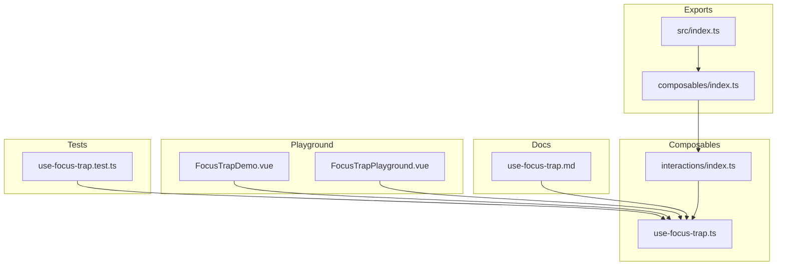
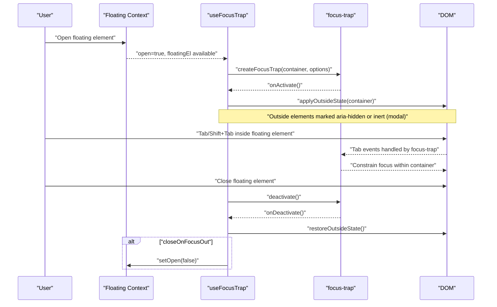
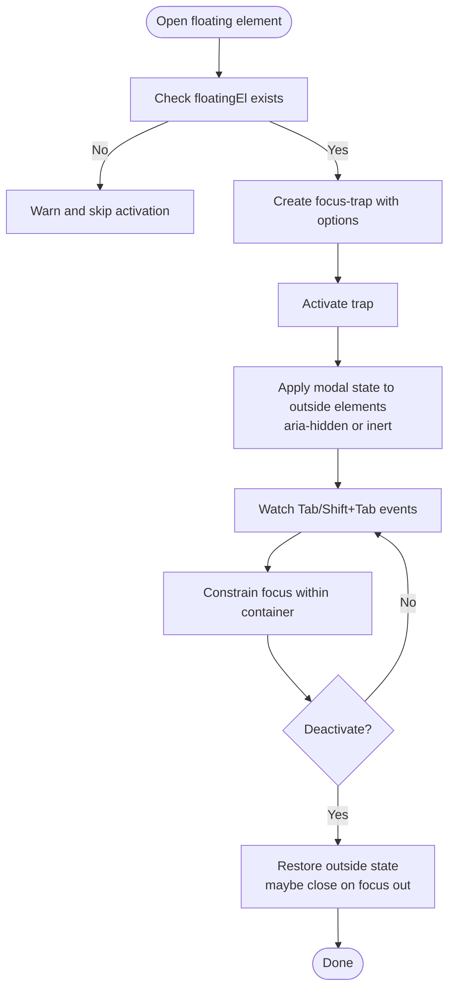
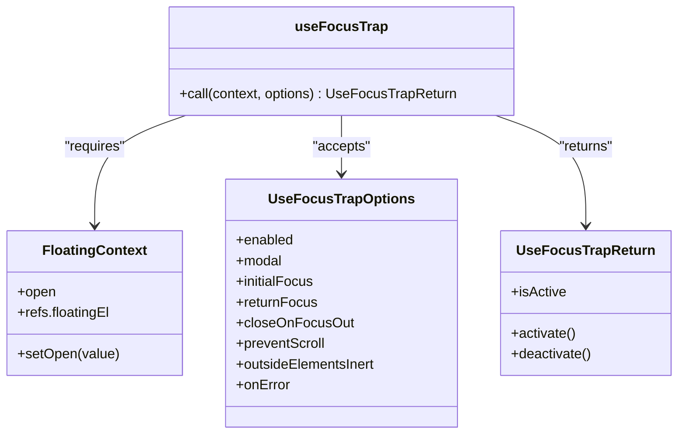
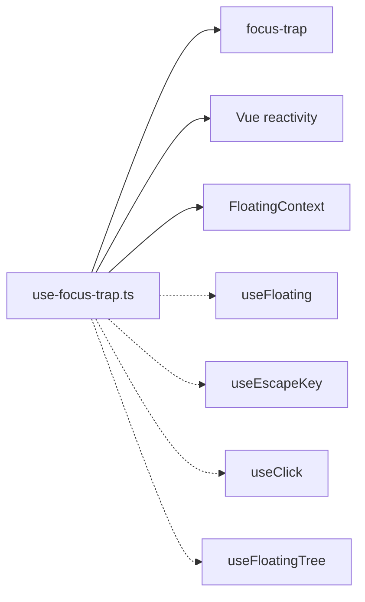

# Focus Trap

<cite>
**Referenced Files in This Document**
- [use-focus-trap.ts](file://src/composables/interactions/use-focus-trap.ts)
- [use-focus-trap.md](file://docs/api/use-focus-trap.md)
- [FocusTrapDemo.vue](file://playground/demo/FocusTrapDemo.vue)
- [FocusTrapPlayground.vue](file://playground/demo/FocusTrapPlayground.vue)
- [use-focus-trap.test.ts](file://src/composables/__tests__/use-focus-trap.test.ts)
- [index.ts](file://src/composables/interactions/index.ts)
- [index.ts](file://src/index.ts)
</cite>

## Table of Contents
1. [Introduction](#introduction)
2. [Project Structure](#project-structure)
3. [Core Components](#core-components)
4. [Architecture Overview](#architecture-overview)
5. [Detailed Component Analysis](#detailed-component-analysis)
6. [Dependency Analysis](#dependency-analysis)
7. [Performance Considerations](#performance-considerations)
8. [Troubleshooting Guide](#troubleshooting-guide)
9. [Conclusion](#conclusion)
10. [Appendices](#appendices)

## Introduction
This document provides a comprehensive guide to the focus trap composable used to manage keyboard focus within floating UI surfaces such as modal dialogs, drawers, and overlays. It explains the useFocusTrap API, focus trapping algorithm, modal vs. non-modal behavior, focus restoration, accessibility compliance, and integration with the positioning system and other interaction composables. Practical examples demonstrate modal dialog focus management, drawer navigation, and overlay component focus handling, along with edge cases for dynamic content, nested focus traps, and integration with form validation and input focus management.

## Project Structure
The focus trap functionality is implemented as a composable within the interactions module and documented in the API docs. The playground demos illustrate real-world usage patterns, and tests validate behavior across scenarios.

**Diagram sources**
- [index.ts:1-7](file://src/composables/interactions/index.ts#L1-L7)
- [use-focus-trap.ts:1-300](file://src/composables/interactions/use-focus-trap.ts#L1-L300)
- [use-focus-trap.md:1-573](file://docs/api/use-focus-trap.md#L1-L573)
- [FocusTrapDemo.vue:1-117](file://playground/demo/FocusTrapDemo.vue#L1-L117)
- [FocusTrapPlayground.vue:1-375](file://playground/demo/FocusTrapPlayground.vue#L1-L375)
- [use-focus-trap.test.ts:1-318](file://src/composables/__tests__/use-focus-trap.test.ts#L1-L318)
- [index.ts:1-4](file://src/composables/index.ts#L1-L4)
- [index.ts:1-2](file://src/index.ts#L1-L2)

**Section sources**
- [index.ts:1-7](file://src/composables/interactions/index.ts#L1-L7)
- [index.ts:1-4](file://src/composables/index.ts#L1-L4)
- [index.ts:1-2](file://src/index.ts#L1-L2)

## Core Components
- useFocusTrap: The primary composable that creates and manages a focus trap around a floating element. It integrates with the floating context, supports modal and non-modal modes, handles initial focus, focus restoration, and outside element state (aria-hidden or inert).
- Options and return: Provides fine-grained control over activation, modal behavior, initial focus selection, focus return, close-on-focus-out, scroll prevention, inert application, and error handling.
- Integration points: Works with useFloating for positioning, useEscapeKey for dismissal, useClick for toggling, and useFloatingTree for nested focus traps.

**Section sources**
- [use-focus-trap.ts:111-299](file://src/composables/interactions/use-focus-trap.ts#L111-L299)
- [use-focus-trap.md:5-62](file://docs/api/use-focus-trap.md#L5-L62)

## Architecture Overview
The focus trap composable orchestrates focus containment using the focus-trap library, while applying modal semantics and accessibility enhancements. It reacts to floating context state and cleans up on scope disposal.

**Diagram sources**
- [use-focus-trap.ts:221-278](file://src/composables/interactions/use-focus-trap.ts#L221-L278)
- [use-focus-trap.ts:154-201](file://src/composables/interactions/use-focus-trap.ts#L154-L201)
- [use-focus-trap.ts:206-216](file://src/composables/interactions/use-focus-trap.ts#L206-L216)

## Detailed Component Analysis

### API Definition and Options
- Context: Requires a floating context with open state and refs to the floating element.
- Options:
  - enabled: Toggle activation.
  - modal: Modal mode with outside element inert or aria-hidden.
  - initialFocus: Target for initial focus; supports selector, element, function, or disabling.
  - returnFocus: Restore focus to the previously focused element on close.
  - closeOnFocusOut: Close floating on focus exit (non-modal).
  - preventScroll: Pass to focus() to avoid scrolling.
  - outsideElementsInert: Apply inert attribute when supported.
  - onError: Callback for activation errors.
- Return:
  - isActive: Reactive indicator of trap state.
  - activate/deactivate: Manual control methods.

Practical examples in the docs and playground demonstrate modal dialogs, non-modal auto-close, dynamic initial focus, and conditional activation.

**Section sources**
- [use-focus-trap.ts:17-86](file://src/composables/interactions/use-focus-trap.ts#L17-L86)
- [use-focus-trap.ts:111-132](file://src/composables/interactions/use-focus-trap.ts#L111-L132)
- [use-focus-trap.md:21-62](file://docs/api/use-focus-trap.md#L21-L62)
- [FocusTrapDemo.vue:19-41](file://playground/demo/FocusTrapDemo.vue#L19-L41)
- [FocusTrapPlayground.vue:19-68](file://playground/demo/FocusTrapPlayground.vue#L19-L68)

### Focus Trapping Algorithm and Boundary Detection
- Container: Uses the floating element as the focus trap container.
- Guards: focus-trap injects focus guards to prevent focus from leaving the container.
- Tab order: Enforces cyclic tab order within the container; wraps from first to last and vice versa.
- Fallback focus: Falls back to the container itself if no tabbable elements exist.
- Outside detection: Detects elements outside the container by containment checks and applies modal state.

**Diagram sources**
- [use-focus-trap.ts:221-278](file://src/composables/interactions/use-focus-trap.ts#L221-L278)
- [use-focus-trap.ts:154-201](file://src/composables/interactions/use-focus-trap.ts#L154-L201)
- [use-focus-trap.ts:281-287](file://src/composables/interactions/use-focus-trap.ts#L281-L287)

**Section sources**
- [use-focus-trap.ts:221-278](file://src/composables/interactions/use-focus-trap.ts#L221-L278)
- [use-focus-trap.ts:154-201](file://src/composables/interactions/use-focus-trap.ts#L154-L201)

### Modal vs. Non-Modal Behavior
- Modal mode:
  - Outside elements marked aria-hidden or inert (when supported).
  - Focus cannot escape the container.
  - Recommended for dialogs and overlays.
- Non-modal mode:
  - Optionally closes the floating element when focus exits the container.
  - Allows focus to move outside the container.

Examples in the docs and playground demonstrate both modes and their differences.

**Section sources**
- [use-focus-trap.ts:136-138](file://src/composables/interactions/use-focus-trap.ts#L136-L138)
- [use-focus-trap.ts:245-248](file://src/composables/interactions/use-focus-trap.ts#L245-L248)
- [use-focus-trap.md:151-203](file://docs/api/use-focus-trap.md#L151-L203)

### Focus Restoration on Close
- By default, focus returns to the element that was focused before the trap activated.
- Disabled when returnFocus is false.
- Gracefully handles disconnected elements by falling back to container or default behavior.

**Section sources**
- [use-focus-trap.ts:252-253](file://src/composables/interactions/use-focus-trap.ts#L252-L253)
- [use-focus-trap.test.ts:141-154](file://src/composables/__tests__/use-focus-trap.test.ts#L141-L154)

### Integration with Positioning System
- The composable expects a floating context with refs to the floating element and open state.
- Works with useFloating’s placement and middleware pipeline to position the floating element.
- The floating element serves as the focus trap container.

**Diagram sources**
- [use-focus-trap.ts:17-86](file://src/composables/interactions/use-focus-trap.ts#L17-L86)
- [use-focus-trap.ts:111-132](file://src/composables/interactions/use-focus-trap.ts#L111-L132)
- [use-focus-trap.ts:294-299](file://src/composables/interactions/use-focus-trap.ts#L294-L299)

**Section sources**
- [use-focus-trap.ts:111-132](file://src/composables/interactions/use-focus-trap.ts#L111-L132)

### Practical Examples

#### Modal Dialog Focus Management
- Use modal mode with aria-modal and role="dialog".
- Focus first tabbable element or a specific element on open.
- Return focus to the trigger on close.

**Section sources**
- [use-focus-trap.md:98-149](file://docs/api/use-focus-trap.md#L98-L149)
- [FocusTrapDemo.vue:31-41](file://playground/demo/FocusTrapDemo.vue#L31-L41)

#### Drawer Navigation
- Use non-modal mode with closeOnFocusOut to dismiss when focus leaves the drawer.
- Combine with useEscapeKey for keyboard dismissal.

**Section sources**
- [use-focus-trap.md:179-203](file://docs/api/use-focus-trap.md#L179-L203)
- [FocusTrapPlayground.vue:64-68](file://playground/demo/FocusTrapPlayground.vue#L64-L68)

#### Overlay Component Focus Handling
- Apply inert to outside elements in modal mode for critical overlays.
- Ensure initialFocus targets a meaningful control (e.g., close button).

**Section sources**
- [use-focus-trap.md:151-177](file://docs/api/use-focus-trap.md#L151-L177)
- [FocusTrapPlayground.vue:38-46](file://playground/demo/FocusTrapPlayground.vue#L38-L46)

### Accessibility Compliance and WAI-ARIA
- Keyboard trapping: Enforced via focus-trap to keep Tab navigation within the container.
- Modal semantics: aria-modal and role="dialog" recommended on the floating element.
- Screen reader compatibility: Maintains focus order and avoids focus loss.
- WCAG alignment: Follows focus management guidelines for keyboard accessibility.

**Section sources**
- [use-focus-trap.md:556-565](file://docs/api/use-focus-trap.md#L556-L565)

### Integration with Other Interaction Composables
- useEscapeKey: Pair with focus traps for keyboard dismissal.
- useClick: Toggle open/closed state; focus trap activates when open.
- useFloatingTree: Manage nested focus traps in hierarchical floating UIs.

**Section sources**
- [use-focus-trap.md:368-425](file://docs/api/use-focus-trap.md#L368-L425)
- [use-focus-trap.md:304-366](file://docs/api/use-focus-trap.md#L304-L366)

### Edge Cases and Robustness
- Dynamic content: Newly added tabbable elements are included in focus traversal.
- Rapid open/close cycles: Guard against double-deactivation and cleanup on scope disposal.
- Null floating element: Graceful handling with warnings.
- Focus errors: Try/catch around activation; error handler invoked if provided.
- Disconnected return target: Avoid restoring to removed elements.

**Section sources**
- [use-focus-trap.test.ts:212-229](file://src/composables/__tests__/use-focus-trap.test.ts#L212-L229)
- [use-focus-trap.test.ts:231-247](file://src/composables/__tests__/use-focus-trap.test.ts#L231-L247)
- [use-focus-trap.test.ts:268-279](file://src/composables/__tests__/use-focus-trap.test.ts#L268-L279)
- [use-focus-trap.test.ts:281-297](file://src/composables/__tests__/use-focus-trap.test.ts#L281-L297)
- [use-focus-trap.test.ts:249-266](file://src/composables/__tests__/use-focus-trap.test.ts#L249-L266)
- [use-focus-trap.ts:206-216](file://src/composables/interactions/use-focus-trap.ts#L206-L216)
- [use-focus-trap.ts:289-292](file://src/composables/interactions/use-focus-trap.ts#L289-L292)

## Dependency Analysis
- Internal dependencies:
  - focus-trap: Core library for focus management.
  - Vue reactivity: computed, watchPostEffect, shallowRef, onScopeDispose.
  - FloatingContext: Exposes open state and floating element reference.
- External integrations:
  - useFloating: Provides positioning and floating element ref.
  - useEscapeKey, useClick: Additional interaction composables.
  - useFloatingTree: Enables nested focus traps.

**Diagram sources**
- [use-focus-trap.ts:1-11](file://src/composables/interactions/use-focus-trap.ts#L1-L11)
- [index.ts:1-7](file://src/composables/interactions/index.ts#L1-L7)

**Section sources**
- [use-focus-trap.ts:1-11](file://src/composables/interactions/use-focus-trap.ts#L1-L11)
- [index.ts:1-7](file://src/composables/interactions/index.ts#L1-L7)

## Performance Considerations
- Minimal overhead: focus-trap manages focus efficiently; avoid unnecessary re-creation by relying on reactive options.
- Outside element state: Applying aria-hidden or inert is O(n) over body children; cache and restore state efficiently.
- Prevent scroll: Keep preventScroll true by default to avoid layout shifts during focus changes.
- Cleanup: Ensure scope disposal triggers deactivation to prevent memory leaks.

[No sources needed since this section provides general guidance]

## Troubleshooting Guide
Common issues and resolutions:
- Focus escapes in modal mode: Verify modal is enabled and outside elements are marked aria-hidden or inert.
- Focus does not return on close: Confirm returnFocus is true and the previous element still exists.
- Non-modal does not close on focus out: Ensure closeOnFocusOut is true and modal is false.
- Dynamic elements not included: Ensure the floating element contains the new elements before opening the trap.
- Errors during activation: Provide an onError handler to capture and log activation failures.

**Section sources**
- [use-focus-trap.test.ts:109-122](file://src/composables/__tests__/use-focus-trap.test.ts#L109-L122)
- [use-focus-trap.test.ts:141-154](file://src/composables/__tests__/use-focus-trap.test.ts#L141-L154)
- [use-focus-trap.test.ts:124-139](file://src/composables/__tests__/use-focus-trap.test.ts#L124-L139)
- [use-focus-trap.test.ts:212-229](file://src/composables/__tests__/use-focus-trap.test.ts#L212-L229)
- [use-focus-trap.ts:261-277](file://src/composables/interactions/use-focus-trap.ts#L261-L277)

## Conclusion
The focus trap composable provides robust, accessible focus management for floating UI surfaces. It supports modal and non-modal modes, flexible initial focus targeting, reliable focus restoration, and seamless integration with the positioning system and other interaction composables. The included examples and tests demonstrate practical usage patterns and edge-case handling, enabling developers to build accessible and user-friendly modal dialogs, drawers, and overlays.

[No sources needed since this section summarizes without analyzing specific files]

## Appendices

### API Reference Summary
- useFocusTrap(context, options): Returns isActive, activate(), deactivate().
- Options: enabled, modal, initialFocus, returnFocus, closeOnFocusOut, preventScroll, outsideElementsInert, onError.
- Integration: Works with useFloating, useEscapeKey, useClick, useFloatingTree.

**Section sources**
- [use-focus-trap.ts:111-132](file://src/composables/interactions/use-focus-trap.ts#L111-L132)
- [use-focus-trap.ts:294-299](file://src/composables/interactions/use-focus-trap.ts#L294-L299)
- [use-focus-trap.md:5-62](file://docs/api/use-focus-trap.md#L5-L62)