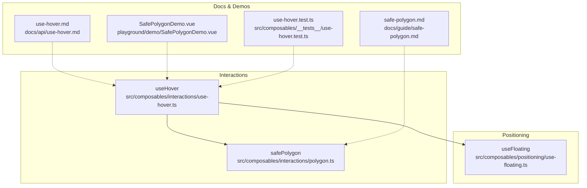
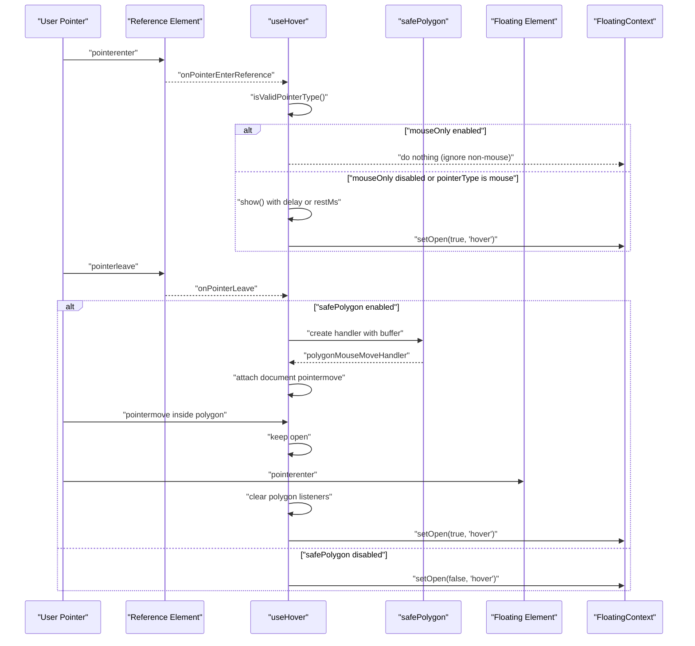
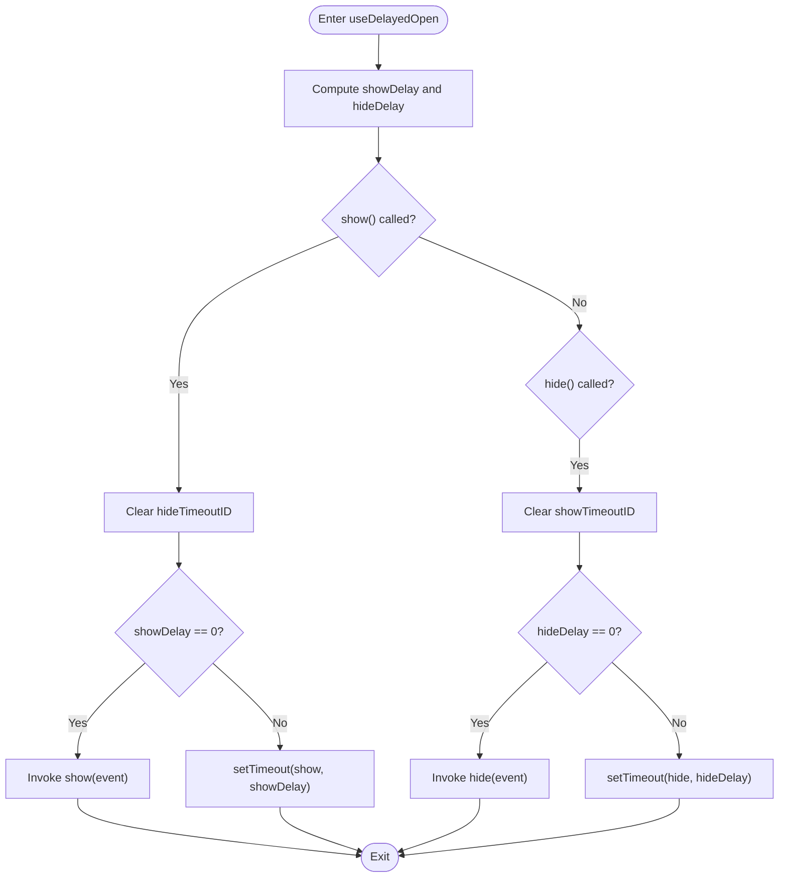
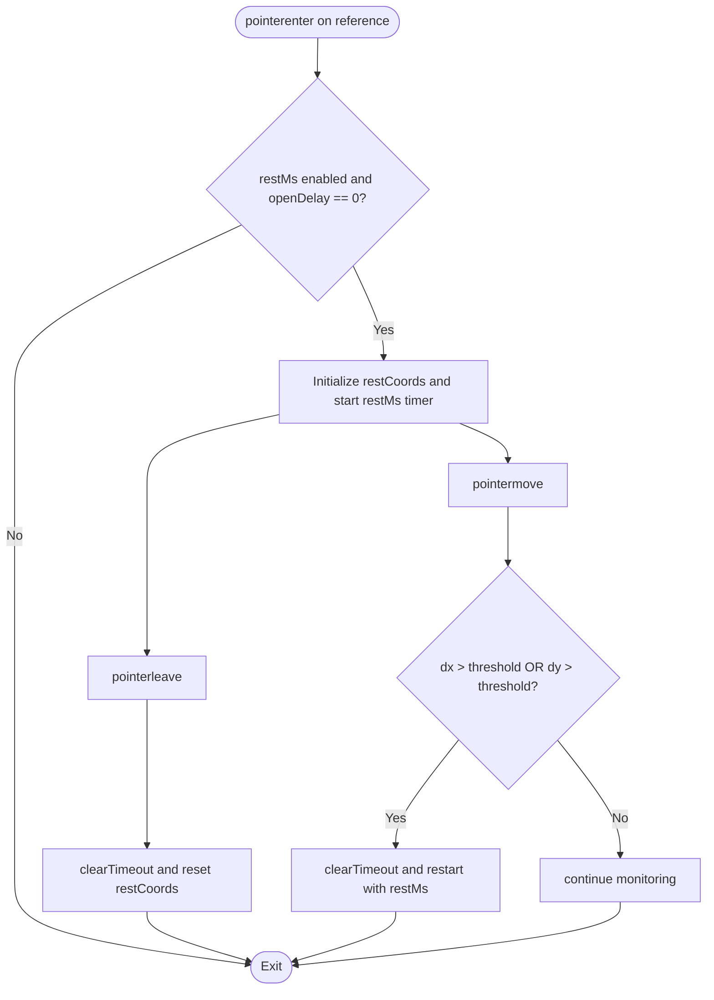
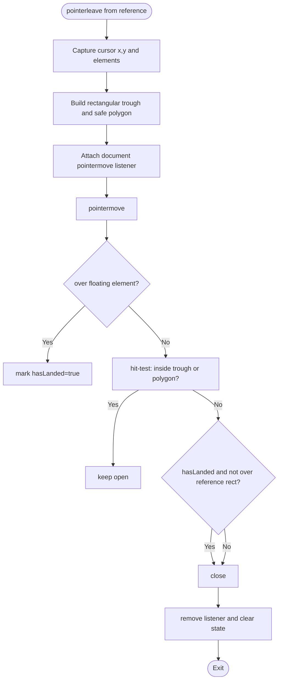
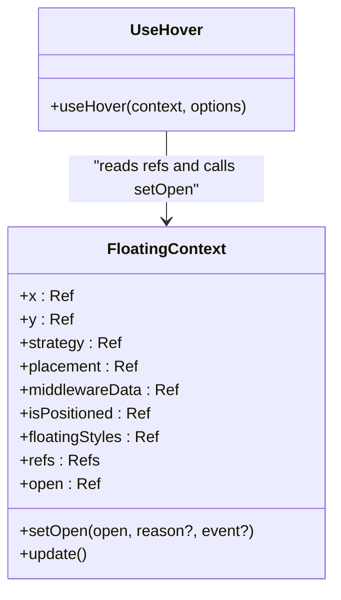
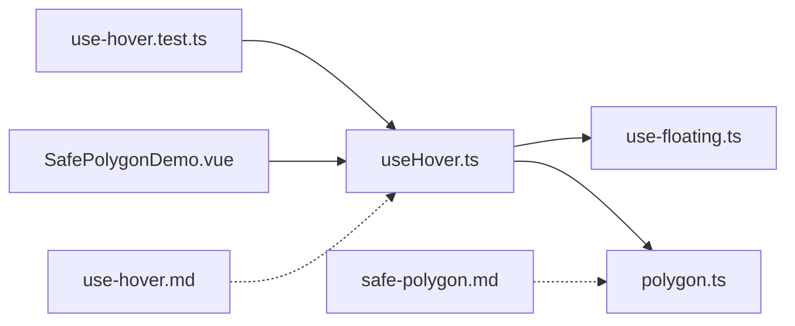

# Hover Interactions

<cite>
**Referenced Files in This Document**
- [use-hover.ts](file://src/composables/interactions/use-hover.ts)
- [polygon.ts](file://src/composables/interactions/polygon.ts)
- [use-hover.md](file://docs/api/use-hover.md)
- [safe-polygon.md](file://docs/guide/safe-polygon.md)
- [SafePolygonDemo.vue](file://playground/demo/SafePolygonDemo.vue)
- [use-hover.test.ts](file://src/composables/__tests__/use-hover.test.ts)
- [use-floating.ts](file://src/composables/positioning/use-floating.ts)
- [Tooltip.vue](file://playground/demo/Tooltip.vue)
- [MenuDemo.vue](file://playground/demo/MenuDemo.vue)
</cite>

## Table of Contents
1. [Introduction](#introduction)
2. [Project Structure](#project-structure)
3. [Core Components](#core-components)
4. [Architecture Overview](#architecture-overview)
5. [Detailed Component Analysis](#detailed-component-analysis)
6. [Dependency Analysis](#dependency-analysis)
7. [Performance Considerations](#performance-considerations)
8. [Troubleshooting Guide](#troubleshooting-guide)
9. [Conclusion](#conclusion)
10. [Appendices](#appendices)

## Introduction
This document explains the hover interaction composable that powers smooth, reliable hover-based UI behaviors such as tooltips and dropdown menus. It covers the useHover API, delayed open/close timing, pointer rest detection, mouse-only mode, and the safe polygon algorithm for seamless pointer navigation. It also documents integration with the positioning system, cross-device compatibility, performance characteristics, and accessibility considerations.

## Project Structure
Hover interactions are implemented as a composable that integrates with the floating positioning system. The key files include:
- useHover composable for hover logic and event handling
- Safe polygon algorithm for pointer traversal safety
- API and guide documentation
- Playground demos and tests

**Diagram sources**
- [use-hover.ts:141-351](file://src/composables/interactions/use-hover.ts#L141-L351)
- [polygon.ts:116-254](file://src/composables/interactions/polygon.ts#L116-L254)
- [use-floating.ts:196-384](file://src/composables/positioning/use-floating.ts#L196-L384)
- [use-hover.md:1-195](file://docs/api/use-hover.md#L1-L195)
- [safe-polygon.md:1-117](file://docs/guide/safe-polygon.md#L1-L117)
- [SafePolygonDemo.vue:1-562](file://playground/demo/SafePolygonDemo.vue#L1-L562)
- [use-hover.test.ts:1-528](file://src/composables/__tests__/use-hover.test.ts#L1-L528)

**Section sources**
- [use-hover.ts:141-351](file://src/composables/interactions/use-hover.ts#L141-L351)
- [polygon.ts:116-254](file://src/composables/interactions/polygon.ts#L116-L254)
- [use-floating.ts:196-384](file://src/composables/positioning/use-floating.ts#L196-L384)
- [use-hover.md:1-195](file://docs/api/use-hover.md#L1-L195)
- [safe-polygon.md:1-117](file://docs/guide/safe-polygon.md#L1-L117)
- [SafePolygonDemo.vue:1-562](file://playground/demo/SafePolygonDemo.vue#L1-L562)
- [use-hover.test.ts:1-528](file://src/composables/__tests__/use-hover.test.ts#L1-L528)

## Core Components
- useHover: Adds hover-based open/close behavior with configurable delays, rest detection, mouse-only filtering, and safe polygon traversal.
- safePolygon: Implements a geometric algorithm to keep floating elements open while the pointer traverses a defined corridor between reference and floating elements.

Key capabilities:
- Delayed open/close with separate open/close timers
- Pointer rest detection with configurable restMs
- Mouse-only mode to exclude touch/pen inputs
- Safe polygon traversal with buffer tuning and optional intent detection
- Integration with FloatingContext for open state and positioning updates

**Section sources**
- [use-hover.ts:17-55](file://src/composables/interactions/use-hover.ts#L17-L55)
- [use-hover.ts:141-351](file://src/composables/interactions/use-hover.ts#L141-L351)
- [polygon.ts:31-90](file://src/composables/interactions/polygon.ts#L31-L90)
- [polygon.ts:116-254](file://src/composables/interactions/polygon.ts#L116-L254)

## Architecture Overview
The hover interaction composable attaches pointer event listeners to the reference and floating elements, manages timeouts for delayed transitions, and conditionally activates the safe polygon traversal when the pointer leaves the reference element.

**Diagram sources**
- [use-hover.ts:241-319](file://src/composables/interactions/use-hover.ts#L241-L319)
- [use-hover.ts:281-310](file://src/composables/interactions/use-hover.ts#L281-L310)
- [polygon.ts:123-251](file://src/composables/interactions/polygon.ts#L123-L251)

## Detailed Component Analysis

### useHover API and Options
- enabled: Toggle all hover listeners
- delay: Number or object with open/close delays
- restMs: Pointer rest time before opening
- mouseOnly: Filter pointer types to mouse-like only
- safePolygon: Boolean or SafePolygonOptions to enable traversal

Behavior highlights:
- Delayed open/close uses separate timers for open and close
- restMs is ignored when open delay is configured
- mouseOnly filters pointerType to "mouse"
- safePolygon builds a polygon corridor and tracks pointer movement

**Section sources**
- [use-hover.ts:17-55](file://src/composables/interactions/use-hover.ts#L17-L55)
- [use-hover.ts:141-171](file://src/composables/interactions/use-hover.ts#L141-L171)
- [use-hover.ts:232-239](file://src/composables/interactions/use-hover.ts#L232-L239)
- [use-hover.ts:275-319](file://src/composables/interactions/use-hover.ts#L275-L319)
- [use-hover.md:24-44](file://docs/api/use-hover.md#L24-L44)

### Delayed Open/Close Management
The internal useDelayedOpen helper computes open/close delays and manages timers. It clears existing timers on new events to prevent race conditions.

**Diagram sources**
- [use-hover.ts:71-118](file://src/composables/interactions/use-hover.ts#L71-L118)

**Section sources**
- [use-hover.ts:71-118](file://src/composables/interactions/use-hover.ts#L71-L118)

### Pointer Event Handling
- pointerenter on reference: opens with delay or restMs
- pointerleave on reference: triggers safePolygon or immediate close
- pointerenter/leave on floating: clears polygon and cancels timers

Mouse-only filtering:
- isValidPointerType checks pointerType against "mouse" when mouseOnly is true

**Section sources**
- [use-hover.ts:241-251](file://src/composables/interactions/use-hover.ts#L241-L251)
- [use-hover.ts:275-319](file://src/composables/interactions/use-hover.ts#L275-L319)
- [use-hover.ts:232-239](file://src/composables/interactions/use-hover.ts#L232-L239)

### Pointer Rest Detection
When restMs is configured and open delay is zero, the composable tracks pointer movement to detect sustained resting. Significant movement resets the rest timer; leaving the reference cancels it.

**Diagram sources**
- [use-hover.ts:181-209](file://src/composables/interactions/use-hover.ts#L181-L209)

**Section sources**
- [use-hover.ts:177-209](file://src/composables/interactions/use-hover.ts#L177-L209)

### Safe Polygon Algorithm
The safePolygon algorithm constructs a corridor between the reference and floating elements to prevent accidental closure during pointer traversal.

Core steps:
- On pointerleave from reference, capture cursor position and build protective shapes
- Build rectangular trough and triangular/trapezoidal polygon
- On pointermove, test if cursor is inside either shape
- Optionally require intent (minimum cursor speed) for initial entry
- Close when pointer exits both shapes and has landed

**Diagram sources**
- [polygon.ts:123-251](file://src/composables/interactions/polygon.ts#L123-L251)
- [polygon.ts:363-405](file://src/composables/interactions/polygon.ts#L363-L405)
- [polygon.ts:415-516](file://src/composables/interactions/polygon.ts#L415-L516)

**Section sources**
- [polygon.ts:116-254](file://src/composables/interactions/polygon.ts#L116-L254)
- [polygon.ts:314-344](file://src/composables/interactions/polygon.ts#L314-L344)
- [polygon.ts:350-357](file://src/composables/interactions/polygon.ts#L350-L357)
- [polygon.ts:363-405](file://src/composables/interactions/polygon.ts#L363-L405)
- [polygon.ts:415-516](file://src/composables/interactions/polygon.ts#L415-L516)

### Integration with Positioning System
useHover consumes FloatingContext to manage open state and positioning. It calls setOpen with reason "hover" and passes the triggering event for downstream consumers.

**Diagram sources**
- [use-floating.ts:111-170](file://src/composables/positioning/use-floating.ts#L111-L170)
- [use-hover.ts:141-171](file://src/composables/interactions/use-hover.ts#L141-L171)

**Section sources**
- [use-hover.ts:141-171](file://src/composables/interactions/use-hover.ts#L141-L171)
- [use-floating.ts:111-170](file://src/composables/positioning/use-floating.ts#L111-L170)

### Practical Examples
- Tooltip creation: Configure useHover with a small open delay and optional safePolygon for smoother navigation.
- Dropdown hover behavior: Use different open/close delays and enable safePolygon for menu traversal.
- Custom delay configurations: Supply delay as a number or object with open/close keys.

See:
- [use-hover.md:46-187](file://docs/api/use-hover.md#L46-L187)
- [SafePolygonDemo.vue:82-154](file://playground/demo/SafePolygonDemo.vue#L82-L154)
- [Tooltip.vue:14-19](file://playground/demo/Tooltip.vue#L14-L19)
- [MenuDemo.vue:1-321](file://playground/demo/MenuDemo.vue#L1-L321)

**Section sources**
- [use-hover.md:46-187](file://docs/api/use-hover.md#L46-L187)
- [SafePolygonDemo.vue:82-154](file://playground/demo/SafePolygonDemo.vue#L82-L154)
- [Tooltip.vue:14-19](file://playground/demo/Tooltip.vue#L14-L19)
- [MenuDemo.vue:1-321](file://playground/demo/MenuDemo.vue#L1-L321)

### Safe Polygon Options and Debugging
- buffer: Extra padding around the polygon to widen the safe zone
- requireIntent: Optional intent detection to close quickly on slow initial movement
- onPolygonChange: Callback to receive polygon vertices for visualization

Visualization example:
- The playground demo renders an SVG overlay of the polygon when active.

**Section sources**
- [polygon.ts:31-52](file://src/composables/interactions/polygon.ts#L31-L52)
- [polygon.ts:116-254](file://src/composables/interactions/polygon.ts#L116-L254)
- [safe-polygon.md:72-111](file://docs/guide/safe-polygon.md#L72-L111)
- [SafePolygonDemo.vue:467-502](file://playground/demo/SafePolygonDemo.vue#L467-L502)

## Dependency Analysis
- useHover depends on FloatingContext for open state and positioning
- useHover uses safePolygon when enabled
- safePolygon relies on geometry helpers and cursor speed calculations
- Tests validate event handling, delays, restMs, mouseOnly, and safePolygon behavior

**Diagram sources**
- [use-hover.ts:141-351](file://src/composables/interactions/use-hover.ts#L141-L351)
- [polygon.ts:116-254](file://src/composables/interactions/polygon.ts#L116-L254)
- [use-floating.ts:196-384](file://src/composables/positioning/use-floating.ts#L196-L384)
- [use-hover.test.ts:1-528](file://src/composables/__tests__/use-hover.test.ts#L1-L528)
- [SafePolygonDemo.vue:1-562](file://playground/demo/SafePolygonDemo.vue#L1-L562)
- [use-hover.md:1-195](file://docs/api/use-hover.md#L1-L195)
- [safe-polygon.md:1-117](file://docs/guide/safe-polygon.md#L1-L117)

**Section sources**
- [use-hover.ts:141-351](file://src/composables/interactions/use-hover.ts#L141-L351)
- [polygon.ts:116-254](file://src/composables/interactions/polygon.ts#L116-L254)
- [use-floating.ts:196-384](file://src/composables/positioning/use-floating.ts#L196-L384)
- [use-hover.test.ts:1-528](file://src/composables/__tests__/use-hover.test.ts#L1-L528)
- [SafePolygonDemo.vue:1-562](file://playground/demo/SafePolygonDemo.vue#L1-L562)
- [use-hover.md:1-195](file://docs/api/use-hover.md#L1-L195)
- [safe-polygon.md:1-117](file://docs/guide/safe-polygon.md#L1-L117)

## Performance Considerations
- Timers: Delayed open/close uses setTimeout; ensure cleanup on scope dispose to avoid leaks.
- Event listeners: Polygon listener is attached only when leaving the reference; removed on close or cleanup.
- Rest detection: Movement threshold prevents frequent timer resets; significant movement cancels and restarts the rest timer.
- Safe polygon: Hit-testing runs on pointermove; keep buffers reasonable to minimize computation overhead.
- Mouse-only mode: Filters pointer events early to reduce unnecessary work.

[No sources needed since this section provides general guidance]

## Troubleshooting Guide
Common issues and resolutions:
- Floating element closes immediately after entering reference: Verify delay settings and ensure pointerleave is not firing unexpectedly.
- Safe polygon does not activate: Confirm safePolygon is enabled and pointerleave occurs from the reference element.
- RestMs not working: Ensure open delay is zero; otherwise restMs is ignored.
- Non-mouse inputs trigger hover: Set mouseOnly to true to restrict to mouse-like pointers.
- Cross-element traversal fails: Adjust buffer size and placement to improve polygon coverage.

Validation references:
- Tests demonstrate delay behavior, restMs, mouseOnly, and safePolygon activation.
- Demo shows polygon visualization and interactive controls.

**Section sources**
- [use-hover.test.ts:197-248](file://src/composables/__tests__/use-hover.test.ts#L197-L248)
- [use-hover.test.ts:252-319](file://src/composables/__tests__/use-hover.test.ts#L252-L319)
- [use-hover.test.ts:323-356](file://src/composables/__tests__/use-hover.test.ts#L323-L356)
- [use-hover.test.ts:441-485](file://src/composables/__tests__/use-hover.test.ts#L441-L485)
- [SafePolygonDemo.vue:82-154](file://playground/demo/SafePolygonDemo.vue#L82-L154)

## Conclusion
The hover interaction composable provides robust, configurable hover behavior with delayed transitions, rest detection, mouse-only filtering, and a powerful safe polygon traversal algorithm. Combined with the positioning system, it enables smooth, accessible hover experiences across tooltips, dropdowns, and nested menus.

[No sources needed since this section summarizes without analyzing specific files]

## Appendices

### API Reference Summary
- useHover(context, options)
  - Options: enabled, delay, restMs, mouseOnly, safePolygon
  - Integrates with FloatingContext open state and positioning
  - Emits reason "hover" on open/close

**Section sources**
- [use-hover.md:7-44](file://docs/api/use-hover.md#L7-L44)
- [use-hover.ts:141-171](file://src/composables/interactions/use-hover.ts#L141-L171)

### Accessibility Implications
- Combine useHover with useFocus for keyboard accessibility
- Use ARIA attributes (e.g., aria-haspopup, aria-expanded) on reference elements
- Consider Escape key handling for dismissal
- Ensure sufficient contrast and focus indicators for keyboard navigation

**Section sources**
- [use-hover.md:189-195](file://docs/api/use-hover.md#L189-L195)
- [safe-polygon.md:36-48](file://docs/guide/safe-polygon.md#L36-L48)