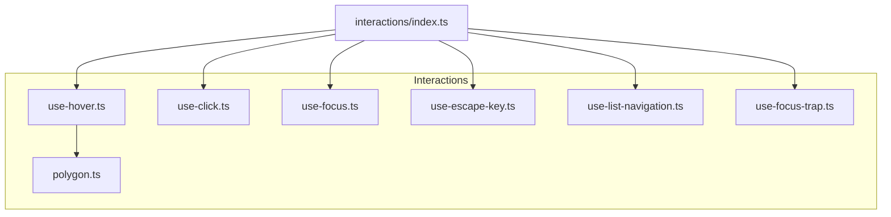
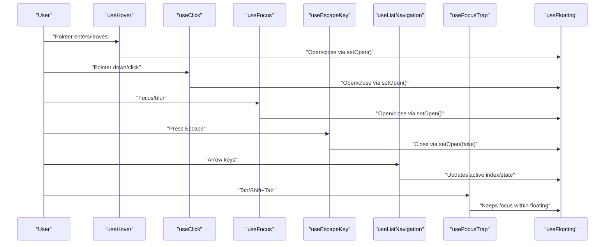
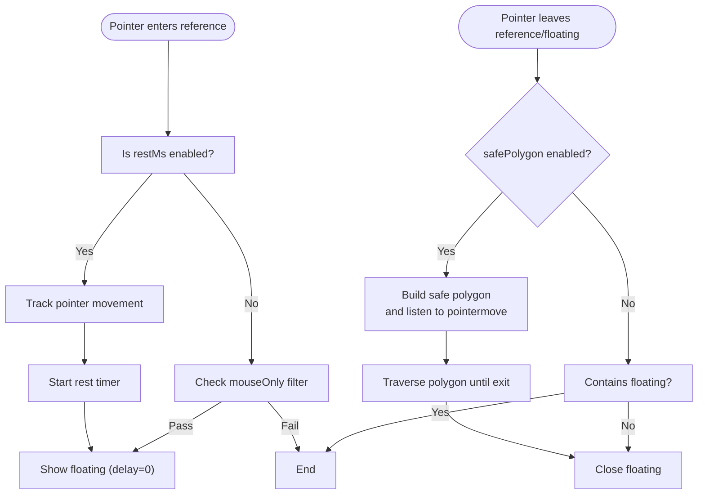
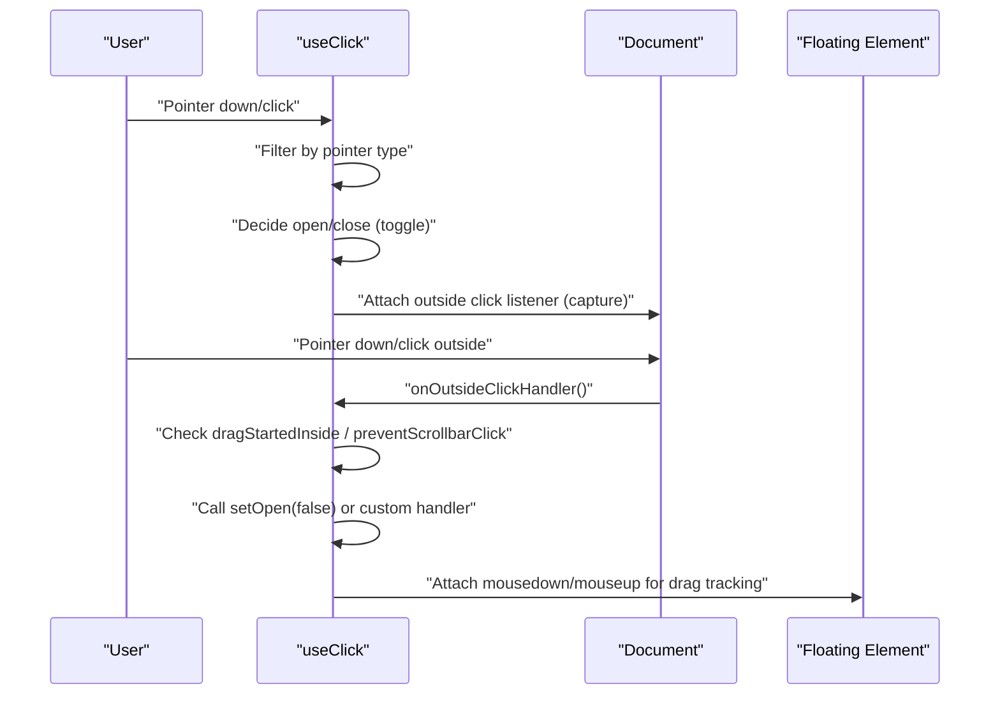
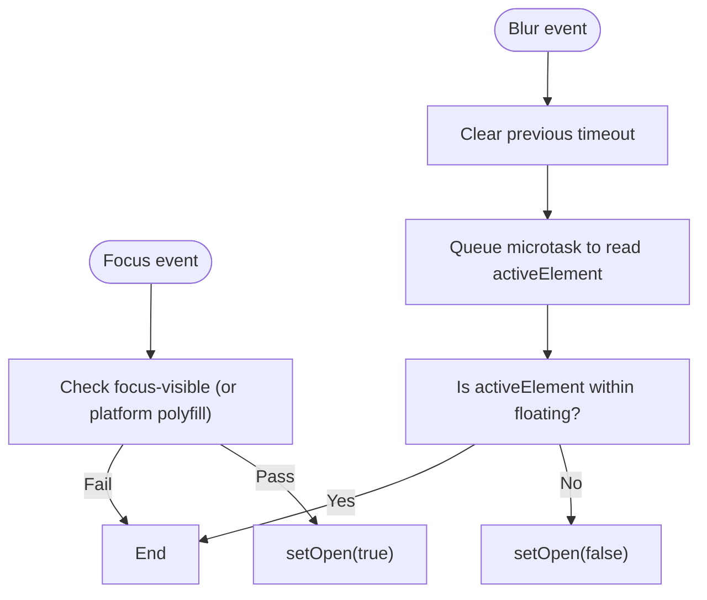
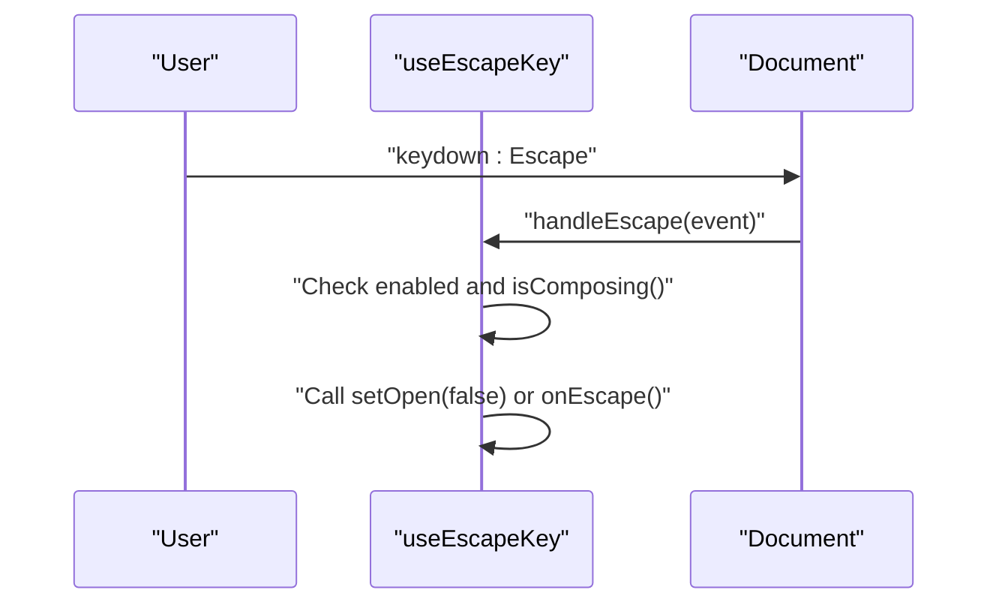
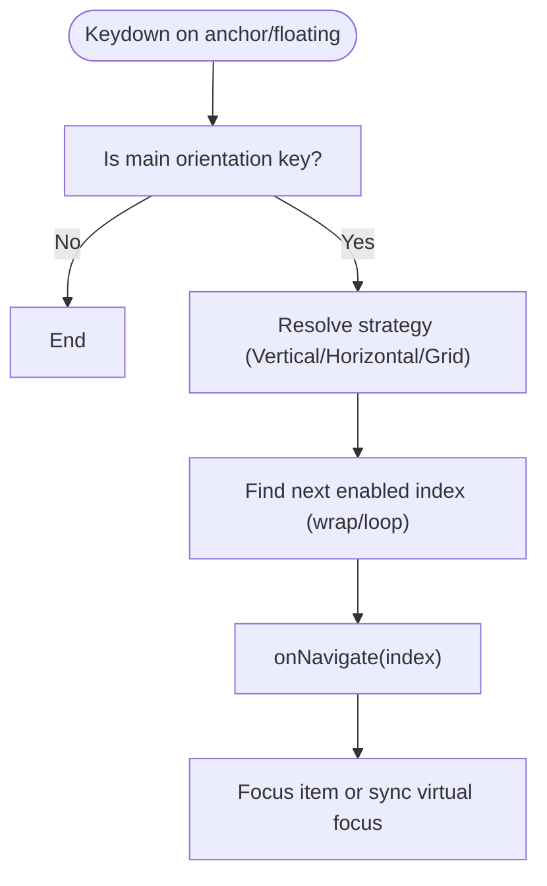
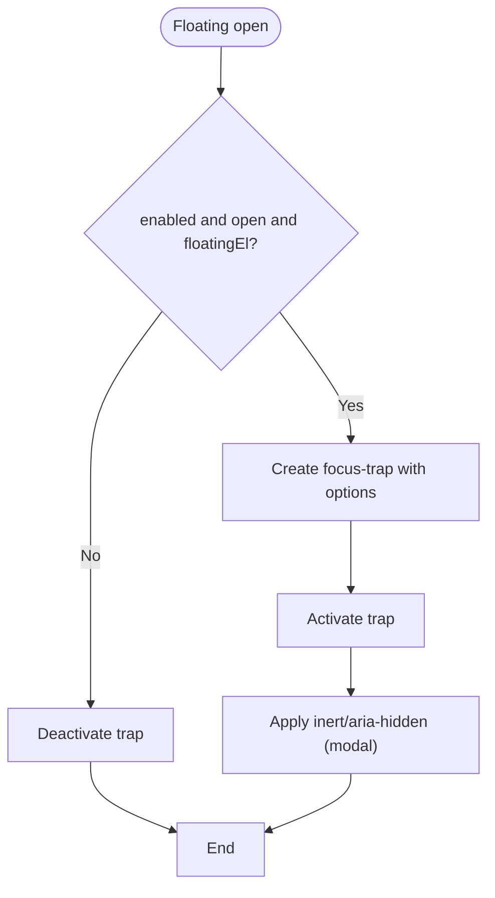
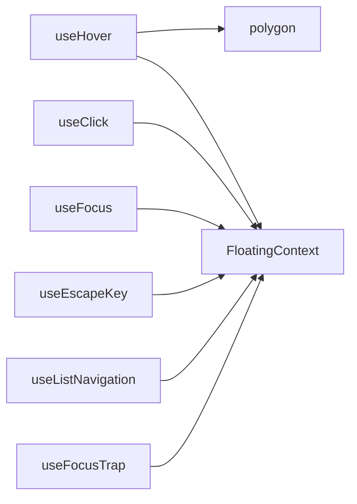

# Interaction System

<cite>
**Referenced Files in This Document**
- [use-hover.ts](file://src/composables/interactions/use-hover.ts)
- [use-click.ts](file://src/composables/interactions/use-click.ts)
- [use-focus.ts](file://src/composables/interactions/use-focus.ts)
- [use-escape-key.ts](file://src/composables/interactions/use-escape-key.ts)
- [use-list-navigation.ts](file://src/composables/interactions/use-list-navigation.ts)
- [use-focus-trap.ts](file://src/composables/interactions/use-focus-trap.ts)
- [polygon.ts](file://src/composables/interactions/polygon.ts)
- [index.ts](file://src/composables/interactions/index.ts)
- [interactions.md](file://docs/guide/interactions.md)
- [safe-polygon.md](file://docs/guide/safe-polygon.md)
- [list-navigation.md](file://docs/guide/list-navigation.md)
- [use-hover.md](file://docs/api/use-hover.md)
- [use-click.md](file://docs/api/use-click.md)
- [use-focus.md](file://docs/api/use-focus.md)
- [use-escape-key.md](file://docs/api/use-escape-key.md)
- [use-list-navigation.md](file://docs/api/use-list-navigation.md)
- [use-focus-trap.md](file://docs/api/use-focus-trap.md)
</cite>

## Table of Contents
1. [Introduction](#introduction)
2. [Project Structure](#project-structure)
3. [Core Components](#core-components)
4. [Architecture Overview](#architecture-overview)
5. [Detailed Component Analysis](#detailed-component-analysis)
6. [Dependency Analysis](#dependency-analysis)
7. [Performance Considerations](#performance-considerations)
8. [Troubleshooting Guide](#troubleshooting-guide)
9. [Conclusion](#conclusion)
10. [Appendices](#appendices)

## Introduction
This document explains the interaction system in VFloat, detailing all user interaction composables: useHover, useClick, useFocus, useEscapeKey, useListNavigation, and useFocusTrap. It covers configuration options, event handling patterns, and integration with the positioning system. It also addresses accessibility, cross-device compatibility, and common interaction patterns for tooltips, dropdowns, and menus.

## Project Structure
The interaction composables live under src/composables/interactions and are re-exported via the interactions index. Documentation for each composable is available in docs/api and practical guides in docs/guide.

**Diagram sources**
- [index.ts:1-7](file://src/composables/interactions/index.ts#L1-L7)
- [use-hover.ts:1-351](file://src/composables/interactions/use-hover.ts#L1-L351)
- [use-click.ts:1-392](file://src/composables/interactions/use-click.ts#L1-L392)
- [use-focus.ts:1-235](file://src/composables/interactions/use-focus.ts#L1-L235)
- [use-escape-key.ts:1-107](file://src/composables/interactions/use-escape-key.ts#L1-L107)
- [use-list-navigation.ts:1-822](file://src/composables/interactions/use-list-navigation.ts#L1-L822)
- [use-focus-trap.ts:1-300](file://src/composables/interactions/use-focus-trap.ts#L1-L300)
- [polygon.ts:1-517](file://src/composables/interactions/polygon.ts#L1-L517)

**Section sources**
- [index.ts:1-7](file://src/composables/interactions/index.ts#L1-L7)

## Core Components
- useHover: Hover-triggered show/hide with delay, rest detection, and safe polygon traversal.
- useClick: Toggle behavior, outside click detection, pointer type filtering, and drag-aware dismissal.
- useFocus: Keyboard focus-based show/hide with focus-visible gating and edge-case handling.
- useEscapeKey: Global Escape key listener with composition-safe handling and tree-aware behavior.
- useListNavigation: Arrow-key navigation for lists/grids with virtual focus, RTL, looping, and nested semantics.
- useFocusTrap: Accessible focus containment with modal/non-modal modes, inert support, and nested trapping.

**Section sources**
- [use-hover.ts:141-351](file://src/composables/interactions/use-hover.ts#L141-L351)
- [use-click.ts:51-304](file://src/composables/interactions/use-click.ts#L51-L304)
- [use-focus.ts:50-202](file://src/composables/interactions/use-focus.ts#L50-L202)
- [use-escape-key.ts:62-86](file://src/composables/interactions/use-escape-key.ts#L62-L86)
- [use-list-navigation.ts:451-800](file://src/composables/interactions/use-list-navigation.ts#L451-L800)
- [use-focus-trap.ts:111-300](file://src/composables/interactions/use-focus-trap.ts#L111-L300)

## Architecture Overview
The interaction composables coordinate through a shared FloatingContext that exposes open state and setters. They attach event listeners to reference and floating elements, and integrate with the positioning system to keep floating elements positioned correctly.

**Diagram sources**
- [use-hover.ts:141-351](file://src/composables/interactions/use-hover.ts#L141-L351)
- [use-click.ts:51-304](file://src/composables/interactions/use-click.ts#L51-L304)
- [use-focus.ts:50-202](file://src/composables/interactions/use-focus.ts#L50-L202)
- [use-escape-key.ts:62-86](file://src/composables/interactions/use-escape-key.ts#L62-L86)
- [use-list-navigation.ts:451-800](file://src/composables/interactions/use-list-navigation.ts#L451-L800)
- [use-focus-trap.ts:111-300](file://src/composables/interactions/use-focus-trap.ts#L111-L300)

## Detailed Component Analysis

### useHover
- Purpose: Enhance hover interactions with delays, rest detection, and safe polygon traversal.
- Key options:
  - enabled: Enable/disable listeners.
  - delay: Open/close delay in ms (single number or { open, close }).
  - restMs: Require pointer to rest for ms before opening.
  - mouseOnly: Only accept mouse-like pointer types.
  - safePolygon: Enable safe polygon with buffer and optional intent detection.
- Event handling:
  - Pointer enter/leave on reference and floating elements.
  - Delayed open/close timers.
  - Rest detection with movement threshold.
  - Safe polygon traversal to keep floating open while traversing between elements.
- Integration with positioning:
  - Uses FloatingContext.open and setOpen to control visibility.
  - Reads placement and element refs to compute polygon geometry.

**Diagram sources**
- [use-hover.ts:177-319](file://src/composables/interactions/use-hover.ts#L177-L319)
- [polygon.ts:116-254](file://src/composables/interactions/polygon.ts#L116-L254)

**Section sources**
- [use-hover.ts:17-55](file://src/composables/interactions/use-hover.ts#L17-L55)
- [use-hover.ts:163-171](file://src/composables/interactions/use-hover.ts#L163-L171)
- [use-hover.ts:177-227](file://src/composables/interactions/use-hover.ts#L177-L227)
- [use-hover.ts:229-319](file://src/composables/interactions/use-hover.ts#L229-L319)
- [use-hover.ts:321-349](file://src/composables/interactions/use-hover.ts#L321-L349)
- [use-hover.md:21-45](file://docs/api/use-hover.md#L21-L45)
- [safe-polygon.md:1-117](file://docs/guide/safe-polygon.md#L1-L117)

### useClick
- Purpose: Toggle open state on inside clicks and optionally close on outside clicks.
- Key options:
  - event: 'click' or 'mousedown'.
  - toggle: Toggle on repeated clicks.
  - ignoreMouse/ignoreKeyboard/ignoreTouch: Filter pointer types.
  - outsideClick/outsideEvent/outsideCapture: Outside click detection and capture.
  - onOutsideClick: Custom handler override.
  - preventScrollbarClick/handleDragEvents: Drag-aware dismissal and scrollbar click prevention.
- Event handling:
  - Pointer down/click with pointer type tracking.
  - Keyboard Enter/Space activation with synthetic click suppression.
  - Outside click detection with drag state to avoid closing on drags.
  - Interaction state machine to prevent immediate closure after opening.
- Integration with positioning:
  - Calls setOpen to control visibility.
  - Uses refs from FloatingContext to detect containment.

**Diagram sources**
- [use-click.ts:111-226](file://src/composables/interactions/use-click.ts#L111-L226)
- [use-click.ts:277-303](file://src/composables/interactions/use-click.ts#L277-L303)

**Section sources**
- [use-click.ts:51-73](file://src/composables/interactions/use-click.ts#L51-L73)
- [use-click.ts:111-145](file://src/composables/interactions/use-click.ts#L111-L145)
- [use-click.ts:184-226](file://src/composables/interactions/use-click.ts#L184-L226)
- [use-click.ts:277-303](file://src/composables/interactions/use-click.ts#L277-L303)
- [use-click.md:23-54](file://docs/api/use-click.md#L23-L54)

### useFocus
- Purpose: Show/hide on focus/blur with focus-visible gating and edge-case handling.
- Key options:
  - enabled: Enable/disable listeners.
  - requireFocusVisible: Only open on focus-visible (keyboard).
- Event handling:
  - Focus: Check focus-visible and open.
  - Blur: Use timeout to check activeElement and avoid premature close.
  - Window blur/focus: Block opening when returning to a previously focused tab.
  - Document focusin: Close when focus moves outside anchor/floating.
- Integration with positioning:
  - Uses setOpen to control visibility.
  - Handles virtual elements via contextElement.

**Diagram sources**
- [use-focus.ts:89-145](file://src/composables/interactions/use-focus.ts#L89-L145)

**Section sources**
- [use-focus.ts:50-72](file://src/composables/interactions/use-focus.ts#L50-L72)
- [use-focus.ts:89-145](file://src/composables/interactions/use-focus.ts#L89-L145)
- [use-focus.ts:150-170](file://src/composables/interactions/use-focus.ts#L150-L170)
- [use-focus.ts:173-185](file://src/composables/interactions/use-focus.ts#L173-L185)
- [use-focus.md:23-34](file://docs/api/use-focus.md#L23-L34)

### useEscapeKey
- Purpose: Close floating element on Escape with composition-safe handling.
- Key options:
  - enabled: Enable/disable listener.
  - capture: Use capture phase.
  - onEscape: Custom handler override.
- Event handling:
  - Global keydown listener.
  - Ignores composition events.
  - Tree-aware behavior closes the deepest open node.
- Integration with positioning:
  - Calls setOpen(false) or custom handler.

**Diagram sources**
- [use-escape-key.ts:69-82](file://src/composables/interactions/use-escape-key.ts#L69-L82)
- [use-escape-key.ts:92-106](file://src/composables/interactions/use-escape-key.ts#L92-L106)

**Section sources**
- [use-escape-key.ts:62-86](file://src/composables/interactions/use-escape-key.ts#L62-L86)
- [use-escape-key.ts:92-106](file://src/composables/interactions/use-escape-key.ts#L92-L106)
- [use-escape-key.md:23-36](file://docs/api/use-escape-key.md#L23-L36)

### useListNavigation
- Purpose: Arrow-key navigation for menus/listboxes/grids with virtual focus and nested support.
- Key options:
  - listRef: Items in DOM order.
  - activeIndex/onNavigate: Active index state and callbacks.
  - enabled/loop/orientation/disabledIndices: Behavior controls.
  - focusItemOnHover/openOnArrowKeyDown: Auto-open and hover-to-focus.
  - scrollItemIntoView/selectedIndex/focusItemOnOpen: Focus management.
  - nested/parentOrientation/rtl/virtual/virtualItemRef: Advanced semantics.
  - cols/allowEscape/gridLoopDirection: Grid navigation.
- Event handling:
  - Keyboard navigation on anchor/floating elements.
  - Hover-to-focus with ghost hover prevention.
  - Strategies: Vertical/Horizontal/Grid with wrapping and escaping.
  - Virtual focus via aria-activedescendant.
- Integration with positioning:
  - Updates active index and optionally scrolls into view.
  - Works with FloatingContext open state.

**Diagram sources**
- [use-list-navigation.ts:581-670](file://src/composables/interactions/use-list-navigation.ts#L581-L670)
- [use-list-navigation.ts:779-797](file://src/composables/interactions/use-list-navigation.ts#L779-L797)

**Section sources**
- [use-list-navigation.ts:451-476](file://src/composables/interactions/use-list-navigation.ts#L451-L476)
- [use-list-navigation.ts:581-670](file://src/composables/interactions/use-list-navigation.ts#L581-L670)
- [use-list-navigation.ts:707-734](file://src/composables/interactions/use-list-navigation.ts#L707-L734)
- [use-list-navigation.ts:779-797](file://src/composables/interactions/use-list-navigation.ts#L779-L797)
- [use-list-navigation.md:1-194](file://docs/guide/list-navigation.md#L1-L194)
- [use-list-navigation.md:23-70](file://docs/api/use-list-navigation.md#L23-L70)

### useFocusTrap
- Purpose: Trap keyboard focus within floating element with modal/non-modal modes.
- Key options:
  - enabled/modal: Enable and modal behavior.
  - initialFocus: Element to focus on activation.
  - returnFocus/closeOnFocusOut/preventScroll: Focus return and close behavior.
  - outsideElementsInert: Mark outside elements inert/aria-hidden.
  - onError: Error handler.
- Event handling:
  - Uses focus-trap library with tabbable options.
  - Applies inert or aria-hidden to outside elements in modal mode.
  - Deactivates on scope dispose and manages state to prevent double-deactivation.
- Integration with positioning:
  - Activates/deactivates based on open state and floating element availability.

**Diagram sources**
- [use-focus-trap.ts:281-287](file://src/composables/interactions/use-focus-trap.ts#L281-L287)

**Section sources**
- [use-focus-trap.ts:111-133](file://src/composables/interactions/use-focus-trap.ts#L111-L133)
- [use-focus-trap.ts:281-287](file://src/composables/interactions/use-focus-trap.ts#L281-L287)
- [use-focus-trap.md:23-46](file://docs/api/use-focus-trap.md#L23-L46)

## Dependency Analysis
- useHover depends on polygon.ts for safe polygon traversal and uses FloatingContext.open/setOpen.
- useClick depends on utilities for pointer type filtering and scrollbar detection and uses FloatingContext.open/setOpen.
- useFocus depends on platform utilities for focus-visible and uses FloatingContext.open/setOpen.
- useEscapeKey depends on composition state and uses FloatingContext.open/setOpen.
- useListNavigation depends on useActiveDescendant for virtual focus and uses FloatingContext.open/setOpen.
- useFocusTrap depends on focus-trap library and uses FloatingContext.open/setOpen.

**Diagram sources**
- [use-hover.ts:1-12](file://src/composables/interactions/use-hover.ts#L1-L12)
- [polygon.ts:1-5](file://src/composables/interactions/polygon.ts#L1-L5)
- [use-click.ts:1-14](file://src/composables/interactions/use-click.ts#L1-L14)
- [use-focus.ts:1-19](file://src/composables/interactions/use-focus.ts#L1-L19)
- [use-escape-key.ts:1-4](file://src/composables/interactions/use-escape-key.ts#L1-L4)
- [use-list-navigation.ts:1-16](file://src/composables/interactions/use-list-navigation.ts#L1-L16)
- [use-focus-trap.ts:1-11](file://src/composables/interactions/use-focus-trap.ts#L1-L11)

**Section sources**
- [use-hover.ts:1-12](file://src/composables/interactions/use-hover.ts#L1-L12)
- [polygon.ts:1-5](file://src/composables/interactions/polygon.ts#L1-L5)
- [use-click.ts:1-14](file://src/composables/interactions/use-click.ts#L1-L14)
- [use-focus.ts:1-19](file://src/composables/interactions/use-focus.ts#L1-L19)
- [use-escape-key.ts:1-4](file://src/composables/interactions/use-escape-key.ts#L1-L4)
- [use-list-navigation.ts:1-16](file://src/composables/interactions/use-list-navigation.ts#L1-L16)
- [use-focus-trap.ts:1-11](file://src/composables/interactions/use-focus-trap.ts#L1-L11)

## Performance Considerations
- useHover:
  - Delayed open/close uses setTimeout; ensure cleanup on scope dispose.
  - Safe polygon builds geometry on pointermove; consider disabling for high-frequency scenarios.
- useClick:
  - Outside click detection uses capture phase; ensure minimal overhead by disabling when not needed.
  - Drag-aware dismissal avoids unnecessary closures during drags.
- useFocus:
  - Timeout-based blur handling uses microtasks to avoid race conditions.
- useListNavigation:
  - Virtual focus avoids DOM focus changes; useActiveDescendant minimizes reflows.
  - Grid navigation with large grids may benefit from limiting cols or disabling loop.
- useFocusTrap:
  - Inert/aria-hidden application can be expensive; enable only when modal.

[No sources needed since this section provides general guidance]

## Troubleshooting Guide
- useHover
  - Symptom: Floating closes immediately after opening on hover.
    - Cause: Combined with useClick that toggles open state.
    - Fix: Conditionally enable useHover only when not open.
  - Symptom: Safe polygon not working.
    - Cause: Incorrect placement or disabled safePolygon.
    - Fix: Enable safePolygon and verify placement.
- useClick
  - Symptom: Outside click closes unexpectedly during drag.
    - Cause: Drag started inside and ended outside.
    - Fix: Keep handleDragEvents enabled; it suppresses closure during drags.
  - Symptom: Scrollbar clicks trigger outside click.
    - Cause: preventScrollbarClick disabled.
    - Fix: Enable preventScrollbarClick.
- useFocus
  - Symptom: Tooltip opens on mouse focus.
    - Cause: requireFocusVisible disabled.
    - Fix: Keep requireFocusVisible true for keyboard-only behavior.
  - Symptom: Focus not restored after closing.
    - Cause: Window blur/focus edge case.
    - Fix: rely on built-in blocking; ensure proper cleanup.
- useEscapeKey
  - Symptom: Escape triggers during IME composition.
    - Cause: Composition events not handled.
    - Fix: Composable automatically ignores composition; ensure enabled is reactive.
- useListNavigation
  - Symptom: Active item not scrolled into view.
    - Cause: Pointer modality or disabled scroll.
    - Fix: Enable scrollItemIntoView and ensure not in pointer modality.
  - Symptom: Virtual focus not working.
    - Cause: Missing aria-activedescendant or item ids.
    - Fix: Provide virtualItemRef and ensure stable ids.
- useFocusTrap
  - Symptom: Outside elements still interactive.
    - Cause: inert not supported or outsideElementsInert disabled.
    - Fix: Enable outsideElementsInert in modal mode.

**Section sources**
- [interactions.md:223-249](file://docs/guide/interactions.md#L223-L249)
- [use-hover.md:170-187](file://docs/api/use-hover.md#L170-L187)
- [safe-polygon.md:72-111](file://docs/guide/safe-polygon.md#L72-L111)
- [use-click.md:410-598](file://docs/api/use-click.md#L410-L598)
- [use-focus.md:187-228](file://docs/api/use-focus.md#L187-L228)
- [use-escape-key.md:219-248](file://docs/api/use-escape-key.md#L219-L248)
- [list-navigation.md:177-186](file://docs/guide/list-navigation.md#L177-L186)
- [use-focus-trap.md:533-554](file://docs/api/use-focus-trap.md#L533-L554)

## Conclusion
The VFloat interaction system provides a cohesive, composable approach to user interactions. Each composable integrates with FloatingContext to coordinate state changes, supports accessibility by default, and offers flexible configuration for cross-device compatibility. Together, they enable robust patterns for tooltips, dropdowns, and menus.

[No sources needed since this section summarizes without analyzing specific files]

## Appendices

### Integration Examples with Positioning
- Tooltip with hover and focus:
  - Combine useHover(delay) and useFocus with useFloating for smooth transitions.
- Dropdown with click and escape:
  - Use useClick(toggle=true, outsideClick=true) and useEscapeKey for dismissal.
- Menu with keyboard navigation:
  - Pair useListNavigation with useFloating and manage active index state.
- Modal with focus trap:
  - Use useFocusTrap(modal=true) with useEscapeKey and outside click handling.

**Section sources**
- [interactions.md:77-146](file://docs/guide/interactions.md#L77-L146)
- [interactions.md:149-169](file://docs/guide/interactions.md#L149-L169)
- [interactions.md:171-221](file://docs/guide/interactions.md#L171-L221)