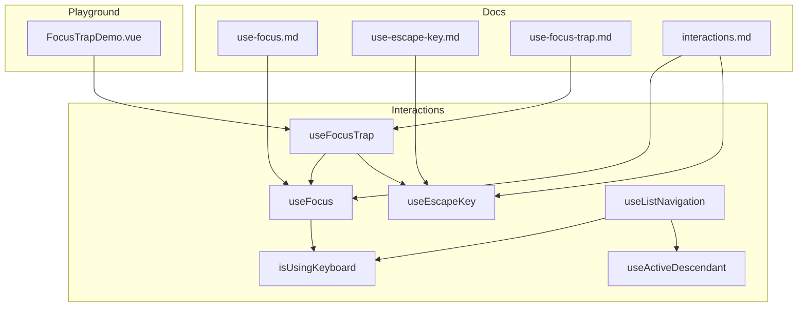
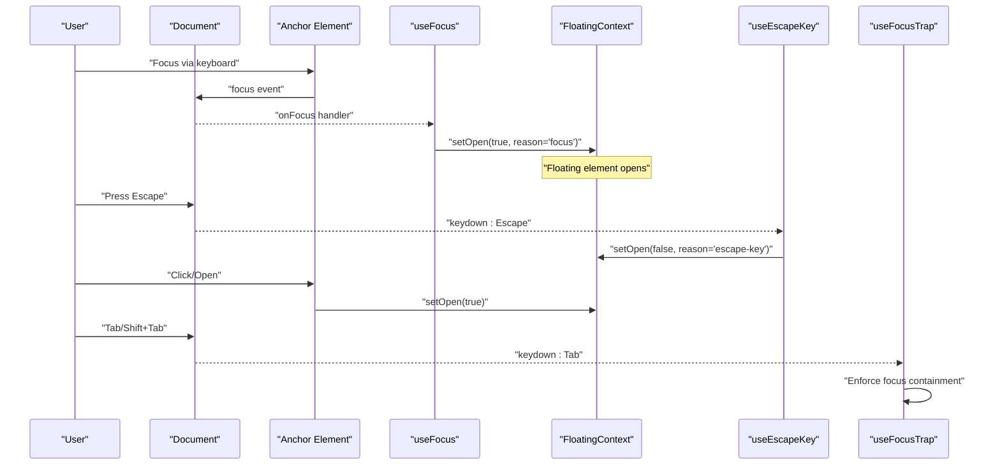
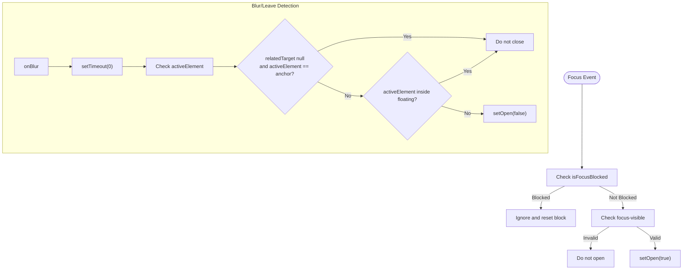
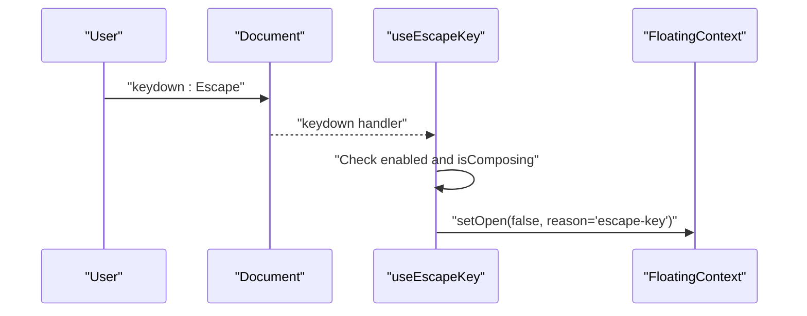
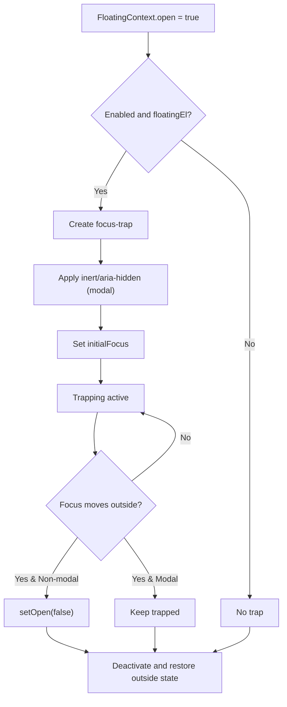
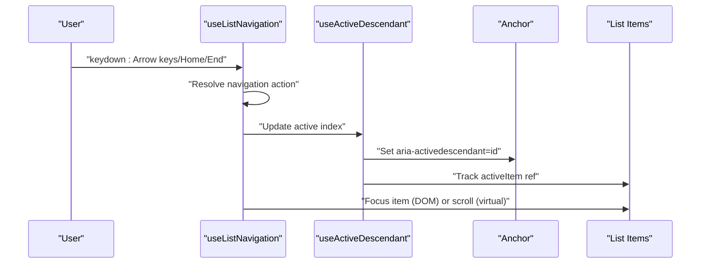
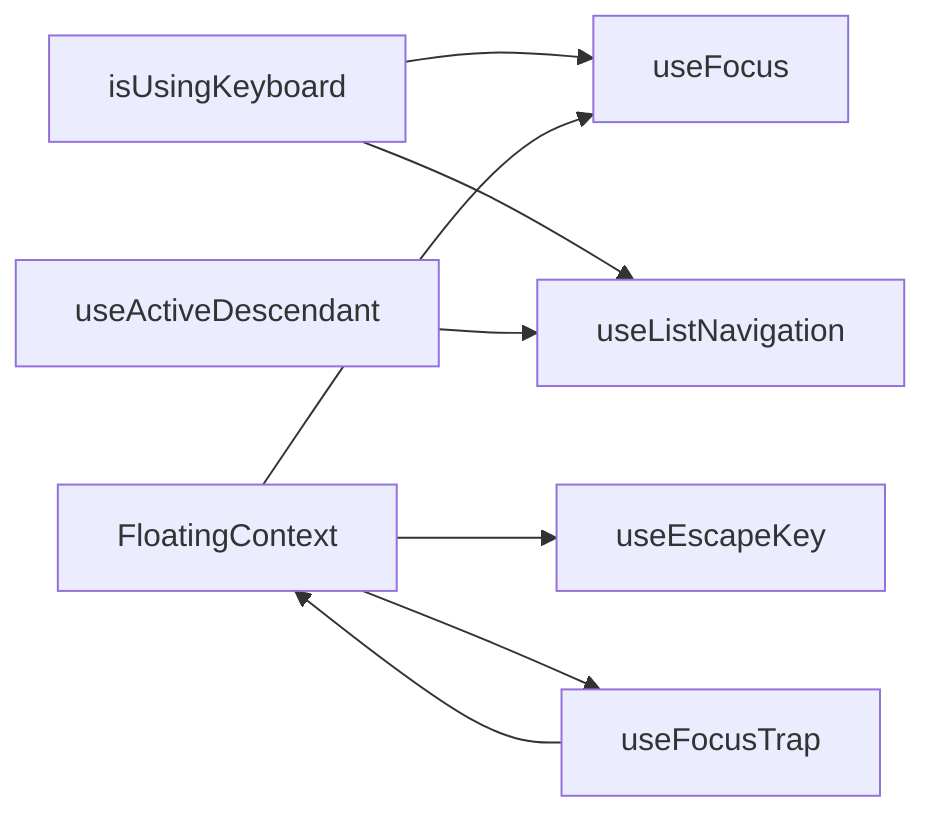

# Keyboard Interactions

<cite>
**Referenced Files in This Document**
- [use-focus.ts](file://src/composables/interactions/use-focus.ts)
- [use-escape-key.ts](file://src/composables/interactions/use-escape-key.ts)
- [use-focus-trap.ts](file://src/composables/interactions/use-focus-trap.ts)
- [is-using-keyboard.ts](file://src/composables/utils/is-using-keyboard.ts)
- [use-active-descendant.ts](file://src/composables/utils/use-active-descendant.ts)
- [use-list-navigation.ts](file://src/composables/interactions/use-list-navigation.ts)
- [use-focus.md](file://docs/api/use-focus.md)
- [use-escape-key.md](file://docs/api/use-escape-key.md)
- [use-focus-trap.md](file://docs/api/use-focus-trap.md)
- [interactions.md](file://docs/guide/interactions.md)
- [FocusTrapDemo.vue](file://playground/demo/FocusTrapDemo.vue)
- [use-focus.test.ts](file://src/composables/__tests__/use-focus.test.ts)
- [use-escape-key.test.ts](file://src/composables/__tests__/use-escape-key.test.ts)
- [use-focus-trap.test.ts](file://src/composables/__tests__/use-focus-trap.test.ts)
</cite>

## Table of Contents
1. [Introduction](#introduction)
2. [Project Structure](#project-structure)
3. [Core Components](#core-components)
4. [Architecture Overview](#architecture-overview)
5. [Detailed Component Analysis](#detailed-component-analysis)
6. [Dependency Analysis](#dependency-analysis)
7. [Performance Considerations](#performance-considerations)
8. [Troubleshooting Guide](#troubleshooting-guide)
9. [Conclusion](#conclusion)
10. [Appendices](#appendices)

## Introduction
This document explains keyboard interaction composables designed for accessible, robust floating UIs. It covers:
- useFocus for keyboard focus management, including focus detection, blur handling, and integration with the positioning system
- useEscapeKey for escape key handling enabling modal dismissal and programmatic closing
- Focus management patterns for accessible interfaces, keyboard navigation workflows, and event handling for different key combinations
- Practical examples for keyboard-triggered tooltips, modal escape handling, and focus restoration patterns
- Accessibility compliance with ARIA standards, screen reader compatibility, and keyboard-only navigation support
- Focus trapping considerations, tab order management, and integration with form elements and interactive components

## Project Structure
The keyboard interaction features live in the composables layer and are documented and demonstrated across the docs and playground:
- Interactions: useFocus, useEscapeKey, useFocusTrap, useListNavigation, isUsingKeyboard, useActiveDescendant
- Docs: API references and usage guides for each composable
- Playground: Live demos showcasing focus trapping behavior

**Diagram sources**
- [use-focus.ts:1-235](file://src/composables/interactions/use-focus.ts#L1-L235)
- [use-escape-key.ts:1-107](file://src/composables/interactions/use-escape-key.ts#L1-L107)
- [use-focus-trap.ts:1-300](file://src/composables/interactions/use-focus-trap.ts#L1-L300)
- [is-using-keyboard.ts:1-26](file://src/composables/utils/is-using-keyboard.ts#L1-L26)
- [use-active-descendant.ts:1-87](file://src/composables/utils/use-active-descendant.ts#L1-L87)
- [use-list-navigation.ts:1-822](file://src/composables/interactions/use-list-navigation.ts#L1-L822)
- [use-focus.md:1-481](file://docs/api/use-focus.md#L1-L481)
- [use-escape-key.md:1-618](file://docs/api/use-escape-key.md#L1-L618)
- [use-focus-trap.md:1-573](file://docs/api/use-focus-trap.md#L1-L573)
- [interactions.md:1-291](file://docs/guide/interactions.md#L1-L291)
- [FocusTrapDemo.vue:1-117](file://playground/demo/FocusTrapDemo.vue#L1-L117)

**Section sources**
- [use-focus.ts:1-235](file://src/composables/interactions/use-focus.ts#L1-L235)
- [use-escape-key.ts:1-107](file://src/composables/interactions/use-escape-key.ts#L1-L107)
- [use-focus-trap.ts:1-300](file://src/composables/interactions/use-focus-trap.ts#L1-L300)
- [is-using-keyboard.ts:1-26](file://src/composables/utils/is-using-keyboard.ts#L1-L26)
- [use-active-descendant.ts:1-87](file://src/composables/utils/use-active-descendant.ts#L1-L87)
- [use-list-navigation.ts:1-822](file://src/composables/interactions/use-list-navigation.ts#L1-L822)
- [use-focus.md:1-481](file://docs/api/use-focus.md#L1-L481)
- [use-escape-key.md:1-618](file://docs/api/use-escape-key.md#L1-L618)
- [use-focus-trap.md:1-573](file://docs/api/use-focus-trap.md#L1-L573)
- [interactions.md:1-291](file://docs/guide/interactions.md#L1-L291)
- [FocusTrapDemo.vue:1-117](file://playground/demo/FocusTrapDemo.vue#L1-L117)

## Core Components
- useFocus: Attaches focus-based handlers to show/hide a floating element. Integrates with FloatingContext and supports focus-visible gating, window blur/focus blocking, and document-level focus-in handling to keep the floating element open when focus moves among its descendants.
- useEscapeKey: Adds a global keydown listener for Escape to close a floating element. Supports custom handlers, composition event safety, and capture phase control.
- useFocusTrap: Traps keyboard focus within a floating element, supporting modal/non-modal modes, initial focus placement, return focus behavior, inert/aria-hidden outside content, and close-on-focus-out for non-modal mode.
- useListNavigation: Provides keyboard navigation for lists and grids with strategies for vertical, horizontal, and grid orientations, virtual focus via aria-activedescendant, and integration with isUsingKeyboard and useActiveDescendant.
- isUsingKeyboard: Reactive signal indicating keyboard vs. pointer modality to drive scroll and focus behaviors.
- useActiveDescendant: Manages aria-activedescendant for virtual focus in lists.

**Section sources**
- [use-focus.ts:50-202](file://src/composables/interactions/use-focus.ts#L50-L202)
- [use-escape-key.ts:62-86](file://src/composables/interactions/use-escape-key.ts#L62-L86)
- [use-focus-trap.ts:111-299](file://src/composables/interactions/use-focus-trap.ts#L111-L299)
- [use-list-navigation.ts:451-800](file://src/composables/interactions/use-list-navigation.ts#L451-L800)
- [is-using-keyboard.ts:1-26](file://src/composables/utils/is-using-keyboard.ts#L1-L26)
- [use-active-descendant.ts:28-87](file://src/composables/utils/use-active-descendant.ts#L28-L87)

## Architecture Overview
The keyboard interaction composables coordinate via FloatingContext, which encapsulates open state and element refs. They integrate with positioning and middleware to ensure correct behavior across focus, blur, Escape key, and focus trapping scenarios.

**Diagram sources**
- [use-focus.ts:89-145](file://src/composables/interactions/use-focus.ts#L89-L145)
- [use-escape-key.ts:69-82](file://src/composables/interactions/use-escape-key.ts#L69-L82)
- [use-focus-trap.ts:234-278](file://src/composables/interactions/use-focus-trap.ts#L234-L278)

**Section sources**
- [interactions.md:35-76](file://docs/guide/interactions.md#L35-L76)
- [use-focus.ts:50-202](file://src/composables/interactions/use-focus.ts#L50-L202)
- [use-escape-key.ts:62-86](file://src/composables/interactions/use-escape-key.ts#L62-L86)
- [use-focus-trap.ts:111-299](file://src/composables/interactions/use-focus-trap.ts#L111-L299)

## Detailed Component Analysis

### useFocus: Keyboard Focus Management
- Purpose: Show/hide floating element on focus/blur with focus-visible gating and window focus/blur blocking.
- Key behaviors:
  - onFocus: Validates focus-visible (with Safari-specific handling) and opens the floating element.
  - onBlur: Uses a zero-delay timeout to reliably detect when focus leaves the anchor and floating element, then closes if appropriate.
  - Document-level focus-in handler: Closes when focus moves outside both anchor and floating element.
  - Window blur/focus: Prevents auto-opening after switching tabs while anchor remains focused and popover is closed.
- Integration with positioning: Uses FloatingContext open state and setOpen to coordinate with floating UI.

**Diagram sources**
- [use-focus.ts:77-145](file://src/composables/interactions/use-focus.ts#L77-L145)

**Section sources**
- [use-focus.ts:50-202](file://src/composables/interactions/use-focus.ts#L50-L202)
- [use-focus.md:100-186](file://docs/api/use-focus.md#L100-L186)
- [use-focus.test.ts:86-218](file://src/composables/__tests__/use-focus.test.ts#L86-L218)

### useEscapeKey: Escape Key Handling
- Purpose: Close floating element on Escape with composition-safe handling and optional custom handler.
- Key behaviors:
  - Ignores non-Escape keys and respects enabled option.
  - Uses compositionstart/compositionend to avoid triggering during IME input.
  - Supports capture phase and custom onEscape handler to override default behavior.
- Integration: Calls setOpen(false) with reason "escape-key" by default.

**Diagram sources**
- [use-escape-key.ts:69-82](file://src/composables/interactions/use-escape-key.ts#L69-L82)

**Section sources**
- [use-escape-key.ts:62-86](file://src/composables/interactions/use-escape-key.ts#L62-L86)
- [use-escape-key.md:151-218](file://docs/api/use-escape-key.md#L151-L218)
- [use-escape-key.test.ts:33-151](file://src/composables/__tests__/use-escape-key.test.ts#L33-L151)

### useFocusTrap: Focus Trapping and Modal Behavior
- Purpose: Trap keyboard focus within floating element, with modal/non-modal modes, initial focus, return focus, inert/aria-hidden for outside content, and optional close-on-focus-out.
- Key behaviors:
  - Creates focus-trap instance when floating element becomes open and meets criteria.
  - Applies inert or aria-hidden to outside elements in modal mode.
  - Supports initialFocus variants (first, last, index, element, selector, function).
  - Restores focus to previously focused element on deactivation when configured.
  - Cleans up state and restores outside element attributes on scope disposal.
- Integration: Uses FloatingContext open state and setOpen to close non-modal traps on focus-out.

**Diagram sources**
- [use-focus-trap.ts:221-292](file://src/composables/interactions/use-focus-trap.ts#L221-L292)

**Section sources**
- [use-focus-trap.ts:111-299](file://src/composables/interactions/use-focus-trap.ts#L111-L299)
- [use-focus-trap.md:1-150](file://docs/api/use-focus-trap.md#L1-L150)
- [FocusTrapDemo.vue:1-117](file://playground/demo/FocusTrapDemo.vue#L1-L117)
- [use-focus-trap.test.ts:42-317](file://src/composables/__tests__/use-focus-trap.test.ts#L42-L317)

### Keyboard Navigation and Virtual Focus: useListNavigation + useActiveDescendant
- useListNavigation: Implements arrow-key navigation for vertical, horizontal, and grid layouts with looping, RTL awareness, nested behavior, and optional open-on-arrow-key behavior. Integrates with isUsingKeyboard to control scroll behavior and uses useActiveDescendant for virtual focus.
- useActiveDescendant: Manages aria-activedescendant on the anchor element pointing to the active list item, ensuring screen readers announce the correct item.

**Diagram sources**
- [use-list-navigation.ts:581-670](file://src/composables/interactions/use-list-navigation.ts#L581-L670)
- [use-active-descendant.ts:28-87](file://src/composables/utils/use-active-descendant.ts#L28-L87)

**Section sources**
- [use-list-navigation.ts:451-800](file://src/composables/interactions/use-list-navigation.ts#L451-L800)
- [use-active-descendant.ts:28-87](file://src/composables/utils/use-active-descendant.ts#L28-L87)
- [is-using-keyboard.ts:1-26](file://src/composables/utils/is-using-keyboard.ts#L1-L26)

## Dependency Analysis
- useFocus depends on:
  - FloatingContext (open state, setOpen)
  - isUsingKeyboard for focus-visible and scroll decisions
  - Utility helpers for focus-visible matching and platform checks
- useEscapeKey depends on:
  - FloatingContext (setOpen)
  - Composition event tracking to avoid triggering during IME input
- useFocusTrap depends on:
  - FloatingContext (open state, setOpen)
  - focus-trap library for trapping
  - WeakMaps to cache aria-hidden/inert states
- useListNavigation integrates with:
  - isUsingKeyboard for scroll behavior
  - useActiveDescendant for virtual focus

**Diagram sources**
- [use-focus.ts:1-235](file://src/composables/interactions/use-focus.ts#L1-L235)
- [use-escape-key.ts:1-107](file://src/composables/interactions/use-escape-key.ts#L1-L107)
- [use-focus-trap.ts:1-300](file://src/composables/interactions/use-focus-trap.ts#L1-L300)
- [use-list-navigation.ts:1-822](file://src/composables/interactions/use-list-navigation.ts#L1-L822)
- [is-using-keyboard.ts:1-26](file://src/composables/utils/is-using-keyboard.ts#L1-L26)
- [use-active-descendant.ts:1-87](file://src/composables/utils/use-active-descendant.ts#L1-L87)

**Section sources**
- [use-focus.ts:1-235](file://src/composables/interactions/use-focus.ts#L1-L235)
- [use-escape-key.ts:1-107](file://src/composables/interactions/use-escape-key.ts#L1-L107)
- [use-focus-trap.ts:1-300](file://src/composables/interactions/use-focus-trap.ts#L1-L300)
- [use-list-navigation.ts:1-822](file://src/composables/interactions/use-list-navigation.ts#L1-L822)
- [is-using-keyboard.ts:1-26](file://src/composables/utils/is-using-keyboard.ts#L1-L26)
- [use-active-descendant.ts:1-87](file://src/composables/utils/use-active-descendant.ts#L1-L87)

## Performance Considerations
- Event listener cleanup: All composables clean up listeners and timers on scope disposal to prevent memory leaks.
- Minimal reactivity: useFocusTrap uses shallowRef for the focus-trap instance to avoid unnecessary deep reactivity.
- Debounced blur checks: useFocus uses a zero-millisecond timeout to defer blur checks to the next tick, improving reliability across complex DOM scenarios.
- Scroll prevention: useFocusTrap passes preventScroll to focus calls to avoid unwanted page jumps.

[No sources needed since this section provides general guidance]

## Troubleshooting Guide
- Escape key not closing modal:
  - Ensure useEscapeKey is attached and enabled when the modal is open.
  - Verify custom onEscape handler is not preventing default behavior unintentionally.
  - Confirm composition events are not blocking Escape during IME input.
- Focus trap not activating:
  - Confirm floating element exists and is open.
  - Check enabled option and that the watcher runs after DOM updates.
  - Ensure initialFocus targets are present and accessible.
- Focus-visible not opening tooltips:
  - Confirm requireFocusVisible is true (default) and focus-visible is supported by the browser/platform.
  - On Safari, focus-visible behavior is handled internally; ensure the anchor element is focusable.
- Virtual focus announcements missing:
  - Ensure list items have stable IDs and virtual mode is enabled.
  - Confirm useActiveDescendant is wired to the anchor and active index.

**Section sources**
- [use-escape-key.test.ts:97-151](file://src/composables/__tests__/use-escape-key.test.ts#L97-L151)
- [use-focus-trap.test.ts:109-140](file://src/composables/__tests__/use-focus-trap.test.ts#L109-L140)
- [use-focus.test.ts:118-145](file://src/composables/__tests__/use-focus.test.ts#L118-L145)
- [use-active-descendant.ts:28-87](file://src/composables/utils/use-active-descendant.ts#L28-L87)

## Conclusion
The keyboard interaction composables provide a cohesive, accessible foundation for floating UIs:
- useFocus ensures keyboard-only users can reveal floating content with focus-visible gating and robust blur handling.
- useEscapeKey offers reliable Escape-based dismissal with composition safety and flexible customization.
- useFocusTrap delivers modal and non-modal focus containment with inert/aria-hidden support and precise focus restoration.
- useListNavigation and useActiveDescendant enable rich keyboard navigation and screen reader compatibility for lists and grids.

Together, these composables support WCAG-compliant, keyboard-only navigation and integrate seamlessly with the positioning system.

[No sources needed since this section summarizes without analyzing specific files]

## Appendices

### Practical Examples and Patterns
- Keyboard-triggered tooltip:
  - Combine useHover and useFocus for accessible tooltips; useEscapeKey for dismissal.
  - Reference: [use-focus.md:149-185](file://docs/api/use-focus.md#L149-L185), [use-escape-key.md:383-417](file://docs/api/use-escape-key.md#L383-L417)
- Modal escape handling:
  - Use useEscapeKey with a custom handler to confirm unsaved changes or return focus to trigger.
  - Reference: [use-escape-key.md:287-348](file://docs/api/use-escape-key.md#L287-L348)
- Focus restoration patterns:
  - For dialogs, return focus to the trigger on close; useFocusTrap’s returnFocus option supports this.
  - Reference: [use-focus-trap.md:278-301](file://docs/api/use-focus-trap.md#L278-L301)
- Focus trapping considerations:
  - Use modal mode for dialogs; configure initialFocus and returnFocus; optionally use inert/aria-hidden.
  - Reference: [use-focus-trap.md:98-149](file://docs/api/use-focus-trap.md#L98-L149), [FocusTrapDemo.vue:1-117](file://playground/demo/FocusTrapDemo.vue#L1-L117)
- Integration with form elements:
  - Ensure form controls are reachable via Tab; use useFocusTrap to enforce containment; leverage useListNavigation for accessible option selection.
  - Reference: [use-focus-trap.md:368-425](file://docs/api/use-focus-trap.md#L368-L425), [use-list-navigation.ts:451-800](file://src/composables/interactions/use-list-navigation.ts#L451-L800)

**Section sources**
- [use-focus.md:149-185](file://docs/api/use-focus.md#L149-L185)
- [use-escape-key.md:287-348](file://docs/api/use-escape-key.md#L287-L348)
- [use-focus-trap.md:98-149](file://docs/api/use-focus-trap.md#L98-L149)
- [FocusTrapDemo.vue:1-117](file://playground/demo/FocusTrapDemo.vue#L1-L117)
- [use-focus-trap.md:368-425](file://docs/api/use-focus-trap.md#L368-L425)
- [use-list-navigation.ts:451-800](file://src/composables/interactions/use-list-navigation.ts#L451-L800)