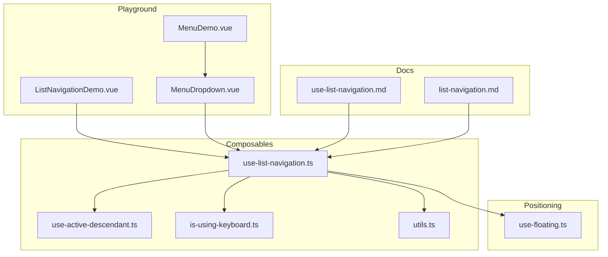
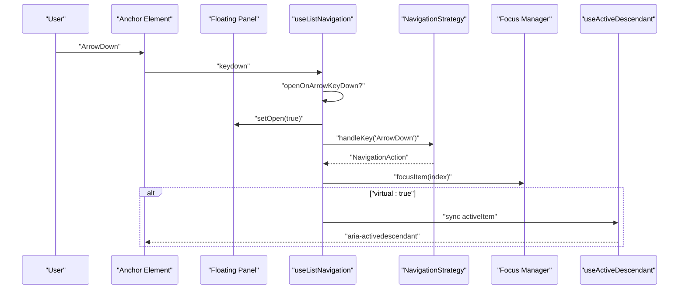
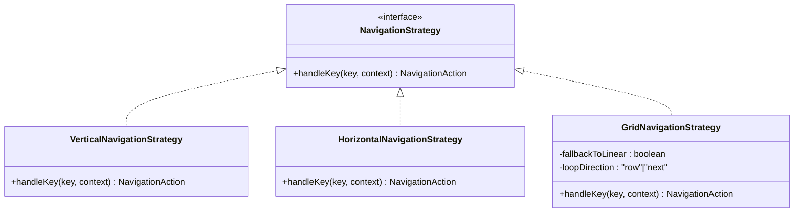
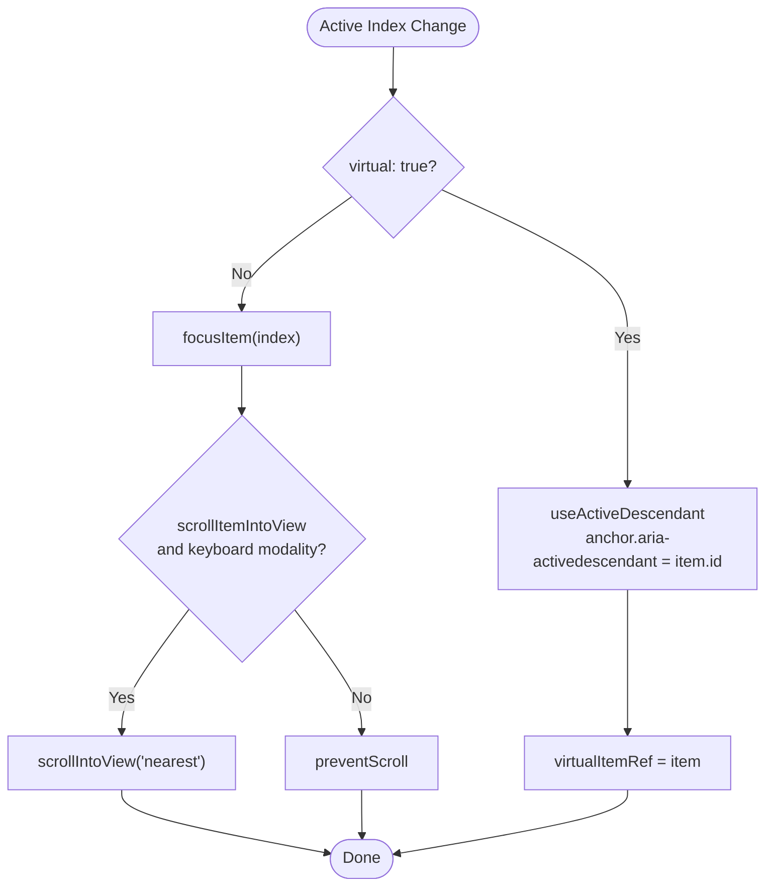
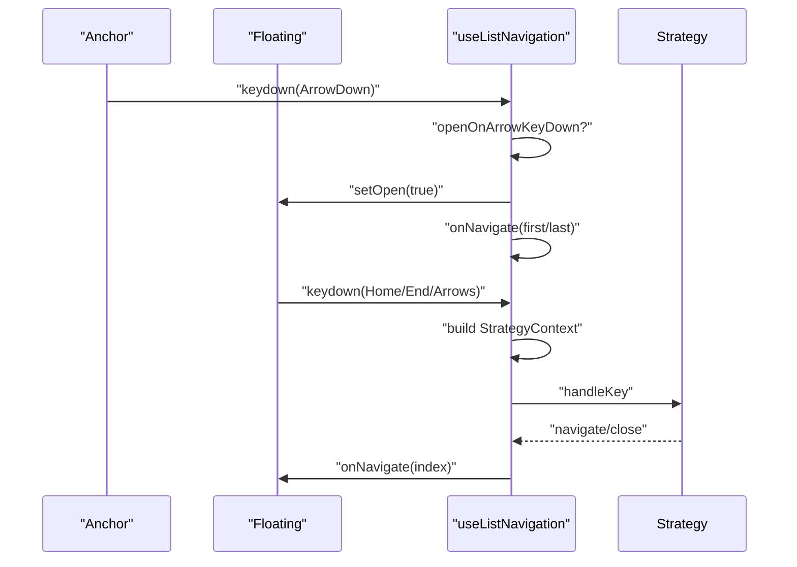
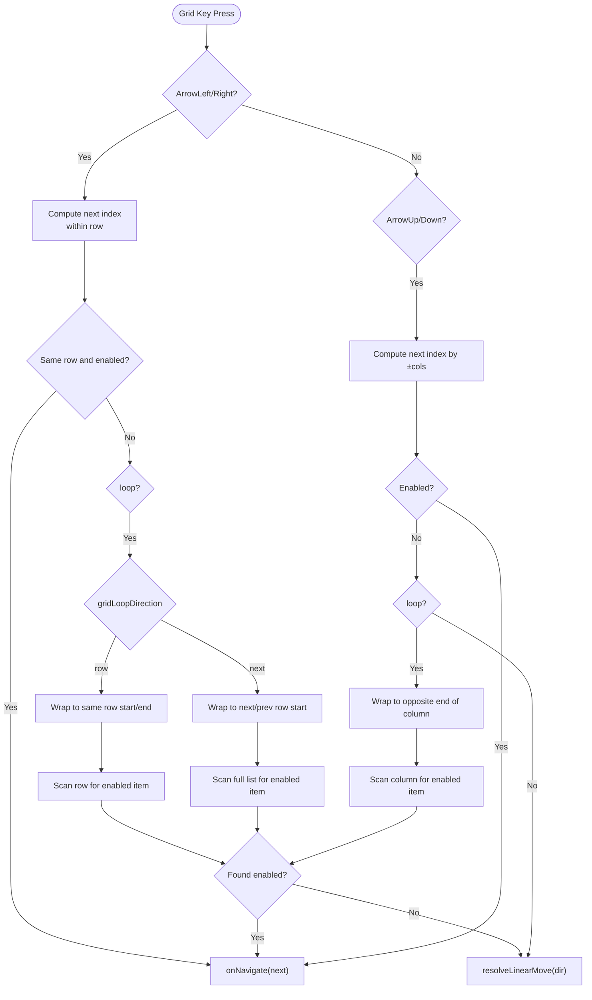
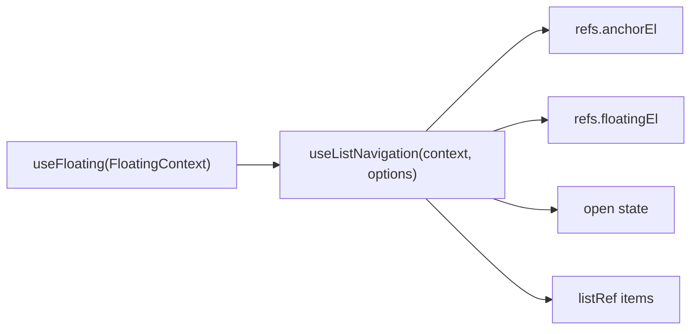
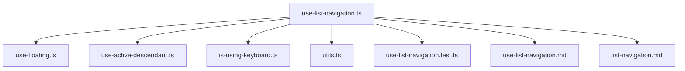

# List Navigation

<cite>
**Referenced Files in This Document**
- [use-list-navigation.ts](file://src/composables/interactions/use-list-navigation.ts)
- [use-active-descendant.ts](file://src/composables/utils/use-active-descendant.ts)
- [is-using-keyboard.ts](file://src/composables/utils/is-using-keyboard.ts)
- [utils.ts](file://src/utils.ts)
- [use-floating.ts](file://src/composables/positioning/use-floating.ts)
- [use-list-navigation.test.ts](file://src/composables/__tests__/use-list-navigation.test.ts)
- [use-list-navigation.md](file://docs/api/use-list-navigation.md)
- [list-navigation.md](file://docs/guide/list-navigation.md)
- [ListNavigationDemo.vue](file://playground/demo/ListNavigationDemo.vue)
- [MenuDropdown.vue](file://playground/components/MenuDropdown.vue)
- [MenuDemo.vue](file://playground/demo/MenuDemo.vue)
</cite>

## Table of Contents
1. [Introduction](#introduction)
2. [Project Structure](#project-structure)
3. [Core Components](#core-components)
4. [Architecture Overview](#architecture-overview)
5. [Detailed Component Analysis](#detailed-component-analysis)
6. [Dependency Analysis](#dependency-analysis)
7. [Performance Considerations](#performance-considerations)
8. [Troubleshooting Guide](#troubleshooting-guide)
9. [Conclusion](#conclusion)
10. [Appendices](#appendices)

## Introduction
This document provides a comprehensive guide to the list navigation composable used to implement keyboard-driven navigation for menus, listboxes, and grids within floating UI contexts. It covers the useListNavigation API, navigation strategies, focus management, virtual focus (aria-activedescendant), RTL support, nested navigation, grid navigation, and integration with the positioning system. Practical examples demonstrate searchable dropdowns, keyboard-navigable menus, and accessible list interfaces. Accessibility, performance, and virtual scrolling considerations are addressed.

## Project Structure
The list navigation functionality is implemented as a composable that integrates with the floating positioning system and utilities for accessibility and modality detection.

**Diagram sources**
- [use-list-navigation.ts:1-822](file://src/composables/interactions/use-list-navigation.ts#L1-L822)
- [use-active-descendant.ts:1-87](file://src/composables/utils/use-active-descendant.ts#L1-L87)
- [is-using-keyboard.ts:1-26](file://src/composables/utils/is-using-keyboard.ts#L1-L26)
- [utils.ts:1-222](file://src/utils.ts#L1-L222)
- [use-floating.ts:1-384](file://src/composables/positioning/use-floating.ts#L1-L384)
- [use-list-navigation.md:1-181](file://docs/api/use-list-navigation.md#L1-L181)
- [list-navigation.md:1-194](file://docs/guide/list-navigation.md#L1-L194)
- [ListNavigationDemo.vue:1-300](file://playground/demo/ListNavigationDemo.vue#L1-L300)
- [MenuDropdown.vue:1-92](file://playground/components/MenuDropdown.vue#L1-L92)
- [MenuDemo.vue:1-321](file://playground/demo/MenuDemo.vue#L1-L321)

**Section sources**
- [use-list-navigation.ts:1-822](file://src/composables/interactions/use-list-navigation.ts#L1-L822)
- [use-floating.ts:1-384](file://src/composables/positioning/use-floating.ts#L1-L384)
- [use-list-navigation.md:1-181](file://docs/api/use-list-navigation.md#L1-L181)
- [list-navigation.md:1-194](file://docs/guide/list-navigation.md#L1-L194)

## Core Components
- useListNavigation: The primary composable that wires keyboard navigation, focus management, and virtual focus for list-like structures inside floating panels.
- Navigation strategies: Vertical, horizontal, and grid strategies encapsulate key handling logic for different orientations and layouts.
- useActiveDescendant: Manages aria-activedescendant for virtual focus scenarios.
- isUsingKeyboard: Detects keyboard vs pointer modality to control scrolling and focus behavior.
- FloatingContext integration: Works with useFloating to coordinate open state, refs, and positioning.

Key capabilities:
- Arrow key navigation (up/down/left/right) with loop and boundary handling.
- Home/End support for jumping to first/last enabled items.
- Grid navigation with configurable columns and loop direction.
- Virtual focus (aria-activedescendant) for anchors that must retain focus (e.g., inputs).
- Nested navigation with cross-axis close behavior.
- RTL-aware horizontal navigation.
- Hover-to-focus and automatic focus on open.

**Section sources**
- [use-list-navigation.ts:326-449](file://src/composables/interactions/use-list-navigation.ts#L326-L449)
- [use-list-navigation.ts:74-285](file://src/composables/interactions/use-list-navigation.ts#L74-L285)
- [use-active-descendant.ts:1-87](file://src/composables/utils/use-active-descendant.ts#L1-L87)
- [is-using-keyboard.ts:1-26](file://src/composables/utils/is-using-keyboard.ts#L1-L26)

## Architecture Overview
The composable listens to keyboard events on both the anchor and floating elements, delegates to a strategy based on orientation, and manages focus either via DOM focus or aria-activedescendant depending on the virtual flag.

**Diagram sources**
- [use-list-navigation.ts:581-704](file://src/composables/interactions/use-list-navigation.ts#L581-L704)
- [use-active-descendant.ts:28-86](file://src/composables/utils/use-active-descendant.ts#L28-L86)

**Section sources**
- [use-list-navigation.ts:578-704](file://src/composables/interactions/use-list-navigation.ts#L578-L704)
- [use-active-descendant.ts:28-86](file://src/composables/utils/use-active-descendant.ts#L28-L86)

## Detailed Component Analysis

### API Surface and Options
The composable accepts a FloatingContext and a comprehensive options object controlling behavior, focus, and virtual focus.

Key options:
- listRef: Array of item elements in DOM order.
- activeIndex: Reactive index of the active item.
- onNavigate: Callback invoked when the active index changes.
- enabled: Enable/disable listeners.
- loop: Wrap navigation at boundaries.
- orientation: "vertical" | "horizontal" | "both".
- disabledIndices: Skipped indices.
- focusItemOnHover: Hover-to-focus behavior.
- openOnArrowKeyDown: Open panel on arrow key from anchor.
- scrollItemIntoView: Auto-scroll behavior.
- selectedIndex: Preferred index on open.
- focusItemOnOpen: Focus item on open ("auto" | true | false).
- nested: Cross-axis close behavior for nested lists.
- parentOrientation: Reserved for advanced nested semantics.
- rtl: Flip horizontal semantics for RTL.
- virtual: Virtual focus via aria-activedescendant.
- virtualItemRef: Populated with the active DOM element in virtual mode.
- cols: Grid columns for uniform grids.
- allowEscape: Allow navigating past ends to deselect in virtual mode.
- gridLoopDirection: "row" | "next" for horizontal grid wrapping.

Return value:
- cleanup: Function to remove event listeners.

**Section sources**
- [use-list-navigation.ts:326-449](file://src/composables/interactions/use-list-navigation.ts#L326-L449)
- [use-list-navigation.ts:447-450](file://src/composables/interactions/use-list-navigation.ts#L447-L450)
- [use-list-navigation.md:24-77](file://docs/api/use-list-navigation.md#L24-L77)

### Navigation Strategies
The composable defines three strategies:

- VerticalNavigationStrategy: Handles ArrowDown and ArrowUp; supports nested close via ArrowLeft/ArrowRight in RTL-aware manner.
- HorizontalNavigationStrategy: Handles ArrowRight/ArrowLeft with RTL flipping; supports nested close via ArrowUp.
- GridNavigationStrategy: Implements 2D navigation with rows and columns, configurable loop direction ("row" or "next"), and fallback to linear movement when needed.

**Diagram sources**
- [use-list-navigation.ts:38-40](file://src/composables/interactions/use-list-navigation.ts#L38-L40)
- [use-list-navigation.ts:74-103](file://src/composables/interactions/use-list-navigation.ts#L74-L103)
- [use-list-navigation.ts:105-285](file://src/composables/interactions/use-list-navigation.ts#L105-L285)

**Section sources**
- [use-list-navigation.ts:74-285](file://src/composables/interactions/use-list-navigation.ts#L74-L285)

### Focus Management and Virtual Focus
Focus management is split into two modes:

- DOM focus (default): The active item receives focus via element.focus(). Scrolling behavior respects keyboard modality.
- Virtual focus (aria-activedescendant): The anchor element retains focus; the active item is tracked via aria-activedescendant. The composable synchronizes an optional virtualItemRef.

**Diagram sources**
- [use-list-navigation.ts:557-573](file://src/composables/interactions/use-list-navigation.ts#L557-L573)
- [use-list-navigation.ts:779-797](file://src/composables/interactions/use-list-navigation.ts#L779-L797)
- [use-active-descendant.ts:28-86](file://src/composables/utils/use-active-descendant.ts#L28-L86)

**Section sources**
- [use-list-navigation.ts:557-573](file://src/composables/interactions/use-list-navigation.ts#L557-L573)
- [use-list-navigation.ts:779-797](file://src/composables/interactions/use-list-navigation.ts#L779-L797)
- [use-active-descendant.ts:28-86](file://src/composables/utils/use-active-descendant.ts#L28-L86)

### Keyboard Event Handling
The composable registers listeners on both anchor and floating elements:

- Anchor keydown: Opens the panel on arrow keys and determines initial active index based on orientation and last key pressed.
- Floating keydown: Handles Home/End, navigation keys, and nested close behavior. Delegates to the appropriate strategy.

**Diagram sources**
- [use-list-navigation.ts:581-670](file://src/composables/interactions/use-list-navigation.ts#L581-L670)

**Section sources**
- [use-list-navigation.ts:581-670](file://src/composables/interactions/use-list-navigation.ts#L581-L670)

### Grid Navigation Algorithm
Grid navigation supports:
- Columns: cols > 1 enables grid behavior.
- Loop direction: "row" wraps within the same row; "next" moves to the next/previous row.
- Vertical movement: ArrowUp/Down moves by ±cols.
- Horizontal movement: ArrowRight/Left moves within the row; wraps according to loop direction.
- Boundary handling: With loop=true, navigation wraps; with allowEscape and virtual, moving past ends can deselect.

**Diagram sources**
- [use-list-navigation.ts:105-285](file://src/composables/interactions/use-list-navigation.ts#L105-L285)

**Section sources**
- [use-list-navigation.ts:105-285](file://src/composables/interactions/use-list-navigation.ts#L105-L285)

### Accessibility and Screen Reader Announcements
- Roles: Use appropriate roles such as menu/menuitem, listbox/option.
- Virtual focus: Ensure each option has a stable id; the anchor receives aria-activedescendant pointing to the active option.
- Selected/current state: Consider aria-selected or aria-current for visual indicators.
- Focus rings: DOM focus mode preserves native focus rings; virtual focus keeps focus on the anchor.

**Section sources**
- [list-navigation.md:171-176](file://docs/guide/list-navigation.md#L171-L176)
- [use-active-descendant.ts:16-27](file://src/composables/utils/use-active-descendant.ts#L16-L27)

### Integration with Positioning System
The composable operates within a FloatingContext from useFloating, using refs for anchor and floating elements, and reacting to open state changes to focus items and manage scrolling.

**Diagram sources**
- [use-floating.ts:111-170](file://src/composables/positioning/use-floating.ts#L111-L170)
- [use-list-navigation.ts:451-477](file://src/composables/interactions/use-list-navigation.ts#L451-L477)

**Section sources**
- [use-floating.ts:111-170](file://src/composables/positioning/use-floating.ts#L111-L170)
- [use-list-navigation.ts:451-477](file://src/composables/interactions/use-list-navigation.ts#L451-L477)

### Practical Examples
- Basic vertical menu: Demonstrates loop, hover-to-focus, and open-on-arrow.
- Grid navigation: 4x4 uniform grid with both vertical and horizontal movement.
- Virtual focus: Combobox-style listbox where the input maintains focus.
- Disabled items: Skipping disabled indices during navigation.

These examples are implemented in the playground demo and component files.

**Section sources**
- [ListNavigationDemo.vue:1-300](file://playground/demo/ListNavigationDemo.vue#L1-L300)
- [MenuDropdown.vue:1-92](file://playground/components/MenuDropdown.vue#L1-L92)
- [MenuDemo.vue:1-321](file://playground/demo/MenuDemo.vue#L1-L321)

## Dependency Analysis
The composable depends on:
- FloatingContext for refs and open state.
- useActiveDescendant for virtual focus.
- isUsingKeyboard to suppress scrolling during pointer modality.
- Utils for element/type checks and event helpers.

**Diagram sources**
- [use-list-navigation.ts:1-16](file://src/composables/interactions/use-list-navigation.ts#L1-L16)
- [use-floating.ts:1-12](file://src/composables/positioning/use-floating.ts#L1-L12)
- [use-active-descendant.ts:1-6](file://src/composables/utils/use-active-descendant.ts#L1-L6)
- [is-using-keyboard.ts:1-3](file://src/composables/utils/is-using-keyboard.ts#L1-L3)
- [utils.ts:1-3](file://src/utils.ts#L1-L3)
- [use-list-navigation.test.ts:1-6](file://src/composables/__tests__/use-list-navigation.test.ts#L1-L6)
- [use-list-navigation.md:1-3](file://docs/api/use-list-navigation.md#L1-L3)
- [list-navigation.md:1-3](file://docs/guide/list-navigation.md#L1-L3)

**Section sources**
- [use-list-navigation.ts:1-16](file://src/composables/interactions/use-list-navigation.ts#L1-L16)
- [use-list-navigation.test.ts:1-6](file://src/composables/__tests__/use-list-navigation.test.ts#L1-L6)

## Performance Considerations
- Scrolling suppression: When pointer modality is active, scrolling is suppressed to avoid jank; use focusItemOnOpen to force initial scroll if needed.
- Stable listRef: Keep listRef in DOM order and avoid reindexing across renders.
- Large lists: Prefer virtualization techniques (e.g., virtual scrolling) to limit DOM nodes; the composable supports virtual focus and deselection via allowEscape to reduce heavy DOM updates.
- Event listeners: Use cleanup to remove listeners when the composable is no longer needed.

**Section sources**
- [list-navigation.md:177-181](file://docs/guide/list-navigation.md#L177-L181)
- [use-list-navigation.ts:566-573](file://src/composables/interactions/use-list-navigation.ts#L566-L573)
- [use-list-navigation.ts:799-800](file://src/composables/interactions/use-list-navigation.ts#L799-L800)

## Troubleshooting Guide
Common issues and resolutions:
- Active item not scrolling: Ensure scrollItemIntoView is enabled and not suppressed by pointer modality; use focusItemOnOpen to force initial scroll.
- Virtual focus not working: Ensure the anchor is focusable and each item has a stable id; the composable requires ids for aria-activedescendant.
- Nested close not triggering: Set nested: true and wire parent/child nodes via useFloatingTree.
- Disabled items not skipped: Provide disabledIndices as an array or predicate; the strategy scans for enabled items.

**Section sources**
- [list-navigation.md:182-186](file://docs/guide/list-navigation.md#L182-L186)
- [use-list-navigation.test.ts:192-200](file://src/composables/__tests__/use-list-navigation.test.ts#L192-L200)
- [use-list-navigation.test.ts:202-237](file://src/composables/__tests__/use-list-navigation.test.ts#L202-L237)

## Conclusion
The list navigation composable provides a robust, accessible, and flexible solution for keyboard-driven navigation in floating UI contexts. It supports multiple navigation strategies, virtual focus, RTL, nested menus, and grid layouts. By integrating with the positioning system and utilities for modality detection, it delivers a seamless user experience across diverse interactive components.

## Appendices

### API Reference Summary
- useListNavigation(context, options): Adds keyboard navigation to floating lists/grids.
- Options include listRef, activeIndex, onNavigate, enabled, loop, orientation, disabledIndices, focusItemOnHover, openOnArrowKeyDown, scrollItemIntoView, selectedIndex, focusItemOnOpen, nested, parentOrientation, rtl, virtual, virtualItemRef, cols, allowEscape, gridLoopDirection.
- Return: cleanup function to remove listeners.

**Section sources**
- [use-list-navigation.md:7-81](file://docs/api/use-list-navigation.md#L7-L81)

### Example Implementations
- Basic vertical menu: [ListNavigationDemo.vue:23-31](file://playground/demo/ListNavigationDemo.vue#L23-L31)
- Grid navigation: [ListNavigationDemo.vue:52-61](file://playground/demo/ListNavigationDemo.vue#L52-L61)
- Virtual focus: [ListNavigationDemo.vue:83-92](file://playground/demo/ListNavigationDemo.vue#L83-L92)
- Disabled items: [ListNavigationDemo.vue:114-122](file://playground/demo/ListNavigationDemo.vue#L114-L122)
- Menu integration: [MenuDropdown.vue:50-72](file://playground/components/MenuDropdown.vue#L50-L72)

**Section sources**
- [ListNavigationDemo.vue:1-300](file://playground/demo/ListNavigationDemo.vue#L1-L300)
- [MenuDropdown.vue:1-92](file://playground/components/MenuDropdown.vue#L1-L92)