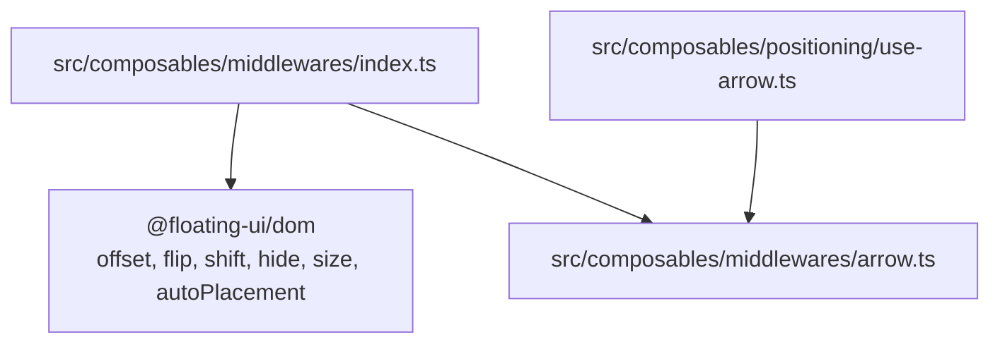
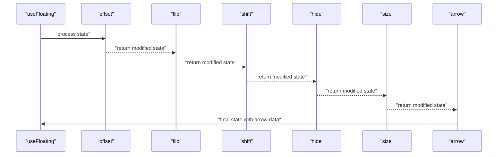
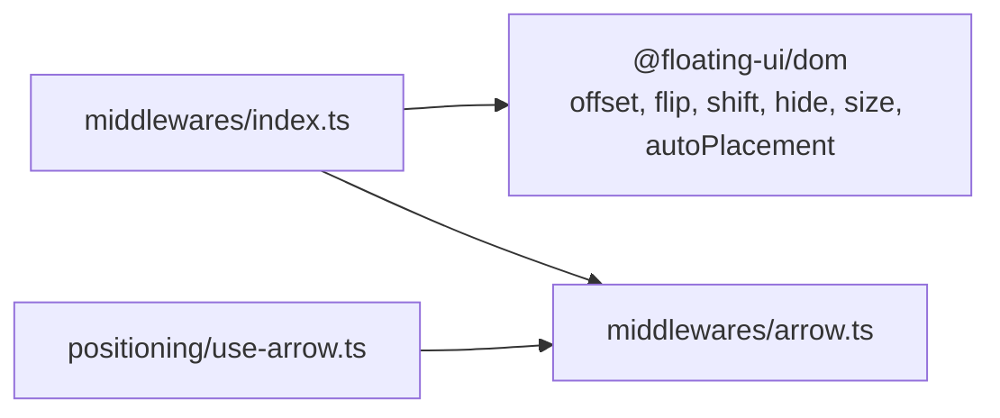

# Built-in Middleware

<cite>
**Referenced Files in This Document**
- [index.ts](file://src/composables/middlewares/index.ts)
- [arrow.ts](file://src/composables/middlewares/arrow.ts)
- [use-arrow.ts](file://src/composables/positioning/use-arrow.ts)
- [offset.md](file://docs/api/offset.md)
- [flip.md](file://docs/api/flip.md)
- [shift.md](file://docs/api/shift.md)
- [hide.md](file://docs/api/hide.md)
- [size.md](file://docs/api/size.md)
- [middleware.md](file://docs/guide/middleware.md)
- [WithMiddleware.vue](file://docs/demos/use-floating/WithMiddleware.vue)
- [ArrowDemo.vue](file://playground/demo/ArrowDemo.vue)
- [ArrowAutoDemo.vue](file://playground/demo/ArrowAutoDemo.vue)
- [autoPlacement.md](file://docs/api/autoPlacement.md)
</cite>

## Table of Contents
1. [Introduction](#introduction)
2. [Project Structure](#project-structure)
3. [Core Components](#core-components)
4. [Architecture Overview](#architecture-overview)
5. [Detailed Component Analysis](#detailed-component-analysis)
6. [Dependency Analysis](#dependency-analysis)
7. [Performance Considerations](#performance-considerations)
8. [Troubleshooting Guide](#troubleshooting-guide)
9. [Conclusion](#conclusion)

## Introduction
This document describes the built-in middleware collection available in the VFloat library. It focuses on positioning modifiers that adjust floating element placement, visibility, size, and arrow alignment. The covered middleware includes offset, flip, shift, hide, size, and arrow. Practical examples, configuration options, and recommended ordering are provided to help you build robust floating UI experiences.

## Project Structure
The middleware exports are centralized and re-exported from the middlewares index. The arrow middleware is implemented locally and integrates with the useArrow composable for convenient arrow positioning.

**Diagram sources**
- [index.ts:1-4](file://src/composables/middlewares/index.ts#L1-L4)
- [arrow.ts:1-51](file://src/composables/middlewares/arrow.ts#L1-L51)
- [use-arrow.ts:1-130](file://src/composables/positioning/use-arrow.ts#L1-L130)

**Section sources**
- [index.ts:1-4](file://src/composables/middlewares/index.ts#L1-L4)

## Core Components
- offset: Adds spacing around floating elements along main, cross, and alignment axes.
- flip: Switches placement to keep the floating element within boundaries.
- shift: Adjusts the floating element’s position to remain visible within boundaries.
- hide: Provides data to hide the floating element when it becomes detached or clipped.
- size: Computes available space and optionally resizes the floating element.
- arrow: Positions an arrow element pointing to the reference with optional padding.

These are exported from the middlewares index and integrated with the useFloating composable via the middlewares array.

**Section sources**
- [index.ts:1-4](file://src/composables/middlewares/index.ts#L1-L4)
- [middleware.md:15-132](file://docs/guide/middleware.md#L15-L132)

## Architecture Overview
The middleware pipeline runs in sequence during positioning. Each middleware can read and modify the current state and pass it forward. The arrow middleware relies on the useArrow composable to compute arrow styles and coordinates.

**Diagram sources**
- [index.ts:1-4](file://src/composables/middlewares/index.ts#L1-L4)
- [use-arrow.ts:68-130](file://src/composables/positioning/use-arrow.ts#L68-L130)

## Detailed Component Analysis

### offset
Purpose
- Applies spacing between the reference and floating elements along the main, cross, and alignment axes.

Key options
- mainAxis: Distance along the placement direction.
- crossAxis: Distance perpendicular to the placement direction.
- alignmentAxis: Overrides crossAxis for aligned placements (e.g., top-start).

Common parameter combinations
- Numeric value for simple spacing along the main axis.
- Object form to set mainAxis and crossAxis independently.
- Dynamic function returning a value or object based on placement and rects.

Practical examples
- Numeric offset: [offset.md:50-60](file://docs/api/offset.md#L50-L60)
- Object form: [offset.md:62-77](file://docs/api/offset.md#L62-L77)
- Alignment axis override: [offset.md:79-95](file://docs/api/offset.md#L79-L95)
- Dynamic offset: [offset.md:97-117](file://docs/api/offset.md#L97-L117)

Notes
- Axis directions depend on placement (main/cross/alignment).
- Works well with flip and shift to fine-tune spacing.

**Section sources**
- [offset.md:1-123](file://docs/api/offset.md#L1-L123)
- [middleware.md:19-35](file://docs/guide/middleware.md#L19-L35)

### flip
Purpose
- Automatically switches placement when the floating element would overflow its boundary.

Key options
- mainAxis: Enable flipping on the main axis.
- crossAxis: Enable flipping on the cross axis or align to 'alignment'.
- fallbackAxisSideDirection: Preferred side when both axes fail.
- flipAlignment: Allow flipping alignment (e.g., start to end).
- fallbackPlacements: Ordered list of alternative placements to try.
- fallbackStrategy: Strategy when all placements fail ('bestFit' or 'initialPlacement').

Common parameter combinations
- Default flip for basic overflow prevention.
- Custom fallbackPlacements to prioritize specific sides.
- Combined with padding and boundary controls.

Practical examples
- Basic usage: [flip.md:35-44](file://docs/api/flip.md#L35-L44)
- Custom fallback placements: [flip.md:47-61](file://docs/api/flip.md#L47-L61)

Notes
- Often paired with shift to refine final position.
- Can be combined with autoPlacement for automatic best-fit placement.

**Section sources**
- [flip.md:1-67](file://docs/api/flip.md#L1-L67)
- [autoPlacement.md:1-90](file://docs/api/autoPlacement.md#L1-L90)
- [middleware.md:37-53](file://docs/guide/middleware.md#L37-L53)

### shift
Purpose
- Adjusts the floating element along axes to keep it within boundaries.

Key options
- mainAxis: Enable shifting on the main axis.
- crossAxis: Enable shifting on the cross axis.
- limiter: Function to constrain shifting behavior.
- padding: Additional padding from boundaries.
- boundary/rootBoundary: Clipping and root boundaries.
- elementContext/altBoundary: Control which element and boundary are considered.

Common parameter combinations
- Basic shift with padding.
- Enable cross-axis shifting for lateral corrections.
- Combine with limiter to preserve placement intent.

Practical examples
- Basic usage: [shift.md:42-52](file://docs/api/shift.md#L42-L52)
- With padding: [shift.md:54-66](file://docs/api/shift.md#L54-L66)
- With cross axis: [shift.md:68-82](file://docs/api/shift.md#L68-L82)

Notes
- Typically used after flip to finalize position within viewport.
- Use limiter to avoid extreme shifts when boundaries are tight.

**Section sources**
- [shift.md:1-89](file://docs/api/shift.md#L1-L89)
- [middleware.md:55-71](file://docs/guide/middleware.md#L55-L71)

### hide
Purpose
- Provides data to hide the floating element when it is detached from the reference or clipped by boundaries.

Key options
- strategy: 'referenceHidden' (detect hidden reference) or 'escaped' (detect floating element outside reference clipping).
- padding/boundary/rootBoundary: Boundary configuration.
- elementContext/altBoundary: Which element and boundary to test.

Return value
- middlewareData.hide with referenceHidden or escaped flags.

Common parameter combinations
- Default strategy with referenceHidden.
- Escaped strategy for detecting when floating element escapes clipping context.

Practical examples
- Basic usage: [hide.md:51-73](file://docs/api/hide.md#L51-L73)
- Escaped strategy: [hide.md:75-87](file://docs/api/hide.md#L75-L87)

Notes
- Use computed visibility based on middlewareData.hide to toggle display.
- Often combined with shift/flip to minimize clipping.

**Section sources**
- [hide.md:1-93](file://docs/api/hide.md#L1-L93)
- [middleware.md:121-132](file://docs/guide/middleware.md#L121-L132)

### size
Purpose
- Computes available space and optionally resizes the floating element to fit within boundaries.

Key options
- apply(state): Callback to apply constraints (e.g., max-width/height).
- padding/boundary/rootBoundary: Boundary configuration.
- elementContext/altBoundary: Which element and boundary to measure against.

Return value
- SizeState with availableWidth, availableHeight and elements.

Common parameter combinations
- Apply max-width/max-height based on available space.
- Match reference width for consistent layout.

Practical examples
- Basic usage with apply: [size.md:44-63](file://docs/api/size.md#L44-L63)
- Match reference width: [size.md:65-82](file://docs/api/size.md#L65-L82)

Notes
- Use availableWidth/availableHeight to constrain content.
- Often combined with shift/flip to ensure sufficient space.

**Section sources**
- [size.md:1-88](file://docs/api/size.md#L1-L88)
- [middleware.md:89-106](file://docs/guide/middleware.md#L89-L106)

### arrow
Purpose
- Positions an arrow element pointing to the reference with optional padding and element reference.

Key options
- element: Ref to the arrow DOM element.
- padding: Padding to prevent the arrow from reaching the floating element’s edge.

Integration with useArrow
- useArrow computes arrow styles and coordinates based on middlewareData.arrow and placement.
- Supports offset configuration for arrow positioning relative to the floating edge.

Common parameter combinations
- Provide arrow element ref and padding.
- Combine with offset in the middleware stack for spacing.

Practical examples
- Manual arrow middleware registration: [ArrowDemo.vue:19-27](file://playground/demo/ArrowDemo.vue#L19-L27)
- Auto-registration with useArrow: [ArrowAutoDemo.vue:16-25](file://playground/demo/ArrowAutoDemo.vue#L16-L25)
- Arrow composable usage: [use-arrow.md:51-89](file://docs/api/use-arrow.md#L51-L89)

Notes
- The arrow middleware is often auto-registered when using useArrow with an element ref.
- Ensure the arrow element is rendered inside the floating container for correct positioning.

**Section sources**
- [arrow.ts:1-51](file://src/composables/middlewares/arrow.ts#L1-L51)
- [use-arrow.ts:1-130](file://src/composables/positioning/use-arrow.ts#L1-L130)
- [use-arrow.md:1-107](file://docs/api/use-arrow.md#L1-L107)
- [ArrowDemo.vue:1-58](file://playground/demo/ArrowDemo.vue#L1-L58)
- [ArrowAutoDemo.vue:1-100](file://playground/demo/ArrowAutoDemo.vue#L1-L100)

## Dependency Analysis
The middleware exports are re-exported from the middlewares index, which aggregates Floating UI built-ins and the local arrow implementation. The useArrow composable depends on the arrow middleware data and placement to compute styles.

**Diagram sources**
- [index.ts:1-4](file://src/composables/middlewares/index.ts#L1-L4)
- [arrow.ts:1-51](file://src/composables/middlewares/arrow.ts#L1-L51)
- [use-arrow.ts:1-130](file://src/composables/positioning/use-arrow.ts#L1-L130)

**Section sources**
- [index.ts:1-4](file://src/composables/middlewares/index.ts#L1-L4)

## Performance Considerations
- Order matters: Place offset early to establish baseline spacing, followed by flip and shift to resolve collisions, then size and hide to adapt content and visibility, and finally arrow to position the indicator.
- Minimize redundant recalculations: Prefer reactive options and avoid unnecessary middleware churn.
- Use limiter with shift to prevent excessive movement and maintain perceived stability.
- Limit fallbackPlacements to reduce placement evaluation overhead.
- Avoid overly aggressive padding that forces frequent reflows.

## Troubleshooting Guide
- Arrow not visible or misaligned
  - Ensure the arrow element is provided to useArrow and rendered within the floating container.
  - Verify middlewareData.arrow is present and arrowStyles are applied.
  - Check padding and offset values to avoid pushing the arrow outside the floating bounds.
  - Reference: [use-arrow.md:51-89](file://docs/api/use-arrow.md#L51-L89), [ArrowAutoDemo.vue:16-25](file://playground/demo/ArrowAutoDemo.vue#L16-L25)

- Floating element clipped or cut off
  - Increase padding in shift and hide options.
  - Enable crossAxis shifting and consider a limiter.
  - Reference: [shift.md:68-82](file://docs/api/shift.md#L68-L82), [hide.md:75-87](file://docs/api/hide.md#L75-L87)

- Excessive placement flipping
  - Narrow fallbackPlacements or disable crossAxis flipping.
  - Reference: [flip.md:47-61](file://docs/api/flip.md#L47-L61)

- Content overflow despite size middleware
  - Ensure apply callback sets max-width/height and internal overflow handling.
  - Reference: [size.md:44-63](file://docs/api/size.md#L44-L63)

- Middleware ordering issues
  - Follow the recommended order: offset → flip → shift → size/hide → arrow.
  - Reference: [middleware.md:144-164](file://docs/guide/middleware.md#L144-L164)

## Conclusion
The VFloat middleware collection provides a flexible, composable pipeline for precise floating element positioning. By understanding each middleware’s role and combining them thoughtfully, you can achieve reliable, adaptive layouts that respect boundaries, maintain readability, and provide clear directional indicators with arrows.