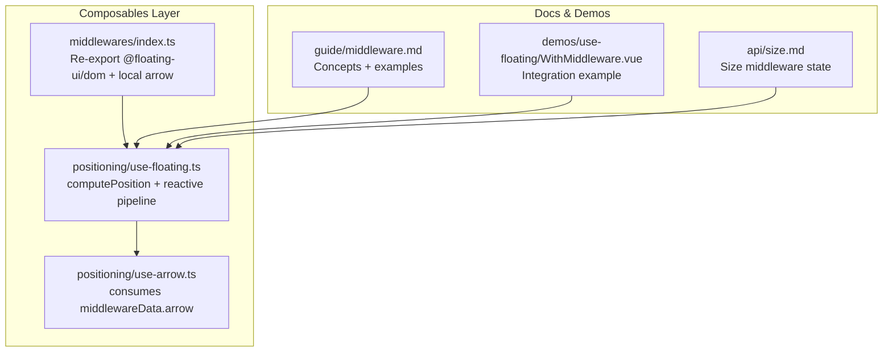
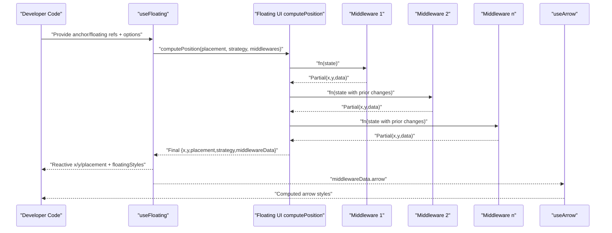
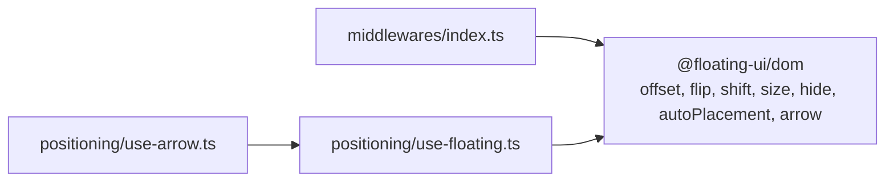
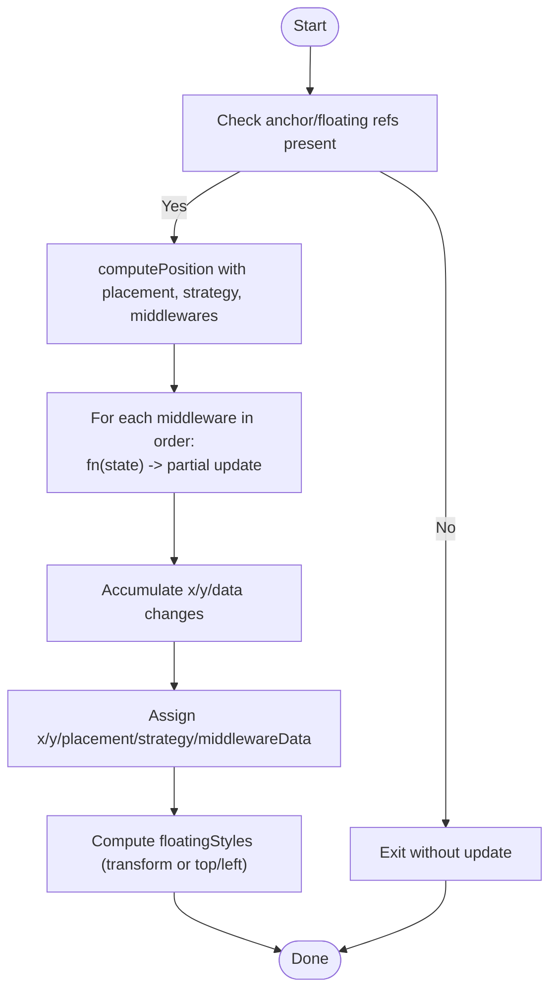

# Custom Middleware Development

<cite>
**Referenced Files in This Document**
- [middleware.md](file://docs/guide/middleware.md)
- [index.ts](file://src/composables/middlewares/index.ts)
- [arrow.ts](file://src/composables/middlewares/arrow.ts)
- [use-floating.ts](file://src/composables/positioning/use-floating.ts)
- [use-arrow.ts](file://src/composables/positioning/use-arrow.ts)
- [index.ts](file://src/composables/positioning/index.ts)
- [WithMiddleware.vue](file://docs/demos/use-floating/WithMiddleware.vue)
- [size.md](file://docs/api/size.md)
- [types.ts](file://src/types.ts)
</cite>

## Table of Contents
1. [Introduction](#introduction)
2. [Project Structure](#project-structure)
3. [Core Components](#core-components)
4. [Architecture Overview](#architecture-overview)
5. [Detailed Component Analysis](#detailed-component-analysis)
6. [Dependency Analysis](#dependency-analysis)
7. [Performance Considerations](#performance-considerations)
8. [Troubleshooting Guide](#troubleshooting-guide)
9. [Conclusion](#conclusion)
10. [Appendices](#appendices)

## Introduction
This document explains how to develop custom middleware for the VFloat positioning system. It covers the middleware interface shape, the execution pipeline, the arguments and return types, and practical patterns for building middleware that transforms positioning calculations. It also documents how to share computed data between middleware stages, how to integrate with existing middleware chains, and how to optimize performance and test your middleware effectively.

## Project Structure
VFloat exposes middleware via re-exports from the composables layer and integrates them into the positioning pipeline through a composable that computes final floating styles. The key areas for middleware development are:
- Middleware exports and built-in implementations
- The positioning composable that orchestrates middleware execution
- Arrow composable that consumes middleware data
- Documentation and demos that illustrate middleware usage

**Diagram sources**
- [index.ts:1-4](file://src/composables/middlewares/index.ts#L1-L4)
- [use-floating.ts:1-384](file://src/composables/positioning/use-floating.ts#L1-L384)
- [use-arrow.ts:1-130](file://src/composables/positioning/use-arrow.ts#L1-L130)
- [middleware.md:1-230](file://docs/guide/middleware.md#L1-L230)
- [WithMiddleware.vue:1-55](file://docs/demos/use-floating/WithMiddleware.vue#L1-L55)
- [size.md:1-63](file://docs/api/size.md#L1-L63)

**Section sources**
- [index.ts:1-4](file://src/composables/middlewares/index.ts#L1-L4)
- [use-floating.ts:1-384](file://src/composables/positioning/use-floating.ts#L1-L384)
- [use-arrow.ts:1-130](file://src/composables/positioning/use-arrow.ts#L1-L130)
- [middleware.md:1-230](file://docs/guide/middleware.md#L1-L230)
- [WithMiddleware.vue:1-55](file://docs/demos/use-floating/WithMiddleware.vue#L1-L55)
- [size.md:1-63](file://docs/api/size.md#L1-L63)

## Core Components
- Middleware interface shape: A middleware object has a name and a fn function that receives a state-like argument and returns a partial coordinate update. The documentation describes the signature and shows a minimal example.
- Built-in arrow middleware: Demonstrates how to wrap a Floating UI middleware while preserving reactive options and safely handling missing DOM references.
- Positioning pipeline: The useFloating composable orchestrates computePosition, updates reactive state, and exposes middlewareData for downstream consumers.
- Arrow composable: Reads middlewareData.arrow to compute arrow placement styles.

Key takeaways for custom middleware authors:
- Name your middleware for traceability.
- Keep fn pure and deterministic given the input state.
- Return only the fields you intend to change (x, y, data).
- Use middlewareData to pass computed values to later stages or consumers.

**Section sources**
- [middleware.md:166-192](file://docs/guide/middleware.md#L166-L192)
- [arrow.ts:36-50](file://src/composables/middlewares/arrow.ts#L36-L50)
- [use-floating.ts:244-265](file://src/composables/positioning/use-floating.ts#L244-L265)
- [use-arrow.ts:80-89](file://src/composables/positioning/use-arrow.ts#L80-L89)

## Architecture Overview
The middleware execution pipeline is a linear chain where each middleware receives the current state and can modify it. The final result is fed into the positioning engine and then into the UI.

**Diagram sources**
- [use-floating.ts:244-265](file://src/composables/positioning/use-floating.ts#L244-L265)
- [use-arrow.ts:74-81](file://src/composables/positioning/use-arrow.ts#L74-L81)
- [middleware.md:144-164](file://docs/guide/middleware.md#L144-L164)

**Section sources**
- [use-floating.ts:244-265](file://src/composables/positioning/use-floating.ts#L244-L265)
- [middleware.md:144-164](file://docs/guide/middleware.md#L144-L164)

## Detailed Component Analysis

### Middleware Interface and Execution Model
- Interface shape: A middleware object has a name and a fn(state) -> MiddlewareReturn signature. The documentation provides the TypeScript definition and a simple example.
- Execution order: Middleware runs in sequence; each stage receives the state modified by the previous stage.
- Return semantics: Returning a partial coordinate object updates x and y; returning a data field stores arbitrary data for later stages or consumers.

Practical implications:
- Order matters: Place offset before flip/shift; place arrow last so it can read final arrow data.
- Data sharing: Use the data field to pass computed values forward (e.g., custom metrics, flags).

**Section sources**
- [middleware.md:166-192](file://docs/guide/middleware.md#L166-L192)
- [middleware.md:144-164](file://docs/guide/middleware.md#L144-L164)

### MiddlewareArgs and MiddlewareReturn
- MiddlewareArgs: The documentation’s example signature uses a state-like object with x, y, rects. In practice, the underlying library’s state includes more fields (placement, strategy, middlewareData, rects, elements, initialPlacement). Custom middleware can read these to inform decisions.
- MiddlewareReturn: Should be a partial coordinate update (x, y) plus optional data. The size middleware documentation shows a state extension that includes availableWidth/availableHeight and elements, demonstrating how middleware can augment state for consumers.

Guidance:
- Read-only access to contextual data (rects, elements, placement) to inform transformations.
- Write only what you need; avoid mutating unrelated fields.
- Use data to pass computed values to downstream middleware or consumers.

**Section sources**
- [middleware.md:166-192](file://docs/guide/middleware.md#L166-L192)
- [size.md:23-31](file://docs/api/size.md#L23-L31)

### Middleware Composition Patterns
- Combining middleware: The documentation demonstrates chaining offset, flip, shift, and arrow. Order determines precedence.
- Reactive options: Since VFloat is Vue-based, middleware options can be reactive refs/computed, enabling dynamic adjustments without reconstructing the middleware array.

Integration tips:
- Build a computed middlewares array that reacts to reactive inputs.
- Avoid recreating middleware instances unnecessarily; reuse stable instances when options are static.

**Section sources**
- [middleware.md:144-164](file://docs/guide/middleware.md#L144-L164)
- [middleware.md:194-218](file://docs/guide/middleware.md#L194-L218)

### Built-in Arrow Middleware Pattern
The arrow middleware wraps the Floating UI arrow middleware and:
- Accepts a reactive element ref and optional padding.
- Returns early with an empty object if the element is unavailable.
- Delegates to the underlying Floating UI arrow middleware when ready.

This pattern is ideal for custom middleware:
- Guard against missing DOM.
- Use reactive options via toValue.
- Delegate to established middleware when applicable.

**Section sources**
- [arrow.ts:36-50](file://src/composables/middlewares/arrow.ts#L36-L50)

### Positioning Pipeline and Data Flow
The useFloating composable:
- Watches placement, strategy, and middlewares to trigger recomputation.
- Calls computePosition with the current anchor, floating element, and middleware array.
- Updates reactive x/y, placement, strategy, middlewareData, and floatingStyles.
- Exposes update to manually trigger recalculation.

Data flow highlights:
- Inputs: anchorEl, floatingEl, placement, strategy, middlewares.
- Outputs: x, y, placement, strategy, middlewareData, floatingStyles.
- Consumers: UI rendering and composable integrations like useArrow.

**Section sources**
- [use-floating.ts:244-265](file://src/composables/positioning/use-floating.ts#L244-L265)
- [use-floating.ts:305-343](file://src/composables/positioning/use-floating.ts#L305-L343)

### Arrow Composable and MiddlewareData Consumption
The useArrow composable:
- Reads middlewareData.arrow.x/y.
- Computes arrowStyles based on placement side and arrow offset.
- Reactively updates styles when middlewareData or arrow element changes.

This demonstrates how consumers can read and act on middleware-provided data.

**Section sources**
- [use-arrow.ts:80-89](file://src/composables/positioning/use-arrow.ts#L80-L89)
- [use-arrow.ts:83-122](file://src/composables/positioning/use-arrow.ts#L83-L122)

### Practical Examples

#### Example 1: Simple Transformation Middleware
- Goal: Shift the floating element horizontally by a fixed amount.
- Implementation pattern: Return { x: x + delta, y }.
- Notes: Keep the function pure and idempotent when applied multiple times.

Reference example signature and pattern:
- [middleware.md:177-191](file://docs/guide/middleware.md#L177-L191)

#### Example 2: Conditional Adjustment Based on Rects
- Goal: Adjust y when the reference rect indicates a constrained viewport region.
- Implementation pattern: Inspect rects.reference and conditionally return a modified y.
- Notes: Use only the fields you need; avoid heavy computations.

#### Example 3: Data Sharing Between Stages
- Goal: Compute a derived metric in stage 1 and consume it in stage 2.
- Implementation pattern: Return { data: { metric } } from stage 1; read metric in stage 2 and adjust x/y accordingly.
- Notes: Keep data keys namespaced to avoid collisions.

#### Example 4: Integration with Existing Chains
- Goal: Add a custom middleware to the demo chain (offset → flip → shift → arrow).
- Implementation pattern: Push your middleware into the middlewares array before calling useFloating.
- Reference integration:
  - [WithMiddleware.vue:9-24](file://docs/demos/use-floating/WithMiddleware.vue#L9-L24)

**Section sources**
- [middleware.md:177-191](file://docs/guide/middleware.md#L177-L191)
- [WithMiddleware.vue:9-24](file://docs/demos/use-floating/WithMiddleware.vue#L9-L24)

## Dependency Analysis
- Re-exports: The middlewares index re-exports @floating-ui/dom primitives and local arrow middleware, exposing them through the VFloat API surface.
- Positioning depends on Floating UI computePosition and autoUpdate.
- Arrow composable depends on middlewareData.arrow produced by arrow middleware.

**Diagram sources**
- [index.ts:1-4](file://src/composables/middlewares/index.ts#L1-L4)
- [use-floating.ts:1-12](file://src/composables/positioning/use-floating.ts#L1-L12)
- [use-arrow.ts:1-3](file://src/composables/positioning/use-arrow.ts#L1-L3)

**Section sources**
- [index.ts:1-4](file://src/composables/middlewares/index.ts#L1-L4)
- [use-floating.ts:1-12](file://src/composables/positioning/use-floating.ts#L1-L12)
- [use-arrow.ts:1-3](file://src/composables/positioning/use-arrow.ts#L1-L3)

## Performance Considerations
- Avoid unnecessary recalculations:
  - Keep middleware functions pure and fast.
  - Memoize expensive computations keyed by inputs (e.g., cached rects or computed metrics).
- Minimize DOM reads/writes:
  - Batch DOM measurements and avoid synchronous layout thrashing.
- Reactive options:
  - Prefer computed middlewares arrays and stable middleware instances when options are static.
- Device pixel rounding:
  - The positioning pipeline rounds to DPR to reduce visual jitter; leverage this to avoid micro-adjustments.

[No sources needed since this section provides general guidance]

## Troubleshooting Guide
- Middleware errors:
  - The positioning pipeline catches and logs errors during computePosition, ensuring graceful degradation.
  - Reference: [use-floating.ts:260-264](file://src/composables/positioning/use-floating.ts#L260-L264)
- Missing arrow element:
  - The arrow middleware returns early when the arrow element is null; ensure refs are attached before open state triggers updates.
  - Reference: [arrow.ts:43-45](file://src/composables/middlewares/arrow.ts#L43-L45)
- Verifying middlewareData:
  - Confirm that middlewareData is populated after a successful update cycle.
  - Reference: [use-floating.ts:258-259](file://src/composables/positioning/use-floating.ts#L258-L259)

**Section sources**
- [use-floating.ts:260-264](file://src/composables/positioning/use-floating.ts#L260-L264)
- [arrow.ts:43-45](file://src/composables/middlewares/arrow.ts#L43-L45)
- [use-floating.ts:258-259](file://src/composables/positioning/use-floating.ts#L258-L259)

## Conclusion
Custom middleware in VFloat follows a straightforward, composable pattern: define a name and a pure fn that reads the current state and returns partial updates plus optional data. The execution pipeline is deterministic and reactive, enabling robust integration with existing middleware chains. By adhering to performance best practices and leveraging reactive options, you can build efficient, maintainable middleware that enhances positioning behavior across diverse UI scenarios.

[No sources needed since this section summarizes without analyzing specific files]

## Appendices

### Appendix A: Middleware Execution Flow (Algorithm)

**Diagram sources**
- [use-floating.ts:244-265](file://src/composables/positioning/use-floating.ts#L244-L265)
- [use-floating.ts:305-343](file://src/composables/positioning/use-floating.ts#L305-L343)