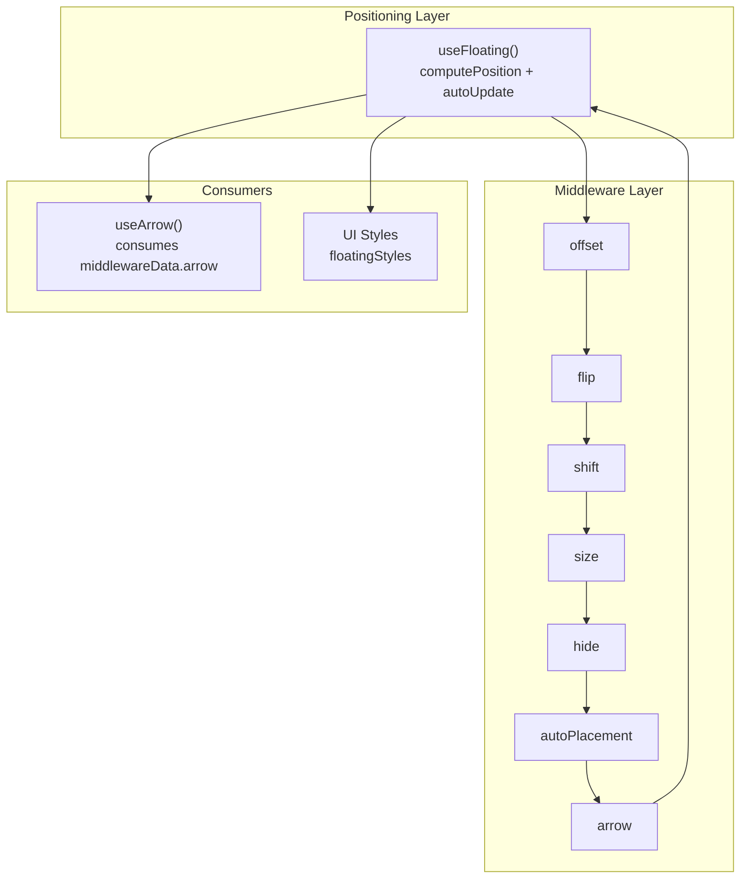
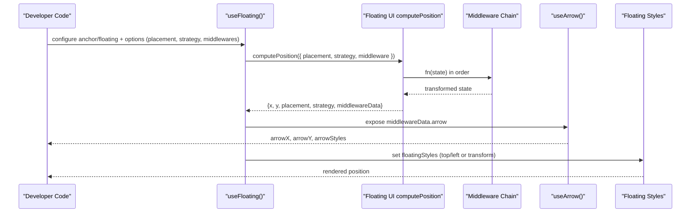
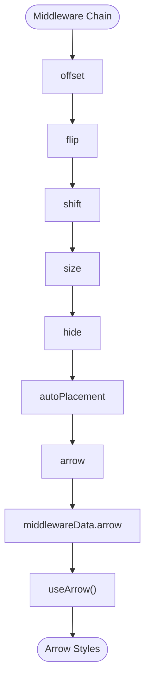
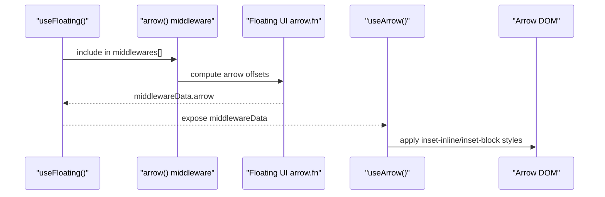
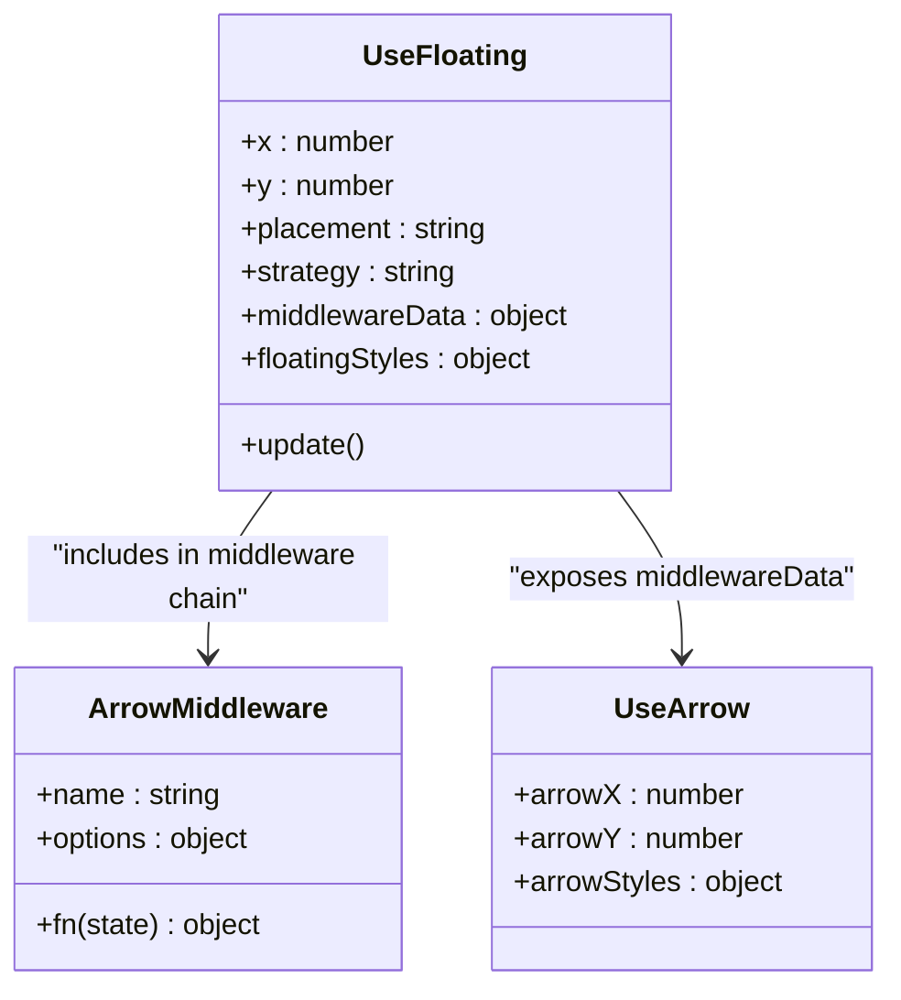
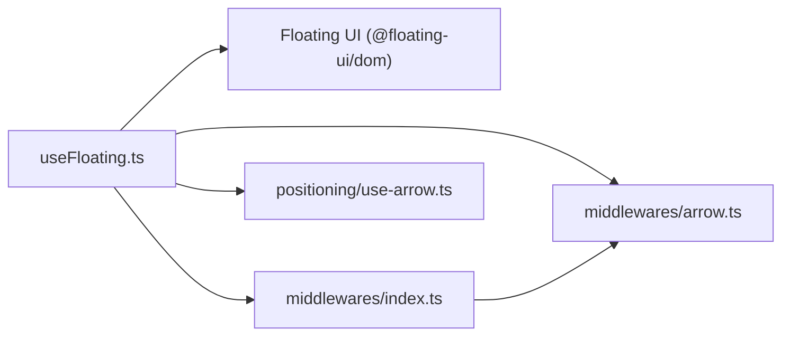

# Middleware Pipeline

<cite>
**Referenced Files in This Document**
- [use-floating.ts](file://src/composables/positioning/use-floating.ts)
- [arrow.ts](file://src/composables/middlewares/arrow.ts)
- [index.ts](file://src/composables/middlewares/index.ts)
- [use-arrow.ts](file://src/composables/positioning/use-arrow.ts)
- [middleware.md](file://docs/guide/middleware.md)
- [WithMiddleware.vue](file://docs/demos/use-floating/WithMiddleware.vue)
- [DropdownMenu.vue](file://docs/demos/use-floating/DropdownMenu.vue)
- [Menu.vue](file://playground/components/Menu.vue)
- [SubMenu.vue](file://playground/components/SubMenu.vue)
- [index.ts](file://src/composables/positioning/index.ts)
- [types.ts](file://src/types.ts)
</cite>

## Table of Contents
1. [Introduction](#introduction)
2. [Project Structure](#project-structure)
3. [Core Components](#core-components)
4. [Architecture Overview](#architecture-overview)
5. [Detailed Component Analysis](#detailed-component-analysis)
6. [Dependency Analysis](#dependency-analysis)
7. [Performance Considerations](#performance-considerations)
8. [Troubleshooting Guide](#troubleshooting-guide)
9. [Conclusion](#conclusion)
10. [Appendices](#appendices)

## Introduction
This document explains the middleware pipeline architecture and execution model in VFloat. It covers how middleware functions are chained and executed sequentially in the positioning pipeline, the importance of execution order, and how middleware interactions influence final positioning results. It also documents the MiddlewareData interface, how data is shared between pipeline stages, the Middleware function signature, and how middleware can modify positioning calculations. Finally, it provides examples of optimal middleware ordering for common use cases and guidance for debugging and profiling middleware chains.

## Project Structure
VFloat’s middleware pipeline centers around a composable that computes floating element positions using Floating UI’s computePosition and a configurable middleware array. Middleware are thin, composable utilities that each handle a single concern (e.g., offset, flip, shift, arrow, size, hide, autoPlacement). The pipeline executes in order, with each middleware receiving the current state and returning modifications that feed into the next middleware.

**Diagram sources**
- [use-floating.ts:244-265](file://src/composables/positioning/use-floating.ts#L244-L265)
- [index.ts:1-4](file://src/composables/middlewares/index.ts#L1-L4)
- [arrow.ts:36-50](file://src/composables/middlewares/arrow.ts#L36-L50)
- [use-arrow.ts:68-129](file://src/composables/positioning/use-arrow.ts#L68-L129)

**Section sources**
- [use-floating.ts:196-362](file://src/composables/positioning/use-floating.ts#L196-L362)
- [index.ts:1-4](file://src/composables/middlewares/index.ts#L1-L4)

## Core Components
- useFloating: Orchestrates the positioning pipeline, computes positions via Floating UI, exposes reactive styles and middleware data, and manages auto-update lifecycle.
- Middleware exports: Re-export of Floating UI middleware plus VFloat-specific arrow middleware.
- useArrow: Consumes middlewareData.arrow to compute arrow placement styles based on the current placement and arrow coordinates.

Key responsibilities:
- Middleware ordering and execution are driven by the middlewares option passed to useFloating.
- MiddlewareData is populated during computePosition and made available to consumers via context.middlewareData.
- The arrow middleware is conditionally injected into the reactive middleware array when an arrow element is present.

**Section sources**
- [use-floating.ts:84-88](file://src/composables/positioning/use-floating.ts#L84-L88)
- [use-floating.ts:225-226](file://src/composables/positioning/use-floating.ts#L225-L226)
- [use-floating.ts:232-242](file://src/composables/positioning/use-floating.ts#L232-L242)
- [index.ts:1-4](file://src/composables/middlewares/index.ts#L1-L4)
- [arrow.ts:36-50](file://src/composables/middlewares/arrow.ts#L36-L50)
- [use-arrow.ts:68-129](file://src/composables/positioning/use-arrow.ts#L68-L129)

## Architecture Overview
The middleware pipeline executes in a deterministic order. Each middleware receives the current state and returns a modified state for the next middleware. The final result is used to set x, y, placement, strategy, and middlewareData on the floating context.

**Diagram sources**
- [use-floating.ts:244-265](file://src/composables/positioning/use-floating.ts#L244-L265)
- [use-arrow.ts:68-129](file://src/composables/positioning/use-arrow.ts#L68-L129)

## Detailed Component Analysis

### Middleware Execution Model
- Middleware signature: Each middleware is an object with a name and a fn(state) method. The state includes x, y, placement, strategy, and other metadata. The fn returns a new state object or an empty object if no change is needed.
- Execution order: The array order determines the order of execution. Earlier middlewares can alter coordinates and metadata consumed by later middlewares.
- Data sharing: MiddlewareData is a shared object populated by middleware and exposed via context.middlewareData. Consumers can read arrow coordinates, hide status, and other data.

Practical implications:
- Order matters: For example, flip and shift should generally precede arrow to ensure arrow coordinates reflect the final placement and adjusted position.
- Reactive options: Middleware options can be reactive; changes to reactive middlewares cause recomputation.

**Section sources**
- [middleware.md:166-192](file://docs/guide/middleware.md#L166-L192)
- [use-floating.ts:244-265](file://src/composables/positioning/use-floating.ts#L244-L265)
- [use-floating.ts:225-226](file://src/composables/positioning/use-floating.ts#L225-L226)

### MiddlewareData Interface and Sharing
- MiddlewareData is a typed object that accumulates data produced by middleware. For example, the arrow middleware contributes arrow.x and arrow.y.
- Consumers access this data via context.middlewareData. The useArrow composable reads middlewareData.arrow to compute arrow styles.

**Diagram sources**
- [use-arrow.ts:80-81](file://src/composables/positioning/use-arrow.ts#L80-L81)
- [use-arrow.ts:83-122](file://src/composables/positioning/use-arrow.ts#L83-L122)

**Section sources**
- [use-arrow.ts:74-82](file://src/composables/positioning/use-arrow.ts#L74-L82)
- [use-arrow.ts:80-122](file://src/composables/positioning/use-arrow.ts#L80-L122)

### Arrow Middleware Integration
- The arrow middleware wraps Floating UI’s arrow and integrates with VFloat’s reactive system. It returns a middleware object with name "arrow" and a fn that delegates to Floating UI’s arrow when an element is available.
- useArrow consumes middlewareData.arrow to compute arrow styles based on the current placement side.

**Diagram sources**
- [arrow.ts:36-50](file://src/composables/middlewares/arrow.ts#L36-L50)
- [use-arrow.ts:68-129](file://src/composables/positioning/use-arrow.ts#L68-L129)

**Section sources**
- [arrow.ts:36-50](file://src/composables/middlewares/arrow.ts#L36-L50)
- [use-arrow.ts:68-129](file://src/composables/positioning/use-arrow.ts#L68-L129)

### Relationship Between Middleware and the Core Positioning Engine
- The core engine is computePosition from Floating UI. useFloating orchestrates computePosition with placement, strategy, and the middleware array.
- useFloating also manages autoUpdate, reactive styles, and open state transitions. It surfaces middlewareData so consumers can reactively adjust UI (e.g., arrow positioning).

**Diagram sources**
- [use-floating.ts:196-362](file://src/composables/positioning/use-floating.ts#L196-L362)
- [arrow.ts:36-50](file://src/composables/middlewares/arrow.ts#L36-L50)
- [use-arrow.ts:68-129](file://src/composables/positioning/use-arrow.ts#L68-L129)

**Section sources**
- [use-floating.ts:244-265](file://src/composables/positioning/use-floating.ts#L244-L265)
- [index.ts:1-4](file://src/composables/middlewares/index.ts#L1-L4)

### Optimal Middleware Ordering Examples

- Tooltips with arrows
  - Recommended order: offset → flip → shift → arrow
  - Rationale: offset establishes baseline spacing; flip and shift ensure visibility and correct placement; arrow consumes final coordinates.
  - Example reference: [WithMiddleware.vue:9-24](file://docs/demos/use-floating/WithMiddleware.vue#L9-L24)

- Dropdown menus with collision detection
  - Recommended order: offset → flip → shift
  - Rationale: offset separates from anchor; flip and shift keep the menu within viewport; arrow (if used) follows the same pattern.
  - Example reference: [DropdownMenu.vue:11-15](file://docs/demos/use-floating/DropdownMenu.vue#L11-L15)

- Complex floating element hierarchies (menus/submenus)
  - Root menu: offset → flip → shift
  - Submenu: offset → flip → shift
  - Rationale: Consistent collision handling across hierarchy; arrow can be added per floating element as needed.
  - Example reference: [Menu.vue:18-22](file://playground/components/Menu.vue#L18-L22), [SubMenu.vue:29-34](file://playground/components/SubMenu.vue#L29-L34)

**Section sources**
- [WithMiddleware.vue:9-24](file://docs/demos/use-floating/WithMiddleware.vue#L9-L24)
- [DropdownMenu.vue:11-15](file://docs/demos/use-floating/DropdownMenu.vue#L11-L15)
- [Menu.vue:18-22](file://playground/components/Menu.vue#L18-L22)
- [SubMenu.vue:29-34](file://playground/components/SubMenu.vue#L29-L34)

## Dependency Analysis
- useFloating depends on Floating UI computePosition and autoUpdate.
- useFloating conditionally injects the arrow middleware when an arrow element is provided.
- useArrow depends on context.middlewareData.arrow and placement to compute arrow styles.
- Middleware exports re-export Floating UI middleware and add VFloat’s arrow.

**Diagram sources**
- [use-floating.ts:12-12](file://src/composables/positioning/use-floating.ts#L12-L12)
- [index.ts:1-4](file://src/composables/middlewares/index.ts#L1-L4)
- [arrow.ts:1-3](file://src/composables/middlewares/arrow.ts#L1-L3)
- [use-arrow.ts:1-3](file://src/composables/positioning/use-arrow.ts#L1-L3)

**Section sources**
- [use-floating.ts:12-12](file://src/composables/positioning/use-floating.ts#L12-L12)
- [index.ts:1-4](file://src/composables/middlewares/index.ts#L1-L4)

## Performance Considerations
- Middleware order affects performance: heavy operations (e.g., size, hide) later in the chain can reduce repeated work if earlier middlewares stabilize placement.
- Use autoUpdate judiciously; disable or tune options when unnecessary to minimize recomputations.
- Prefer reactive middleware options to avoid manual update() calls when possible.
- Avoid redundant middleware duplication; the arrow middleware is automatically included when an arrow element is present.

[No sources needed since this section provides general guidance]

## Troubleshooting Guide
Common issues and techniques:
- Arrow not appearing or misaligned
  - Ensure arrow middleware is included and arrow element is set; verify middlewareData.arrow is populated.
  - Confirm arrow styles are applied based on placement side.
  - References: [arrow.ts:36-50](file://src/composables/middlewares/arrow.ts#L36-L50), [use-arrow.ts:68-129](file://src/composables/positioning/use-arrow.ts#L68-L129)

- Tooltip clipped or off-screen
  - Adjust offset, enable flip and shift, and tune padding.
  - References: [WithMiddleware.vue:9-24](file://docs/demos/use-floating/WithMiddleware.vue#L9-L24), [DropdownMenu.vue:11-15](file://docs/demos/use-floating/DropdownMenu.vue#L11-L15)

- Debugging middleware chains
  - Inspect context.middlewareData after computePosition completes.
  - Add logging around computePosition invocation and watch for changes.
  - References: [use-floating.ts:244-265](file://src/composables/positioning/use-floating.ts#L244-L265)

- Profiling pipeline performance
  - Measure computePosition duration and frequency of updates.
  - Reduce middleware count or complexity when profiling.
  - References: [use-floating.ts:244-265](file://src/composables/positioning/use-floating.ts#L244-L265)

**Section sources**
- [arrow.ts:36-50](file://src/composables/middlewares/arrow.ts#L36-L50)
- [use-arrow.ts:68-129](file://src/composables/positioning/use-arrow.ts#L68-L129)
- [WithMiddleware.vue:9-24](file://docs/demos/use-floating/WithMiddleware.vue#L9-L24)
- [DropdownMenu.vue:11-15](file://docs/demos/use-floating/DropdownMenu.vue#L11-L15)
- [use-floating.ts:244-265](file://src/composables/positioning/use-floating.ts#L244-L265)

## Conclusion
VFloat’s middleware pipeline provides a flexible, composable way to control floating element positioning. By chaining middleware in a deliberate order and leveraging middlewareData, developers can achieve robust layouts for tooltips, dropdowns, and complex hierarchies. Use the recommended orders for common scenarios, monitor middlewareData for debugging, and profile computePosition to maintain responsive UIs.

[No sources needed since this section summarizes without analyzing specific files]

## Appendices

### API and Signature References
- Middleware signature and creation
  - References: [middleware.md:166-192](file://docs/guide/middleware.md#L166-L192)

- useFloating options and return context
  - References: [use-floating.ts:65-170](file://src/composables/positioning/use-floating.ts#L65-L170)

- VirtualElement and OpenChangeReason types
  - References: [types.ts:8-29](file://src/types.ts#L8-L29)

**Section sources**
- [middleware.md:166-192](file://docs/guide/middleware.md#L166-L192)
- [use-floating.ts:65-170](file://src/composables/positioning/use-floating.ts#L65-L170)
- [types.ts:8-29](file://src/types.ts#L8-L29)