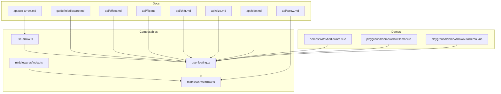
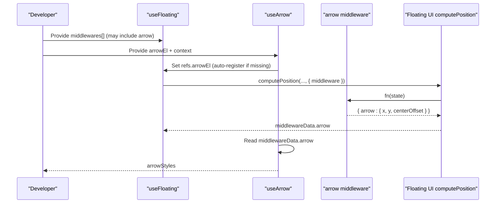
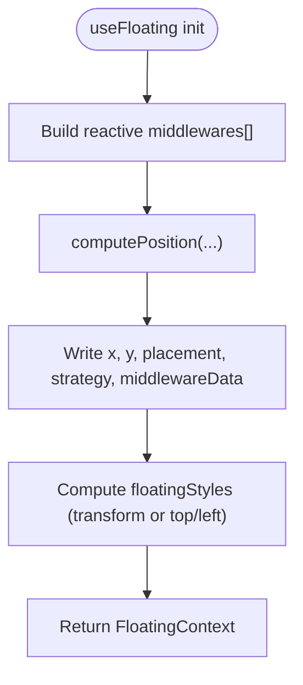
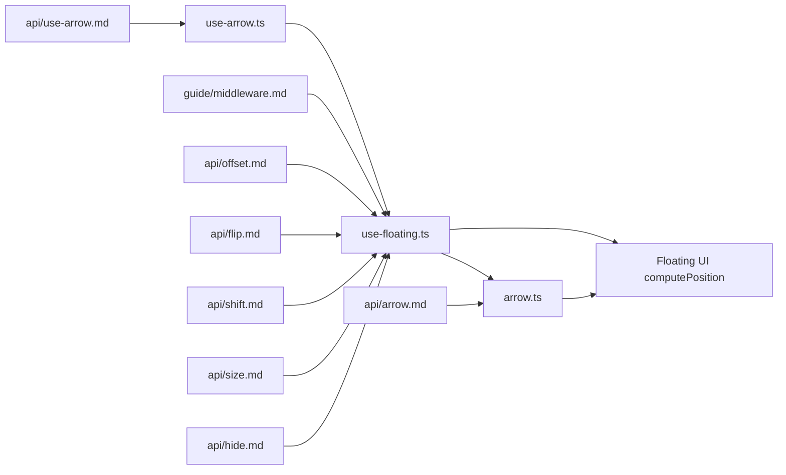

# Middleware System

<cite>
**Referenced Files in This Document**
- [index.ts](file://src/composables/middlewares/index.ts)
- [arrow.ts](file://src/composables/middlewares/arrow.ts)
- [use-floating.ts](file://src/composables/positioning/use-floating.ts)
- [use-arrow.ts](file://src/composables/positioning/use-arrow.ts)
- [middleware.md](file://docs/guide/middleware.md)
- [arrow.md](file://docs/api/arrow.md)
- [use-arrow.md](file://docs/api/use-arrow.md)
- [offset.md](file://docs/api/offset.md)
- [flip.md](file://docs/api/flip.md)
- [shift.md](file://docs/api/shift.md)
- [size.md](file://docs/api/size.md)
- [hide.md](file://docs/api/hide.md)
- [WithMiddleware.vue](file://docs/demos/use-floating/WithMiddleware.vue)
- [ArrowDemo.vue](file://playground/demo/ArrowDemo.vue)
- [ArrowAutoDemo.vue](file://playground/demo/ArrowAutoDemo.vue)
</cite>

## Table of Contents
1. [Introduction](#introduction)
2. [Project Structure](#project-structure)
3. [Core Components](#core-components)
4. [Architecture Overview](#architecture-overview)
5. [Detailed Component Analysis](#detailed-component-analysis)
6. [Dependency Analysis](#dependency-analysis)
7. [Performance Considerations](#performance-considerations)
8. [Troubleshooting Guide](#troubleshooting-guide)
9. [Conclusion](#conclusion)
10. [Appendices](#appendices)

## Introduction
This document explains the middleware system powering floating element positioning in V-Float. It covers the pluggable middleware pipeline, how middleware functions transform positioning data sequentially, and the built-in middleware included with the library. It also documents the arrow middleware and composable for arrow positioning, custom middleware creation, data sharing across stages, and best practices for building efficient positioning pipelines.

## Project Structure
The middleware system is implemented as composable utilities that integrate with Floating UI’s middleware ecosystem. Key areas:
- Middleware exports and re-exports from Floating UI
- Arrow middleware wrapper for Vue refs
- Core positioning composable that orchestrates middleware execution
- Arrow positioning composable that consumes middleware data
- Comprehensive documentation and demos



**Diagram sources**
- [use-floating.ts:1-384](file://src/composables/positioning/use-floating.ts#L1-L384)
- [use-arrow.ts:1-130](file://src/composables/positioning/use-arrow.ts#L1-L130)
- [arrow.ts:1-51](file://src/composables/middlewares/arrow.ts#L1-L51)
- [index.ts:1-4](file://src/composables/middlewares/index.ts#L1-L4)
- [middleware.md:1-230](file://docs/guide/middleware.md#L1-L230)
- [arrow.md:1-103](file://docs/api/arrow.md#L1-L103)
- [use-arrow.md:1-107](file://docs/api/use-arrow.md#L1-L107)
- [offset.md:1-123](file://docs/api/offset.md#L1-L123)
- [flip.md:1-67](file://docs/api/flip.md#L1-L67)
- [shift.md:1-89](file://docs/api/shift.md#L1-L89)
- [size.md:1-88](file://docs/api/size.md#L1-L88)
- [hide.md:1-93](file://docs/api/hide.md#L1-L93)
- [WithMiddleware.vue:1-55](file://docs/demos/use-floating/WithMiddleware.vue#L1-L55)
- [ArrowDemo.vue:1-58](file://playground/demo/ArrowDemo.vue#L1-L58)
- [ArrowAutoDemo.vue:1-100](file://playground/demo/ArrowAutoDemo.vue#L1-L100)

**Section sources**
- [index.ts:1-4](file://src/composables/middlewares/index.ts#L1-L4)
- [middleware.md:1-230](file://docs/guide/middleware.md#L1-L230)

## Core Components
- Middleware exports: Re-exports Floating UI middleware (offset, flip, shift, size, hide, autoPlacement) and local arrow middleware.
- Arrow middleware: Wraps Floating UI’s arrow middleware to accept a Vue ref and optional padding.
- useFloating: Orchestrates computePosition, manages reactive middleware arrays, and exposes middlewareData and styles.
- useArrow: Consumes middlewareData from useFloating to compute arrow styles and positions.

Key responsibilities:
- Pipeline orchestration: useFloating constructs the middleware array and passes it to computePosition.
- Data propagation: middlewareData is populated during computePosition and consumed downstream.
- Arrow lifecycle: useArrow registers arrow middleware automatically when an arrow element is provided.

**Section sources**
- [index.ts:1-4](file://src/composables/middlewares/index.ts#L1-L4)
- [arrow.ts:1-51](file://src/composables/middlewares/arrow.ts#L1-L51)
- [use-floating.ts:1-384](file://src/composables/positioning/use-floating.ts#L1-L384)
- [use-arrow.ts:1-130](file://src/composables/positioning/use-arrow.ts#L1-L130)

## Architecture Overview
The middleware pipeline executes in order, with each middleware receiving the current state and optionally returning updates. The final result is applied to the floating element’s styles and placement metadata.

```mermaid
sequenceDiagram
participant Dev as "Developer"
participant UF as "useFloating"
participant FU as "Floating UI computePosition"
participant MW1 as "Middleware 1"
participant MW2 as "Middleware 2"
participant MWn as "Middleware n"
participant UA as "useArrow"
Dev->>UF : Configure middlewares[]
UF->>FU : computePosition(anchor, floating, { placement, strategy, middleware })
FU->>MW1 : fn(state)
MW1-->>FU : state'
FU->>MW2 : fn(state')
MW2-->>FU : state''
...
FU->>MWn : fn(state^n-1)
MWn-->>FU : state^n
FU-->>UF : { x, y, placement, strategy, middlewareData }
UF-->>Dev : FloatingContext (styles, data)
Dev->>UA : Provide arrow element + context
UA->>UF : Read middlewareData.arrow
UA-->>Dev : arrowStyles
```

**Diagram sources**
- [use-floating.ts:244-265](file://src/composables/positioning/use-floating.ts#L244-L265)
- [use-arrow.ts:68-129](file://src/composables/positioning/use-arrow.ts#L68-L129)
- [middleware.md:1-230](file://docs/guide/middleware.md#L1-L230)

## Detailed Component Analysis

### Middleware Pipeline and Built-in Middleware
- Pipeline concept: Middlewares are executed sequentially. Each middleware can read and modify coordinates and metadata.
- Built-in middleware (re-exported):
  - offset: Adds spacing along main/cross/alignment axes.
  - flip: Changes placement to avoid overflow.
  - shift: Slides the element to stay within boundaries.
  - size: Computes available space and allows applying constraints.
  - hide: Reports visibility state based on clipping contexts.
  - autoPlacement: Chooses the placement with the most available space.
- Execution order matters: For example, offset should generally precede collision-aware middlewares like flip and shift to account for the intended spacing.

Practical examples and guidance:
- Combining middlewares and accessing arrow data.
- Reactive middleware options and dynamic pipelines.

**Section sources**
- [middleware.md:144-230](file://docs/guide/middleware.md#L144-L230)
- [offset.md:1-123](file://docs/api/offset.md#L1-L123)
- [flip.md:1-67](file://docs/api/flip.md#L1-L67)
- [shift.md:1-89](file://docs/api/shift.md#L1-L89)
- [size.md:1-88](file://docs/api/size.md#L1-L88)
- [hide.md:1-93](file://docs/api/hide.md#L1-L93)

### Arrow Middleware and useArrow Composable
- Arrow middleware:
  - Accepts a Vue ref to the arrow element and optional padding.
  - Delegates to Floating UI’s arrow middleware internally.
  - Exposes arrow positioning data in middlewareData.arrow.
- useArrow composable:
  - Automatically registers arrow middleware when an arrow element is provided.
  - Computes arrow styles using logical inset properties and respects placement direction.
  - Supports an offset option to fine-tune arrow placement relative to the floating edge.



**Diagram sources**
- [use-floating.ts:232-242](file://src/composables/positioning/use-floating.ts#L232-L242)
- [arrow.ts:36-49](file://src/composables/middlewares/arrow.ts#L36-L49)
- [use-arrow.ts:68-129](file://src/composables/positioning/use-arrow.ts#L68-L129)

**Section sources**
- [arrow.ts:1-51](file://src/composables/middlewares/arrow.ts#L1-L51)
- [use-arrow.ts:1-130](file://src/composables/positioning/use-arrow.ts#L1-L130)
- [arrow.md:1-103](file://docs/api/arrow.md#L1-L103)
- [use-arrow.md:1-107](file://docs/api/use-arrow.md#L1-L107)

### useFloating: Pipeline Orchestration and Data Flow
- Receives placement, strategy, and a reactive middlewares array.
- Constructs a reactive middleware list that conditionally includes arrow middleware when an arrow element is present.
- Calls computePosition and writes results to refs for x, y, placement, strategy, middlewareData, and isPositioned.
- Exposes floatingStyles derived from x/y and transform strategy, with DPR rounding for crisp rendering.



**Diagram sources**
- [use-floating.ts:232-362](file://src/composables/positioning/use-floating.ts#L232-L362)

**Section sources**
- [use-floating.ts:1-384](file://src/composables/positioning/use-floating.ts#L1-L384)

### Custom Middleware Development
- Interface: A middleware is an object with a name and a fn(state) that returns updated state.
- Data sharing: Each middleware can read previous state and write changes; results propagate to subsequent middlewares and to middlewareData.
- Reactivity: Since V-Float is Vue-based, middleware arrays and options can be reactive refs/computed, enabling dynamic pipelines.

Best practices:
- Keep middleware focused on a single responsibility.
- Place layout-affecting middlewares early (e.g., offset) and collision-handling later (e.g., flip, shift).
- Avoid heavy work inside middleware fn; prefer precomputing or caching where appropriate.

**Section sources**
- [middleware.md:166-218](file://docs/guide/middleware.md#L166-L218)

### Practical Middleware Combinations and Order Importance
Common patterns:
- Spacing + collision avoidance + viewport adjustment:
  - offset → flip → shift
  - Ensures desired spacing, then flips to prevent overflow, then shifts to keep within viewport.
- With arrow:
  - offset → flip → shift → arrow
  - Arrow middleware aligns the arrow to the computed placement and coordinates.
- Dynamic sizing:
  - offset → flip → shift → size
  - size applies constraints after collision handling.

Examples in docs and demos:
- Combined middleware usage and arrow data access.
- Auto-registration of arrow middleware via useArrow.

**Section sources**
- [middleware.md:144-164](file://docs/guide/middleware.md#L144-L164)
- [WithMiddleware.vue:1-55](file://docs/demos/use-floating/WithMiddleware.vue#L1-L55)
- [ArrowDemo.vue:1-58](file://playground/demo/ArrowDemo.vue#L1-L58)
- [ArrowAutoDemo.vue:1-100](file://playground/demo/ArrowAutoDemo.vue#L1-L100)

## Dependency Analysis
- useFloating depends on Floating UI computePosition and autoUpdate.
- Arrow middleware is a thin wrapper around Floating UI’s arrow middleware.
- useArrow depends on Floating UI’s middlewareData.arrow and placement to compute styles.
- Docs and demos demonstrate real-world usage and expected behavior.



**Diagram sources**
- [use-floating.ts:1-384](file://src/composables/positioning/use-floating.ts#L1-L384)
- [arrow.ts:1-51](file://src/composables/middlewares/arrow.ts#L1-L51)
- [use-arrow.ts:1-130](file://src/composables/positioning/use-arrow.ts#L1-L130)
- [middleware.md:1-230](file://docs/guide/middleware.md#L1-L230)
- [arrow.md:1-103](file://docs/api/arrow.md#L1-L103)
- [use-arrow.md:1-107](file://docs/api/use-arrow.md#L1-L107)
- [offset.md:1-123](file://docs/api/offset.md#L1-L123)
- [flip.md:1-67](file://docs/api/flip.md#L1-L67)
- [shift.md:1-89](file://docs/api/shift.md#L1-L89)
- [size.md:1-88](file://docs/api/size.md#L1-L88)
- [hide.md:1-93](file://docs/api/hide.md#L1-L93)

**Section sources**
- [index.ts:1-4](file://src/composables/middlewares/index.ts#L1-L4)
- [use-floating.ts:1-384](file://src/composables/positioning/use-floating.ts#L1-L384)
- [use-arrow.ts:1-130](file://src/composables/positioning/use-arrow.ts#L1-L130)
- [arrow.ts:1-51](file://src/composables/middlewares/arrow.ts#L1-L51)

## Performance Considerations
- Prefer transform-based positioning when possible for GPU acceleration.
- Use DPR rounding to avoid blurry text and improve perceived sharpness.
- Limit middleware count and complexity; combine related logic where feasible.
- Use autoUpdate judiciously; disable or tune options for static layouts.
- Avoid unnecessary recomputations by keeping middleware deterministic and caching expensive computations outside middleware fn.

[No sources needed since this section provides general guidance]

## Troubleshooting Guide
- Arrow not visible:
  - Ensure refs.arrowEl is set and middlewareData.arrow is present.
  - Verify arrow middleware is registered (manually or via useArrow).
- Incorrect arrow placement:
  - Confirm placement and padding values.
  - Check that the arrow element is rendered and measured before computePosition runs.
- Overflows or clipped content:
  - Adjust offset, enable flip/shift, and tune padding/boundary options.
- Stale positioning:
  - Trigger update() on state changes or ensure autoUpdate is enabled.
  - Verify reactive middlewares are updated when options change.

**Section sources**
- [use-arrow.ts:68-129](file://src/composables/positioning/use-arrow.ts#L68-L129)
- [use-floating.ts:244-265](file://src/composables/positioning/use-floating.ts#L244-L265)
- [flip.md:1-67](file://docs/api/flip.md#L1-L67)
- [shift.md:1-89](file://docs/api/shift.md#L1-L89)
- [size.md:1-88](file://docs/api/size.md#L1-L88)

## Conclusion
The middleware system in V-Float provides a flexible, composable pipeline for positioning floating elements. By combining offset, flip, shift, size, hide, autoPlacement, and arrow middleware in the right order—and leveraging useArrow—you can achieve robust, responsive UI components. Use reactive options, minimize heavy work in middleware, and follow the documented patterns to build efficient and maintainable positioning pipelines.

[No sources needed since this section summarizes without analyzing specific files]

## Appendices

### API Reference Highlights
- useFloating: Orchestrates middleware, computes position, and exposes styles/data.
- arrow: Middleware for arrow positioning with padding support.
- useArrow: Composable that auto-registers arrow middleware and computes styles.
- offset, flip, shift, size, hide, autoPlacement: Built-in middlewares for spacing, collision avoidance, viewport adjustment, sizing, visibility, and placement selection.

**Section sources**
- [use-floating.ts:176-362](file://src/composables/positioning/use-floating.ts#L176-L362)
- [arrow.ts:36-49](file://src/composables/middlewares/arrow.ts#L36-L49)
- [use-arrow.ts:68-129](file://src/composables/positioning/use-arrow.ts#L68-L129)
- [index.ts:1-4](file://src/composables/middlewares/index.ts#L1-L4)
- [middleware.md:15-143](file://docs/guide/middleware.md#L15-L143)