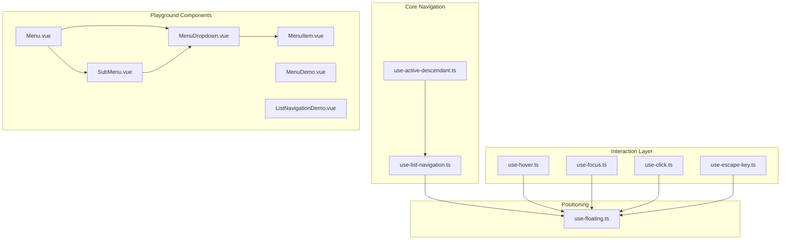
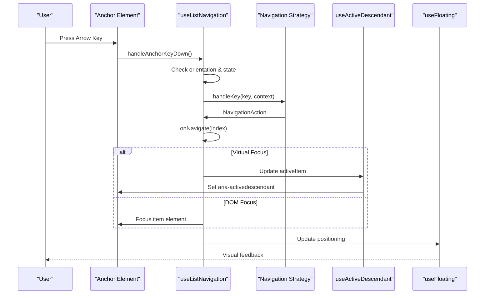
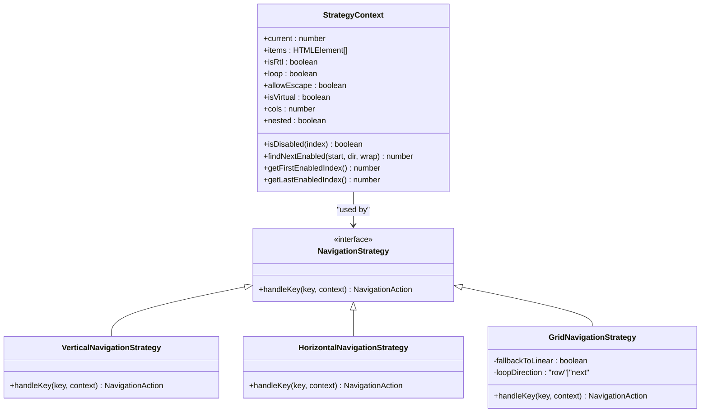
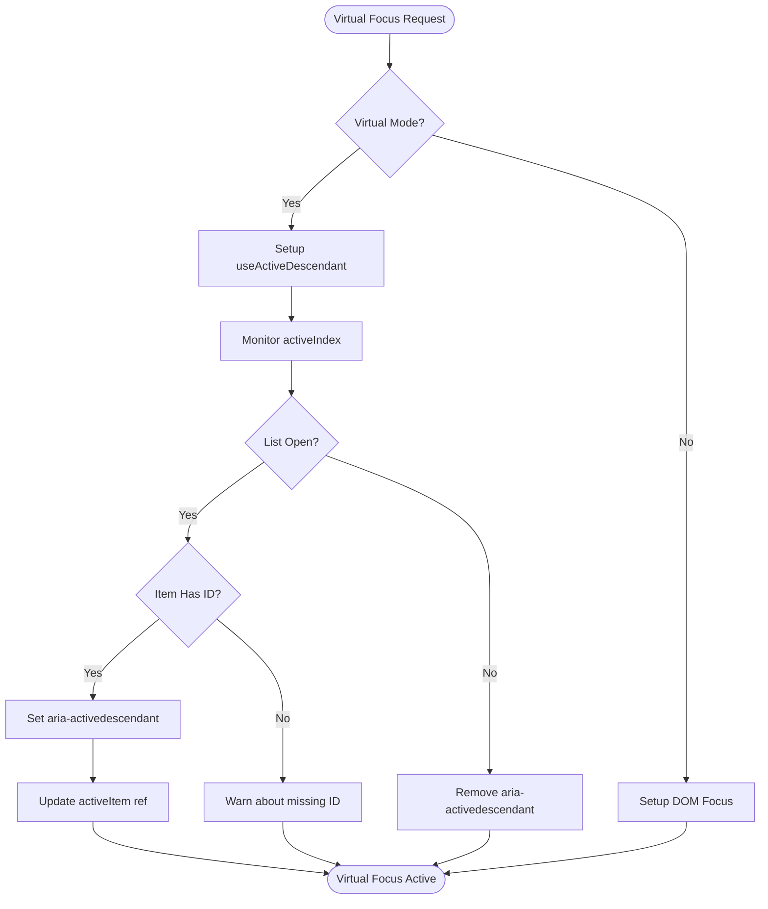
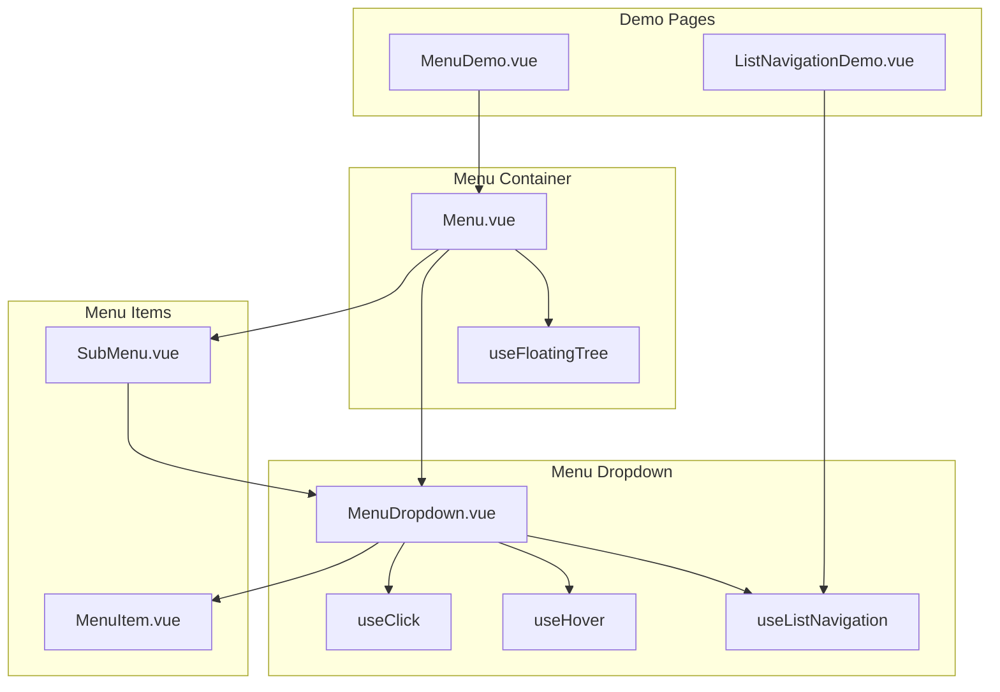

# Navigation Structure

<cite>
**Referenced Files in This Document**
- [use-list-navigation.ts](file://src/composables/interactions/use-list-navigation.ts)
- [index.ts](file://src/composables/interactions/index.ts)
- [use-active-descendant.ts](file://src/composables/utils/use-active-descendant.ts)
- [use-floating.ts](file://src/composables/positioning/use-floating.ts)
- [use-hover.ts](file://src/composables/interactions/use-hover.ts)
- [use-focus.ts](file://src/composables/interactions/use-focus.ts)
- [use-click.ts](file://src/composables/interactions/use-click.ts)
- [use-escape-key.ts](file://src/composables/interactions/use-escape-key.ts)
- [Menu.vue](file://playground/components/Menu.vue)
- [MenuDropdown.vue](file://playground/components/MenuDropdown.vue)
- [MenuItem.vue](file://playground/components/MenuItem.vue)
- [SubMenu.vue](file://playground/components/SubMenu.vue)
- [MenuDemo.vue](file://playground/demo/MenuDemo.vue)
- [ListNavigationDemo.vue](file://playground/demo/ListNavigationDemo.vue)
- [list-navigation.md](file://docs/guide/list-navigation.md)
- [use-list-navigation.md](file://docs/api/use-list-navigation.md)
</cite>

## Table of Contents
1. [Introduction](#introduction)
2. [Project Structure](#project-structure)
3. [Core Components](#core-components)
4. [Architecture Overview](#architecture-overview)
5. [Detailed Component Analysis](#detailed-component-analysis)
6. [Navigation Strategies](#navigation-strategies)
7. [Menu System Implementation](#menu-system-implementation)
8. [Accessibility Patterns](#accessibility-patterns)
9. [Performance Considerations](#performance-considerations)
10. [Troubleshooting Guide](#troubleshooting-guide)
11. [Conclusion](#conclusion)

## Introduction

The VFloat navigation structure provides a comprehensive keyboard-driven interaction system for floating UI components, particularly menus and lists. This system enables developers to create accessible, feature-rich navigation experiences with support for virtual focus, grid navigation, nested menus, and international layouts.

The navigation system is built around the `useListNavigation` composable, which orchestrates keyboard interactions, focus management, and accessibility compliance for various UI patterns including dropdown menus, comboboxes, and complex nested menu systems.

## Project Structure

The navigation system is organized into several key areas within the VFloat codebase:

**Diagram sources**
- [use-list-navigation.ts:1-822](file://src/composables/interactions/use-list-navigation.ts#L1-L822)
- [use-floating.ts:1-384](file://src/composables/positioning/use-floating.ts#L1-L384)
- [Menu.vue:1-53](file://playground/components/Menu.vue#L1-L53)

**Section sources**
- [index.ts:1-7](file://src/composables/interactions/index.ts#L1-L7)
- [use-list-navigation.ts:1-822](file://src/composables/interactions/use-list-navigation.ts#L1-L822)

## Core Components

The navigation system consists of several interconnected components that work together to provide comprehensive keyboard navigation:

### Primary Navigation Composable

The `useListNavigation` composable serves as the foundation for all keyboard navigation patterns. It provides:

- **Strategy-based navigation** supporting vertical, horizontal, and grid layouts
- **Virtual focus management** for aria-activedescendant patterns
- **Accessibility compliance** with WAI-ARIA standards
- **Internationalization support** for RTL layouts
- **Flexible configuration** through extensive options

### Supporting Utilities

The system includes several utility composables that enhance the navigation experience:

- **useActiveDescendant**: Manages virtual focus patterns
- **useFloating**: Provides positioning context for floating elements
- **Interaction composables**: Handle hover, focus, click, and escape key events

**Section sources**
- [use-list-navigation.ts:451-800](file://src/composables/interactions/use-list-navigation.ts#L451-L800)
- [use-active-descendant.ts:28-87](file://src/composables/utils/use-active-descendant.ts#L28-L87)

## Architecture Overview

The navigation architecture follows a layered approach with clear separation of concerns:

**Diagram sources**
- [use-list-navigation.ts:581-670](file://src/composables/interactions/use-list-navigation.ts#L581-L670)
- [use-active-descendant.ts:36-83](file://src/composables/utils/use-active-descendant.ts#L36-L83)

The architecture ensures that navigation logic remains decoupled from positioning logic, allowing for flexible combinations of navigation patterns with different floating UI behaviors.

## Detailed Component Analysis

### Navigation Strategy System

The navigation system implements a strategy pattern to handle different navigation modes:

**Diagram sources**
- [use-list-navigation.ts:38-285](file://src/composables/interactions/use-list-navigation.ts#L38-L285)

Each strategy handles specific key combinations and navigation patterns:

- **VerticalNavigationStrategy**: Handles up/down arrow navigation for single-column lists
- **HorizontalNavigationStrategy**: Manages left/right navigation with RTL support
- **GridNavigationStrategy**: Provides 2D navigation with row/column movement and wrapping

**Section sources**
- [use-list-navigation.ts:74-285](file://src/composables/interactions/use-list-navigation.ts#L74-L285)

### Virtual Focus Implementation

Virtual focus enables navigation patterns where the anchor element maintains DOM focus while the active item is tracked via aria-activedescendant:

**Diagram sources**
- [use-active-descendant.ts:28-87](file://src/composables/utils/use-active-descendant.ts#L28-L87)

**Section sources**
- [use-active-descendant.ts:28-87](file://src/composables/utils/use-active-descendant.ts#L28-L87)

### Menu System Architecture

The playground demonstrates a complete menu system built on the navigation foundation:

**Diagram sources**
- [Menu.vue:1-53](file://playground/components/Menu.vue#L1-L53)
- [MenuDropdown.vue:1-92](file://playground/components/MenuDropdown.vue#L1-L92)
- [MenuDemo.vue:1-321](file://playground/demo/MenuDemo.vue#L1-L321)

**Section sources**
- [Menu.vue:1-53](file://playground/components/Menu.vue#L1-L53)
- [MenuDropdown.vue:1-92](file://playground/components/MenuDropdown.vue#L1-L92)
- [MenuDemo.vue:1-321](file://playground/demo/MenuDemo.vue#L1-L321)

## Navigation Strategies

The system supports three primary navigation strategies, each optimized for different use cases:

### Vertical Navigation
- **Primary keys**: ArrowUp, ArrowDown
- **Use case**: Single-column dropdowns, standard menus
- **Features**: Loop support, disabled item skipping, RTL awareness

### Horizontal Navigation  
- **Primary keys**: ArrowLeft, ArrowRight
- **Use case**: Horizontal menus, tab-like interfaces
- **Features**: RTL-aware direction handling, nested menu support

### Grid Navigation
- **Primary keys**: ArrowUp, ArrowDown, ArrowLeft, ArrowRight
- **Use case**: Grid-based interfaces, image galleries, keyboard shortcuts
- **Features**: Row/column movement, configurable wrapping behavior, column count support

**Section sources**
- [use-list-navigation.ts:74-285](file://src/composables/interactions/use-list-navigation.ts#L74-L285)

## Menu System Implementation

The playground components demonstrate a sophisticated menu system that showcases the navigation capabilities:

### Menu Container
The main menu component provides the foundation for the entire navigation system:

- **Tree management**: Uses `useFloatingTree` for managing multiple nested menus
- **Escape key handling**: Implements proper escape key behavior for nested contexts
- **Click outside**: Handles outside click detection for proper menu dismissal

### Menu Dropdown
The dropdown component integrates multiple interaction patterns:

- **List navigation**: Primary navigation logic for keyboard interactions
- **Hover support**: Enhanced hover behavior with safe polygon detection
- **Focus management**: Proper focus trapping and modal behavior
- **Nested support**: Handles parent-child relationships in menu hierarchies

### Menu Items
Individual menu items provide:

- **Registration system**: Automatic registration with the parent menu
- **State management**: Active/inactive state tracking
- **Accessibility**: Proper ARIA attributes and keyboard handling

**Section sources**
- [Menu.vue:1-53](file://playground/components/Menu.vue#L1-L53)
- [MenuDropdown.vue:1-92](file://playground/components/MenuDropdown.vue#L1-L92)
- [MenuItem.vue:1-42](file://playground/components/MenuItem.vue#L1-L42)

## Accessibility Patterns

The navigation system implements comprehensive accessibility features:

### Focus Management
- **DOM focus vs Virtual focus**: Two distinct patterns for different use cases
- **Focus trapping**: Ensures keyboard navigation remains contained within menus
- **Focus restoration**: Properly returns focus to trigger elements when menus close

### Screen Reader Support
- **ARIA attributes**: Proper role, state, and relationship attributes
- **Live regions**: Dynamic updates for screen reader announcements
- **Descriptive labels**: Clear semantic meaning for interactive elements

### Internationalization
- **RTL support**: Automatic direction handling for right-to-left languages
- **Locale-aware**: Cultural navigation expectations

**Section sources**
- [list-navigation.md:52-176](file://docs/guide/list-navigation.md#L52-L176)
- [use-list-navigation.ts:557-573](file://src/composables/interactions/use-list-navigation.ts#L557-L573)

## Performance Considerations

The navigation system is designed with performance in mind:

### Efficient Rendering
- **Minimal re-renders**: Strategic use of Vue's reactivity system
- **Stable references**: Maintained item references to prevent unnecessary updates
- **Conditional rendering**: Only renders when navigation state changes

### Memory Management
- **Cleanup functions**: Proper event listener cleanup
- **Resource disposal**: Automatic cleanup of timers and observers
- **Memory leaks prevention**: Comprehensive cleanup patterns

### Accessibility Optimization
- **Pointer modality detection**: Suppresses unwanted scrolling during mouse interactions
- **Performance-aware watchers**: Optimized reactive updates for navigation state

**Section sources**
- [use-list-navigation.ts:500-510](file://src/composables/interactions/use-list-navigation.ts#L500-L510)
- [use-list-navigation.ts:676-704](file://src/composables/interactions/use-list-navigation.ts#L676-L704)

## Troubleshooting Guide

Common issues and their solutions:

### Navigation Not Working
- **Verify context**: Ensure `useListNavigation` receives a valid `FloatingContext`
- **Check listRef**: Confirm the `listRef` contains properly registered items
- **Enable state**: Verify the `enabled` option is set to `true`

### Virtual Focus Issues
- **Missing IDs**: Ensure all list items have stable `id` attributes
- **Anchor focus**: Verify the anchor element is focusable
- **Attribute cleanup**: Check that `aria-activedescendant` is being properly managed

### Menu Navigation Problems
- **Tree context**: Ensure menu components are properly nested within the floating tree
- **Event conflicts**: Check for conflicting event handlers
- **State synchronization**: Verify active index and open state are properly synchronized

### Performance Issues
- **Excessive re-renders**: Review component structure for unnecessary reactive dependencies
- **Memory leaks**: Verify cleanup functions are being called
- **Event listener accumulation**: Check for duplicate event listener registration

**Section sources**
- [use-active-descendant.ts:62-72](file://src/composables/utils/use-active-descendant.ts#L62-L72)
- [list-navigation.md:166-176](file://docs/guide/list-navigation.md#L166-L176)

## Conclusion

The VFloat navigation structure provides a robust, accessible, and performant foundation for keyboard-driven UI interactions. The modular architecture allows developers to compose different navigation patterns while maintaining consistency and accessibility standards.

Key strengths of the system include:

- **Comprehensive strategy support** covering vertical, horizontal, and grid navigation
- **Dual focus patterns** accommodating both DOM focus and virtual focus scenarios  
- **Internationalization support** with proper RTL handling
- **Accessibility-first design** with full WAI-ARIA compliance
- **Performance optimization** with efficient rendering and memory management
- **Extensible architecture** enabling custom navigation patterns

The system successfully balances flexibility with maintainability, providing developers with powerful tools to create sophisticated navigation experiences while ensuring accessibility and performance standards are met.