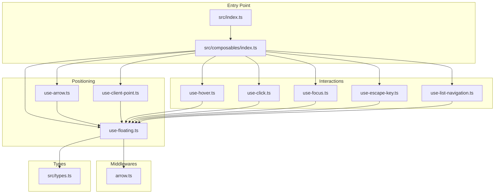
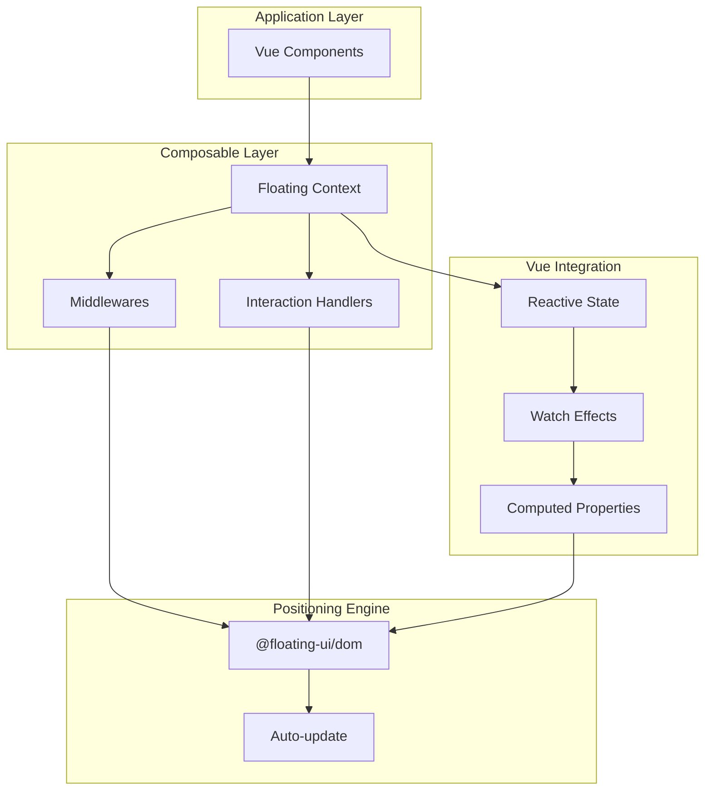
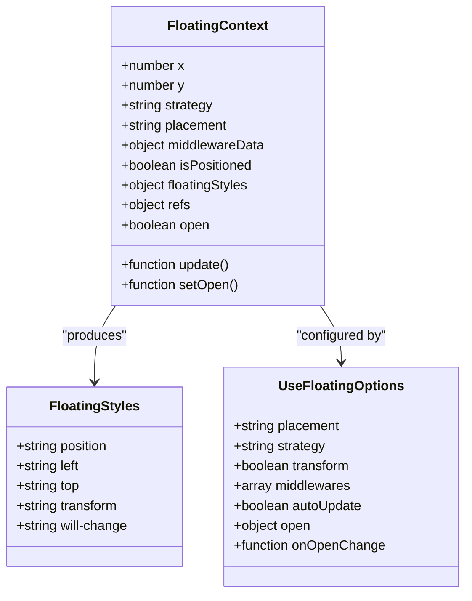
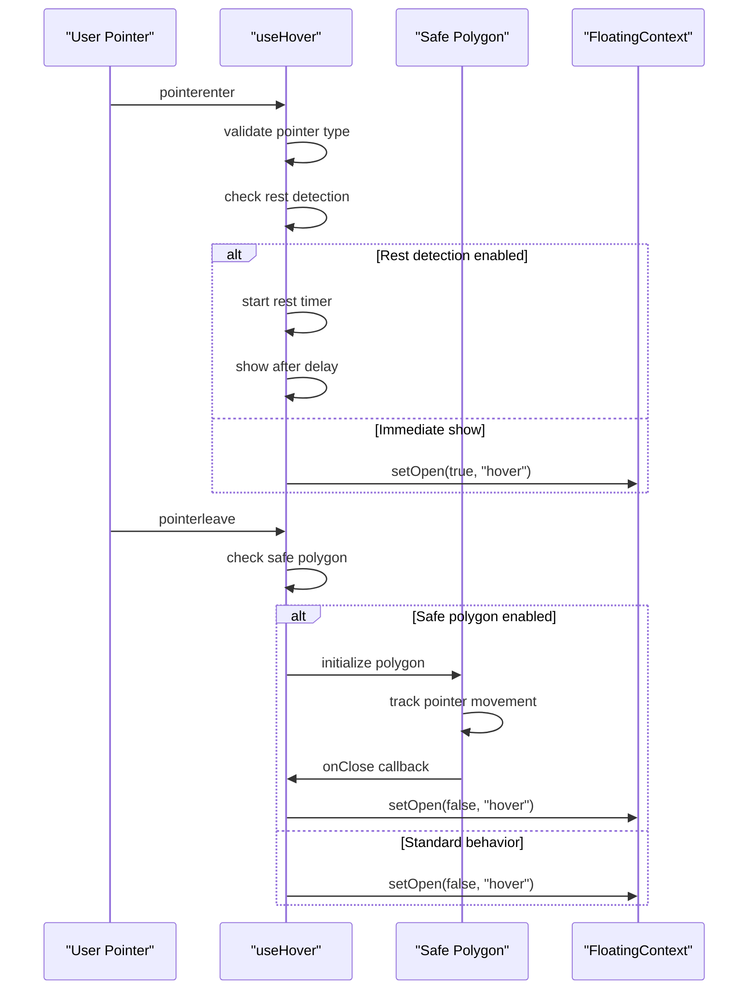
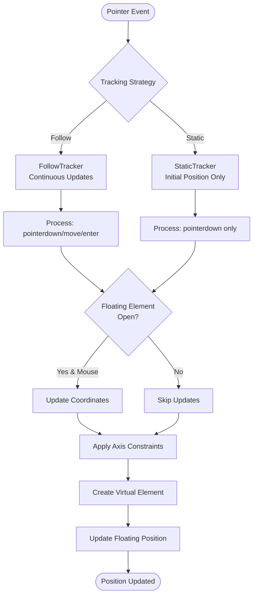

# Project Overview

<cite>
**Referenced Files in This Document**
- [README.md](file://README.md)
- [package.json](file://package.json)
- [src/index.ts](file://src/index.ts)
- [src/composables/index.ts](file://src/composables/index.ts)
- [src/composables/positioning/use-floating.ts](file://src/composables/positioning/use-floating.ts)
- [src/composables/positioning/use-arrow.ts](file://src/composables/positioning/use-arrow.ts)
- [src/composables/positioning/use-client-point.ts](file://src/composables/positioning/use-client-point.ts)
- [src/composables/interactions/use-hover.ts](file://src/composables/interactions/use-hover.ts)
- [src/composables/interactions/use-click.ts](file://src/composables/interactions/use-click.ts)
- [src/composables/interactions/use-focus.ts](file://src/composables/interactions/use-focus.ts)
- [src/composables/interactions/use-escape-key.ts](file://src/composables/interactions/use-escape-key.ts)
- [src/composables/interactions/use-list-navigation.ts](file://src/composables/interactions/use-list-navigation.ts)
- [src/composables/middlewares/arrow.ts](file://src/composables/middlewares/arrow.ts)
- [src/types.ts](file://src/types.ts)
</cite>

## Update Summary
**Changes Made**
- Removed references to floating tree capabilities and nested element support
- Simplified feature list to reflect the current API approach
- Updated core components section to focus on the streamlined composable architecture
- Removed advanced features section that referenced complex nested scenarios
- Updated introduction to emphasize the simplified, focused approach

## Table of Contents
1. [Introduction](#introduction)
2. [Project Structure](#project-structure)
3. [Core Components](#core-components)
4. [Architecture Overview](#architecture-overview)
5. [Detailed Component Analysis](#detailed-component-analysis)
6. [Dependency Analysis](#dependency-analysis)
7. [Performance Considerations](#performance-considerations)
8. [Troubleshooting Guide](#troubleshooting-guide)
9. [Conclusion](#conclusion)

## Introduction
V-Float is a Vue 3 floating UI positioning library built on top of @floating-ui/dom. It provides a streamlined set of composables for precise, reactive positioning of floating elements (tooltips, popovers, dropdowns, and modals) with robust interaction handling and middleware support.

The library emphasizes:
- Pixel-perfect positioning with automatic collision detection
- Vue 3 Composition API-first design with simplified, focused composables
- Built-in interaction behaviors (hover, focus, click, escape key)
- Arrow positioning and client-point tracking
- Lightweight, tree-shakeable architecture
- Full TypeScript support with comprehensive type definitions
- Cross-platform compatibility across desktop, mobile, and touch devices

Project status: Work-in-progress with rapid evolution. Expect breaking changes without deprecation windows. APIs, documentation, and examples may change frequently.

**Section sources**
- [README.md:1-216](file://README.md#L1-L216)
- [package.json:1-77](file://package.json#L1-L77)

## Project Structure
The project follows a modular composable architecture organized by concern:



**Diagram sources**
- [src/index.ts:1-2](file://src/index.ts#L1-L2)
- [src/composables/index.ts:1-4](file://src/composables/index.ts#L1-L4)

**Section sources**
- [src/index.ts:1-2](file://src/index.ts#L1-L2)
- [src/composables/index.ts:1-4](file://src/composables/index.ts#L1-L4)

## Core Components
V-Float provides three primary categories of composables:

### Positioning Core
- **useFloating**: Central positioning logic with middleware support, automatic updates, and reactive styles
- **useArrow**: Automatic arrow positioning with middleware registration
- **useClientPoint**: Cursor/touch coordinate tracking with axis constraints and tracking modes

### Interaction Handlers
- **useHover**: Enhanced hover behavior with delays, rest detection, and safe polygon algorithms
- **useClick**: Unified click handling with toggle, outside click detection, and drag event management
- **useFocus**: Keyboard-focused interaction with :focus-visible compliance and edge-case handling
- **useEscapeKey**: Escape key handling with composition event awareness
- **useListNavigation**: Advanced keyboard navigation for lists and grids with virtual focus support

### Middleware Layer
- **Arrow middleware**: Automatic positioning of arrow elements based on placement data

**Section sources**
- [README.md:153-179](file://README.md#L153-L179)
- [src/composables/positioning/use-floating.ts:196-362](file://src/composables/positioning/use-floating.ts#L196-L362)
- [src/composables/positioning/use-arrow.ts:68-129](file://src/composables/positioning/use-arrow.ts#L68-L129)
- [src/composables/positioning/use-client-point.ts:498-681](file://src/composables/positioning/use-client-point.ts#L498-L681)

## Architecture Overview
The library implements a layered architecture with clear separation of concerns:



**Diagram sources**
- [src/composables/positioning/use-floating.ts:244-298](file://src/composables/positioning/use-floating.ts#L244-L298)
- [src/composables/positioning/use-floating.ts:311-343](file://src/composables/positioning/use-floating.ts#L311-L343)

The architecture leverages Vue 3's reactivity system for automatic positioning updates while maintaining compatibility with Floating UI's positioning algorithms.

**Section sources**
- [src/composables/positioning/use-floating.ts:196-362](file://src/composables/positioning/use-floating.ts#L196-L362)

## Detailed Component Analysis

### useFloating: Core Positioning Engine
The central positioning composable orchestrates all positioning logic:



**Diagram sources**
- [src/composables/positioning/use-floating.ts:111-170](file://src/composables/positioning/use-floating.ts#L111-L170)
- [src/composables/positioning/use-floating.ts:305-361](file://src/composables/positioning/use-floating.ts#L305-L361)

Key features include:
- Automatic positioning updates via Floating UI's autoUpdate
- Device pixel ratio compensation for crisp rendering
- Reactive middleware composition
- Transform vs. top/left positioning modes
- Arrow middleware auto-registration

**Section sources**
- [src/composables/positioning/use-floating.ts:196-362](file://src/composables/positioning/use-floating.ts#L196-L362)

### useHover: Enhanced Hover Interactions
Advanced hover handling with multiple behavioral modes:



**Diagram sources**
- [src/composables/interactions/use-hover.ts:141-350](file://src/composables/interactions/use-hover.ts#L141-L350)

**Section sources**
- [src/composables/interactions/use-hover.ts:141-350](file://src/composables/interactions/use-hover.ts#L141-L350)

### useClientPoint: Dynamic Coordinate Tracking
Sophisticated client-point positioning with strategy-based tracking:



**Diagram sources**
- [src/composables/positioning/use-client-point.ts:498-681](file://src/composables/positioning/use-client-point.ts#L498-L681)

**Section sources**
- [src/composables/positioning/use-client-point.ts:498-681](file://src/composables/positioning/use-client-point.ts#L498-L681)

## Dependency Analysis
V-Float maintains a lean dependency graph focused on essential functionality:

```mermaid
graph TB
subgraph "Core Dependencies"
VUE[Vue 3.5+]
FUI[floating-ui/dom 1.7+]
VUEUSE[@vueuse/core 14+]
end
subgraph "Accessibility"
FOCUS_TRAP[focus-trap 7.6+]
TABBABLE[tabbable 6.3+]
end
subgraph "Development Tools"
UNO[unocss 66+]
end
subgraph "Library"
VF[V-Float Core]
end
VF --> VUE
VF --> FUI
VF --> VUEUSE
VF --> FOCUS_TRAP
VF --> TABBABLE
VF -.-> UNO
```

**Diagram sources**
- [package.json:39-46](file://package.json#L39-L46)

**Section sources**
- [package.json:39-76](file://package.json#L39-L76)

## Performance Considerations
V-Float implements several performance optimizations:
- Device Pixel Ratio Compensation: Automatic rounding to prevent blurry positioning on high-DPI displays
- Transform-Based Positioning: Defaults to CSS transforms for hardware acceleration
- Selective Event Listeners: Only registers necessary pointer events based on tracking strategy
- Automatic Cleanup: Proper cleanup of event listeners and watchers on component unmount
- Reactive Middleware: Efficient middleware composition with automatic updates

## Troubleshooting Guide
Common issues and solutions:

### Positioning Issues
- Elements not positioning: Verify anchor and floating elements are properly referenced and mounted
- Blurry text on high-DPI displays: Ensure transform mode is enabled for crisp rendering
- Position not updating: Check autoUpdate configuration and ensure elements are reactive

### Interaction Problems
- Hover not working: Verify pointer type validation and safe polygon configuration
- Click outside detection failing: Check event capture settings and document listener registration
- Keyboard navigation issues: Ensure focus management and virtual focus configurations are correct

### TypeScript Integration
- Missing type definitions: Verify TypeScript configuration includes Vue and DOM libraries
- Type errors with virtual elements: Ensure proper VirtualElement interface implementation

**Section sources**
- [src/composables/positioning/use-floating.ts:371-383](file://src/composables/positioning/use-floating.ts#L371-L383)
- [src/composables/interactions/use-hover.ts:232-239](file://src/composables/interactions/use-hover.ts#L232-L239)

## Conclusion
V-Float provides a comprehensive, Vue 3-native solution for floating UI positioning with advanced interaction handling and modern web standards. Its modular architecture, extensive TypeScript support, and performance optimizations make it suitable for complex UI scenarios while maintaining developer-friendly APIs.

The library's work-in-progress status reflects its active development phase, with rapid iteration and potential breaking changes as the API stabilizes. Early adopters benefit from cutting-edge features and comprehensive accessibility support, while understanding the evolving nature of the codebase.