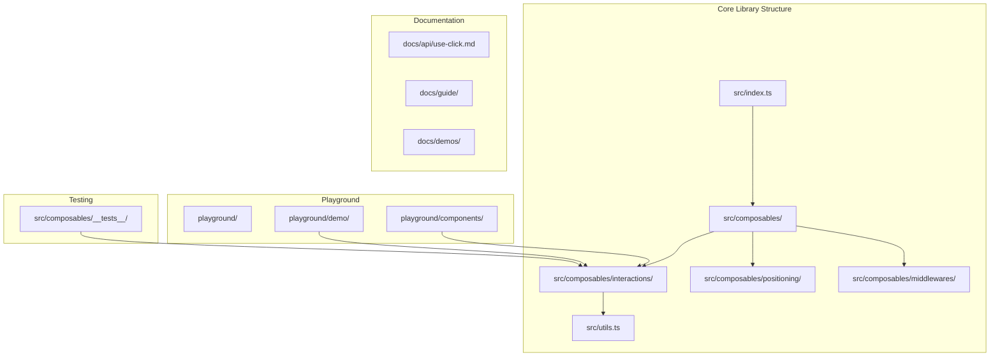
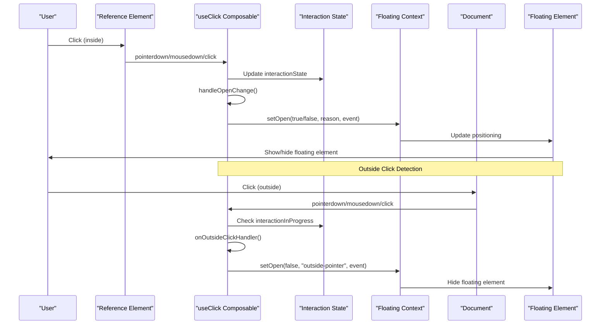
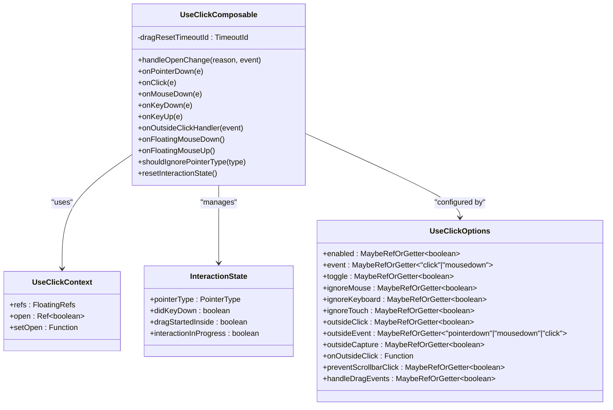
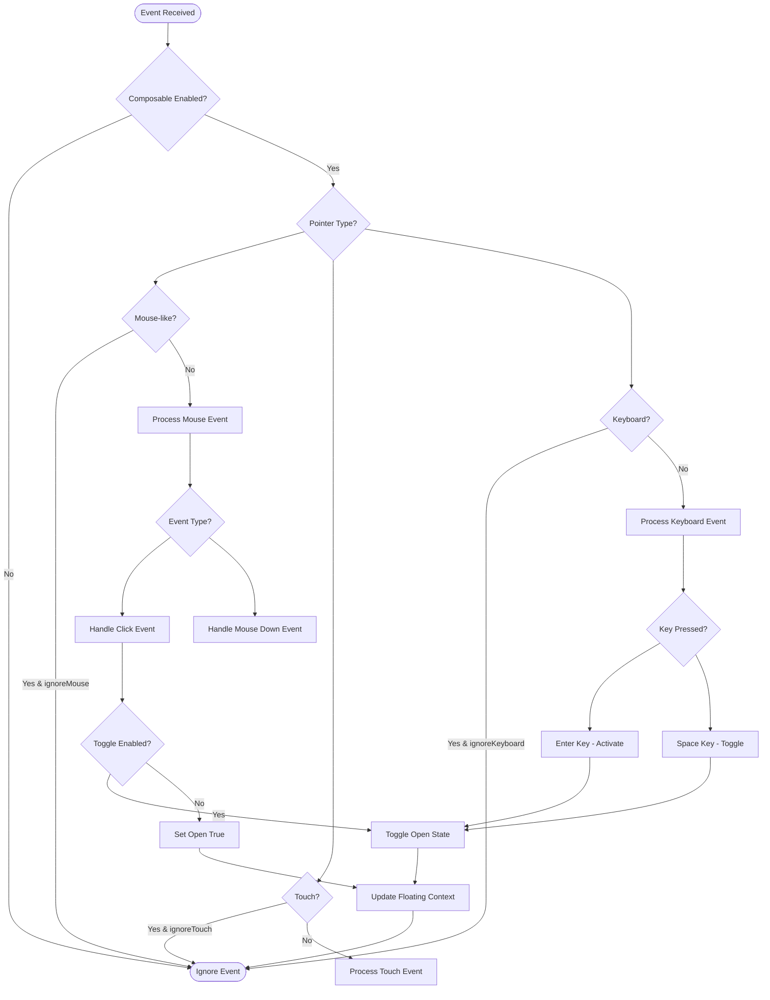
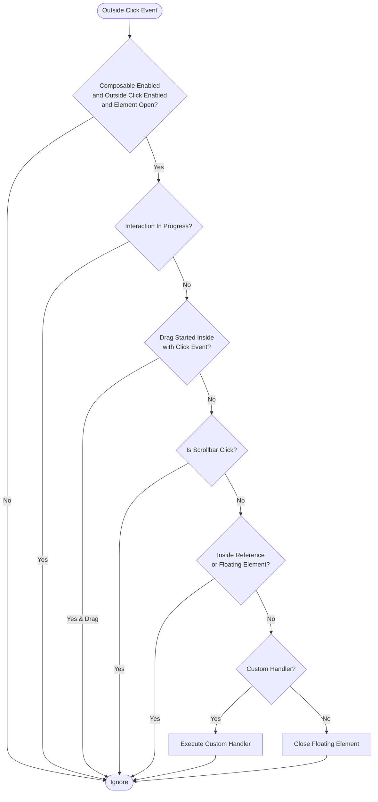
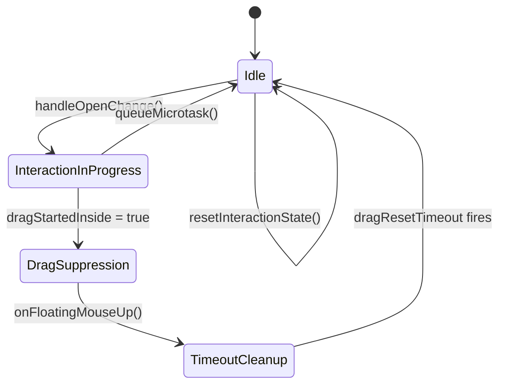
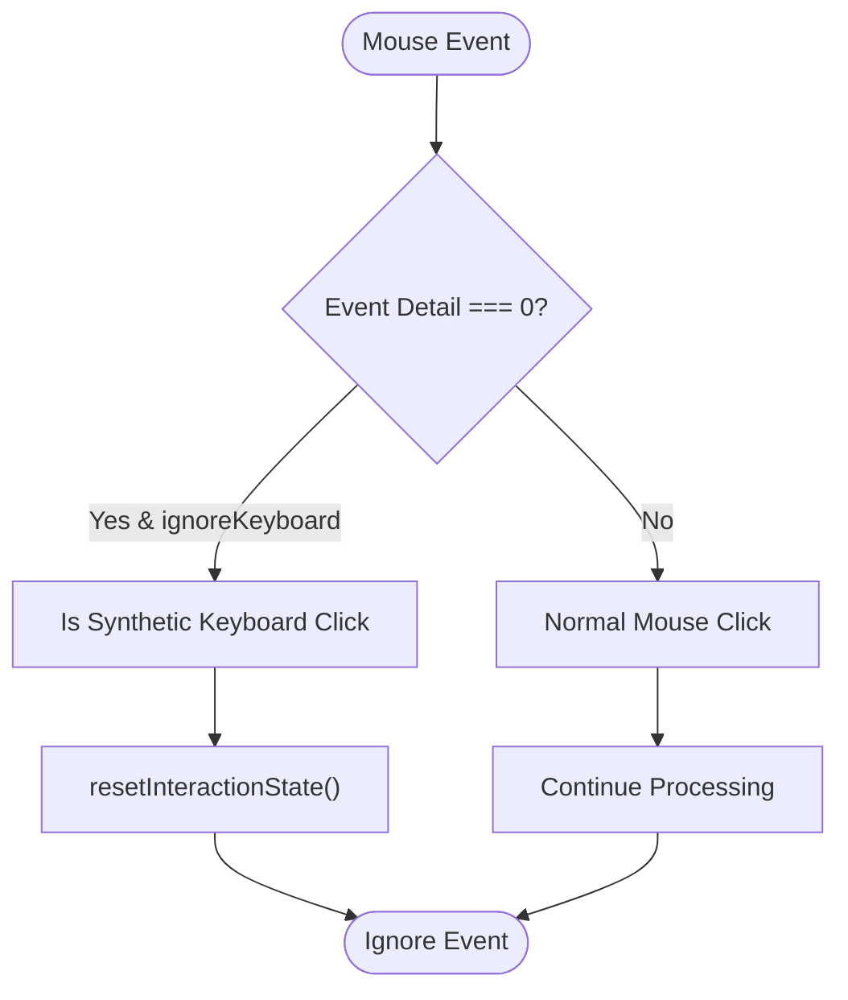

# Use Click Composable

<cite>
**Referenced Files in This Document**
- [use-click.ts](file://src/composables/interactions/use-click.ts)
- [use-click.md](file://docs/api/use-click.md)
- [utils.ts](file://src/utils.ts)
- [use-click.test.ts](file://src/composables/__tests__/use-click.test.ts)
- [ContextMenuExample.vue](file://playground/demo/ContextMenuExample.vue)
- [Menu.vue](file://playground/components/Menu.vue)
- [MenuDemo.vue](file://playground/demo/MenuDemo.vue)
- [index.ts](file://src/index.ts)
- [composables/index.ts](file://src/composables/index.ts)
- [README.md](file://README.md)
- [package.json](file://package.json)
</cite>

## Update Summary
**Changes Made**
- Updated architecture overview to reflect new interaction state management system
- Added documentation for consolidated interactionState object
- Enhanced drag event handling section with timeout-based cleanup
- Updated synthetic keyboard click detection section
- Removed references to deprecated tree-aware functionality
- Updated implementation architecture diagrams to show new state management

## Table of Contents
1. [Introduction](#introduction)
2. [Project Structure](#project-structure)
3. [Core Components](#core-components)
4. [Architecture Overview](#architecture-overview)
5. [Detailed Component Analysis](#detailed-component-analysis)
6. [Dependency Analysis](#dependency-analysis)
7. [Performance Considerations](#performance-considerations)
8. [Troubleshooting Guide](#troubleshooting-guide)
9. [Conclusion](#conclusion)

## Introduction

The `useClick` composable is a core interaction handler in the V-Float library that manages click-based interactions for floating UI elements. It provides comprehensive support for both inside click interactions (opening/toggling floating elements) and outside click interactions (closing floating elements when clicking outside the reference or floating elements).

V-Float is a Vue 3 library for positioning floating UI elements like tooltips, popovers, dropdowns, and modals, built on top of @floating-ui/dom with Vue 3 Composition API. The library emphasizes accessibility, cross-platform compatibility, and provides a unified approach to floating element interactions.

**Updated** The composable now features a refactored interaction state management system with consolidated state variables and improved event handling mechanisms.

## Project Structure

The V-Float project follows a modular architecture organized by functional domains:



**Diagram sources**
- [index.ts:1-2](file://src/index.ts#L1-L2)
- [composables/index.ts:1-4](file://src/composables/index.ts#L1-L4)

**Section sources**
- [README.md:1-216](file://README.md#L1-L216)
- [package.json:1-77](file://package.json#L1-L77)

## Core Components

The V-Float library provides several core composables that work together to create sophisticated floating UI interactions:

### Primary Composables
- **useFloating**: Core positioning logic with middleware support
- **useClick**: Click event handling with toggle and dismiss options
- **useHover**: Hover interactions with configurable delays
- **useFocus**: Focus/blur event handling for keyboard navigation
- **useEscapeKey**: Close on ESC key press with composition handling
- **useClientPoint**: Position floating elements at cursor/touch coordinates

### Supporting Composables
- **useArrow**: Position arrow elements pointing to the anchor
- **useListNavigation**: Keyboard navigation for lists
- **useFocusTrap**: Trap focus within floating elements

The `useClick` composable serves as a unified solution that combines both inside and outside click handling, eliminating the need for separate composables like `useOutsideClick`.

**Section sources**
- [README.md:153-178](file://README.md#L153-L178)
- [use-click.ts:19-50](file://src/composables/interactions/use-click.ts#L19-L50)

## Architecture Overview

The `useClick` composable follows a reactive architecture pattern that integrates seamlessly with Vue's Composition API:



**Diagram sources**
- [use-click.ts:87-226](file://src/composables/interactions/use-click.ts#L87-L226)

The architecture implements several key design patterns:

1. **Consolidated State Management**: All interaction state is now managed through the `interactionState` object
2. **Reactive Configuration**: Options are reactive using Vue's `MaybeRefOrGetter` type
3. **Event Delegation**: Centralized event handling with proper cleanup
4. **State Management**: Coordinated state updates through the floating context
5. **Accessibility First**: Built-in keyboard support and ARIA considerations

**Updated** The composable now features a refactored state management system with the `interactionState` object consolidating all interaction-related state variables.

**Section sources**
- [use-click.ts:51-304](file://src/composables/interactions/use-click.ts#L51-L304)

## Detailed Component Analysis

### Core Functionality

The `useClick` composable provides comprehensive click interaction handling through a unified interface:

#### Inside Click Interactions
- **Toggle Behavior**: Automatic opening and closing of floating elements
- **Event Type Selection**: Support for both `click` and `mousedown` events
- **Pointer Type Detection**: Intelligent handling of mouse, touch, and keyboard interactions
- **Keyboard Accessibility**: Full support for Enter and Space key activation

#### Outside Click Interactions
- **Automatic Detection**: Built-in support for closing floating elements when clicking outside
- **Drag Event Handling**: Proper handling of drag-and-drop interactions with timeout-based cleanup
- **Custom Handlers**: Extensible architecture for custom outside click logic
- **Scrollbar Prevention**: Intelligent filtering of scrollbar clicks

### Implementation Architecture



**Diagram sources**
- [use-click.ts:310-391](file://src/composables/interactions/use-click.ts#L310-L391)

**Updated** The implementation now features a centralized `interactionState` object that consolidates all interaction-related state variables, improving code organization and reducing complexity.

### Event Handling System

The composable implements a sophisticated event handling system that manages multiple interaction modes:



**Diagram sources**
- [use-click.ts:111-180](file://src/composables/interactions/use-click.ts#L111-L180)

### Outside Click Detection

The outside click detection system provides robust dismissal capabilities with enhanced state management:



**Diagram sources**
- [use-click.ts:184-226](file://src/composables/interactions/use-click.ts#L184-L226)

**Updated** The outside click detection now includes enhanced state checking through the `interactionInProgress` flag to prevent conflicts with ongoing interactions.

### State Management System

The composable features a comprehensive state management system centered around the `interactionState` object:



**Diagram sources**
- [use-click.ts:106-129](file://src/composables/interactions/use-click.ts#L106-L129)

**Updated** The state management system now includes:
- **Consolidated State Variables**: All interaction state is managed through the `interactionState` object
- **Timeout-Based Cleanup**: Drag state is cleared using timeouts for proper cleanup
- **Microtask Queueing**: Interaction state resets use microtasks to avoid race conditions
- **Proper Cleanup**: State is reset on component unmount and watcher cleanup

### Synthetic Keyboard Click Detection

The composable includes enhanced detection for synthetic keyboard clicks:



**Diagram sources**
- [use-click.ts:135-139](file://src/composables/interactions/use-click.ts#L135-L139)

**Updated** The synthetic keyboard click detection now uses the `isSyntheticKeyboardClick` function to properly identify and handle keyboard-generated mouse events.

### Configuration Options

The `useClick` composable offers extensive configuration options for fine-tuned behavior:

| Option | Type | Default | Description |
|--------|------|---------|-------------|
| `enabled` | `MaybeRefOrGetter<boolean>` | `true` | Enable/disable click interaction |
| `event` | `MaybeRefOrGetter<'click' \| 'mousedown'>` | `'click'` | Inside click trigger event |
| `toggle` | `MaybeRefOrGetter<boolean>` | `true` | Toggle open state on reference click |
| `ignoreMouse` | `MaybeRefOrGetter<boolean>` | `false` | Ignore mouse events |
| `ignoreKeyboard` | `MaybeRefOrGetter<boolean>` | `false` | Ignore Enter/Space keyboard activation |
| `ignoreTouch` | `MaybeRefOrGetter<boolean>` | `false` | Ignore touch events |
| `outsideClick` | `MaybeRefOrGetter<boolean>` | `false` | Enable outside-click dismissal |
| `outsideEvent` | `MaybeRefOrGetter<'pointerdown' \| 'mousedown' \| 'click'>` | `'pointerdown'` | Event used for outside detection |
| `outsideCapture` | `MaybeRefOrGetter<boolean>` | `true` | Use capture phase for outside listener |
| `onOutsideClick` | `(event: MouseEvent) => void` | `undefined` | Custom outside-click handler |
| `preventScrollbarClick` | `MaybeRefOrGetter<boolean>` | `true` | Ignore scrollbar clicks |
| `handleDragEvents` | `MaybeRefOrGetter<boolean>` | `true` | Handle drag events |

**Section sources**
- [use-click.ts:315-391](file://src/composables/interactions/use-click.ts#L315-L391)

### Real-World Usage Examples

#### Basic Usage
```vue
<script setup>
import { ref } from "vue"
import { useFloating, useClick } from "v-float"

const referenceRef = ref(null)
const floatingRef = ref(null)
const context = useFloating(referenceRef, floatingRef)
useClick(context)
</script>

<template>
  <button ref="referenceRef">Click Me</button>
  <div v-if="context.open.value" ref="floatingRef" :style="context.floatingStyles.value">
    This element appears when the button is clicked
  </div>
</template>
```

#### Context Menu Implementation
```vue
<script setup>
import { ref } from "vue"
import { useFloating, useClientPoint, useClick } from "v-float"

const contextReference = ref(null)
const contextFloating = ref(null)

const contextMenuContext = useFloating(contextReference, contextFloating, {
  placement: "bottom-start",
  middlewares: [flip(), shift({ padding: 8 })]
})

useClientPoint(contextReference, contextMenuContext, {
  trackingMode: "static"
})

useClick(contextMenuContext, {
  outsideClick: true
})

function showContextMenu(event) {
  if (event.button !== 2) return
  contextReference.value = event.target
  contextMenuContext.setOpen(true)
}
</script>
```

**Section sources**
- [ContextMenuExample.vue:36-74](file://playground/demo/ContextMenuExample.vue#L36-L74)
- [use-click.md:59-141](file://docs/api/use-click.md#L59-L141)

## Dependency Analysis

The `useClick` composable has carefully managed dependencies that contribute to its lightweight footprint:

```mermaid
graph LR
subgraph "External Dependencies"
VUE[Vue 3]
VUEUSE[@vueuse/core]
FLOATINGUI[@floating-ui/dom]
end
subgraph "Internal Dependencies"
UTILS[src/utils.ts]
FLOATINGCONTEXT[src/composables/positioning/use-floating.ts]
TYPES[src/types.ts]
end
subgraph "useClick Module"
USECLICK[src/composables/interactions/use-click.ts]
end
VUE --> USECLICK
VUEUSE --> USECLICK
FLOATINGUI --> FLOATINGCONTEXT
UTILS --> USECLICK
FLOATINGCONTEXT --> USECLICK
TYPES --> USECLICK
```

**Diagram sources**
- [use-click.ts:1-13](file://src/composables/interactions/use-click.ts#L1-L13)
- [package.json:39-45](file://package.json#L39-L45)

### Internal Dependencies

The composable relies on several internal utility functions for robust event handling:

- **Pointer Type Detection**: `isMouseLikePointerType` for distinguishing mouse vs touch interactions
- **Element Validation**: `isHTMLElement` and `isEventTargetWithin` for safe DOM operations
- **Keyboard Handling**: `isButtonTarget` and `isSpaceIgnored` for accessibility compliance
- **Drag Detection**: `isClickOnScrollbar` for intelligent scrollbar click filtering

### External Dependencies

The library maintains minimal external dependencies to ensure optimal bundle size:

- **@vueuse/core**: Provides `useEventListener` and reactive utilities
- **@floating-ui/dom**: Core positioning and collision detection algorithms
- **Vue 3**: Composition API and reactivity system

**Section sources**
- [use-click.ts:1-13](file://src/composables/interactions/use-click.ts#L1-L13)
- [utils.ts:68-157](file://src/utils.ts#L68-L157)
- [package.json:39-45](file://package.json#L39-L45)

## Performance Considerations

The `useClick` composable is designed with performance optimization in mind:

### Event Listener Management
- **Dynamic Attachment**: Event listeners are only attached when the composable is enabled
- **Automatic Cleanup**: Proper cleanup prevents memory leaks and event listener accumulation
- **Conditional Registration**: Outside click listeners are conditionally registered based on configuration

### Reactive Updates
- **Computed Properties**: Key state values are computed to minimize unnecessary re-renders
- **Watch Effects**: Efficient watcher cleanup prevents stale closures
- **Microtask Queueing**: Interaction state resets use microtasks to avoid race conditions

### Memory Management
- **Weak References**: No circular references that could cause memory leaks
- **Cleanup Hooks**: Proper cleanup in watchers and lifecycle hooks
- **Event Delegation**: Single listener per event type reduces memory overhead

### Bundle Size Optimization
- **Tree Shaking**: Modular architecture enables dead code elimination
- **Minimal Dependencies**: Only essential external dependencies are included
- **Type Safety**: TypeScript definitions are separated from runtime code

**Updated** The refactored state management system improves memory efficiency by consolidating state variables and using proper cleanup mechanisms.

**Section sources**
- [use-click.ts:253-272](file://src/composables/interactions/use-click.ts#L253-L272)
- [use-click.ts:96-102](file://src/composables/interactions/use-click.ts#L96-L102)

## Troubleshooting Guide

### Common Issues and Solutions

#### Issue: Click Events Not Working
**Symptoms**: Reference element clicks don't toggle floating element
**Causes**:
- Composable not properly initialized
- Reference element not properly bound
- `enabled` option set to `false`

**Solutions**:
```typescript
// Ensure proper initialization
const context = useFloating(referenceRef, floatingRef)
useClick(context)

// Verify reference elements are properly bound
console.log('Reference element:', referenceRef.value)
console.log('Floating element:', floatingRef.value)
```

#### Issue: Outside Clicks Closing Too Early
**Symptoms**: Floating element closes immediately after opening
**Causes**: Event timing conflicts between inside and outside click handlers

**Solutions**:
```typescript
// Use mousedown instead of click for more responsive behavior
useClick(context, { event: 'mousedown' })

// Implement custom outside click handler
useClick(context, {
  outsideClick: true,
  onOutsideClick: (event) => {
    // Add custom logic here
    context.setOpen(false)
  }
})
```

#### Issue: Keyboard Navigation Not Working
**Symptoms**: Enter/Space keys don't activate floating elements
**Causes**: `ignoreKeyboard` option enabled or element not focusable

**Solutions**:
```typescript
// Ensure element is focusable
<button ref="referenceRef" tabindex="0">Focusable Button</button>

// Disable keyboard ignore if needed
useClick(context, { ignoreKeyboard: false })
```

#### Issue: Touch Device Issues
**Symptoms**: Touch interactions behave unexpectedly
**Causes**: Mixed mouse and touch event handling

**Solutions**:
```typescript
// Ignore mouse events on touch devices
useClick(context, { 
  ignoreMouse: true,
  ignoreTouch: false 
})

// Or vice versa for hybrid devices
useClick(context, { 
  ignoreMouse: false,
  ignoreTouch: true 
})
```

#### Issue: Drag Event Handling Problems
**Symptoms**: Outside clicks still trigger after dragging
**Causes**: Drag state not properly reset

**Solutions**:
```typescript
// Ensure drag events are properly handled
useClick(context, { 
  handleDragEvents: true,
  outsideEvent: 'click'
})

// The timeout-based cleanup system will automatically reset drag state
```

### Debugging Techniques

#### Enable Debug Logging
```typescript
// Add logging to understand event flow
function debugClickHandler(event) {
  console.log('Click event:', {
    type: event.type,
    target: event.target,
    pointerType: event.pointerType,
    button: event.button,
    detail: event.detail
  })
}

useClick(context, {
  onOutsideClick: (event) => {
    debugClickHandler(event)
    context.setOpen(false)
  }
})
```

#### Test Configuration
```typescript
// Comprehensive test setup
const testConfig = {
  enabled: true,
  event: 'click',
  toggle: true,
  ignoreMouse: false,
  ignoreKeyboard: false,
  ignoreTouch: false,
  outsideClick: true,
  outsideEvent: 'pointerdown',
  outsideCapture: true,
  preventScrollbarClick: true,
  handleDragEvents: true
}

useClick(context, testConfig)
```

**Updated** The debugging techniques now include monitoring the `interactionState` object and drag event handling for better troubleshooting of state-related issues.

**Section sources**
- [use-click.test.ts:14-369](file://src/composables/__tests__/use-click.test.ts#L14-L369)
- [use-click.ts:87-103](file://src/composables/interactions/use-click.ts#L87-L103)

## Conclusion

The `useClick` composable represents a mature, well-architected solution for floating UI click interactions in Vue 3 applications. Its comprehensive feature set, robust accessibility support, and performance optimizations make it an essential component of the V-Float ecosystem.

Key strengths of the implementation include:

- **Unified Interface**: Combines inside and outside click handling in a single, cohesive API
- **Accessibility-First Design**: Built-in keyboard support and proper ARIA considerations
- **Flexible Configuration**: Extensive options for customizing behavior across different use cases
- **Performance Optimization**: Carefully managed event listeners and reactive updates
- **Comprehensive Testing**: Thorough test coverage ensuring reliability across scenarios
- **Refactored State Management**: Consolidated state variables and improved cleanup mechanisms

**Updated** The recent refactoring introduces a more robust state management system with the `interactionState` object, enhanced drag event handling with timeout-based cleanup, and improved synthetic keyboard click detection. These improvements provide better reliability and maintainability while preserving the composable's core functionality.

The composable's architecture demonstrates best practices in Vue 3 composition API usage, with proper cleanup, reactive configuration, and modular design. As part of the broader V-Float library, it provides developers with a powerful toolkit for creating sophisticated floating UI components while maintaining excellent performance and accessibility standards.

Future enhancements could include additional gesture support, improved integration with other interaction composables, and expanded customization options for advanced use cases. However, the current implementation provides a solid foundation for most floating UI interaction requirements.