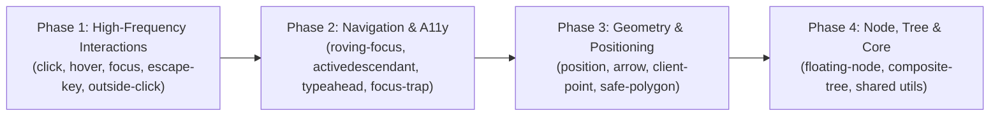

# RFC 0005: Behavior-Driven Development (BDD) Testing Standards & Migration Framework

- **Start Date**: 2026-09-23
- **Status**: Proposed
- **Target Version**: VFloat Next Minor / 1.0
- **Relevant Subsystems**: All test suites (`packages/vue/src/**/*.test.ts`), `@/test-utils`, Vitest Browser Mode, CI validation, `.agents/skills/vfloat-test-standards/`

---

## 1. Summary

This RFC establishes **Behavior-Driven Development (BDD)** as the official testing standard for the VFloat codebase. 

While VFloat leverages **Vitest Browser Mode** (Playwright / Chromium) for native DOM fidelity, our test suites currently suffer from:
1. **Imperative scripting & implementation coupling**: Directly asserting private reactive signals (`expect(node.open.value).toBe(true)`) instead of verifying user-observable accessibility invariants (`aria-expanded`, `expect.element(el).toBeVisible()`), or inspecting raw DOM pointers (`document.activeElement === el`).
2. **Ambiguous specifications**: Vague test descriptions (`"works with defaults"`, `"handles edge cases"`), ad-hoc fixture mutations, and fragmented structure across test tiers.

This proposal introduces a unified BDD framework that transforms test files into **living executable specifications** structured around **Given-When-Then** behavioral contracts, prioritizes **user-facing accessibility and DOM invariants**, and respects VFloat's pure Vue 3.5 reactive architecture.

---

## 2. Motivation & Architectural Reality

### 2.1 VFloat's Direct Reactivity Architecture

VFloat is a headless engine built on Vue 3.5 primitives. In VFloat:
- `FloatingNode.open` is a plain Vue `Ref<boolean>`.
- Interaction composables (`useClick`, `useHover`, `useEscapeKey`, `useOutsideClick`) manipulate `node.open.value` directly.
- VFloat intentionally avoids synthetic action dispatchers, event emission wrappers, and reason string registries (`setOpen`, `onOpenChange`, reason codes).
- The rendered component binds `node.open.value` to template visibility (`v-if`, `v-show`), accessibility state (`aria-expanded`), and focus orchestration.

### 2.2 Where Current Tests Suffer From Implementation Coupling

An audit of existing suites (`packages/vue/src/**/*.test.ts`) highlights anti-patterns:

1. **Asserting Private Intermediate Signals Instead of Observable DOM State**:
   ```ts
   // ❌ Anti-pattern: Couled to internal ref state in component render tests
   expect(node.open.value).toBe(true);

   // ✅ User-facing BDD: Asserts what the user & screen reader observe
   await expect.element(anchorEl).toHaveAttribute("aria-expanded", "true");
   await expect.element(floatingEl).toBeVisible();
   ```
2. **Raw Reference Checks Instead of Semantic Focus Queries**:
   ```ts
   // ❌ Anti-pattern: Low-level DOM pointer inspection
   expect(document.activeElement).toBe(itemEl);

   // ✅ User-facing BDD: Assert accessible focus
   await expect.element(itemEl).toHaveFocus();
   ```
3. **Synthetic Manual Dispatches Instead of Natural Gestures**:
   ```ts
   // ❌ Anti-pattern: Bypasses browser hit-testing, focus shifting, and event phases
   anchorEl.dispatchEvent(new MouseEvent("click"));

   // ✅ User-facing BDD: Natural user gesture
   await userEvent.click(anchorEl);
   ```

### 2.3 Where Low-Level Testing is Strictly Justified

While 80–90% of test assertions should be user-facing, two specific domains require low-level access:

1. **Hardware Quirks & Device Normalization**:
   High-level tools like `userEvent` simulate an ideal browser on standard hardware. VFloat exists specifically to normalize real-world hardware quirks (e.g. hybrid laptops firing touch events with `pointerType: ""`, or screen readers firing synthetic clicks with `detail === 0`). Verifying that VFloat absorbs these edge cases requires dispatching synthetic low-level events.
2. **Pure Geometric Math (Tier P)**:
   Collision detection, safe triangle corridors (`safePolygon`), and boundary clamping are pure mathematical algorithms. Testing them via full DOM rendering in 1000px viewports is slow and flaky; testing the geometric functions with exact coordinates is fast, isolated, and deterministic.

---

## 3. Element Querying Strategy: Locators vs. DOM References

```
┌────────────────────────────────────────────────────────────────────────┐
│                     ELEMENT QUERY CLASSIFICATION                       │
├───────────────────────┬──────────────────────┬─────────────────────────┤
│ Query Mechanism       │ Return Type          │ Primary Purpose         │
├───────────────────────┼──────────────────────┼─────────────────────────┤
│ page.getByRole(...)   │ Playwright Locator   │ User gestures (click,   │
│ page.getByTestId(...) │ (Async)              │ keyboard, a11y asserts) │
├───────────────────────┼──────────────────────┼─────────────────────────┤
│ getTestEl(...)        │ Raw HTMLElement      │ Low-level geometry stubs│
│ getRenderedEl(...)    │ (Synchronous)        │ & synthetic events      │
├───────────────────────┼──────────────────────┼─────────────────────────┤
│ Fixture Factory       │ Composite Bundle     │ "Given" (Arrange) step  │
│ (renderClick)         │ { el, node, ... }    │ eliminates boilerplate  │
└───────────────────────┴──────────────────────┴─────────────────────────┘
```

### 3.1 `page.getBy*` (Locators) — Default for User-Facing Interactions
Locators represent elements the way users and assistive technologies perceive them. They auto-wait, auto-retry, and pair directly with `userEvent` and `expect.element()` assertions:
```ts
const anchorEl = page.getByRole("button", { name: "Toggle Menu" });
await userEvent.click(anchorEl);
await expect.element(anchorEl).toHaveAttribute("aria-expanded", "true");
```

### 3.2 `getTestEl()` (`@/test-utils`) — Guarded Low-Level Escape Hatch
When a test specifically exercises hardware anomalies or stubbed geometry, a raw `HTMLElement` is required. `getTestEl(testId)` returns a typed `HTMLElement` synchronously and throws a clear error if the element failed to render:
```ts
// Used ONLY when low-level DOM access is mandatory
const anchorEl = getTestEl("anchor");
anchorEl.dispatchEvent(makePointerEvent("pointerdown", { pointerType: "" }));
```

### 3.3 The Fixture Factory — Encapsulating the "Given" (Arrange) Phase
The fixture factory (`createTestComponent` / `renderClick`) is **not** a third query engine; it is an ergonomic wrapper that mounts the Vue 3.5 component, flushes Vue's reactivity queue (`await nextTick()`), and exposes the necessary handles to prevent repetitive 10-line boilerplate in every single test.

---

## 4. The BDD Specification Standard

### 4.1 Three-Level Suite Hierarchy

To prevent deeply nested "describe hell" while guaranteeing clean BDD structure, every VFloat test file must adhere to a maximum 3-level hierarchy:

```
Level 1: Feature      ── describe("Feature: [Capability / Composable]")
Level 2: Scenario     ── describe("Scenario: [Context / Circumstance / Given state]")
Level 3: Behavioral Spec ─ it("Given [Context], When [Action], Then [Expected Outcome]")
                        or it("When [Action], Then [Expected Outcome]")
```

```ts
// Example Hierarchy:
describe("Feature: useClick", () => {
  describe("Scenario: Toggle activation on anchor click", () => {
    it("Given a closed popover, When the anchor is clicked, Then it opens and updates aria-expanded", async () => {
      // 1. Given (Arrange)
      const { anchorEl } = await renderClick({ toggle: true });
      await expect.element(anchorEl).toHaveAttribute("aria-expanded", "false");

      // 2. When (Act)
      await userEvent.click(anchorEl);

      // 3. Then (Assert)
      await expect.element(anchorEl).toHaveAttribute("aria-expanded", "true");
    });
  });
});
```

### 4.2 The Given-When-Then Anatomy

Every test case (`it()` block) must logically contain three discrete phases:

| Phase | Responsibility | Standard Mechanism |
| :--- | :--- | :--- |
| **Given** (Arrange) | Set up preconditions, render component fixture, verify initial baseline. | `createTestComponent()` / `render()`, initial locator queries. |
| **When** (Act) | Execute the user gesture, keyboard stroke, or property update. | `await userEvent.*`, `dispatchKey()`, or reactive prop change. |
| **Then** (Assert) | Verify observable user outcomes, ARIA states, focus, or composable return. | `expect.element(el).*`, `expect(node.open.value).toBe(...)`. |

### 4.3 Behavioral Naming Rules

1. **Top-Level Feature**: Must start with `Feature: <ComposableName | ModuleName>`.
2. **Scenario Groups**: Must start with `Scenario: <Contextual circumstance or user capability>`.
3. **Spec Descriptions**:
   - Must use present tense and declarative language.
   - For simple flows: `When [action occurs], Then [expected outcome]` (e.g., `it("When Escape is pressed, Then closes the floating element and restores focus to anchor")`).
   - For stateful flows: `Given [initial condition], When [action occurs], Then [expected outcome]` (e.g., `it("Given a disabled menuitem, When clicked, Then preserves open state and ignores selection")`).
   - **Forbidden phrases**: `"should work"`, `"handles correctly"`, `"tests XYZ"`, `"test 1"`, `"edge case"`.

---

## 5. BDD Mapping Across Test Tiers

VFloat classifies all test suites into three tiers. The BDD standard applies uniformly across all tiers:

```
┌─────────────────────────────────────────────────────────────────────────┐
│                           VFLOAT TEST TIERS                             │
├────────────────────────────────┬────────────────────────────────────────┤
│ Tier P: Pure Logic & Geometry  │ Given math/state -> When evaluated     │
│                                │ -> Then returns deterministic value    │
├────────────────────────────────┼────────────────────────────────────────┤
│ Tier S: Single Composable      │ Given rendered fixture -> When user    │
│ (Render-Based)                 │ interacts -> Then DOM & state update   │
├────────────────────────────────┼────────────────────────────────────────┤
│ Tier I: Integration & Hierarchy│ Given nested nodes -> When gesture     │
│ (Render-Based Multi-Node)      │ triggers -> Then tree arbitrates       │
└────────────────────────────────┴────────────────────────────────────────┘
```

### 5.1 Tier P: Pure Logic / Geometry / State Machine

```ts
describe("Feature: Polygon Geometry (safePolygon)", () => {
  describe("Scenario: Pointer movement along cursor corridor", () => {
    it("Given a triangular safe corridor, When pointer moves toward floating element, Then point is within corridor", () => {
      // Given
      const polygon = createSafePolygon({
        cursor: { x: 10, y: 10 },
        placement: "bottom",
        floatingRect: { x: 0, y: 50, width: 100, height: 100 },
      });

      // When
      const isInside = isPointInPolygon({ x: 25, y: 30 }, polygon);

      // Then
      expect(isInside).toBe(true);
    });
  });
});
```

### 5.2 Tier S: Single Composable (Render-Based)

```ts
describe("Feature: useEscapeKey", () => {
  afterEach(() => {
    vi.clearAllMocks();
    vi.useRealTimers();
  });

  describe("Scenario: Dismissing floating element on Escape keydown", () => {
    it("Given an open floating element, When Escape is pressed, Then closes the floating element", async () => {
      // Given
      const { anchorEl, floatingEl } = await renderEscapeKeyFixture({ defaultOpen: true });
      await expect.element(floatingEl).toBeVisible();

      // When
      await userEvent.keyboard("{Escape}");

      // Then: Observable user outcome
      await expect.element(floatingEl).not.toBeInTheDocument();
      await expect.element(anchorEl).toHaveFocus();
    });

    it("Given enabled is false, When Escape is pressed, Then preserves open state and ignores keypress", async () => {
      // Given
      const { floatingEl } = await renderEscapeKeyFixture({ defaultOpen: true, enabled: false });

      // When
      await userEvent.keyboard("{Escape}");

      // Then
      await expect.element(floatingEl).toBeVisible();
    });
  });
});
```

### 5.3 Tier I: Integration & Nested Floating Hierarchies

```ts
describe("Feature: Nested Menu Dismissal Coordination", () => {
  afterEach(() => {
    vi.clearAllMocks();
    vi.useRealTimers();
  });

  describe("Scenario: Cascading Escape dismissal in submenu hierarchies", () => {
    it("Given a root menu with an open submenu, When Escape is pressed inside submenu, Then closes submenu while root remains open", async () => {
      // Given
      const { rootMenuEl, subMenuEl } = await renderNestedMenuFixture();
      await expect.element(rootMenuEl).toBeVisible();
      await expect.element(subMenuEl).toBeVisible();

      // When
      await userEvent.keyboard("{Escape}");

      // Then
      await expect.element(subMenuEl).not.toBeInTheDocument();
      await expect.element(rootMenuEl).toBeVisible();
    });
  });
});
```

---

## 6. Concrete Before vs. After Migration

### Before (Legacy Imperative Style with Implementation Coupling):

```ts
describe("useClick", () => {
  it("toggles open state on click", async () => {
    const { anchorEl, node } = await renderClick({ toggle: true });
    expect(node.open.value).toBe(false); // ❌ Raw ref check in render test

    await userEvent.click(anchorEl);
    await nextTick();
    expect(node.open.value).toBe(true);  // ❌ Raw ref check in render test

    await userEvent.click(anchorEl);
    await nextTick();
    expect(node.open.value).toBe(false); // ❌ Raw ref check in render test
  });

  it("does not toggle on mouse click if ignoreMouse is true", async () => {
    const { anchorEl, node } = await renderClick({ ignoreMouse: true });
    expect(node.open.value).toBe(false);

    await userEvent.click(anchorEl);
    expect(node.open.value).toBe(false);
  });
});
```

### After (Standardized BDD Specification with Observable Invariants):

```ts
describe("Feature: useClick", () => {
  afterEach(() => {
    vi.clearAllMocks();
    vi.useRealTimers();
  });

  describe("Scenario: Toggle activation on anchor click", () => {
    it("Given a closed floating element with toggle enabled, When anchor is clicked, Then opens and marks anchor as expanded", async () => {
      // Given
      const { anchorEl, floatingEl } = await renderClick({ toggle: true });
      await expect.element(anchorEl).toHaveAttribute("aria-expanded", "false");

      // When
      await userEvent.click(anchorEl);

      // Then: Observable user/a11y invariant
      await expect.element(anchorEl).toHaveAttribute("aria-expanded", "true");
      await expect.element(floatingEl).toBeVisible();
    });

    it("Given an open floating element with toggle enabled, When anchor is clicked again, Then closes and marks anchor as collapsed", async () => {
      // Given
      const { anchorEl, floatingEl } = await renderClick({ toggle: true, defaultOpen: true });
      await expect.element(anchorEl).toHaveAttribute("aria-expanded", "true");

      // When
      await userEvent.click(anchorEl);

      // Then
      await expect.element(anchorEl).toHaveAttribute("aria-expanded", "false");
      await expect.element(floatingEl).not.toBeInTheDocument();
    });
  });

  describe("Scenario: Input modality filtering", () => {
    it("Given ignoreMouse is true, When anchor is clicked via mouse pointer, Then preserves closed state", async () => {
      // Given
      const { anchorEl } = await renderClick({ ignoreMouse: true });
      await expect.element(anchorEl).toHaveAttribute("aria-expanded", "false");

      // When
      await userEvent.click(anchorEl);

      // Then
      await expect.element(anchorEl).toHaveAttribute("aria-expanded", "false");
    });
  });
});
```

---

## 7. Migration Strategy & Phased Rollout Plan



| Phase | Target Suites | Key Focus |
| :--- | :--- | :--- |
| **Phase 1: Interaction Sensors** | `use-click`, `use-hover`, `use-focus`, `use-escape-key`, `use-outside-click` | Eliminate residual manual-DOM patterns, adopt `Feature`/`Scenario` hierarchy, assert `aria-expanded` and visibility. |
| **Phase 2: Keyboard & Navigation** | `use-roving-focus`, `use-aria-activedescendant`, `use-typeahead`, `use-focus-trap` | Replace `document.activeElement` checks with `expect.element(el).toHaveFocus()`; formalize ARIA contracts. |
| **Phase 3: Positioning & Geometry** | `use-position`, `use-arrow`, `use-client-point`, `polygon-geometry` | Standardize Tier P pure geometric algorithms and Tier S placement transitions. |
| **Phase 4: Tree & Core Infrastructure** | `use-floating-node`, `floating-tree`, `use-collection`, `input-modality` | Formalize composite tree lifecycle, containment checks, and modality arbitration. |

---

## 8. Summary Checklist for BDD Tests

When authoring or reviewing BDD tests in VFloat:

- [ ] Suite follows the 3-level hierarchy: `Feature` → `Scenario` → `Spec`.
- [ ] Spec descriptions follow `Given [Context], When [Action], Then [Expected Outcome]`.
- [ ] User-facing invariants (`aria-expanded`, `toHaveFocus()`, `toBeVisible()`) are preferred over intermediate reactive state.
- [ ] Real user gestures (`userEvent.*`) are used for interaction flows.
- [ ] Low-level DOM (`getTestEl`, synthetic builders) is used *only* when testing device hardware anomalies or geometric stubs.
- [ ] Each test renders its own component; zero shared mutable state between tests.
