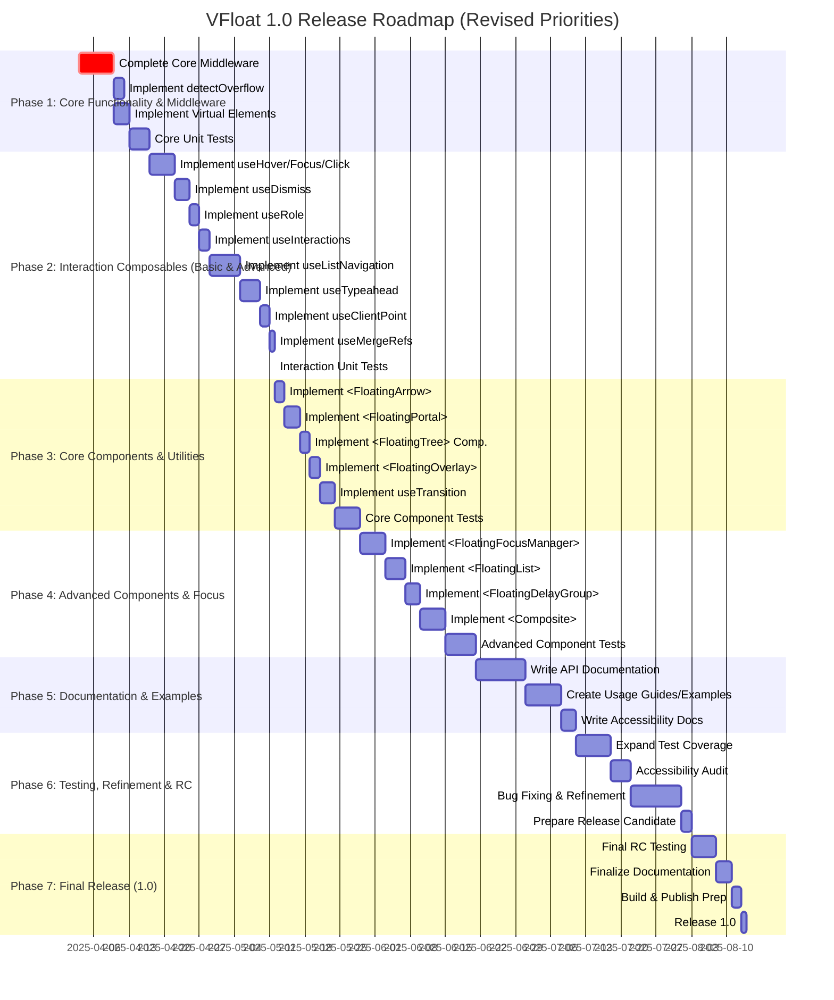

# VFloat 1.0 Release Roadmap

This roadmap outlines the planned phases and tasks to reach the 1.0 release of VFloat, the Vue 3 port of Floating UI, based on the requirements defined in `requirements.md` and the project state as of April 2, 2025.

## Roadmap Visualization

## Phase Descriptions

1.  **Phase 1: Core Functionality & Middleware:** Focuses on completing the foundational positioning logic by implementing the remaining middleware functions (`shift`, `flip`, `size`, `autoPlacement`, `hide`, `inline`), `detectOverflow`, and support for virtual elements. Establish basic unit tests.
2.  **Phase 2: Interaction Composables (Basic & Advanced):** Implement all interaction patterns (`useHover`, `useFocus`, `useClick`, `useDismiss`, `useListNavigation`, `useTypeahead`, `useClientPoint`), accessibility roles (`useRole`), the mechanism to combine them (`useInteractions`), and the ref merging utility (`useMergeRefs`). Add comprehensive unit tests for all composables.
3.  **Phase 3: Core Components & Utilities:** Start building the UI component layer, including the visual arrow (`<FloatingArrow>`), DOM portal (`<FloatingPortal>`), tree context (`<FloatingTree>`), overlay (`<FloatingOverlay>`), and transition helpers (`useTransitionStyles`/`useTransitionStatus`). Add component and integration tests.
4.  **Phase 4: Advanced Components & Focus:** Implement the remaining, more complex components for focus management (`<FloatingFocusManager>`), list contexts (`<FloatingList>`), delay groups (`<FloatingDelayGroup>`), and composite widgets (`<Composite>`). Add tests.
5.  **Phase 5: Documentation & Examples:** Create comprehensive documentation covering the API, usage patterns, examples (potentially using the existing `docs/` structure), and accessibility best practices.
6.  **Phase 6: Testing, Refinement & RC:** Perform extensive testing (unit, integration, accessibility audit), fix bugs identified, refine the API based on usage feedback from examples/tests, and prepare a Release Candidate (RC).
7.  **Phase 7: Final Release (1.0):** Conduct final testing on the RC, finalize all documentation, prepare the build and publishing pipeline, and officially release version 1.0.
