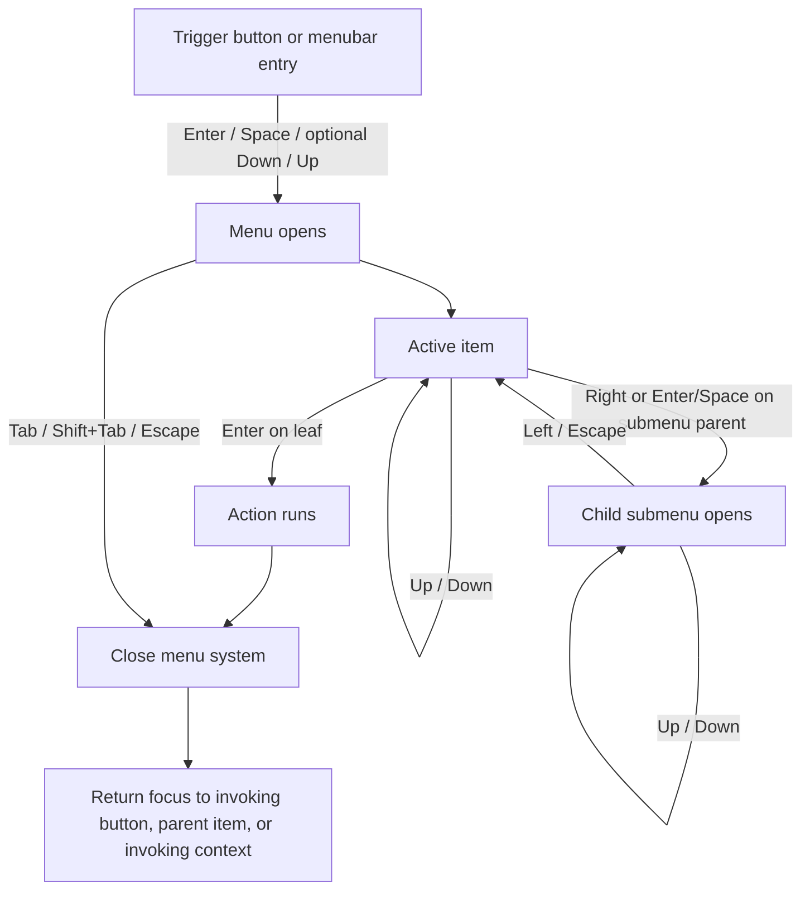

# Accessible Menus and Nested Submenus on the Web

## Executive summary

This report prioritizes specifications from entity["organization","W3C","web standards body"], platform guidance from entity["company","Apple","consumer tech company"], entity["company","Google","internet technology company"], and entity["company","Microsoft","software company"], and implementation references from entity["organization","Mozilla","web docs community"]. The highest-confidence conclusion is that `role="menu"` and `role="menubar"` are **desktop-style composite widgets**, not generic dropdown/navigation primitives. Use them for command menus, application menus, and context menus that must support full arrow-key navigation, managed focus, submenu semantics, checked states, and first-character navigation. For ordinary site navigation, the preferred pattern is usually a disclosure/navigation pattern, not ARIA menus. citeturn31view0turn14view0turn14view1turn14view3turn40view0

A second core conclusion is that ARIA supplies semantics, **not behavior**. If you use menu roles, you are promising to implement the full keyboard model yourself: opening behavior, roving focus or `aria-activedescendant`, submenu traversal, escape/close behavior, disabled-item handling, separators, focus restoration, and synchronization between visual state, DOM state, and ARIA state. That is a hard requirement, not an enhancement. citeturn40view0turn5view3turn5view1turn16view0

For focus, the two viable patterns are **roving `tabindex`** and **container focus with `aria-activedescendant`**. Both are accepted by APG. With roving `tabindex`, DOM focus moves between items; with `aria-activedescendant`, DOM focus stays on the container while assistive technologies are told which item is active. In either pattern, the active item must have a strong visible indicator, remain scrolled into view, and not be fully obscured by overlays or sticky UI. citeturn17view0turn17view1turn12view2turn35view1turn35view2turn35view3

For pointer and touch input, the standards picture is much less complete. APG explicitly says mobile and touch support is not yet standardized across mobile browsers, and its examples warn about support gaps, especially on mobile/touch devices. That means teams should treat desktop keyboard behavior as relatively well-specified, and mouse/touch behavior as an area where equivalent access must be designed carefully and then tested on real devices with real assistive technologies. citeturn40view0turn14view2turn15view2turn15view3

For nested submenus, the cited sources agree on the broad direction but not on all mechanics. Parent items that open submenus need `aria-haspopup="menu"` (or `true`) and `aria-expanded`, menus should usually be shallow, and deep nesting should be avoided because it increases invocation difficulty and memory load. Exact depth limits, exact collision-handling rules, and exact hover delay timings are **not specified** in the reviewed standards and platform/library guidance. citeturn16view0turn12view3turn31view0turn23view0turn26search2

## Normative model and role selection

The normative hierarchy is straightforward. Use the ARIA specification for role/state/property meaning; use APG for the expected keyboard and composite-widget behavior; use WCAG for focus visibility, hover/focus persistence, and obscured-focus requirements; then consult platform/component guidance for product-level conventions and tradeoffs. Where those sources do not specify a detail, that detail is implementation-defined and should be marked as such. citeturn5view0turn5view1turn40view0turn35view2turn35view3turn19search0

The distinction between `menu` and `menubar` is normative. ARIA defines `menu` as a widget offering a list of choices, typically like a desktop application menu, with implicit vertical orientation. ARIA defines `menubar` as a persistent presentation of a menu, usually horizontal, similar to Windows/macOS/GNOME menu bars. APG then layers on the expected keyboard interaction for each. citeturn31view0turn5view1

APG and MDN are also explicit that **typical site navigation should not be given `role="menu"` just because it looks like a dropdown**. The disclosure navigation example states that ordinary site nav usually does not need the complex functionality users and assistive technologies expect from a true menu widget. The navigation menubar example repeats that warning and says disclosure is generally the better fit for websites. citeturn14view0turn14view1turn14view3

### Choosing the right pattern

| Pattern                      | Use when                                                                                                                   | Do not use when                                                                                                | Key semantics                                                                       | Source basis                                      |
| ---------------------------- | -------------------------------------------------------------------------------------------------------------------------- | -------------------------------------------------------------------------------------------------------------- | ----------------------------------------------------------------------------------- | ------------------------------------------------- |
| **Menu button + popup menu** | A button opens a transient list of actions or links and the popup should act like a desktop command menu.                  | A simple disclosure is enough, or the content is ordinary site navigation without composite keyboard behavior. | `button` + `aria-haspopup` + `aria-expanded` + popup `role="menu"`                  | citeturn5view2turn31view0turn14view2         |
| **Menubar**                  | A persistent application-style command strip must remain visible and support directional navigation among top-level items. | Typical website nav, especially if arrow-key composite behavior would be unnecessary or surprising.            | `role="menubar"` with child menuitems and optional submenus                         | citeturn31view0turn14view3turn5view1         |
| **Disclosure navigation**    | Expanding groups of links in site navigation, especially where Tab-based navigation should remain conventional.            | You need a true command/menu model with arrow-key intra-widget navigation and menu semantics.                  | Buttons plus disclosure semantics inside a `nav` landmark                           | citeturn14view1turn13search9                  |
| **Context menu**             | Commands are contextual to the current target and invoked by secondary click, long-press, or touch-and-hold.               | The menu is a primary navigation surface or only path to critical actions.                                     | Platform-specific invocation plus standard menu semantics if implemented on the web | citeturn26search1turn27search12turn28search0 |

## Interaction model across keyboard, mouse, and touch

### Keyboard model

The APG model for menus is comprehensive and should be treated as the default unless a platform or product rationale requires a documented deviation. In a `menu`, `Tab` does **not** move among menu items; authors must place focus inside the menu when it opens. In a `menubar`, focus enters with `Tab`, lands on the first item or optionally the previously focused one, and then arrow keys drive movement within the bar and through submenus. Disabled items are focusable during arrow-key navigation but cannot be activated; separators are never focusable. citeturn5view1turn15view4turn16view0turn17view1

### Keyboard mapping table

| Key                 | Closed menu button                   | Open popup menu                                                                                                                                                                                                         | Menubar                                                                    | Notes                          |
| ------------------- | ------------------------------------ | ----------------------------------------------------------------------------------------------------------------------------------------------------------------------------------------------------------------------- | -------------------------------------------------------------------------- | ------------------------------ |
| `Enter`             | Open menu, focus first item          | If on submenu parent, open child submenu and focus first item; otherwise activate item and close                                                                                                                        | Same activation rule on focused item                                       | citeturn5view2turn16view1  |
| `Space`             | Open menu, focus first item          | Optional: toggle `menuitemcheckbox`/`menuitemradio` without closing; optional open submenu; optional activate leaf and close                                                                                            | Same optional behavior                                                     | citeturn5view2turn16view1  |
| `Down Arrow`        | Optional open and focus first item   | Move to next item, optionally wrap                                                                                                                                                                                      | On a menubar item with submenu, open submenu and focus first item          | citeturn5view2turn16view1  |
| `Up Arrow`          | Optional open and focus last item    | Move to previous item, optionally wrap                                                                                                                                                                                  | Optional: from menubar item with submenu, open submenu and focus last item | citeturn5view2turn16view1  |
| `Right Arrow`       | No default APG behavior              | If on submenu parent, open child submenu and focus first item; if inside a submenu opened from a menubar and not on a submenu parent, close current submenu, move to next menubar item, and optionally open its submenu | Move to next menubar item, optionally wrap                                 | citeturn16view1turn16view2 |
| `Left Arrow`        | No default APG behavior              | In a submenu, close current submenu and return to its parent item; if submenu belongs to a menubar, may also move to previous menubar item and optionally open its submenu                                              | Move to previous menubar item, optionally wrap                             | citeturn16view1turn16view2 |
| `Home` / `End`      | No default APG behavior while closed | Required if you choose **no-wrap** navigation; move to first/last item                                                                                                                                                  | Same                                                                       | citeturn16view0             |
| Printable character | None                                 | Optional single-character typeahead to next item whose label begins with that character                                                                                                                                 | Same                                                                       | citeturn16view0             |
| `Escape`            | Usually no effect while closed       | Close current menu and return focus to invoker or parent menuitem/context                                                                                                                                               | Same                                                                       | citeturn16view0turn15view2 |
| `Tab` / `Shift+Tab` | Conventional page navigation         | Exit the menu system and close all menus; does not move among items                                                                                                                                                     | Enters menubar from page flow; exits and closes when already inside        | citeturn5view1turn15view4  |

If you allow wrapping, `Down` may cycle from last to first and `Up` from first to last. APG makes wrapping optional; Windows guidance explicitly says cycling is useful for popup menus because they may open in unpredictable directions, while warning against trapping users in endless loops in non-popup UIs. That combination leads to a strong recommendation: **wrapping is appropriate for transient popup menus, but if you turn it off, implement `Home` and `End`.** citeturn16view1turn28search1

For vertical menubars or horizontal popup menus, APG says the horizontal and vertical arrow semantics swap. That is specified; it is not a product preference. citeturn16view0

### Focus flow

The following diagram reflects the APG keyboard model and focus-return rules. citeturn5view2turn16view1turn16view2



### Mouse model

For a menu button that opens a true ARIA menu, the safe expectation is: **primary click opens the menu and should establish the same internal active item state that keyboard opening would establish**. APG’s keyboard-interface guidance says pointer interactions should update `tabindex` or `aria-activedescendant` in the same way keyboard interactions do, specifically to avoid a mismatch when users switch modalities. MDN’s menu guidance also states that when the menu opens, interaction with the opener should place focus on a menu item. citeturn17view1turn8search11

For leaf items, “click-to-activate” is the dominant model: click dispatches an action, the menu system closes, and focus lands on the invoked destination or returns to the opener/context depending on whether the action navigates, mutates local state, or returns to an editor context. The APG examples explicitly restore focus to the menu button after command activation in action menus, while APG navigation menubar guidance recommends moving focus to the loaded content heading when activation changes page content without a page load. citeturn15view2turn15view3turn14view3

“Hover to open” is **not specified as a universal requirement** in the cited APG patterns, and hover-only disclosure is risky. WCAG requires additional hover/focus content to be dismissible, hoverable, and persistent enough not to disappear while the pointer moves onto it. Therefore, if you implement hover opening on desktop, it should be an enhancement over click, not the only path. Menus should remain usable without hover, and pointer movement into the submenu must not instantly dismiss it. citeturn19search0turn36search1turn14view1

Using pointer capture is usually a poor default for ordinary menus. Pointer Events says capture retargets subsequent pointer events to the capturing element instead of the normal hit-test result and presents it as useful for controls like custom sliders; it also treats captured movement as being inside the capturing element’s boundary. That behavior conflicts with normal submenu hover transitions and boundary logic, so pointer capture should be reserved for deliberate drag-like or press-tracking interactions, not ordinary open/close menu traversal. citeturn33view1turn33view2

### Touch model

On touch platforms, single tap should activate the primary visible control. If the primary control is a menu button, single tap opens the menu. For contextual menus, the platform pattern is long-press / touch-and-hold on touchscreens and secondary click on pointer-equipped devices. Apple’s context-menu guidance says iPadOS reveals context menus via long press on the touchscreen or secondary click. Android’s menu guidance defines a context menu as a floating menu that appears on touch-and-hold. Windows says context menus are invoked by right-click or tap-and-hold. citeturn26search1turn27search12turn28search0

That leads to a useful heuristic for distinguishing **primary activation vs. context action**: if an element already has an obvious primary tap action, keep that on single tap and use long-press / secondary click for contextual commands. Android’s desktop guidance also says desktop users expect context menus on secondary click rather than long click, and ChromeOS guidance notes that touch-and-hold and right-click can intentionally trigger different outcomes. citeturn27search1turn27search5turn27search19

Assistive-technology touch interaction must also be considered. Android’s TalkBack model is explicit: users can explore by touch, swipe linearly, and double-tap to activate; if an element supports touch-and-hold, TalkBack may announce “double tap and hold to long press,” and Android recommends replacing that generic action label with something meaningful. Apple’s VoiceOver training materials similarly teach touch-to-speak, swipe left/right to move, and double-tap to activate; Apple’s evaluation criteria say that if controls provide context menus or non-default long-press behaviors, equivalent custom actions should be exposed through VoiceOver or Voice Control. citeturn27search0turn27search2turn27search4turn39search11turn39search1turn39search3turn39search8

### Cross-modality comparison

| Concern                 | Keyboard                                             | Mouse / trackpad                                                                                                  | Touch                                                                                  | AT / accessibility implication                                               |
| ----------------------- | ---------------------------------------------------- | ----------------------------------------------------------------------------------------------------------------- | -------------------------------------------------------------------------------------- | ---------------------------------------------------------------------------- | ---------------------------------------------------------------------------- |
| Open menu               | `Enter`, `Space`, optional `Down`/`Up` on trigger    | Primary click on trigger; hover is optional enhancement, not sole path                                            | Tap on trigger; long-press for context menus                                           | Keep equivalent access across modalities                                     | citeturn5view2turn8search11turn26search1turn27search12                 |
| Move within menu        | Arrow keys, optional wrap, optional typeahead        | Hover highlight and/or click selection; internal focus state must stay synchronized                               | Tap an item; swipes/double-tap under screen readers                                    | Pointer/tap should update active item the same way keyboard does             | citeturn16view1turn17view1turn27search0                                 |
| Open submenu            | `Right Arrow`, `Enter`, optional `Space`             | Commonly click or hover after parent menu is already open; exact hover mechanics are implementation-defined       | Tap parent item; long-press typically reserved for context menus, not basic submenuing | Expose submenu affordance through semantics and announcements                | citeturn16view1turn12view3turn39search1                                 |
| Close submenu / menu    | `Left Arrow`, `Escape`, `Tab`/`Shift+Tab` out        | Click elsewhere or move to other UI if product chooses non-persistent popup dismissal; must remain WCAG-compliant | Tap elsewhere or system back/dismissal patterns if provided                            | Provide a non-pointer dismissal mechanism, especially `Escape`               | citeturn16view0turn19search0turn36search1                               |
| Context menu invocation | Keyboard shortcut or menu key if product supports it | Secondary click                                                                                                   | Long-press / touch-and-hold                                                            | Non-default gesture access should have equivalent custom action where needed | citeturn26search1turn27search1turn28search0turn39search1turn39search3 |

### Timing and delays

Exact millisecond values for hover-open and hover-close are **unspecified in the cited W3C/APG, platform, Material, and Fluent guidance reviewed for this report**. What _is_ specified is the accessibility constraint: hover-triggered content must be dismissible, hoverable, and persistent enough to let users move onto it without losing it. Therefore the only high-confidence recommendation is qualitative: if you support hover opening on desktop, use a **brief, intentional open threshold**, a **more forgiving close threshold**, and a **pointer-forgiveness corridor** between parent item and submenu so the user can traverse into the submenu without accidental closure. Treat those timings as product heuristics, not standards requirements. citeturn19search0turn36search1turn23view0turn25search0turn40view0

### Nested submenus, depth, positioning, collision, clipping

ARIA and APG specify the **semantic relationship** of submenus more clearly than their geometry. APG says a submenu is a `menu` controlled by a parent menuitem that has `aria-haspopup` and `aria-expanded`, and it is contained in the same menu system immediately after the parent menuitem. ARIA and APG do **not** prescribe a hard depth limit, collision strategy, or clipping algorithm. Apple says to use submenus sparingly, and Fluent says to avoid nesting too many menus because they become hard to invoke and hard to remember. So the practical recommendation is to keep nesting shallow, ideally one additional submenu and rarely more than two. citeturn16view2turn31view0turn26search2turn23view0

Because focus must stay visible and unobscured, positioning should be subordinate to focus and readability. In practice that means opening adjacent to the parent item, flipping when there is no room, clamping or scrolling when content exceeds the viewport, and ensuring the active/focused item is not entirely hidden by author-created overlays. Those geometric details are implementation-level recommendations; they are not specified by ARIA/APG. citeturn35view3turn28search1

## Focus management and ARIA state model

### Focus management rules

If you choose **roving `tabindex`**, one item inside the composite has `tabindex="0"` and the rest have `-1`; arrow-key movement updates those values and then moves DOM focus with `element.focus()`. A major benefit is that browsers will scroll the newly focused item into view automatically. citeturn17view0

If you choose **`aria-activedescendant`**, only the container is in the tab sequence. DOM focus stays on the container, while `aria-activedescendant` points to the active item. APG says that when the container receives focus, you must draw a visible focus indicator on the active item and ensure it is scrolled into view. The referenced item must be either a DOM descendant, an `aria-owns` logical descendant, or — for combobox/textbox/searchbox controlling another composite — within the controlled element. citeturn17view0turn17view1turn12view2turn10view4

The focus indicator itself is not optional. WCAG requires a visible focus indicator for keyboard-operable UI, and WCAG 2.2 adds that the focused component must not be entirely hidden by author-created content. The W3C CSS technique for `:focus-visible` treats it as an excellent way to enhance keyboard focus indication, while also recommending a `:focus` style for pointer-originated focus in cases where that still helps users. `:focus-visible` is broadly available in modern browsers. citeturn35view1turn35view2turn35view3turn35view0

### Roles, states, and properties

| Role / property           | What it means                                         | Required / optional use in menus                                                   | Important rules                                                                                          |
| ------------------------- | ----------------------------------------------------- | ---------------------------------------------------------------------------------- | -------------------------------------------------------------------------------------------------------- | ------------------------------------------------------ |
| `role="menu"`             | Transient desktop-like menu of choices                | Required on popup menu container when using the menu pattern                       | Implicit orientation is vertical; descendants must be managed for keyboard access                        | citeturn31view0                                     |
| `role="menubar"`          | Persistent, usually horizontal menu bar               | Required on persistent application-style top-level menu bar                        | Implicit orientation is horizontal; interaction should match desktop menu bars                           | citeturn31view0                                     |
| `role="menuitem"`         | Actionable item in a `menu` or `menubar`              | Required for action items                                                          | Focusable even when disabled; if it opens submenu, use `aria-haspopup` and `aria-expanded`               | citeturn31view0turn12view7                         |
| `role="menuitemcheckbox"` | Checkable menu item                                   | Required for multi-select/checkable options                                        | Must carry `aria-checked`; can remain open on `Space` if you choose that APG option                      | citeturn11view2turn16view1                         |
| `role="menuitemradio"`    | Single-choice item among peers                        | Required for one-of-many option sets                                               | Must carry `aria-checked`; group related radios together                                                 | citeturn11view3turn32search12                      |
| `aria-haspopup="menu"`    | Announces that control opens a menu popup             | Required on menu button and submenu parent items                                   | `true` is equivalent to `menu`; value should match actual popup type                                     | citeturn5view2turn11view5turn12view3              |
| `aria-expanded`           | Announces whether controlled/owned submenu is open    | Required on any control that toggles submenu visibility                            | Use only on the controlling interactive element; sync it with actual visibility                          | citeturn11view4turn12view4turn16view2             |
| `aria-controls`           | Links controller to controlled popup                  | Optional for menu button in APG, recommended when popup is not accessibility child | Valid even if popup is currently hidden; helpful when popup is portaled                                  | citeturn5view2turn12view0turn11view4              |
| `aria-owns`               | Creates logical parent/child relation when DOM cannot | Use sparingly, only when DOM cannot express the relationship                       | Prefer real DOM containment; required for some `aria-activedescendant` use cases outside descendant DOM  | citeturn12view1turn12view2turn5view0              |
| `aria-disabled="true"`    | Announces item as disabled                            | Required if disabled item remains in menu navigation                               | Does not disable behavior by itself; disabled menu items may still be focusable in composite navigation  | citeturn11view7turn12view5turn16view0turn17view1 |
| `aria-hidden="true"`      | Removes node and descendants from accessibility tree  | Use only for decorative indicators or truly hidden non-focusable content           | Do **not** place on focusable elements; unnecessary when `display:none`/`hidden` already removes content | citeturn11view6turn12view6                         |
| `aria-activedescendant`   | Reports active item while container keeps DOM focus   | Optional focus strategy for menu or menubar container                              | Referenced item must exist and be owned/descendant; visual focus must still be shown on active item      | citeturn17view0turn17view1turn12view2             |

Separators are allowed children of menus and menubars but are not focusable or interactive. For grouping related checkbox/radio items, ARIA allows `group` plus a set of menuitem descendants. Non-interactive labels and group headers are not deeply standardized in APG menus, so the safest pattern is to keep them **unfocusable** and **non-actionable**, using grouping/visual headers without mislabeling them as menuitems. citeturn31view0turn16view0turn23view0

### State synchronization rules

The highest-risk implementation failures are stale or contradictory state combinations. If a submenu is visible, the controlling item’s `aria-expanded` must be `true`; if hidden, it must be `false`. If an item is visually disabled, `aria-disabled` must match and activation handlers must refuse action. If an item is checked, `aria-checked` must match both the DOM and the visual checkmark. If you use `aria-activedescendant`, it must always point to a real owned/descendant element, and if the menu closes it must not keep pointing to an element in a now-inert hidden popup. citeturn11view2turn11view3turn11view4turn12view2turn12view5

Be especially careful with `aria-hidden`. It is appropriate for decorative carets, icons, and checkmark glyphs that should not pollute the item’s accessible name, and APG examples use it that way. It is **not** appropriate for focusable menu items or any ancestor of focusable menu items. Also, if content is already removed via `hidden`, `display:none`, or `visibility:hidden`, adding `aria-hidden` is unnecessary. citeturn12view6turn32search6turn25search2

### Expected assistive-technology announcements

A correctly marked-up menu button is generally exposed by platform accessibility APIs as a menu button, and assistive technologies commonly announce its label plus menu-button / has-popup semantics and expanded/collapsed state. Popup menus should expose their accessible name — usually from the controlling button or parent item — and items should expose their role and state, including checked/unchecked and disabled where relevant. Exact spoken strings are **unspecified** by ARIA and vary across screen reader/browser/platform combinations; the reliable target is semantic correctness, not exact wording. citeturn15view2turn15view3turn38view2turn11view4turn12view3turn12view5

On mobile assistive tech, discovery and activation models differ from desktop. TalkBack users explore by touch or linear swipe and double-tap to activate; VoiceOver users similarly touch to hear content, swipe to move, and double-tap to activate. For long-press-only or context-menu-only affordances, Apple recommends custom actions for VoiceOver and Voice Control, and Android recommends meaningful action descriptions instead of generic “double tap and hold to long press” announcements where possible. citeturn27search0turn27search2turn39search11turn39search1turn39search3

### Submenu relationship diagram

This diagram shows the semantic relationships, not pixel geometry. citeturn16view2turn31view0

```mermaid
graph TD
    MB[menubar or menu]
    MI[Parent menuitem]
    SM[child menu]
    G[group]
    R1[menuitemradio]
    R2[menuitemradio]
    C1[menuitemcheckbox]
    S[separator]

    MB --> MI
    MI -->|aria-haspopup="menu"\naria-expanded=true| SM
    SM --> G
    G --> R1
    G --> R2
    SM --> C1
    SM --> S
```

## Implementation patterns and sample markup

### Recommended DOM structures

For command menus, the safest rule is: prefer a **real DOM hierarchy** that reflects the semantic hierarchy; fall back to `aria-controls` and only then `aria-owns` when portals or layering make true containment impractical. ARIA explicitly prefers native/host-language structure when possible, and MDN says `aria-owns` exists precisely for cases where the DOM cannot represent the needed parent-child relationship. citeturn5view0turn12view1turn12view0

For one-level navigation menus whose items are actual links, APG’s navigation menu button example uses `ul[role=menu]`, `li[role=none]`, and `a[role=menuitem]`, so link behaviors remain available and the wrapper `li`’s listitem semantics are hidden. That same example warns that descendants of menu items are not an effective place for rich semantics, so keep menu items semantically simple and hide decorative indicators from the accessibility tree. citeturn14view2turn32search6turn25search2

The following sample shows a **command menu with a submenu** using `div` containers to avoid HTML list-validity complications while still expressing the menu/submenu relationship faithfully. It assumes a roving-`tabindex` focus strategy. This pattern is aligned with ARIA/APG semantics, but its exact JavaScript is illustrative, not production-ready. citeturn31view0turn16view2turn17view0

```html
<button
  id="fileButton"
  type="button"
  aria-haspopup="menu"
  aria-expanded="false"
  aria-controls="fileMenu"
>
  File
</button>

<div id="fileMenu" role="menu" aria-labelledby="fileButton" hidden>
  <div id="newCmd" role="menuitem" tabindex="-1">New</div>

  <div
    id="openRecentCmd"
    role="menuitem"
    tabindex="-1"
    aria-haspopup="menu"
    aria-expanded="false"
    aria-controls="openRecentMenu"
  >
    Open recent
    <span aria-hidden="true">▶</span>
  </div>

  <div id="openRecentMenu" role="menu" aria-labelledby="openRecentCmd" hidden>
    <div role="menuitem" tabindex="-1">Project Alpha</div>
    <div role="menuitem" tabindex="-1">Project Beta</div>
  </div>

  <div role="separator" aria-orientation="horizontal"></div>

  <div id="autosaveCmd" role="menuitemcheckbox" tabindex="-1" aria-checked="true">
    Auto save
    <span aria-hidden="true">✓</span>
  </div>

  <div role="menuitem" tabindex="-1" aria-disabled="true">Publish</div>
</div>
```

For **ordinary navigation**, prefer disclosure rather than `role="menu"`. The following sample keeps standard page navigation behavior and is typically the better website pattern. citeturn14view1turn13search9

```html
<nav aria-label="Products">
  <ul>
    <li>
      <button type="button" aria-expanded="false" aria-controls="productsList">Products</button>
      <ul id="productsList" hidden>
        <li><a href="/alpha">Alpha</a></li>
        <li><a href="/beta">Beta</a></li>
        <li><a href="/gamma">Gamma</a></li>
      </ul>
    </li>
  </ul>
</nav>
```

### Event-handling pseudocode

The pseudocode below captures the high-confidence state rules: one active item per open menu, explicit focus restoration, submenu stack management, and pointer/keyboard synchronization. It intentionally does **not** prescribe hover timing numbers, because those are unspecified in the reviewed primary sources. citeturn17view0turn17view1turn16view0turn19search0

```js
const state = {
  openStack: [], // [{menuEl, controllerEl}]
  activeByMenuId: new Map(), // menuId -> active item index or id
};

function openMenu(controllerEl, menuEl, { focus = "first" } = {}) {
  controllerEl.setAttribute("aria-expanded", "true");
  menuEl.hidden = false;

  const items = getFocusableMenuItems(menuEl);
  const target = focus === "last" ? items.at(-1) : items[0];

  moveMenuFocus(menuEl, target); // roving tabindex OR aria-activedescendant
  state.openStack.push({ menuEl, controllerEl });
}

function closeMenu(menuEl, { returnFocus = true } = {}) {
  const entry = state.openStack.find((x) => x.menuEl === menuEl);
  if (!entry) return;

  // Close descendants first
  while (state.openStack.length) {
    const top = state.openStack.at(-1);
    top.controllerEl.setAttribute("aria-expanded", "false");
    top.menuEl.hidden = true;
    state.openStack.pop();
    if (top.menuEl === menuEl) break;
  }

  if (returnFocus && entry.controllerEl) {
    entry.controllerEl.focus();
  }
}

function onTriggerKeydown(event) {
  if (["Enter", " ", "ArrowDown"].includes(event.key)) {
    event.preventDefault();
    openMenu(event.currentTarget, controlledMenu(event.currentTarget), { focus: "first" });
  } else if (event.key === "ArrowUp") {
    event.preventDefault();
    openMenu(event.currentTarget, controlledMenu(event.currentTarget), { focus: "last" });
  }
}

function onMenuKeydown(event, menuEl) {
  const item = currentActiveItem(menuEl);

  switch (event.key) {
    case "ArrowDown":
      event.preventDefault();
      moveNext(menuEl);
      break;
    case "ArrowUp":
      event.preventDefault();
      movePrev(menuEl);
      break;
    case "Home":
      event.preventDefault();
      moveFirst(menuEl);
      break;
    case "End":
      event.preventDefault();
      moveLast(menuEl);
      break;
    case "ArrowRight":
    case "Enter":
    case " ":
      if (hasSubmenu(item)) {
        event.preventDefault();
        openMenu(item, controlledMenu(item), { focus: "first" });
      } else if (isActivatingKey(event.key, item)) {
        event.preventDefault();
        activateItem(item);
        closeAllAndRestoreContext();
      }
      break;
    case "ArrowLeft":
    case "Escape":
      event.preventDefault();
      closeCurrentMenuAndReturnToParent();
      break;
    case "Tab":
      closeAllWithoutTrapping();
      break;
    default:
      handleTypeahead(event.key, menuEl); // multi-char buffering is product-defined
  }
}

function onMenuPointerMove(event, menuEl) {
  const item = menuItemFromEvent(event);
  if (!item) return;

  // Keep pointer and keyboard models synchronized.
  moveMenuFocus(menuEl, item);

  // Optional desktop enhancement: if this menu is already active and item has subtree,
  // open its submenu using your product's hover heuristics.
}

function onMenuItemClick(event) {
  const item = menuItemFromEvent(event);
  if (!item || item.getAttribute("aria-disabled") === "true") {
    event.preventDefault();
    return;
  }

  if (hasSubmenu(item)) {
    event.preventDefault();
    openMenu(item, controlledMenu(item), { focus: "first" });
  } else {
    activateItem(item);
    closeAllAndRestoreContext();
  }
}
```

## Testing, compatibility, pitfalls, and acceptance criteria

### Test checklist with pass/fail criteria

The test cases below are derived from APG’s keyboard model, WCAG focus rules, and the reviewed platform guidance for touch/context behavior. A build should not be considered acceptable until these pass on the browser/AT/device combinations that matter to the product. APG explicitly says production testing across relevant browser and assistive-technology combinations is essential, and it separately warns that mobile/touch support is not yet standardized across mobile browsers. citeturn40view0turn14view2turn15view2turn15view3

| Test case                       | Pass criteria                                                                                                              | Fail criteria                                                               |
| ------------------------------- | -------------------------------------------------------------------------------------------------------------------------- | --------------------------------------------------------------------------- |
| Open from trigger with keyboard | `Enter`/`Space` opens; focus lands on first item; optional `Down`/`Up` behavior works as documented                        | Trigger opens visually but focus remains lost, on body, or on hidden item   |
| Arrow navigation inside menu    | `Up`/`Down` move among items; wrapping behavior matches product spec; `Home`/`End` provided if no wrap                     | Arrow keys scroll page or skip items unexpectedly                           |
| Submenu traversal               | Parent item opens submenu with `Right`/`Enter`/documented key; `Left`/`Escape` returns to parent                           | Focus gets trapped, jumps unpredictably, or lands outside menu system       |
| Menubar entry/exit              | `Tab` enters menubar once; arrow keys navigate inside; `Tab`/`Shift+Tab` exit and close menus                              | Every item is separately tabbable or menus stay open after tabbing away     |
| Disabled items                  | Disabled item can be encountered if product follows APG composite model; announced disabled; cannot activate               | Disabled item activates, or disappears from model contrary to product spec  |
| Separators / labels             | Non-interactive separators and headers are never focusable or clickable                                                    | Separator or label receives focus or is exposed as actionable               |
| Pointer synchronization         | Clicking/hovering an item updates the same internal active item used by keyboard navigation                                | Pointer highlight and keyboard focus diverge                                |
| Touch behavior                  | Tap opens menu button / activates leaf; touch-and-hold or equivalent opens contextual menu where designed                  | Critical actions are only available via hover or there is no touch path     |
| Screen-reader semantics         | Trigger announces label + popup/menu semantics + expanded/collapsed; checked/disabled states are announced correctly       | Missing names, wrong roles, wrong state announcements, stale expanded state |
| Visible focus                   | Every keyboard-focusable state has a persistent visible indicator, including active descendant styling                     | Focus outline removed or too subtle to track                                |
| Not obscured                    | Focused item remains at least partially visible when menus/submenus/overlays are open                                      | Sticky or overlapping UI fully hides focused component                      |
| DOM/ARIA sync                   | No stale `aria-controls`/`aria-activedescendant` references; no focus inside hidden popup; `aria-hidden` not on focusables | Accessibility tree and visual state contradict each other                   |

### Compatibility notes

The underlying DOM event model is in good shape across modern browsers. MDN marks `click` as widely available across browsers since July 2015 and explicitly describes it as device-independent, including keyboard, touch, mouse, and assistive-technology activation. `:focus-visible` is also broadly available across modern browsers. The Pointer Events specification lists `setPointerCapture()` support in all major engines. citeturn34view0turn35view0turn33view0

The weak point is **not** the basic web platform event model; it is ARIA interoperability in real browser/assistive-technology stacks. APG’s read-me-first page says examples are written for the most recent Chrome, Firefox, and Safari versions at the time of writing, but emphasizes that production interoperability testing is essential and warns that some ARIA features are not supported in any mobile browser. APG examples themselves repeatedly caution about support gaps, especially on mobile/touch devices. citeturn40view0turn29search1turn29search3turn29search5turn29search12

On Apple platforms, Full Keyboard Access exists at the OS level, iPadOS context menus are long-press or secondary-click driven, and VoiceOver/Voice Control guidance expects non-default context behaviors to be available through accessible custom actions as well. That means custom web menus on iPad/iPhone should not assume desktop arrow-key patterns are the only accessible path. citeturn26search0turn26search1turn39search1turn39search3

On Android and ChromeOS, Google’s platform guidance is clear that any touch-and-hold context behavior should also react to right-click or context-click on large-screen/pointer devices, and TalkBack’s explore-by-touch / double-tap model changes how users access menu affordances. Context behaviors therefore need both touch and pointer paths, plus meaningful action labels for long-press actions. citeturn27search5turn27search15turn27search1turn27search2

On Windows, use platform-consistent context menus whenever possible, and remember that popup-menu cycling is an accepted model there. Windows also states that keyboard focus should always exist and be visible and obvious. Those principles map well to web menus and are helpful for acceptance testing. citeturn28search0turn28search1turn28search4

### Known pitfalls and anti-patterns

The most important anti-pattern is using `role="menu"` for a website dropdown just because it visually looks like a menu. If you do that, you inherit a composite keyboard model that most site navigation does not need, and assistive technologies will interpret the structure as a command menu rather than ordinary navigation. citeturn14view0turn14view1turn14view3

Other recurrent failures include stripping or hiding focus indication, leaving focus inside a hidden popup, putting `aria-hidden="true"` on focusable elements, failing to sync `aria-expanded`, using `aria-owns` when ordinary DOM containment would work, and forgetting that `aria-disabled` does not disable behavior by itself. APG’s “role is a promise” warning is directly relevant here: once you opt into the menu role, partial keyboard support is not acceptable. citeturn40view0turn12view6turn11view4turn12view1turn11view7

From a product-design perspective, too many nested submenus are a usability smell. Apple says use submenus sparingly, and Fluent says to avoid nesting too many menus because invocation and memory become difficult. Treat deep nesting as a last resort, not a sign of a complete solution. citeturn26search2turn23view0

Hover-only activation is another major problem. WCAG does not forbid hover-triggered content, but it does require dismissibility, hoverability, and persistence. If the only way to open or keep open a submenu is precise hover steering, the experience will likely fail both accessibility and general usability. citeturn19search0turn36search1

### Concise acceptance-criteria checklist

A menu component with nested submenus should be accepted only if all of the following are true. These items are phrased as implementation criteria rather than restatements of specs, but they are directly derived from the cited guidance. citeturn5view1turn17view0turn35view2turn35view3turn40view0

- The chosen pattern is correct: **menu/menu button/menubar** for desktop-like command menus, **disclosure** for typical site navigation. citeturn14view1turn14view3
- The component implements the full APG keyboard model or documents every intentional deviation. citeturn5view1turn16view1
- Focus is managed with either roving `tabindex` or `aria-activedescendant`, never left implicit. citeturn17view0turn17view1
- Every focusable state has a persistent visible focus indicator, and the focused item is not entirely obscured. citeturn35view1turn35view2turn35view3
- `aria-haspopup`, `aria-expanded`, `aria-controls`, `aria-owns`, `aria-disabled`, `aria-hidden`, and `aria-activedescendant` are used only where appropriate and always synchronized with actual state. citeturn12view0turn12view1turn12view2turn12view3turn12view4turn12view5turn12view6
- Disabled items, separators, and non-interactive labels behave correctly and are exposed correctly. citeturn16view0turn31view0turn23view0
- Pointer and touch interaction are equivalent to keyboard access; hover is never the sole path. citeturn17view1turn19search0turn27search1turn26search1
- Context-menu affordances are available via long-press/touch-and-hold and secondary click where appropriate, with AT equivalents for non-default actions. citeturn26search1turn27search12turn28search0turn39search1turn39search3
- The implementation has been tested on the real browser/AT/device combinations that matter to the product, including mobile/touch if supported. citeturn40view0turn29search1turn29search12

### Open questions and limitations

Several details requested in the prompt are **not fully specified** by the reviewed primary sources. Exact hover-open and hover-close delays, exact depth limits for submenu nesting, exact collision-detection algorithms, exact viewport-clipping rules, and exact spoken announcement strings across screen readers are all implementation-defined in the material reviewed here. APG also explicitly states that mobile/touch support is not yet standardized across mobile browsers. Those should therefore be treated as product decisions backed by testing, not standards requirements. citeturn40view0turn19search0turn23view0turn26search2
